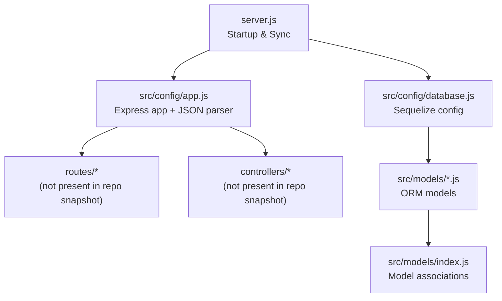
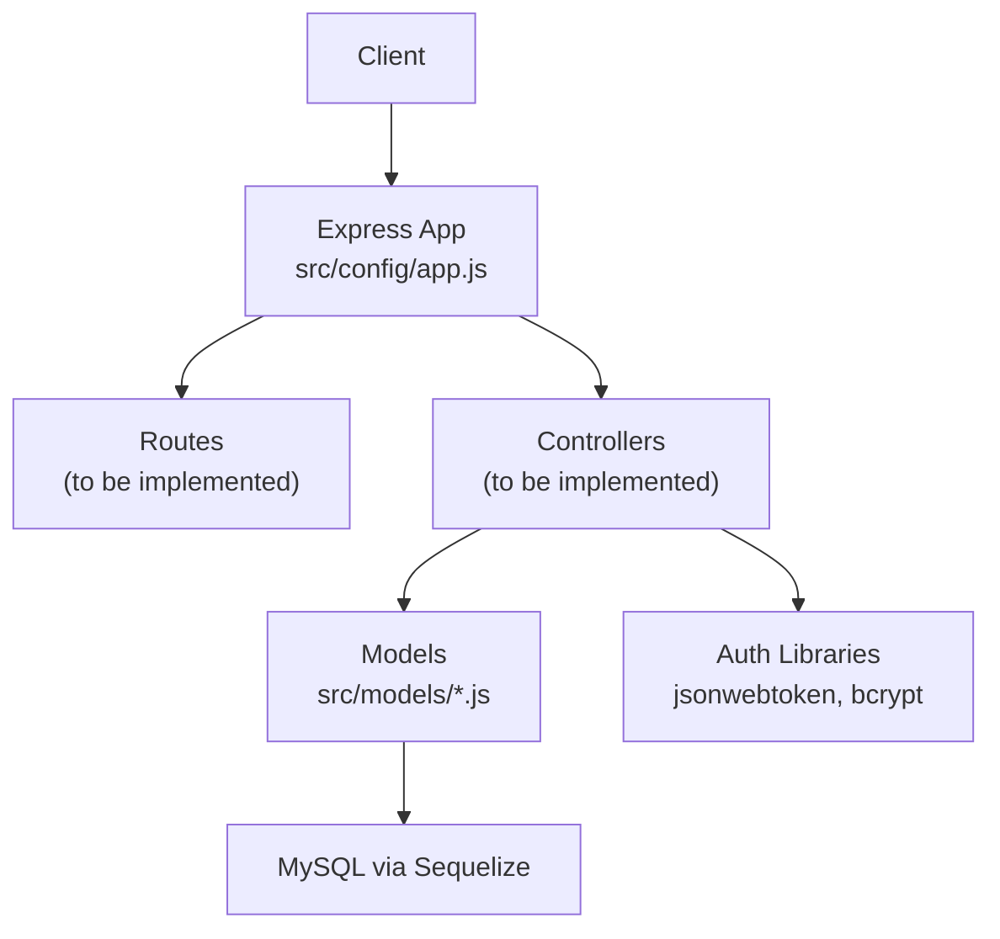
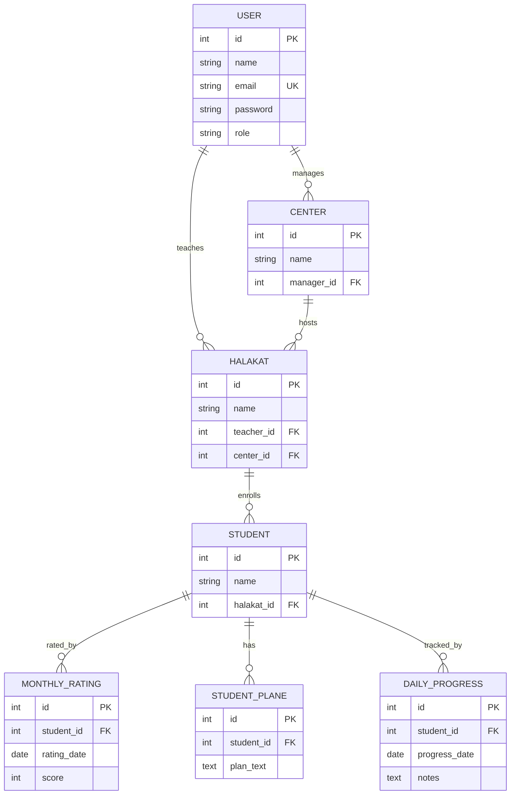
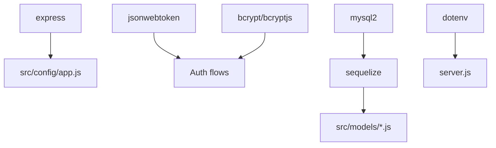

# API Endpoints Reference

<cite>
**Referenced Files in This Document**
- [server.js](file://backend/server.js)
- [app.js](file://backend/src/config/app.js)
- [database.js](file://backend/src/config/database.js)
- [models/index.js](file://backend/src/models/index.js)
- [User.js](file://backend/src/models/User.js)
- [Center.js](file://backend/src/models/Center.js)
- [Halakat.js](file://backend/src/models/Halakat.js)
- [Student.js](file://backend/src/models/Student.js)
- [StudentPlane.js](file://backend/src/models/StudentPlane.js)
- [MonthlyRating.js](file://backend/src/models/MonthlyRating.js)
- [DailyProgress.js](file://backend/src/models/DailyProgress.js)
- [package.json](file://backend/package.json)
</cite>

## Table of Contents
1. [Introduction](#introduction)
2. [Project Structure](#project-structure)
3. [Core Components](#core-components)
4. [Architecture Overview](#architecture-overview)
5. [Detailed Component Analysis](#detailed-component-analysis)
6. [Dependency Analysis](#dependency-analysis)
7. [Performance Considerations](#performance-considerations)
8. [Troubleshooting Guide](#troubleshooting-guide)
9. [Conclusion](#conclusion)
10. [Appendices](#appendices)

## Introduction
This document provides a comprehensive API reference for the Khirocom RESTful service. It focuses on the current base endpoint exposed by the application and outlines the data model relationships that inform the API surface. The base endpoint currently serves a simple health check, while the backend includes a complete Sequelize-based data model covering Users, Centers, Classes (Halakat), Students, Progress tracking, Ratings, and Plans. Authentication libraries are present in the project dependencies, indicating JWT-based authentication is supported but not yet wired into routes.

## Project Structure
The backend follows a layered structure:
- Application bootstrap and server startup
- Express configuration and middleware
- Database configuration and ORM models
- Data models with associations

**Diagram sources**
- [server.js:1-25](file://backend/server.js#L1-L25)
- [app.js:1-12](file://backend/src/config/app.js#L1-L12)
- [database.js](file://backend/src/config/database.js)
- [models/index.js:1-52](file://backend/src/models/index.js#L1-L52)

**Section sources**
- [server.js:1-25](file://backend/server.js#L1-L25)
- [app.js:1-12](file://backend/src/config/app.js#L1-L12)
- [models/index.js:1-52](file://backend/src/models/index.js#L1-L52)

## Core Components
- Base endpoint: GET /
- Express app configured with JSON body parsing
- Database connection via Sequelize with automatic sync
- Authentication libraries available (jsonwebtoken, bcrypt/bcryptjs)

Current base endpoint:
- Method: GET
- Path: /
- Purpose: Health check returning a simple message
- Response: Text/plain

Authentication and Authorization:
- JWT library present in dependencies
- No authentication middleware or protected routes observed in the repository snapshot
- Role-based access control not implemented in the snapshot

**Section sources**
- [app.js:5-9](file://backend/src/config/app.js#L5-L9)
- [server.js:8-23](file://backend/server.js#L8-L23)
- [package.json:1-14](file://backend/package.json#L1-L14)

## Architecture Overview
The system architecture centers around an Express server, Sequelize ORM, and a MySQL-backed relational schema. The current snapshot exposes only the base endpoint; future development should wire routes and controllers to the models.

**Diagram sources**
- [app.js:1-12](file://backend/src/config/app.js#L1-L12)
- [models/index.js:1-52](file://backend/src/models/index.js#L1-L52)
- [package.json:1-14](file://backend/package.json#L1-L14)

## Detailed Component Analysis
This section outlines the conceptual API surface based on the data model relationships. Since routes/controllers are not present in the repository snapshot, the following endpoints are conceptual and intended to guide future implementation aligned with the existing models.

### Data Model Relationships
The models and their relationships define the API domain:
- User manages multiple Centers
- User teaches multiple Halakat (classes)
- Center hosts multiple Halakat
- Halakat contains multiple Students
- Student has multiple MonthlyRatings, StudentPlanes, and DailyProgress entries

**Diagram sources**
- [models/index.js:12-41](file://backend/src/models/index.js#L12-L41)
- [User.js](file://backend/src/models/User.js)
- [Center.js](file://backend/src/models/Center.js)
- [Halakat.js](file://backend/src/models/Halakat.js)
- [Student.js](file://backend/src/models/Student.js)
- [StudentPlane.js](file://backend/src/models/StudentPlane.js)
- [MonthlyRating.js](file://backend/src/models/MonthlyRating.js)
- [DailyProgress.js](file://backend/src/models/DailyProgress.js)

### Authentication and Authorization
- JWT library present in dependencies indicates JWT-based authentication support
- No authentication middleware or protected routes observed in the snapshot
- Role field exists on User model; role-based access control can be enforced via middleware

Recommended approach:
- Add authentication middleware to protect routes
- Enforce roles (e.g., admin, teacher, center-manager) per endpoint
- Use JWT tokens in Authorization header (Bearer token)

**Section sources**
- [package.json:7-8](file://backend/package.json#L7-L8)
- [User.js](file://backend/src/models/User.js)

### Base Endpoint
- Method: GET
- Path: /
- Description: Returns a simple health check message
- Response: 200 OK with text/plain body

**Section sources**
- [app.js:6-9](file://backend/src/config/app.js#L6-L9)

### Conceptual Endpoints
The following endpoints are conceptual and designed to align with the data model. They are not implemented in the current snapshot and serve as a blueprint for future development.

#### Authentication
- POST /auth/register
  - Request: JSON with name, email, password, role
  - Response: Created user object (without password)
  - Errors: 400 (validation), 409 (duplicate email), 500
- POST /auth/login
  - Request: JSON with email, password
  - Response: { token, user: { id, name, email, role } }
  - Errors: 401 (invalid credentials), 500

#### Users
- GET /users
  - Auth: Required
  - Response: Array of users
  - Pagination: Not implemented
- GET /users/:id
  - Auth: Required
  - Response: User object
- PUT /users/:id
  - Auth: Required (self or admin)
  - Response: Updated user
- DELETE /users/:id
  - Auth: Required (admin)
  - Response: Deletion confirmation

#### Centers
- GET /centers
  - Auth: Required
  - Response: Array of centers
- GET /centers/:id
  - Auth: Required
  - Response: Center object
- POST /centers
  - Auth: Required (admin or center-manager)
  - Request: JSON with name, managerId
  - Response: Created center
- PUT /centers/:id
  - Auth: Required (admin or center-manager)
  - Response: Updated center
- DELETE /centers/:id
  - Auth: Required (admin)
  - Response: Deletion confirmation

#### Halakat (Classes)
- GET /halakat
  - Auth: Required
  - Response: Array of halakat
- GET /halakat/:id
  - Auth: Required
  - Response: Halakat object
- POST /halakat
  - Auth: Required (teacher or admin)
  - Request: JSON with name, teacherId, centerId
  - Response: Created halakat
- PUT /halakat/:id
  - Auth: Required (teacher or admin)
  - Response: Updated halakat
- DELETE /halakat/:id
  - Auth: Required (admin)
  - Response: Deletion confirmation

#### Students
- GET /students
  - Auth: Required
  - Response: Array of students
- GET /students/:id
  - Auth: Required
  - Response: Student object
- POST /students
  - Auth: Required (teacher or admin)
  - Request: JSON with name, halakatId
  - Response: Created student
- PUT /students/:id
  - Auth: Required (teacher or admin)
  - Response: Updated student
- DELETE /students/:id
  - Auth: Required (admin)
  - Response: Deletion confirmation

#### Student Plans
- GET /students/:studentId/plans
  - Auth: Required
  - Response: Array of plans
- POST /students/:studentId/plans
  - Auth: Required (teacher or admin)
  - Request: JSON with planText
  - Response: Created plan
- PUT /students/:studentId/plans/:planId
  - Auth: Required (teacher or admin)
  - Response: Updated plan
- DELETE /students/:studentId/plans/:planId
  - Auth: Required (admin)
  - Response: Deletion confirmation

#### Monthly Ratings
- GET /students/:studentId/ratings
  - Auth: Required
  - Response: Array of ratings
- POST /students/:studentId/ratings
  - Auth: Required (teacher or admin)
  - Request: JSON with ratingDate, score
  - Response: Created rating
- PUT /students/:studentId/ratings/:ratingId
  - Auth: Required (teacher or admin)
  - Response: Updated rating
- DELETE /students/:studentId/ratings/:ratingId
  - Auth: Required (admin)
  - Response: Deletion confirmation

#### Daily Progress
- GET /students/:studentId/progress
  - Auth: Required
  - Response: Array of progress entries
- POST /students/:studentId/progress
  - Auth: Required (teacher or admin)
  - Request: JSON with progressDate, notes
  - Response: Created progress entry
- PUT /students/:studentId/progress/:progressId
  - Auth: Required (teacher or admin)
  - Response: Updated progress entry
- DELETE /students/:studentId/progress/:progressId
  - Auth: Required (admin)
  - Response: Deletion confirmation

### Request/Response Examples
Note: These examples illustrate typical JSON payloads for conceptual endpoints. Replace with actual route paths after implementation.

- Register a new user
  - POST /auth/register
  - Request: { "name": "...", "email": "...", "password": "...", "role": "..." }
  - Response: { "id": 1, "name": "...", "email": "...", "role": "..." }

- Login and receive JWT
  - POST /auth/login
  - Request: { "email": "...", "password": "..." }
  - Response: { "token": "...", "user": { "id": 1, "name": "...", "email": "...", "role": "..." } }

- Create a center
  - POST /centers
  - Headers: Authorization: Bearer <token>
  - Request: { "name": "...", "managerId": 1 }
  - Response: { "id": 1, "name": "...", "managerId": 1 }

- Create a student
  - POST /students
  - Headers: Authorization: Bearer <token>
  - Request: { "name": "...", "halakatId": 1 }
  - Response: { "id": 1, "name": "...", "halakatId": 1 }

- Add a monthly rating
  - POST /students/1/ratings
  - Headers: Authorization: Bearer <token>
  - Request: { "ratingDate": "YYYY-MM-DD", "score": 5 }
  - Response: { "id": 1, "studentId": 1, "ratingDate": "YYYY-MM-DD", "score": 5 }

- Add daily progress
  - POST /students/1/progress
  - Headers: Authorization: Bearer <token>
  - Request: { "progressDate": "YYYY-MM-DD", "notes": "..." }
  - Response: { "id": 1, "studentId": 1, "progressDate": "YYYY-MM-DD", "notes": "..." }

### Error Handling
Common HTTP statuses and scenarios:
- 200 OK: Successful GET, PUT, DELETE
- 201 Created: Successful POST
- 400 Bad Request: Validation errors, malformed JSON
- 401 Unauthorized: Missing/invalid JWT
- 403 Forbidden: Insufficient permissions (role-based)
- 404 Not Found: Resource not found
- 409 Conflict: Duplicate resource (e.g., email)
- 500 Internal Server Error: Unexpected server errors

Headers:
- Content-Type: application/json
- Authorization: Bearer <JWT_TOKEN>

Rate Limiting and Pagination:
- Not implemented in the current snapshot
- Recommended: Implement rate limiting per IP and per token; add pagination query params (page, limit) for list endpoints

API Versioning:
- Not implemented in the current snapshot
- Recommended: Use path-based versioning (/v1/users) or Accept headers

**Section sources**
- [package.json:1-14](file://backend/package.json#L1-L14)

## Dependency Analysis
External dependencies relevant to API functionality:
- express: Web framework
- jsonwebtoken: JWT signing/verification
- bcrypt/bcryptjs: Password hashing
- sequelize/mysql2: ORM and MySQL driver
- dotenv: Environment configuration

**Diagram sources**
- [package.json:1-14](file://backend/package.json#L1-L14)
- [app.js:1-12](file://backend/src/config/app.js#L1-L12)
- [server.js:1-25](file://backend/server.js#L1-L25)

**Section sources**
- [package.json:1-14](file://backend/package.json#L1-L14)

## Performance Considerations
- Database indexing: Ensure foreign keys and frequently queried columns are indexed
- Query optimization: Use eager loading for associations to avoid N+1 queries
- Pagination: Implement page and limit parameters for list endpoints
- Caching: Consider caching read-heavy resources (e.g., static lists)
- Connection pooling: Configure Sequelize pool settings appropriately

## Troubleshooting Guide
- Server fails to start
  - Verify database credentials and connectivity
  - Check port availability
  - Review Sequelize sync logs
- Database sync issues
  - Confirm model definitions and associations
  - Review migration conflicts
- Authentication failures
  - Validate JWT secret and expiration
  - Ensure Authorization header format (Bearer token)
- CORS issues
  - Add CORS middleware if integrating from browsers

**Section sources**
- [server.js:8-23](file://backend/server.js#L8-L23)

## Conclusion
The Khirocom backend currently exposes a minimal base endpoint and includes a robust data model ready to power a comprehensive API. Future development should focus on implementing routes and controllers, adding authentication and authorization middleware, and establishing standardized request/response schemas, pagination, and error handling.

## Appendices
- Client Implementation Guidelines
  - Use HTTPS in production
  - Store JWT securely (HttpOnly cookies or secure storage)
  - Implement retry with exponential backoff
  - Log requests/responses for debugging
- Testing Strategies
  - Unit tests for controllers and services
  - Integration tests for endpoints
  - Load tests for critical endpoints
  - Mock external dependencies (e.g., payment providers)
- Debugging Tools
  - Enable logging for requests and errors
  - Use structured logging (JSON format)
  - Monitor database query performance
  - Set up error tracking (e.g., Sentry)