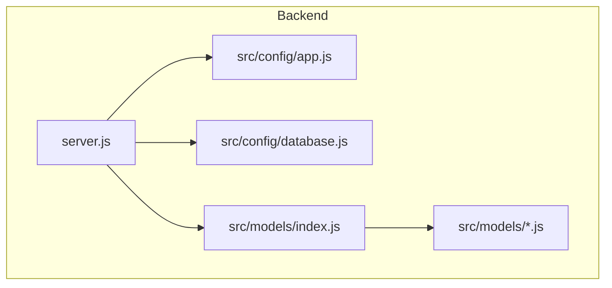
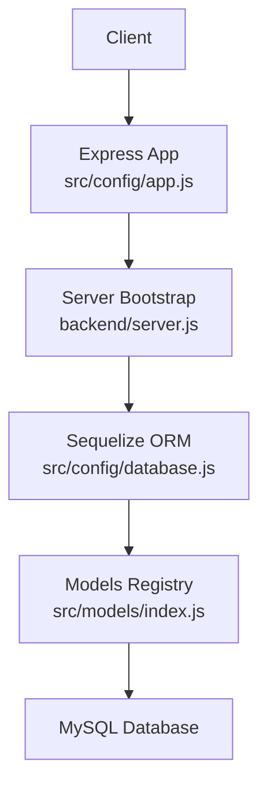
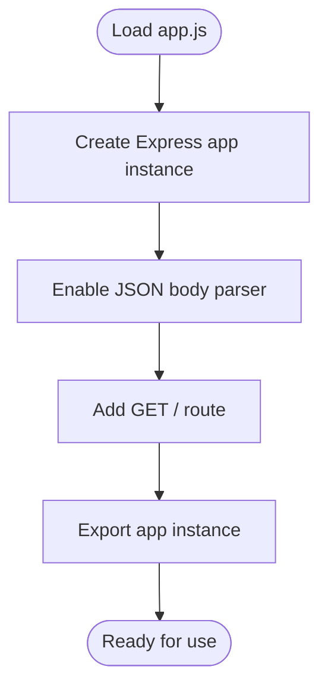
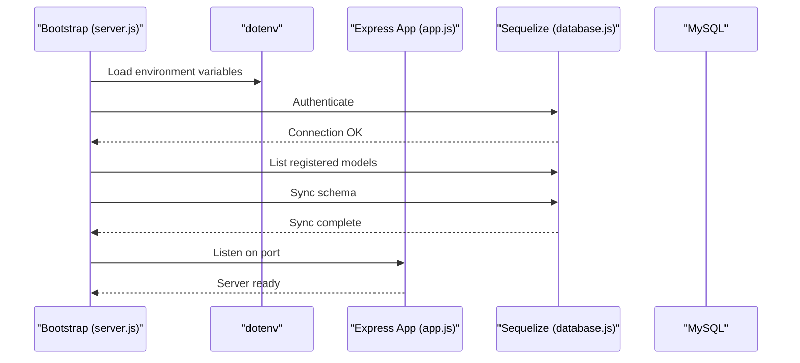
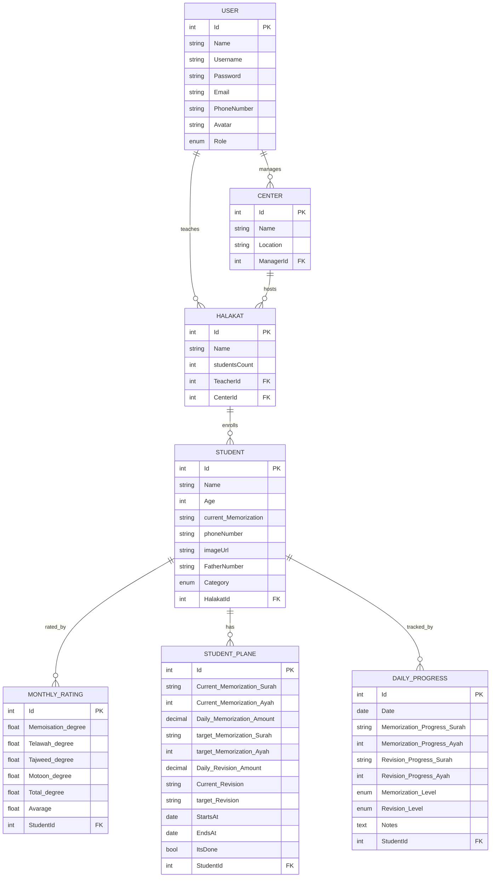
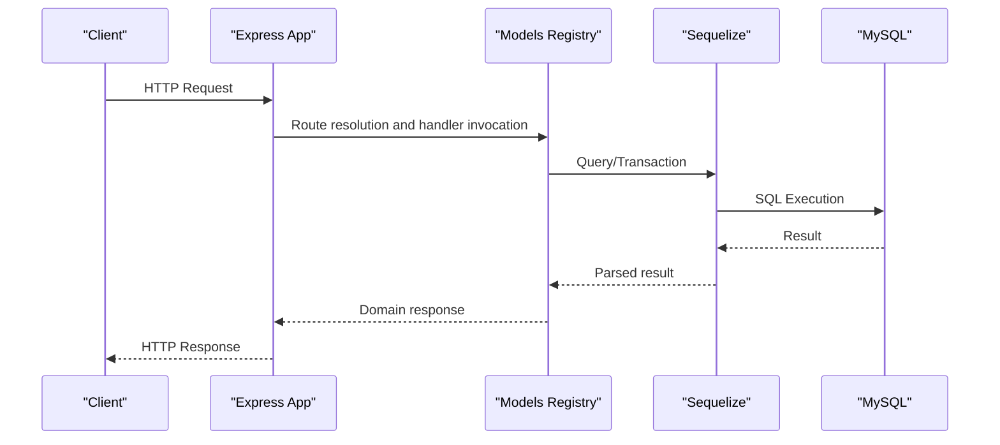
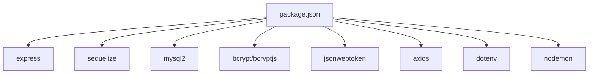

# Application Architecture

<cite>
**Referenced Files in This Document**
- [server.js](file://backend/server.js)
- [app.js](file://backend/src/config/app.js)
- [database.js](file://backend/src/config/database.js)
- [models/index.js](file://backend/src/models/index.js)
- [User.js](file://backend/src/models/User.js)
- [Center.js](file://backend/src/models/Center.js)
- [Halakat.js](file://backend/src/models/Halakat.js)
- [Student.js](file://backend/src/models/Student.js)
- [StudentPlane.js](file://backend/src/models/StudentPlane.js)
- [MonthlyRating.js](file://backend/src/models/MonthlyRating.js)
- [DailyProgress.js](file://backend/src/models/DailyProgress.js)
- [package.json](file://backend/package.json)
</cite>

## Table of Contents
1. [Introduction](#introduction)
2. [Project Structure](#project-structure)
3. [Core Components](#core-components)
4. [Architecture Overview](#architecture-overview)
5. [Detailed Component Analysis](#detailed-component-analysis)
6. [Dependency Analysis](#dependency-analysis)
7. [Performance Considerations](#performance-considerations)
8. [Troubleshooting Guide](#troubleshooting-guide)
9. [Conclusion](#conclusion)
10. [Appendices](#appendices)

## Introduction
This document describes the application architecture of the Khirocom system with a focus on the overall design and component organization. The backend follows an MVC-like structure with clear separation between configuration, models, and the runtime application. It integrates Express.js for routing and middleware, Sequelize ORM for data persistence, and MySQL as the relational database. The document explains the bootstrapping process, model registry and relationships, and the data flow from incoming requests through the application to the database. It also covers infrastructure requirements, scalability considerations, deployment topology, cross-cutting concerns such as authentication and authorization, and guidance for extending the architecture.

## Project Structure
The backend is organized into configuration, models, and application entry points. The Express application is configured in a dedicated module and exported for use by the server bootstrap script. Models are defined as Sequelize classes and registered in a central index that defines associations. Environment variables are loaded via dotenv and consumed by both the Express app configuration and the database connection.

**Diagram sources**
- [server.js:1-25](file://backend/server.js#L1-L25)
- [app.js:1-12](file://backend/src/config/app.js#L1-L12)
- [database.js:1-15](file://backend/src/config/database.js#L1-L15)
- [models/index.js:1-52](file://backend/src/models/index.js#L1-L52)

**Section sources**
- [server.js:1-25](file://backend/server.js#L1-L25)
- [app.js:1-12](file://backend/src/config/app.js#L1-L12)
- [database.js:1-15](file://backend/src/config/database.js#L1-L15)
- [models/index.js:1-52](file://backend/src/models/index.js#L1-L52)

## Core Components
- Express application: Configured in a dedicated module with JSON body parsing and a root endpoint returning a simple response.
- Database connection: Created via Sequelize using environment variables for credentials and connection parameters.
- Model registry: Centralized index imports all models and defines associations between them.
- Bootstrapping: The server initializes the database connection, logs registered models, synchronizes the schema, and starts the Express server.

Key responsibilities:
- server.js: Orchestrates startup, database health check, schema synchronization, and server listen.
- app.js: Creates and exports the Express app instance with middleware and base route.
- database.js: Establishes the Sequelize connection to MySQL.
- models/index.js: Registers models and defines foreign key relationships.

**Section sources**
- [server.js:1-25](file://backend/server.js#L1-L25)
- [app.js:1-12](file://backend/src/config/app.js#L1-L12)
- [database.js:1-15](file://backend/src/config/database.js#L1-L15)
- [models/index.js:1-52](file://backend/src/models/index.js#L1-L52)

## Architecture Overview
The system follows a layered architecture:
- Presentation/HTTP Layer: Express app handles incoming HTTP requests and routes them to appropriate handlers.
- Data Access Layer: Sequelize manages database connections, migrations, and model interactions.
- Domain/Data Layer: Models define entity schemas and relationships; the central index registers them with Sequelize.

**Diagram sources**
- [server.js:1-25](file://backend/server.js#L1-L25)
- [app.js:1-12](file://backend/src/config/app.js#L1-L12)
- [database.js:1-15](file://backend/src/config/database.js#L1-L15)
- [models/index.js:1-52](file://backend/src/models/index.js#L1-L52)

## Detailed Component Analysis

### Express Application Configuration
The Express application is created and exported from a configuration module. It enables JSON parsing and exposes a root endpoint. This module acts as the foundation for all routes and middleware to be mounted later.

**Diagram sources**
- [app.js:1-12](file://backend/src/config/app.js#L1-L12)

**Section sources**
- [app.js:1-12](file://backend/src/config/app.js#L1-L12)

### Database Connection and Bootstrapping
The server bootstrap performs:
- Load environment variables via dotenv.
- Authenticate with the database using Sequelize.
- Log registered models from the Sequelize registry.
- Synchronize the schema with the database.
- Start the Express server on the configured port.

**Diagram sources**
- [server.js:1-25](file://backend/server.js#L1-L25)
- [database.js:1-15](file://backend/src/config/database.js#L1-L15)
- [app.js:1-12](file://backend/src/config/app.js#L1-L12)

**Section sources**
- [server.js:1-25](file://backend/server.js#L1-L25)
- [database.js:1-15](file://backend/src/config/database.js#L1-L15)

### Model Registry and Associations
The model registry imports all domain models and defines associations among them. These associations reflect the business relationships:
- One-to-many relationships between users and centers, halakat, and student planes.
- Many-to-one relationships linking halakat to users and centers.
- One-to-many relationships between halakat and students.
- One-to-many relationships between students and monthly ratings, daily progress, and student planes.

**Diagram sources**
- [models/index.js:1-52](file://backend/src/models/index.js#L1-L52)
- [User.js:1-59](file://backend/src/models/User.js#L1-L59)
- [Center.js:1-39](file://backend/src/models/Center.js#L1-L39)
- [Halakat.js:1-47](file://backend/src/models/Halakat.js#L1-L47)
- [Student.js:1-67](file://backend/src/models/Student.js#L1-L67)
- [StudentPlane.js:1-76](file://backend/src/models/StudentPlane.js#L1-L76)
- [MonthlyRating.js:1-70](file://backend/src/models/MonthlyRating.js#L1-L70)
- [DailyProgress.js:1-64](file://backend/src/models/DailyProgress.js#L1-L64)

**Section sources**
- [models/index.js:1-52](file://backend/src/models/index.js#L1-L52)
- [User.js:1-59](file://backend/src/models/User.js#L1-L59)
- [Center.js:1-39](file://backend/src/models/Center.js#L1-L39)
- [Halakat.js:1-47](file://backend/src/models/Halakat.js#L1-L47)
- [Student.js:1-67](file://backend/src/models/Student.js#L1-L67)
- [StudentPlane.js:1-76](file://backend/src/models/StudentPlane.js#L1-L76)
- [MonthlyRating.js:1-70](file://backend/src/models/MonthlyRating.js#L1-L70)
- [DailyProgress.js:1-64](file://backend/src/models/DailyProgress.js#L1-L64)

### Data Flow Architecture
The typical request lifecycle:
- Client sends an HTTP request to the Express app.
- The app processes the request through middleware and routes.
- Controllers (not present in the current structure) would handle business logic and orchestrate model operations.
- Models (via Sequelize) persist or retrieve data from MySQL.
- Responses are sent back to the client.

[No sources needed since this diagram shows conceptual workflow, not actual code structure]

## Dependency Analysis
External dependencies include Express for web framework, Sequelize for ORM, MySQL driver, bcrypt for password hashing, jsonwebtoken for JWT operations, axios for HTTP client needs, dotenv for environment variable loading, and nodemon for development.

**Diagram sources**
- [package.json:1-14](file://backend/package.json#L1-L14)

**Section sources**
- [package.json:1-14](file://backend/package.json#L1-L14)

## Performance Considerations
- Connection pooling: Configure pool settings in the Sequelize constructor for production environments to manage concurrent connections efficiently.
- Query optimization: Use eager loading and selective field projections to reduce payload sizes and network overhead.
- Indexing: Ensure foreign keys and frequently queried columns are indexed in MySQL.
- Caching: Introduce a caching layer (e.g., Redis) for read-heavy endpoints to reduce database load.
- Asynchronous processing: Offload long-running tasks to background jobs using a queue system.
- Monitoring: Instrument queries and slow logs to identify bottlenecks.

[No sources needed since this section provides general guidance]

## Troubleshooting Guide
Common startup and runtime issues:
- Database connectivity failures during authentication: Verify environment variables for host, port, database name, username, and password. Confirm the database service is reachable.
- Schema synchronization errors: Review model definitions and associations for constraint mismatches. Use migration scripts for controlled schema changes instead of altering automatically.
- Port conflicts: Change the listening port via environment configuration if the default port is in use.
- Missing environment variables: Ensure dotenv loads variables correctly and that the environment file exists and is properly formatted.

Operational checks:
- Confirm that the server logs indicate successful database authentication and schema sync.
- Validate that the registered models list matches the expected set after initialization.

**Section sources**
- [server.js:1-25](file://backend/server.js#L1-L25)
- [database.js:1-15](file://backend/src/config/database.js#L1-L15)

## Conclusion
Khirocom’s backend employs a clean separation of concerns with an Express application, a centralized model registry, and a robust database connection managed by Sequelize. The current structure supports straightforward request handling and model-driven persistence. To evolve toward a full MVC implementation, introduce dedicated controllers and routes, implement authentication and authorization middleware, and adopt migrations for schema management. The guidance provided here offers a practical blueprint for extending the system while maintaining clarity and scalability.

## Appendices

### Technology Stack Integration Points
- Express: Web framework and middleware pipeline.
- Sequelize: ORM for model definitions, associations, and database interactions.
- MySQL: Relational database with foreign key constraints enforced by Sequelize.
- Environment management: dotenv for configuration via environment variables.
- Security: bcrypt for password hashing and jsonwebtoken for token-based authentication (to be integrated).
- HTTP client: axios for outbound HTTP calls (to be integrated).
- Development: nodemon for automatic restarts during development.

**Section sources**
- [package.json:1-14](file://backend/package.json#L1-L14)
- [database.js:1-15](file://backend/src/config/database.js#L1-L15)
- [models/index.js:1-52](file://backend/src/models/index.js#L1-L52)

### Deployment Topology and Scalability
- Single-instance deployment: Suitable for development and small-scale usage.
- Horizontal scaling: Run multiple instances behind a load balancer; ensure shared database access and stateless application servers.
- Database tier: Use a managed MySQL service or a high-availability cluster for production reliability.
- Caching tier: Add Redis for session storage and caching to improve throughput.
- Observability: Add metrics, structured logging, and tracing to monitor performance and diagnose issues.

[No sources needed since this section provides general guidance]

### Cross-Cutting Concerns
- Authentication: Integrate a middleware to validate JWT tokens on protected routes.
- Authorization: Enforce role-based access control (RBAC) using user roles defined in the User model.
- Error handling: Implement centralized error handling middleware to standardize responses and log errors.
- Validation: Add input validation and sanitization for request payloads.
- Logging: Use structured logging for audit trails and operational insights.

[No sources needed since this section provides general guidance]

### Extensibility and Adding New Features
- Add new models: Define a new Sequelize model and register it in the models index with appropriate associations.
- Introduce routes and controllers: Create route modules and controller functions to encapsulate business logic and coordinate model operations.
- Middleware: Add request preprocessing, authentication, and response formatting middleware as needed.
- Migrations: Prefer Sequelize migrations for schema changes to maintain consistency across environments.
- Testing: Add unit and integration tests for models, routes, and controllers to ensure reliability as the system grows.

[No sources needed since this section provides general guidance]