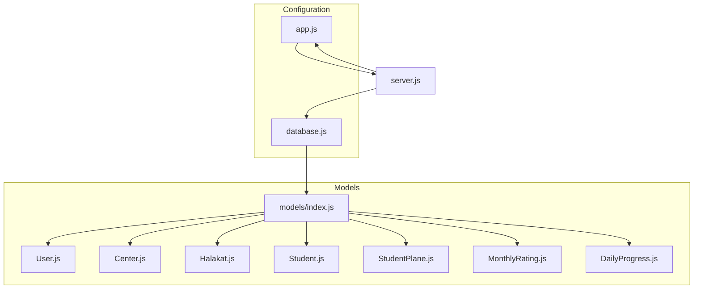
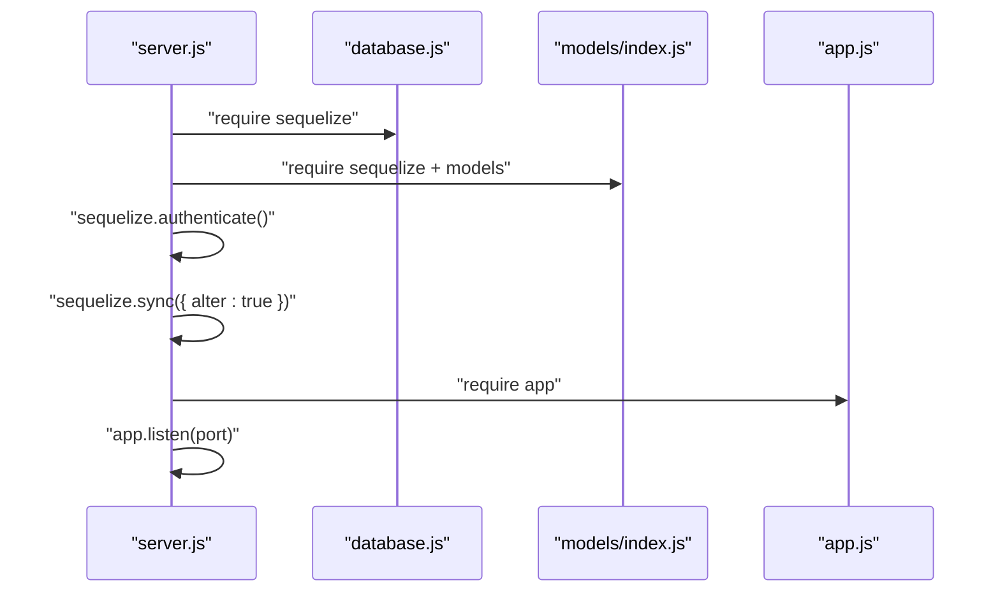
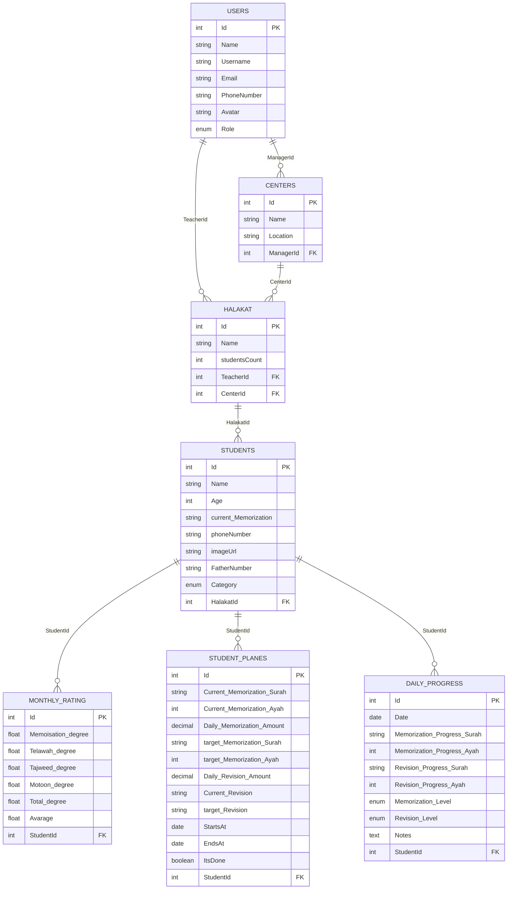
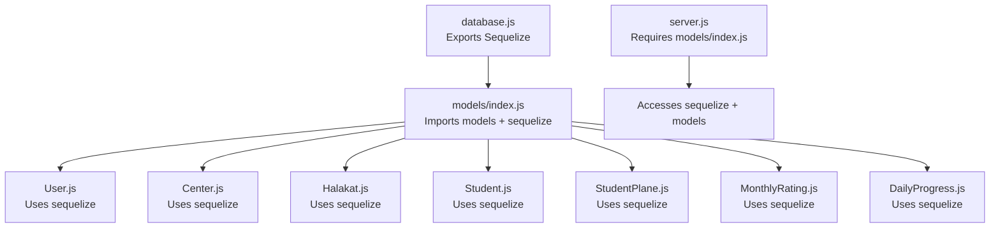
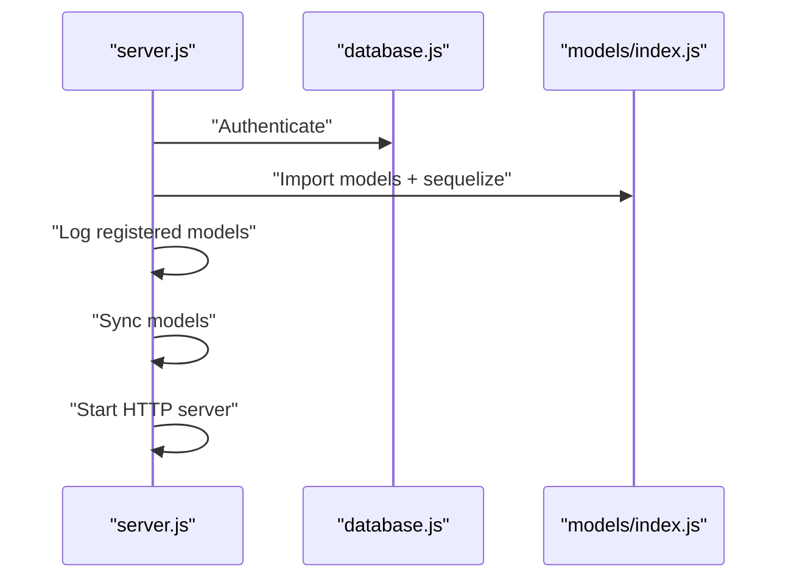
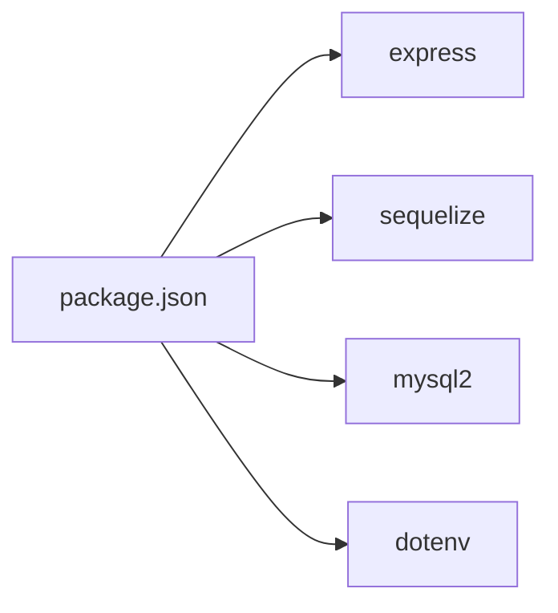

# Component Relationships

<cite>
**Referenced Files in This Document**
- [server.js](file://backend/server.js)
- [app.js](file://backend/src/config/app.js)
- [database.js](file://backend/src/config/database.js)
- [models/index.js](file://backend/src/models/index.js)
- [User.js](file://backend/src/models/User.js)
- [Center.js](file://backend/src/models/Center.js)
- [Halakat.js](file://backend/src/models/Halakat.js)
- [Student.js](file://backend/src/models/Student.js)
- [StudentPlane.js](file://backend/src/models/StudentPlane.js)
- [MonthlyRating.js](file://backend/src/models/MonthlyRating.js)
- [DailyProgress.js](file://backend/src/models/DailyProgress.js)
- [package.json](file://backend/package.json)
</cite>

## Table of Contents
1. [Introduction](#introduction)
2. [Project Structure](#project-structure)
3. [Core Components](#core-components)
4. [Architecture Overview](#architecture-overview)
5. [Detailed Component Analysis](#detailed-component-analysis)
6. [Dependency Analysis](#dependency-analysis)
7. [Performance Considerations](#performance-considerations)
8. [Troubleshooting Guide](#troubleshooting-guide)
9. [Conclusion](#conclusion)

## Introduction
This document explains the component relationships and dependencies in the Khirocom application. It focuses on the hierarchical relationships among User, Center, Halakat, and related entities, how components interact through foreign key relationships and associations, and how the model registry system initializes and connects components. It also documents dependency injection patterns for database connections and model instances, entity relationship diagrams, and how changes propagate across components. Finally, it addresses circular dependency prevention and component lifecycle management.

## Project Structure
The backend follows a layered architecture:
- Configuration: database connection and Express app initialization
- Models: Sequelize models and their inter-model associations
- Entry point: server bootstrapping and synchronization

**Diagram sources**
- [server.js:1-25](file://backend/server.js#L1-L25)
- [app.js:1-12](file://backend/src/config/app.js#L1-L12)
- [database.js:1-15](file://backend/src/config/database.js#L1-L15)
- [models/index.js:1-52](file://backend/src/models/index.js#L1-L52)

**Section sources**
- [server.js:1-25](file://backend/server.js#L1-L25)
- [app.js:1-12](file://backend/src/config/app.js#L1-L12)
- [database.js:1-15](file://backend/src/config/database.js#L1-L15)
- [models/index.js:1-52](file://backend/src/models/index.js#L1-L52)

## Core Components
- Database connection: centralized in the configuration module and exported for reuse by models and server.
- Model registry: a central index file that imports all models and defines their associations.
- Application server: initializes the Express app, authenticates the database, synchronizes models, and starts the HTTP server.

Key responsibilities:
- database.js: creates the Sequelize instance with environment-driven configuration.
- models/index.js: imports models and defines foreign key relationships and associations.
- server.js: orchestrates startup, database authentication, model synchronization, and HTTP server lifecycle.

**Section sources**
- [database.js:1-15](file://backend/src/config/database.js#L1-L15)
- [models/index.js:1-52](file://backend/src/models/index.js#L1-L52)
- [server.js:1-25](file://backend/server.js#L1-L25)

## Architecture Overview
The system uses a model registry pattern with explicit association definitions. The server coordinates lifecycle events and ensures models are synchronized with the database.

**Diagram sources**
- [server.js:8-23](file://backend/server.js#L8-L23)
- [database.js:4-14](file://backend/src/config/database.js#L4-L14)
- [models/index.js:1-52](file://backend/src/models/index.js#L1-L52)
- [app.js:1-12](file://backend/src/config/app.js#L1-L12)

## Detailed Component Analysis

### Model Registry and Associations
The model registry imports all models and defines associations. Associations are declared using belongsTo and hasMany with explicit foreign keys and aliases. This establishes a clear hierarchy:
- User ↔ Center (one-to-many)
- User ↔ Halakat (one-to-many)
- Center ↔ Halakat (one-to-many)
- Halakat ↔ Student (one-to-many)
- Student ↔ MonthlyRating (one-to-many)
- Student ↔ StudentPlane (one-to-many)
- Student ↔ DailyProgress (one-to-many)

**Diagram sources**
- [models/index.js:14-40](file://backend/src/models/index.js#L14-L40)
- [User.js:6-57](file://backend/src/models/User.js#L6-L57)
- [Center.js:6-36](file://backend/src/models/Center.js#L6-L36)
- [Halakat.js:6-44](file://backend/src/models/Halakat.js#L6-L44)
- [Student.js:6-65](file://backend/src/models/Student.js#L6-L65)
- [MonthlyRating.js:8-66](file://backend/src/models/MonthlyRating.js#L8-L66)
- [StudentPlane.js:6-73](file://backend/src/models/StudentPlane.js#L6-L73)
- [DailyProgress.js:6-62](file://backend/src/models/DailyProgress.js#L6-L62)

**Section sources**
- [models/index.js:14-40](file://backend/src/models/index.js#L14-L40)
- [User.js:6-57](file://backend/src/models/User.js#L6-L57)
- [Center.js:6-36](file://backend/src/models/Center.js#L6-L36)
- [Halakat.js:6-44](file://backend/src/models/Halakat.js#L6-L44)
- [Student.js:6-65](file://backend/src/models/Student.js#L6-L65)
- [MonthlyRating.js:8-66](file://backend/src/models/MonthlyRating.js#L8-L66)
- [StudentPlane.js:6-73](file://backend/src/models/StudentPlane.js#L6-L73)
- [DailyProgress.js:6-62](file://backend/src/models/DailyProgress.js#L6-L62)

### Dependency Injection Patterns
- Database connection: The database configuration module exports a Sequelize instance. Models import this instance to initialize their definitions. The server imports the model registry, which re-exports the same Sequelize instance, enabling centralized database access.
- Model instances: The model registry exports both the Sequelize instance and model classes. This allows the server to access both the connection and the model classes for synchronization and runtime operations.

**Diagram sources**
- [database.js:4-14](file://backend/src/config/database.js#L4-L14)
- [models/index.js:1-52](file://backend/src/models/index.js#L1-L52)
- [server.js:4](file://backend/server.js#L4)

**Section sources**
- [database.js:4-14](file://backend/src/config/database.js#L4-L14)
- [models/index.js:1-52](file://backend/src/models/index.js#L1-L52)
- [server.js:4](file://backend/server.js#L4)

### Component Lifecycle Management
- Startup: The server authenticates the database, logs registered models, synchronizes models with the database, and starts the HTTP server.
- Synchronization: The server uses a sync option to align the database schema with the model definitions.
- Runtime: Models are ready for use after synchronization; associations enable navigation across related records.

**Diagram sources**
- [server.js:8-23](file://backend/server.js#L8-L23)
- [database.js:4-14](file://backend/src/config/database.js#L4-L14)
- [models/index.js:42-51](file://backend/src/models/index.js#L42-L51)

**Section sources**
- [server.js:8-23](file://backend/server.js#L8-L23)

### How Changes in One Component Affect Related Components
- Adding a new field to a model requires updating the model definition and running synchronization. This change propagates to related components through associations (e.g., adding a field to Student affects MonthlyRating, StudentPlane, and DailyProgress).
- Introducing a new model requires importing it in the model registry and defining associations. This enables downstream components to navigate relationships seamlessly.
- Foreign key changes impact referential integrity and must be reflected in both the model definition and the association declarations.

**Section sources**
- [models/index.js:14-40](file://backend/src/models/index.js#L14-L40)
- [Student.js:50-57](file://backend/src/models/Student.js#L50-L57)
- [MonthlyRating.js:55-58](file://backend/src/models/MonthlyRating.js#L55-L58)
- [StudentPlane.js:58-65](file://backend/src/models/StudentPlane.js#L58-L65)
- [DailyProgress.js:47-54](file://backend/src/models/DailyProgress.js#L47-L54)

### Circular Dependency Prevention
- The model registry imports models and defines associations centrally, avoiding direct cross-imports between models.
- Models import the shared Sequelize instance from the configuration module, preventing circular references during initialization.
- The server imports the model registry rather than individual models, ensuring a single point of initialization and reducing coupling.

**Section sources**
- [models/index.js:1-11](file://backend/src/models/index.js#L1-L11)
- [database.js:2](file://backend/src/config/database.js#L2)
- [server.js:4](file://backend/server.js#L4)

## Dependency Analysis
The application’s dependencies are straightforward and well-contained:
- Express powers the HTTP server.
- Sequelize manages database connectivity and ORM features.
- MySQL2 provides the database driver.
- Dotenv loads environment variables for database credentials.

**Diagram sources**
- [package.json:2-12](file://backend/package.json#L2-L12)

**Section sources**
- [package.json:2-12](file://backend/package.json#L2-L12)

## Performance Considerations
- Use eager loading for associations when fetching related data to minimize N+1 queries.
- Prefer batch operations for bulk inserts/updates to reduce round trips.
- Monitor query logs and optimize indexes on foreign key columns.
- Keep synchronization in development mode; in production, manage schema changes via migrations.

## Troubleshooting Guide
- Database connection failures: Verify environment variables and network connectivity; ensure the database service is reachable.
- Model synchronization errors: Review association definitions and foreign key constraints; confirm referential integrity.
- Authentication failures: Confirm credentials and permissions; check firewall and access policies.
- Server startup errors: Inspect logs for detailed error messages and stack traces.

**Section sources**
- [server.js:20-22](file://backend/server.js#L20-L22)
- [database.js:4-14](file://backend/src/config/database.js#L4-L14)

## Conclusion
Khirocom employs a clean, registry-driven model architecture with explicit associations and centralized database configuration. The server coordinates lifecycle events, ensuring models are synchronized and ready for use. The design prevents circular dependencies and supports scalable growth by introducing new models and associations through the central registry. By following best practices for associations, synchronization, and performance, the system remains maintainable and efficient.