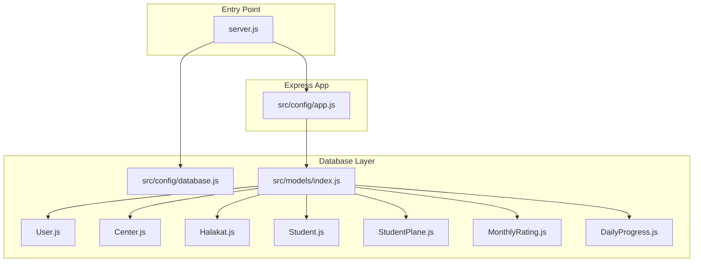
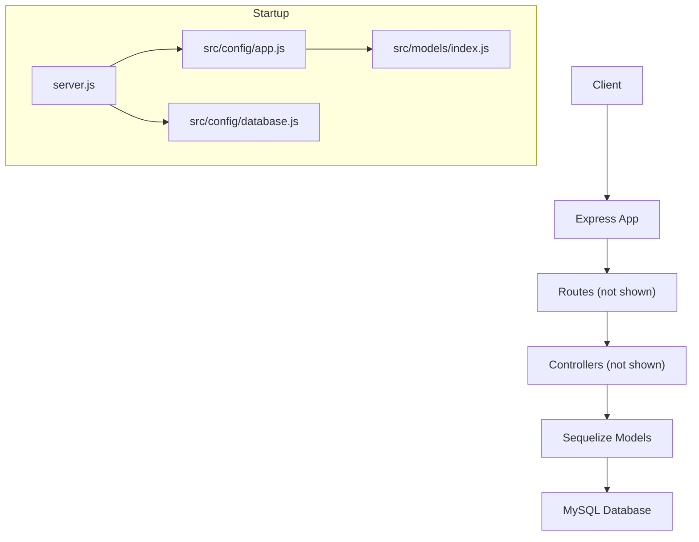
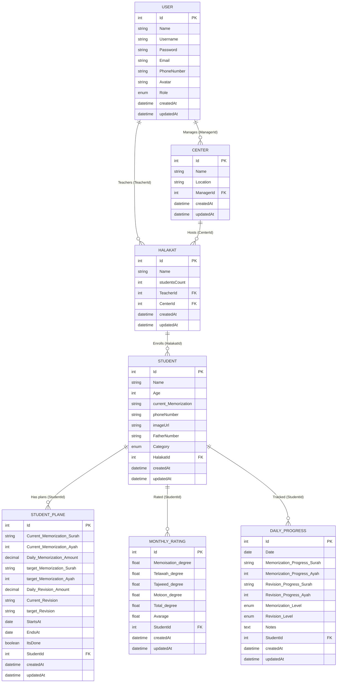
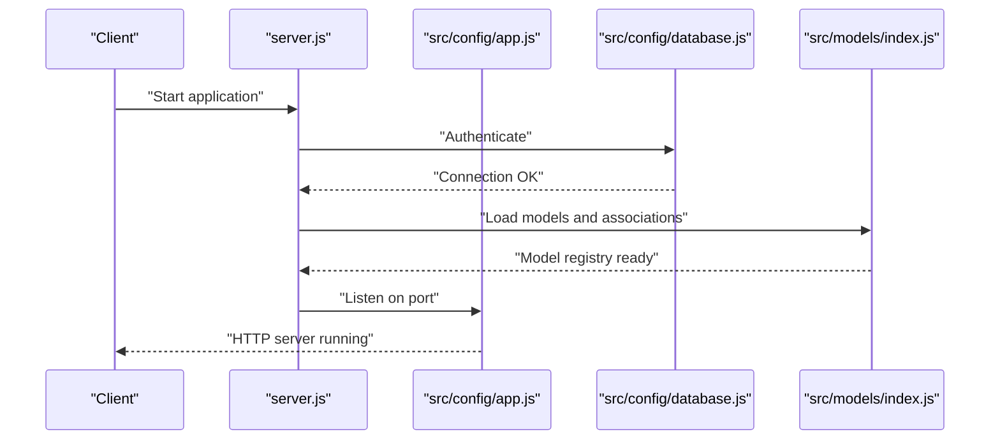
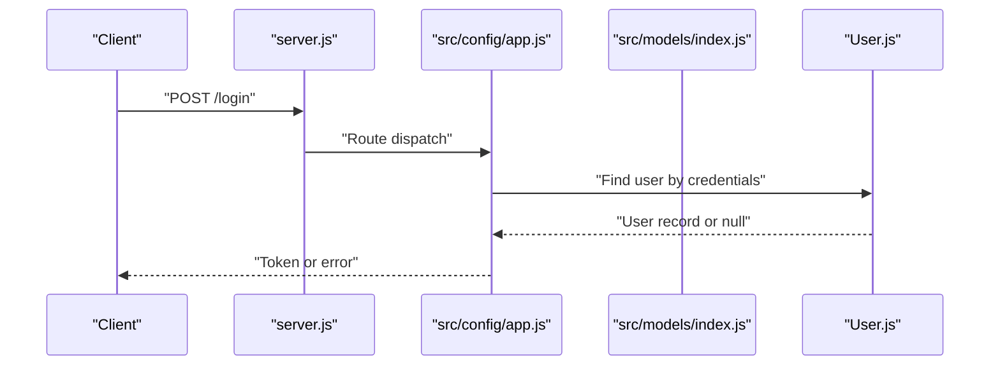
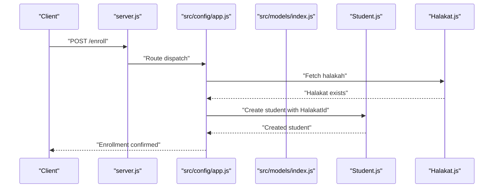
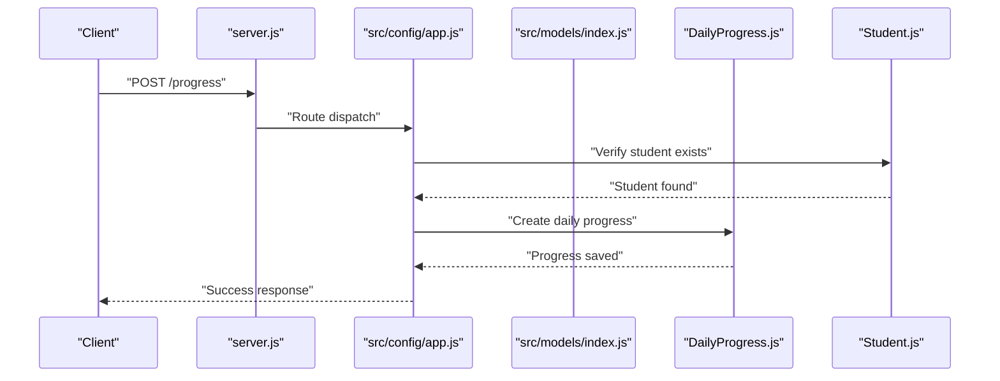
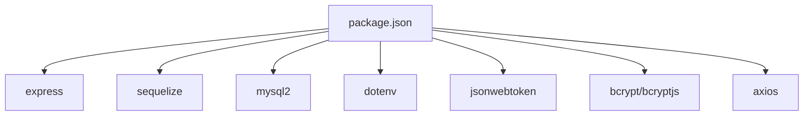

# Data Flow Architecture

<cite>
**Referenced Files in This Document**
- [server.js](file://backend/server.js)
- [app.js](file://backend/src/config/app.js)
- [database.js](file://backend/src/config/database.js)
- [models/index.js](file://backend/src/models/index.js)
- [User.js](file://backend/src/models/User.js)
- [Student.js](file://backend/src/models/Student.js)
- [DailyProgress.js](file://backend/src/models/DailyProgress.js)
- [MonthlyRating.js](file://backend/src/models/MonthlyRating.js)
- [Center.js](file://backend/src/models/Center.js)
- [Halakat.js](file://backend/src/models/Halakat.js)
- [StudentPlane.js](file://backend/src/models/StudentPlane.js)
- [package.json](file://backend/package.json)
</cite>

## Table of Contents
1. [Introduction](#introduction)
2. [Project Structure](#project-structure)
3. [Core Components](#core-components)
4. [Architecture Overview](#architecture-overview)
5. [Detailed Component Analysis](#detailed-component-analysis)
6. [Dependency Analysis](#dependency-analysis)
7. [Performance Considerations](#performance-considerations)
8. [Troubleshooting Guide](#troubleshooting-guide)
9. [Conclusion](#conclusion)

## Introduction
This document explains the data flow architecture of the Khirocom application. It covers the end-to-end request-response lifecycle from incoming HTTP requests through Express routes and controllers to Sequelize ORM-backed model operations. It also documents asynchronous patterns using Promises, error propagation across layers, and practical performance considerations for optimizing data flow and caching strategies.

## Project Structure
The backend follows a layered architecture:
- Entry point initializes the Express app and connects to the database via Sequelize.
- Models define the domain entities and associations.
- Routes define endpoints and delegate to controllers.
- Controllers orchestrate business logic and interact with models.
- Middleware handles cross-cutting concerns (e.g., JSON parsing).
- Configuration files set up the Express app and database connection.

**Diagram sources**
- [server.js:1-25](file://backend/server.js#L1-L25)
- [app.js:1-12](file://backend/src/config/app.js#L1-L12)
- [database.js:1-15](file://backend/src/config/database.js#L1-L15)
- [models/index.js:1-52](file://backend/src/models/index.js#L1-L52)
- [User.js:1-59](file://backend/src/models/User.js#L1-L59)
- [Center.js:1-39](file://backend/src/models/Center.js#L1-L39)
- [Halakat.js:1-47](file://backend/src/models/Halakat.js#L1-L47)
- [Student.js:1-67](file://backend/src/models/Student.js#L1-L67)
- [StudentPlane.js:1-76](file://backend/src/models/StudentPlane.js#L1-L76)
- [MonthlyRating.js:1-70](file://backend/src/models/MonthlyRating.js#L1-L70)
- [DailyProgress.js:1-64](file://backend/src/models/DailyProgress.js#L1-L64)

**Section sources**
- [server.js:1-25](file://backend/server.js#L1-L25)
- [app.js:1-12](file://backend/src/config/app.js#L1-L12)
- [database.js:1-15](file://backend/src/config/database.js#L1-L15)
- [models/index.js:1-52](file://backend/src/models/index.js#L1-L52)

## Core Components
- Server bootstrap: Initializes environment, authenticates to the database, synchronizes models, and starts the HTTP server.
- Express app: Registers middleware and basic route.
- Database configuration: Creates a Sequelize instance with MySQL dialect.
- Models and associations: Define entities and relationships; exported for use across the application.
- Dependencies: Express, Sequelize, MySQL2, and supporting libraries.

Key responsibilities:
- server.js orchestrates startup and error handling.
- app.js defines the Express app and JSON body parsing.
- database.js encapsulates database credentials and connection options.
- models/index.js centralizes model imports and associations.
- package.json lists runtime dependencies.

**Section sources**
- [server.js:1-25](file://backend/server.js#L1-L25)
- [app.js:1-12](file://backend/src/config/app.js#L1-L12)
- [database.js:1-15](file://backend/src/config/database.js#L1-L15)
- [models/index.js:1-52](file://backend/src/models/index.js#L1-L52)
- [package.json:1-14](file://backend/package.json#L1-L14)

## Architecture Overview
The application uses a classic layered architecture:
- Presentation: Express routes and controllers.
- Domain: Sequelize models representing entities and associations.
- Persistence: MySQL via Sequelize ORM.

**Diagram sources**
- [server.js:1-25](file://backend/server.js#L1-L25)
- [app.js:1-12](file://backend/src/config/app.js#L1-L12)
- [database.js:1-15](file://backend/src/config/database.js#L1-L15)
- [models/index.js:1-52](file://backend/src/models/index.js#L1-L52)

## Detailed Component Analysis

### Database Layer: Models and Associations
The models define the domain schema and relationships. Associations establish foreign keys and named associations for navigation.

**Diagram sources**
- [User.js:1-59](file://backend/src/models/User.js#L1-L59)
- [Center.js:1-39](file://backend/src/models/Center.js#L1-L39)
- [Halakat.js:1-47](file://backend/src/models/Halakat.js#L1-L47)
- [Student.js:1-67](file://backend/src/models/Student.js#L1-L67)
- [StudentPlane.js:1-76](file://backend/src/models/StudentPlane.js#L1-L76)
- [MonthlyRating.js:1-70](file://backend/src/models/MonthlyRating.js#L1-L70)
- [DailyProgress.js:1-64](file://backend/src/models/DailyProgress.js#L1-L64)

**Section sources**
- [models/index.js:1-52](file://backend/src/models/index.js#L1-L52)
- [User.js:1-59](file://backend/src/models/User.js#L1-L59)
- [Center.js:1-39](file://backend/src/models/Center.js#L1-L39)
- [Halakat.js:1-47](file://backend/src/models/Halakat.js#L1-L47)
- [Student.js:1-67](file://backend/src/models/Student.js#L1-L67)
- [StudentPlane.js:1-76](file://backend/src/models/StudentPlane.js#L1-L76)
- [MonthlyRating.js:1-70](file://backend/src/models/MonthlyRating.js#L1-L70)
- [DailyProgress.js:1-64](file://backend/src/models/DailyProgress.js#L1-L64)

### Request-Response Lifecycle
The lifecycle begins at the server bootstrap and proceeds through Express initialization and model synchronization.

**Diagram sources**
- [server.js:1-25](file://backend/server.js#L1-L25)
- [app.js:1-12](file://backend/src/config/app.js#L1-L12)
- [database.js:1-15](file://backend/src/config/database.js#L1-L15)
- [models/index.js:1-52](file://backend/src/models/index.js#L1-L52)

**Section sources**
- [server.js:1-25](file://backend/server.js#L1-L25)
- [app.js:1-12](file://backend/src/config/app.js#L1-L12)
- [database.js:1-15](file://backend/src/config/database.js#L1-L15)
- [models/index.js:1-52](file://backend/src/models/index.js#L1-L52)

### Asynchronous Operations and Promise-Based Patterns
- Server startup uses async/await for database authentication and model synchronization.
- Express app initialization is synchronous after startup.
- Sequelize operations return Promises; application logic should handle them with async/await or .then/.catch.

Operational pattern:
- Startup: authenticate → sync models → listen.
- Route handling: parse request → controller logic → model queries → respond.

**Section sources**
- [server.js:8-23](file://backend/server.js#L8-L23)
- [app.js:5](file://backend/src/config/app.js#L5)

### Error Propagation Through Layers
- Server layer: Centralized try/catch around startup; logs failures and prevents crash.
- Database layer: Sequelize authentication and sync propagate errors upward.
- Model layer: Validation and constraint violations surface as Sequelize errors.
- Controller layer: Should wrap async operations in try/catch and forward errors to Express error-handling middleware.
- Express layer: Standard error middleware should normalize errors and send appropriate HTTP responses.

Recommended practice:
- Use centralized error handling middleware to avoid unhandled promise rejections.
- Log errors with context (request ID, endpoint, user) for diagnostics.

[No sources needed since this section provides general guidance]

### Typical Data Flow Scenarios

#### Scenario 1: User Authentication
This scenario illustrates a typical login flow using the User model.

**Diagram sources**
- [server.js:1-25](file://backend/server.js#L1-L25)
- [app.js:1-12](file://backend/src/config/app.js#L1-L12)
- [models/index.js:1-52](file://backend/src/models/index.js#L1-L52)
- [User.js:1-59](file://backend/src/models/User.js#L1-L59)

#### Scenario 2: Student Enrollment
This scenario enrolls a student into a halakah via the Student and Halakat models.

**Diagram sources**
- [server.js:1-25](file://backend/server.js#L1-L25)
- [app.js:1-12](file://backend/src/config/app.js#L1-L12)
- [models/index.js:1-52](file://backend/src/models/index.js#L1-L52)
- [Student.js:1-67](file://backend/src/models/Student.js#L1-L67)
- [Halakat.js:1-47](file://backend/src/models/Halakat.js#L1-L47)

#### Scenario 3: Progress Tracking
This scenario records daily progress for a student using the DailyProgress model.

**Diagram sources**
- [server.js:1-25](file://backend/server.js#L1-L25)
- [app.js:1-12](file://backend/src/config/app.js#L1-L12)
- [models/index.js:1-52](file://backend/src/models/index.js#L1-L52)
- [DailyProgress.js:1-64](file://backend/src/models/DailyProgress.js#L1-L64)
- [Student.js:1-67](file://backend/src/models/Student.js#L1-L67)

## Dependency Analysis
Runtime dependencies include Express, Sequelize, MySQL2, and supporting libraries. These enable HTTP handling, ORM capabilities, and database connectivity.

**Diagram sources**
- [package.json:1-14](file://backend/package.json#L1-L14)

**Section sources**
- [package.json:1-14](file://backend/package.json#L1-L14)

## Performance Considerations
- Asynchronous startup: Database authentication and model synchronization occur during boot; ensure adequate timeouts and health checks.
- Sequelize operations: Use eager loading (includes) judiciously to avoid N+1 queries; leverage associations defined in models.
- Pagination: For list endpoints, implement pagination to limit payload sizes.
- Caching: Cache infrequent reads (e.g., master data) using an in-memory cache or Redis; invalidate on write operations.
- Indexing: Ensure foreign keys and frequently queried columns are indexed in MySQL.
- Connection pooling: Configure Sequelize pool settings appropriately for expected concurrency.
- Logging: Keep SQL logging disabled in production to reduce overhead.

[No sources needed since this section provides general guidance]

## Troubleshooting Guide
Common issues and resolutions:
- Database connection failures: Verify environment variables and network access; confirm authentication in server startup logs.
- Model synchronization errors: Review association definitions and foreign key constraints; ensure migrations are applied.
- Unhandled promise rejections: Add centralized error-handling middleware in Express to catch and log errors consistently.
- Validation errors: Sequelize validations (e.g., enums, ranges) will throw errors; surface user-friendly messages while logging details.

**Section sources**
- [server.js:9-22](file://backend/server.js#L9-L22)
- [MonthlyRating.js:18-28](file://backend/src/models/MonthlyRating.js#L18-L28)

## Conclusion
Khirocom’s data flow architecture centers on an Express server, Sequelize ORM, and a well-defined set of models with explicit associations. The application uses asynchronous patterns throughout, with startup and model synchronization occurring at boot. By adopting centralized error handling, careful use of associations and includes, and pragmatic caching strategies, the system can maintain responsiveness and reliability as it evolves.