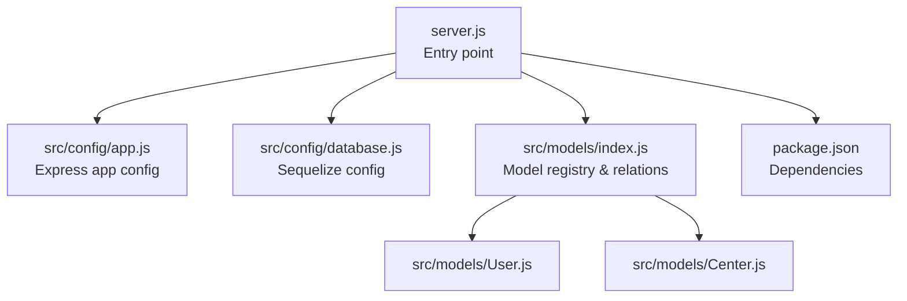
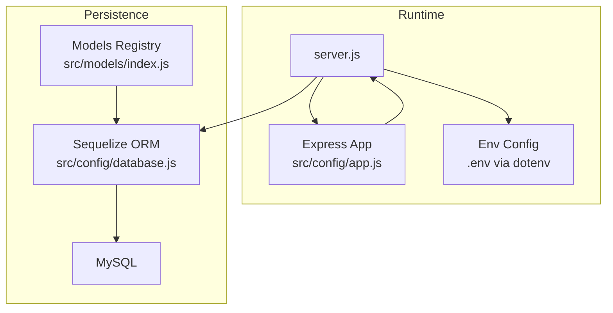
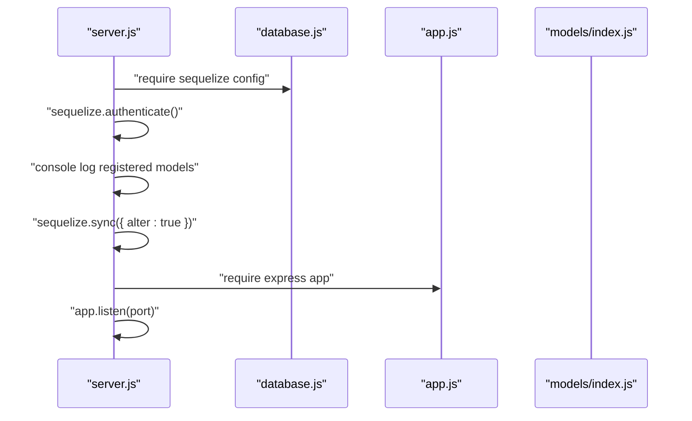
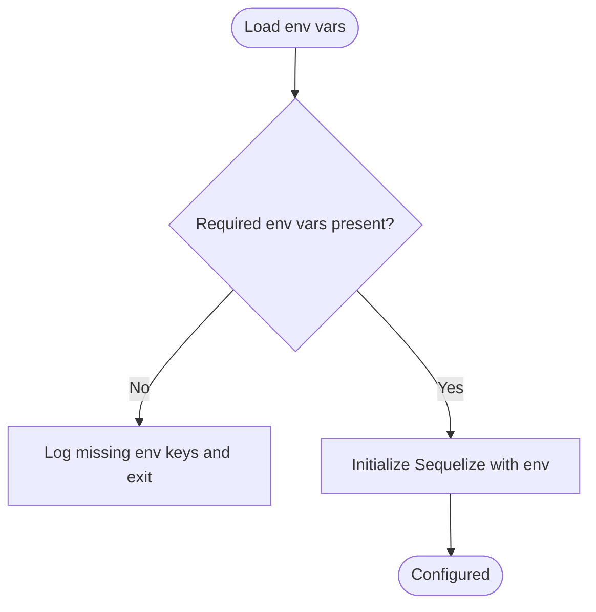
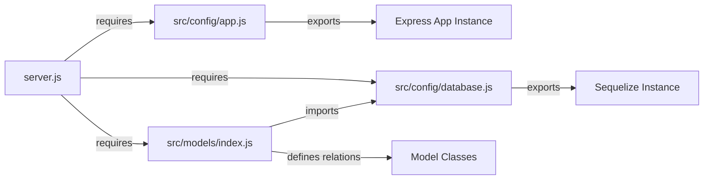
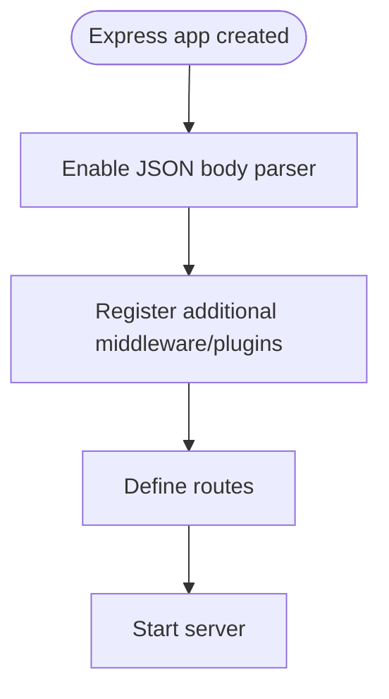
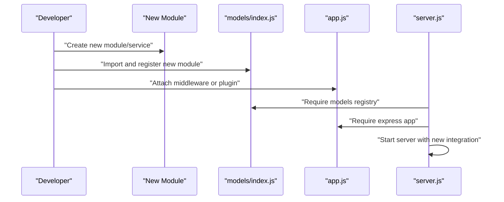
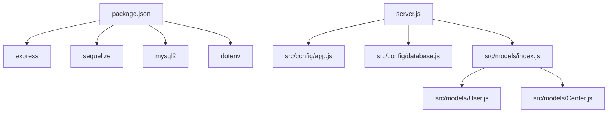

# Integration Patterns

<cite>
**Referenced Files in This Document**
- [server.js](file://backend/server.js)
- [app.js](file://backend/src/config/app.js)
- [database.js](file://backend/src/config/database.js)
- [models/index.js](file://backend/src/models/index.js)
- [User.js](file://backend/src/models/User.js)
- [Center.js](file://backend/src/models/Center.js)
- [package.json](file://backend/package.json)
</cite>

## Table of Contents
1. [Introduction](#introduction)
2. [Project Structure](#project-structure)
3. [Core Components](#core-components)
4. [Architecture Overview](#architecture-overview)
5. [Detailed Component Analysis](#detailed-component-analysis)
6. [Dependency Analysis](#dependency-analysis)
7. [Performance Considerations](#performance-considerations)
8. [Troubleshooting Guide](#troubleshooting-guide)
9. [Conclusion](#conclusion)

## Introduction
This document explains the integration patterns used in the Khirocom application. It focuses on how the Express web framework integrates with the Sequelize ORM for database operations, how environment configuration is managed via dotenv, and how modular architecture organizes code into distinct concerns. It also covers patterns for extending functionality through middleware and plugins, and outlines best practices for adding new integrations while maintaining consistency with existing patterns.

## Project Structure
The backend follows a layered, modular structure:
- Entry point initializes environment configuration and starts the server.
- Express application configuration is isolated under a dedicated module.
- Database configuration and Sequelize initialization live in a separate module.
- Models are grouped under a single models directory with explicit relationship definitions.
- Controllers, middleware, and routes directories exist conceptually but are not present in the current snapshot; however, the integration patterns described here apply to how they would be wired.

**Diagram sources**
- [server.js:1-25](file://backend/server.js#L1-L25)
- [app.js:1-12](file://backend/src/config/app.js#L1-L12)
- [database.js:1-15](file://backend/src/config/database.js#L1-L15)
- [models/index.js:1-52](file://backend/src/models/index.js#L1-L52)
- [User.js:1-59](file://backend/src/models/User.js#L1-L59)
- [Center.js:1-39](file://backend/src/models/Center.js#L1-L39)
- [package.json:1-14](file://backend/package.json#L1-L14)

**Section sources**
- [server.js:1-25](file://backend/server.js#L1-L25)
- [app.js:1-12](file://backend/src/config/app.js#L1-L12)
- [database.js:1-15](file://backend/src/config/database.js#L1-L15)
- [models/index.js:1-52](file://backend/src/models/index.js#L1-L52)
- [package.json:1-14](file://backend/package.json#L1-L14)

## Core Components
- Server bootstrap and lifecycle:
  - Loads environment variables early.
  - Initializes the Express app and Sequelize connection.
  - Synchronizes models and starts the HTTP server.
- Express application configuration:
  - Creates and exports an Express app instance with JSON body parsing middleware.
- Database configuration:
  - Creates a Sequelize instance configured for MySQL using environment variables.
- Model registry and relationships:
  - Centralized import and relationship definition for all models.
  - Exports the Sequelize instance and all model classes for reuse.

**Section sources**
- [server.js:1-25](file://backend/server.js#L1-L25)
- [app.js:1-12](file://backend/src/config/app.js#L1-L12)
- [database.js:1-15](file://backend/src/config/database.js#L1-L15)
- [models/index.js:1-52](file://backend/src/models/index.js#L1-L52)

## Architecture Overview
The application integrates three primary concerns:
- Web framework integration (Express) for routing and middleware.
- Data persistence integration (Sequelize + MySQL) for domain modeling and relationships.
- Environment-driven configuration (dotenv) for secrets and runtime settings.

**Diagram sources**
- [server.js:1-25](file://backend/server.js#L1-L25)
- [app.js:1-12](file://backend/src/config/app.js#L1-L12)
- [database.js:1-15](file://backend/src/config/database.js#L1-L15)
- [models/index.js:1-52](file://backend/src/models/index.js#L1-L52)

## Detailed Component Analysis

### Database Integration with Sequelize ORM
- Configuration:
  - A dedicated module initializes Sequelize with environment variables for host, port, database name, username, and password.
  - Logging is disabled to reduce noise in production logs.
- Model Layer:
  - Each model class extends Sequelize’s Model and defines attributes and options.
  - The models registry imports all models and defines associations between them.
- Bootstrapping:
  - The server authenticates the database connection, logs registered models, synchronizes tables, and proceeds to listen for requests.

**Diagram sources**
- [server.js:8-23](file://backend/server.js#L8-L23)
- [database.js:1-15](file://backend/src/config/database.js#L1-L15)
- [models/index.js:1-52](file://backend/src/models/index.js#L1-L52)
- [app.js:1-12](file://backend/src/config/app.js#L1-L12)

**Section sources**
- [database.js:1-15](file://backend/src/config/database.js#L1-L15)
- [models/index.js:1-52](file://backend/src/models/index.js#L1-L52)
- [User.js:1-59](file://backend/src/models/User.js#L1-L59)
- [Center.js:1-39](file://backend/src/models/Center.js#L1-L39)
- [server.js:8-23](file://backend/server.js#L8-L23)

### Environment Configuration Management
- Dotenv usage:
  - Environment variables are loaded at the top of both the server and database modules to ensure configuration is available before any dependent initialization.
- Variables consumed:
  - Database credentials and host/port are read from environment variables.
  - The server listens on a configurable port, defaulting when not set.

**Diagram sources**
- [server.js:1](file://backend/server.js#L1)
- [database.js:1](file://backend/src/config/database.js#L1)

**Section sources**
- [server.js:1](file://backend/server.js#L1)
- [database.js:1-15](file://backend/src/config/database.js#L1-L15)

### Modular Architecture Patterns
- Separation of concerns:
  - Express app creation and middleware registration are isolated in a dedicated module.
  - Database configuration is encapsulated in its own module.
  - Models are centralized with explicit relationship definitions.
- Cohesion and coupling:
  - Modules depend on shared configuration rather than hardcoding values.
  - The server orchestrates startup without embedding model or route logic.

**Diagram sources**
- [app.js:1-12](file://backend/src/config/app.js#L1-L12)
- [database.js:1-15](file://backend/src/config/database.js#L1-L15)
- [models/index.js:1-52](file://backend/src/models/index.js#L1-L52)
- [server.js:3-4](file://backend/server.js#L3-L4)

**Section sources**
- [app.js:1-12](file://backend/src/config/app.js#L1-L12)
- [models/index.js:1-52](file://backend/src/models/index.js#L1-L52)
- [server.js:3-4](file://backend/server.js#L3-L4)

### Plugin and Middleware Integration Patterns
- Current middleware:
  - JSON body parsing is enabled globally on the Express app.
- Extending with middleware/plugins:
  - Add new middleware by registering it in the Express app module.
  - For third-party plugins, install via npm and initialize during server startup or in dedicated configuration modules.
  - Keep middleware order and error-handling consistent with existing patterns.

**Diagram sources**
- [app.js:5](file://backend/src/config/app.js#L5)

**Section sources**
- [app.js:5](file://backend/src/config/app.js#L5)

### Adding New Integrations Following Established Patterns
- New database model:
  - Create a new model file following the existing pattern (class extending Model, init with attributes and options).
  - Import and register the model in the models registry.
  - Define associations alongside existing ones.
- New external service:
  - Install the dependency via npm.
  - Initialize the client in a dedicated module and export it.
  - Require the client in the server or a configuration module and attach it to the app or expose it via a controlled interface.
- New middleware/plugin:
  - Add it to the Express app module after JSON parsing.
  - Ensure it is positioned appropriately in the middleware chain.

**Diagram sources**
- [models/index.js:4-11](file://backend/src/models/index.js#L4-L11)
- [app.js:1-12](file://backend/src/config/app.js#L1-L12)
- [server.js:3-4](file://backend/server.js#L3-L4)

**Section sources**
- [models/index.js:4-11](file://backend/src/models/index.js#L4-L11)
- [app.js:1-12](file://backend/src/config/app.js#L1-L12)
- [server.js:3-4](file://backend/server.js#L3-L4)

## Dependency Analysis
- External dependencies:
  - Express for web framework capabilities.
  - Sequelize for ORM and database abstraction.
  - mysql2 for MySQL driver.
  - dotenv for environment variable loading.
  - Additional libraries for encryption, JWT, and HTTP client support.
- Internal dependencies:
  - server.js depends on app.js, database.js, and models/index.js.
  - models/index.js depends on database.js and individual model files.
  - app.js depends on Express.

**Diagram sources**
- [package.json:2-12](file://backend/package.json#L2-L12)
- [server.js:3-4](file://backend/server.js#L3-L4)
- [models/index.js:4-10](file://backend/src/models/index.js#L4-L10)

**Section sources**
- [package.json:2-12](file://backend/package.json#L2-L12)
- [server.js:3-4](file://backend/server.js#L3-L4)
- [models/index.js:4-10](file://backend/src/models/index.js#L4-L10)

## Performance Considerations
- Database synchronization strategy:
  - Using alter-based sync can be convenient during development but should be reviewed for production implications.
- Logging:
  - Disabling Sequelize logging reduces overhead in production.
- Middleware ordering:
  - Place lightweight middleware early to minimize latency for all subsequent routes.

## Troubleshooting Guide
- Environment variables:
  - Ensure required variables are present before starting the server.
- Database connectivity:
  - Verify host, port, username, password, and database name.
  - Confirm the server can authenticate and synchronize models.
- Startup errors:
  - Review server startup logs for authentication and sync failures.

**Section sources**
- [server.js:10-15](file://backend/server.js#L10-L15)
- [database.js:4-14](file://backend/src/config/database.js#L4-L14)

## Conclusion
Khirocom employs clean separation of concerns with explicit integration points for the web framework, ORM, and configuration. The modular design enables straightforward extension through standardized patterns: add a model and register it, initialize a third-party client in a dedicated module, and attach middleware in the Express app. Following these patterns ensures maintainability and consistency as new integrations are introduced.