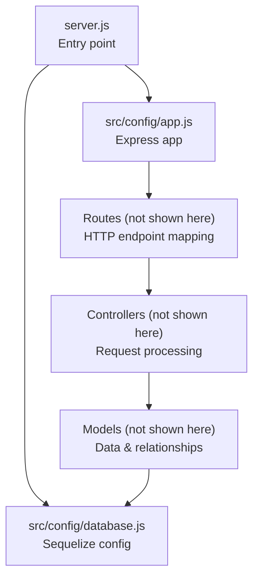
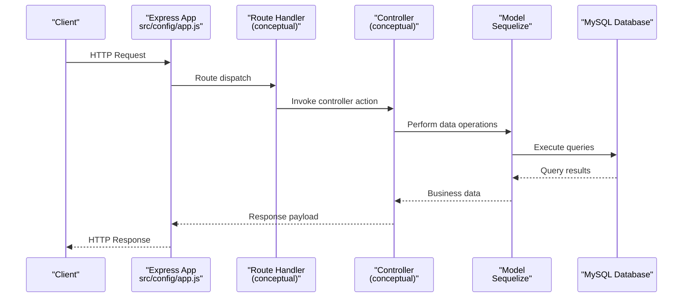
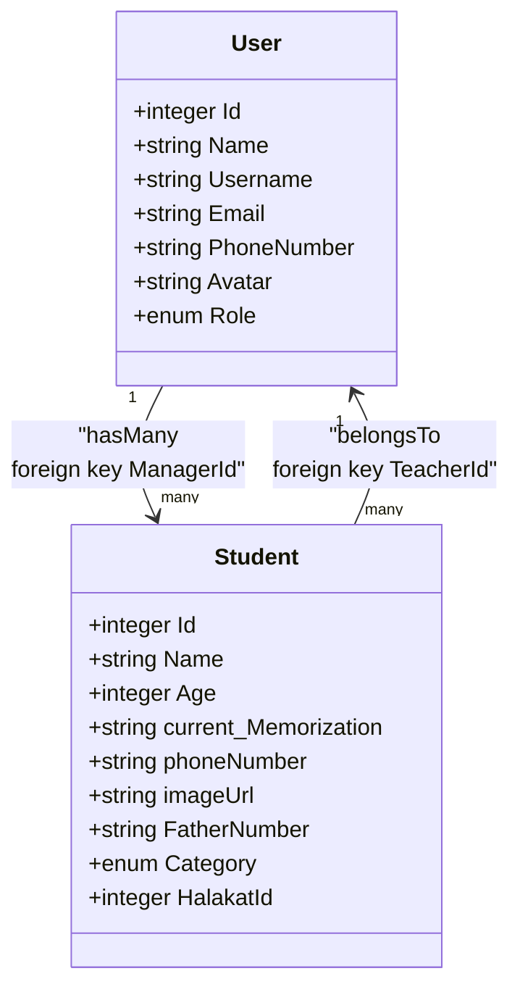
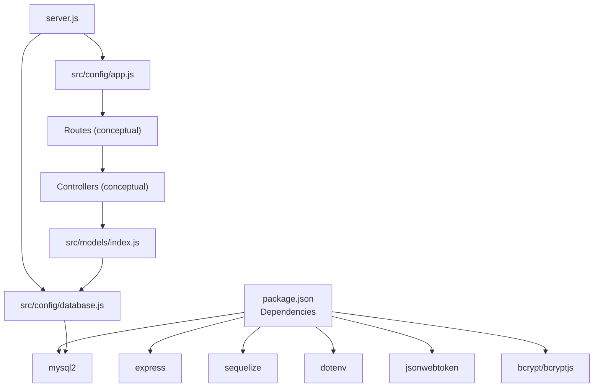

# MVC Pattern Implementation

<cite>
**Referenced Files in This Document**
- [server.js](file://backend/server.js)
- [app.js](file://backend/src/config/app.js)
- [database.js](file://backend/src/config/database.js)
- [models/index.js](file://backend/src/models/index.js)
- [User.js](file://backend/src/models/User.js)
- [Student.js](file://backend/src/models/Student.js)
- [package.json](file://backend/package.json)
</cite>

## Table of Contents
1. [Introduction](#introduction)
2. [Project Structure](#project-structure)
3. [Core Components](#core-components)
4. [Architecture Overview](#architecture-overview)
5. [Detailed Component Analysis](#detailed-component-analysis)
6. [Dependency Analysis](#dependency-analysis)
7. [Performance Considerations](#performance-considerations)
8. [Troubleshooting Guide](#troubleshooting-guide)
9. [Conclusion](#conclusion)

## Introduction
This document explains how the Khirocom application implements the Model-View-Controller (MVC) architectural pattern using Express.js. The backend follows a layered structure where:
- Models represent data and business entities with Sequelize ORM.
- Controllers handle HTTP request processing and orchestrate business logic.
- Routes map HTTP endpoints to controller actions.
- Middleware manages cross-cutting concerns such as authentication and request parsing.

The goal is to demonstrate clear separation of concerns, maintainability, testability, and scalability while providing practical guidance for extending the system with new features following the MVC pattern.

## Project Structure
The backend is organized into distinct layers:
- Entry point initializes the Express app, connects to the database, and starts the server.
- Configuration files define the Express app instance and database connection.
- Models define data schemas and relationships via Sequelize.
- Controllers coordinate business logic and response generation.
- Routes bind HTTP endpoints to controller actions.
- Middleware handles shared processing across requests.

**Diagram sources**
- [server.js:1-25](file://backend/server.js#L1-L25)
- [app.js:1-12](file://backend/src/config/app.js#L1-L12)
- [database.js:1-15](file://backend/src/config/database.js#L1-L15)

**Section sources**
- [server.js:1-25](file://backend/server.js#L1-L25)
- [app.js:1-12](file://backend/src/config/app.js#L1-L12)
- [database.js:1-15](file://backend/src/config/database.js#L1-L15)

## Core Components
This section outlines the roles and responsibilities of each MVC layer in the Khirocom application.

- Models (Data Layer)
  - Define entity schemas and relationships using Sequelize.
  - Centralized in a single index file that imports and associates models.
  - Example models include User and Student, each declaring attributes and constraints.

- Controllers (Logic Layer)
  - Coordinate request handling, invoke model operations, and prepare responses.
  - Not present as individual files in the current snapshot; their responsibilities are described conceptually for clarity.

- Routes (Endpoint Layer)
  - Map HTTP methods and paths to controller actions.
  - Not present as individual files in the current snapshot; their responsibilities are described conceptually for clarity.

- Middleware (Cross-Cutting Layer)
  - Handles tasks like JSON parsing, authentication, logging, and error management.
  - Not present as individual files in the current snapshot; their responsibilities are described conceptually for clarity.

Benefits of the MVC pattern:
- Separation of concerns improves maintainability by isolating data, logic, and presentation concerns.
- Testability increases because models, controllers, and routes can be unit-tested independently.
- Scalability is enhanced by enabling modular growth of features without tight coupling.

## Architecture Overview
The runtime architecture ties together the Express app, database, and MVC layers.

**Diagram sources**
- [app.js:1-12](file://backend/src/config/app.js#L1-L12)
- [models/index.js:1-52](file://backend/src/models/index.js#L1-L52)
- [database.js:1-15](file://backend/src/config/database.js#L1-L15)

## Detailed Component Analysis

### Model Layer: Data Schemas and Relationships
The model layer defines entities and their associations using Sequelize. The central index file imports all models and establishes foreign key relationships, ensuring referential integrity and simplifying data access across the application.

**Diagram sources**
- [models/index.js:14-41](file://backend/src/models/index.js#L14-L41)
- [User.js:6-56](file://backend/src/models/User.js#L6-L56)
- [Student.js:6-65](file://backend/src/models/Student.js#L6-L65)

Key characteristics:
- Models encapsulate schema definitions and constraints.
- Relationships are declared centrally to enforce referential integrity.
- Timestamps are enabled for auditability.

**Section sources**
- [models/index.js:1-52](file://backend/src/models/index.js#L1-L52)
- [User.js:1-59](file://backend/src/models/User.js#L1-L59)
- [Student.js:1-67](file://backend/src/models/Student.js#L1-L67)

### Controller Layer: Business Logic Orchestration
Controllers coordinate request handling, validate inputs, interact with models, and format responses. While individual controller files are not present in the current snapshot, the conceptual responsibilities are:
- Receive HTTP requests from routes.
- Apply validation and authorization checks.
- Call model methods to fetch or update data.
- Prepare structured responses and handle errors gracefully.

Separation of concerns:
- Controllers remain thin, delegating persistence to models.
- Business rules are centralized within models or service modules.

### Route Layer: Endpoint Mapping
Routes connect HTTP endpoints to controller actions. Conceptually:
- Define endpoints for resources (e.g., users, students).
- Map HTTP verbs (GET, POST, PUT, DELETE) to controller methods.
- Pass parameters and request bodies to controllers.

Integration with controllers:
- Routes depend on controllers for business logic execution.
- Controllers depend on models for data operations.

### Middleware Layer: Cross-Cutting Concerns
Middleware provides shared functionality across requests:
- Body parsing (JSON).
- Authentication and authorization.
- Logging and error handling.
- CORS and security headers.

Typical middleware responsibilities:
- Parse incoming request payloads.
- Verify tokens and permissions.
- Normalize responses and handle exceptions.

## Dependency Analysis
The application’s dependencies and their roles are summarized below.

**Diagram sources**
- [package.json:1-14](file://backend/package.json#L1-L14)
- [server.js:1-25](file://backend/server.js#L1-L25)
- [app.js:1-12](file://backend/src/config/app.js#L1-L12)
- [database.js:1-15](file://backend/src/config/database.js#L1-L15)
- [models/index.js:1-52](file://backend/src/models/index.js#L1-L52)

**Section sources**
- [package.json:1-14](file://backend/package.json#L1-L14)
- [server.js:1-25](file://backend/server.js#L1-L25)

## Performance Considerations
- Database connectivity and synchronization are handled at startup; ensure connection pooling and query optimization for production workloads.
- Keep controllers lightweight to minimize latency; delegate heavy computations to models or dedicated services.
- Use pagination and filtering for large datasets to reduce payload sizes.
- Implement caching strategies for frequently accessed data where appropriate.

## Troubleshooting Guide
Common operational issues and resolutions:
- Database connection failures
  - Verify environment variables for database credentials and host configuration.
  - Confirm the database server is reachable and accepts connections.
- Server startup errors
  - Review authentication and sync logs during server initialization.
  - Ensure models are registered before attempting to synchronize the schema.
- Route and controller integration
  - Confirm route handlers are properly wired to controller actions.
  - Validate that controllers return appropriate HTTP status codes and structured responses.

**Section sources**
- [server.js:8-23](file://backend/server.js#L8-L23)
- [database.js:4-14](file://backend/src/config/database.js#L4-L14)

## Conclusion
Khirocom’s backend demonstrates a clean MVC architecture with Express.js:
- Models encapsulate data and relationships.
- Controllers orchestrate business logic and responses.
- Routes map endpoints to controller actions.
- Middleware handles cross-cutting concerns.

This structure promotes maintainability, testability, and scalability. New features can be added by:
- Extending models with new attributes and relationships.
- Creating new controller actions to handle business logic.
- Adding new routes to expose endpoints.
- Introducing middleware for shared functionality.