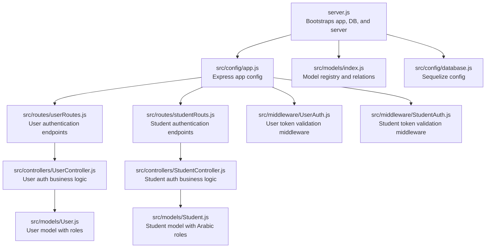
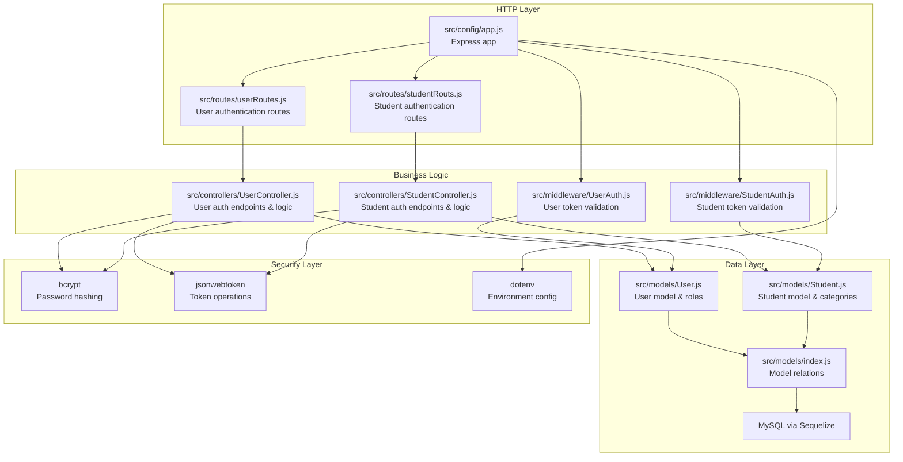
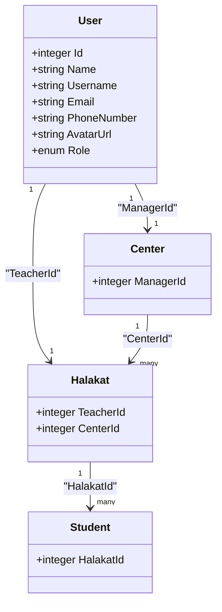
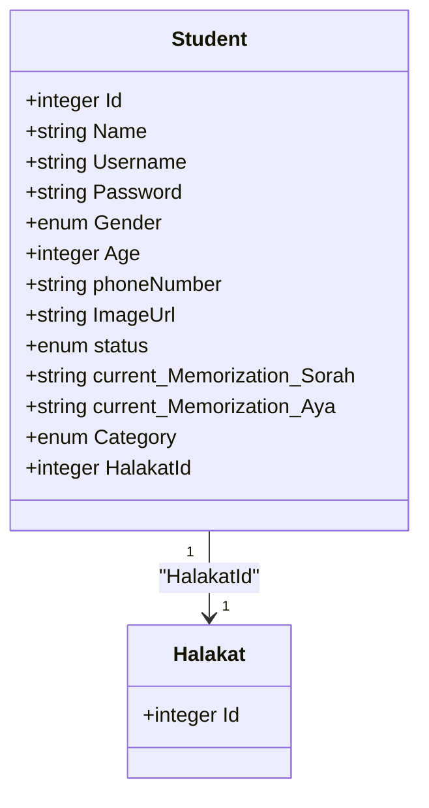
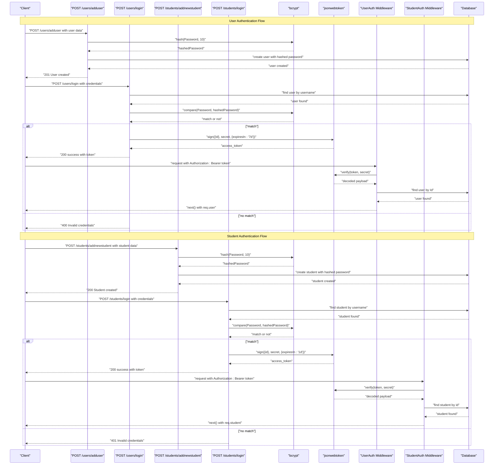
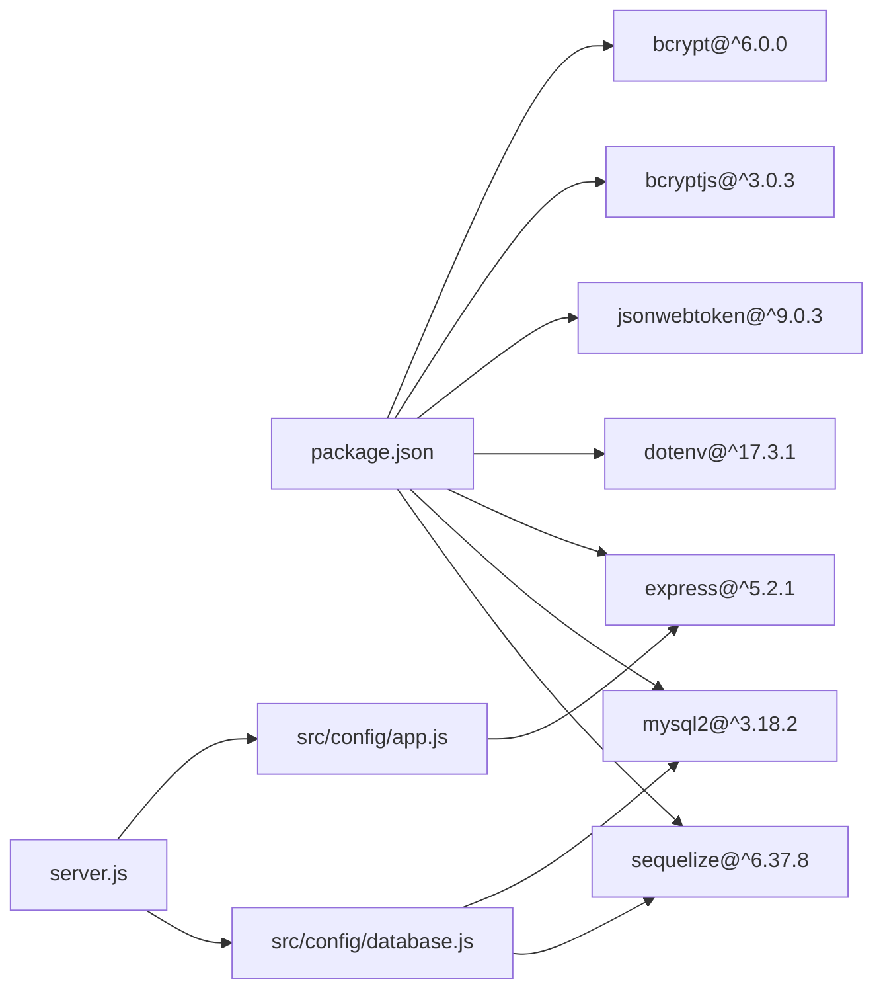

# Authentication & Authorization

<cite>
**Referenced Files in This Document**
- [server.js](file://backend/server.js)
- [app.js](file://backend/src/config/app.js)
- [database.js](file://backend/src/config/database.js)
- [UserController.js](file://backend/src/controllers/UserController.js)
- [StudentController.js](file://backend/src/controllers/StudentController.js)
- [UserAuth.js](file://backend/src/middleware/UserAuth.js)
- [StudentAuth.js](file://backend/src/middleware/StudentAuth.js)
- [userRoutes.js](file://backend/src/routes/userRoutes.js)
- [studentRouts.js](file://backend/src/routes/studentRouts.js)
- [User.js](file://backend/src/models/User.js)
- [Student.js](file://backend/src/models/Student.js)
- [index.js](file://backend/src/models/index.js)
- [package.json](file://backend/package.json)
</cite>

## Update Summary
**Changes Made**
- Completely restructured authentication documentation to reflect dual-authentication approach (user authentication + student authentication)
- Updated middleware documentation to show separate UserAuth and StudentAuth implementations
- Added comprehensive student authentication endpoints and JWT implementation
- Updated role-based access control documentation to cover both user and student roles
- Enhanced security considerations for dual authentication system
- Updated architecture diagrams to reflect dual authentication flow

## Table of Contents
1. [Introduction](#introduction)
2. [Project Structure](#project-structure)
3. [Dual Authentication System](#dual-authentication-system)
4. [Core Components](#core-components)
5. [Architecture Overview](#architecture-overview)
6. [Detailed Component Analysis](#detailed-component-analysis)
7. [Authentication Endpoints](#authentication-endpoints)
8. [JWT Implementation](#jwt-implementation)
9. [Middleware and Authorization](#middleware-and-authorization)
10. [Dependency Analysis](#dependency-analysis)
11. [Performance Considerations](#performance-considerations)
12. [Troubleshooting Guide](#troubleshooting-guide)
13. [Conclusion](#conclusion)
14. [Appendices](#appendices)

## Introduction
This document explains the dual authentication and authorization design for the Khirocom system with a focus on user management and access control. The system implements a comprehensive dual-authentication approach featuring separate JWT-based authentication flows for users and students, with bcrypt password hashing, role-based access control (RBAC), and secure credential storage. The User model supports multiple roles including admin, teacher, supervisor, manager, and student, while the Student model provides dedicated authentication for learners with Arabic role names and relationships to centers, halakats, and students based on their roles.

## Project Structure
The backend is organized around Express, Sequelize ORM, and environment-driven configuration. The server bootstraps the application, connects to the database, synchronizes models, and starts the HTTP listener. The dual authentication system is centered around UserController and StudentController with dedicated endpoints for user and student registration and login, supported by robust middleware for token validation and context attachment for both user and student authentication contexts.

**Diagram sources**
- [server.js:1-26](file://backend/server.js#L1-L26)
- [app.js:1-25](file://backend/src/config/app.js#L1-L25)
- [database.js:1-16](file://backend/src/config/database.js#L1-L16)
- [index.js:1-65](file://backend/src/models/index.js#L1-L65)
- [UserController.js:1-187](file://backend/src/controllers/UserController.js#L1-L187)
- [StudentController.js:1-346](file://backend/src/controllers/StudentController.js#L1-L346)
- [UserAuth.js:1-25](file://backend/src/middleware/UserAuth.js#L1-L25)
- [StudentAuth.js:1-27](file://backend/src/middleware/StudentAuth.js#L1-L27)
- [userRoutes.js:1-17](file://backend/src/routes/userRoutes.js#L1-L17)
- [studentRouts.js:1-24](file://backend/src/routes/studentRouts.js#L1-L24)

**Section sources**
- [server.js:1-26](file://backend/server.js#L1-L26)
- [app.js:1-25](file://backend/src/config/app.js#L1-L25)
- [database.js:1-16](file://backend/src/config/database.js#L1-L16)
- [index.js:1-65](file://backend/src/models/index.js#L1-L65)
- [UserController.js:1-187](file://backend/src/controllers/UserController.js#L1-L187)
- [StudentController.js:1-346](file://backend/src/controllers/StudentController.js#L1-L346)
- [UserAuth.js:1-25](file://backend/src/middleware/UserAuth.js#L1-L25)
- [StudentAuth.js:1-27](file://backend/src/middleware/StudentAuth.js#L1-L27)
- [userRoutes.js:1-17](file://backend/src/routes/userRoutes.js#L1-L17)
- [studentRouts.js:1-24](file://backend/src/routes/studentRouts.js#L1-L24)

## Dual Authentication System
The Khirocom system implements a comprehensive dual-authentication approach that separates user and student authentication contexts:

### User Authentication System
- **User Controller**: Implements authentication endpoints for administrative staff including user registration (`POST /users/adduser`) and login (`POST /users/login`) with bcrypt password hashing and JWT token generation.
- **User Authentication Middleware**: Validates JWT tokens from Authorization headers, extracts user context, and attaches authenticated users to request objects.
- **User Model**: Defines identity fields, credentials, avatar, and role enumeration with Arabic role names (admin, مدرس, مشرف, موجه, طالب, مدير). Roles include admin, teacher, supervisor, manager, student, and director with proper relationships.

### Student Authentication System  
- **Student Controller**: Implements dedicated authentication endpoints for learners including student registration (`POST /students/addnewstudent`) and login (`POST /students/login`) with bcrypt password hashing and JWT token generation.
- **Student Authentication Middleware**: Validates JWT tokens from Authorization headers, extracts student context, and attaches authenticated students to request objects.
- **Student Model**: Defines learner identity fields, credentials, status tracking, and Arabic role-based categories with proper relationships to halakats and centers.

### Key Differences
- **Token Payloads**: User tokens contain `Id` field, while student tokens contain `id` field
- **Middleware Context**: User middleware attaches `req.user`, while student middleware attaches `req.student`
- **Route Protection**: Different middleware applied to user vs student routes
- **Error Messages**: Arabic error messages for student authentication responses

**Section sources**
- [UserController.js:57-132](file://backend/src/controllers/UserController.js#L57-L132)
- [StudentController.js:8-26](file://backend/src/controllers/StudentController.js#L8-L26)
- [UserAuth.js:4-25](file://backend/src/middleware/UserAuth.js#L4-L25)
- [StudentAuth.js:5-27](file://backend/src/middleware/StudentAuth.js#L5-L27)
- [User.js:39-43](file://backend/src/models/User.js#L39-L43)
- [Student.js:22-26](file://backend/src/models/Student.js#L22-L26)

## Core Components
- **User Controller**: Implements comprehensive authentication endpoints including user registration (`POST /users/adduser`) and login (`POST /users/login`) with bcrypt password hashing and JWT token generation.
- **Student Controller**: Implements dedicated authentication endpoints including student registration (`POST /students/addnewstudent`) and login (`POST /students/login`) with bcrypt password hashing and JWT token generation.
- **User Authentication Middleware**: Validates JWT tokens from Authorization headers, extracts user context, and attaches authenticated users to request objects.
- **Student Authentication Middleware**: Validates JWT tokens from Authorization headers, extracts student context, and attaches authenticated students to request objects.
- **User Model**: Defines identity fields, credentials, avatar, and role enumeration with Arabic role names (admin, مدرس, مشرف, موجه, طالب, مدير). Roles include admin, teacher, supervisor, manager, student, and director with proper relationships.
- **Student Model**: Defines learner identity fields, credentials, status tracking, and Arabic category classifications with proper relationships to halakats and centers.
- **Route Configuration**: Maps authentication endpoints to respective controllers with proper HTTP verb usage and middleware application.
- **Application Bootstrap**: Express app configured for JSON payloads, database connection and sync, and server startup with dual authentication routes.
- **Dependencies**: bcrypt for password hashing, jsonwebtoken for JWT operations, dotenv for environment variables, and Sequelize for ORM.

Key RBAC roles with Arabic names:
- **User Roles**: admin (Highest privilege level), مدرس (teacher), مشرف (supervisor), موجه (manager), طالب (student), مدير (director)
- **Student Categories**: أطفال (children), أقل من 5 أجزاء (less than 5 parts), 5 أجزاء (5 parts), 10 أجزاء (10 parts), 15 جزء (15 parts), 20 جزء (20 parts), 25 جزء (25 parts), المصجف كامل (complete reciter)

Credential storage:
- **User Passwords**: Stored as hashed values using bcrypt with 10 salt rounds. The model enforces a 255-character string column for hashed credentials.
- **Student Passwords**: Stored as hashed values using bcrypt with 10 salt rounds. The model enforces a 256-character string column for hashed credentials.

Token support:
- **jsonwebtoken**: Used for JWT-based authentication with different expiration periods - 7 days for user tokens and 1 day for student tokens, including signing, verification, and secure token handling.

**Section sources**
- [UserController.js:57-132](file://backend/src/controllers/UserController.js#L57-L132)
- [StudentController.js:8-26](file://backend/src/controllers/StudentController.js#L8-L26)
- [UserAuth.js:4-25](file://backend/src/middleware/UserAuth.js#L4-L25)
- [StudentAuth.js:5-27](file://backend/src/middleware/StudentAuth.js#L5-L27)
- [User.js:24-28](file://backend/src/models/User.js#L24-L28)
- [Student.js:27-31](file://backend/src/models/Student.js#L27-L31)
- [userRoutes.js:8-14](file://backend/src/routes/userRoutes.js#L8-L14)
- [studentRouts.js:7](file://backend/src/routes/studentRouts.js#L7)

## Architecture Overview
The dual authentication architecture centers on separate controllers and middleware for user and student authentication. JWT tokens are issued upon successful authentication for both contexts and validated on protected routes through dedicated middleware. The system enforces role-based access checks against the User's role and related entities through proper middleware usage, with distinct authentication flows for administrative staff and learners.

**Diagram sources**
- [app.js:1-25](file://backend/src/config/app.js#L1-L25)
- [userRoutes.js:1-17](file://backend/src/routes/userRoutes.js#L1-L17)
- [studentRouts.js:1-24](file://backend/src/routes/studentRouts.js#L1-L24)
- [UserController.js:1-187](file://backend/src/controllers/UserController.js#L1-L187)
- [StudentController.js:1-346](file://backend/src/controllers/StudentController.js#L1-L346)
- [UserAuth.js:1-25](file://backend/src/middleware/UserAuth.js#L1-L25)
- [StudentAuth.js:1-27](file://backend/src/middleware/StudentAuth.js#L1-L27)
- [User.js:1-84](file://backend/src/models/User.js#L1-L84)
- [Student.js:1-118](file://backend/src/models/Student.js#L1-L118)
- [index.js:1-65](file://backend/src/models/index.js#L1-L65)
- [package.json:1-14](file://backend/package.json#L1-L14)

## Detailed Component Analysis

### User Model and RBAC
The User model defines identity and access attributes with comprehensive role support:
- Identity: Id, Name, Username, Email, PhoneNumber, Avatar
- Credentials: Password (hashed with bcrypt)
- Role: Enumerated role with Arabic names and defaults

Role-based relationships:
- Managers oversee Centers (one-to-one relationship)
- Teachers instruct Halakats (one-to-one relationship)
- Halakats enroll Students (one-to-many relationship)

**Diagram sources**
- [User.js:6-84](file://backend/src/models/User.js#L6-L84)
- [index.js:15-41](file://backend/src/models/index.js#L15-L41)

**Section sources**
- [User.js:6-84](file://backend/src/models/User.js#L6-L84)
- [index.js:15-41](file://backend/src/models/index.js#L15-L41)

### Student Model and Arabic Categories
The Student model defines learner identity and status attributes with comprehensive Arabic categorization:
- Identity: Id, Name, Username, Password, Gender, Age, Phone Number, Father Number
- Status Tracking: Current memorization progress, status (مستمر, منقطع, مفصول)
- Categories: Arabic classification system for memorization levels
- Relationships: One-to-one relationship with Halakat for class enrollment

Arabic student categories:
- أطفال (children): Initial learning stage
- أقل من 5 أجزاء (less than 5 parts): Beginner level
- 5 أجزاء (5 parts): Intermediate level
- 10 أجزاء (10 parts): Advanced level
- 15 جزء (15 parts): Expert level
- 20 جزء (20 parts): Master level
- 25 جزء (25 parts): High master level
- المصجف كامل (complete reciter): Highest achievement level

**Diagram sources**
- [Student.js:6-118](file://backend/src/models/Student.js#L6-L118)

**Section sources**
- [Student.js:6-118](file://backend/src/models/Student.js#L6-L118)

### Dual JWT-Based Authentication Flow
The system implements separate JWT-based authentication flows for users and students using bcrypt for password security:

#### User Authentication Flow
- **Registration**: Hash password with bcrypt (10 salt rounds), store user with hashed credentials
- **Login**: Verify credentials by comparing bcrypt hashes, generate JWT with user ID and 7-day expiration
- **Token Validation**: Extract token from Authorization header, verify signature, attach user context

#### Student Authentication Flow
- **Registration**: Hash password with bcrypt (10 salt rounds), store student with hashed credentials
- **Login**: Verify credentials by comparing bcrypt hashes, generate JWT with student ID and 1-day expiration
- **Token Validation**: Extract token from Authorization header, verify signature, attach student context

**Diagram sources**
- [UserController.js:57-132](file://backend/src/controllers/UserController.js#L57-L132)
- [StudentController.js:8-26](file://backend/src/controllers/StudentController.js#L8-L26)
- [UserAuth.js:4-25](file://backend/src/middleware/UserAuth.js#L4-L25)
- [StudentAuth.js:5-27](file://backend/src/middleware/StudentAuth.js#L5-L27)

### Token Validation and Refresh Mechanisms
- **User Token Validation**: Middleware extracts Authorization header, splits "Bearer token", verifies JWT signature with shared secret, decodes payload, and attaches user context to request object
- **Student Token Validation**: Middleware extracts Authorization header, splits "Bearer token", verifies JWT signature with shared secret, decodes payload, and attaches student context to request object
- **Refresh Mechanisms**: Separate refresh endpoints can be implemented for user and student tokens with different expiration policies
- **Logout Procedures**: Logout can be implemented by maintaining separate token blacklists or using short-lived tokens with refresh token rotation for both user and student contexts

**Section sources**
- [UserAuth.js:4-25](file://backend/src/middleware/UserAuth.js#L4-L25)
- [StudentAuth.js:5-27](file://backend/src/middleware/StudentAuth.js#L5-L27)
- [UserController.js:111-113](file://backend/src/controllers/UserController.js#L111-L113)
- [StudentController.js:21](file://backend/src/controllers/StudentController.js#L21)

### Secure Credential Storage and Session Security
- **Password hashing**: Uses bcrypt with 10 salt rounds for secure password storage in both User and Student models, preventing rainbow table attacks and ensuring unique hashes even for identical passwords
- **Token storage**: JWT tokens are transmitted in Authorization headers as Bearer tokens for both user and student contexts, avoiding client-side storage vulnerabilities
- **Token security**: Different expiration policies - 7 days for user tokens and 1 day for student tokens, reducing window of compromise; secret key stored in environment variables
- **Error handling**: Comprehensive error handling prevents information leakage while providing meaningful feedback for debugging, with Arabic error messages for student authentication

**Section sources**
- [UserController.js:59](file://backend/src/controllers/UserController.js#L59)
- [StudentController.js:34](file://backend/src/controllers/StudentController.js#L34)
- [UserController.js:111-113](file://backend/src/controllers/UserController.js#L111-L113)
- [StudentController.js:21](file://backend/src/controllers/StudentController.js#L21)
- [UserAuth.js:11](file://backend/src/middleware/UserAuth.js#L11)
- [StudentAuth.js:13](file://backend/src/middleware/StudentAuth.js#L13)

### Role-Based Route Protection
- **User Middleware Implementation**: Authentication middleware validates user tokens, extracts user context, and attaches authenticated users to request objects for downstream processing
- **Student Middleware Implementation**: Authentication middleware validates student tokens, extracts student context, and attaches authenticated students to request objects for downstream processing
- **Authorization Patterns**: Can be extended to check user roles against required permissions for different resource access levels, with separate role checks for user and student contexts
- **Protected Routes**: Different middleware can be applied to routes requiring user authentication versus student authentication, with role-specific guards for sensitive operations

**Section sources**
- [UserAuth.js:19](file://backend/src/middleware/UserAuth.js#L19)
- [StudentAuth.js:21](file://backend/src/middleware/StudentAuth.js#L21)
- [userRoutes.js:8-14](file://backend/src/routes/userRoutes.js#L8-L14)
- [studentRouts.js:8-22](file://backend/src/routes/studentRouts.js#L8-L22)

## Authentication Endpoints
The dual authentication system provides comprehensive endpoints for both user and student authentication:

### User Authentication Endpoints
**POST /users/adduser**
Creates a new user with bcrypt-hashed password:
- **Request Body**: User registration data (Name, Username, Password, PhoneNumber, Gender, Age, EducationLevel, Role, Salary, Address)
- **Processing**: Hashes password with bcrypt (10 salt rounds), creates user record with default salary and address
- **Response**: 201 status with success message and user data
- **Error Handling**: Returns 500 status for database errors

**POST /users/login**
Authenticates existing users:
- **Request Body**: Username and Password credentials
- **Processing**: 
  1. Finds user by username
  2. Compares provided password with stored hash using bcrypt
  3. Generates JWT token with user ID and 7-day expiration
- **Response**: 200 status with success message, user details, and JWT token
- **Error Handling**: Returns 400 for user not found or invalid credentials, 500 for server errors

### Student Authentication Endpoints
**POST /students/addnewstudent**
Creates a new student with bcrypt-hashed password:
- **Request Body**: Student registration data (Name, Username, Password, Age, Gender, PhoneNumber, FatherNumber, Category, HalakatId)
- **Processing**: Hashes password with bcrypt (10 salt rounds), creates student record with default status and current memorization
- **Response**: 200 status with success message and student data
- **Error Handling**: Returns 500 status for database errors

**POST /students/login**
Authenticates existing students:
- **Request Body**: Username and Password credentials
- **Processing**: 
  1. Finds student by username
  2. Compares provided password with stored hash using bcrypt
  3. Generates JWT token with student ID and 1-day expiration
- **Response**: 200 status with success message and JWT token
- **Error Handling**: Returns 404 for student not found, 401 for invalid credentials, 500 for server errors

**Section sources**
- [userRoutes.js:8-14](file://backend/src/routes/userRoutes.js#L8-L14)
- [studentRouts.js:7](file://backend/src/routes/studentRouts.js#L7)
- [UserController.js:57-132](file://backend/src/controllers/UserController.js#L57-L132)
- [StudentController.js:8-69](file://backend/src/controllers/StudentController.js#L8-L69)

## JWT Implementation
The dual authentication system uses JWT for stateless session management with different configurations for user and student contexts:

### User Token Configuration
- **Payload**: Contains user ID (Id) for identification
- **Secret**: Stored in environment variables (process.env.JWT_SECRET)
- **Expiration**: 7 days (604800 seconds)
- **Algorithm**: HS256 (default for jsonwebtoken)

### Student Token Configuration
- **Payload**: Contains student ID (id) for identification
- **Secret**: Stored in environment variables (process.env.JWT_SECRET)
- **Expiration**: 1 day (86400 seconds)
- **Algorithm**: HS256 (default for jsonwebtoken)

### Token Validation Process
- **Header Extraction**: Middleware reads Authorization header from request
- **Token Parsing**: Splits "Bearer token" format to extract JWT
- **Signature Verification**: Validates token signature using shared secret
- **User Context Attachment**: Retrieves user from database using decoded ID and attaches to request object for user middleware
- **Student Context Attachment**: Retrieves student from database using decoded ID and attaches to request object for student middleware

### Security Considerations
- **Secret Management**: JWT secret stored in environment variables
- **Different Expiration Policies**: User tokens last longer (7 days) than student tokens (1 day) to balance security and usability
- **Error Handling**: Prevents information leakage through generic error messages with Arabic error messages for student authentication
- **Input Validation**: Validates presence of Authorization header before processing

**Section sources**
- [UserController.js:111-113](file://backend/src/controllers/UserController.js#L111-L113)
- [StudentController.js:21](file://backend/src/controllers/StudentController.js#L21)
- [UserAuth.js:6-11](file://backend/src/middleware/UserAuth.js#L6-L11)
- [StudentAuth.js:7-13](file://backend/src/middleware/StudentAuth.js#L7-L13)
- [UserAuth.js:13-19](file://backend/src/middleware/UserAuth.js#L13-L19)
- [StudentAuth.js:14-20](file://backend/src/middleware/StudentAuth.js#L14-L20)

## Middleware and Authorization
The dual authentication middleware provides robust token validation and context attachment for both user and student authentication:

### User Authentication Middleware
- **Header Processing**: Extracts Authorization header and validates Bearer token format
- **Token Verification**: Uses jsonwebtoken to verify signature and decode payload
- **User Resolution**: Queries database for user associated with token payload
- **Context Attachment**: Attaches authenticated user object to request for downstream use
- **Error Handling**: Comprehensive error handling with appropriate HTTP status codes

### Student Authentication Middleware
- **Header Processing**: Extracts Authorization header and validates Bearer token format
- **Token Verification**: Uses jsonwebtoken to verify signature and decode payload
- **Student Resolution**: Queries database for student associated with token payload
- **Context Attachment**: Attaches authenticated student object to request for downstream use
- **Error Handling**: Comprehensive error handling with appropriate HTTP status codes and Arabic error messages

### Error Handling Strategy
- **Missing Header**: Returns 401 with "invalid token" message for user middleware, "No token, authorization denied" for student middleware
- **Invalid Token**: Returns 401 with "invalid token" message for user middleware, "Invalid token, authorization denied" for student middleware
- **User Not Found**: Returns 401 with "user not found" message
- **Student Not Found**: Returns 404 with "Student not found" message
- **Generic Errors**: Returns 401 with "invalid token" message for unexpected errors

### Usage Patterns
- **Route Protection**: Apply UserAuth middleware to routes requiring user authentication, StudentAuth middleware to routes requiring student authentication
- **User Context**: Access authenticated user via `req.user` in subsequent handlers
- **Student Context**: Access authenticated student via `req.student` in subsequent handlers
- **Role Checks**: Extend middleware to enforce role-based authorization for both user and student contexts

**Section sources**
- [UserAuth.js:4-25](file://backend/src/middleware/UserAuth.js#L4-L25)
- [StudentAuth.js:5-27](file://backend/src/middleware/StudentAuth.js#L5-L27)

## Dependency Analysis
The dual authentication stack relies on several key libraries with enhanced security features:

- **bcrypt**: Password hashing with configurable salt rounds (10) for both user and student credentials
- **bcryptjs**: Alternative bcrypt implementation for compatibility
- **jsonwebtoken**: JWT signing, verification, and token management with different expiration policies
- **dotenv**: Environment configuration for secrets and database credentials
- **express**: Web framework for routing and middleware
- **mysql2**: MySQL database driver
- **sequelize**: ORM for database operations and model relationships

**Diagram sources**
- [package.json:1-14](file://backend/package.json#L1-L14)
- [app.js:1-25](file://backend/src/config/app.js#L1-L25)
- [database.js:1-16](file://backend/src/config/database.js#L1-L16)
- [server.js:1-26](file://backend/server.js#L1-L26)

**Section sources**
- [package.json:1-14](file://backend/package.json#L1-L14)
- [app.js:1-25](file://backend/src/config/app.js#L1-L25)
- [database.js:1-16](file://backend/src/config/database.js#L1-L16)
- [server.js:1-26](file://backend/server.js#L1-L26)

## Performance Considerations
- **Hashing cost**: Bcrypt salt rounds set to 10 provide good security-performance balance for both user and student authentication
- **Token size**: JWT payloads contain only user ID or student ID, keeping token size minimal
- **Database queries**: Efficient single-user and single-student lookup for authentication and context resolution
- **Connection pooling**: Sequelize manages database connections efficiently
- **Memory usage**: Middleware processes tokens without storing user data in memory beyond request scope
- **Separate expiration policies**: Different token lifetimes optimize performance and security for different user types

## Troubleshooting Guide
Common issues and resolutions:
- **Database connection failures**: Verify environment variables for host, port, user, password, and database name. Confirm service availability and network access.
- **Model synchronization errors**: Review model definitions and relationships for constraint violations. Use safe sync options during development.
- **JWT verification errors**: Ensure the JWT secret matches environment configuration. Check token expiration and signature validation for both user and student tokens.
- **Password mismatch**: Confirm bcrypt hashing and comparison logic. Validate input encoding and normalization for both user and student credentials.
- **Authentication failures**: Verify Authorization header format ("Bearer token") and token validity for the specific authentication context.
- **Middleware errors**: Check that routes are properly mounted and appropriate middleware is applied before route handlers.
- **Arabic error messages**: Ensure proper localization for student authentication error responses.
- **Different token contexts**: Verify that user tokens are used for user routes and student tokens are used for student routes.

**Section sources**
- [database.js:4-15](file://backend/src/config/database.js#L4-L15)
- [server.js:8-22](file://backend/server.js#L8-L22)
- [package.json:4-11](file://backend/package.json#L4-L11)
- [UserAuth.js:7](file://backend/src/middleware/UserAuth.js#L7)
- [StudentAuth.js:10](file://backend/src/middleware/StudentAuth.js#L10)
- [UserAuth.js:23](file://backend/src/middleware/UserAuth.js#L23)
- [StudentAuth.js:24](file://backend/src/middleware/StudentAuth.js#L24)

## Conclusion
Khirocom's dual authentication and authorization system provides a robust foundation built on bcrypt-secured credentials, JWT-based session management, and comprehensive role-based access control for both users and students. The UserController and StudentController implement complete authentication workflows with proper error handling, while the dedicated middleware ensures secure token validation and context attachment for both administrative staff and learners. With Arabic role names and clear relationships to centers, halakats, and students, the system supports the educational institution's operational needs while maintaining strong security practices and optimal user experience for both user and student contexts.

## Appendices

### Implementation Guidelines for Extending Authentication
- **Adding new user roles**:
  - Extend the User role enum with new Arabic role names
  - Update role guards to recognize new roles and map to appropriate permissions
  - Consider adding role-specific relationships in model definitions

- **Adding new student categories**:
  - Extend the Student category enum with new Arabic classifications
  - Update student categorization logic and reporting features
  - Consider adding category-specific permissions and access controls

- **Token lifecycle improvements**:
  - Implement separate refresh token mechanisms for user and student contexts
  - Add token blacklisting for logout functionality in both contexts
  - Configure token rotation for enhanced security with different policies

- **Audit and monitoring**:
  - Log authentication attempts, failures, and authorization decisions for both contexts
  - Monitor for brute force and suspicious activity patterns
  - Implement rate limiting for authentication endpoints in both contexts

- **Security enhancements**:
  - Add input validation and sanitization for both user and student endpoints
  - Implement CORS policies for API endpoints
  - Add HTTPS enforcement and secure cookie settings
  - Consider implementing two-factor authentication for user accounts
  - Implement separate security policies for user and student contexts

- **Extending dual authentication**:
  - Add third authentication context (e.g., parent authentication)
  - Implement role hierarchies across multiple authentication contexts
  - Create unified access control system that works across all authentication types
  - Develop audit trails that track actions across all authentication contexts