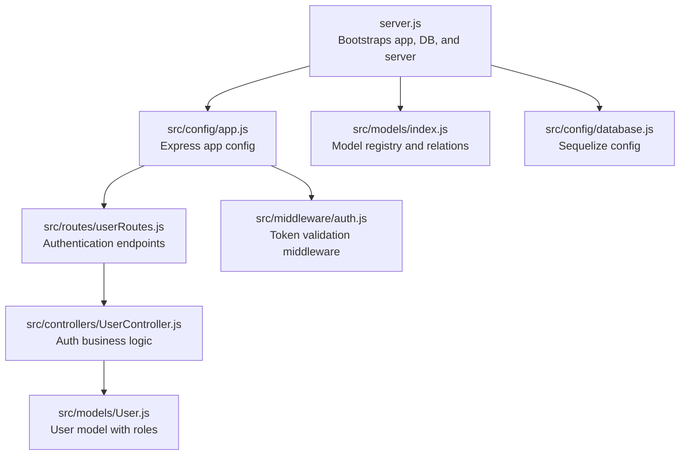
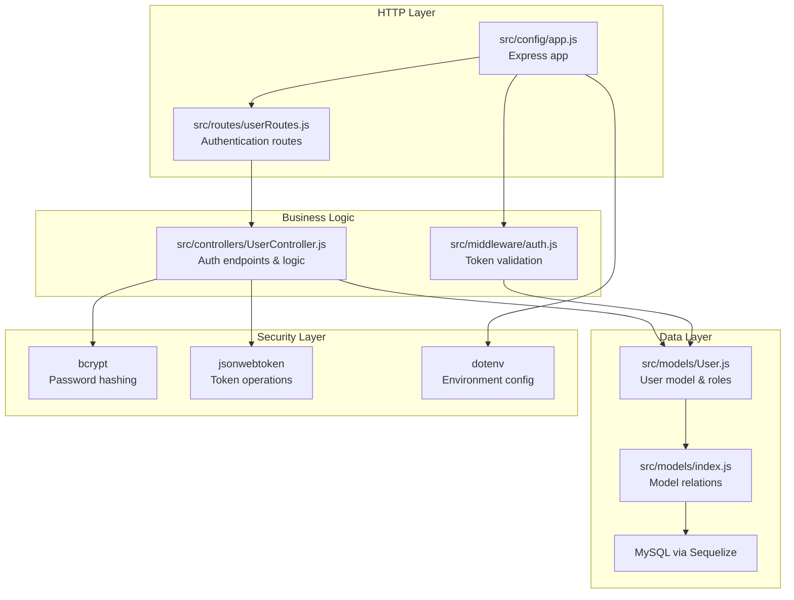
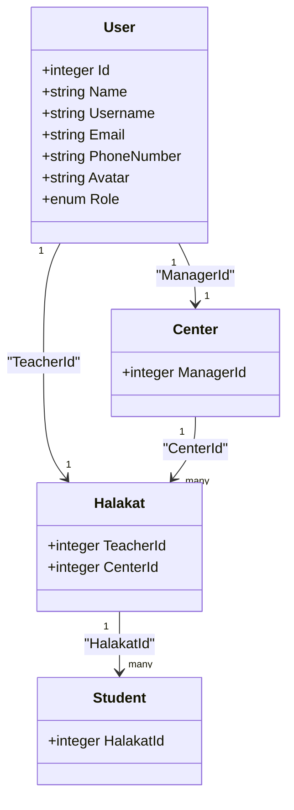
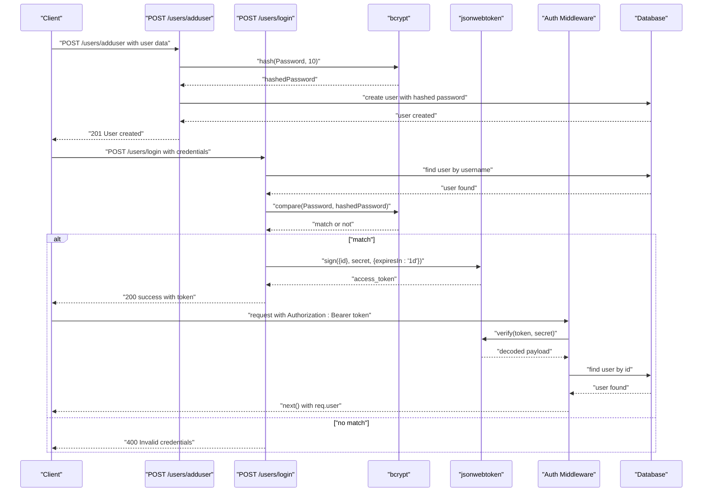
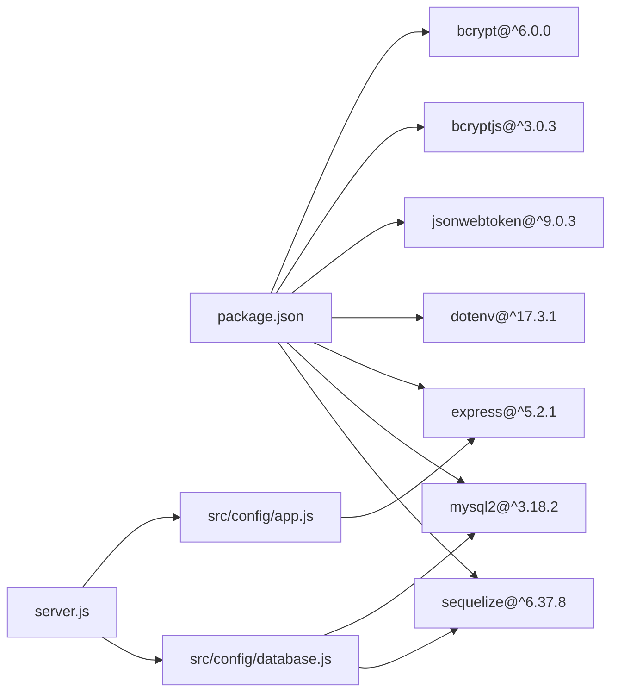

# Authentication & Authorization

<cite>
**Referenced Files in This Document**
- [server.js](file://backend/server.js)
- [app.js](file://backend/src/config/app.js)
- [database.js](file://backend/src/config/database.js)
- [UserController.js](file://backend/src/controllers/UserController.js)
- [auth.js](file://backend/src/middleware/auth.js)
- [userRoutes.js](file://backend/src/routes/userRoutes.js)
- [User.js](file://backend/src/models/User.js)
- [index.js](file://backend/src/models/index.js)
- [package.json](file://backend/package.json)
</cite>

## Update Summary
**Changes Made**
- Added comprehensive authentication endpoints documentation for UserController
- Updated JWT implementation details with bcrypt integration
- Enhanced middleware documentation with improved error handling
- Updated User model documentation with Arabic role names and relationships
- Added practical examples of authentication flow and middleware usage

## Table of Contents
1. [Introduction](#introduction)
2. [Project Structure](#project-structure)
3. [Core Components](#core-components)
4. [Architecture Overview](#architecture-overview)
5. [Detailed Component Analysis](#detailed-component-analysis)
6. [Authentication Endpoints](#authentication-endpoints)
7. [JWT Implementation](#jwt-implementation)
8. [Middleware and Authorization](#middleware-and-authorization)
9. [Dependency Analysis](#dependency-analysis)
10. [Performance Considerations](#performance-considerations)
11. [Troubleshooting Guide](#troubleshooting-guide)
12. [Conclusion](#conclusion)
13. [Appendices](#appendices)

## Introduction
This document explains the authentication and authorization design for the Khirocom system with a focus on user management and access control. The system implements a comprehensive JWT-based authentication flow with bcrypt password hashing, featuring dedicated authentication endpoints, role-based access control (RBAC), and secure credential storage. The User model supports multiple roles including admin, teacher, supervisor, manager, and student, with clear relationships to centers, halakats, and students based on their roles.

## Project Structure
The backend is organized around Express, Sequelize ORM, and environment-driven configuration. The server bootstraps the application, connects to the database, synchronizes models, and starts the HTTP listener. The authentication system is centered around UserController with dedicated endpoints for user registration and login, supported by robust middleware for token validation and user context attachment.

**Diagram sources**
- [server.js:1-25](file://backend/server.js#L1-L25)
- [app.js:1-16](file://backend/src/config/app.js#L1-L16)
- [database.js:1-16](file://backend/src/config/database.js#L1-L16)
- [index.js:1-65](file://backend/src/models/index.js#L1-L65)
- [UserController.js:1-66](file://backend/src/controllers/UserController.js#L1-L66)
- [auth.js:1-25](file://backend/src/middleware/auth.js#L1-L25)
- [userRoutes.js:1-8](file://backend/src/routes/userRoutes.js#L1-L8)

**Section sources**
- [server.js:1-25](file://backend/server.js#L1-L25)
- [app.js:1-16](file://backend/src/config/app.js#L1-L16)
- [database.js:1-16](file://backend/src/config/database.js#L1-L16)
- [index.js:1-65](file://backend/src/models/index.js#L1-L65)
- [UserController.js:1-66](file://backend/src/controllers/UserController.js#L1-L66)
- [auth.js:1-25](file://backend/src/middleware/auth.js#L1-L25)
- [userRoutes.js:1-8](file://backend/src/routes/userRoutes.js#L1-L8)

## Core Components
- **User Controller**: Implements comprehensive authentication endpoints including user registration (`POST /users/adduser`) and login (`POST /users/login`) with bcrypt password hashing and JWT token generation.
- **Authentication Middleware**: Validates JWT tokens from Authorization headers, extracts user context, and attaches authenticated users to request objects.
- **User Model**: Defines identity fields, credentials, avatar, and role enumeration with Arabic role names (admin, مدرس, مشرف, موجة, طالب). Roles include admin, teacher, supervisor, manager, and student with proper relationships.
- **Route Configuration**: Maps authentication endpoints to UserController methods with proper HTTP verb usage.
- **Application Bootstrap**: Express app configured for JSON payloads, database connection and sync, and server startup with authentication routes.
- **Dependencies**: bcrypt for password hashing, jsonwebtoken for JWT operations, dotenv for environment variables, and Sequelize for ORM.

Key RBAC roles with Arabic names:
- admin: Highest privilege level
- مدرس (teacher): Educator assigned to halakats
- مشرف (supervisor): Oversight role
- موجة (manager): Administrative role over centers
- طالب (student): Learner role

Credential storage:
- Password field is stored as a hashed value using bcrypt with 10 salt rounds. The model enforces a 255-character string column for hashed credentials.

Token support:
- jsonwebtoken is used for JWT-based authentication with 24-hour expiration, including signing, verification, and secure token handling.

**Section sources**
- [UserController.js:8-66](file://backend/src/controllers/UserController.js#L8-L66)
- [auth.js:4-25](file://backend/src/middleware/auth.js#L4-L25)
- [User.js:44-48](file://backend/src/models/User.js#L44-L48)
- [userRoutes.js:5-6](file://backend/src/routes/userRoutes.js#L5-L6)
- [app.js:7-8](file://backend/src/config/app.js#L7-L8)
- [package.json:4-11](file://backend/package.json#L4-L11)

## Architecture Overview
The authentication and authorization architecture centers on the UserController and its comprehensive authentication endpoints. JWT tokens are issued upon successful authentication and validated on protected routes through middleware. The system enforces role-based access checks against the User's role and related entities through proper middleware usage.

**Diagram sources**
- [app.js:1-16](file://backend/src/config/app.js#L1-L16)
- [userRoutes.js:1-8](file://backend/src/routes/userRoutes.js#L1-L8)
- [UserController.js:1-66](file://backend/src/controllers/UserController.js#L1-L66)
- [auth.js:1-25](file://backend/src/middleware/auth.js#L1-L25)
- [User.js:1-61](file://backend/src/models/User.js#L1-L61)
- [index.js:1-65](file://backend/src/models/index.js#L1-L65)
- [package.json:4-11](file://backend/package.json#L4-L11)

## Detailed Component Analysis

### User Model and RBAC
The User model defines identity and access attributes with comprehensive role support:
- Identity: Id, Name, Username, Email, PhoneNumber, Avatar
- Credentials: Password (hashed with bcrypt)
- Role: Enumerated role with Arabic names and defaults

Role-based relationships:
- Managers oversee Centers (one-to-one relationship)
- Teachers instruct Halakats (one-to-one relationship)
- Halakats enroll Students (one-to-many relationship)

**Diagram sources**
- [User.js:6-56](file://backend/src/models/User.js#L6-L56)
- [index.js:15-41](file://backend/src/models/index.js#L15-L41)

**Section sources**
- [User.js:6-56](file://backend/src/models/User.js#L6-L56)
- [index.js:15-41](file://backend/src/models/index.js#L15-L41)

### JWT-Based Authentication Flow
The system implements a complete JWT-based authentication flow using bcrypt for password security:
- Registration: Hash password with bcrypt (10 salt rounds), store user with hashed credentials
- Login: Verify credentials by comparing bcrypt hashes, generate JWT with user ID and 24-hour expiration
- Token Validation: Extract token from Authorization header, verify signature, attach user context
- Protected Access: Use middleware to enforce authentication on sensitive routes

**Diagram sources**
- [UserController.js:8-66](file://backend/src/controllers/UserController.js#L8-L66)
- [auth.js:4-25](file://backend/src/middleware/auth.js#L4-L25)

### Token Validation and Refresh Mechanisms
- **Validation**: Middleware extracts Authorization header, splits "Bearer token", verifies JWT signature with shared secret, decodes payload, and attaches user context to request object
- **Refresh**: Current implementation uses 24-hour token expiration; refresh mechanism can be implemented by adding a separate refresh endpoint that validates refresh tokens and issues new access tokens
- **Logout**: Current implementation relies on token expiration; logout can be implemented by maintaining token blacklists or using short-lived tokens with refresh token rotation

**Section sources**
- [auth.js:4-25](file://backend/src/middleware/auth.js#L4-L25)
- [UserController.js:42-46](file://backend/src/controllers/UserController.js#L42-L46)

### Secure Credential Storage and Session Security
- **Password hashing**: Uses bcrypt with 10 salt rounds for secure password storage, preventing rainbow table attacks and ensuring unique hashes even for identical passwords
- **Token storage**: JWT tokens are transmitted in Authorization headers as Bearer tokens, avoiding client-side storage vulnerabilities
- **Token security**: Tokens expire after 24 hours, reducing window of compromise; secret key stored in environment variables
- **Error handling**: Comprehensive error handling prevents information leakage while providing meaningful feedback for debugging

**Section sources**
- [UserController.js:12-14](file://backend/src/controllers/UserController.js#L12-L14)
- [UserController.js:36](file://backend/src/controllers/UserController.js#L36)
- [UserController.js:42-46](file://backend/src/controllers/UserController.js#L42-L46)
- [auth.js:11](file://backend/src/middleware/auth.js#L11)

### Role-Based Route Protection
- **Middleware implementation**: Authentication middleware validates tokens, extracts user context, and attaches authenticated users to request objects for downstream processing
- **Authorization patterns**: Can be extended to check user roles against required permissions for different resource access levels
- **Protected routes**: Middleware can be applied to routes requiring authentication, with role-specific guards for sensitive operations

**Section sources**
- [auth.js:19](file://backend/src/middleware/auth.js#L19)
- [auth.js:21](file://backend/src/middleware/auth.js#L21)

## Authentication Endpoints
The UserController provides two primary authentication endpoints:

### POST /users/adduser
Creates a new user with bcrypt-hashed password:
- **Request Body**: User registration data (Name, Username, Password, Email, PhoneNumber, Avatar, Role)
- **Processing**: Hashes password with bcrypt (10 salt rounds), creates user record
- **Response**: 201 status with success message and user data
- **Error Handling**: Returns 500 status for database errors

### POST /users/login
Authenticates existing users:
- **Request Body**: Username and Password credentials
- **Processing**: 
  1. Finds user by username
  2. Compares provided password with stored hash using bcrypt
  3. Generates JWT token with user ID and 24-hour expiration
- **Response**: 200 status with success message, user data, and JWT token
- **Error Handling**: Returns 400 for user not found or invalid credentials, 500 for server errors

**Section sources**
- [userRoutes.js:5-6](file://backend/src/routes/userRoutes.js#L5-L6)
- [UserController.js:8-22](file://backend/src/controllers/UserController.js#L8-L22)
- [UserController.js:23-63](file://backend/src/controllers/UserController.js#L23-L63)

## JWT Implementation
The authentication system uses JWT for stateless session management:

### Token Generation
- **Payload**: Contains user ID (Id) for identification
- **Secret**: Stored in environment variables (process.env.JWT_SECRET)
- **Expiration**: 24 hours (86400 seconds)
- **Algorithm**: HS256 (default for jsonwebtoken)

### Token Validation Process
- **Header Extraction**: Middleware reads Authorization header from request
- **Token Parsing**: Splits "Bearer token" format to extract JWT
- **Signature Verification**: Validates token signature using shared secret
- **User Context Attachment**: Retrieves user from database using decoded ID and attaches to request object

### Security Considerations
- **Secret Management**: JWT secret stored in environment variables
- **Token Expiration**: Automatic invalidation after 24 hours
- **Error Handling**: Prevents information leakage through generic error messages
- **Input Validation**: Validates presence of Authorization header before processing

**Section sources**
- [UserController.js:42-46](file://backend/src/controllers/UserController.js#L42-L46)
- [auth.js:6-11](file://backend/src/middleware/auth.js#L6-L11)
- [auth.js:13-19](file://backend/src/middleware/auth.js#L13-L19)

## Middleware and Authorization
The authentication middleware provides robust token validation and user context attachment:

### Middleware Functionality
- **Header Processing**: Extracts Authorization header and validates Bearer token format
- **Token Verification**: Uses jsonwebtoken to verify signature and decode payload
- **User Resolution**: Queries database for user associated with token payload
- **Context Attachment**: Attaches authenticated user object to request for downstream use
- **Error Handling**: Comprehensive error handling with appropriate HTTP status codes

### Error Handling Strategy
- **Missing Header**: Returns 401 with "invalid token" message
- **Invalid Token**: Returns 401 with "invalid token" message
- **User Not Found**: Returns 401 with "user not found" message
- **Generic Errors**: Returns 401 with "invalid token" message for unexpected errors

### Usage Patterns
- **Route Protection**: Apply middleware to routes requiring authentication
- **User Context**: Access authenticated user via `req.user` in subsequent handlers
- **Role Checks**: Extend middleware to enforce role-based authorization

**Section sources**
- [auth.js:4-25](file://backend/src/middleware/auth.js#L4-L25)

## Dependency Analysis
The authentication stack relies on several key libraries with enhanced security features:

- **bcrypt**: Password hashing with configurable salt rounds (10)
- **bcryptjs**: Alternative bcrypt implementation for compatibility
- **jsonwebtoken**: JWT signing, verification, and token management
- **dotenv**: Environment configuration for secrets and database credentials
- **express**: Web framework for routing and middleware
- **mysql2**: MySQL database driver
- **sequelize**: ORM for database operations and model relationships

**Diagram sources**
- [package.json:1-14](file://backend/package.json#L1-L14)
- [app.js:1-16](file://backend/src/config/app.js#L1-L16)
- [database.js:1-16](file://backend/src/config/database.js#L1-L16)
- [server.js:1-25](file://backend/server.js#L1-L25)

**Section sources**
- [package.json:1-14](file://backend/package.json#L1-L14)
- [app.js:1-16](file://backend/src/config/app.js#L1-L16)
- [database.js:1-16](file://backend/src/config/database.js#L1-L16)
- [server.js:1-25](file://backend/server.js#L1-L25)

## Performance Considerations
- **Hashing cost**: Bcrypt salt rounds set to 10 provide good security-performance balance
- **Token size**: JWT payloads contain only user ID, keeping token size minimal
- **Database queries**: Efficient single-user lookup for authentication and user context resolution
- **Connection pooling**: Sequelize manages database connections efficiently
- **Memory usage**: Middleware processes tokens without storing user data in memory beyond request scope

## Troubleshooting Guide
Common issues and resolutions:
- **Database connection failures**: Verify environment variables for host, port, user, password, and database name. Confirm service availability and network access.
- **Model synchronization errors**: Review model definitions and relationships for constraint violations. Use safe sync options during development.
- **JWT verification errors**: Ensure the JWT secret matches environment configuration. Check token expiration and signature validation.
- **Password mismatch**: Confirm bcrypt hashing and comparison logic. Validate input encoding and normalization.
- **Authentication failures**: Verify Authorization header format ("Bearer token") and token validity.
- **Middleware errors**: Check that routes are properly mounted and middleware is applied before route handlers.

**Section sources**
- [database.js:4-15](file://backend/src/config/database.js#L4-L15)
- [server.js:8-22](file://backend/server.js#L8-L22)
- [package.json:4-11](file://backend/package.json#L4-L11)
- [auth.js:7](file://backend/src/middleware/auth.js#L7)
- [auth.js:23](file://backend/src/middleware/auth.js#L23)

## Conclusion
Khirocom's authentication and authorization system provides a robust foundation built on bcrypt-secured credentials, JWT-based session management, and comprehensive role-based access control. The UserController implements complete authentication workflows with proper error handling, while the middleware ensures secure token validation and user context attachment. With Arabic role names and clear relationships to centers, halakats, and students, the system supports the educational institution's operational needs while maintaining strong security practices.

## Appendices

### Implementation Guidelines for Extending Authentication
- **Adding new roles**:
  - Extend the User role enum with new Arabic role names
  - Update role guards to recognize new roles and map to appropriate permissions
  - Consider adding role-specific relationships in model definitions

- **Adding new permissions**:
  - Introduce a Permission model and associate it with roles
  - Enhance middleware to enforce granular permission checks
  - Implement role-permission matrices for flexible access control

- **Token lifecycle improvements**:
  - Implement refresh token mechanism with separate endpoints
  - Add token blacklisting for logout functionality
  - Configure token rotation for enhanced security

- **Audit and monitoring**:
  - Log authentication attempts, failures, and authorization decisions
  - Monitor for brute force and suspicious activity patterns
  - Implement rate limiting for authentication endpoints

- **Security enhancements**:
  - Add input validation and sanitization
  - Implement CORS policies for API endpoints
  - Add HTTPS enforcement and secure cookie settings
  - Consider implementing two-factor authentication