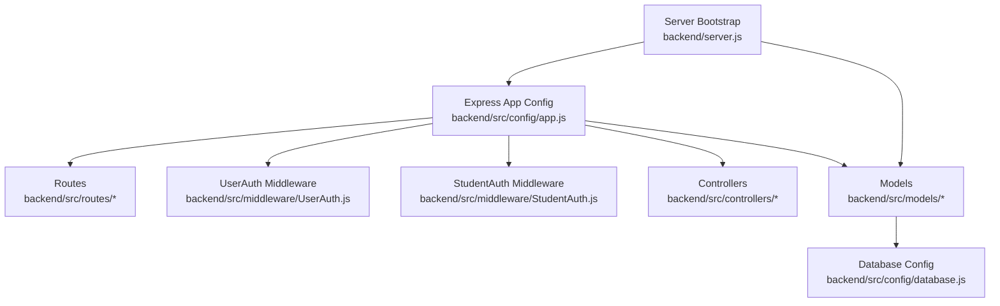
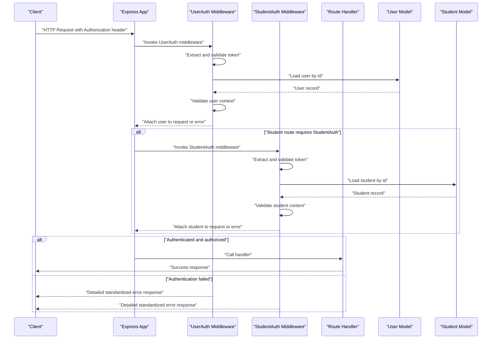
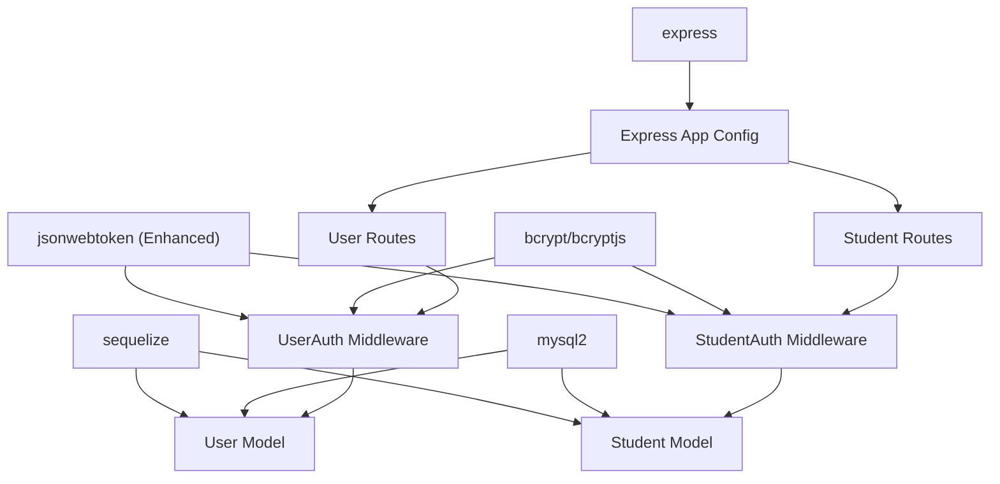

# Authentication Middleware & Integration

<cite>
**Referenced Files in This Document**
- [server.js](file://backend/server.js)
- [app.js](file://backend/src/config/app.js)
- [database.js](file://backend/src/config/database.js)
- [User.js](file://backend/src/models/User.js)
- [Student.js](file://backend/src/models/Student.js)
- [UserAuth.js](file://backend/src/middleware/UserAuth.js)
- [StudentAuth.js](file://backend/src/middleware/StudentAuth.js)
- [userRoutes.js](file://backend/src/routes/userRoutes.js)
- [studentRouts.js](file://backend/src/routes/studentRouts.js)
- [package.json](file://backend/package.json)
</cite>

## Update Summary
**Changes Made**
- Updated middleware file references from `auth.js` to `UserAuth.js` for naming consistency
- Added comprehensive documentation for new `StudentAuth.js` middleware implementation
- Enhanced debugging documentation with console.log statements in both middleware implementations
- Updated middleware integration patterns for dual-user authentication system
- Documented separation of concerns between UserAuth and StudentAuth middleware
- Added detailed analysis of claim key differences and error handling variations

## Table of Contents
1. [Introduction](#introduction)
2. [Project Structure](#project-structure)
3. [Core Components](#core-components)
4. [Architecture Overview](#architecture-overview)
5. [Detailed Component Analysis](#detailed-component-analysis)
6. [Enhanced Authentication Middleware](#enhanced-authentication-middleware)
7. [Dual Authentication System](#dual-authentication-system)
8. [Dependency Analysis](#dependency-analysis)
9. [Performance Considerations](#performance-considerations)
10. [Troubleshooting Guide](#troubleshooting-guide)
11. [Conclusion](#conclusion)

## Introduction
This document provides comprehensive authentication middleware documentation for integrating JWT-based authentication across the Khirocom application. The application now features a dual authentication system with separate middleware for users and students, each with enhanced error handling, improved token extraction logic, and robust user context validation. The middleware implementations include enhanced debugging capabilities with console.log statements for better monitoring and troubleshooting.

## Project Structure
The backend follows a modular Express architecture with configuration, models, routes, controllers, and middleware directories. The authentication system now includes two specialized middleware components: UserAuth for administrative and teaching staff, and StudentAuth for student users. Both middleware are integrated into the Express application via the central configuration module and applied to route handlers with enhanced debugging capabilities.

**Diagram sources**
- [server.js:1-26](file://backend/server.js#L1-L26)
- [app.js](file://backend/src/config/app.js)
- [database.js](file://backend/src/config/database.js)
- [User.js](file://backend/src/models/User.js)
- [Student.js](file://backend/src/models/Student.js)
- [UserAuth.js](file://backend/src/middleware/UserAuth.js)
- [StudentAuth.js](file://backend/src/middleware/StudentAuth.js)

**Section sources**
- [server.js:1-26](file://backend/server.js#L1-L26)
- [app.js](file://backend/src/config/app.js)
- [database.js](file://backend/src/config/database.js)

## Core Components
- **Enhanced Express application configuration module**: Provides the Express app instance and middleware chain registration with improved error handling and dual authentication support.
- **Database configuration**: Establishes connection and model synchronization for both User and Student entities.
- **User model**: Defines administrative and teaching staff entity with comprehensive role-based access control.
- **Student model**: Defines student entity with status tracking and educational progress management.
- **UserAuth middleware**: Specialized JWT authentication for administrative and teaching staff with enhanced debugging.
- **StudentAuth middleware**: Specialized JWT authentication for student users with enhanced debugging and different error handling patterns.
- **Server bootstrap**: Initializes database connectivity, model synchronization, and HTTP server startup with comprehensive logging.

Key integration points:
- Dual middleware registration in the Express app configuration module.
- Route protection using specialized middleware functions for different user types.
- Role enforcement against user model attributes with enhanced error responses.
- Comprehensive logging for debugging and monitoring both authentication systems.
- Standardized error handling and response formatting for authentication failures.

**Section sources**
- [app.js](file://backend/src/config/app.js)
- [database.js](file://backend/src/config/database.js)
- [User.js](file://backend/src/models/User.js)
- [Student.js](file://backend/src/models/Student.js)
- [UserAuth.js](file://backend/src/middleware/UserAuth.js)
- [StudentAuth.js](file://backend/src/middleware/StudentAuth.js)
- [package.json:1-14](file://backend/package.json#L1-L14)

## Architecture Overview
The enhanced authentication middleware system consists of two specialized components that sit in front of route handlers to validate incoming requests and enforce access policies. The UserAuth middleware handles administrative and teaching staff authentication, while StudentAuth manages student authentication. Both middleware include improved error handling, better token extraction logic, and robust user context validation with enhanced debugging capabilities.

## Detailed Component Analysis

### Express App Configuration
Responsibilities:
- Initialize Express app with enhanced middleware chain support.
- Register middleware chain including both UserAuth and StudentAuth middleware.
- Mount route handlers with appropriate middleware selection.
- Configure error handling for dual authentication system.

Middleware chain configuration:
- Place UserAuth middleware for administrative routes.
- Place StudentAuth middleware for student-specific routes.
- Ensure error-handling middleware is registered last.

Route protection strategies:
- Separate route groups for different user types.
- Use middleware guards to apply appropriate authentication per route group.
- Implement selective middleware application based on route requirements.

**Section sources**
- [app.js](file://backend/src/config/app.js)

### Database and Model Layer
The dual authentication system relies on two distinct models with different authentication patterns:

**User Model (Administrative/Teaching Staff)**:
- Store user identifiers (Id) and comprehensive roles.
- Support lookups by Id for authenticated sessions.
- Enable role comparisons for administrative authorization checks.

**Student Model (Student Users)**:
- Store student identifiers (Id) and enrollment status.
- Support lookups by Id for student sessions.
- Enable status-based access control for educational features.

Model synchronization:
- The server bootstraps database connections and synchronizes models during startup.
- Both User and Student models are registered with Sequelize ORM.

**Section sources**
- [User.js](file://backend/src/models/User.js)
- [Student.js](file://backend/src/models/Student.js)
- [database.js](file://backend/src/config/database.js)
- [server.js:8-23](file://backend/server.js#L8-L23)

### Server Bootstrap
Lifecycle:
- Load environment variables for JWT configuration.
- Initialize database connection and synchronize models.
- Start HTTP server and listen on configured port with enhanced logging.

Operational insights:
- Database authentication logs indicate successful connection.
- Model registration confirms both User and Student models are available.
- Server startup logs show proper initialization sequence.

**Section sources**
- [server.js:1-26](file://backend/server.js#L1-L26)

## Enhanced Authentication Middleware

### UserAuth Middleware
Enhanced with improved error handling, better token extraction logic, and robust user context validation with comprehensive debugging.

Purpose:
- Validate JWT tokens from Authorization headers for administrative and teaching staff.
- Load user identity from the User model with comprehensive validation.
- Provide standardized error responses for authentication failures with detailed logging.
- Implement robust token extraction logic with proper validation and debugging.

Implementation enhancements:
- **Improved token extraction**: Enhanced Authorization header parsing with better validation.
- **Comprehensive error handling**: Structured error handling with detailed logging and appropriate status codes.
- **Robust user validation**: Enhanced user lookup validation with proper error responses.
- **Enhanced debugging**: Console logging for debugging and monitoring with decoded token and user information.
- **Security improvements**: Proper error handling prevents information leakage.

Enhanced implementation outline:
- **Token extraction**: Read Authorization header and parse Bearer token with validation.
- **Signature verification**: Use jsonwebtoken to verify token signature and expiration with comprehensive error handling.
- **Claims resolution**: Extract user identifier (Id) from token payload.
- **Identity loading**: Query the User model to load the user record with validation.
- **User context validation**: Enhanced user lookup validation and error handling.
- **Error handling**: Return standardized error responses with detailed logging for invalid/expired tokens, missing permissions, and missing headers.

Integration pattern:
- Apply UserAuth middleware to administrative and teaching staff routes.
- Expose protected routes via userRoutes.js with enhanced error responses.

### StudentAuth Middleware  
**New** Specialized middleware for student authentication with enhanced debugging capabilities.

Purpose:
- Validate JWT tokens from Authorization headers for student users.
- Load student identity from the Student model with comprehensive validation.
- Provide standardized error responses for student authentication failures.
- Implement robust token extraction logic with proper validation and debugging.

Implementation enhancements:
- **Improved token extraction**: Enhanced Authorization header parsing with better validation.
- **Comprehensive error handling**: Structured error handling with detailed logging and appropriate status codes.
- **Robust student validation**: Enhanced student lookup validation with proper error responses.
- **Enhanced debugging**: Console logging for debugging and monitoring with decoded student information.
- **Differentiated error responses**: Uses different error messages and status codes compared to UserAuth.

Enhanced implementation outline:
- **Token extraction**: Read Authorization header and parse Bearer token with validation.
- **Signature verification**: Use jsonwebtoken to verify token signature and expiration with comprehensive error handling.
- **Claims resolution**: Extract student identifier (id) from token payload.
- **Identity loading**: Query the Student model to load the student record with validation.
- **Student context validation**: Enhanced student lookup validation and error handling.
- **Error handling**: Return standardized error responses with detailed logging for invalid/expired tokens and missing students.

Integration pattern:
- Apply StudentAuth middleware to student-specific routes.
- Expose protected student routes via studentRouts.js with enhanced error responses.

Customization options:
- Token issuer, audience, and expiration policies.
- Role claim key and role hierarchy for UserAuth.
- Different claim keys for user vs student identification.
- Custom error response format and status codes for both middleware types.
- Secret key management and security configurations.

Debugging techniques:
- Log token extraction and verification outcomes with detailed information.
- Inspect decoded claims and user/student lookup results.
- Track middleware invocation order and timing for both authentication types.
- Monitor error handling and response formatting for different user types.
- Use console.log statements for real-time debugging in development.

**Section sources**
- [UserAuth.js:1-25](file://backend/src/middleware/UserAuth.js#L1-L25)
- [StudentAuth.js:1-27](file://backend/src/middleware/StudentAuth.js#L1-L27)
- [app.js](file://backend/src/config/app.js)
- [User.js](file://backend/src/models/User.js)
- [Student.js](file://backend/src/models/Student.js)
- [package.json](file://backend/package.json#L8)

## Dual Authentication System

### Middleware Integration Patterns
The application now implements a dual authentication system with specialized middleware for different user types:

**UserAuth Integration**:
- Imported as `auth` in userRoutes.js for administrative routes.
- Applied to routes requiring administrative access.
- Uses User model for authentication and authorization.

**StudentAuth Integration**:
- Imported as `studentauth` in studentRouts.js for student routes.
- Applied to routes requiring student access.
- Uses Student model for authentication and authorization.

**Hybrid Route Usage**:
- Some routes require both UserAuth and StudentAuth for different operations.
- Demonstrates flexible middleware application based on route requirements.

### Debugging and Monitoring
Both middleware implementations include comprehensive debugging capabilities:

**Console Logging Features**:
- Token extraction and verification outcomes are logged.
- Decoded token information is displayed for debugging.
- User and student records are logged upon successful authentication.
- Error conditions are logged with detailed error information.

**Development Benefits**:
- Real-time debugging of authentication flows.
- Easy identification of token validation issues.
- Clear visibility of user and student context loading.
- Comprehensive error tracking for troubleshooting.

**Section sources**
- [userRoutes.js:1-17](file://backend/src/routes/userRoutes.js#L1-L17)
- [studentRouts.js:1-24](file://backend/src/routes/studentRouts.js#L1-L24)
- [UserAuth.js:12-23](file://backend/src/middleware/UserAuth.js#L12-L23)
- [StudentAuth.js:15-25](file://backend/src/middleware/StudentAuth.js#L15-L25)

## Dependency Analysis
External libraries supporting dual JWT authentication:
- **jsonwebtoken**: Enhanced token signing and verification with improved error handling for both middleware types.
- **bcrypt/bcryptjs**: Password hashing (used alongside JWT for credential-based flows).
- **express**: Web framework hosting dual middleware and routes.
- **sequelize/mysql2**: ORM and database driver for user and student persistence.

**Diagram sources**
- [package.json:1-14](file://backend/package.json#L1-L14)

**Section sources**
- [package.json:1-14](file://backend/package.json#L1-L14)

## Performance Considerations
- **Token caching**: Cache recent verified tokens to reduce repeated signature verifications for both user types.
- **Asynchronous user/student lookup**: Ensure user and student fetches are optimized and indexed by identifier.
- **Middleware ordering**: Place lightweight checks early to fail fast for both authentication types.
- **Error short-circuit**: Return standardized errors promptly to avoid unnecessary downstream work.
- **Logging overhead**: Limit debug logging in production to reduce I/O for both middleware types.
- **Enhanced error handling**: Efficient error handling reduces unnecessary processing for both authentication systems.
- **Validation optimization**: Streamlined token extraction and user/student validation improve performance.
- **Separate middleware optimization**: Optimize each middleware type for its specific user model and use case.

## Troubleshooting Guide
Common issues and resolutions for the dual authentication system:

**UserAuth Issues**:
- **Missing Authorization header**: Ensure clients send Bearer token in Authorization header with proper formatting.
- **Expired or invalid token**: Verify token expiration and issuer configuration with enhanced error messages.
- **User not found**: Confirm user exists in database with correct Id field.
- **Database connectivity**: Check server logs for database authentication and sync messages.

**StudentAuth Issues**:
- **Missing Authorization header**: Ensure clients send Bearer token in Authorization header with proper formatting.
- **Expired or invalid token**: Verify token expiration and issuer configuration with enhanced error messages.
- **Student not found**: Confirm student exists in database with correct id field.
- **Token claim mismatch**: Verify token contains correct student identifier claim.

**Shared Issues**:
- **Middleware not applied**: Verify middleware registration order and route mounting.
- **Enhanced error handling**: Utilize detailed error messages for debugging authentication issues.
- **Console log debugging**: Monitor console output for detailed authentication flow information.

**Debugging Steps**:
- **Log token extraction**: Monitor token parsing and verification outcomes with detailed logging.
- **Inspect decoded claims**: Validate decoded claims and user/student lookup results.
- **Check user/student validation**: Verify lookup results and context validation.
- **Review error handling**: Analyze enhanced error handling patterns and response formatting.
- **Validate environment variables**: Ensure proper configuration for secret keys and security settings.

**Section sources**
- [server.js:8-23](file://backend/server.js#L8-L23)
- [app.js](file://backend/src/config/app.js)
- [UserAuth.js:1-25](file://backend/src/middleware/UserAuth.js#L1-L25)
- [StudentAuth.js:1-27](file://backend/src/middleware/StudentAuth.js#L1-L27)

## Conclusion
The Khirocom application's enhanced dual authentication middleware system integrates seamlessly with the Express app configuration and model layer to provide comprehensive authentication for both administrative/staff users and student users. The middleware improvements include enhanced error handling, better token extraction logic, robust user context validation, and comprehensive debugging capabilities with console.log statements.

The separation of UserAuth and StudentAuth middleware provides clear distinction between administrative and student authentication flows, each with specialized error handling and debugging patterns. By applying standardized middleware patterns, configuring robust error handling, and optimizing performance, teams can reliably secure APIs while maintaining flexibility for diverse authentication scenarios.

The enhanced debugging and troubleshooting capabilities ensure smooth integration and operation across development and production environments with improved security and reliability for both user types. The dual authentication system provides a scalable foundation for future authentication requirements and user type expansions.

**Key Technical Differences Identified**:
- **Claim Key Handling**: UserAuth uses `decoded.Id` (uppercase) while StudentAuth uses `decoded.id` (lowercase)
- **Error Response Variations**: StudentAuth returns "Student not found" with 404 status, UserAuth returns "user not found" with 401 status
- **Model Integration**: UserAuth integrates with User model, StudentAuth integrates with Student model
- **Debugging Implementation**: Both include console.log statements for enhanced monitoring
- **Route Integration**: Different import patterns (`auth` vs `studentauth`) in route files

These differences demonstrate the intentional separation of concerns between the two authentication systems, allowing for specialized handling of different user types while maintaining consistent authentication patterns across the application.