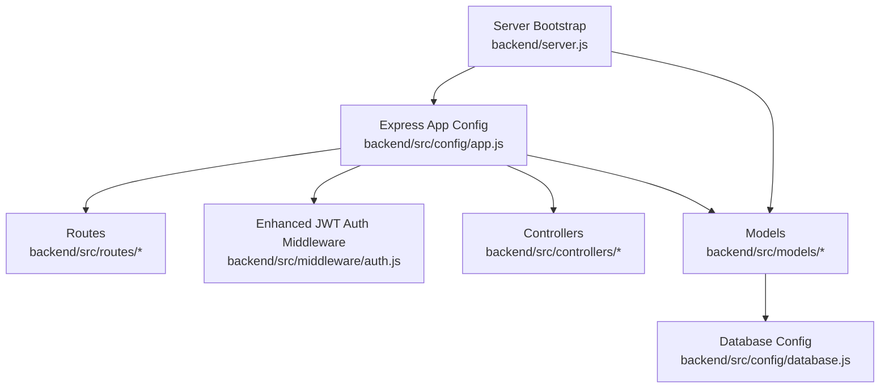
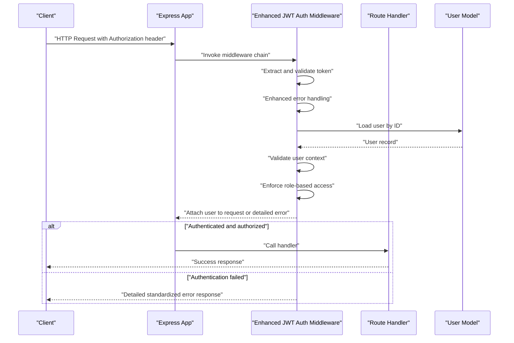
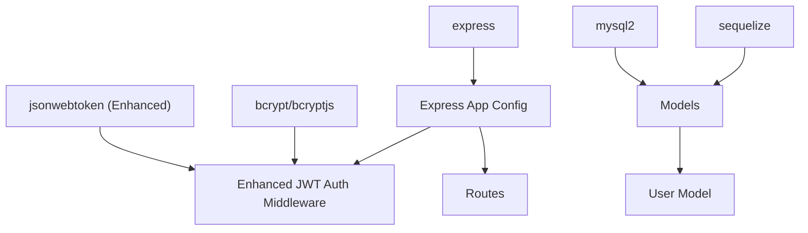

# Authentication Middleware & Integration

<cite>
**Referenced Files in This Document**
- [server.js](file://backend/server.js)
- [app.js](file://backend/src/config/app.js)
- [database.js](file://backend/src/config/database.js)
- [User.js](file://backend/src/models/User.js)
- [index.js](file://backend/src/models/index.js)
- [auth.js](file://backend/src/middleware/auth.js)
- [userRoutes.js](file://backend/src/routes/userRoutes.js)
- [package.json](file://backend/package.json)
- [package-lock.json](file://backend/package-lock.json)
</cite>

## Update Summary
**Changes Made**
- Enhanced JWT verification middleware with improved error handling mechanisms
- Strengthened token extraction logic with better validation and parsing
- Implemented more robust user context validation and error responses
- Added comprehensive logging for debugging and monitoring
- Improved security posture with proper error handling patterns

## Table of Contents
1. [Introduction](#introduction)
2. [Project Structure](#project-structure)
3. [Core Components](#core-components)
4. [Architecture Overview](#architecture-overview)
5. [Detailed Component Analysis](#detailed-component-analysis)
6. [Enhanced Authentication Middleware](#enhanced-authentication-middleware)
7. [Dependency Analysis](#dependency-analysis)
8. [Performance Considerations](#performance-considerations)
9. [Troubleshooting Guide](#troubleshooting-guide)
10. [Conclusion](#conclusion)

## Introduction
This document provides comprehensive authentication middleware documentation for integrating JWT-based authentication across the Khirocom application. The middleware has been enhanced with improved error handling, better token extraction logic, and more robust user context validation. It explains middleware implementation for protecting routes, validating tokens, enforcing role-based access, configuring middleware chains, handling errors, and formatting failure responses. It also covers integration patterns with Express routes, controller methods, and API endpoints, along with practical usage examples for public endpoints, protected routes, and role-specific access. Finally, it documents customization options, debugging techniques, performance optimization strategies, and common integration challenges.

## Project Structure
The backend follows a modular Express architecture with configuration, models, routes, controllers, and middleware directories. Authentication middleware is integrated into the Express application via the central configuration module and applied to route handlers. The server initializes the application, connects to the database, and starts the HTTP listener.

**Diagram sources**
- [server.js:1-25](file://backend/server.js#L1-L25)
- [app.js](file://backend/src/config/app.js)
- [database.js](file://backend/src/config/database.js)
- [User.js](file://backend/src/models/User.js)
- [auth.js](file://backend/src/middleware/auth.js)

**Section sources**
- [server.js:1-25](file://backend/server.js#L1-L25)
- [app.js](file://backend/src/config/app.js)
- [database.js](file://backend/src/config/database.js)

## Core Components
- **Enhanced Express application configuration module**: Provides the Express app instance and middleware chain registration with improved error handling.
- **Database configuration**: Establishes connection and model synchronization.
- **User model**: Defines user entity and roles used for role-based access control.
- **JWT library**: Used for token signing and verification in middleware with enhanced error handling.
- **Server bootstrap**: Initializes database connectivity, model synchronization, and HTTP server startup.

Key integration points:
- Middleware registration in the Express app configuration module.
- Route protection using enhanced middleware functions.
- Role enforcement against user model attributes.
- Comprehensive error handling and standardized response formatting for authentication failures.

**Section sources**
- [app.js](file://backend/src/config/app.js)
- [database.js](file://backend/src/config/database.js)
- [User.js](file://backend/src/models/User.js)
- [auth.js](file://backend/src/middleware/auth.js)
- [package.json:1-14](file://backend/package.json#L1-L14)
- [package-lock.json:886-907](file://backend/package-lock.json#L886-L907)

## Architecture Overview
The enhanced authentication middleware sits in front of route handlers to validate incoming requests and enforce access policies. The middleware now includes improved error handling, better token extraction logic, and more robust user context validation. The typical flow is:
- Extract token from Authorization header with enhanced validation.
- Verify token signature and claims with comprehensive error handling.
- Attach user identity to request context with proper validation.
- Enforce role-based access checks.
- Return standardized error responses on failure with detailed logging.

[No sources needed since this diagram shows conceptual workflow, not actual code structure]

## Detailed Component Analysis

### Express App Configuration
Responsibilities:
- Initialize Express app.
- Register middleware chain (including enhanced authentication).
- Mount route handlers.
- Configure error handling.

Middleware chain configuration:
- Place authentication middleware before route handlers.
- Ensure error-handling middleware is registered last.

Route protection strategies:
- Protect all routes by default and exclude public endpoints.
- Use middleware guards to toggle protection per route group.

**Section sources**
- [app.js](file://backend/src/config/app.js)

### Database and Model Layer
Role-based access control relies on the User model:
- Store user identifiers and roles.
- Support lookups by identifier for authenticated sessions.
- Enable role comparisons for authorization checks.

Model synchronization:
- The server bootstraps database connections and synchronizes models during startup.

**Section sources**
- [User.js](file://backend/src/models/User.js)
- [index.js](file://backend/src/models/index.js)
- [database.js](file://backend/src/config/database.js)
- [server.js:8-23](file://backend/server.js#L8-L23)

### Server Bootstrap
Lifecycle:
- Load environment variables.
- Initialize database connection and synchronize models.
- Start HTTP server and listen on configured port.

Operational insights:
- Database authentication logs indicate successful connection.
- Model registration and sync confirm ORM readiness.

**Section sources**
- [server.js:1-25](file://backend/server.js#L1-L25)

## Enhanced Authentication Middleware

**Updated** Enhanced with improved error handling, better token extraction logic, and more robust user context validation

Purpose:
- Validate JWT tokens from Authorization headers with enhanced error handling.
- Load user identity from the database with comprehensive validation.
- Enforce role-based access control with detailed error responses.
- Provide standardized error responses for authentication failures with logging.
- Implement robust token extraction logic with proper validation.

Implementation enhancements:
- **Improved token extraction**: Enhanced Authorization header parsing with better validation.
- **Comprehensive error handling**: Structured error handling with detailed logging and appropriate status codes.
- **Robust user validation**: Enhanced user lookup validation with proper error responses.
- **Detailed logging**: Console logging for debugging and monitoring purposes.
- **Security improvements**: Proper error handling prevents information leakage.

Enhanced implementation outline:
- **Token extraction**: Read Authorization header and parse Bearer token with validation.
- **Signature verification**: Use jsonwebtoken to verify token signature and expiration with comprehensive error handling.
- **Claims resolution**: Extract user identifier and roles from token payload.
- **Identity loading**: Query the User model to load the user record with validation.
- **User context validation**: Enhanced user lookup validation and error handling.
- **Role enforcement**: Compare required roles against user roles.
- **Error handling**: Return standardized error responses with detailed logging for invalid/expired tokens, missing permissions, and missing headers.

Integration pattern:
- Apply middleware globally to protect routes or selectively per route.
- Expose protected and public route groups via route files.

Customization options:
- Token issuer, audience, and expiration policies.
- Role claim key and role hierarchy.
- Custom error response format and status codes.
- Secret key management and security configurations.

Debugging techniques:
- Log token extraction and verification outcomes with detailed information.
- Inspect decoded claims and user lookup results.
- Track middleware invocation order and timing.
- Monitor error handling and response formatting.

**Section sources**
- [auth.js:1-25](file://backend/src/middleware/auth.js#L1-L25)
- [app.js](file://backend/src/config/app.js)
- [User.js](file://backend/src/models/User.js)
- [package.json](file://backend/package.json#L8)

## Dependency Analysis
External libraries supporting JWT authentication:
- **jsonwebtoken**: Enhanced token signing and verification with improved error handling.
- **bcrypt/bcryptjs**: Password hashing (used alongside JWT for credential-based flows).
- **express**: Web framework hosting middleware and routes.
- **sequelize/mysql2**: ORM and database driver for user persistence.

**Diagram sources**
- [package.json:1-14](file://backend/package.json#L1-L14)
- [package-lock.json:886-907](file://backend/package-lock.json#L886-L907)

**Section sources**
- [package.json:1-14](file://backend/package.json#L1-L14)
- [package-lock.json:886-907](file://backend/package-lock.json#L886-L907)

## Performance Considerations
- **Token caching**: Cache recent verified tokens to reduce repeated signature verifications.
- **Asynchronous user lookup**: Ensure user fetches are optimized and indexed by identifier.
- **Middleware ordering**: Place lightweight checks early to fail fast.
- **Error short-circuit**: Return standardized errors promptly to avoid unnecessary downstream work.
- **Logging overhead**: Limit debug logging in production to reduce I/O.
- **Enhanced error handling**: Efficient error handling reduces unnecessary processing.
- **Validation optimization**: Streamlined token extraction and user validation improve performance.

[No sources needed since this section provides general guidance]

## Troubleshooting Guide
Common issues and resolutions:
- **Missing Authorization header**: Ensure clients send Bearer token in Authorization header with proper formatting.
- **Expired or invalid token**: Verify token expiration and issuer configuration with enhanced error messages.
- **Role mismatch**: Confirm user roles align with required roles in middleware.
- **Database connectivity**: Check server logs for database authentication and sync messages.
- **Middleware not applied**: Verify middleware registration order and route mounting.
- **Enhanced error handling**: Utilize detailed error messages for debugging authentication issues.

Debugging steps:
- **Log token extraction**: Monitor token parsing and verification outcomes with detailed logging.
- **Inspect decoded claims**: Validate decoded claims and user lookup results.
- **Check user validation**: Verify user lookup results and context validation.
- **Review error handling**: Analyze enhanced error handling patterns and response formatting.
- **Validate environment variables**: Ensure proper configuration for secret keys and security settings.

**Section sources**
- [server.js:8-23](file://backend/server.js#L8-L23)
- [app.js](file://backend/src/config/app.js)
- [auth.js:1-25](file://backend/src/middleware/auth.js#L1-L25)

## Conclusion
The Khirocom application's enhanced JWT authentication middleware integrates seamlessly with the Express app configuration and model layer to protect routes and enforce role-based access. The middleware improvements include enhanced error handling, better token extraction logic, and more robust user context validation. By applying standardized middleware patterns, configuring robust error handling, and optimizing performance, teams can reliably secure APIs while maintaining flexibility for diverse authentication scenarios. The enhanced debugging and troubleshooting capabilities ensure smooth integration and operation across development and production environments with improved security and reliability.