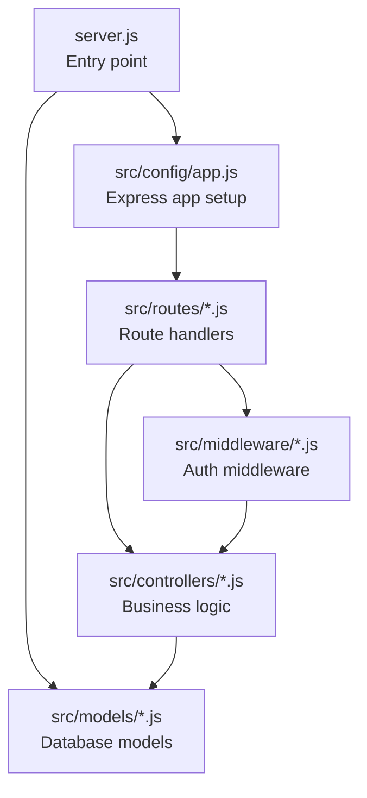
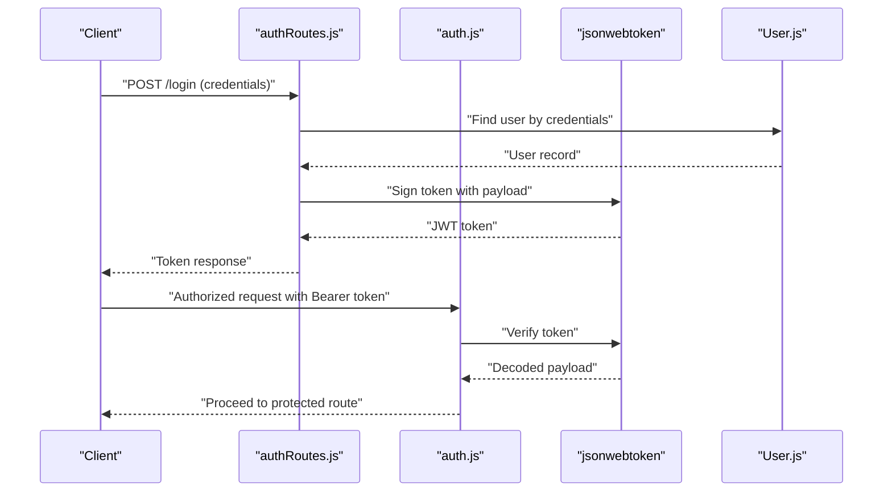
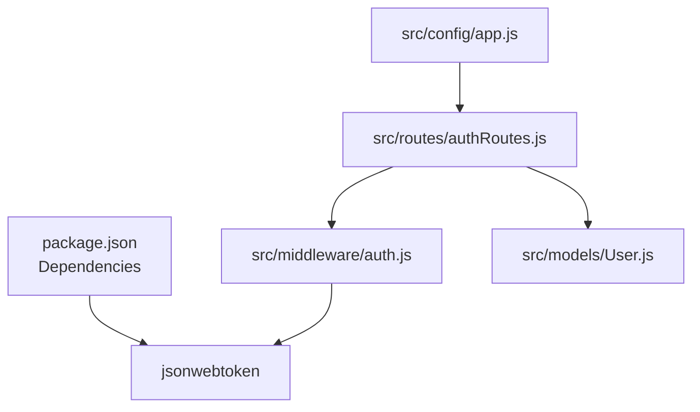

# JWT Authentication Implementation

<cite>
**Referenced Files in This Document**
- [server.js](file://backend/server.js)
- [app.js](file://backend/src/config/app.js)
- [auth.js](file://backend/src/middleware/auth.js)
- [authRoutes.js](file://backend/src/routes/authRoutes.js)
- [User.js](file://backend/src/models/User.js)
- [package.json](file://backend/package.json)
</cite>

## Table of Contents
1. [Introduction](#introduction)
2. [Project Structure](#project-structure)
3. [Core Components](#core-components)
4. [Architecture Overview](#architecture-overview)
5. [Detailed Component Analysis](#detailed-component-analysis)
6. [Dependency Analysis](#dependency-analysis)
7. [Performance Considerations](#performance-considerations)
8. [Troubleshooting Guide](#troubleshooting-guide)
9. [Conclusion](#conclusion)

## Introduction
This document provides comprehensive JWT authentication implementation guidance for the Khirocom system. It covers token generation, payload structure, signing algorithms, expiration handling, security considerations, and middleware integration with Express routes. It also includes practical examples for API usage, header formatting, and secure token storage recommendations.

## Project Structure
The backend follows a modular Express architecture with configuration, models, routes, middleware, and controllers directories. JWT support is integrated via the jsonwebtoken library, and the application initializes the Express server and connects to the database.

**Diagram sources**
- [server.js:1-25](file://backend/server.js#L1-L25)
- [app.js:1-12](file://backend/src/config/app.js#L1-L12)

**Section sources**
- [server.js:1-25](file://backend/server.js#L1-L25)
- [app.js:1-12](file://backend/src/config/app.js#L1-L12)

## Core Components
- Express Application: Initializes JSON parsing and serves a base route.
- Database Models: Defines the User model with fields including role enumeration.
- JWT Library: Provides token signing and verification capabilities.
- Authentication Middleware: Placeholder for protecting routes.
- Authentication Routes: Endpoint definitions for login and token validation.

Key implementation references:
- Express app initialization and JSON middleware: [app.js:1-12](file://backend/src/config/app.js#L1-L12)
- User model definition with role field: [User.js:44-48](file://backend/src/models/User.js#L44-L48)
- JWT library dependency: [package.json:8](file://backend/package.json#L8)
- Authentication middleware placeholder: [auth.js:1](file://backend/src/middleware/auth.js#L1)
- Authentication routes placeholder: [authRoutes.js:1](file://backend/src/routes/authRoutes.js#L1)

**Section sources**
- [app.js:1-12](file://backend/src/config/app.js#L1-L12)
- [User.js:44-48](file://backend/src/models/User.js#L44-L48)
- [package.json:8](file://backend/package.json#L8)
- [auth.js:1](file://backend/src/middleware/auth.js#L1)
- [authRoutes.js:1](file://backend/src/routes/authRoutes.js#L1)

## Architecture Overview
The JWT authentication flow integrates with Express routes and middleware. The typical flow includes:
- User submits credentials to a login endpoint.
- Server validates credentials and issues a signed JWT with user claims.
- Subsequent requests include the JWT in the Authorization header.
- Middleware verifies the token and attaches user context to the request.

**Diagram sources**
- [authRoutes.js:1](file://backend/src/routes/authRoutes.js#L1)
- [auth.js:1](file://backend/src/middleware/auth.js#L1)
- [User.js:44-48](file://backend/src/models/User.js#L44-L48)
- [package.json:8](file://backend/package.json#L8)

## Detailed Component Analysis

### Token Payload Structure
The JWT payload should include essential user identity and role information:
- User ID: Unique identifier for the user.
- Username: Human-readable user identifier.
- Role: User's permission level (admin, teacher, supervisor, manager).

These fields align with the User model's attributes and role enumeration.

**Section sources**
- [User.js:8-27](file://backend/src/models/User.js#L8-L27)
- [User.js:44-48](file://backend/src/models/User.js#L44-L48)

### Token Signing and Verification
- Library: jsonwebtoken is used for signing and verifying tokens.
- Signing: The server signs a payload containing user claims with a secret key.
- Verification: Middleware decodes and validates the token signature.

Implementation references:
- JWT library dependency: [package.json:8](file://backend/package.json#L8)

**Section sources**
- [package.json:8](file://backend/package.json#L8)

### Expiration and Security Considerations
- Expiration: Configure token expiration (e.g., short-lived access tokens) to minimize risk.
- Refresh Tokens: Issue a separate long-lived refresh token for obtaining new access tokens.
- Secret Management: Store the signing secret securely (environment variables).
- Transport Security: Enforce HTTPS to prevent token interception.
- Header Formatting: Use the Authorization header with the Bearer scheme for token transmission.

[No sources needed since this section provides general guidance]

### Authentication Middleware Implementation
The middleware acts as a gatekeeper for protected routes:
- Extract the Authorization header.
- Validate token format and signature.
- Attach user context to the request for downstream handlers.

Current placeholder references:
- Middleware placeholder: [auth.js:1](file://backend/src/middleware/auth.js#L1)

Integration steps:
- Import the middleware in route files.
- Apply middleware to protected routes.

**Section sources**
- [auth.js:1](file://backend/src/middleware/auth.js#L1)

### Route Integration with Express
Express app configuration and route registration:
- JSON body parsing is enabled for request handling.
- Base route responds with a simple message.

References:
- Express app setup: [app.js:1-12](file://backend/src/config/app.js#L1-L12)

To integrate authentication routes:
- Define login and token validation endpoints.
- Register routes with the Express app.

**Section sources**
- [app.js:1-12](file://backend/src/config/app.js#L1-L12)

### Practical Examples

#### Example: Login Request and Token Issuance
- Endpoint: POST /login
- Request Body: Credentials (username/email and password)
- Response: JWT token

[No sources needed since this section provides general guidance]

#### Example: Authorized Request with Bearer Token
- Header: Authorization: Bearer <JWT_TOKEN>
- Purpose: Authenticate subsequent API calls

[No sources needed since this section provides general guidance]

#### Example: Token Refresh Mechanism
- Endpoint: POST /refresh
- Request Body: Refresh token
- Response: New JWT access token

[No sources needed since this section provides general guidance]

### Token Storage Recommendations
- Web Applications:
  - Store access tokens in memory or secure HTTP-only cookies.
  - Use SameSite and Secure flags for cookies.
- Mobile Applications:
  - Use secure platform keychains or encrypted storage.
- Desktop Applications:
  - Use OS keychain or encrypted local storage.

[No sources needed since this section provides general guidance]

## Dependency Analysis
The JWT authentication implementation relies on the jsonwebtoken library and integrates with Express routing and middleware.

**Diagram sources**
- [package.json:8](file://backend/package.json#L8)
- [app.js:1-12](file://backend/src/config/app.js#L1-L12)
- [authRoutes.js:1](file://backend/src/routes/authRoutes.js#L1)
- [auth.js:1](file://backend/src/middleware/auth.js#L1)
- [User.js:44-48](file://backend/src/models/User.js#L44-L48)

**Section sources**
- [package.json:8](file://backend/package.json#L8)
- [app.js:1-12](file://backend/src/config/app.js#L1-L12)
- [authRoutes.js:1](file://backend/src/routes/authRoutes.js#L1)
- [auth.js:1](file://backend/src/middleware/auth.js#L1)
- [User.js:44-48](file://backend/src/models/User.js#L44-L48)

## Performance Considerations
- Token Size: Keep payloads minimal to reduce bandwidth usage.
- Verification Cost: Offload verification to middleware to avoid repeated checks in route handlers.
- Caching: Consider caching decoded user roles for frequently accessed endpoints.

[No sources needed since this section provides general guidance]

## Troubleshooting Guide
Common issues and resolutions:
- Invalid Signature: Verify the signing secret matches between issuer and verifier.
- Expired Token: Implement token refresh logic and handle expired tokens gracefully.
- Missing Authorization Header: Ensure clients send the Bearer token in the Authorization header.
- Role-Based Access: Confirm the user's role is correctly set in the token payload.

[No sources needed since this section provides general guidance]

## Conclusion
The Khirocom system can implement robust JWT authentication by leveraging the jsonwebtoken library, structuring tokens with user ID, username, and role, enforcing secure transport, and integrating middleware for request verification. Following the outlined practices ensures secure and maintainable authentication across the application.