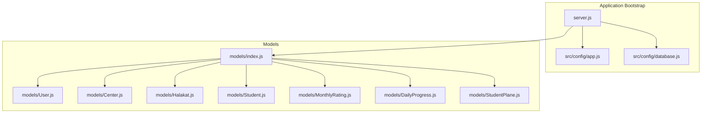
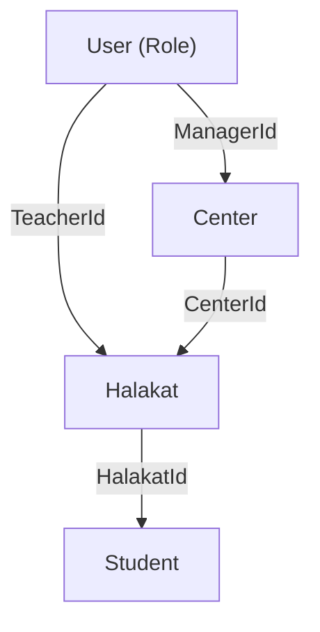
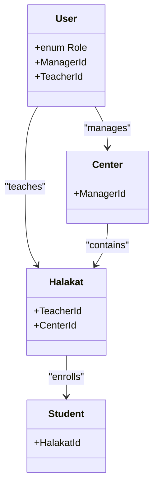
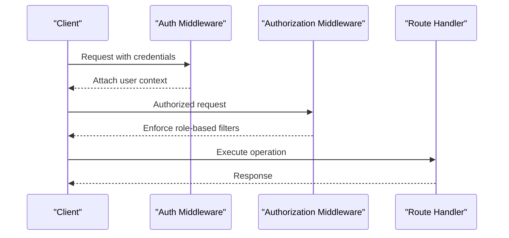
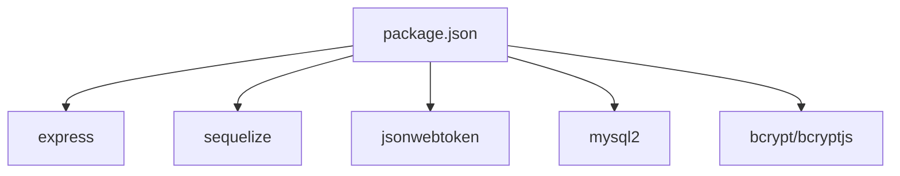

# Role-Based Access Control

<cite>
**Referenced Files in This Document**
- [README.md](file://README.md)
- [server.js](file://backend/server.js)
- [app.js](file://backend/src/config/app.js)
- [database.js](file://backend/src/config/database.js)
- [User.js](file://backend/src/models/User.js)
- [index.js](file://backend/src/models/index.js)
- [Center.js](file://backend/src/models/Center.js)
- [Halakat.js](file://backend/src/models/Halakat.js)
- [Student.js](file://backend/src/models/Student.js)
- [MonthlyRating.js](file://backend/src/models/MonthlyRating.js)
- [DailyProgress.js](file://backend/src/models/DailyProgress.js)
- [StudentPlane.js](file://backend/src/models/StudentPlane.js)
- [package.json](file://backend/package.json)
</cite>

## Table of Contents
1. [Introduction](#introduction)
2. [Project Structure](#project-structure)
3. [Core Components](#core-components)
4. [Architecture Overview](#architecture-overview)
5. [Detailed Component Analysis](#detailed-component-analysis)
6. [Dependency Analysis](#dependency-analysis)
7. [Performance Considerations](#performance-considerations)
8. [Troubleshooting Guide](#troubleshooting-guide)
9. [Conclusion](#conclusion)

## Introduction
This document provides comprehensive Role-Based Access Control (RBAC) documentation for the Khirocom system. It defines the four roles—admin, teacher, supervisor, and manager—and explains how roles determine access to centers, halakats, and students. It also documents the data model relationships that underpin access boundaries, outlines conceptual middleware and route protection patterns, and provides practical examples of role-based filtering and validation. Where applicable, the document references actual source files and models present in the repository.

## Project Structure
The backend is organized around a small set of core modules:
- Application bootstrap and configuration
- Database connection and ORM initialization
- Domain models and their associations
- Placeholder directories for controllers, middleware, and routes

**Diagram sources**
- [server.js:1-25](file://backend/server.js#L1-L25)
- [app.js:1-12](file://backend/src/config/app.js#L1-L12)
- [database.js:1-15](file://backend/src/config/database.js#L1-L15)
- [index.js:1-52](file://backend/src/models/index.js#L1-L52)
- [User.js:1-59](file://backend/src/models/User.js#L1-L59)

**Section sources**
- [server.js:1-25](file://backend/server.js#L1-L25)
- [app.js:1-12](file://backend/src/config/app.js#L1-L12)
- [database.js:1-15](file://backend/src/config/database.js#L1-L15)
- [index.js:1-52](file://backend/src/models/index.js#L1-L52)

## Core Components
- User model defines the Role field with values admin, teacher, supervisor, and manager. Roles are enforced via an ENUM and default to teacher.
- Associations define how users relate to centers (managers), halakats (teachers), and students (through halakat enrollment). These relationships form the basis for access boundaries.

Key role characteristics derived from the model and associations:
- Admin: Highest privilege; likely intended to bypass most access checks.
- Teacher: Assigned to a halakat; can manage ratings, progress, and planes for students within that halakat.
- Supervisor: Likely oversight role; may review reports across halakats or centers.
- Manager: Assigned to a center; can manage halakats and users within the center.

Access boundary rules inferred from associations:
- A teacher’s access is limited to students enrolled in their halakat.
- A manager’s access is limited to halakats and users within their assigned center.
- A supervisor’s access is determined by oversight scope (conceptual).
- An admin has unrestricted access.

**Section sources**
- [User.js:44-48](file://backend/src/models/User.js#L44-L48)
- [index.js:14-41](file://backend/src/models/index.js#L14-L41)

## Architecture Overview
The RBAC architecture is driven by:
- Role enumeration on the User entity
- Association-driven access boundaries
- Conceptual middleware and route protection to enforce authorization
- Data filtering aligned to the user’s role and relationships

**Diagram sources**
- [index.js:14-28](file://backend/src/models/index.js#L14-L28)
- [User.js:44-48](file://backend/src/models/User.js#L44-L48)

## Detailed Component Analysis

### Role Definitions and Access Boundaries
- Admin: Unrestricted access; conceptual override for all operations.
- Teacher: Access limited to students within their assigned halakat via TeacherId relationship.
- Supervisor: Oversight role; access scope depends on organizational policy (conceptual).
- Manager: Access limited to halakats and users within their assigned center via ManagerId relationship.

**Diagram sources**
- [User.js:44-48](file://backend/src/models/User.js#L44-L48)
- [index.js:14-28](file://backend/src/models/index.js#L14-L28)

**Section sources**
- [User.js:44-48](file://backend/src/models/User.js#L44-L48)
- [index.js:14-28](file://backend/src/models/index.js#L14-L28)

### Data Model Relationships and Access Boundaries
- User to Center: One-to-Many via ManagerId; managers control center-level resources.
- User to Halakat: One-to-Many via TeacherId; teachers control halakat-level resources.
- Center to Halakat: One-to-Many via CenterId; centers contain halakats.
- Halakat to Student: One-to-Many via HalakatId; halakats enroll students.
- Student to Ratings/Progress/Planes: One-to-Many via StudentId; student records include monthly ratings, daily progress, and learning planes.

These relationships establish hierarchical access boundaries:
- A manager can act within their center and its halakats.
- A teacher can act within their halakat and its students.
- An admin can act across all entities.

**Section sources**
- [index.js:14-41](file://backend/src/models/index.js#L14-L41)

### Conceptual Middleware and Route Protection
While the repository does not include middleware or controller/route files, the RBAC enforcement can be implemented conceptually as follows:
- Authentication middleware validates tokens and loads the current user.
- Authorization middleware inspects the user’s Role and applies filters based on relationships:
  - Admin: Allow all operations.
  - Manager: Filter queries by CenterId.
  - Teacher: Filter queries by HalakatId.
  - Supervisor: Apply oversight filters per policy.
- Route handlers apply the authorization middleware before processing requests.

[No sources needed since this diagram shows conceptual workflow, not actual code structure]

### Role-Based Filtering Examples
- Manager filtering: Retrieve halakats where Center.ManagerId equals the current user’s Id; then fetch students within those halakats.
- Teacher filtering: Retrieve students where Halakat.TeacherId equals the current user’s Id.
- Admin bypass: Skip filters; allow cross-center/cross-halakat access.
- Supervisor filtering: Define oversight scope (e.g., aggregate views across multiple halakats or centers).

[No sources needed since this section provides conceptual examples]

### Permission Escalation and Administrative Controls
- Admin role acts as a superuser; administrative controls can include explicit admin-only endpoints and audit logs.
- Escalation patterns are conceptual and should be implemented carefully with guardrails (e.g., explicit admin actions, audit trails).

[No sources needed since this section provides conceptual guidance]

### Practical Scenarios
- Viewing student ratings: A teacher can only access ratings for students in their halakat; a manager can access ratings for students in halakats within their center.
- Updating a student’s daily progress: Access is limited to the teacher of the student’s halakat.
- Assigning a new teacher to a halakat: Typically requires manager/admin privileges; admin can override.

[No sources needed since this section provides conceptual scenarios]

## Dependency Analysis
External dependencies relevant to RBAC and data access:
- Express: Web framework for routing and middleware.
- Sequelize: ORM for model definitions and associations.
- JSON Web Token: Authentication token support.
- MySQL2: Database driver.
- Bcrypt/BcryptJS: Password hashing utilities.

**Diagram sources**
- [package.json:1-14](file://backend/package.json#L1-L14)

**Section sources**
- [package.json:1-14](file://backend/package.json#L1-L14)

## Performance Considerations
- Use association-based joins to minimize round-trips when enforcing role-based filters.
- Add indexes on foreign keys (ManagerId, TeacherId, CenterId, HalakatId, StudentId) to optimize queries.
- Prefer filtered queries over loading large datasets and filtering in memory.

[No sources needed since this section provides general guidance]

## Troubleshooting Guide
- Database connectivity: Verify environment variables and connection parameters.
- Model synchronization: Ensure models are registered and synced.
- Role validation: Confirm Role ENUM values align with middleware expectations.

**Section sources**
- [database.js:1-15](file://backend/src/config/database.js#L1-L15)
- [server.js:8-23](file://backend/server.js#L8-L23)
- [User.js:44-48](file://backend/src/models/User.js#L44-L48)

## Conclusion
Khirocom’s RBAC is anchored by the User.Role field and reinforced by model associations that define access boundaries. Managers control centers and halakats, teachers control halakat-level activities, supervisors oversee broader scopes, and admins operate with unrestricted access. While the repository currently lacks middleware and route implementations, the conceptual patterns outlined here provide a clear blueprint for building secure, role-aware APIs aligned with the existing data model.