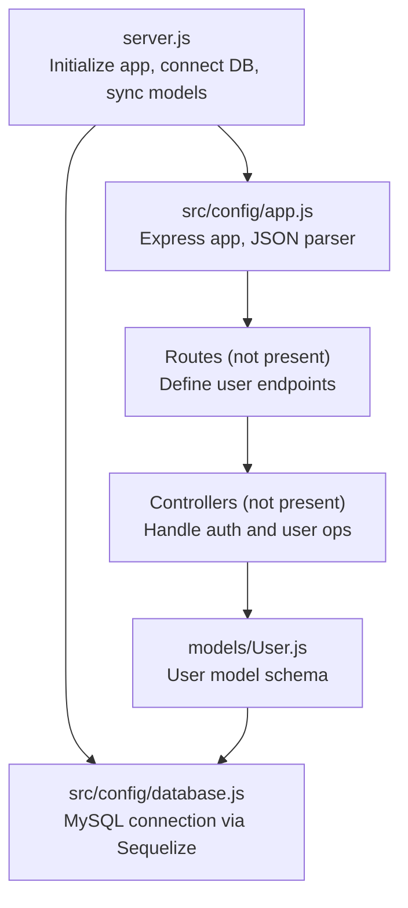
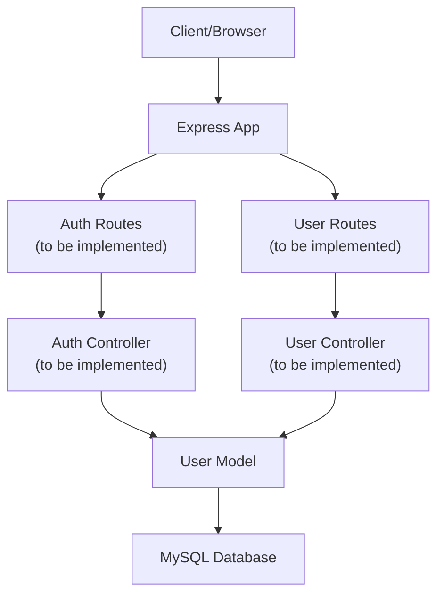
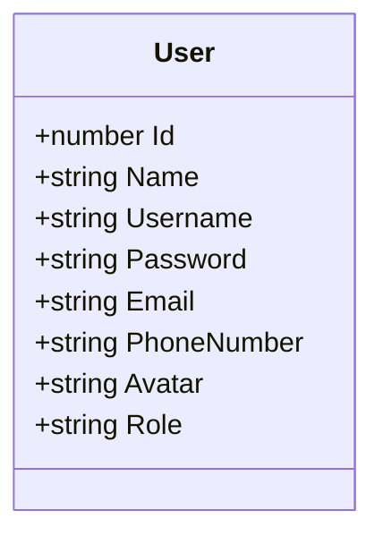
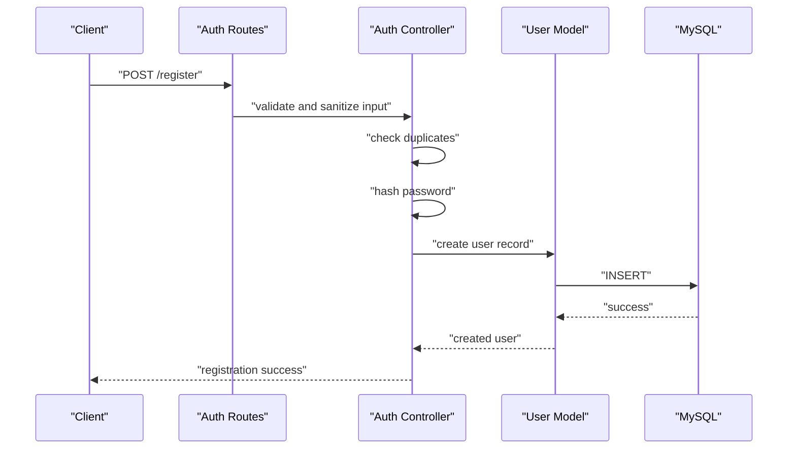
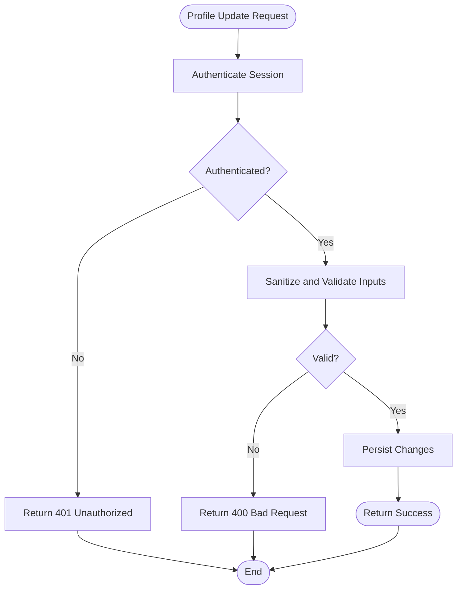
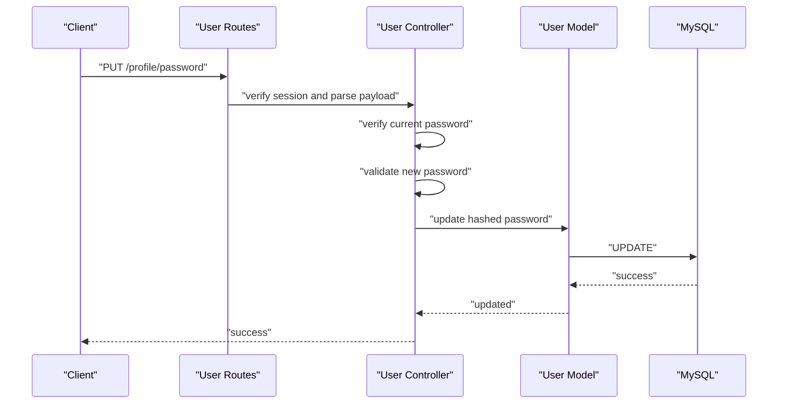
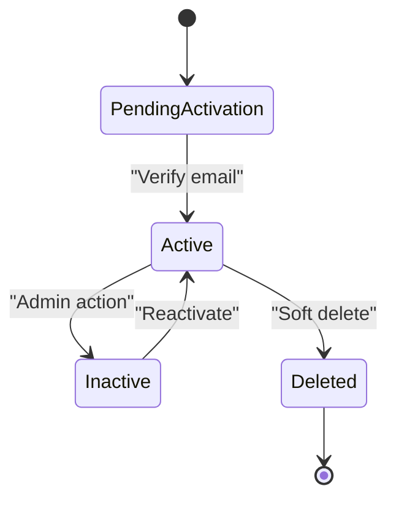
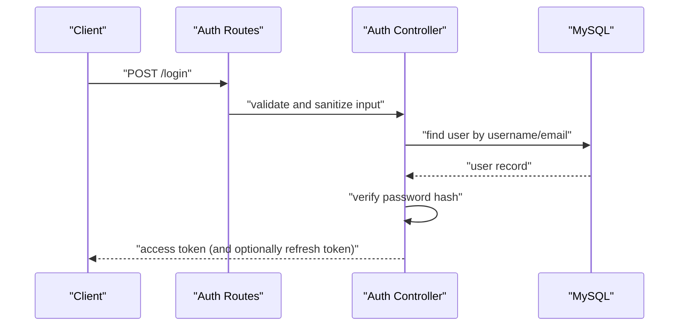
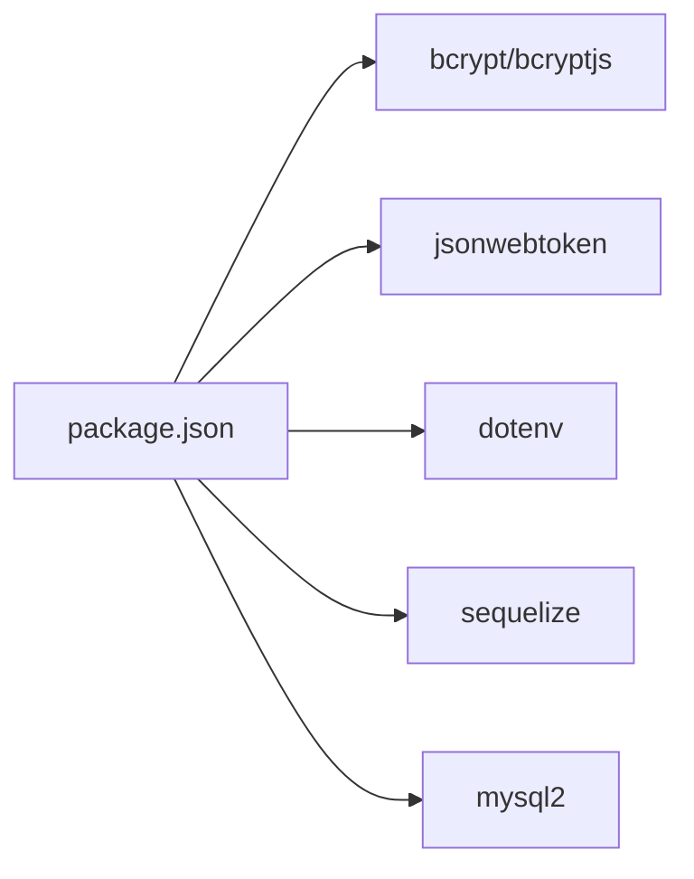

# User Management & Security

<cite>
**Referenced Files in This Document**
- [server.js](file://backend/server.js)
- [app.js](file://backend/src/config/app.js)
- [database.js](file://backend/src/config/database.js)
- [User.js](file://backend/src/models/User.js)
- [package.json](file://backend/package.json)
</cite>

## Table of Contents
1. [Introduction](#introduction)
2. [Project Structure](#project-structure)
3. [Core Components](#core-components)
4. [Architecture Overview](#architecture-overview)
5. [Detailed Component Analysis](#detailed-component-analysis)
6. [Dependency Analysis](#dependency-analysis)
7. [Performance Considerations](#performance-considerations)
8. [Troubleshooting Guide](#troubleshooting-guide)
9. [Conclusion](#conclusion)

## Introduction
This document provides comprehensive user management and security documentation for the Khirocom authentication system. It focuses on user registration, profile management, credential updates, password security, account lifecycle management, and data protection mechanisms. It also outlines secure authentication flows, session management, and logout procedures, along with prevention strategies for common vulnerabilities.

## Project Structure
The backend is a Node.js/Express application using Sequelize ORM with MySQL. The server initializes the Express app, connects to the database, synchronizes models, and exposes basic endpoints. Authentication and user management controllers, middleware, and routes are not present in the current repository snapshot; therefore, this document provides a baseline for implementing secure user management on top of the existing foundation.

**Diagram sources**
- [server.js:1-25](file://backend/server.js#L1-L25)
- [app.js:1-12](file://backend/src/config/app.js#L1-L12)
- [database.js:1-15](file://backend/src/config/database.js#L1-L15)
- [User.js:1-59](file://backend/src/models/User.js#L1-L59)

**Section sources**
- [server.js:1-25](file://backend/server.js#L1-L25)
- [app.js:1-12](file://backend/src/config/app.js#L1-L12)
- [database.js:1-15](file://backend/src/config/database.js#L1-L15)
- [User.js:1-59](file://backend/src/models/User.js#L1-L59)

## Core Components
- Express Application: Basic JSON parsing and a root endpoint are configured.
- Database Connection: MySQL via Sequelize using environment variables.
- User Model: Defines user attributes including identity, credentials, role, and optional avatar.

Security-relevant observations:
- The User model stores hashed passwords as strings with a length constraint.
- Roles are constrained via an ENUM, aiding in access control design.
- No explicit encryption-at-rest configuration is visible in the current files.

**Section sources**
- [app.js:1-12](file://backend/src/config/app.js#L1-L12)
- [database.js:1-15](file://backend/src/config/database.js#L1-L15)
- [User.js:1-59](file://backend/src/models/User.js#L1-L59)

## Architecture Overview
The system architecture centers around the Express server, which loads the application module, authenticates with the database, and starts the HTTP listener. The User model defines the persistence layer for user records. Authentication and user management endpoints are not present in the current snapshot; thus, the architecture below illustrates a recommended flow for secure user operations.

[No sources needed since this diagram shows conceptual workflow, not actual code structure]

## Detailed Component Analysis

### User Model
The User model defines the schema for storing user data, including identifiers, credentials, contact information, avatar, and role. It inherits from Sequelize’s Model and is associated with the configured database connection.

Key characteristics:
- Identity fields: integer primary key, name, username, email, phone number.
- Credentials: password stored as a string with a fixed-length constraint.
- Profile: optional avatar URL.
- Access control: role constrained to predefined values.

**Diagram sources**
- [User.js:1-59](file://backend/src/models/User.js#L1-L59)

**Section sources**
- [User.js:1-59](file://backend/src/models/User.js#L1-L59)

### Password Security Implementation
Recommended implementation for password hashing, salt generation, and validation:
- Hashing: Use bcrypt or bcryptjs to hash passwords before storage. Store only the hashed value.
- Salt Generation: Allow the library to generate salts automatically; do not store raw salts separately.
- Validation: Compare incoming passwords against stored hashes using the same library.
- Validation Rules: Enforce minimum length, character diversity, and reject common weak patterns.

Note: bcrypt/bcryptjs are present in dependencies; implement hashing/validation in the authentication controller.

**Section sources**
- [package.json:1-14](file://backend/package.json#L1-L14)

### User Registration Process
Secure registration flow:
- Input validation: Sanitize and validate all fields (username, email, phone, password).
- Duplicate checks: Verify uniqueness of username and email.
- Password hashing: Hash the password before persisting.
- Role assignment: Assign default or requested role with least privilege.
- Response: Return success without exposing sensitive fields.

[No sources needed since this diagram shows conceptual workflow, not actual code structure]

### Profile Management
Secure profile update flow:
- Authentication: Require a valid session/token.
- Authorization: Ensure the user can only update their own profile.
- Input sanitization: Strip HTML/script tags and escape special characters.
- Field-level validation: Apply rules per field (e.g., email format, phone pattern).
- Avatar handling: Validate file type and size; store securely and return a sanitized URL.

[No sources needed since this diagram shows conceptual workflow, not actual code structure]

### Credential Updates
Secure credential change flow:
- Current credentials verification: Require the current password for confirmation.
- New password validation: Enforce strong password rules.
- Atomic update: Wrap in a transaction to prevent partial updates.
- Notification: Optionally notify the user of changes.

[No sources needed since this diagram shows conceptual workflow, not actual code structure]

### Account Lifecycle Management
Account activation, deactivation, and deletion:
- Activation: Send a verification email with a short-lived token; mark the account active upon successful verification.
- Deactivation: Set an inactive flag and revoke sessions/tokens.
- Deletion: Soft delete initially; schedule hard deletion after a retention period. Ensure audit logs are maintained.

[No sources needed since this diagram shows conceptual workflow, not actual code structure]

### Security Measures for Data Protection
- Input sanitization: Use a library to strip dangerous content and escape output.
- SQL injection prevention: Use parameterized queries via Sequelize; avoid raw SQL concatenation.
- XSS mitigation: Escape HTML in responses; set Content-Security-Policy headers.
- CSRF protection: Implement anti-CSRF tokens for state-changing forms.
- Secure headers: Add security headers (e.g., HSTS, X-Content-Type-Options).
- Secrets management: Store database credentials and JWT secrets in environment variables.

**Section sources**
- [database.js:1-15](file://backend/src/config/database.js#L1-L15)
- [package.json:1-14](file://backend/package.json#L1-L14)

### Secure Authentication Flows, Session Management, and Logout
- Authentication:
  - Validate credentials against the hashed password.
  - Issue a signed JWT with a reasonable expiration; store minimal claims.
  - Use HTTPS and secure, httpOnly cookies for session tokens if using cookie-based sessions.
- Session Management:
  - Refresh tokens: Issue long-lived refresh tokens; rotate them on use.
  - Token binding: Bind tokens to device/fingerprint when possible.
  - Inactivity timeout: Automatically expire idle sessions.
- Logout:
  - Invalidate the access token server-side if persisted.
  - Clear client-side tokens and local/session storage.
  - Optional: Blacklist tokens temporarily if needed.

[No sources needed since this diagram shows conceptual workflow, not actual code structure]

## Dependency Analysis
External libraries relevant to security and user management:
- bcrypt/bcryptjs: For password hashing.
- jsonwebtoken: For issuing and verifying JWTs.
- dotenv: For loading environment variables.
- mysql2 and sequelize: For database connectivity and ORM features.

**Diagram sources**
- [package.json:1-14](file://backend/package.json#L1-L14)

**Section sources**
- [package.json:1-14](file://backend/package.json#L1-L14)

## Performance Considerations
- Hashing cost: Configure bcrypt cost appropriately to balance security and performance.
- Indexes: Ensure unique indexes on username and email for fast duplicate checks.
- Pagination: Apply pagination for listing users or audit logs.
- Caching: Cache non-sensitive user metadata with appropriate invalidation.

[No sources needed since this section provides general guidance]

## Troubleshooting Guide
Common issues and resolutions:
- Database connection failures: Verify environment variables and network access.
- Model synchronization errors: Check schema mismatches and migration status.
- Authentication failures: Confirm password hashing and token issuance logic.
- CORS and header issues: Ensure proper headers and origin policies.

Operational checks:
- Confirm that the server logs indicate successful DB authentication and model syncing.
- Validate that environment variables for the database and JWT secret are loaded.

**Section sources**
- [server.js:1-25](file://backend/server.js#L1-L25)
- [database.js:1-15](file://backend/src/config/database.js#L1-L15)

## Conclusion
The Khirocom backend provides a solid foundation for user management with a clear Express setup, database configuration, and a User model. To implement robust user management and security, integrate bcrypt for password hashing, JWT for authentication, and comprehensive input validation/sanitization. Establish secure registration, profile management, credential updates, and lifecycle management flows. Enforce SQL injection and XSS protections, and adopt secure session and logout practices. These steps will deliver a secure and maintainable user management system aligned with industry best practices.