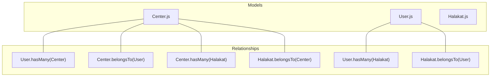
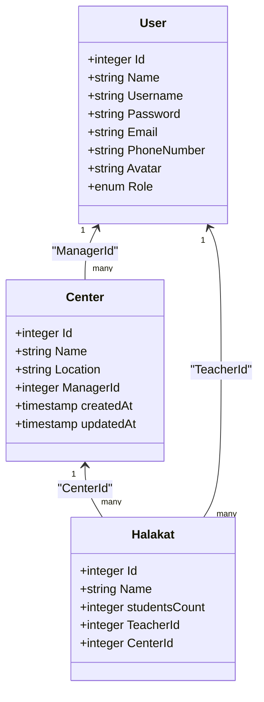
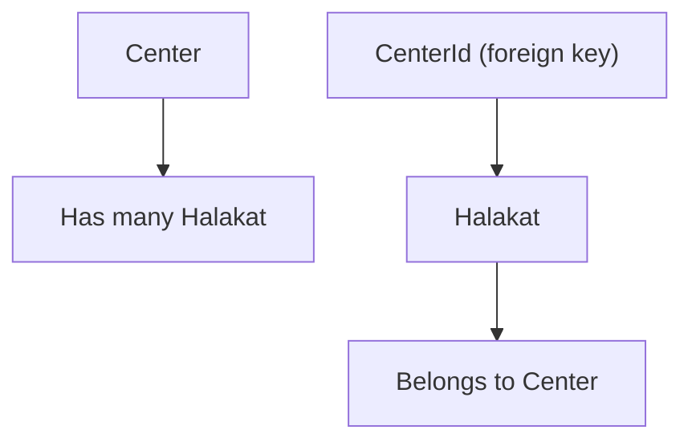
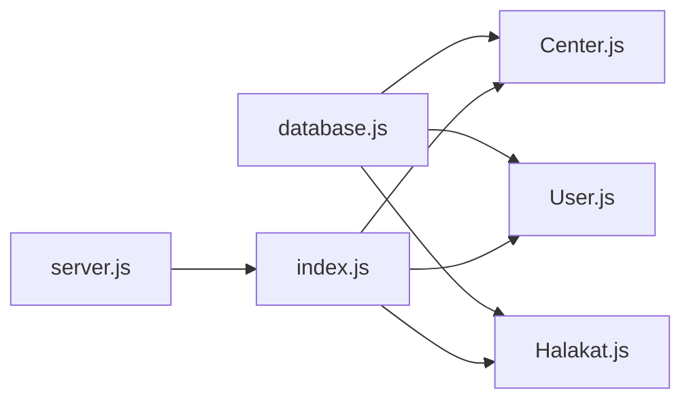

# Center Model

<cite>
**Referenced Files in This Document**
- [Center.js](file://backend/src/models/Center.js)
- [User.js](file://backend/src/models/User.js)
- [Halakat.js](file://backend/src/models/Halakat.js)
- [index.js](file://backend/src/models/index.js)
- [database.js](file://backend/src/config/database.js)
- [server.js](file://backend/server.js)
</cite>

## Table of Contents
1. [Introduction](#introduction)
2. [Project Structure](#project-structure)
3. [Core Components](#core-components)
4. [Architecture Overview](#architecture-overview)
5. [Detailed Component Analysis](#detailed-component-analysis)
6. [Dependency Analysis](#dependency-analysis)
7. [Performance Considerations](#performance-considerations)
8. [Troubleshooting Guide](#troubleshooting-guide)
9. [Conclusion](#conclusion)

## Introduction
This document provides comprehensive documentation for the Center model within the application. It covers the data structure, field definitions, validation rules, foreign key constraints, and business logic for managing centers. It also explains the relationships with the User model (as the Manager) and the Halakat model, and outlines hierarchical management patterns. Examples of center creation, manager assignment, and center listing are included conceptually to guide implementation.

## Project Structure
The Center model is part of the Sequelize ORM models and participates in a relational schema that connects Users, Centers, and Halakat. The central files involved are:
- Center model definition
- User model definition
- Halakat model definition
- Model relationship definitions
- Database configuration
- Application bootstrap and model registration

**Diagram sources**
- [Center.js:1-39](file://backend/src/models/Center.js#L1-L39)
- [User.js:1-59](file://backend/src/models/User.js#L1-L59)
- [Halakat.js:1-47](file://backend/src/models/Halakat.js#L1-L47)
- [index.js:12-24](file://backend/src/models/index.js#L12-L24)

**Section sources**
- [Center.js:1-39](file://backend/src/models/Center.js#L1-L39)
- [User.js:1-59](file://backend/src/models/User.js#L1-L59)
- [Halakat.js:1-47](file://backend/src/models/Halakat.js#L1-L47)
- [index.js:12-24](file://backend/src/models/index.js#L12-L24)
- [database.js:1-15](file://backend/src/config/database.js#L1-L15)
- [server.js:1-25](file://backend/server.js#L1-L25)

## Core Components
The Center model defines the core attributes and constraints for center records. Below are the fields and their characteristics:

- Id
  - Type: Integer
  - Constraints: Primary key, auto-increment
  - Purpose: Unique identifier for each center

- Name
  - Type: String
  - Constraints: Required (not null)
  - Purpose: Center name

- Location
  - Type: String
  - Constraints: Required (not null)
  - Purpose: Center physical or administrative location

- ManagerId
  - Type: Integer
  - Constraints: Required (not null), references users.Id
  - Purpose: Foreign key linking to the User who manages the center

- createdAt
  - Type: Timestamp
  - Constraints: Provided by Sequelize timestamps
  - Purpose: Record creation timestamp

- updatedAt
  - Type: Timestamp
  - Constraints: Provided by Sequelize timestamps
  - Purpose: Last update timestamp

Validation and constraints summary:
- Name and Location are required.
- ManagerId is required and must reference a valid user Id.
- createdAt and updatedAt are automatically managed by Sequelize.

**Section sources**
- [Center.js:6-36](file://backend/src/models/Center.js#L6-L36)

## Architecture Overview
The Center model participates in three primary relationships:
- One-to-Many: User → Center (a user can manage multiple centers)
- One-to-Many: Center → Halakat (a center can host multiple halakat groups)
- Many-to-One: Halakat → Center (each halakat belongs to a single center)

**Diagram sources**
- [Center.js:6-36](file://backend/src/models/Center.js#L6-L36)
- [User.js:6-56](file://backend/src/models/User.js#L6-L56)
- [Halakat.js:6-44](file://backend/src/models/Halakat.js#L6-L44)
- [index.js:14-24](file://backend/src/models/index.js#L14-L24)

## Detailed Component Analysis

### Center Model Definition and Validation
- Field definitions and constraints are declared in the model initialization.
- Name and Location are required fields.
- ManagerId is a required foreign key referencing the User model’s Id.
- Sequelize timestamps enable automatic createdAt and updatedAt fields.

Implementation references:
- [Center model initialization:6-36](file://backend/src/models/Center.js#L6-L36)

**Section sources**
- [Center.js:6-36](file://backend/src/models/Center.js#L6-L36)

### Relationship Mapping with User (Manager)
- Center belongs to a User via ManagerId.
- A User can manage multiple Centers.
- These relationships are defined in the central model index.

Implementation references:
- [Center belongsTo User](file://backend/src/models/index.js#L16)
- [User hasMany Centers](file://backend/src/models/index.js#L15)

**Diagram sources**
- [index.js:14-16](file://backend/src/models/index.js#L14-L16)
- [server.js:3-4](file://backend/server.js#L3-L4)

**Section sources**
- [index.js:14-16](file://backend/src/models/index.js#L14-L16)
- [server.js:3-4](file://backend/server.js#L3-L4)

### Relationship Mapping with Halakat (Groups)
- Center has many Halakat instances via CenterId.
- Halakat belongs to a Center via CenterId.
- These relationships are defined alongside the User-Center relationship.

Implementation references:
- [Center hasMany Halakat:22-24](file://backend/src/models/index.js#L22-L24)
- [Halakat belongsTo Center:22-24](file://backend/src/models/index.js#L22-L24)

**Diagram sources**
- [index.js:22-24](file://backend/src/models/index.js#L22-L24)
- [Halakat.js:29-36](file://backend/src/models/Halakat.js#L29-L36)

**Section sources**
- [index.js:22-24](file://backend/src/models/index.js#L22-L24)
- [Halakat.js:29-36](file://backend/src/models/Halakat.js#L29-L36)

### Center Administration Functionality
Conceptual operations supported by the model and relationships:
- Center creation
  - Provide Name, Location, and ManagerId (must reference an existing User).
  - createdAt and updatedAt are set automatically.
  - Reference: [Center initialization:6-36](file://backend/src/models/Center.js#L6-L36)

- Manager assignment
  - Assign ManagerId to an existing User.Id.
  - Enforced by foreign key constraint.
  - Reference: [ManagerId constraint:21-28](file://backend/src/models/Center.js#L21-L28)

- Center listing
  - Retrieve centers with related data (e.g., Manager profile, Halakat count).
  - Use associations defined in the model index.
  - References: [User-Center association:15-16](file://backend/src/models/index.js#L15-L16), [Center-Halakat association:22-24](file://backend/src/models/index.js#L22-L24)

- Hierarchical management
  - Centers are managed by Users (Role-based access).
  - Halakat are grouped under Centers and supervised by Users (Teachers).
  - References: [User roles:44-48](file://backend/src/models/User.js#L44-L48), [Center-Halakat hierarchy:22-24](file://backend/src/models/index.js#L22-L24)

Note: The current model files do not include explicit validation rules beyond field presence and foreign key references. Business logic for center creation and management should be implemented in application controllers and services, leveraging the defined model relationships.

**Section sources**
- [Center.js:6-36](file://backend/src/models/Center.js#L6-L36)
- [index.js:14-24](file://backend/src/models/index.js#L14-L24)
- [User.js:44-48](file://backend/src/models/User.js#L44-L48)

## Dependency Analysis
The Center model depends on:
- Sequelize ORM for data types and model initialization
- Database configuration for connection parameters
- The User and Halakat models for relationship definitions
- The central model index for association declarations

**Diagram sources**
- [database.js:1-15](file://backend/src/config/database.js#L1-L15)
- [Center.js:1-39](file://backend/src/models/Center.js#L1-L39)
- [User.js:1-59](file://backend/src/models/User.js#L1-L59)
- [Halakat.js:1-47](file://backend/src/models/Halakat.js#L1-L47)
- [index.js:1-52](file://backend/src/models/index.js#L1-L52)
- [server.js:1-25](file://backend/server.js#L1-L25)

**Section sources**
- [database.js:1-15](file://backend/src/config/database.js#L1-L15)
- [index.js:1-52](file://backend/src/models/index.js#L1-L52)
- [server.js:1-25](file://backend/server.js#L1-L25)

## Performance Considerations
- Use appropriate indexes on foreign keys (ManagerId, CenterId) to optimize joins and filtering.
- Leverage eager loading of associations (Manager, CenterHalakat) to reduce N+1 queries.
- Apply pagination and selective field retrieval when listing centers and related data.
- Keep Name and Location indexed if frequent searches or filters are expected.

## Troubleshooting Guide
Common issues and resolutions:
- Foreign key constraint violations
  - Symptom: Errors when creating or updating a Center with an invalid ManagerId.
  - Resolution: Ensure ManagerId references an existing User.Id.

- Missing associations in queries
  - Symptom: Center records returned without Manager or Halakat details.
  - Resolution: Include appropriate includes for associations in queries.

- Timestamp discrepancies
  - Symptom: createdAt or updatedAt appear incorrect.
  - Resolution: Verify server timezone and database time zone alignment.

- Database synchronization errors
  - Symptom: Sync failures during startup.
  - Resolution: Review migration status and adjust sync options as needed.

**Section sources**
- [Center.js:21-28](file://backend/src/models/Center.js#L21-L28)
- [index.js:14-24](file://backend/src/models/index.js#L14-L24)
- [server.js:8-15](file://backend/server.js#L8-L15)

## Conclusion
The Center model provides a robust foundation for center management with clear relationships to the User and Halakat models. Its constraints ensure data integrity, while associations enable hierarchical management and efficient querying. Implementing business logic in controllers and services around these models will support center creation, manager assignment, and listing operations effectively.