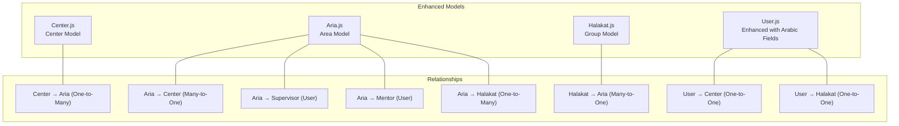
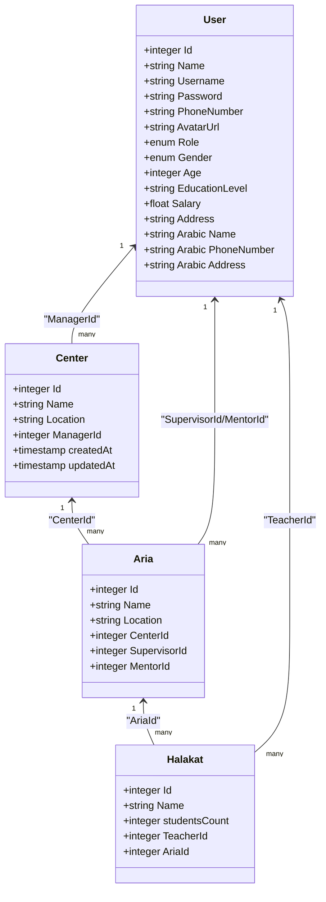
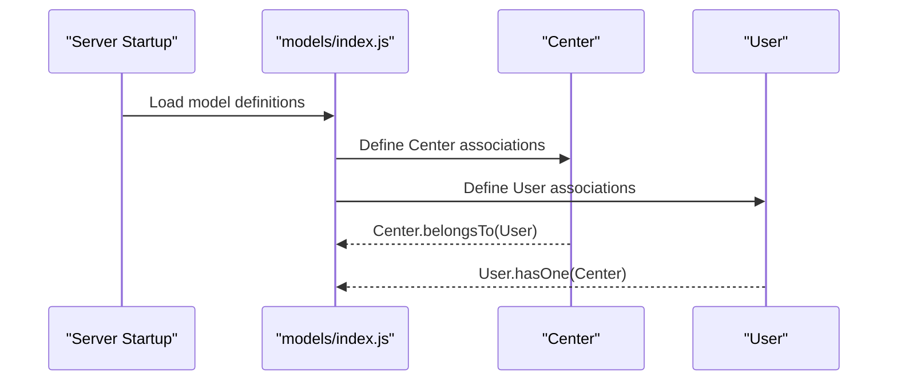
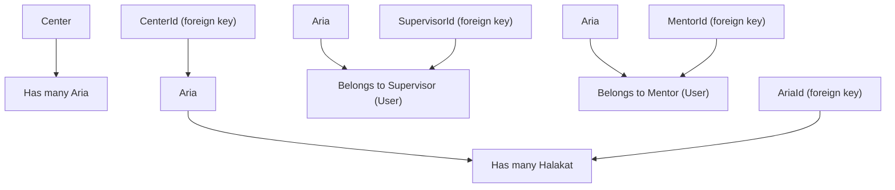
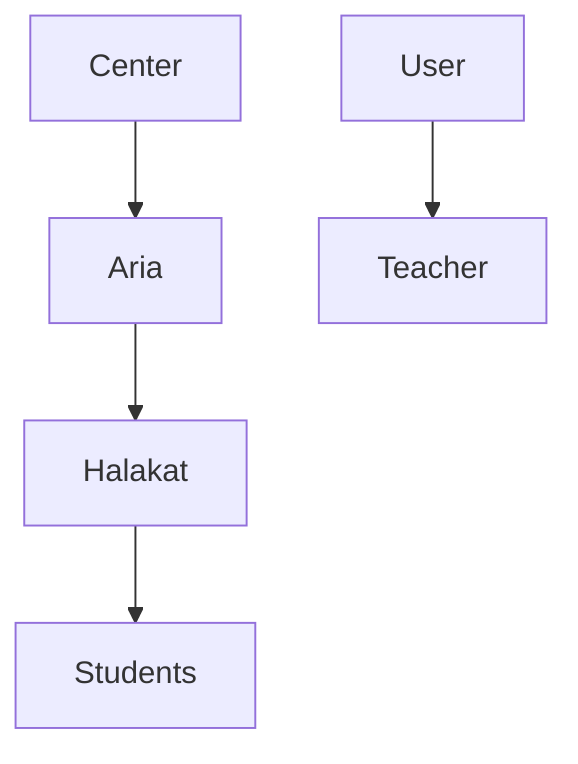
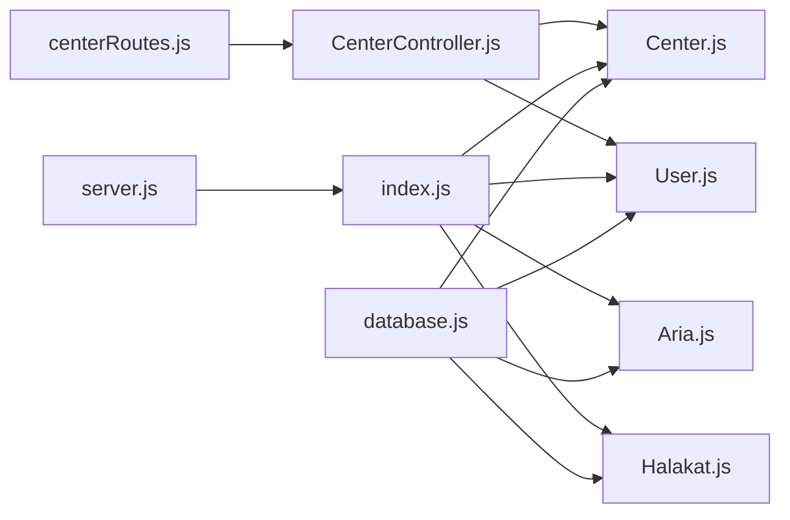

# Center Model

<cite>
**Referenced Files in This Document**
- [Center.js](file://backend/src/models/Center.js)
- [Aria.js](file://backend/src/models/Aria.js)
- [User.js](file://backend/src/models/User.js)
- [Halakat.js](file://backend/src/models/Halakat.js)
- [index.js](file://backend/src/models/index.js)
- [database.js](file://backend/src/config/database.js)
- [server.js](file://backend/server.js)
- [CenterController.js](file://backend/src/controllers/CenterController.js)
- [centerRoutes.js](file://backend/src/routes/centerRoutes.js)
</cite>

## Update Summary
**Changes Made**
- Updated Center model documentation to reflect new Aria ↔ Halakat relationship structure
- Added documentation for Arabic field names and localization features
- Updated relationship mappings to show Center → Aria → Halakat hierarchy
- Added new supervisor and mentor relationship documentation
- Updated architectural diagrams to reflect the new three-tier hierarchy

## Table of Contents
1. [Introduction](#introduction)
2. [Project Structure](#project-structure)
3. [Core Components](#core-components)
4. [Architecture Overview](#architecture-overview)
5. [Detailed Component Analysis](#detailed-component-analysis)
6. [Dependency Analysis](#dependency-analysis)
7. [Performance Considerations](#performance-considerations)
8. [Troubleshooting Guide](#troubleshooting-guide)
9. [Conclusion](#conclusion)

## Introduction
This document provides comprehensive documentation for the Center model within the Khirocom application. The Center model has been enhanced with Arabic field names and restructured to support a three-tier hierarchy: Center → Aria → Halakat. This enhancement introduces additional relationships with Users as supervisors and mentors, providing more granular management capabilities for educational institutions. The documentation covers data structure, field definitions, validation rules, foreign key constraints, and business logic for managing centers with their expanded relationship ecosystem.

## Project Structure
The Center model is part of a comprehensive Sequelize ORM structure that now includes the new Aria model and enhanced User model with Arabic localization. The central files involved are:
- Center model definition with Arabic field names
- Aria model definition bridging centers and halakat groups
- User model with Arabic field names and enhanced roles
- Halakat model definition
- Central model relationship definitions
- Database configuration
- Application bootstrap and model registration
- Controller and routing for center operations

**Diagram sources**
- [Center.js:1-40](file://backend/src/models/Center.js#L1-L40)
- [Aria.js:1-59](file://backend/src/models/Aria.js#L1-L59)
- [User.js:1-83](file://backend/src/models/User.js#L1-L83)
- [Halakat.js:1-47](file://backend/src/models/Halakat.js#L1-L47)
- [index.js:16-39](file://backend/src/models/index.js#L16-L39)

**Section sources**
- [Center.js:1-40](file://backend/src/models/Center.js#L1-L40)
- [Aria.js:1-59](file://backend/src/models/Aria.js#L1-L59)
- [User.js:1-83](file://backend/src/models/User.js#L1-L83)
- [Halakat.js:1-47](file://backend/src/models/Halakat.js#L1-L47)
- [index.js:16-39](file://backend/src/models/index.js#L16-L39)
- [database.js:1-16](file://backend/src/config/database.js#L1-L16)
- [server.js:1-26](file://backend/server.js#L1-L26)

## Core Components
The Center model defines the core attributes and constraints for center records within the enhanced three-tier hierarchy. Below are the fields and their characteristics:

- **Id**
  - Type: Integer
  - Constraints: Primary key, auto-increment
  - Purpose: Unique identifier for each center

- **Name**
  - Type: String
  - Constraints: Required (not null)
  - Purpose: Center name (supports Arabic characters)

- **Location**
  - Type: String
  - Constraints: Required (not null)
  - Purpose: Center physical or administrative location

- **ManagerId**
  - Type: Integer
  - Constraints: Required (not null), references users.Id
  - Purpose: Foreign key linking to the User who manages the center

- **createdAt**
  - Type: Timestamp
  - Constraints: Provided by Sequelize timestamps
  - Purpose: Record creation timestamp

- **updatedAt**
  - Type: Timestamp
  - Constraints: Provided by Sequelize timestamps
  - Purpose: Last update timestamp

**Enhanced Arabic Field Names** (in User model):
- **الاسم** (Name): Arabic name field with validation
- **رقم الهاتف** (PhoneNumber): Arabic phone number field
- **العنوان** (Address): Arabic address field
- **الجنس** (Gender): Arabic gender enum with "ذكر" (male) and "أنثى" (female)
- **العمر** (Age): Arabic age field
- **المستوى التعليمي** (EducationLevel): Arabic education level field

Validation and constraints summary:
- Name and Location are required for Center model
- ManagerId is required and must reference a valid user Id
- createdAt and updatedAt are automatically managed by Sequelize
- Arabic field names support internationalization requirements

**Section sources**
- [Center.js:6-36](file://backend/src/models/Center.js#L6-L36)
- [User.js:14-64](file://backend/src/models/User.js#L14-L64)

## Architecture Overview
The Center model participates in a sophisticated three-tier relationship hierarchy:
- **Center → Aria (One-to-Many)**: A center can have multiple areas
- **Aria → Halakat (One-to-Many)**: An area can contain multiple halakat groups
- **Aria ↔ User (Supervisor/Mentor)**: Areas are supervised and mentored by users
- **User → Center (One-to-One)**: Users can manage centers
- **User → Halakat (One-to-One)**: Users can teach halakat groups

**Diagram sources**
- [Center.js:6-36](file://backend/src/models/Center.js#L6-L36)
- [Aria.js:5-58](file://backend/src/models/Aria.js#L5-L58)
- [User.js:6-82](file://backend/src/models/User.js#L6-L82)
- [Halakat.js:6-46](file://backend/src/models/Halakat.js#L6-L46)
- [index.js:16-39](file://backend/src/models/index.js#L16-L39)

## Detailed Component Analysis

### Center Model Definition and Validation
- Field definitions and constraints are declared in the model initialization
- Name and Location are required fields with support for Arabic characters
- ManagerId is a required foreign key referencing the User model's Id
- Sequelize timestamps enable automatic createdAt and updatedAt fields
- Enhanced with Arabic field names in related User model

Implementation references:
- [Center model initialization:6-36](file://backend/src/models/Center.js#L6-L36)

**Section sources**
- [Center.js:6-36](file://backend/src/models/Center.js#L6-L36)

### Enhanced Relationship Mapping with User (Manager)
- Center belongs to a User via ManagerId
- A User can manage multiple Centers
- These relationships are defined in the central model index
- Supports Arabic role definitions including "مدير" (director)

Implementation references:
- [Center belongsTo User:22-23](file://backend/src/models/index.js#L22-L23)
- [User hasOne Center:21-23](file://backend/src/models/index.js#L21-L23)

**Diagram sources**
- [index.js:21-23](file://backend/src/models/index.js#L21-L23)
- [server.js:8-18](file://backend/server.js#L8-L18)

**Section sources**
- [index.js:21-23](file://backend/src/models/index.js#L21-L23)
- [server.js:8-18](file://backend/server.js#L8-L18)

### New Aria Model and Three-Tier Hierarchy
**Updated** The Center model now works within a three-tier hierarchy: Center → Aria → Halakat

- **Center → Aria (One-to-Many)**: Center has many Areas via CenterId
- **Aria → Halakat (One-to-Many)**: Area has many Halakat groups via AriaId
- **Aria ↔ User Relationships**: Areas are supervised and mentored by Users
- **Supervisor Relationship**: Aria belongs to User as SupervisorId
- **Mentor Relationship**: Aria belongs to User as MentorId

Implementation references:
- [Center hasMany Aria:17-18](file://backend/src/models/index.js#L17-L18)
- [Aria belongsTo Center:17-18](file://backend/src/models/index.js#L17-L18)
- [Aria hasMany Halakat:29-31](file://backend/src/models/index.js#L29-L31)
- [Halakat belongsTo Aria:29-31](file://backend/src/models/index.js#L29-L31)
- [Aria belongsTo Supervisor:33-35](file://backend/src/models/index.js#L33-L35)
- [Aria belongsTo Mentor:37-39](file://backend/src/models/index.js#L37-L39)

**Diagram sources**
- [index.js:17-39](file://backend/src/models/index.js#L17-L39)
- [Aria.js:20-48](file://backend/src/models/Aria.js#L20-L48)
- [Halakat.js:29-36](file://backend/src/models/Halakat.js#L29-L36)

**Section sources**
- [index.js:17-39](file://backend/src/models/index.js#L17-L39)
- [Aria.js:20-48](file://backend/src/models/Aria.js#L20-L48)
- [Halakat.js:29-36](file://backend/src/models/Halakat.js#L29-L36)

### Relationship Mapping with Halakat (Groups)
- **Direct Relationship**: Halakat belongs to Aria via AriaId
- **Indirect Relationship**: Through Aria, Halakat indirectly relates to Center
- **Teacher Relationship**: Halakat belongs to User via TeacherId
- **Student Relationship**: Halakat has many Students via HalakatId

Implementation references:
- [Aria hasMany Halakat:29-31](file://backend/src/models/index.js#L29-L31)
- [Halakat belongsTo Aria:29-31](file://backend/src/models/index.js#L29-L31)
- [User hasOne Halakat:25-27](file://backend/src/models/index.js#L25-L27)
- [Halakat belongsTo User:25-27](file://backend/src/models/index.js#L25-L27)

**Diagram sources**
- [index.js:17-31](file://backend/src/models/index.js#L17-L31)
- [index.js:25-27](file://backend/src/models/index.js#L25-L27)

**Section sources**
- [index.js:17-31](file://backend/src/models/index.js#L17-L31)
- [index.js:25-27](file://backend/src/models/index.js#L25-L27)

### Center Administration Functionality
Enhanced operations supported by the model and relationships:
- **Center creation**
  - Provide Name, Location, and ManagerId (must reference an existing User)
  - createdAt and updatedAt are set automatically
  - Reference: [Center initialization:6-36](file://backend/src/models/Center.js#L6-L36)

- **Manager assignment**
  - Assign ManagerId to an existing User.Id
  - Enforced by foreign key constraint
  - Reference: [ManagerId constraint:21-28](file://backend/src/models/Center.js#L21-L28)

- **Center listing with Arabic localization**
  - Retrieve centers with related data including manager profiles
  - Use associations defined in the model index
  - Arabic field names are supported in responses
  - References: [Center controller:14-29](file://backend/src/controllers/CenterController.js#L14-L29)

- **Hierarchical management**
  - Centers are managed by Users with Arabic roles
  - Areas provide intermediate management layers
  - Halakat groups are supervised by Users (Teachers)
  - Aria models support supervisor and mentor relationships
  - References: [User roles:39-42](file://backend/src/models/User.js#L39-L42), [Aria relationships:33-39](file://backend/src/models/index.js#L33-L39)

- **Arabic field name support**
  - All User-related fields support Arabic character sets
  - Localization enables Arabic interface requirements
  - References: [Arabic fields:14-64](file://backend/src/models/User.js#L14-L64)

**Section sources**
- [Center.js:6-36](file://backend/src/models/Center.js#L6-L36)
- [index.js:16-39](file://backend/src/models/index.js#L16-L39)
- [User.js:39-64](file://backend/src/models/User.js#L39-L64)
- [CenterController.js:14-29](file://backend/src/controllers/CenterController.js#L14-L29)

## Dependency Analysis
The Center model depends on:
- Sequelize ORM for data types and model initialization
- Database configuration for connection parameters
- The User, Aria, and Halakat models for relationship definitions
- The central model index for association declarations
- Enhanced Arabic field name support in User model

**Diagram sources**
- [database.js:1-16](file://backend/src/config/database.js#L1-L16)
- [Center.js:1-40](file://backend/src/models/Center.js#L1-L40)
- [User.js:1-83](file://backend/src/models/User.js#L1-L83)
- [Aria.js:1-59](file://backend/src/models/Aria.js#L1-L59)
- [Halakat.js:1-47](file://backend/src/models/Halakat.js#L1-L47)
- [index.js:1-91](file://backend/src/models/index.js#L1-L91)
- [server.js:1-26](file://backend/server.js#L1-L26)
- [CenterController.js:1-77](file://backend/src/controllers/CenterController.js#L1-L77)
- [centerRoutes.js:1-14](file://backend/src/routes/centerRoutes.js#L1-L14)

**Section sources**
- [database.js:1-16](file://backend/src/config/database.js#L1-L16)
- [index.js:1-91](file://backend/src/models/index.js#L1-L91)
- [server.js:1-26](file://backend/server.js#L1-L26)
- [CenterController.js:1-77](file://backend/src/controllers/CenterController.js#L1-L77)
- [centerRoutes.js:1-14](file://backend/src/routes/centerRoutes.js#L1-L14)

## Performance Considerations
- Use appropriate indexes on foreign keys (ManagerId, CenterId, AriaId, SupervisorId, MentorId) to optimize joins and filtering
- Leverage eager loading of associations (manager, CenterArias, AriaHalakat) to reduce N+1 queries
- Apply pagination and selective field retrieval when listing centers and related data
- Keep Name and Location indexed if frequent searches or filters are expected
- Consider the three-tier hierarchy impact on query complexity and optimize accordingly
- Arabic field name indexing considerations for internationalized applications

## Troubleshooting Guide
Common issues and resolutions:
- **Foreign key constraint violations**
  - Symptom: Errors when creating or updating a Center with an invalid ManagerId
  - Resolution: Ensure ManagerId references an existing User.Id

- **Missing associations in queries**
  - Symptom: Center records returned without manager or Aria details
  - Resolution: Include appropriate includes for associations in queries

- **Three-tier hierarchy confusion**
  - Symptom: Difficulty understanding Center-Aria-Halakat relationships
  - Resolution: Use the enhanced association definitions and consider the new three-tier structure

- **Arabic field name encoding issues**
  - Symptom: Arabic characters not displaying correctly
  - Resolution: Ensure database and connection support UTF-8 encoding

- **Timestamp discrepancies**
  - Symptom: createdAt or updatedAt appear incorrect
  - Resolution: Verify server timezone and database timezone alignment

- **Database synchronization errors**
  - Symptom: Sync failures during startup
  - Resolution: Review migration status and adjust sync options as needed

**Section sources**
- [Center.js:21-28](file://backend/src/models/Center.js#L21-L28)
- [index.js:16-39](file://backend/src/models/index.js#L16-L39)
- [server.js:18-19](file://backend/server.js#L18-L19)

## Conclusion
The Center model now provides a robust foundation for center management within a sophisticated three-tier hierarchy: Center → Aria → Halakat. The enhanced model includes Arabic field names and improved relationships with Users as supervisors and mentors. Its constraints ensure data integrity across the expanded relationship ecosystem, while associations enable hierarchical management and efficient querying. The integration of Arabic localization and the new Aria model provides comprehensive support for educational institution management with internationalization requirements. Implementing business logic in controllers and services around these enhanced models will support center creation, manager assignment, and listing operations effectively within the new three-tier architecture.