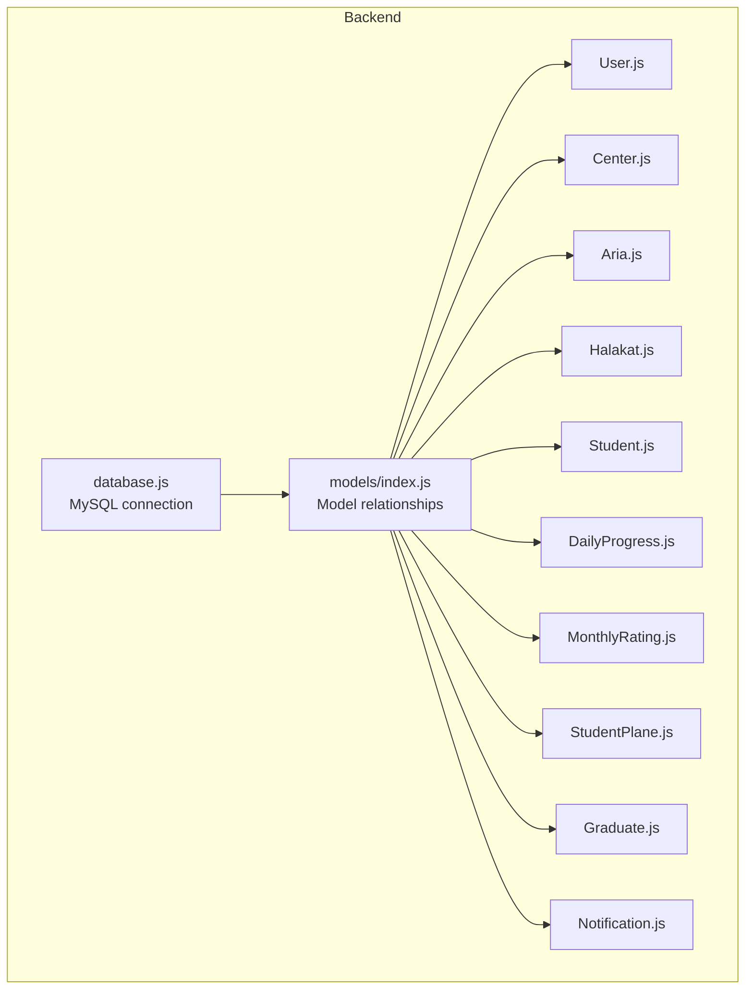
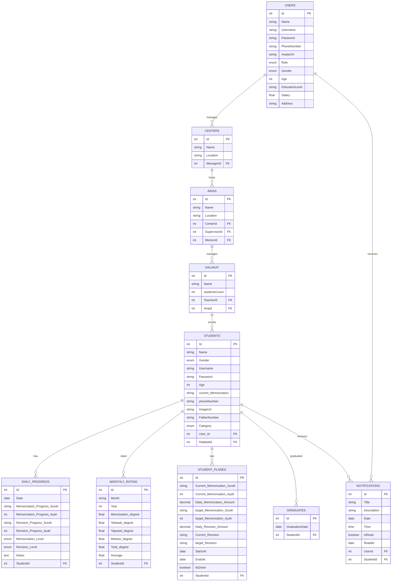
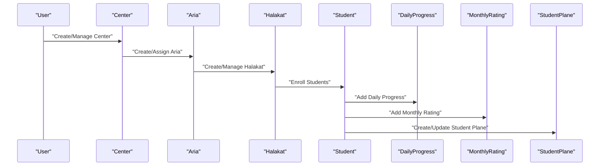
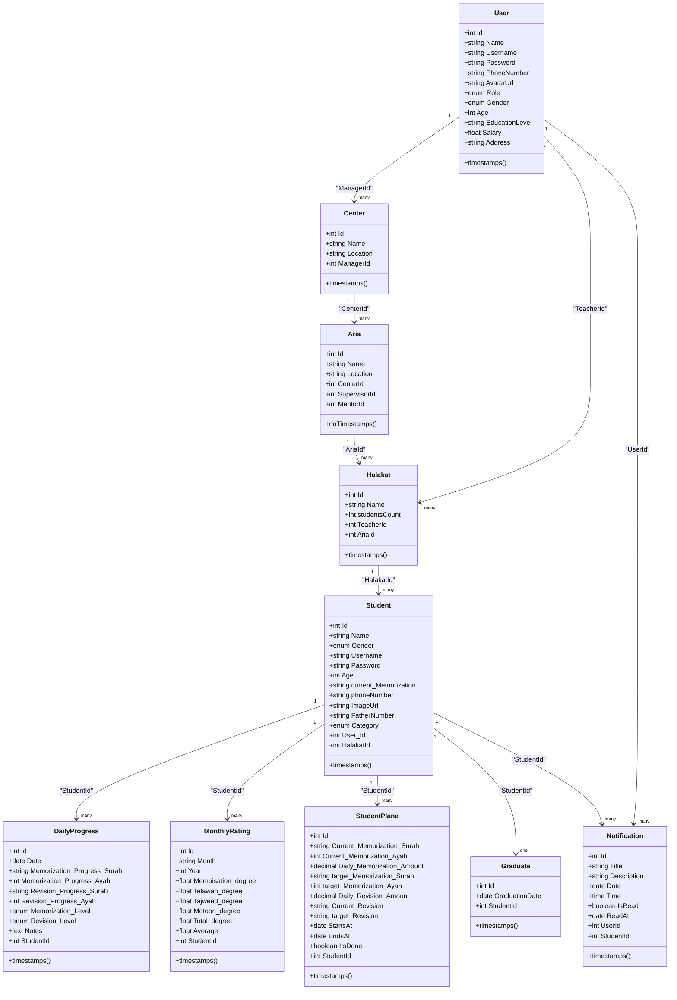
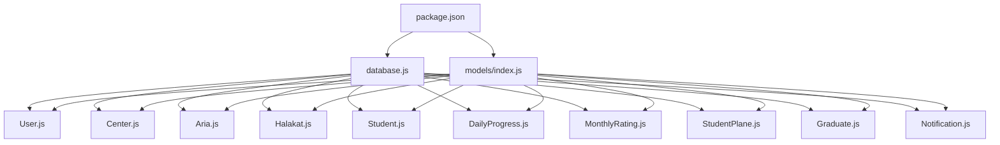

# Database Design

<cite>
**Referenced Files in This Document**
- [index.js](file://backend/src/models/index.js)
- [User.js](file://backend/src/models/User.js)
- [Center.js](file://backend/src/models/Center.js)
- [Aria.js](file://backend/src/models/Aria.js)
- [Halakat.js](file://backend/src/models/Halakat.js)
- [Student.js](file://backend/src/models/Student.js)
- [DailyProgress.js](file://backend/src/models/DailyProgress.js)
- [MonthlyRating.js](file://backend/src/models/MonthlyRating.js)
- [StudentPlane.js](file://backend/src/models/StudentPlane.js)
- [Graduate.js](file://backend/src/models/Graduate.js)
- [Notification.js](file://backend/src/models/Notification.js)
- [database.js](file://backend/src/config/database.js)
- [package.json](file://backend/package.json)
</cite>

## Update Summary
**Changes Made**
- Added comprehensive documentation for the new Aria model representing geographical areas or regions
- Updated architectural overview to reflect the new Center ↔ Aria ↔ Halakat relationship structure
- Documented new many-to-many relationships between users and areas for supervisor and mentor roles
- Revised entity relationship diagrams to show the updated hierarchy
- Updated core components section to include Aria model specifications
- Modified data flow diagrams to reflect the new geographical organizational structure

## Table of Contents
1. [Introduction](#introduction)
2. [Project Structure](#project-structure)
3. [Core Components](#core-components)
4. [Architecture Overview](#architecture-overview)
5. [Detailed Component Analysis](#detailed-component-analysis)
6. [Dependency Analysis](#dependency-analysis)
7. [Performance Considerations](#performance-considerations)
8. [Troubleshooting Guide](#troubleshooting-guide)
9. [Conclusion](#conclusion)
10. [Appendices](#appendices)

## Introduction
This document provides comprehensive data model documentation for the Khirocom database design. It focuses on the complete entity-relationship schema and data modeling across the following entities: User, Center, Aria, Halakat, Student, DailyProgress, MonthlyRating, StudentPlane, Graduate, and Notification. It details field definitions, data types, validation rules, primary keys, foreign keys, and relationship constraints. It explains the hierarchical data flow from User → Center → Aria → Halakat → Student and how progress tracking flows through DailyProgress, MonthlyRating, and StudentPlane. It includes database schema diagrams, referential integrity, validation rules, business constraints, data lifecycle management, access patterns, indexing strategies, performance considerations, security and privacy requirements, access control mechanisms, sample data examples, common query patterns, and Sequelize model definitions and relationship mappings.

## Project Structure
The database design is implemented using Sequelize ORM with a MySQL dialect. The models are defined under backend/src/models and relationships are configured in backend/src/models/index.js. The database connection is configured in backend/src/config/database.js. The project uses environment variables for database credentials and runs on Express with Sequelize.

**Diagram sources**
- [database.js:1-16](file://backend/src/config/database.js#L1-L16)
- [index.js:1-91](file://backend/src/models/index.js#L1-L91)

**Section sources**
- [database.js:1-16](file://backend/src/config/database.js#L1-L16)
- [package.json:1-14](file://backend/package.json#L1-L14)

## Core Components
This section documents each entity's fields, data types, constraints, and validations as defined in the Sequelize models.

- User
  - Fields: Id (primary key, integer, auto-increment), Name (string, not null), Username (string, not null), Password (string length 256, not null), PhoneNumber (string, not null), AvatarUrl (string, nullable), Role (enum: admin, مدرس, مشرف, موجه, طالب, مدير, default: مدرس, not null), Gender (enum: ذكر, أنثى, not null), Age (integer, not null), EducationLevel (string, not null), Salary (float, not null, default: 0), Address (string, not null).
  - Constraints: Unique identifiers via primary key; role enum enforced; timestamps enabled.
  - Validation: Username auto-generated from phone number via hooks; password hashing handled externally.

- Center
  - Fields: Id (primary key, integer, auto-increment), Name (string, not null), Location (string, not null), ManagerId (foreign key to users.Id, not null).
  - Constraints: Foreign key to User; timestamps enabled.

- Aria
  - Fields: Id (primary key, integer, auto-increment), Name (string, not null), Location (string, not null), CenterId (foreign key to centers.Id, not null), SupervisorId (foreign key to users.Id, not null), MentorId (foreign key to users.Id, not null).
  - Constraints: Foreign keys to Center and User; timestamps disabled.
  - Note: Aria serves as geographical areas or regions within centers.

- Halakat
  - Fields: Id (primary key, integer, auto-increment), Name (string, not null), studentsCount (integer, not null), TeacherId (foreign key to users.Id, not null), AriaId (foreign key to arias.Id, not null).
  - Constraints: Foreign keys to User and Aria; timestamps enabled.

- Student
  - Fields: Id (primary key, integer, auto-increment), Name (string, not null), Gender (enum: ذكر, أنثى, default: ذكر, not null), Username (string, not null), Password (string length 256, not null, default: "12345"), Age (integer, not null), current_Memorization (string, not null), phoneNumber (string, not null), ImageUrl (string, nullable), FatherNumber (string, not null), Category (enum: اطفال, أقل من 5 أجزاء, 5 أجزاء, 10 أجزاء, 15 جزء, 20 جزء, 25 جزء, المصجف كامل, default: أقل من 5 أجزاء, not null), User_Id (foreign key to users.Id, not null), HalakatId (foreign key to halakat.Id, not null).
  - Constraints: Foreign keys to User and Halakat; timestamps enabled.

- DailyProgress
  - Fields: Id (primary key, integer, auto-increment), Date (date, not null), Memorization_Progress_Surah (string, not null), Memorization_Progress_Ayah (integer, not null), Revision_Progress_Surah (string, not null), Revision_Progress_Ayah (integer, not null), Memorization_Level (enum: ضعيف, مقبول, جيد, جيد جدا, ممتاز, default: ضعيف, not null), Revision_Level (enum: ضعيف, مقبول, جيد, جيد جدا, ممتاز, default: ضعيف, not null), Notes (text, nullable), StudentId (foreign key to students.Id, not null).
  - Constraints: Foreign key to Student; timestamps enabled.

- MonthlyRating
  - Fields: Id (primary key, integer, auto-increment), Month (string, not null), Year (integer, not null), Memoisation_degree (float, not null, min 0, max 100), Telawah_degree (float, not null, min 0, max 100), Tajweed_degree (float, not null, min 0, max 60), Motoon_degree (float, not null, min 0, max 400), Total_degree (float, not null), Average (float, not null), StudentId (integer, not null).
  - Constraints: Foreign key to Student; timestamps enabled.

- StudentPlane
  - Fields: Id (primary key, integer, auto-increment), Current_Memorization_Surah (string, not null), Current_Memorization_Ayah (integer, not null), Daily_Memorization_Amount (decimal(10,2), not null), target_Memorization_Surah (string, not null), target_Memorization_Ayah (integer, not null), Daily_Revision_Amount (decimal(10,2), not null), Current_Revision (string, not null), target_Revision (string, not null), StartsAt (date, not null), EndsAt (date, not null), ItsDone (boolean, default false, not null), StudentId (foreign key to students.Id, not null).
  - Constraints: Foreign key to Student; timestamps enabled.

- Graduate
  - Fields: Id (primary key, integer, auto-increment), GraduationDate (date, not null), StudentId (foreign key to students.Id, not null).
  - Constraints: Foreign key to Student; timestamps not specified.

- Notification
  - Fields: Id (primary key, integer, auto-increment), Title (string, not null), Description (string, not null), Date (date, not null), Time (time, not null), IsRead (boolean, default false, not null), ReadAt (date, nullable), UserId (foreign key to users.Id, nullable), StudentId (foreign key to students.Id, nullable).
  - Constraints: Optional foreign keys to User and Student; timestamps enabled.

**Section sources**
- [User.js:1-83](file://backend/src/models/User.js#L1-L83)
- [Center.js:1-40](file://backend/src/models/Center.js#L1-L40)
- [Aria.js:1-59](file://backend/src/models/Aria.js#L1-L59)
- [Halakat.js:1-47](file://backend/src/models/Halakat.js#L1-L47)
- [Student.js:1-99](file://backend/src/models/Student.js#L1-L99)
- [DailyProgress.js:1-64](file://backend/src/models/DailyProgress.js#L1-L64)
- [MonthlyRating.js:1-70](file://backend/src/models/MonthlyRating.js#L1-L70)
- [StudentPlane.js:1-76](file://backend/src/models/StudentPlane.js#L1-L76)
- [Graduate.js:1-37](file://backend/src/models/Graduate.js#L1-L37)
- [Notification.js:1-74](file://backend/src/models/Notification.js#L1-L74)

## Architecture Overview
The data model follows a hierarchical structure centered around Users managing Centers, which manage Aria regions that manage Halakat groups, which in turn manage Students. Progress tracking is captured through DailyProgress entries, MonthlyRating records, and StudentPlane plans. The new Aria model introduces geographical organization layers between Centers and Halakat groups.

**Diagram sources**
- [index.js:16-72](file://backend/src/models/index.js#L16-L72)
- [User.js:8-78](file://backend/src/models/User.js#L8-L78)
- [Center.js:21-28](file://backend/src/models/Center.js#L21-L28)
- [Aria.js:20-48](file://backend/src/models/Aria.js#L20-L48)
- [Halakat.js:29-36](file://backend/src/models/Halakat.js#L29-L36)
- [Student.js:66-82](file://backend/src/models/Student.js#L66-L82)
- [DailyProgress.js:47-54](file://backend/src/models/DailyProgress.js#L47-L54)
- [MonthlyRating.js:53-60](file://backend/src/models/MonthlyRating.js#L53-L60)
- [StudentPlane.js:58-65](file://backend/src/models/StudentPlane.js#L58-L65)
- [Graduate.js:17-26](file://backend/src/models/Graduate.js#L17-L26)
- [Notification.js:45-64](file://backend/src/models/Notification.js#L45-L64)

## Detailed Component Analysis

### Entity Relationships and Referential Integrity
- User → Center: One-to-One via ManagerId.
- Center → Aria: One-to-Many via CenterId.
- Aria → Halakat: One-to-Many via AriaId.
- User → Halakat: One-to-One via TeacherId.
- Halakat → Student: One-to-Many via HalakatId.
- Student → DailyProgress: One-to-Many via StudentId.
- Student → MonthlyRating: One-to-Many via StudentId.
- Student → StudentPlane: One-to-Many via StudentId.
- Student → Graduate: One-to-One via StudentId.
- User → Notification: One-to-Many via UserId.
- Student → Notification: One-to-Many via StudentId.

**Updated** The relationship structure has been restructured from Center ↔ Halakat to Center → Aria → Halakat, introducing geographical organization layers.

Constraints:
- All foreign keys are explicitly defined in the models.
- Aria model introduces new relationships: Center → Aria (one-to-many), Aria → Halakat (one-to-many).
- New many-to-many relationships established between users and areas for supervisor and mentor roles.

**Section sources**
- [index.js:16-72](file://backend/src/models/index.js#L16-L72)
- [Aria.js:20-48](file://backend/src/models/Aria.js#L20-L48)

### Data Validation Rules and Business Constraints
- User
  - Role enum values: admin, مدرس, مشرف, موجه, طالب, مدير.
  - Gender enum values: ذكر, أنثى.
  - All identity fields are required; AvatarUrl is optional.
  - Username auto-generation via hooks if not provided.

- Center
  - ManagerId references users.Id.

- Aria
  - CenterId references centers.Id.
  - SupervisorId references users.Id.
  - MentorId references users.Id.
  - SupervisorId and MentorId establish many-to-one relationships with User.

- Halakat
  - TeacherId references users.Id.
  - AriaId references arias.Id.
  - studentsCount is required and non-negative.

- Student
  - Gender enum values: ذكر, أنثى.
  - Category enum values: اطفال, أقل من 5 أجزاء, 5 أجزاء, 10 أجزاء, 15 جزء, 20 جزء, 25 جزء, المصجف كامل.
  - User_Id references users.Id.
  - HalakatId references halakat.Id.

- DailyProgress
  - Memorization_Level and Revision_Level enums: ضعيف, مقبول, جيد, جيد جدا, ممتاز.
  - Notes is optional.

- MonthlyRating
  - Degree fields validated with min/max bounds:
    - Memoisation_degree: min 0, max 100
    - Telawah_degree: min 0, max 100
    - Tajweed_degree: min 0, max 60
    - Motoon_degree: min 0, max 400
  - Month validation ensures non-empty strings.
  - Year validation ensures integer values.

- StudentPlane
  - Decimal fields use precision (10,2).
  - ItsDone defaults to false.
  - StartsAt and EndsAt define a plan period.

- Graduate
  - GraduationDate validation ensures valid dates.

- Notification
  - IsRead defaults to false.
  - ReadAt is nullable for unprocessed notifications.
  - UserId and StudentId are optional for system notifications.

**Section sources**
- [User.js:39-47](file://backend/src/models/User.js#L39-L47)
- [Aria.js:28-48](file://backend/src/models/Aria.js#L28-L48)
- [Student.js:17-21](file://backend/src/models/Student.js#L17-L21)
- [Student.js:52-62](file://backend/src/models/Student.js#L52-L62)
- [MonthlyRating.js:13-24](file://backend/src/models/MonthlyRating.js#L13-L24)
- [MonthlyRating.js:25-44](file://backend/src/models/MonthlyRating.js#L25-L44)
- [Notification.js:34-44](file://backend/src/models/Notification.js#L34-L44)

### Hierarchical Data Flow
- User manages multiple Centers and multiple Halakat groups.
- Center hosts multiple Aria regions.
- Aria manages multiple Halakat groups.
- Halakat enrolls multiple Students.
- Student accumulates DailyProgress entries, MonthlyRating records, StudentPlane plans, and Graduate status.
- Users and Students receive Notifications.

**Updated** The data flow now includes Aria as an intermediate geographical layer between Centers and Halakat groups, with supervisors and mentors assigned to specific areas.

**Diagram sources**
- [index.js:16-31](file://backend/src/models/index.js#L16-L31)

### Data Lifecycle Management
- Timestamps are enabled for most models, indicating createdAt and updatedAt fields are maintained automatically.
- Soft deletion is not present; hard deletes rely on referential integrity.
- Aria model intentionally disables timestamps to avoid unnecessary date tracking for geographical regions.
- User and Student models include hooks for automatic username generation from phone numbers.

**Section sources**
- [Aria.js:54](file://backend/src/models/Aria.js#L54)
- [User.js:71-77](file://backend/src/models/User.js#L71-L77)
- [Student.js:89-95](file://backend/src/models/Student.js#L89-L95)

### Sample Data Examples
- User
  - Example: { Name: "Ahmad Ali", Username: "ahmadali", Password: "hashed_password", PhoneNumber: "+966123456789", Role: "مدرس", Gender: "ذكر", Age: 35, EducationLevel: "بكالوريوس", Salary: 5000, Address: "الرياض" }

- Center
  - Example: { Name: "المركز التعليمي", Location: "الرياض", ManagerId: 1 }

- Aria
  - Example: { Name: "منطقة الرياض", Location: "الرياض", CenterId: 1, SupervisorId: 2, MentorId: 3 }

- Halakat
  - Example: { Name: "مجموعة الرياض", studentsCount: 25, TeacherId: 4, AriaId: 1 }

- Student
  - Example: { Name: "محمد عبدالله", Gender: "ذكر", Username: "mohammed999", Password: "student_pass", Age: 12, current_Memorization: "سوره البقرة", phoneNumber: "+966987654321", ImageUrl: null, FatherNumber: "+966123456789", Category: "10 أجزاء", User_Id: 5, HalakatId: 1 }

- DailyProgress
  - Example: { Date: "2025-04-01", Memorization_Progress_Surah: "الفاتحة", Memorization_Progress_Ayah: 5, Revision_Progress_Surah: "الفاتحة", Revision_Progress_Ayah: 3, Memorization_Level: "جيد", Revision_Level: "جيد", Notes: "تركيز جيد اليوم", StudentId: 1 }

- MonthlyRating
  - Example: { Month: "أبريل", Year: 2025, Memoisation_degree: 95, Telawah_degree: 90, Tajweed_degree: 55, Motoon_degree: 380, Total_degree: 100, Average: 95, StudentId: 1 }

- StudentPlane
  - Example: { Current_Memorization_Surah: "الفاتحة", Current_Memorization_Ayah: 5, Daily_Memorization_Amount: 10.00, target_Memorization_Surah: "البقرة", target_Memorization_Ayah: 20, Daily_Revision_Amount: 5.00, Current_Revision: "الفاتحة", target_Revision: "البقرة", StartsAt: "2025-04-01", EndsAt: "2025-06-30", ItsDone: false, StudentId: 1 }

- Graduate
  - Example: { GraduationDate: "2025-06-30", StudentId: 1 }

- Notification
  - Example: { Title: "إشعار مهم", Description: "يرجى التحقق من بياناتك", Date: "2025-04-01", Time: "14:30:00", IsRead: false, ReadAt: null, UserId: 1, StudentId: null }

**Section sources**
- [User.js:14-64](file://backend/src/models/User.js#L14-L64)
- [Center.js:13-28](file://backend/src/models/Center.js#L13-L28)
- [Aria.js:12-48](file://backend/src/models/Aria.js#L12-L48)
- [Halakat.js:13-36](file://backend/src/models/Halakat.js#L13-L36)
- [Student.js:13-82](file://backend/src/models/Student.js#L13-L82)
- [DailyProgress.js:13-54](file://backend/src/models/DailyProgress.js#L13-L54)
- [MonthlyRating.js:13-60](file://backend/src/models/MonthlyRating.js#L13-L60)
- [StudentPlane.js:13-65](file://backend/src/models/StudentPlane.js#L13-L65)
- [Graduate.js:12-26](file://backend/src/models/Graduate.js#L12-L26)
- [Notification.js:14-64](file://backend/src/models/Notification.js#L14-L64)

### Common Query Patterns
- Fetch all Centers managed by a User
  - Use association: User.hasOne(Center, { foreignKey: "ManagerId" })
- Fetch all Aria regions in a Center
  - Use association: Center.hasMany(Aria, { foreignKey: "CenterId" })
- Fetch all Halakat in an Aria region
  - Use association: Aria.hasMany(Halakat, { foreignKey: "AriaId" })
- Fetch all Students enrolled in a Halakat
  - Use association: Halakat.hasMany(Student, { foreignKey: "HalakatId" })
- Fetch DailyProgress entries for a Student
  - Use association: Student.hasMany(DailyProgress, { foreignKey: "StudentId" })
- Fetch MonthlyRating records for a Student
  - Use association: Student.hasMany(MonthlyRating, { foreignKey: "StudentId" })
- Fetch StudentPlane plans for a Student
  - Use association: Student.hasMany(StudentPlane, { foreignKey: "StudentId" })
- Fetch Notifications for a User
  - Use association: User.hasMany(Notification, { foreignKey: "UserId" })
- Fetch Notifications for a Student
  - Use association: Student.hasMany(Notification, { foreignKey: "StudentId" })

**Updated** Added query patterns for Aria and Notification entities, reflecting the new relationship structure.

**Section sources**
- [index.js:16-72](file://backend/src/models/index.js#L16-L72)

### Sequelize Model Definitions and Relationship Mappings
- Model initialization
  - Each model defines a static init(...) call with attributes, options (tableName, modelName, timestamps), and a sequelize instance.
  - Aria model intentionally disables timestamps for geographical region tracking.
- Associations
  - One-to-Many relationships are established using belongsTo and hasMany with explicit foreignKey and alias options.
  - New many-to-many relationships use hasOne and belongsTo with through configurations for supervisor and mentor roles.
- Foreign Keys
  - Explicit foreign key references are defined in Center, Aria, Halakat, Student, and StudentPlane models.
  - All foreign keys are properly validated with model and key references.

**Updated** Added documentation for new Aria model relationships and many-to-many user-area associations.

**Diagram sources**
- [index.js:16-72](file://backend/src/models/index.js#L16-L72)
- [Aria.js:28-48](file://backend/src/models/Aria.js#L28-L48)

## Dependency Analysis
- External Dependencies
  - mysql2: MySQL driver for Node.js.
  - sequelize: ORM for database abstraction.
  - dotenv: Environment variable loading.
  - bcrypt/bcryptjs: Password hashing.
  - jsonwebtoken: Authentication tokens.
  - express: Web framework.
- Internal Dependencies
  - Models depend on database.js for the Sequelize instance.
  - Relationships are centralized in models/index.js.
  - All models export their classes for use in relationships.

**Updated** Added documentation for the new Aria model and its relationships.

**Diagram sources**
- [package.json:1-14](file://backend/package.json#L1-L14)
- [database.js:1-16](file://backend/src/config/database.js#L1-L16)
- [index.js:1-91](file://backend/src/models/index.js#L1-L91)

**Section sources**
- [package.json:1-14](file://backend/package.json#L1-L14)
- [database.js:1-16](file://backend/src/config/database.js#L1-L16)
- [index.js:1-91](file://backend/src/models/index.js#L1-L91)

## Performance Considerations
- Indexing Strategies
  - Add indexes on foreign keys frequently used in joins:
    - Center.ManagerId
    - Aria.CenterId, Aria.SupervisorId, Aria.MentorId
    - Halakat.TeacherId, Halakat.AriaId
    - Student.User_Id, Student.HalakatId
    - DailyProgress.StudentId
    - MonthlyRating.StudentId
    - StudentPlane.StudentId
    - Graduate.StudentId
    - Notification.UserId, Notification.StudentId
  - Composite indexes for frequent filters:
    - DailyProgress(StudentId, Date)
    - MonthlyRating(StudentId, Year, Month)
- Query Optimization
  - Use includes to eager load associations to reduce N+1 queries.
  - Paginate results for large datasets (e.g., Students, DailyProgress).
  - Consider separate queries for supervisor/mentor assignments vs. geographical area management.
- Data Types
  - Use DECIMAL(10,2) for monetary or precise numeric fields (already used in StudentPlane).
  - Use ENUM for fixed sets of values to reduce storage and improve readability.
  - Aria model intentionally avoids timestamps to minimize storage overhead.
- Caching
  - Cache frequently accessed metadata (e.g., User roles, Center lists, Aria regions) to reduce database load.
- Logging
  - Disable logging in production (already set in database.js) to avoid overhead.

**Updated** Added indexing strategies for new Aria model and notification entities.

## Troubleshooting Guide
- Aria Model Issues
  - Ensure Aria model is properly imported in models/index.js (line 12).
  - Verify foreign key constraints for CenterId, SupervisorId, and MentorId are correctly defined.
  - Check that Aria model intentionally disables timestamps (line 54).
- Relationship Conflicts
  - The new Center → Aria → Halakat hierarchy replaces the old Center ↔ Halakat relationship.
  - Ensure all existing queries are updated to use the new relationship chain.
- Many-to-Many Relationships
  - Supervisor and Mentor relationships use hasOne/belongsTo with through configurations.
  - Verify that the MentorArias junction table exists in the database.
- User Hooks
  - Username auto-generation occurs via hooks in User model (lines 71-77).
  - Ensure phone numbers are properly formatted for automatic username creation.
- Notification Management
  - Notifications can be associated with either Users or Students (or both).
  - Check UserId and StudentId foreign keys for proper assignment.
- Password Security
  - Ensure passwords are hashed before insertion/update using bcrypt/bcryptjs.
- Role-Based Access Control
  - Enforce access control at the application layer using User.Role and JWT tokens.
- Data Validation
  - Validate degree ranges before persisting MonthlyRating entries.
  - Ensure Aria names and locations are unique within their respective centers.
- Timezone Considerations
  - Store dates consistently (e.g., UTC) and convert to local timezone for display.

**Updated** Added troubleshooting guidance for new Aria model and relationship changes.

**Section sources**
- [Aria.js:20-48](file://backend/src/models/Aria.js#L20-L48)
- [index.js:33-39](file://backend/src/models/index.js#L33-L39)
- [User.js:71-77](file://backend/src/models/User.js#L71-L77)

## Conclusion
The Khirocom database design has been successfully restructured to include a new Aria model representing geographical areas or regions. The new relationship hierarchy (User → Center → Aria → Halakat → Student) provides better geographical organization and management capabilities. The introduction of many-to-many relationships between users and areas for supervisor and mentor roles enhances administrative oversight and support structures. The Sequelize models define primary keys, foreign keys, and associations with proper validation rules, while the new Aria model maintains optimal performance by disabling timestamps. To strengthen the design, ensure all queries are updated to use the new relationship chain, implement comprehensive access control for supervisor/mentor roles, and optimize queries with targeted indexing on the new foreign key relationships. These improvements will enhance reliability, security, geographical organization, and overall system performance.

## Appendices

### Appendix A: Data Access Patterns
- Fetch Centers by ManagerId
  - Use User.center association.
- Fetch Aria regions by CenterId
  - Use Center.CenterArias association.
- Fetch Halakat by AriaId
  - Use Aria.AriaHalakat association.
- Fetch Students by HalakatId
  - Use Halakat.HalakatStudents association.
- Fetch DailyProgress by StudentId
  - Use Student.Progresses association.
- Fetch MonthlyRating by StudentId
  - Use Student.Ratings association.
- Fetch StudentPlane by StudentId
  - Use Student.Planes association.
- Fetch Notifications by UserId
  - Use User.UserNotifications association.
- Fetch Notifications by StudentId
  - Use Student.StudentNotifications association.
- Fetch Supervised Aria by SupervisorId
  - Use User.SupervisedAria association.
- Fetch Mentored Aria by MentorId
  - Use Aria.MentorArias association.

**Updated** Added data access patterns for new Aria model and notification entities.

**Section sources**
- [index.js:16-72](file://backend/src/models/index.js#L16-L72)

### Appendix B: Security and Privacy Requirements
- Authentication and Authorization
  - Use JSON Web Tokens (JWT) for session management.
  - Enforce role-based access control (RBAC) using User.Role.
  - Implement supervisor/mentor role checks for Aria management.
- Data Protection
  - Hash passwords using bcrypt/bcryptjs.
  - Limit exposure of sensitive fields (e.g., Password) in API responses.
  - Implement proper access controls for geographical data management.
- Privacy
  - Anonymize or pseudonymize personal data where possible.
  - Comply with data retention policies and deletion requests.
  - Ensure proper handling of student data in notifications and progress tracking.
- Access Control for Aria Management
  - Supervisors can only manage areas they supervise.
  - Mentors can only access areas they mentor.
  - Implement proper authorization checks for all Aria-related operations.

**Updated** Added security requirements specific to the new Aria model and supervisor/mentor roles.

**Section sources**
- [User.js:39-47](file://backend/src/models/User.js#L39-L47)
- [Aria.js:28-48](file://backend/src/models/Aria.js#L28-L48)
- [package.json:3-11](file://backend/package.json#L3-L11)