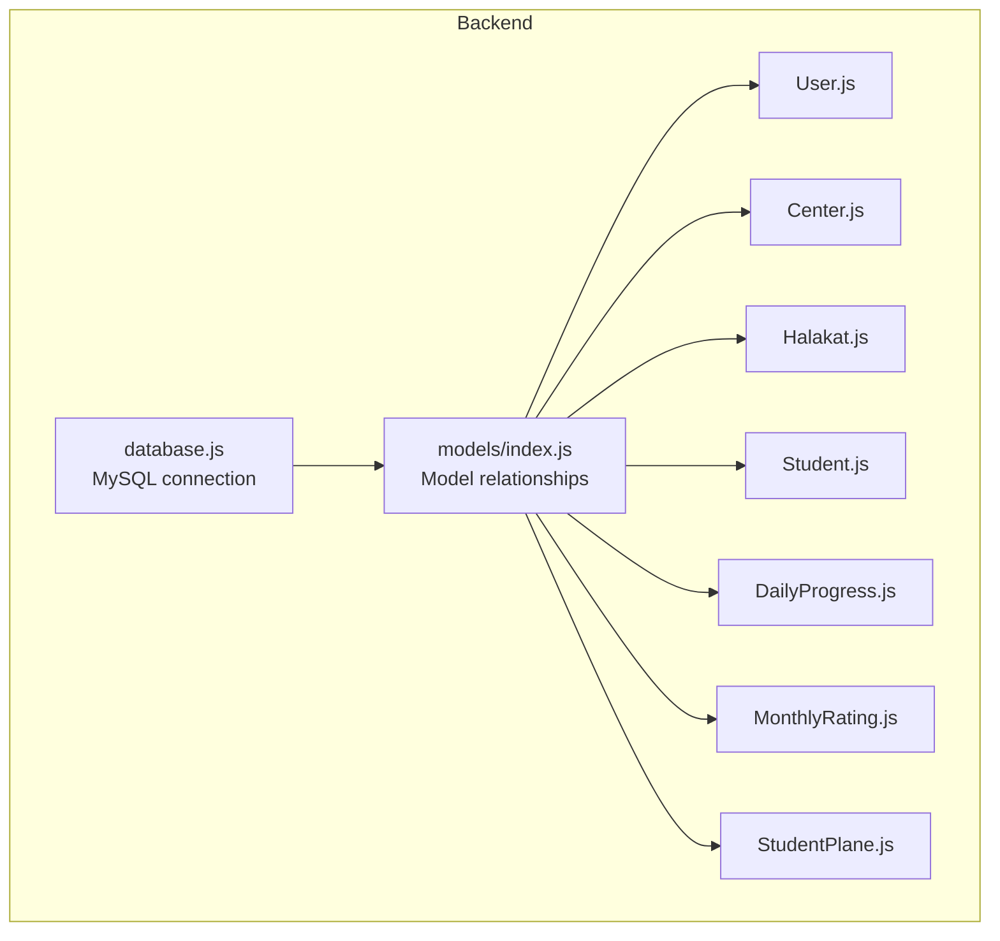
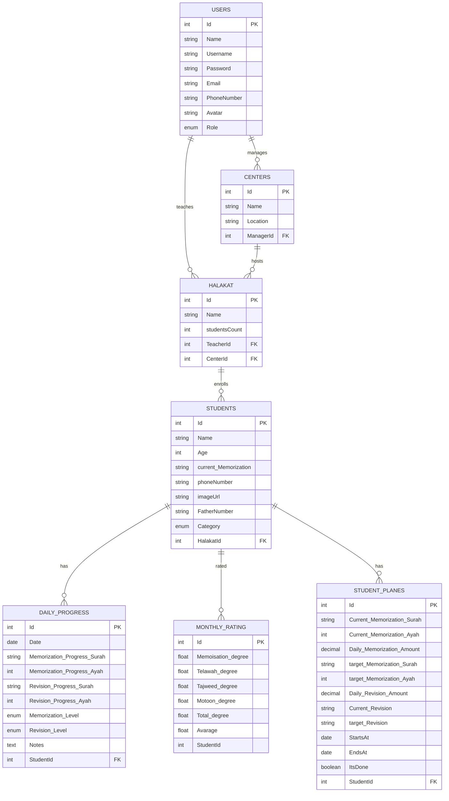
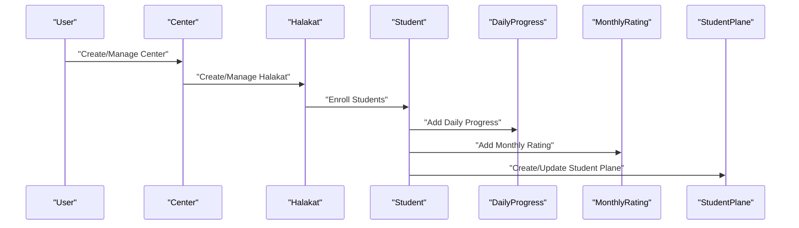
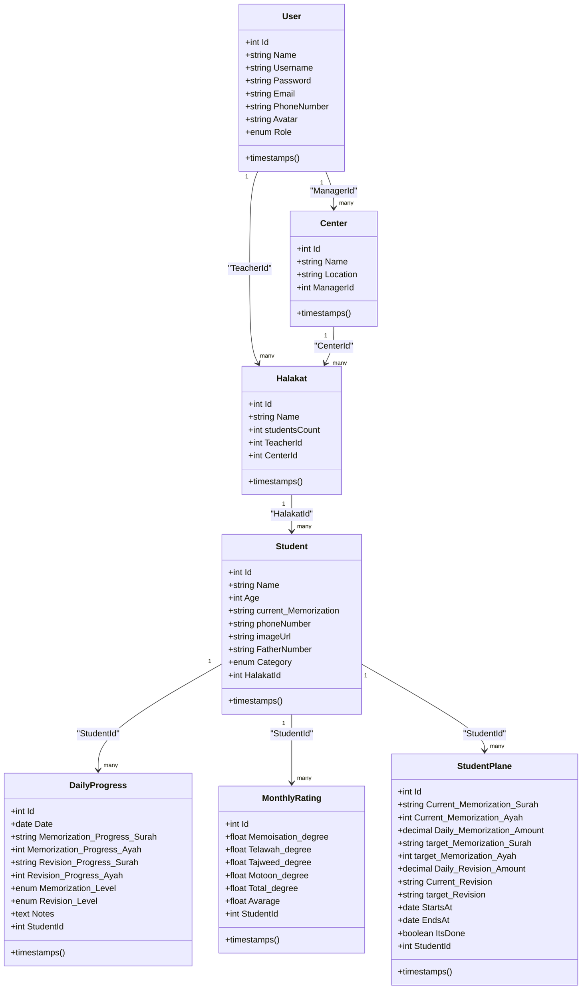
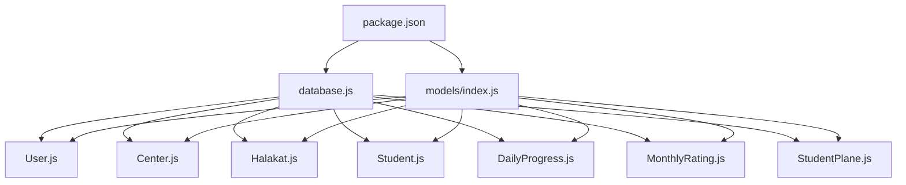

# Database Design

<cite>
**Referenced Files in This Document**
- [index.js](file://backend/src/models/index.js)
- [User.js](file://backend/src/models/User.js)
- [Center.js](file://backend/src/models/Center.js)
- [Halakat.js](file://backend/src/models/Halakat.js)
- [Student.js](file://backend/src/models/Student.js)
- [DailyProgress.js](file://backend/src/models/DailyProgress.js)
- [MonthlyRating.js](file://backend/src/models/MonthlyRating.js)
- [StudentPlane.js](file://backend/src/models/StudentPlane.js)
- [database.js](file://backend/src/config/database.js)
- [package.json](file://backend/package.json)
</cite>

## Table of Contents
1. [Introduction](#introduction)
2. [Project Structure](#project-structure)
3. [Core Components](#core-components)
4. [Architecture Overview](#architecture-overview)
5. [Detailed Component Analysis](#detailed-component-analysis)
6. [Dependency Analysis](#dependency-analysis)
7. [Performance Considerations](#performance-considerations)
8. [Troubleshooting Guide](#troubleshooting-guide)
9. [Conclusion](#conclusion)
10. [Appendices](#appendices)

## Introduction
This document provides comprehensive data model documentation for the Khirocom database design. It focuses on the complete entity-relationship schema and data modeling across the following entities: User, Center, Halakat, Student, DailyProgress, MonthlyRating, and StudentPlane. It details field definitions, data types, validation rules, primary keys, foreign keys, and relationship constraints. It explains the hierarchical data flow from User → Center → Halakat → Student and how progress tracking flows through DailyProgress, MonthlyRating, and StudentPlane. It includes database schema diagrams, referential integrity, validation rules, business constraints, data lifecycle management, access patterns, indexing strategies, performance considerations, security and privacy requirements, access control mechanisms, sample data examples, common query patterns, and Sequelize model definitions and relationship mappings.

## Project Structure
The database design is implemented using Sequelize ORM with a MySQL dialect. The models are defined under backend/src/models and relationships are configured in backend/src/models/index.js. The database connection is configured in backend/src/config/database.js. The project uses environment variables for database credentials and runs on Express with Sequelize.

**Diagram sources**
- [database.js:1-15](file://backend/src/config/database.js#L1-L15)
- [index.js:1-52](file://backend/src/models/index.js#L1-L52)

**Section sources**
- [database.js:1-15](file://backend/src/config/database.js#L1-L15)
- [package.json:1-14](file://backend/package.json#L1-L14)

## Core Components
This section documents each entity’s fields, data types, constraints, and validations as defined in the Sequelize models.

- User
  - Fields: Id (primary key, integer, auto-increment), Name (string, not null), Username (string, not null), Password (string length 255, not null), Email (string, not null), PhoneNumber (string, not null), Avatar (string, nullable), Role (enum: admin, teacher, supervisor, manager, default: teacher, not null).
  - Constraints: Unique identifiers via primary key; role enum enforced; timestamps enabled.
  - Validation: None explicitly defined in model; password hashing handled externally.

- Center
  - Fields: Id (primary key, integer, auto-increment), Name (string, not null), Location (string, not null), ManagerId (foreign key to users.Id, not null).
  - Constraints: Foreign key to User; timestamps enabled.

- Halakat
  - Fields: Id (primary key, integer, auto-increment), Name (string, not null), studentsCount (integer, not null), TeacherId (foreign key to users.Id, not null), CenterId (foreign key to centers.Id, not null).
  - Constraints: Foreign keys to User and Center; timestamps enabled.

- Student
  - Fields: Id (primary key, integer, auto-increment), Name (string, not null), Age (integer, not null), current_Memorization (string, not null), phoneNumber (string, not null), imageUrl (string, nullable), FatherNumber (string, not null), Category (enum: child, 5_parts, 10_parts, 15_parts, 20_parts, 25_parts, 30_parts, default: child, not null), HalakatId (foreign key to halakat.Id, not null).
  - Constraints: Foreign key to Halakat; timestamps enabled.

- DailyProgress
  - Fields: Id (primary key, integer, auto-increment), Date (date, not null), Memorization_Progress_Surah (string, not null), Memorization_Progress_Ayah (integer, not null), Revision_Progress_Surah (string, not null), Revision_Progress_Ayah (integer, not null), Memorization_Level (enum: ضعيف, مقبول, جيد, جيد جدا, ممتاز, default: ضعيف, not null), Revision_Level (enum: ضعيف, مقبول, جيد, جيد جدا, ممتاز, default: ضعيف, not null), Notes (text, nullable), StudentId (foreign key to students.Id, not null).
  - Constraints: Foreign key to Student; timestamps enabled.

- MonthlyRating
  - Fields: Id (primary key, integer, auto-increment), Memoisation_degree (float, not null, min 0, max 100), Telawah_degree (float, not null, min 0, max 100), Tajweed_degree (float, not null, min 0, max 60), Motoon_degree (float, not null, min 0, max 400), Total_degree (float, not null), Avarage (float, not null), StudentId (integer, not null).
  - Constraints: No explicit foreign key reference in model; timestamps enabled.

- StudentPlane
  - Fields: Id (primary key, integer, auto-increment), Current_Memorization_Surah (string, not null), Current_Memorization_Ayah (integer, not null), Daily_Memorization_Amount (decimal(10,2), not null), target_Memorization_Surah (string, not null), target_Memorization_Ayah (integer, not null), Daily_Revision_Amount (decimal(10,2), not null), Current_Revision (string, not null), target_Revision (string, not null), StartsAt (date, not null), EndsAt (date, not null), ItsDone (boolean, default false, not null), StudentId (foreign key to students.Id, not null).
  - Constraints: Foreign key to Student; timestamps enabled.

**Section sources**
- [User.js:1-59](file://backend/src/models/User.js#L1-L59)
- [Center.js:1-39](file://backend/src/models/Center.js#L1-L39)
- [Halakat.js:1-47](file://backend/src/models/Halakat.js#L1-L47)
- [Student.js:1-67](file://backend/src/models/Student.js#L1-L67)
- [DailyProgress.js:1-64](file://backend/src/models/DailyProgress.js#L1-L64)
- [MonthlyRating.js:1-70](file://backend/src/models/MonthlyRating.js#L1-L70)
- [StudentPlane.js:1-76](file://backend/src/models/StudentPlane.js#L1-L76)

## Architecture Overview
The data model follows a hierarchical structure centered around Users managing Centers, which manage Halakat groups, which in turn manage Students. Progress tracking is captured through DailyProgress entries, MonthlyRating records, and StudentPlane plans.

**Diagram sources**
- [index.js:12-41](file://backend/src/models/index.js#L12-L41)
- [User.js:8-48](file://backend/src/models/User.js#L8-L48)
- [Center.js:21-28](file://backend/src/models/Center.js#L21-L28)
- [Halakat.js:21-36](file://backend/src/models/Halakat.js#L21-L36)
- [Student.js:50-57](file://backend/src/models/Student.js#L50-L57)
- [DailyProgress.js:47-54](file://backend/src/models/DailyProgress.js#L47-L54)
- [MonthlyRating.js:55-58](file://backend/src/models/MonthlyRating.js#L55-L58)
- [StudentPlane.js:58-65](file://backend/src/models/StudentPlane.js#L58-L65)

## Detailed Component Analysis

### Entity Relationships and Referential Integrity
- User → Center: One-to-Many via ManagerId.
- User → Halakat: One-to-Many via TeacherId.
- Center → Halakat: One-to-Many via CenterId.
- Halakat → Student: One-to-Many via HalakatId.
- Student → DailyProgress: One-to-Many via StudentId.
- Student → MonthlyRating: One-to-Many via StudentId.
- Student → StudentPlane: One-to-Many via StudentId.

Constraints:
- All foreign keys are defined in the models except MonthlyRating, which lacks an explicit foreign key definition in the model file. This could lead to missing referential integrity enforcement at the ORM level.

**Section sources**
- [index.js:14-41](file://backend/src/models/index.js#L14-L41)
- [MonthlyRating.js:55-68](file://backend/src/models/MonthlyRating.js#L55-L68)

### Data Validation Rules and Business Constraints
- User
  - Role enum values: admin, teacher, supervisor, manager.
  - All identity fields are required; Avatar is optional.

- Center
  - ManagerId references users.Id.

- Halakat
  - TeacherId references users.Id.
  - CenterId references centers.Id.
  - studentsCount is required and non-negative.

- Student
  - Category enum values: child, 5_parts, 10_parts, 15_parts, 20_parts, 25_parts, 30_parts.
  - HalakatId references halakat.Id.

- DailyProgress
  - Memorization_Level and Revision_Level enums: ضعيف, مقبول, جيد, جيد جدا, ممتاز.
  - Notes is optional.

- MonthlyRating
  - Degree fields validated with min/max bounds:
    - Memoisation_degree: min 0, max 100
    - Telawah_degree: min 0, max 100
    - Tajweed_degree: min 0, max 60
    - Motoon_degree: min 0, max 400
  - Total_degree and Avarage are required.

- StudentPlane
  - Decimal fields use precision (10,2).
  - ItsDone defaults to false.
  - StartsAt and EndsAt define a plan period.

**Section sources**
- [User.js:44-48](file://backend/src/models/User.js#L44-L48)
- [Center.js:24-27](file://backend/src/models/Center.js#L24-L27)
- [Halakat.js:24-35](file://backend/src/models/Halakat.js#L24-L35)
- [Student.js:38-49](file://backend/src/models/Student.js#L38-L49)
- [DailyProgress.js:33-42](file://backend/src/models/DailyProgress.js#L33-L42)
- [MonthlyRating.js:18-30](file://backend/src/models/MonthlyRating.js#L18-L30)
- [StudentPlane.js:21-35](file://backend/src/models/StudentPlane.js#L21-L35)

### Hierarchical Data Flow
- User manages multiple Centers and multiple Halakat groups.
- Center hosts multiple Halakat groups.
- Halakat enrolls multiple Students.
- Student accumulates DailyProgress entries, MonthlyRating records, and StudentPlane plans.

**Diagram sources**
- [index.js:14-41](file://backend/src/models/index.js#L14-L41)

### Data Lifecycle Management
- Timestamps are enabled for all models, indicating createdAt and updatedAt fields are maintained automatically.
- Soft deletion is not present; hard deletes rely on referential integrity.

**Section sources**
- [User.js:55](file://backend/src/models/User.js#L55)
- [Center.js:34](file://backend/src/models/Center.js#L34)
- [Halakat.js:42](file://backend/src/models/Halakat.js#L42)
- [Student.js:63](file://backend/src/models/Student.js#L63)
- [DailyProgress.js:60](file://backend/src/models/DailyProgress.js#L60)
- [MonthlyRating.js:64](file://backend/src/models/MonthlyRating.js#L64)
- [StudentPlane.js:71](file://backend/src/models/StudentPlane.js#L71)

### Sample Data Examples
- User
  - Example: { Name: "Ahmad Ali", Username: "ahmadali", Password: "hashed_password", Email: "ahmad@example.com", PhoneNumber: "+966123456789", Role: "teacher" }

- Center
  - Example: { Name: "Al-Madinah", Location: "Madinah", ManagerId: 1 }

- Halakat
  - Example: { Name: "Group A", studentsCount: 15, TeacherId: 1, CenterId: 1 }

- Student
  - Example: { Name: "Omar", Age: 12, current_Memorization: "Surah Al-Baqarah", phoneNumber: "+966987654321", FatherNumber: "+966123456789", Category: "10_parts", HalakatId: 1 }

- DailyProgress
  - Example: { Date: "2025-04-01", Memorization_Progress_Surah: "Surah Al-Fatiha", Memorization_Progress_Ayah: 5, Revision_Progress_Surah: "Surah Al-Fatiha", Revision_Progress_Ayah: 3, Memorization_Level: "جيد", Revision_Level: "جيد", Notes: "Good focus today", StudentId: 1 }

- MonthlyRating
  - Example: { Memoisation_degree: 95, Telawah_degree: 90, Tajweed_degree: 55, Motoon_degree: 380, Total_degree: 100, Avarage: 95, StudentId: 1 }

- StudentPlane
  - Example: { Current_Memorization_Surah: "Surah Al-Fatiha", Current_Memorization_Ayah: 5, Daily_Memorization_Amount: 10.00, target_Memorization_Surah: "Surah Al-Baqarah", target_Memorization_Ayah: 20, Daily_Revision_Amount: 5.00, Current_Revision: "Surah Al-Fatiha", target_Revision: "Surah Al-Baqarah", StartsAt: "2025-04-01", EndsAt: "2025-06-30", ItsDone: false, StudentId: 1 }

**Section sources**
- [User.js:14-48](file://backend/src/models/User.js#L14-L48)
- [Center.js:13-28](file://backend/src/models/Center.js#L13-L28)
- [Halakat.js:13-36](file://backend/src/models/Halakat.js#L13-L36)
- [Student.js:13-57](file://backend/src/models/Student.js#L13-L57)
- [DailyProgress.js:13-54](file://backend/src/models/DailyProgress.js#L13-L54)
- [MonthlyRating.js:15-58](file://backend/src/models/MonthlyRating.js#L15-L58)
- [StudentPlane.js:13-65](file://backend/src/models/StudentPlane.js#L13-L65)

### Common Query Patterns
- Fetch all Centers managed by a User
  - Use association: User.hasMany(Center, { foreignKey: "ManagerId" })
- Fetch all Halakat taught by a User
  - Use association: User.hasMany(Halakat, { foreignKey: "TeacherId" })
- Fetch all Students enrolled in a Halakat
  - Use association: Halakat.hasMany(Student, { foreignKey: "HalakatId" })
- Fetch DailyProgress entries for a Student
  - Use association: Student.hasMany(DailyProgress, { foreignKey: "StudentId" })
- Fetch MonthlyRating records for a Student
  - Use association: Student.hasMany(MonthlyRating, { foreignKey: "StudentId" })
- Fetch StudentPlane plans for a Student
  - Use association: Student.hasMany(StudentPlane, { foreignKey: "StudentId" })

These patterns leverage Sequelize associations defined in models/index.js.

**Section sources**
- [index.js:14-41](file://backend/src/models/index.js#L14-L41)

### Sequelize Model Definitions and Relationship Mappings
- Model initialization
  - Each model defines a static init(...) call with attributes, options (tableName, modelName, timestamps), and a sequelize instance.
- Associations
  - One-to-Many relationships are established using belongsTo and hasMany with explicit foreignKey and alias options.
- Foreign Keys
  - Explicit foreign key references are defined in Center, Halakat, Student, and StudentPlane models.
  - MonthlyRating lacks an explicit foreign key definition in the model file.

**Diagram sources**
- [index.js:14-41](file://backend/src/models/index.js#L14-L41)
- [User.js:6-57](file://backend/src/models/User.js#L6-L57)
- [Center.js:6-36](file://backend/src/models/Center.js#L6-L36)
- [Halakat.js:6-44](file://backend/src/models/Halakat.js#L6-L44)
- [Student.js:6-65](file://backend/src/models/Student.js#L6-L65)
- [DailyProgress.js:6-62](file://backend/src/models/DailyProgress.js#L6-L62)
- [MonthlyRating.js:8-66](file://backend/src/models/MonthlyRating.js#L8-L66)
- [StudentPlane.js:6-75](file://backend/src/models/StudentPlane.js#L6-L75)

## Dependency Analysis
- External Dependencies
  - mysql2: MySQL driver for Node.js.
  - sequelize: ORM for database abstraction.
  - dotenv: Environment variable loading.
  - bcrypt/bcryptjs: Password hashing.
  - jsonwebtoken: Authentication tokens.
  - express: Web framework.
- Internal Dependencies
  - Models depend on database.js for the Sequelize instance.
  - Relationships are centralized in models/index.js.

**Diagram sources**
- [package.json:1-14](file://backend/package.json#L1-L14)
- [database.js:1-15](file://backend/src/config/database.js#L1-L15)
- [index.js:1-52](file://backend/src/models/index.js#L1-L52)

**Section sources**
- [package.json:1-14](file://backend/package.json#L1-L14)
- [database.js:1-15](file://backend/src/config/database.js#L1-L15)
- [index.js:1-52](file://backend/src/models/index.js#L1-L52)

## Performance Considerations
- Indexing Strategies
  - Add indexes on foreign keys frequently used in joins:
    - Center.ManagerId
    - Halakat.TeacherId, Halakat.CenterId
    - Student.HalakatId
    - DailyProgress.StudentId
    - MonthlyRating.StudentId
    - StudentPlane.StudentId
  - Composite indexes for frequent filters:
    - DailyProgress(StudentId, Date)
    - MonthlyRating(StudentId, createdAt)
- Query Optimization
  - Use includes to eager load associations to reduce N+1 queries.
  - Paginate results for large datasets (e.g., Students, DailyProgress).
- Data Types
  - Use DECIMAL(10,2) for monetary or precise numeric fields (already used in StudentPlane).
  - Use ENUM for fixed sets of values to reduce storage and improve readability.
- Caching
  - Cache frequently accessed metadata (e.g., User roles, Center lists) to reduce database load.
- Logging
  - Disable logging in production (already set in database.js) to avoid overhead.

[No sources needed since this section provides general guidance]

## Troubleshooting Guide
- Missing Foreign Key Constraint in MonthlyRating
  - Issue: MonthlyRating model does not define a foreign key constraint for StudentId.
  - Impact: Potential orphaned records and lack of referential integrity enforcement.
  - Recommendation: Add a references configuration for StudentId in MonthlyRating model.
- Password Security
  - Ensure passwords are hashed before insertion/update using bcrypt/bcryptjs.
- Role-Based Access Control
  - Enforce access control at the application layer using User.Role and JWT tokens.
- Data Validation
  - Validate degree ranges before persisting MonthlyRating entries.
- Timezone Considerations
  - Store dates consistently (e.g., UTC) and convert to local timezone for display.

**Section sources**
- [MonthlyRating.js:55-58](file://backend/src/models/MonthlyRating.js#L55-L58)

## Conclusion
The Khirocom database design establishes a clear hierarchy from Users to Centers, Halakat groups, and Students, with robust progress tracking through DailyProgress, MonthlyRating, and StudentPlane. The Sequelize models define primary keys, foreign keys, and associations, while validation rules ensure data integrity. To strengthen the design, add explicit foreign key constraints for MonthlyRating, implement comprehensive access control, and optimize queries with targeted indexing. These improvements will enhance reliability, security, and performance.

## Appendices

### Appendix A: Data Access Patterns
- Fetch Centers by ManagerId
  - Use User.Centers association.
- Fetch Halakat by TeacherId
  - Use User.TeacherHalakat association.
- Fetch Students by HalakatId
  - Use Halakat.HalakatStudents association.
- Fetch DailyProgress by StudentId
  - Use Student.Progresses association.
- Fetch MonthlyRating by StudentId
  - Use Student.Ratings association.
- Fetch StudentPlane by StudentId
  - Use Student.Planes association.

**Section sources**
- [index.js:14-41](file://backend/src/models/index.js#L14-L41)

### Appendix B: Security and Privacy Requirements
- Authentication and Authorization
  - Use JSON Web Tokens (JWT) for session management.
  - Enforce role-based access control (RBAC) using User.Role.
- Data Protection
  - Hash passwords using bcrypt/bcryptjs.
  - Limit exposure of sensitive fields (e.g., Password) in API responses.
- Privacy
  - Anonymize or pseudonymize personal data where possible.
  - Comply with data retention policies and deletion requests.

**Section sources**
- [User.js:44-48](file://backend/src/models/User.js#L44-L48)
- [package.json:3-11](file://backend/package.json#L3-L11)