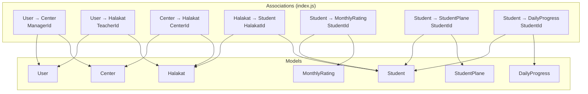
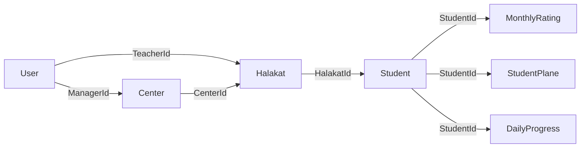
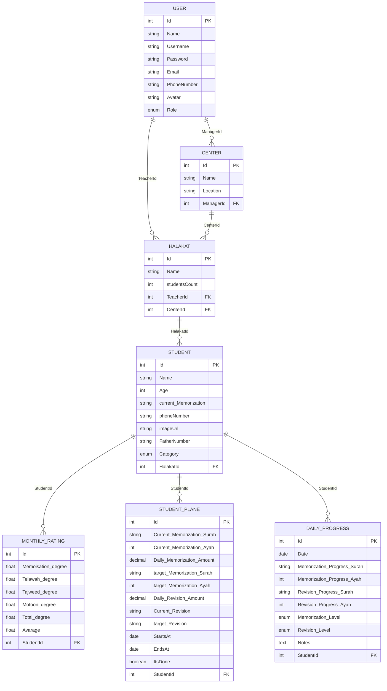
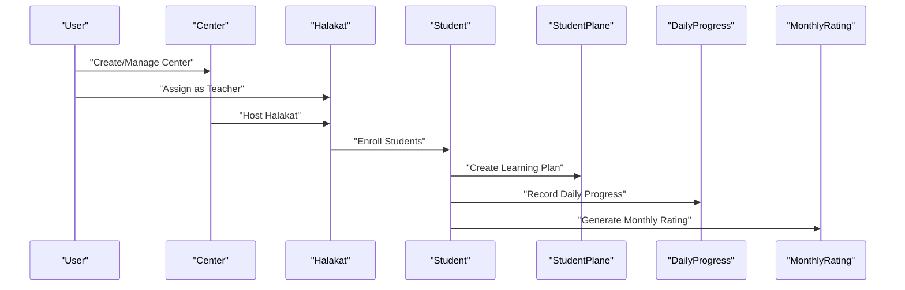
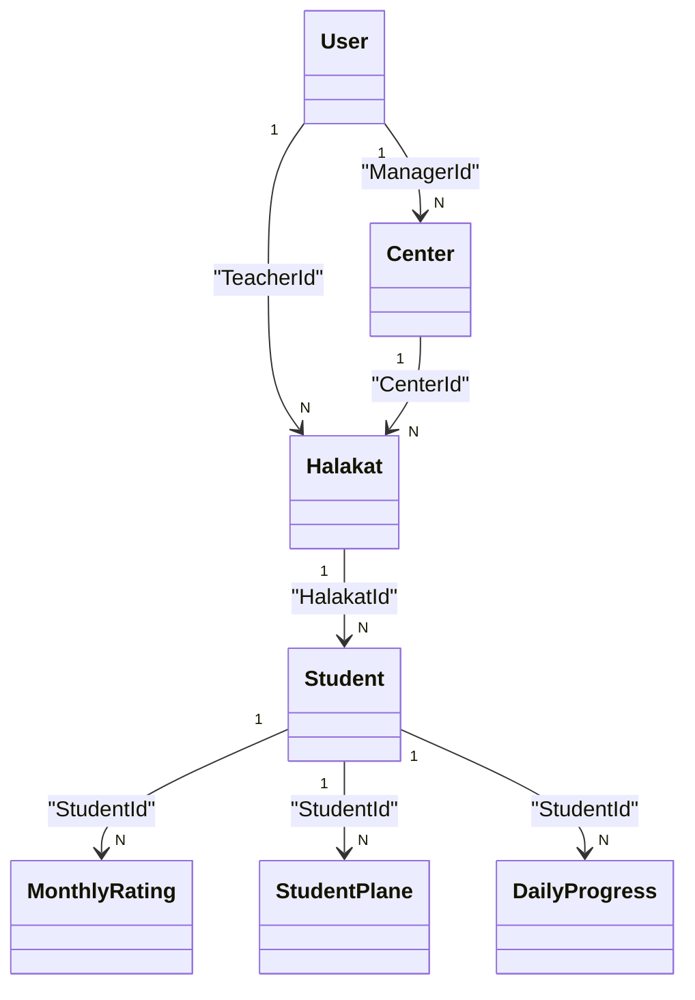
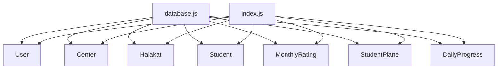

# Entity Relationships

<cite>
**Referenced Files in This Document**
- [User.js](file://backend/src/models/User.js)
- [Center.js](file://backend/src/models/Center.js)
- [Halakat.js](file://backend/src/models/Halakat.js)
- [Student.js](file://backend/src/models/Student.js)
- [DailyProgress.js](file://backend/src/models/DailyProgress.js)
- [MonthlyRating.js](file://backend/src/models/MonthlyRating.js)
- [StudentPlane.js](file://backend/src/models/StudentPlane.js)
- [index.js](file://backend/src/models/index.js)
- [database.js](file://backend/src/config/database.js)
</cite>

## Table of Contents
1. [Introduction](#introduction)
2. [Project Structure](#project-structure)
3. [Core Components](#core-components)
4. [Architecture Overview](#architecture-overview)
5. [Detailed Component Analysis](#detailed-component-analysis)
6. [Dependency Analysis](#dependency-analysis)
7. [Performance Considerations](#performance-considerations)
8. [Troubleshooting Guide](#troubleshooting-guide)
9. [Conclusion](#conclusion)

## Introduction
This document explains the entity relationship structure in the Khirocom educational institution management system. It focuses on the database design involving five primary models: User, Center, Halakat, Student, DailyProgress, MonthlyRating, and StudentPlane. The relationships are defined using foreign keys and Sequelize associations to enforce referential integrity and model the hierarchical workflow of managing centers, teaching groups (halakat), and student learning progress.

## Project Structure
The backend follows a layered structure with models under a dedicated folder. Associations between models are centralized in a single index file that defines all foreign key relationships. The database connection is configured via environment variables and MySQL dialect.

**Diagram sources**
- [index.js:14-40](file://backend/src/models/index.js#L14-L40)

**Section sources**
- [database.js:1-15](file://backend/src/config/database.js#L1-L15)
- [index.js:1-52](file://backend/src/models/index.js#L1-L52)

## Core Components
This section outlines the entities and their roles in the system:
- User: Represents administrators, teachers, supervisors, and managers. Used as the parent entity for Centers and Halakat.
- Center: Represents physical locations managed by Users (Role: manager/supervisor).
- Halakat: Represents teaching groups led by Users (Role: teacher) and associated with Centers.
- Student: Represents learners enrolled in Halakat groups.
- DailyProgress: Tracks daily memorization and revision progress for Students.
- MonthlyRating: Aggregates monthly performance metrics for Students.
- StudentPlane: Defines individualized learning targets and schedules for Students.

**Section sources**
- [User.js:1-59](file://backend/src/models/User.js#L1-L59)
- [Center.js:1-39](file://backend/src/models/Center.js#L1-L39)
- [Halakat.js:1-47](file://backend/src/models/Halakat.js#L1-L47)
- [Student.js:1-67](file://backend/src/models/Student.js#L1-L67)
- [DailyProgress.js:1-64](file://backend/src/models/DailyProgress.js#L1-L64)
- [MonthlyRating.js:1-70](file://backend/src/models/MonthlyRating.js#L1-L70)
- [StudentPlane.js:1-76](file://backend/src/models/StudentPlane.js#L1-L76)

## Architecture Overview
The system enforces a strict hierarchy:
- User manages multiple Centers (1:N).
- User teaches multiple Halakat (1:N).
- Center hosts multiple Halakat (1:N).
- Halakat contains multiple Students (1:N).
- Student accumulates multiple MonthlyRating entries (1:N).
- Student accumulates multiple StudentPlane entries (1:N).
- Student accumulates multiple DailyProgress entries (1:N).

**Diagram sources**
- [index.js:14-40](file://backend/src/models/index.js#L14-L40)
- [Center.js:21-28](file://backend/src/models/Center.js#L21-L28)
- [Halakat.js:21-36](file://backend/src/models/Halakat.js#L21-L36)
- [Student.js:50-57](file://backend/src/models/Student.js#L50-L57)
- [MonthlyRating.js:55-58](file://backend/src/models/MonthlyRating.js#L55-L58)
- [StudentPlane.js:58-65](file://backend/src/models/StudentPlane.js#L58-L65)
- [DailyProgress.js:47-54](file://backend/src/models/DailyProgress.js#L47-L54)

## Detailed Component Analysis

### Relationship Mapping and Referential Integrity
Below are the explicit foreign key constraints defined in the models and associations:

- User → Center (1:N): Center.ManagerId references User.Id.
- User → Halakat (1:N): Halakat.TeacherId references User.Id.
- Center → Halakat (1:N): Halakat.CenterId references Center.Id.
- Halakat → Student (1:N): Student.HalakatId references Halakat.Id.
- Student → MonthlyRating (1:N): MonthlyRating.StudentId references Student.Id.
- Student → StudentPlane (1:N): StudentPlane.StudentId references Student.Id.
- Student → DailyProgress (1:N): DailyProgress.StudentId references Student.Id.

**Diagram sources**
- [User.js:8-48](file://backend/src/models/User.js#L8-L48)
- [Center.js:21-28](file://backend/src/models/Center.js#L21-L28)
- [Halakat.js:21-36](file://backend/src/models/Halakat.js#L21-L36)
- [Student.js:50-57](file://backend/src/models/Student.js#L50-L57)
- [DailyProgress.js:47-54](file://backend/src/models/DailyProgress.js#L47-L54)
- [MonthlyRating.js:55-58](file://backend/src/models/MonthlyRating.js#L55-L58)
- [StudentPlane.js:58-65](file://backend/src/models/StudentPlane.js#L58-L65)

**Section sources**
- [index.js:14-40](file://backend/src/models/index.js#L14-L40)
- [Center.js:21-28](file://backend/src/models/Center.js#L21-L28)
- [Halakat.js:21-36](file://backend/src/models/Halakat.js#L21-L36)
- [Student.js:50-57](file://backend/src/models/Student.js#L50-L57)
- [DailyProgress.js:47-54](file://backend/src/models/DailyProgress.js#L47-L54)
- [MonthlyRating.js:55-58](file://backend/src/models/MonthlyRating.js#L55-L58)
- [StudentPlane.js:58-65](file://backend/src/models/StudentPlane.js#L58-L65)

### Hierarchical Data Flow
The educational workflow flows from top to bottom:
- User creates/manages Centers and assigns Teachers (Users) to lead Halakat.
- Center hosts multiple Halakat; each Halakat contains multiple Students.
- Progress tracking begins with StudentPlane (learning targets), DailyProgress (daily records), and MonthlyRating (monthly aggregation).

**Diagram sources**
- [index.js:14-40](file://backend/src/models/index.js#L14-L40)
- [StudentPlane.js:58-65](file://backend/src/models/StudentPlane.js#L58-L65)
- [DailyProgress.js:47-54](file://backend/src/models/DailyProgress.js#L47-L54)
- [MonthlyRating.js:55-58](file://backend/src/models/MonthlyRating.js#L55-L58)

### Business Logic Behind Relationships
- User-Center: Ensures administrative oversight of physical locations; Managers coordinate center operations.
- User-Halakat: Enables role-based delegation where Teachers lead halakat groups.
- Center-Halakat: Organizes halakat by geographic or institutional units.
- Halakat-Student: Groups learners by teaching cohort; simplifies progress tracking and reporting.
- Student-MonthlyRating: Aggregates performance across multiple days/months for evaluation and reporting.
- Student-StudentPlane: Establishes personalized learning goals and schedules aligned with curriculum milestones.
- Student-DailyProgress: Captures day-to-day progress to inform weekly/monthly ratings and adjust plans.

**Section sources**
- [index.js:14-40](file://backend/src/models/index.js#L14-L40)
- [MonthlyRating.js:15-50](file://backend/src/models/MonthlyRating.js#L15-L50)
- [StudentPlane.js:13-52](file://backend/src/models/StudentPlane.js#L13-L52)
- [DailyProgress.js:13-46](file://backend/src/models/DailyProgress.js#L13-L46)

### Association Definitions and One-to-Many Mapping
The associations are defined in the central index file and reflect the following mappings:
- User → Center: foreignKey: ManagerId
- User → Halakat: foreignKey: TeacherId
- Center → Halakat: foreignKey: CenterId
- Halakat → Student: foreignKey: HalakatId
- Student → MonthlyRating: foreignKey: StudentId
- Student → StudentPlane: foreignKey: StudentId
- Student → DailyProgress: foreignKey: StudentId

**Diagram sources**
- [index.js:14-40](file://backend/src/models/index.js#L14-L40)

**Section sources**
- [index.js:14-40](file://backend/src/models/index.js#L14-L40)

## Dependency Analysis
The models depend on the shared database configuration and Sequelize. Associations rely on consistent foreign key naming and referential integrity enforcement.

**Diagram sources**
- [database.js:1-15](file://backend/src/config/database.js#L1-L15)
- [index.js:1-52](file://backend/src/models/index.js#L1-L52)

**Section sources**
- [database.js:1-15](file://backend/src/config/database.js#L1-L15)
- [index.js:1-52](file://backend/src/models/index.js#L1-L52)

## Performance Considerations
- Indexing: Ensure foreign key columns (e.g., ManagerId, TeacherId, CenterId, HalakatId, StudentId) are indexed to optimize joins.
- Denormalization: MonthlyRating aggregates can reduce repeated calculations; however, ensure computed fields (Total_degree, Avarage) are recalculated efficiently during updates.
- Query Patterns: Prefer eager loading of associations (as used in associations) to minimize N+1 queries when retrieving hierarchical data.
- Validation: Model-level validations (e.g., score ranges) prevent invalid data and reduce downstream processing overhead.

## Troubleshooting Guide
- Foreign Key Constraint Violations: If inserting or updating records fails due to missing parent records, verify that referenced Ids exist in parent tables.
- Association Fetching: When querying child entities, ensure the association alias matches the definition (e.g., Centers, TeacherHalakat, CenterHalakat, HalakatStudents, Ratings, Planes, Progresses).
- Data Types: Confirm column types align with model definitions (e.g., ENUMs, DECIMAL precision, DATE vs DATETIME).
- Environment Variables: Verify database credentials and host/port are correctly set for the MySQL connection.

**Section sources**
- [index.js:14-40](file://backend/src/models/index.js#L14-L40)
- [MonthlyRating.js:18-46](file://backend/src/models/MonthlyRating.js#L18-L46)
- [StudentPlane.js:21-35](file://backend/src/models/StudentPlane.js#L21-L35)
- [database.js:4-14](file://backend/src/config/database.js#L4-L14)

## Conclusion
The Khirocom database design enforces a clear hierarchy from User to Center to Halakat to Student, with robust associations enabling progress tracking through StudentPlane, DailyProgress, and MonthlyRating. The foreign key constraints and Sequelize associations ensure referential integrity and streamline educational institution management workflows. Proper indexing and validation further enhance reliability and performance.