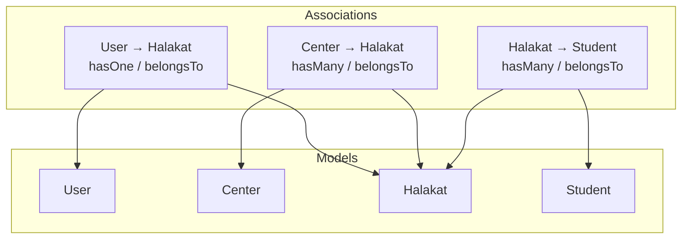
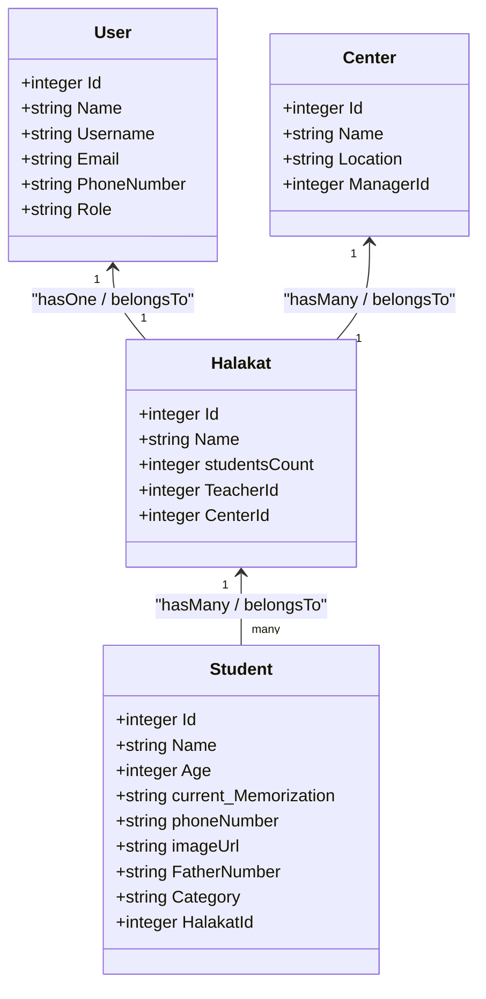
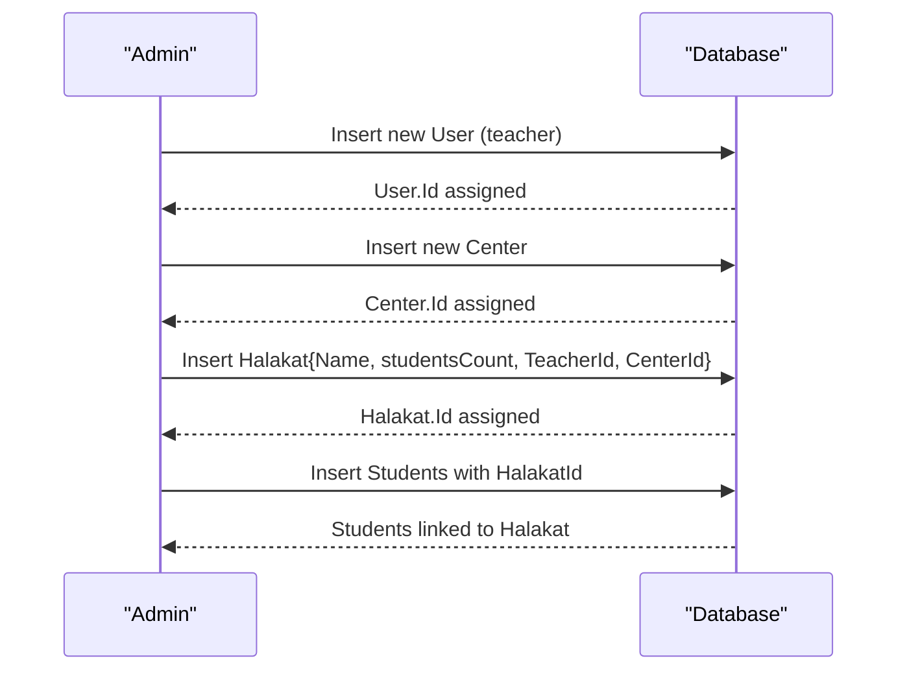
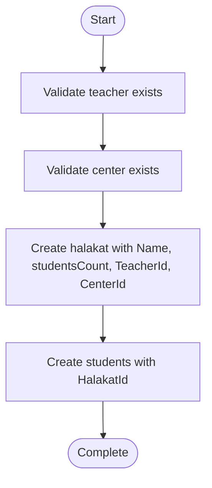
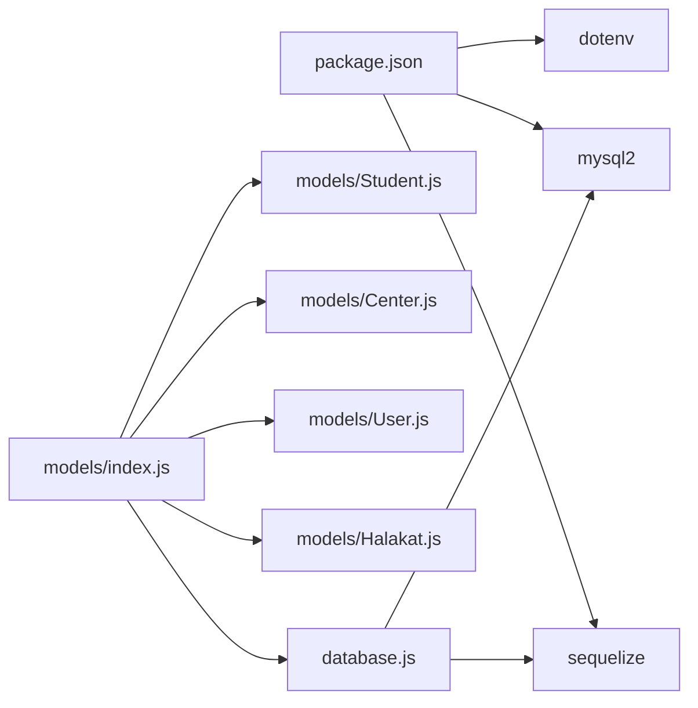

# Halakat Model

<cite>
**Referenced Files in This Document**
- [Halakat.js](file://backend/src/models/Halakat.js)
- [User.js](file://backend/src/models/User.js)
- [Center.js](file://backend/src/models/Center.js)
- [Student.js](file://backend/src/models/Student.js)
- [index.js](file://backend/src/models/index.js)
- [database.js](file://backend/src/config/database.js)
- [package.json](file://backend/package.json)
</cite>

## Table of Contents
1. [Introduction](#introduction)
2. [Project Structure](#project-structure)
3. [Core Components](#core-components)
4. [Architecture Overview](#architecture-overview)
5. [Detailed Component Analysis](#detailed-component-analysis)
6. [Dependency Analysis](#dependency-analysis)
7. [Performance Considerations](#performance-considerations)
8. [Troubleshooting Guide](#troubleshooting-guide)
9. [Conclusion](#conclusion)

## Introduction
This document provides comprehensive documentation for the Halakat model and its ecosystem within the Khirocom project. It explains the data model, relationships with User (teacher), Center (institutional location), and Student, and outlines the business logic for managing teaching groups/classes. It also documents field definitions, validation rules, foreign key constraints, and practical examples for creating halakat groups, assigning teachers, and grouping students.

## Project Structure
The backend follows a modular structure with models defined under backend/src/models. The Halakat model integrates with User (teacher), Center (location), and Student (learners) via associations defined centrally in the models index file. Database connectivity is configured via Sequelize using environment variables.

**Diagram sources**
- [index.js:12-28](file://backend/src/models/index.js#L12-L28)

**Section sources**
- [package.json:1-14](file://backend/package.json#L1-L14)
- [database.js:1-15](file://backend/src/config/database.js#L1-L15)
- [index.js:12-28](file://backend/src/models/index.js#L12-L28)

## Core Components
This section documents the Halakat model’s fields, constraints, and its relationships with other models.

- Model identity and persistence
  - Model name: Halakat
  - Table name: halakat
  - Timestamps enabled: createdAt and updatedAt are managed automatically by Sequelize.

- Fields and validation rules
  - Id
    - Type: INTEGER
    - Constraints: primary key, auto-increment
    - Notes: Used as the unique identifier for halakat records.
  - Name
    - Type: STRING
    - Constraints: required (not null)
    - Purpose: Human-readable label for the halakat group.
  - studentsCount
    - Type: INTEGER
    - Constraints: required (not null)
    - Purpose: Tracks the number of students enrolled in the halakat.
  - TeacherId
    - Type: INTEGER
    - Constraints: required (not null)
    - Foreign key: references users.Id
    - Relationship: belongs to User (teacher)
  - CenterId
    - Type: INTEGER
    - Constraints: required (not null)
    - Foreign key: references centers.Id
    - Relationship: belongs to Center (institutional location)

- Automatic timestamps
  - createdAt: managed automatically by Sequelize
  - updatedAt: managed automatically by Sequelize

- Business logic highlights
  - A halakat must be associated with a valid teacher (User) and a valid center (Center).
  - Students are grouped under a halakat via a foreign key relationship.
  - The studentsCount field is present in the model definition but is not validated in the model itself; it is recommended to enforce consistency during create/update operations.

**Section sources**
- [Halakat.js:6-44](file://backend/src/models/Halakat.js#L6-L44)

## Architecture Overview
The Halakat model participates in three core relationships:
- One teacher (User) per halakat (hasOne / belongsTo)
- One center (Center) per halakat (hasMany / belongsTo)
- Many students (Student) per halakat (hasMany / belongsTo)

**Diagram sources**
- [User.js:6-57](file://backend/src/models/User.js#L6-L57)
- [Center.js:6-36](file://backend/src/models/Center.js#L6-L36)
- [Halakat.js:6-44](file://backend/src/models/Halakat.js#L6-L44)
- [Student.js:6-65](file://backend/src/models/Student.js#L6-L65)

## Detailed Component Analysis

### Halakat Model Definition
- Initialization and schema
  - Uses Sequelize Model with explicit field definitions and constraints.
  - Table name and model name are set to halakat.
  - Timestamps enabled to track record creation and updates.

- Field-level validation and constraints
  - Name: required string.
  - studentsCount: required integer.
  - TeacherId: required integer with foreign key reference to users.Id.
  - CenterId: required integer with foreign key reference to centers.Id.

- Associations
  - Belongs to User (teacher): TeacherId maps to users.Id.
  - Belongs to Center: CenterId maps to centers.Id.
  - Has many Students: Students reference halakat via HalakatId.

**Section sources**
- [Halakat.js:6-44](file://backend/src/models/Halakat.js#L6-L44)
- [index.js:18-28](file://backend/src/models/index.js#L18-L28)

### Relationship Mappings
- User (Teacher)
  - One-to-one mapping: a User can own one Halakat as a teacher.
  - Association direction: belongs to User via TeacherId.
- Center (Institutional Location)
  - One-to-many mapping: a Center hosts many Halakats.
  - Association direction: belongs to Center via CenterId.
- Student (Learners)
  - One-to-many mapping: a Halakat contains many Students.
  - Association direction: belongs to Halakat via HalakatId.

**Diagram sources**
- [index.js:18-28](file://backend/src/models/index.js#L18-L28)
- [Halakat.js:21-36](file://backend/src/models/Halakat.js#L21-L36)
- [Student.js:50-57](file://backend/src/models/Student.js#L50-L57)

**Section sources**
- [index.js:18-28](file://backend/src/models/index.js#L18-L28)

### Teaching Group Management Workflow
- Creating a halakat group
  - Ensure a valid teacher (User) exists.
  - Ensure a valid center (Center) exists.
  - Create a Halakat record with Name, studentsCount, TeacherId, and CenterId.
- Assigning a teacher
  - Set TeacherId to the Id of the target User.
- Assigning a center
  - Set CenterId to the Id of the target Center.
- Grouping students
  - Create Student records with HalakatId set to the newly created Halakat.Id.

[No sources needed since this diagram shows conceptual workflow, not actual code structure]

### Data Integrity and Validation
- Required fields enforced at the database level via NOT NULL constraints.
- Foreign keys enforced via references to users.Id and centers.Id.
- StudentsCount is required but not validated in the model; consider adding validation in application logic to ensure consistency with actual student counts.

**Section sources**
- [Halakat.js:13-20](file://backend/src/models/Halakat.js#L13-L20)
- [Halakat.js:21-36](file://backend/src/models/Halakat.js#L21-L36)
- [Student.js:50-57](file://backend/src/models/Student.js#L50-L57)

## Dependency Analysis
- Internal dependencies
  - Halakat depends on the database connection initialized in database.js.
  - Associations are defined in index.js and consumed by application logic.
- External dependencies
  - Sequelize ORM for data modeling and migrations.
  - MySQL dialect via mysql2 driver.
  - Environment configuration via dotenv.

**Diagram sources**
- [package.json:2-11](file://backend/package.json#L2-L11)
- [database.js:4-14](file://backend/src/config/database.js#L4-L14)
- [index.js:1-11](file://backend/src/models/index.js#L1-L11)

**Section sources**
- [package.json:2-11](file://backend/package.json#L2-L11)
- [database.js:4-14](file://backend/src/config/database.js#L4-L14)
- [index.js:1-11](file://backend/src/models/index.js#L1-L11)

## Performance Considerations
- Indexing recommendations
  - Add indexes on TeacherId and CenterId in the halakat table to optimize joins and filtering by teacher or center.
  - Add indexes on HalakatId in the students table to accelerate queries retrieving students by halakat.
- Query optimization
  - Use eager loading (include) when fetching halakat with related User, Center, and Student data to avoid N+1 queries.
- Data consistency
  - Consider implementing triggers or application-level checks to maintain studentsCount accuracy when student enrollments change.

[No sources needed since this section provides general guidance]

## Troubleshooting Guide
- Common constraint violations
  - NotNull violation on Name, studentsCount, TeacherId, or CenterId.
  - Foreign key violation when TeacherId or CenterId references non-existent records.
  - Duplicate primary key or unique constraint errors if Id is manually supplied.
- Symptoms and resolutions
  - Error indicating foreign key constraint failure: verify that the referenced User.Id and Center.Id exist prior to creating Halakat.
  - studentsCount appears inconsistent: reconcile the value with actual student count in application logic.
- Logging and diagnostics
  - Enable Sequelize logging temporarily to inspect generated SQL and constraints.
  - Confirm environment variables for database connection are correctly loaded.

**Section sources**
- [Halakat.js:13-36](file://backend/src/models/Halakat.js#L13-L36)
- [index.js:18-28](file://backend/src/models/index.js#L18-L28)
- [database.js:4-14](file://backend/src/config/database.js#L4-L14)

## Conclusion
The Halakat model defines a robust foundation for organizing teaching groups within centers and linking them to teachers and students. Its associations with User, Center, and Student enable structured management of halakat creation, teacher assignment, and student grouping. By enforcing required fields and foreign keys, and by leveraging eager loading and indexing, the system supports reliable and efficient operations across the educational administration workflow.