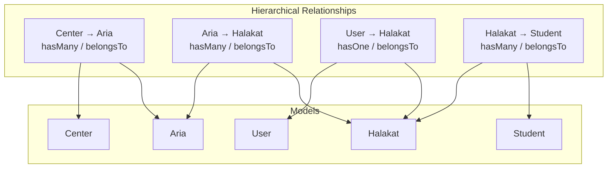
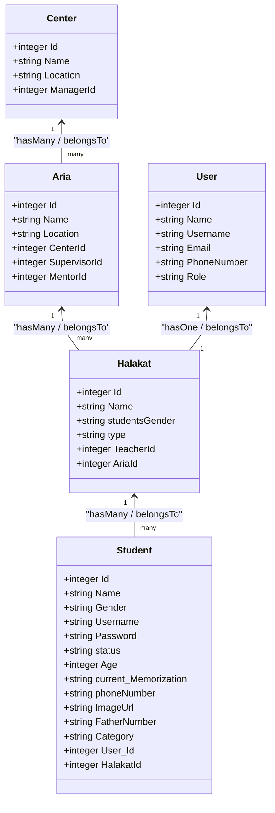
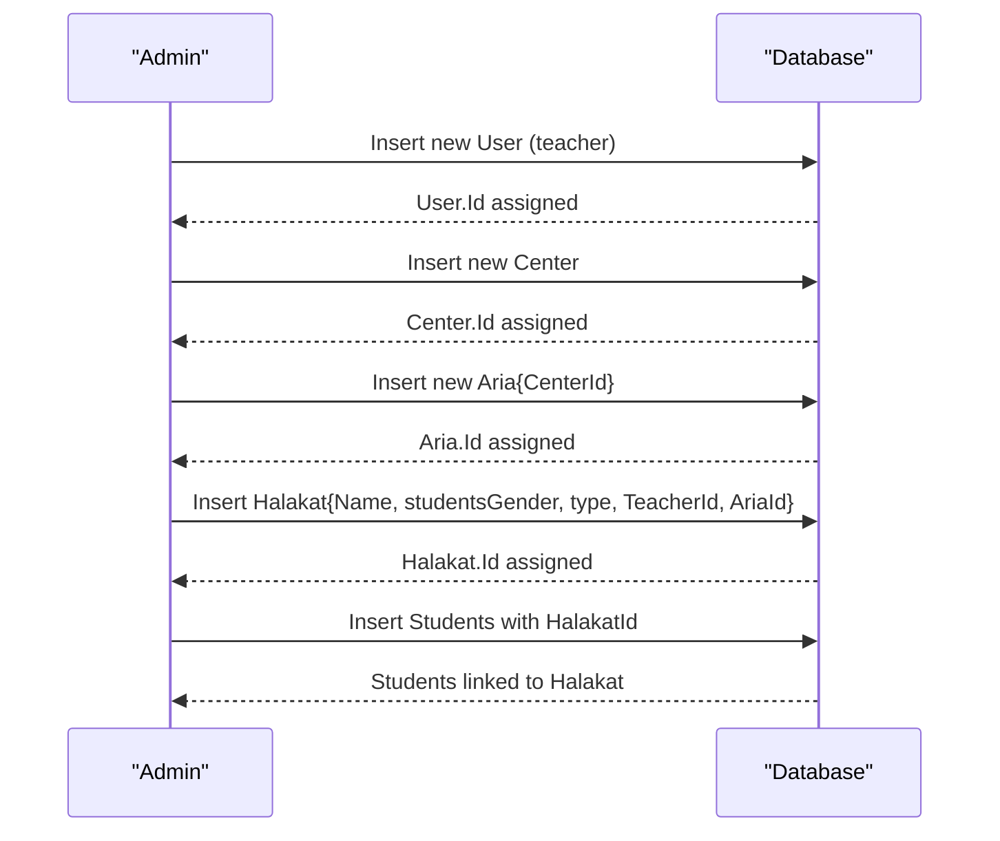
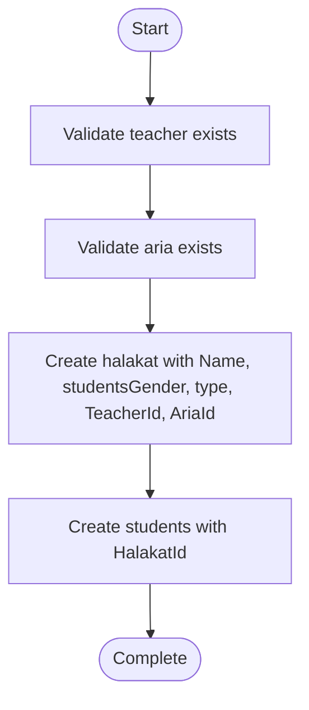
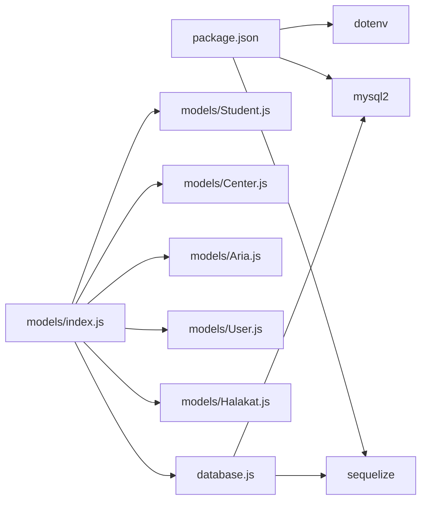

# Halakat Model

<cite>
**Referenced Files in This Document**
- [Halakat.js](file://backend/src/models/Halakat.js)
- [Aria.js](file://backend/src/models/Aria.js)
- [User.js](file://backend/src/models/User.js)
- [Center.js](file://backend/src/models/Center.js)
- [Student.js](file://backend/src/models/Student.js)
- [index.js](file://backend/src/models/index.js)
- [database.js](file://backend/src/config/database.js)
- [package.json](file://backend/package.json)
- [HalakatController.js](file://backend/src/controllers/HalakatController.js)
- [halaqatRouts.js](file://backend/src/routes/halaqatRouts.js)
</cite>

## Update Summary
**Changes Made**
- Updated relationship structure to reflect Halakat now belongs to Aria instead of directly to Center
- Added documentation for the new Aria model and its relationships
- Updated field definitions to reflect the current Halakat model structure
- Revised architectural diagrams to show the new three-tier hierarchy (Center → Aria → Halakat)
- Updated business logic examples to reflect the new organizational structure

## Table of Contents
1. [Introduction](#introduction)
2. [Project Structure](#project-structure)
3. [Core Components](#core-components)
4. [Architecture Overview](#architecture-overview)
5. [Detailed Component Analysis](#detailed-component-analysis)
6. [Dependency Analysis](#dependency-analysis)
7. [Performance Considerations](#performance-considerations)
8. [Troubleshooting Guide](#troubleshooting-guide)
9. [Conclusion](#conclusion)

## Introduction
This document provides comprehensive documentation for the Halakat model and its ecosystem within the Khirocom project. The model has evolved to support a three-tier hierarchical structure: Centers (institutions) → Areas (Arias) → Halakat groups (teaching classes). This documentation explains the data model, relationships with User (teacher), Aria (area/branch), and Student, and outlines the business logic for managing teaching groups/classes within this hierarchical framework.

## Project Structure
The backend follows a modular structure with models defined under backend/src/models. The Halakat model now participates in a three-tier relationship hierarchy: Center → Aria → Halakat. The model integrates with User (teacher), Aria (area/branch), and Student (learners) via associations defined centrally in the models index file. Database connectivity is configured via Sequelize using environment variables.

**Diagram sources**
- [index.js:16-31](file://backend/src/models/index.js#L16-L31)

**Section sources**
- [package.json:1-14](file://backend/package.json#L1-L14)
- [database.js:1-15](file://backend/src/config/database.js#L1-L15)
- [index.js:16-31](file://backend/src/models/index.js#L16-L31)

## Core Components
This section documents the Halakat model's fields, constraints, and its relationships with other models in the new hierarchical structure.

- Model identity and persistence
  - Model name: Halakat
  - Table name: halakat
  - Timestamps enabled: createdAt and updatedAt are managed automatically by Sequelize.

- Fields and validation rules
  - Id
    - Type: INTEGER
    - Constraints: primary key, auto-increment
    - Notes: Used as the unique identifier for halakat records.
  - Name
    - Type: STRING
    - Constraints: required (not null)
    - Purpose: Human-readable label for the halakat group.
  - studentsGender
    - Type: ENUM("ذكور","إناث")
    - Default: "ذكور"
    - Constraints: required (not null)
    - Purpose: Specifies the gender of students in the halakat group.
  - type
    - Type: ENUM("قراءة وكتاية","حفظ ومراجعة","إجازة","قراءات")
    - Default: "حفظ ومراجعة"
    - Constraints: required (not null)
    - Purpose: Classifies the type of halakat (reading/writing, memorization/review, vacation, readings).
  - TeacherId
    - Type: INTEGER
    - Constraints: required (not null)
    - Foreign key: references users.Id
    - Relationship: belongs to User (teacher)
  - AriaId
    - Type: INTEGER
    - Constraints: required (not null)
    - Foreign key: references arias.Id
    - Relationship: belongs to Aria (area/branch)

- Automatic timestamps
  - createdAt: managed automatically by Sequelize
  - updatedAt: managed automatically by Sequelize

- Business logic highlights
  - A halakat must be associated with a valid teacher (User) and a valid aria (Area).
  - Students are grouped under a halakat via a foreign key relationship.
  - The hierarchical structure allows for better organization and management of teaching groups within institutional centers.

**Section sources**
- [Halakat.js:6-51](file://backend/src/models/Halakat.js#L6-L51)

## Architecture Overview
The Halakat model now participates in a three-tier hierarchical relationship structure:
- One center (Center) can have many aria (Areas) (hasMany / belongsTo)
- One aria (Area) can have many halakat groups (hasMany / belongsTo)
- One teacher (User) per halakat (hasOne / belongsTo)
- Many students (Student) per halakat (hasMany / belongsTo)

**Diagram sources**
- [User.js:6-83](file://backend/src/models/User.js#L6-L83)
- [Center.js:6-39](file://backend/src/models/Center.js#L6-L39)
- [Aria.js:5-58](file://backend/src/models/Aria.js#L5-L58)
- [Halakat.js:6-51](file://backend/src/models/Halakat.js#L6-L51)
- [Student.js:6-105](file://backend/src/models/Student.js#L6-L105)

## Detailed Component Analysis

### Halakat Model Definition
- Initialization and schema
  - Uses Sequelize Model with explicit field definitions and constraints.
  - Table name and model name are set to halakat.
  - Timestamps enabled to track record creation and updates.

- Field-level validation and constraints
  - Name: required string.
  - studentsGender: required enum with values "ذكور" or "إناث".
  - type: required enum with values "قراءة وكتاية", "حفظ ومراجعة", "إجازة", or "قراءات".
  - TeacherId: required integer with foreign key reference to users.Id.
  - AriaId: required integer with foreign key reference to arias.Id.

- Associations
  - Belongs to User (teacher): TeacherId maps to users.Id.
  - Belongs to Aria (area/branch): AriaId maps to arias.Id.
  - Has many Students: Students reference halakat via HalakatId.

**Section sources**
- [Halakat.js:6-51](file://backend/src/models/Halakat.js#L6-L51)
- [index.js:29-31](file://backend/src/models/index.js#L29-L31)

### Relationship Mappings
- User (Teacher)
  - One-to-one mapping: a User can own one Halakat as a teacher.
  - Association direction: belongs to User via TeacherId.
- Aria (Area/Branch)
  - One-to-many mapping: an Aria can contain many Halakats.
  - Association direction: belongs to Aria via AriaId.
- Student (Learners)
  - One-to-many mapping: a Halakat contains many Students.
  - Association direction: belongs to Halakat via HalakatId.

**Diagram sources**
- [index.js:29-31](file://backend/src/models/index.js#L29-L31)
- [Halakat.js:36-43](file://backend/src/models/Halakat.js#L36-L43)
- [Student.js:81-88](file://backend/src/models/Student.js#L81-L88)

**Section sources**
- [index.js:29-31](file://backend/src/models/index.js#L29-L31)

### Teaching Group Management Workflow
- Creating a halakat group
  - Ensure a valid teacher (User) exists.
  - Ensure a valid aria (Area) exists.
  - Create a Halakat record with Name, studentsGender, type, TeacherId, and AriaId.
- Assigning a teacher
  - Set TeacherId to the Id of the target User.
- Assigning an aria (area/branch)
  - Set AriaId to the Id of the target Aria.
- Grouping students
  - Create Student records with HalakatId set to the newly created Halakat.Id.

### Data Integrity and Validation
- Required fields enforced at the database level via NOT NULL constraints.
- Foreign keys enforced via references to users.Id and arias.Id.
- The studentsCount field mentioned in previous documentation is no longer present in the current model structure.

**Section sources**
- [Halakat.js:13-27](file://backend/src/models/Halakat.js#L13-L27)
- [Halakat.js:36-43](file://backend/src/models/Halakat.js#L36-L43)
- [Student.js:81-88](file://backend/src/models/Student.js#L81-L88)

## Dependency Analysis
- Internal dependencies
  - Halakat depends on the database connection initialized in database.js.
  - Associations are defined in index.js and consumed by application logic.
- External dependencies
  - Sequelize ORM for data modeling and migrations.
  - MySQL dialect via mysql2 driver.
  - Environment configuration via dotenv.

**Diagram sources**
- [package.json:2-11](file://backend/package.json#L2-L11)
- [database.js:4-14](file://backend/src/config/database.js#L4-L14)
- [index.js:1-12](file://backend/src/models/index.js#L1-L12)

**Section sources**
- [package.json:2-11](file://backend/package.json#L2-L11)
- [database.js:4-14](file://backend/src/config/database.js#L4-L14)
- [index.js:1-12](file://backend/src/models/index.js#L1-L12)

## Performance Considerations
- Indexing recommendations
  - Add indexes on TeacherId and AriaId in the halakat table to optimize joins and filtering by teacher or aria.
  - Add indexes on HalakatId in the students table to accelerate queries retrieving students by halakat.
- Query optimization
  - Use eager loading (include) when fetching halakat with related User, Aria, and Student data to avoid N+1 queries.
- Data consistency
  - The hierarchical structure eliminates the need for manual studentsCount maintenance as it can be calculated dynamically.

## Troubleshooting Guide
- Common constraint violations
  - NotNull violation on Name, studentsGender, type, TeacherId, or AriaId.
  - Foreign key violation when TeacherId or AriaId references non-existent records.
  - Duplicate primary key or unique constraint errors if Id is manually supplied.
- Symptoms and resolutions
  - Error indicating foreign key constraint failure: verify that the referenced User.Id and Aria.Id exist prior to creating Halakat.
  - studentsCount field not found: this field is no longer part of the Halakat model structure.
- Logging and diagnostics
  - Enable Sequelize logging temporarily to inspect generated SQL and constraints.
  - Confirm environment variables for database connection are correctly loaded.

**Section sources**
- [Halakat.js:13-27](file://backend/src/models/Halakat.js#L13-L27)
- [index.js:29-31](file://backend/src/models/index.js#L29-L31)
- [database.js:4-14](file://backend/src/config/database.js#L4-L14)

## Conclusion
The Halakat model now defines a robust foundation for organizing teaching groups within a hierarchical structure: Centers → Areas → Halakat groups. This three-tier architecture enables more granular management of educational programs, allowing administrators to organize halakat groups by geographic areas or specialized branches within institutions. The model's associations with User, Aria, and Student enable structured management of halakat creation, teacher assignment, and student grouping within this hierarchical framework. By enforcing required fields and foreign keys, and by leveraging eager loading and indexing, the system supports reliable and efficient operations across the educational administration workflow.