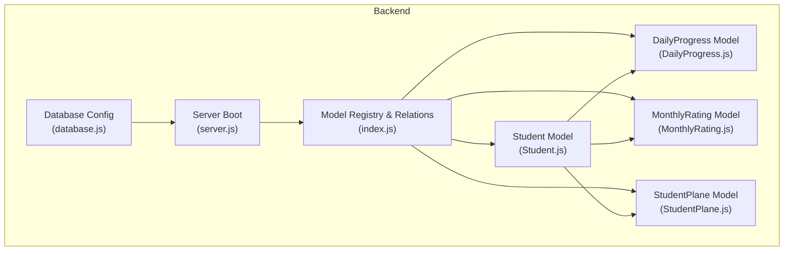
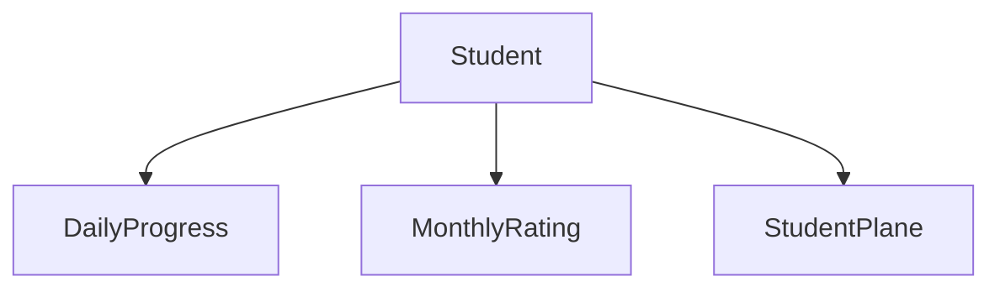
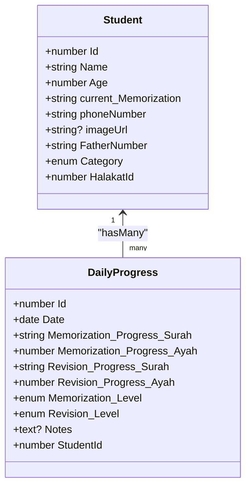
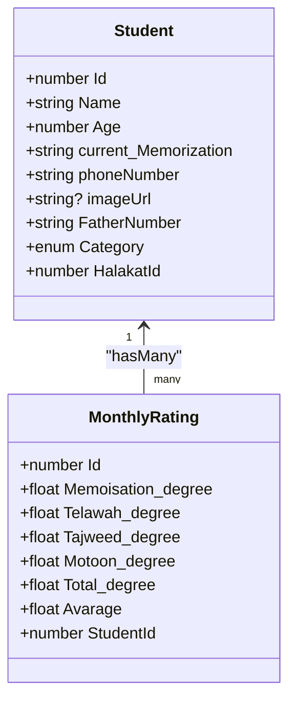
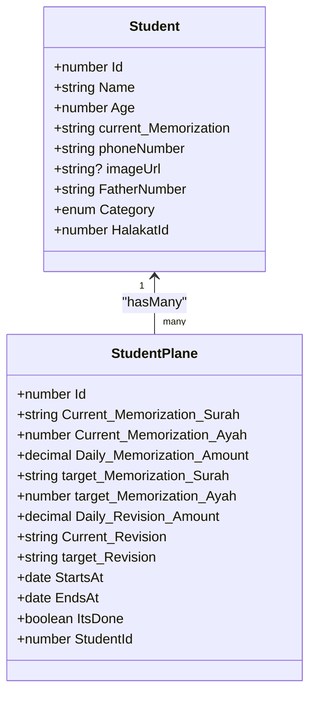
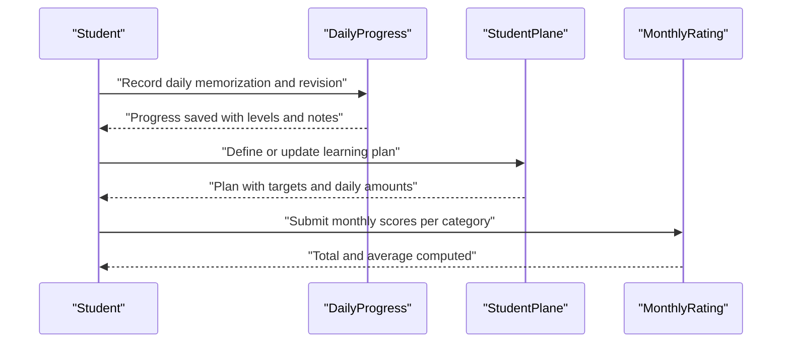
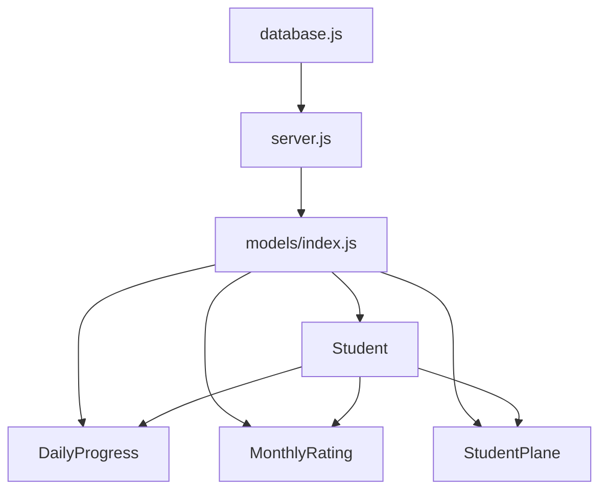

# Progress Tracking Models

<cite>
**Referenced Files in This Document**
- [DailyProgress.js](file://backend/src/models/DailyProgress.js)
- [MonthlyRating.js](file://backend/src/models/MonthlyRating.js)
- [StudentPlane.js](file://backend/src/models/StudentPlane.js)
- [Student.js](file://backend/src/models/Student.js)
- [index.js](file://backend/src/models/index.js)
- [server.js](file://backend/server.js)
- [database.js](file://backend/src/config/database.js)
</cite>

## Table of Contents
1. [Introduction](#introduction)
2. [Project Structure](#project-structure)
3. [Core Components](#core-components)
4. [Architecture Overview](#architecture-overview)
5. [Detailed Component Analysis](#detailed-component-analysis)
6. [Dependency Analysis](#dependency-analysis)
7. [Performance Considerations](#performance-considerations)
8. [Troubleshooting Guide](#troubleshooting-guide)
9. [Conclusion](#conclusion)

## Introduction
This document provides comprehensive documentation for the progress tracking models used in the academic tracking system. It focuses on three core models: DailyProgress, MonthlyRating, and StudentPlane. These models collectively support daily memorization progress recording, revision tracking, monthly performance evaluation, and learning plan management. Each model’s fields, relationships with the Student model, and business logic are explained to enable effective progress monitoring and reporting.

## Project Structure
The backend follows a modular structure with models defined under backend/src/models. The models are registered and associated via backend/src/models/index.js, which defines the relationships between entities. The server initializes the database connection and synchronizes models at startup.

**Diagram sources**
- [server.js:1-25](file://backend/server.js#L1-L25)
- [database.js:1-15](file://backend/src/config/database.js#L1-L15)
- [index.js:1-52](file://backend/src/models/index.js#L1-L52)
- [DailyProgress.js:1-64](file://backend/src/models/DailyProgress.js#L1-L64)
- [MonthlyRating.js:1-70](file://backend/src/models/MonthlyRating.js#L1-L70)
- [StudentPlane.js:1-76](file://backend/src/models/StudentPlane.js#L1-L76)
- [Student.js:1-67](file://backend/src/models/Student.js#L1-L67)

**Section sources**
- [server.js:1-25](file://backend/server.js#L1-L25)
- [database.js:1-15](file://backend/src/config/database.js#L1-L15)
- [index.js:1-52](file://backend/src/models/index.js#L1-L52)

## Core Components
This section documents the three progress tracking models and their fields, constraints, and relationships.

### DailyProgress Model
Purpose: Record daily memorization and revision progress for a student, including surah and ayah targets, levels, and optional notes.

Fields:
- Id: Integer, primary key, auto-increment.
- Date: Date, required.
- Memorization_Progress_Surah: String, required.
- Memorization_Progress_Ayah: Integer, required.
- Revision_Progress_Surah: String, required.
- Revision_Progress_Ayah: Integer, required.
- Memorization_Level: Enum with values ["ضعيف", "مقبول", "جيد", "جيد جدا", "ممتاز"], default "ضعيف".
- Revision_Level: Enum with values ["ضعيف", "مقبول", "جيد", "جيد جدا", "ممتاز"], default "ضعيف".
- Notes: Text, optional.
- StudentId: Integer, required, foreign key referencing students.Id.

Timestamps: CreatedAt and UpdatedAt are automatically managed.

Relationships:
- Belongs to Student via StudentId.
- Student has many DailyProgress entries.

Usage examples:
- Daily progress update: Create a record with Date, Memorization_Progress_Surah, Memorization_Progress_Ayah, Revision_Progress_Surah, Revision_Progress_Ayah, Memorization_Level, Revision_Level, and StudentId.
- Retrieve a student’s progress history: Query DailyProgress by StudentId.

**Section sources**
- [DailyProgress.js:1-64](file://backend/src/models/DailyProgress.js#L1-L64)
- [index.js:38-40](file://backend/src/models/index.js#L38-L40)

### MonthlyRating Model
Purpose: Evaluate a student’s monthly performance across multiple skill categories with validated numeric scores and computed totals and averages.

Fields:
- Id: Integer, primary key, auto-increment.
- Memoisation_degree: Float, required, validated 0–100.
- Telawah_degree: Float, required, validated 0–100.
- Tajweed_degree: Float, required, validated 0–60.
- Motoon_degree: Float, required, validated 0–400.
- Total_degree: Float, required.
- Avarage: Float, required.
- StudentId: Integer, required.
- Timestamps: CreatedAt and UpdatedAt.

Relationships:
- Belongs to Student via StudentId.
- Student has many MonthlyRating entries.

Business logic highlights:
- Score validation ensures values fall within defined ranges per category.
- Total_degree and Avarage are derived from individual category scores and should be computed during creation/update.
- Monthly aggregation supports performance trend analysis.

Usage examples:
- Monthly evaluation creation: Provide Memoisation_degree, Telawah_degree, Tajweed_degree, Motoon_degree, compute Total_degree and Avarage, and associate with StudentId.
- Retrieve monthly ratings for reporting: Query MonthlyRating by StudentId.

**Section sources**
- [MonthlyRating.js:1-70](file://backend/src/models/MonthlyRating.js#L1-L70)
- [index.js:30-32](file://backend/src/models/index.js#L30-L32)

### StudentPlane Model
Purpose: Define and track a student’s learning plan, including current and target memorization/revision milestones, daily amounts, and plan duration.

Fields:
- Id: Integer, primary key, auto-increment.
- Current_Memorization_Surah: String, required.
- Current_Memorization_Ayah: Integer, required.
- Daily_Memorization_Amount: Decimal(10,2), required.
- target_Memorization_Surah: String, required.
- target_Memorization_Ayah: Integer, required.
- Daily_Revision_Amount: Decimal(10,2), required.
- Current_Revision: String, required.
- target_Revision: String, required.
- StartsAt: Date, required.
- EndsAt: Date, required.
- ItsDone: Boolean, default false, required.
- StudentId: Integer, required, foreign key referencing students.Id.
- Timestamps: CreatedAt and UpdatedAt.

Relationships:
- Belongs to Student via StudentId.
- Student has many StudentPlane entries.

Business logic highlights:
- Plan lifecycle: StartsAt and EndsAt define the plan period; ItsDone indicates completion.
- Daily amounts drive progress toward targets; progress can be tracked against current vs target values.
- Completion tracking: Set ItsDone to true upon reaching targets and fulfilling plan criteria.

Usage examples:
- Learning plan creation: Provide current and target memorization/revision milestones, daily amounts, start/end dates, and StudentId.
- Plan completion tracking: Update ItsDone when targets are met and review plan effectiveness.

**Section sources**
- [StudentPlane.js:1-76](file://backend/src/models/StudentPlane.js#L1-L76)
- [index.js:34-36](file://backend/src/models/index.js#L34-L36)

## Architecture Overview
The models are part of a unified entity relationship graph centered around the Student model. Relationships are defined in the model registry and enable navigation from Student to its related progress records.

**Diagram sources**
- [index.js:30-40](file://backend/src/models/index.js#L30-L40)

## Detailed Component Analysis

### DailyProgress Analysis
DailyProgress captures granular daily progress with separate fields for memorization and revision, including surah identifiers and ayah counts, along with qualitative levels and optional notes. The model references Student via StudentId.

**Diagram sources**
- [DailyProgress.js:1-64](file://backend/src/models/DailyProgress.js#L1-L64)
- [Student.js:1-67](file://backend/src/models/Student.js#L1-L67)
- [index.js:38-40](file://backend/src/models/index.js#L38-L40)

Business logic examples:
- Progress recording: On each day, create a DailyProgress record with Date, memorization/revision surah and ayah, and levels.
- Revision tracking: Use Revision_Progress_Surah and Revision_Progress_Ayah to monitor re-study sessions.
- Notes: Optional field for teacher comments or observations.

### MonthlyRating Analysis
MonthlyRating aggregates monthly performance across four categories with strict value validations and computes total and average scores. It belongs to Student.

**Diagram sources**
- [MonthlyRating.js:1-70](file://backend/src/models/MonthlyRating.js#L1-L70)
- [Student.js:1-67](file://backend/src/models/Student.js#L1-L67)
- [index.js:30-32](file://backend/src/models/index.js#L30-L32)

Business logic examples:
- Rating calculations: Compute Total_degree and Avarage from category scores during creation or update.
- Validation: Enforce min/max bounds for each degree field to maintain consistent scoring.
- Performance evaluation: MonthlyRating enables comparative analysis and trend identification.

### StudentPlane Analysis
StudentPlane defines a structured learning plan with current and target milestones, daily amounts, and plan duration. It belongs to Student.

**Diagram sources**
- [StudentPlane.js:1-76](file://backend/src/models/StudentPlane.js#L1-L76)
- [Student.js:1-67](file://backend/src/models/Student.js#L1-L67)
- [index.js:34-36](file://backend/src/models/index.js#L34-L36)

Business logic examples:
- Plan creation: Define daily memorization and revision amounts, current and target milestones, and plan dates.
- Completion tracking: Mark ItsDone when targets are reached and plan criteria are fulfilled.
- Monitoring: Compare current vs target values to assess progress and adjust daily amounts.

### Academic Tracking Workflow
The models support a comprehensive academic tracking workflow:

[No sources needed since this diagram shows conceptual workflow, not actual code structure]

## Dependency Analysis
The model registry defines all relationships and ensures referential integrity. The server bootstraps the database connection and model synchronization.

**Diagram sources**
- [server.js:1-25](file://backend/server.js#L1-L25)
- [database.js:1-15](file://backend/src/config/database.js#L1-L15)
- [index.js:1-52](file://backend/src/models/index.js#L1-L52)

**Section sources**
- [index.js:1-52](file://backend/src/models/index.js#L1-L52)
- [server.js:1-25](file://backend/server.js#L1-L25)

## Performance Considerations
- Indexing: Consider adding database indexes on StudentId for DailyProgress, MonthlyRating, and StudentPlane to optimize queries by student.
- Aggregation: Precompute Total_degree and Avarage in the application layer to avoid repeated calculations.
- Batch operations: Use bulk insert/update for daily progress and monthly ratings to reduce round trips.
- Validation: Keep validations close to model definitions to prevent invalid data entry.

## Troubleshooting Guide
Common issues and resolutions:
- Foreign key constraint errors: Ensure StudentId exists in the Student table before creating DailyProgress, MonthlyRating, or StudentPlane records.
- Data type mismatches: Verify numeric fields (e.g., Daily_Memorization_Amount, Daily_Revision_Amount) match decimal precision and scale.
- Range violations: Confirm degree values fall within allowed ranges (Memoisation_degree and Telawah_degree 0–100; Tajweed_degree 0–60; Motoon_degree 0–400).
- Plan conflicts: Validate StartsAt and EndsAt for StudentPlane to avoid overlapping plans.

**Section sources**
- [MonthlyRating.js:15-50](file://backend/src/models/MonthlyRating.js#L15-L50)
- [StudentPlane.js:21-52](file://backend/src/models/StudentPlane.js#L21-L52)

## Conclusion
The DailyProgress, MonthlyRating, and StudentPlane models form a cohesive academic tracking system. They enable daily progress recording, monthly performance evaluation, and structured learning plan management while maintaining strong relationships with the Student model. By leveraging the defined fields, validations, and relationships, educators can effectively monitor and report student progress across multiple dimensions.