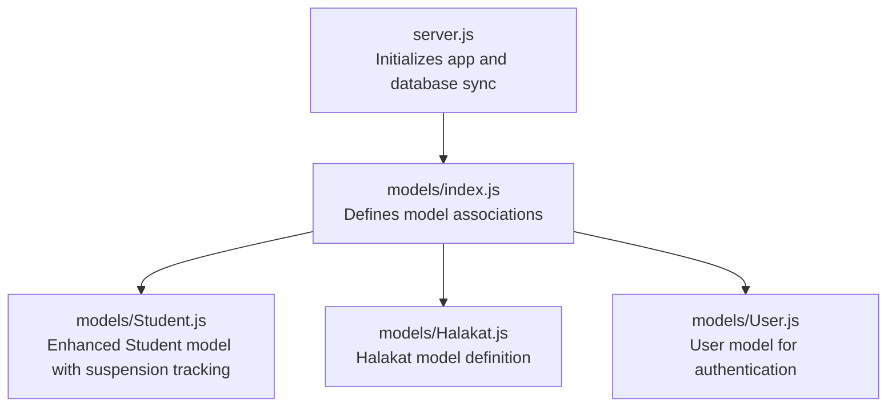
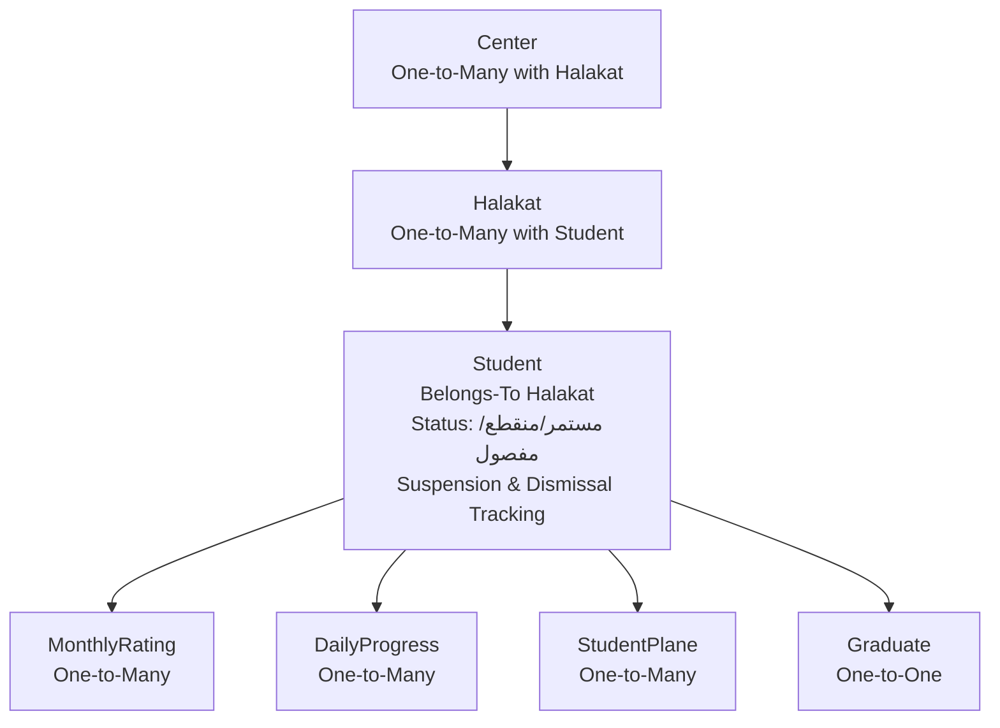
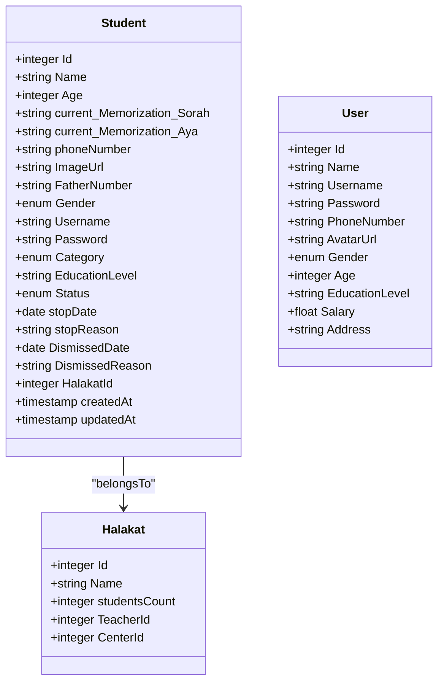
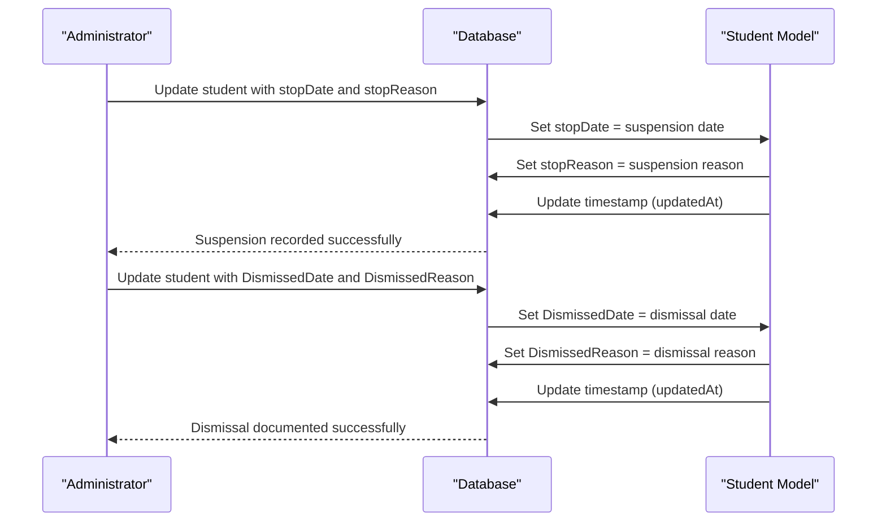
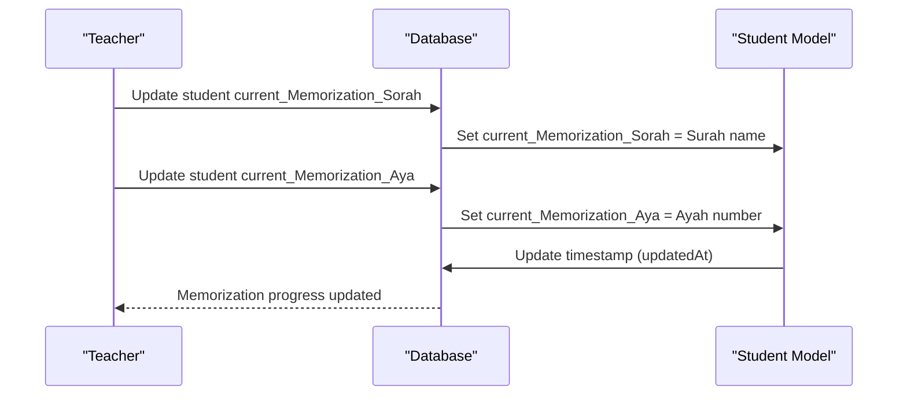
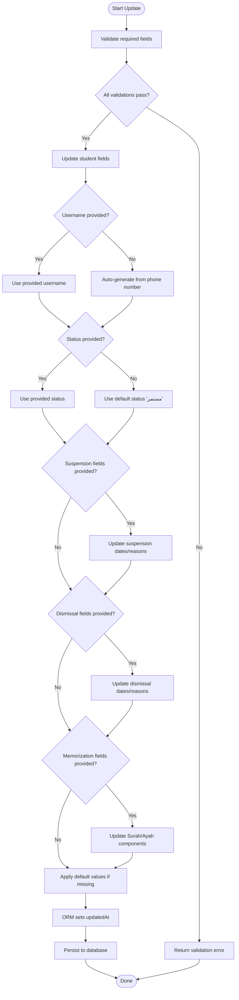
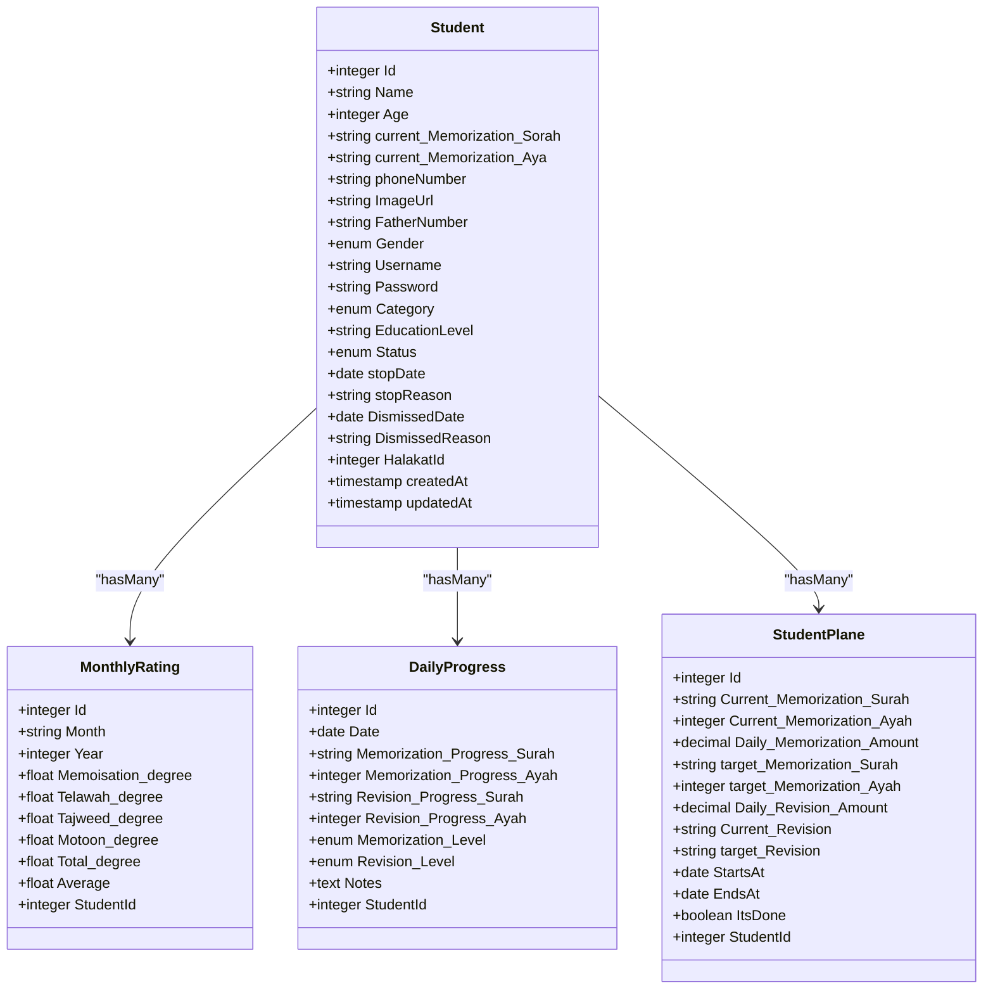
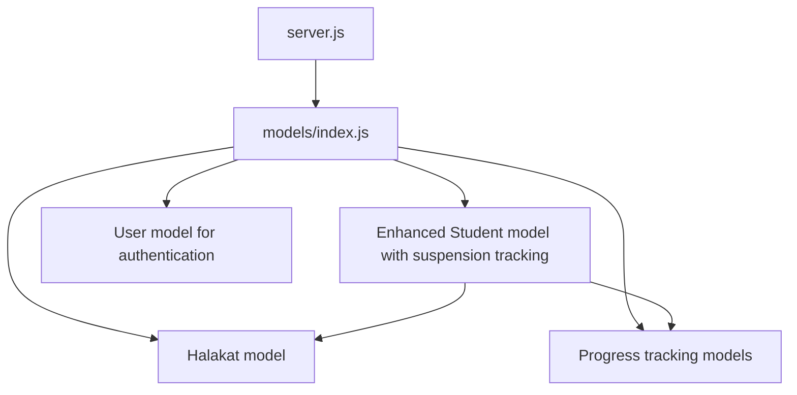

# Student Model

<cite>
**Referenced Files in This Document**
- [Student.js](file://backend/src/models/Student.js)
- [Halakat.js](file://backend/src/models/Halakat.js)
- [User.js](file://backend/src/models/User.js)
- [index.js](file://backend/src/models/index.js)
- [DailyProgress.js](file://backend/src/models/DailyProgress.js)
- [MonthlyRating.js](file://backend/src/models/MonthlyRating.js)
- [StudentPlane.js](file://backend/src/models/StudentPlane.js)
- [Graduate.js](file://backend/src/models/Graduate.js)
- [server.js](file://backend/server.js)
</cite>

## Update Summary
**Changes Made**
- Enhanced Student model with new suspension tracking fields: stopDate and stopReason for managing student suspension periods
- Added dismissal tracking fields: DismissedDate and DismissedReason for graduation/expulsion documentation
- Split current memorization field into granular components: current_Memorization_Sorah (Surah) and current_Memorization_Aya (Ayah) for precise Quranic memorization tracking
- Removed User_Id foreign key relationship, indicating shift away from direct user-student associations
- Updated field validation rules to accommodate new suspension and dismissal tracking capabilities
- Enhanced memorization tracking system with separate Surah and Ayah components

## Table of Contents
1. [Introduction](#introduction)
2. [Project Structure](#project-structure)
3. [Core Components](#core-components)
4. [Architecture Overview](#architecture-overview)
5. [Detailed Component Analysis](#detailed-component-analysis)
6. [Dependency Analysis](#dependency-analysis)
7. [Performance Considerations](#performance-considerations)
8. [Troubleshooting Guide](#troubleshooting-guide)
9. [Conclusion](#conclusion)

## Introduction
This document provides comprehensive documentation for the Student model within the educational management system. The model has been enhanced with new suspension and dismissal tracking capabilities, granular Quranic memorization tracking, and improved enrollment status management. The model maintains its core relationships with the Halakat model for class/group assignment while removing direct user associations, focusing on enrollment lifecycle management through comprehensive status tracking and academic progress monitoring.

## Project Structure
The backend follows a layered architecture with models defined via Sequelize ORM. The Student model resides under the models directory and participates in associations defined centrally in the models index file. The server initializes the database connection and model synchronization. The Student model now focuses on enrollment and academic tracking without direct user authentication relationships.

**Diagram sources**
- [server.js:1-26](file://backend/server.js#L1-L26)
- [index.js:1-87](file://backend/src/models/index.js#L1-L87)
- [Student.js:1-118](file://backend/src/models/Student.js#L1-L118)
- [User.js:1-84](file://backend/src/models/User.js#L1-L84)
- [Halakat.js:1-54](file://backend/src/models/Halakat.js#L1-L54)

**Section sources**
- [server.js:1-26](file://backend/server.js#L1-L26)
- [index.js:1-87](file://backend/src/models/index.js#L1-L87)

## Core Components
This section documents the enhanced Student model's fields, data types, validation rules, and business logic. The model now includes comprehensive suspension tracking, dismissal documentation, granular memorization components, and enhanced status management capabilities.

### Identity and Metadata
- **Id**: Integer, primary key, auto-incremented. Used as the unique identifier for each student record.
- **createdAt**: Timestamp automatically set upon creation.
- **updatedAt**: Timestamp automatically updated on record modification.

### Personal Information
- **Name**: String, required. Represents the student's full name.
- **Age**: Integer, required. Represents the student's age.
- **phoneNumber**: String, required. Represents the student's phone number.
- **FatherNumber**: String, required. Represents the father's phone number.
- **ImageUrl**: String, optional. Stores a URL to the student's avatar/image.
- **Gender**: Enum with values ["ذكر", "أنثى"], defaults to "ذكر", required. Arabic for "Male" and "Female".

### Academic and Enrollment Details
- **Username**: String, required. Automatic username generated from phone number if not provided.
- **Password**: String(256), defaults to "12345", required. Default password for new students.
- **Category**: Enum with expanded Arabic values including ["اطفال", "أقل من 5 أجزاء", "5 أجزاء", "10 أجزاء", "15 جزء", "20 جزء", "25 جزء", "المصجف كامل"], defaults to "أقل من 5 أجزاء", required. Comprehensive category system for different memorization levels.
- **EducationLevel**: String(256), required. Tracks the student's education level or qualification.

### Enhanced Status Tracking
- **status**: Enum with values ["مستمر", "منقطع", "مفصول"], defaults to "مستمر", required. Arabic for "Continuous", "Interrupted", and "Expelled" respectively. Provides comprehensive enrollment status tracking.

### Suspension and Dismissal Tracking
- **stopDate**: Date, optional. Tracks when a student's enrollment was suspended.
- **stopReason**: String, optional. Documents the reason for student suspension.
- **DismissedDate**: Date, optional. Tracks when a student was dismissed (graduated or expelled).
- **DismissedReason**: String, optional. Documents the reason for student dismissal.

### Granular Memorization Tracking
- **current_Memorization_Sorah**: String, required. Tracks the current Surah (chapter) being memorized.
- **current_Memorization_Aya**: String, required. Tracks the current Ayah (verse) within the Surah being memorized.

### Relationship Fields
- **HalakatId**: Integer, required. Foreign key referencing the halakat table's Id column, establishing the student's class/group assignment.

**Updated** Enhanced with comprehensive suspension tracking, dismissal documentation, granular memorization components, and improved status management capabilities.

Validation and Constraints
- All fields explicitly marked as required must not be null.
- The Category field enforces an expanded enumerated set of Arabic values representing different memorization levels.
- The Gender field enforces an enumerated set of Arabic values for male/female identification.
- The status field enforces an enumerated set of Arabic values for enrollment status tracking.
- The HalakatId field references the halakat table's Id column, ensuring referential integrity at the database level.
- Timestamps (createdAt, updatedAt) are managed automatically by the ORM.
- Hooks automatically generate usernames from phone numbers when not provided.
- Suspension and dismissal fields are optional, allowing flexible enrollment lifecycle tracking.

Business Logic
- **Student Registration**: On creation, required fields must be provided. The Category field defaults to "أقل من 5 أجزاء" if not specified. The Gender field defaults to "ذكر". The status field defaults to "مستمر". The Password field defaults to "12345". The Username is automatically generated from the phone number if not provided.
- **Suspension Management**: Students can be marked as suspended with stopDate and stopReason fields. These fields are optional and allow for flexible suspension documentation.
- **Dismissal Tracking**: Students can be tracked as dismissed with DismissedDate and DismissedReason fields for graduation or expulsion documentation.
- **Memorization Progress**: The model tracks Quranic memorization through separate Surah and Ayah components for precise progress monitoring.
- **Profile Management**: Updates modify personal, academic, and status details while preserving the Halakat association unless reassignment is intended.
- **Class Assignment**: Assigning a student to a Halakat involves setting or updating the HalakatId to an existing group's Id.
- **Status Management**: Students can transition between enrollment statuses using the status field with values "مستمر" (continuous), "منقطع" (interrupted), or "مفصول" (expelled).

**Section sources**
- [Student.js:6-118](file://backend/src/models/Student.js#L6-L118)

## Architecture Overview
The enhanced Student model participates in a comprehensive educational structure with integrated enrollment lifecycle management and academic tracking:
- Educational Center (Center) hosts multiple Halakat groups.
- Each Halakat contains multiple Students with distinct enrollment statuses and suspension/dismissal tracking.
- Students are associated with progress tracking models (MonthlyRating, DailyProgress) and plans (StudentPlane).
- The model maintains relationships with the Halakat model for class/group assignment.
- Status tracking enables comprehensive enrollment lifecycle management including suspension and dismissal documentation.
- Granular memorization tracking supports precise Quranic learning progress monitoring.

**Diagram sources**
- [index.js:41-68](file://backend/src/models/index.js#L41-L68)
- [Student.js:94-101](file://backend/src/models/Student.js#L94-L101)
- [Halakat.js:28-35](file://backend/src/models/Halakat.js#L28-L35)
- [Graduate.js:17-26](file://backend/src/models/Graduate.js#L17-L26)

**Section sources**
- [index.js:41-68](file://backend/src/models/index.js#L41-L68)

## Detailed Component Analysis
This section provides a deep dive into the enhanced Student model, its relationships, and operational flows with the new suspension tracking, dismissal documentation, and granular memorization capabilities.

### Enhanced Student Model Definition
The Student model now defines an enhanced schema for student records with comprehensive suspension tracking, dismissal documentation, granular memorization components, and status management capabilities. The model includes identity, personal details, academic attributes, enrollment status tracking, suspension/dismissal documentation, and the foreign key to Halakat.

**Diagram sources**
- [Student.js:6-118](file://backend/src/models/Student.js#L6-L118)
- [User.js:6-84](file://backend/src/models/User.js#L6-L84)
- [Halakat.js:6-54](file://backend/src/models/Halakat.js#L6-L54)

**Section sources**
- [Student.js:6-118](file://backend/src/models/Student.js#L6-L118)
- [User.js:6-84](file://backend/src/models/User.js#L6-L84)
- [Halakat.js:6-54](file://backend/src/models/Halakat.js#L6-L54)

### Enhanced Suspension and Dismissal Management Operations
The following sequence illustrates how student suspension and dismissal are managed throughout their academic journey:

**Diagram sources**
- [Student.js:38-55](file://backend/src/models/Student.js#L38-L55)

### Enhanced Granular Memorization Tracking Operations
The following sequence demonstrates how Quranic memorization progress is tracked with separate Surah and Ayah components:

**Diagram sources**
- [Student.js:60-67](file://backend/src/models/Student.js#L60-L67)

### Enhanced Profile Update Flow
Updating a student's profile with the enhanced model involves modifying personal, academic, status, and tracking fields while maintaining relationships:

**Diagram sources**
- [Student.js:108-116](file://backend/src/models/Student.js#L108-L116)
- [Student.js:32-37](file://backend/src/models/Student.js#L32-L37)
- [Student.js:38-55](file://backend/src/models/Student.js#L38-L55)
- [Student.js:60-67](file://backend/src/models/Student.js#L60-L67)

### Enhanced Progress Tracking Relationships
Students are linked to progress tracking models with comprehensive academic monitoring capabilities and status-aware reporting:

**Diagram sources**
- [index.js:45-55](file://backend/src/models/index.js#L45-L55)
- [MonthlyRating.js:6-70](file://backend/src/models/MonthlyRating.js#L6-L70)
- [DailyProgress.js:6-64](file://backend/src/models/DailyProgress.js#L6-L64)
- [StudentPlane.js:6-76](file://backend/src/models/StudentPlane.js#L6-L76)

**Section sources**
- [index.js:45-55](file://backend/src/models/index.js#L45-L55)

## Dependency Analysis
The enhanced Student model depends on the database connection and participates in expanded associations defined in the models index. The model maintains associations with progress tracking models and the Halakat model for class assignment, while removing direct user authentication relationships.

**Diagram sources**
- [server.js:1-26](file://backend/server.js#L1-L26)
- [index.js:1-87](file://backend/src/models/index.js#L1-L87)
- [Student.js:94-101](file://backend/src/models/Student.js#L94-L101)

**Section sources**
- [server.js:1-26](file://backend/server.js#L1-L26)
- [index.js:1-87](file://backend/src/models/index.js#L1-L87)

## Performance Considerations
- **Indexing**: Ensure foreign keys (HalakatId) and frequently queried fields (Name, Category, Gender, Username, Status, stopDate, DismissedDate) are indexed to optimize joins and filters.
- **Association Loading**: Use eager loading for associations (including Halakat details, and status-aware queries) to avoid N+1 queries during enrollment or reporting.
- **Validation Preprocessing**: Validate inputs early to reduce database round trips and constraint violations.
- **Batch Operations**: For bulk enrollments, batch insertions improve throughput while maintaining referential integrity and status consistency.
- **Hook Optimization**: The automatic username generation hook runs efficiently during creation but should be monitored for performance in high-volume scenarios.
- **Default Values**: Comprehensive default value assignments reduce database overhead and ensure data consistency, including the new status field default.
- **Status Querying**: Status-based filtering and reporting should utilize proper indexing on the status field for optimal performance.
- **Tracking Field Optimization**: Suspension and dismissal tracking fields are optional, reducing storage overhead for students without these records.

## Troubleshooting Guide
Common issues and resolutions with the enhanced Student model:
- **Foreign Key Constraint Violation**: Occurs when HalakatId references a non-existent record. Ensure the target Halakat exists before assigning.
- **Required Field Missing**: Creation fails if any required field (Name, Age, phoneNumber, FatherNumber, current_Memorization_Sorah, current_Memorization_Aya, Gender, Category, EducationLevel, Status) is omitted. Provide all required fields including the new memorization components.
- **Category Value Not Allowed**: Only the expanded enumerated Arabic values are accepted. Use one of the allowed categories including "اطفال", "أقل من 5 أجزاء", "5 أجزاء", etc.
- **Gender Value Not Allowed**: Only "ذكر" or "أنثى" are accepted. Use Arabic values for male/female identification.
- **Status Value Not Allowed**: Only "مستمر", "منقطع", or "مفصول" are accepted. Use Arabic values for enrollment status tracking.
- **Username Generation Issues**: If Username is not provided, it should auto-generate from phoneNumber. Verify phone number format and uniqueness.
- **Password Security**: Default password "12345" should be changed immediately after first login. Monitor for security compliance.
- **Timestamps Not Updating**: Verify that the ORM-managed timestamps are enabled and not overridden by manual updates.
- **Suspension Tracking Issues**: Suspension fields (stopDate, stopReason) are optional. Ensure proper date formatting and reason documentation.
- **Dismissal Tracking Issues**: Dismissal fields (DismissedDate, DismissedReason) are optional. Use for graduation or expulsion documentation.
- **Memorization Tracking Issues**: Ensure both current_Memorization_Sorah and current_Memorization_Aya are provided for accurate progress tracking.
- **Class Assignment Issues**: Verify that HalakatId corresponds to an existing Halakat record for proper class assignment.

**Section sources**
- [Student.js:94-101](file://backend/src/models/Student.js#L94-L101)
- [Student.js:32-37](file://backend/src/models/Student.js#L32-L37)
- [Student.js:38-55](file://backend/src/models/Student.js#L38-L55)
- [Student.js:60-67](file://backend/src/models/Student.js#L60-L67)
- [Student.js:108-116](file://backend/src/models/Student.js#L108-L116)

## Conclusion
The enhanced Student model encapsulates comprehensive student data with Arabic field names, enforces validation and referential integrity through Sequelize, and integrates seamlessly with the Halakat model for class assignment. The model's relationships with Halakat establish a clear hierarchy within educational centers, while associations with progress tracking models support comprehensive student management. The addition of suspension tracking (stopDate, stopReason), dismissal documentation (DismissedDate, DismissedReason), and granular memorization components (current_Memorization_Sorah, current_Memorization_Aya) provides robust enrollment lifecycle management capabilities. The removal of direct user associations indicates a shift toward separation of concerns, focusing on enrollment and academic tracking rather than authentication integration. By adhering to the documented validation rules, leveraging the enhanced relationships, utilizing the automatic username generation feature, implementing proper suspension and dismissal tracking workflows, and maintaining granular memorization documentation, the system ensures robust student enrollment, profile management, class assignment workflows, comprehensive enrollment status tracking, and precise academic progress monitoring across the educational platform.