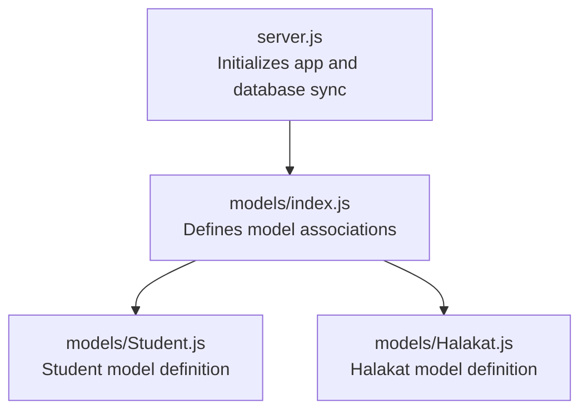
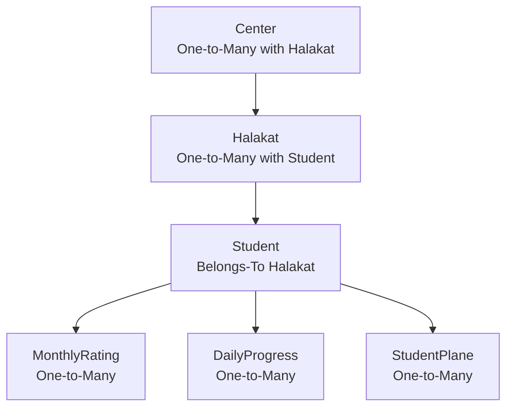
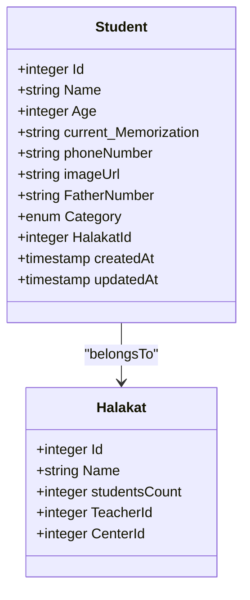
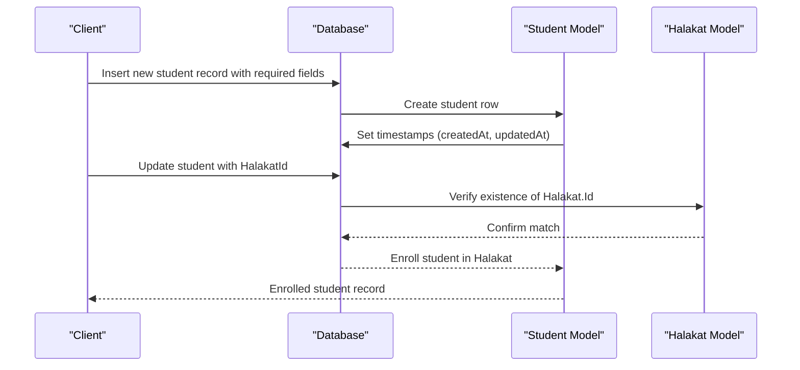
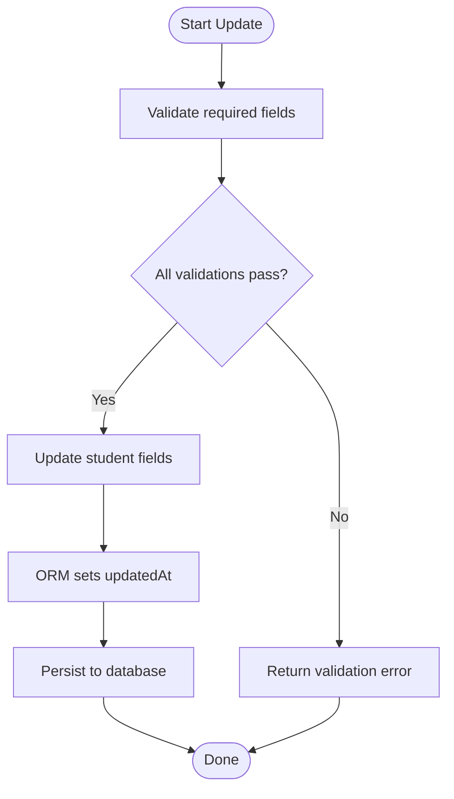
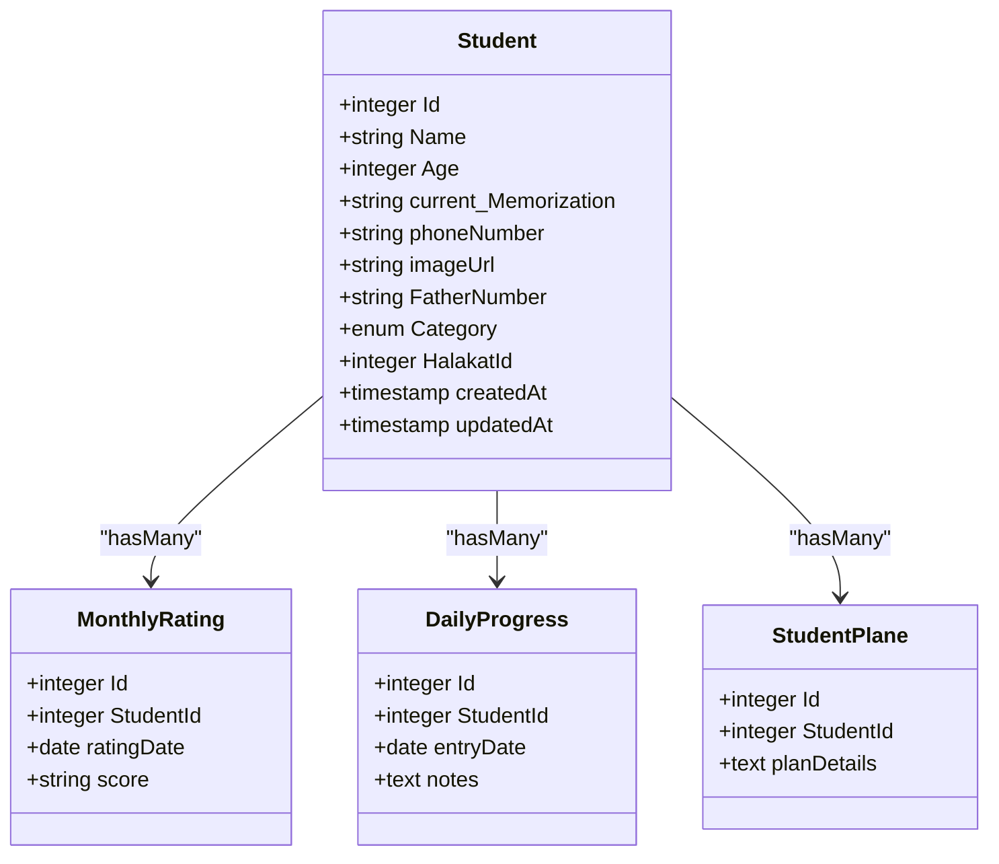
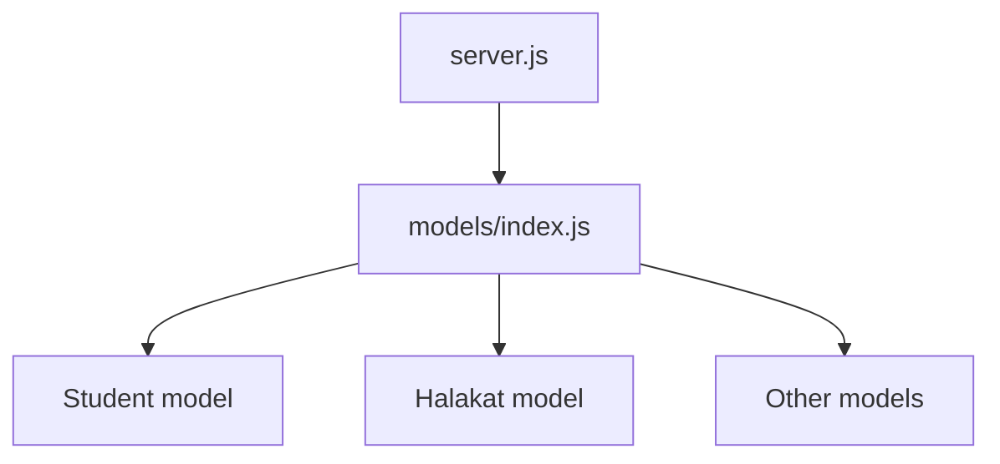

# Student Model

<cite>
**Referenced Files in This Document**
- [Student.js](file://backend/src/models/Student.js)
- [Halakat.js](file://backend/src/models/Halakat.js)
- [index.js](file://backend/src/models/index.js)
- [server.js](file://backend/server.js)
</cite>

## Table of Contents
1. [Introduction](#introduction)
2. [Project Structure](#project-structure)
3. [Core Components](#core-components)
4. [Architecture Overview](#architecture-overview)
5. [Detailed Component Analysis](#detailed-component-analysis)
6. [Dependency Analysis](#dependency-analysis)
7. [Performance Considerations](#performance-considerations)
8. [Troubleshooting Guide](#troubleshooting-guide)
9. [Conclusion](#conclusion)

## Introduction
This document provides comprehensive documentation for the Student model within the educational management system. It explains the data structure, validation rules, relationships with the Halakat model (class/group assignment), and the broader hierarchical structure within educational centers. It also outlines the business logic for student registration and profile management, including enrollment and class assignment operations.

## Project Structure
The backend follows a layered architecture with models defined via Sequelize ORM. The Student model resides under the models directory and participates in associations defined centrally in the models index file. The server initializes the database connection and model synchronization.

**Diagram sources**
- [server.js:1-25](file://backend/server.js#L1-L25)
- [index.js:1-52](file://backend/src/models/index.js#L1-L52)
- [Student.js:1-67](file://backend/src/models/Student.js#L1-L67)
- [Halakat.js:1-47](file://backend/src/models/Halakat.js#L1-L47)

**Section sources**
- [server.js:1-25](file://backend/server.js#L1-L25)
- [index.js:1-52](file://backend/src/models/index.js#L1-L52)

## Core Components
This section documents the Student model’s fields, data types, validation rules, and business logic. It also explains the relationship with the Halakat model and how the model integrates into the educational hierarchy.

- Identity and Metadata
  - Id: Integer, primary key, auto-incremented. Used as the unique identifier for each student record.
  - createdAt: Timestamp automatically set upon creation.
  - updatedAt: Timestamp automatically updated on record modification.

- Personal Information
  - Name: String, required. Represents the student’s full name.
  - Age: Integer, required. Represents the student’s age.
  - phoneNumber: String, required. Represents the student’s phone number.
  - FatherNumber: String, required. Represents the father’s phone number.
  - imageUrl: String, optional. Stores a URL to the student’s avatar/image.

- Academic and Enrollment Details
  - current_Memorization: String, required. Tracks the student’s current memorization level or status.
  - Category: Enum with values ["child","5_parts","10_parts","15_parts","20_parts","25_parts","30_parts"], defaults to "child", required. Indicates the student’s category or level within the program.

- Relationship Fields
  - HalakatId: Integer, required. Foreign key referencing the Id field in the halakat table, establishing the student’s class/group assignment.

Validation and Constraints
- All fields explicitly marked as required must not be null.
- The Category field enforces an enumerated set of allowed values.
- The HalakatId field references the halakat table’s Id column, ensuring referential integrity at the database level.
- Timestamps (createdAt, updatedAt) are managed automatically by the ORM.

Business Logic
- Student Registration: On creation, required fields must be provided. The Category field defaults to "child" if not specified. The HalakatId must correspond to an existing Halakat record.
- Profile Management: Updates modify personal and academic details while preserving the Halakat association unless reassignment is intended.
- Enrollment and Class Assignment: Assigning a student to a Halakat involves setting or updating the HalakatId to an existing group’s Id.

**Section sources**
- [Student.js:6-65](file://backend/src/models/Student.js#L6-L65)

## Architecture Overview
The Student model participates in a hierarchical educational structure:
- Educational Center (Center) hosts multiple Halakat groups.
- Each Halakat contains multiple Students.
- Students are associated with progress tracking models (MonthlyRating, DailyProgress) and plans (StudentPlane).

**Diagram sources**
- [index.js:22-40](file://backend/src/models/index.js#L22-L40)
- [Student.js:50-57](file://backend/src/models/Student.js#L50-L57)
- [Halakat.js:29-36](file://backend/src/models/Halakat.js#L29-L36)

**Section sources**
- [index.js:12-41](file://backend/src/models/index.js#L12-L41)

## Detailed Component Analysis
This section provides a deep dive into the Student model, its relationships, and operational flows.

### Student Model Definition
The Student model defines the schema for student records, including identity, personal details, enrollment attributes, and the foreign key to Halakat. Associations are declared centrally to maintain consistency and enforce referential integrity.

**Diagram sources**
- [Student.js:6-65](file://backend/src/models/Student.js#L6-L65)
- [Halakat.js:6-44](file://backend/src/models/Halakat.js#L6-L44)
- [index.js:26-28](file://backend/src/models/index.js#L26-L28)

**Section sources**
- [Student.js:6-65](file://backend/src/models/Student.js#L6-L65)
- [Halakat.js:6-44](file://backend/src/models/Halakat.js#L6-L44)
- [index.js:26-28](file://backend/src/models/index.js#L26-L28)

### Enrollment and Class Assignment Operations
The following sequence illustrates how a student is enrolled and assigned to a Halakat:

**Diagram sources**
- [Student.js:50-57](file://backend/src/models/Student.js#L50-L57)
- [Halakat.js:8-12](file://backend/src/models/Halakat.js#L8-L12)
- [index.js:26-28](file://backend/src/models/index.js#L26-L28)

### Profile Update Flow
Updating a student’s profile involves modifying personal and academic fields while maintaining the Halakat association:

**Diagram sources**
- [Student.js:13-49](file://backend/src/models/Student.js#L13-L49)

### Progress Tracking Relationships
Students are linked to progress tracking models, enabling monthly ratings and daily progress entries:

**Diagram sources**
- [index.js:30-40](file://backend/src/models/index.js#L30-L40)

**Section sources**
- [index.js:30-40](file://backend/src/models/index.js#L30-L40)

## Dependency Analysis
The Student model depends on the database connection and participates in associations defined in the models index. The server orchestrates database initialization and model synchronization.

**Diagram sources**
- [server.js:1-25](file://backend/server.js#L1-L25)
- [index.js:1-52](file://backend/src/models/index.js#L1-L52)

**Section sources**
- [server.js:1-25](file://backend/server.js#L1-L25)
- [index.js:1-52](file://backend/src/models/index.js#L1-L52)

## Performance Considerations
- Indexing: Ensure foreign keys (e.g., HalakatId) and frequently queried fields (Name, Category) are indexed to optimize joins and filters.
- Association Loading: Use eager loading for associations (e.g., including Halakat details) to avoid N+1 queries during enrollment or reporting.
- Validation Preprocessing: Validate inputs early to reduce database round trips and constraint violations.
- Batch Operations: For bulk enrollments, batch insertions improve throughput while maintaining referential integrity.

## Troubleshooting Guide
Common issues and resolutions:
- Foreign Key Constraint Violation: Occurs when HalakatId references a non-existent Halakat. Ensure the target Halakat exists before assigning.
- Required Field Missing: Creation fails if any required field (Name, Age, phoneNumber, FatherNumber, current_Memorization, HalakatId) is omitted. Provide all required fields.
- Category Value Not Allowed: Only enumerated values are accepted. Use one of the allowed categories.
- Timestamps Not Updating: Verify that the ORM-managed timestamps are enabled and not overridden by manual updates.

**Section sources**
- [Student.js:50-57](file://backend/src/models/Student.js#L50-L57)
- [Student.js:38-48](file://backend/src/models/Student.js#L38-L48)

## Conclusion
The Student model encapsulates essential student data and enforces validation and referential integrity through Sequelize. Its relationships with Halakat establish a clear hierarchy within educational centers, while associations with progress tracking models support comprehensive student management. By adhering to the documented validation rules and leveraging the defined relationships, the system ensures robust student enrollment, profile management, and class assignment workflows.