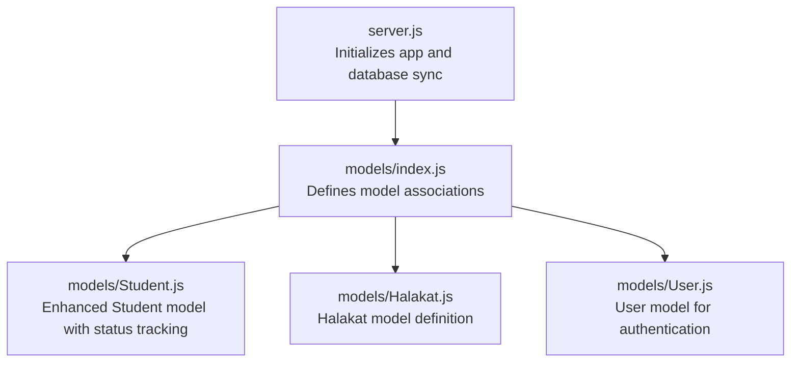
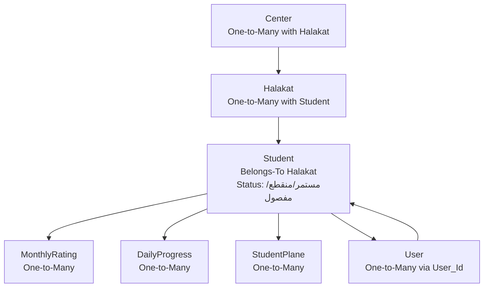
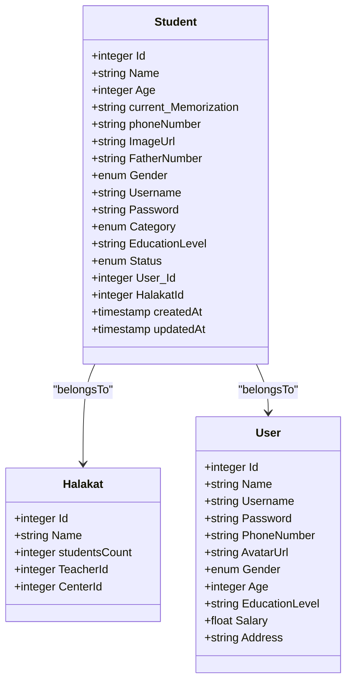
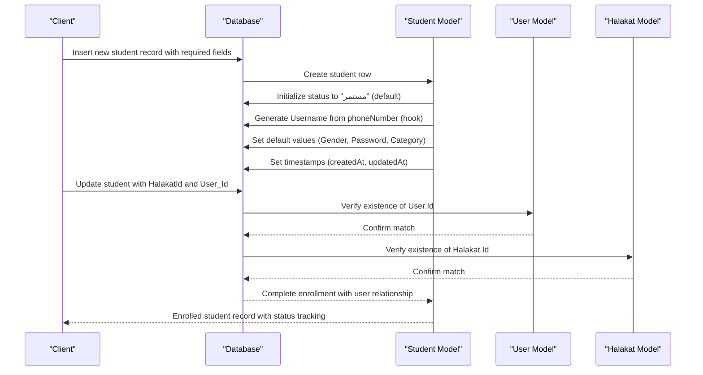
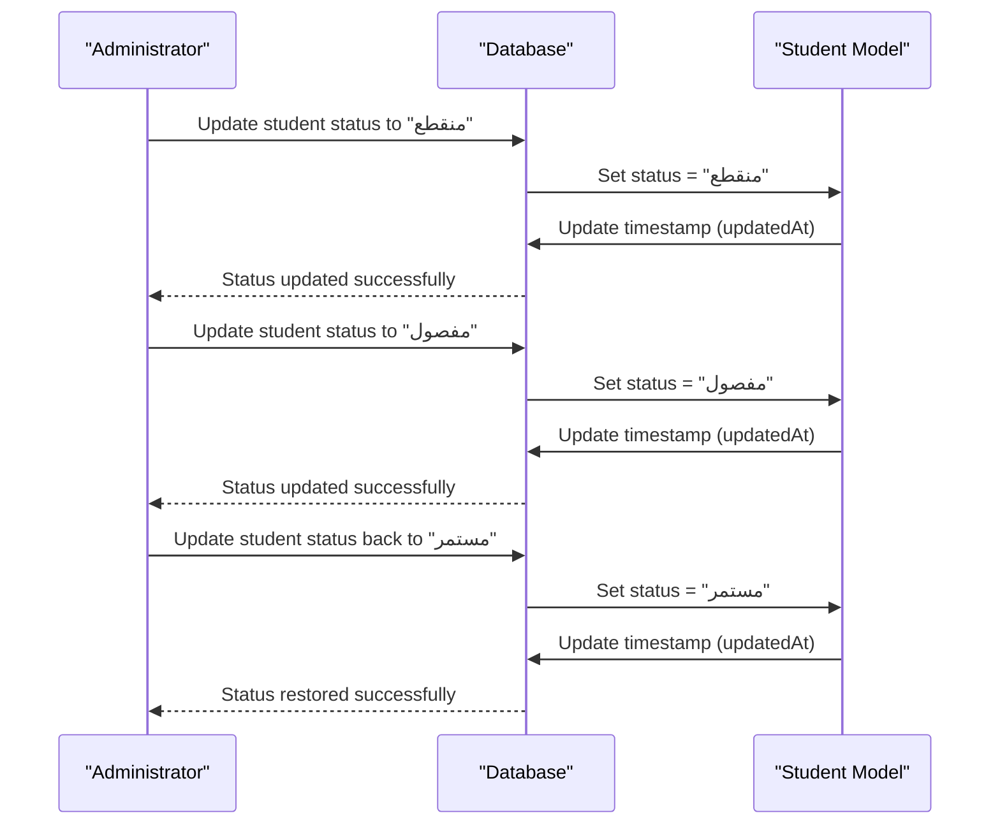
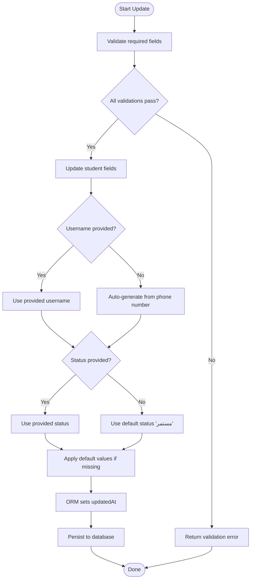
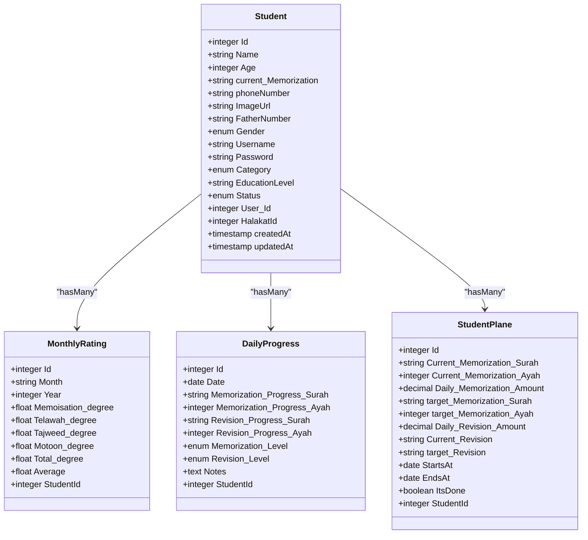
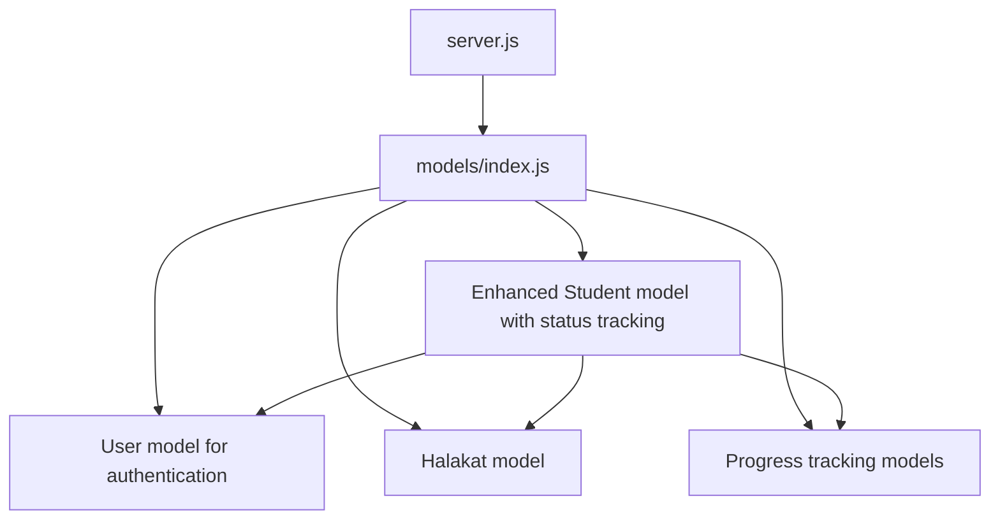

# Student Model

<cite>
**Referenced Files in This Document**
- [Student.js](file://backend/src/models/Student.js)
- [Halakat.js](file://backend/src/models/Halakat.js)
- [User.js](file://backend/src/models/User.js)
- [index.js](file://backend/src/models/index.js)
- [DailyProgress.js](file://backend/src/models/DailyProgress.js)
- [MonthlyRating.js](file://backend/src/models/MonthlyRating.js)
- [StudentPlane.js](file://backend/src/models/StudentPlane.js)
- [server.js](file://backend/server.js)
</cite>

## Update Summary
**Changes Made**
- Added new status field with ENUM values (مستمر, منقطع, مفصول) for comprehensive student enrollment status tracking
- Enhanced student enrollment status management with Arabic values for continuous, interrupted, and expelled students
- Updated field validation rules to include the new status field with required constraints
- Maintained backward compatibility with existing student data and relationships

## Table of Contents
1. [Introduction](#introduction)
2. [Project Structure](#project-structure)
3. [Core Components](#core-components)
4. [Architecture Overview](#architecture-overview)
5. [Detailed Component Analysis](#detailed-component-analysis)
6. [Dependency Analysis](#dependency-analysis)
7. [Performance Considerations](#performance-considerations)
8. [Troubleshooting Guide](#troubleshooting-guide)
9. [Conclusion](#conclusion)

## Introduction
This document provides comprehensive documentation for the Student model within the educational management system. The model now includes a new status field with Arabic ENUM values (مستمر, منقطع, مفصول) for enhanced enrollment status tracking, along with comprehensive validation rules, relationships with the Halakat model (class/group assignment), and the broader hierarchical structure within educational centers. The model maintains its existing relationships with the User model for authentication and user management while adding robust status tracking capabilities.

## Project Structure
The backend follows a layered architecture with models defined via Sequelize ORM. The Student model resides under the models directory and participates in associations defined centrally in the models index file. The server initializes the database connection and model synchronization. The Student model maintains its enhanced relationships with the User model for authentication and user management, now including comprehensive status tracking.

**Diagram sources**
- [server.js:1-25](file://backend/server.js#L1-L25)
- [index.js:1-91](file://backend/src/models/index.js#L1-L91)
- [Student.js:1-105](file://backend/src/models/Student.js#L1-L105)
- [User.js:1-83](file://backend/src/models/User.js#L1-L83)
- [Halakat.js:1-54](file://backend/src/models/Halakat.js#L1-L54)

**Section sources**
- [server.js:1-25](file://backend/server.js#L1-L25)
- [index.js:1-91](file://backend/src/models/index.js#L1-L91)

## Core Components
This section documents the enhanced Student model's fields, data types, validation rules, and business logic. The model now includes comprehensive Arabic field names, default value assignments, user relationship management, and the new status tracking field.

### Identity and Metadata
- **Id**: Integer, primary key, auto-incremented. Used as the unique identifier for each student record.
- **createdAt**: Timestamp automatically set upon creation.
- **updatedAt**: Timestamp automatically updated on record modification.

### Personal Information with Arabic Field Names
- **Name**: String, required. Represents the student's full name in Arabic.
- **Age**: Integer, required. Represents the student's age.
- **phoneNumber**: String, required. Represents the student's phone number.
- **FatherNumber**: String, required. Represents the father's phone number.
- **ImageUrl**: String, optional. Stores a URL to the student's avatar/image.
- **Gender**: Enum with values ["ذكر", "أنثى"], defaults to "ذكر", required. Arabic for "Male" and "Female".

### Status Tracking
- **status**: Enum with values ["مستمر", "منقطع", "مفصول"], defaults to "مستمر", required. Arabic for "Continuous", "Interrupted", and "Expelled" respectively. Provides comprehensive enrollment status tracking.

### Authentication and User Management
- **Username**: String, required. Automatic username generated from phone number if not provided.
- **Password**: String(256), defaults to "12345", required. Default password for new students.
- **User_Id**: Integer, required. Foreign key referencing the users table, establishing user relationship.

### Academic and Enrollment Details
- **current_Memorization**: String, required. Tracks the student's current memorization level or status.
- **Category**: Enum with expanded Arabic values including ["اطفال", "أقل من 5 أجزاء", "5 أجزاء", "10 أجزاء", "15 جزء", "20 جزء", "25 جزء", "المصجف كامل"], defaults to "أقل من 5 أجزاء", required. Comprehensive category system for different memorization levels.
- **EducationLevel**: String(256), required. Tracks the student's education level or qualification.

### Relationship Fields
- **HalakatId**: Integer, required. Foreign key referencing the halakat table's Id column, establishing the student's class/group assignment.

**Updated** Enhanced with Arabic field names, comprehensive default values, user relationship management, expanded category system, and new status tracking capabilities.

Validation and Constraints
- All fields explicitly marked as required must not be null.
- The Category field enforces an expanded enumerated set of Arabic values representing different memorization levels.
- The Gender field enforces an enumerated set of Arabic values for male/female identification.
- The status field enforces an enumerated set of Arabic values for enrollment status tracking.
- The User_Id field creates a foreign key relationship with the users table for authentication integration.
- The HalakatId field references the halakat table's Id column, ensuring referential integrity at the database level.
- Timestamps (createdAt, updatedAt) are managed automatically by the ORM.
- Hooks automatically generate usernames from phone numbers when not provided.

Business Logic
- **Student Registration**: On creation, required fields must be provided. The Category field defaults to "أقل من 5 أجزاء" if not specified. The Gender field defaults to "ذكر". The status field defaults to "مستمر". The Password field defaults to "12345". The Username is automatically generated from the phone number if not provided. The User_Id establishes user relationship for authentication.
- **Profile Management**: Updates modify personal, academic, and status details while preserving the Halakat association and user relationship unless reassignment is intended.
- **Enrollment and Class Assignment**: Assigning a student to a Halakat involves setting or updating the HalakatId to an existing group's Id.
- **Status Management**: Students can transition between enrollment statuses using the status field with values "مستمر" (continuous), "منقطع" (interrupted), or "مفصول" (expelled).
- **User Integration**: Students are linked to the User model through User_Id, enabling centralized authentication and user management across the system.

**Section sources**
- [Student.js:6-105](file://backend/src/models/Student.js#L6-L105)

## Architecture Overview
The enhanced Student model participates in a comprehensive hierarchical educational structure with integrated user management and enhanced status tracking:
- Educational Center (Center) hosts multiple Halakat groups.
- Each Halakat contains multiple Students with distinct enrollment statuses.
- Students are associated with progress tracking models (MonthlyRating, DailyProgress) and plans (StudentPlane).
- Students are linked to the User model through User_Id for authentication and centralized user management.
- The User model manages authentication credentials and user roles across the entire system.
- Status tracking enables comprehensive enrollment lifecycle management.

**Diagram sources**
- [index.js:41-68](file://backend/src/models/index.js#L41-L68)
- [Student.js:75-82](file://backend/src/models/Student.js#L75-L82)
- [Halakat.js:29-36](file://backend/src/models/Halakat.js#L29-L36)
- [User.js:66-78](file://backend/src/models/User.js#L66-L78)

**Section sources**
- [index.js:41-68](file://backend/src/models/index.js#L41-L68)

## Detailed Component Analysis
This section provides a deep dive into the enhanced Student model, its relationships, and operational flows with the new Arabic field names, user integration features, and comprehensive status tracking capabilities.

### Enhanced Student Model Definition
The Student model now defines an enhanced schema for student records with comprehensive Arabic field names, default value assignments, user relationship management, and status tracking capabilities. The model includes identity, personal details, authentication fields, enrollment attributes, status tracking, and the foreign key to Halakat and User models.

**Diagram sources**
- [Student.js:6-105](file://backend/src/models/Student.js#L6-L105)
- [User.js:6-83](file://backend/src/models/User.js#L6-L83)
- [Halakat.js:6-54](file://backend/src/models/Halakat.js#L6-L54)
- [index.js:66-68](file://backend/src/models/index.js#L66-L68)

**Section sources**
- [Student.js:6-105](file://backend/src/models/Student.js#L6-L105)
- [User.js:6-83](file://backend/src/models/User.js#L6-L83)
- [Halakat.js:6-54](file://backend/src/models/Halakat.js#L6-L54)
- [index.js:66-68](file://backend/src/models/index.js#L66-L68)

### Enhanced Enrollment and Class Assignment Operations
The following sequence illustrates how a student is enrolled with the enhanced model, including automatic username generation, user relationship establishment, and status initialization:

**Diagram sources**
- [Student.js:89-100](file://backend/src/models/Student.js#L89-L100)
- [User.js:71-77](file://backend/src/models/User.js#L71-L77)
- [Student.js:75-82](file://backend/src/models/Student.js#L75-L82)
- [Halakat.js:29-36](file://backend/src/models/Halakat.js#L29-L36)

### Enhanced Status Management Operations
The following sequence demonstrates how student enrollment status is managed throughout their academic journey:

**Diagram sources**
- [Student.js:32-37](file://backend/src/models/Student.js#L32-L37)

### Enhanced Profile Update Flow
Updating a student's profile with the enhanced model involves modifying personal, academic, authentication, and status fields while maintaining relationships:

**Diagram sources**
- [Student.js:89-100](file://backend/src/models/Student.js#L89-L100)
- [Student.js:17-31](file://backend/src/models/Student.js#L17-L31)

### Enhanced Progress Tracking Relationships
Students are linked to progress tracking models with comprehensive academic monitoring capabilities and status-aware reporting:

**Diagram sources**
- [index.js:45-55](file://backend/src/models/index.js#L45-L55)
- [MonthlyRating.js:6-70](file://backend/src/models/MonthlyRating.js#L6-L70)
- [DailyProgress.js:6-64](file://backend/src/models/DailyProgress.js#L6-L64)
- [StudentPlane.js:6-76](file://backend/src/models/StudentPlane.js#L6-L76)

**Section sources**
- [index.js:45-55](file://backend/src/models/index.js#L45-L55)

## Dependency Analysis
The enhanced Student model depends on the database connection and participates in expanded associations defined in the models index. The model now includes relationships with the User model for authentication integration, maintains associations with progress tracking models, and incorporates status tracking capabilities.

**Diagram sources**
- [server.js:1-25](file://backend/server.js#L1-L25)
- [index.js:1-91](file://backend/src/models/index.js#L1-L91)
- [Student.js:66-74](file://backend/src/models/Student.js#L66-L74)

**Section sources**
- [server.js:1-25](file://backend/server.js#L1-L25)
- [index.js:1-91](file://backend/src/models/index.js#L1-L91)

## Performance Considerations
- **Indexing**: Ensure foreign keys (HalakatId, User_Id) and frequently queried fields (Name, Category, Gender, Username, Status) are indexed to optimize joins and filters.
- **Association Loading**: Use eager loading for associations (including User details, Halakat details, and status-aware queries) to avoid N+1 queries during enrollment or reporting.
- **Validation Preprocessing**: Validate inputs early to reduce database round trips and constraint violations.
- **Batch Operations**: For bulk enrollments, batch insertions improve throughput while maintaining referential integrity and status consistency.
- **Hook Optimization**: The automatic username generation hook runs efficiently during creation but should be monitored for performance in high-volume scenarios.
- **Default Values**: Comprehensive default value assignments reduce database overhead and ensure data consistency, including the new status field default.
- **Status Querying**: Status-based filtering and reporting should utilize proper indexing on the status field for optimal performance.

## Troubleshooting Guide
Common issues and resolutions with the enhanced Student model:
- **Foreign Key Constraint Violation**: Occurs when HalakatId or User_Id references a non-existent record. Ensure the target Halakat and User exist before assigning.
- **Required Field Missing**: Creation fails if any required field (Name, Age, phoneNumber, FatherNumber, current_Memorization, Gender, Category, EducationLevel, Status) is omitted. Provide all required fields including the new status field.
- **Category Value Not Allowed**: Only the expanded enumerated Arabic values are accepted. Use one of the allowed categories including "اطفال", "أقل من 5 أجزاء", "5 أجزاء", etc.
- **Gender Value Not Allowed**: Only "ذكر" or "أنثى" are accepted. Use Arabic values for male/female identification.
- **Status Value Not Allowed**: Only "مستمر", "منقطع", or "مفصول" are accepted. Use Arabic values for enrollment status tracking.
- **Username Generation Issues**: If Username is not provided, it should auto-generate from phoneNumber. Verify phone number format and uniqueness.
- **Password Security**: Default password "12345" should be changed immediately after first login. Monitor for security compliance.
- **Timestamps Not Updating**: Verify that the ORM-managed timestamps are enabled and not overridden by manual updates.
- **User Relationship Issues**: Ensure User_Id corresponds to an existing User record for proper authentication integration.
- **Status Tracking Issues**: Verify that status transitions follow the expected values and that status-based queries work correctly.

**Section sources**
- [Student.js:75-82](file://backend/src/models/Student.js#L75-L82)
- [Student.js:52-65](file://backend/src/models/Student.js#L52-L65)
- [Student.js:17-21](file://backend/src/models/Student.js#L17-L21)
- [Student.js:89-100](file://backend/src/models/Student.js#L89-L100)
- [Student.js:32-37](file://backend/src/models/Student.js#L32-L37)

## Conclusion
The enhanced Student model encapsulates comprehensive student data with Arabic field names, enforces validation and referential integrity through Sequelize, and integrates seamlessly with the User model for authentication. The model's relationships with Halakat establish a clear hierarchy within educational centers, while associations with progress tracking models support comprehensive student management. The addition of User_Id enables centralized user management, automatic username generation improves user experience, and comprehensive default value assignments ensure data consistency. The new status field with Arabic ENUM values (مستمر, منقطع, مفصول) provides robust enrollment status tracking capabilities, enabling administrators to monitor student enrollment lifecycle effectively. By adhering to the documented validation rules, leveraging the enhanced relationships, utilizing the automatic username generation feature, and implementing proper status management workflows, the system ensures robust student enrollment, profile management, class assignment workflows, seamless user integration, and comprehensive enrollment status tracking across the educational platform.