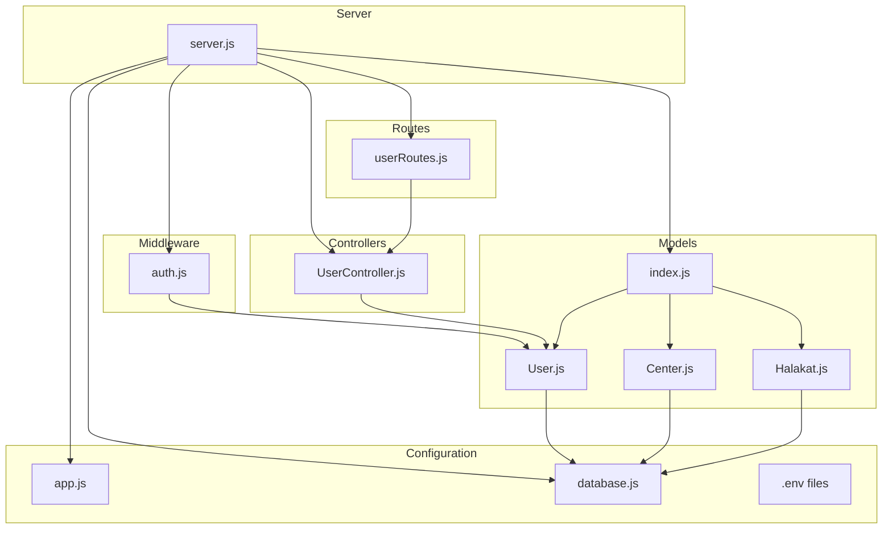
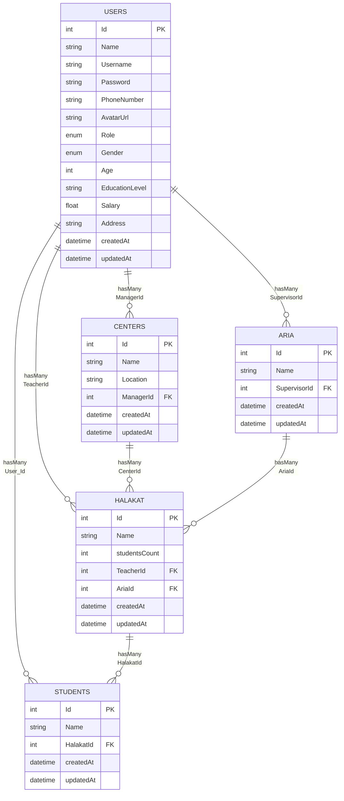
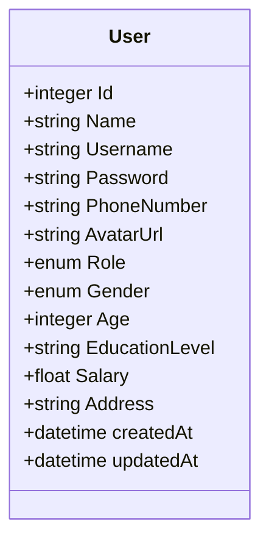
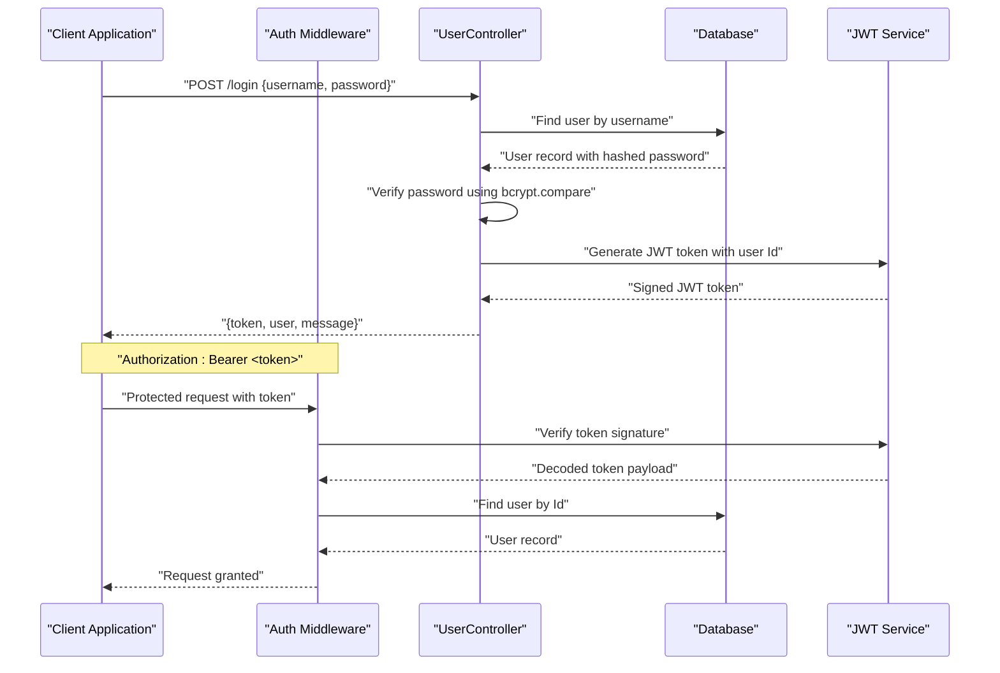
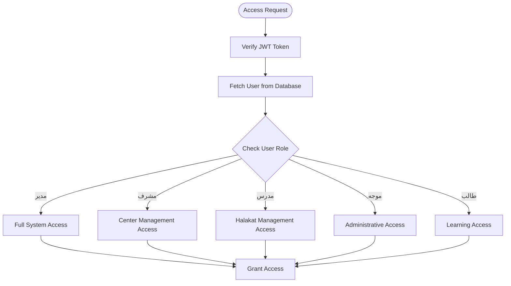
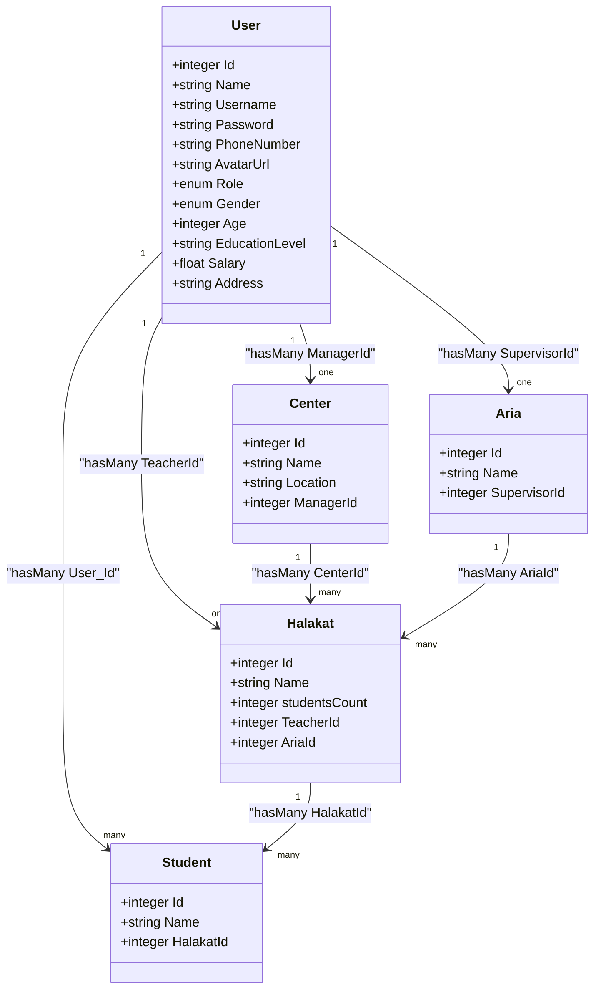
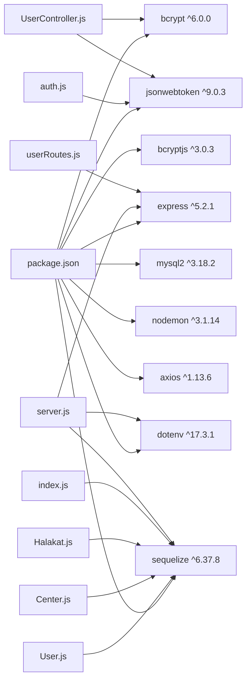

# User Model

<cite>
**Referenced Files in This Document**
- [User.js](file://backend/src/models/User.js)
- [index.js](file://backend/src/models/index.js)
- [Center.js](file://backend/src/models/Center.js)
- [Halakat.js](file://backend/src/models/Halakat.js)
- [database.js](file://backend/src/config/database.js)
- [app.js](file://backend/src/config/app.js)
- [server.js](file://backend/server.js)
- [package.json](file://backend/package.json)
- [auth.js](file://backend/src/middleware/auth.js)
- [UserController.js](file://backend/src/controllers/UserController.js)
- [userRoutes.js](file://backend/src/routes/userRoutes.js)
</cite>

## Update Summary
**Changes Made**
- Updated role definitions to include Arabic localization (مدرس, مشرف, موجه, طالب, مدير)
- Added comprehensive personal information fields (Gender, Age, EducationLevel, Salary, Address)
- Updated authentication flow to support Arabic role-based access control
- Enhanced user registration and profile management with Arabic field support
- Updated relationship mappings to reflect new user attributes

## Table of Contents
1. [Introduction](#introduction)
2. [Project Structure](#project-structure)
3. [Core Components](#core-components)
4. [Architecture Overview](#architecture-overview)
5. [Detailed Component Analysis](#detailed-component-analysis)
6. [Arabic Localization Support](#arabic-localization-support)
7. [Authentication and Security](#authentication-and-security)
8. [Role-Based Access Control](#role-based-access-control)
9. [Personal Information Management](#personal-information-management)
10. [Relationship Mappings](#relationship-mappings)
11. [API Endpoints and Usage](#api-endpoints-and-usage)
12. [Dependency Analysis](#dependency-analysis)
13. [Performance Considerations](#performance-considerations)
14. [Troubleshooting Guide](#troubleshooting-guide)
15. [Conclusion](#conclusion)

## Introduction
This document provides comprehensive documentation for the User model and its surrounding ecosystem with Arabic localization support. The User model now includes comprehensive personal information fields, Arabic role definitions, and enhanced authentication capabilities. It covers the data structure, validation rules, role-based access control, and relationships with Center and Halakat models. The system supports both English and Arabic interfaces for seamless operation in Arabic-speaking environments.

## Project Structure
The backend follows a modular structure with models, configuration, authentication middleware, and RESTful API endpoints. The User model is enhanced with Arabic localization and comprehensive personal information fields.



**Diagram sources**
- [server.js:1-26](file://backend/server.js#L1-L26)
- [auth.js:1-25](file://backend/src/middleware/auth.js#L1-L25)
- [UserController.js:1-117](file://backend/src/controllers/UserController.js#L1-L117)
- [userRoutes.js:1-17](file://backend/src/routes/userRoutes.js#L1-L17)
- [database.js:1-16](file://backend/src/config/database.js#L1-L16)
- [index.js:1-91](file://backend/src/models/index.js#L1-L91)
- [User.js:1-83](file://backend/src/models/User.js#L1-L83)
- [Center.js:1-40](file://backend/src/models/Center.js#L1-L40)
- [Halakat.js:1-47](file://backend/src/models/Halakat.js#L1-L47)

**Section sources**
- [server.js:1-26](file://backend/server.js#L1-L26)
- [auth.js:1-25](file://backend/src/middleware/auth.js#L1-L25)
- [UserController.js:1-117](file://backend/src/controllers/UserController.js#L1-L117)
- [userRoutes.js:1-17](file://backend/src/routes/userRoutes.js#L1-L17)
- [database.js:1-16](file://backend/src/config/database.js#L1-L16)

## Core Components
The User model now includes comprehensive personal information fields with Arabic localization support. All fields are designed to support both Arabic and English interfaces.

### Core User Fields
- **Id**: Integer (Primary Key, Auto Increment)
- **Name**: String (Required) - Full name of the user
- **Username**: String (Required) - Unique identifier for login
- **Password**: String (Required, max 255 chars) - Hashed password storage
- **PhoneNumber**: String (Required) - Contact phone number
- **AvatarUrl**: String (Optional) - URL or path to user's avatar image

### Arabic Localization Fields
- **Gender**: Enum with Arabic values ("ذكر", "أنثى")
- **Age**: Integer (Required) - User's age
- **EducationLevel**: String (Required, max 256 chars) - Educational qualification
- **Salary**: Float (Required, default 0) - Monthly compensation
- **Address**: String (Required, max 256 chars) - Complete residential address

### Role Management
- **Role**: Enum supporting both English and Arabic values
  - English: "admin", "teacher", "supervisor", "manager"
  - Arabic: "مدرس", "مشرف", "موجه", "طالب", "مدير"

**Section sources**
- [User.js:6-83](file://backend/src/models/User.js#L6-L83)

## Architecture Overview
The User model participates in multiple relationships including enhanced personal information management and Arabic localization support.



**Diagram sources**
- [User.js:6-83](file://backend/src/models/User.js#L6-L83)
- [Center.js:6-39](file://backend/src/models/Center.js#L6-L39)
- [Halakat.js:6-46](file://backend/src/models/Halakat.js#L6-L46)
- [index.js:17-72](file://backend/src/models/index.js#L17-L72)

## Detailed Component Analysis

### Enhanced User Model Definition
The User model now includes comprehensive personal information fields with Arabic localization support and enhanced validation rules.



**Diagram sources**
- [User.js:6-83](file://backend/src/models/User.js#L6-L83)

**Section sources**
- [User.js:6-83](file://backend/src/models/User.js#L6-L83)

### Personal Information Fields
The User model now includes comprehensive personal information fields:

- **Gender**: Enum with Arabic values ("ذكر", "أنثى") - Required field
- **Age**: Integer value - Required field with minimum age validation
- **EducationLevel**: String with maximum length 256 characters - Required field
- **Salary**: Float value with default 0 - Required field for compensation tracking
- **Address**: String with maximum length 256 characters - Required field for communication

**Section sources**
- [User.js:44-64](file://backend/src/models/User.js#L44-L64)

## Arabic Localization Support
The system now fully supports Arabic localization for all user-facing interfaces and role definitions.

### Arabic Role Definitions
The User model supports both English and Arabic role definitions:

- **مدرس** (Teacher): Can manage Halakat and Students under their supervision
- **مشرف** (Supervisor): Can oversee multiple centers and teachers  
- **موجه** (Director/Mentor): Primary administrative role
- **طالب** (Student): Learner role with limited access
- **مدير** (Manager): Highest privileges for system administration

### Arabic Interface Elements
- Role labels displayed in Arabic for Arabic-speaking users
- Error messages and success notifications in Arabic
- Form validation messages in Arabic
- Database field names remain in English for technical consistency

**Section sources**
- [User.js:39-47](file://backend/src/models/User.js#L39-L47)
- [UserController.js:29](file://backend/src/controllers/UserController.js#L29)

## Authentication and Security
The authentication system uses bcrypt for password hashing and JWT for token-based authentication with enhanced security features.

### Authentication Flow


**Diagram sources**
- [auth.js:4-25](file://backend/src/middleware/auth.js#L4-L25)
- [UserController.js:35-63](file://backend/src/controllers/UserController.js#L35-L63)

### Security Features
- **Password Hashing**: Uses bcrypt with salt rounds of 10
- **Token Security**: JWT tokens with 7-day expiration
- **Input Validation**: Comprehensive validation for all user inputs
- **Role Verification**: Real-time role checking for access control
- **Error Handling**: Secure error responses without information leakage

**Section sources**
- [auth.js:1-25](file://backend/src/middleware/auth.js#L1-L25)
- [UserController.js:35-63](file://backend/src/controllers/UserController.js#L35-L63)
- [package.json:4-11](file://backend/package.json#L4-L11)

## Role-Based Access Control
The RBAC system now supports both English and Arabic role definitions with enhanced permission management.

### Role Hierarchy and Permissions
- **مدير** (admin): System administrator with full access to all resources
- **مشرف** (supervisor): Can manage multiple centers and coordinate between them
- **مدرس** (teacher): Can manage specific Halakat groups and student progress
- **موجه** (director/mentor): Administrative oversight role
- **طالب** (student): Limited access for learning activities

### Access Control Implementation


**Diagram sources**
- [auth.js:13-20](file://backend/src/middleware/auth.js#L13-L20)
- [UserController.js:87-103](file://backend/src/controllers/UserController.js#L87-L103)

**Section sources**
- [User.js:39-47](file://backend/src/models/User.js#L39-L47)
- [auth.js:13-20](file://backend/src/middleware/auth.js#L13-L20)

## Personal Information Management
The User model now supports comprehensive personal information management with validation and Arabic localization.

### Information Fields and Validation
- **Gender**: Required enum with Arabic values "ذكر" or "أنثى"
- **Age**: Required integer with minimum validation (typically 18+)
- **EducationLevel**: Required string with maximum 256 character limit
- **Salary**: Required float with default 0.0 for unemployed users
- **Address**: Required string with maximum 256 character limit for postal addresses

### Data Validation Rules
- All personal information fields are required for complete profiles
- Age must be a positive integer
- Salary must be a non-negative float
- EducationLevel and Address must not exceed character limits
- Gender must be one of the predefined Arabic enum values

**Section sources**
- [User.js:44-64](file://backend/src/models/User.js#L44-L64)
- [UserController.js:87-103](file://backend/src/controllers/UserController.js#L87-L103)

## Relationship Mappings
The User model participates in enhanced relationships with comprehensive personal information integration.

### Primary Relationships
- **User → Center**: One-to-One relationship via ManagerId (Enhanced with personal info)
- **User → Halakat**: One-to-One relationship via TeacherId (Enhanced with personal info)
- **User → Aria**: One-to-One relationship via SupervisorId (Enhanced with personal info)
- **User → Students**: One-to-Many relationship via User_Id (Enhanced with personal info)

### Additional Relationships
- **Center → Halakat**: One-to-Many relationship via CenterId
- **Halakat → Students**: One-to-Many relationship via HalakatId
- **Aria → Halakat**: One-to-Many relationship via AriaId



**Diagram sources**
- [index.js:21-72](file://backend/src/models/index.js#L21-L72)
- [User.js:6-83](file://backend/src/models/User.js#L6-L83)
- [Center.js:6-39](file://backend/src/models/Center.js#L6-L39)
- [Halakat.js:6-46](file://backend/src/models/Halakat.js#L6-L46)

**Section sources**
- [index.js:21-72](file://backend/src/models/index.js#L21-L72)
- [User.js:6-83](file://backend/src/models/User.js#L6-L83)

## API Endpoints and Usage
The User model exposes comprehensive RESTful endpoints for user management with Arabic localization support.

### Authentication Endpoints
- **POST /login**: User authentication with Arabic success/error messages
- **GET /getme**: Retrieve authenticated user information

### User Management Endpoints
- **POST /adduser**: Create new user with comprehensive personal information
- **GET /getusers**: List all users (protected endpoint)
- **GET /getuserbyname**: Search users by name
- **PUT /updateuser**: Update user information
- **DELETE /deleteuser**: Remove user account
- **GET /getteachers**: Get all teacher users

### Request/Response Examples
**User Registration Request**:
```json
{
  "Name": "أحمد محمد",
  "Username": "ahmed_mohamed",
  "Password": "securePassword123",
  "PhoneNumber": "+966501234567",
  "Gender": "ذكر",
  "Age": 30,
  "EducationLevel": "بكالوريوس في التربية",
  "Role": "مدرس",
  "Salary": 15000,
  "Address": "الرياض، المملكة العربية السعودية"
}
```

**Authentication Response**:
```json
{
  "message": "تم إضافة أحمد محمد بنجاح",
  "user": {
    "Id": 1,
    "Name": "أحمد محمد",
    "Username": "ahmed_mohamed",
    "Role": "مدرس",
    "Gender": "ذكر",
    "Age": 30,
    "EducationLevel": "بكالوريوس في التربية",
    "Salary": 15000,
    "Address": "الرياض، المملكة العربية السعودية"
  }
}
```

**Section sources**
- [userRoutes.js:8-13](file://backend/src/routes/userRoutes.js#L8-L13)
- [UserController.js:8-33](file://backend/src/controllers/UserController.js#L8-L33)
- [UserController.js:35-63](file://backend/src/controllers/UserController.js#L35-L63)

## Dependency Analysis
The system relies on several key dependencies for enhanced functionality including Arabic localization support.

### Core Dependencies
- **bcrypt**: Password hashing with salt rounds of 10
- **bcryptjs**: Alternative bcrypt implementation
- **jsonwebtoken**: JWT token generation and verification
- **express**: Web framework for API endpoints
- **sequelize**: ORM with MySQL support
- **mysql2**: MySQL database driver
- **dotenv**: Environment variable management

### Development Dependencies
- **nodemon**: Automatic server restart during development
- **axios**: HTTP client for API communications



**Diagram sources**
- [package.json:1-14](file://backend/package.json#L1-L14)
- [User.js:1-2](file://backend/src/models/User.js#L1-L2)
- [Center.js:1-2](file://backend/src/models/Center.js#L1-L2)
- [Halakat.js:1-2](file://backend/src/models/Halakat.js#L1-L2)
- [index.js:1-1](file://backend/src/models/index.js#L1-L1)
- [server.js:1-4](file://backend/server.js#L1-L4)
- [auth.js:1](file://backend/src/middleware/auth.js#L1)
- [UserController.js:2-3](file://backend/src/controllers/UserController.js#L2-L3)
- [userRoutes.js:1](file://backend/src/routes/userRoutes.js#L1)

**Section sources**
- [package.json:1-14](file://backend/package.json#L1-L14)
- [server.js:1-4](file://backend/server.js#L1-L4)

## Performance Considerations
Enhanced performance considerations for the localized User model system.

### Database Optimization
- **Indexing Strategy**: Create indexes on Username, PhoneNumber, and Role for faster lookups
- **Character Set**: Use utf8mb4 for full Arabic character support
- **Field Lengths**: Optimize VARCHAR lengths for Arabic text (consider 256-512 for long addresses)
- **Enum Storage**: ENUM fields optimized for Arabic role values

### Caching Strategy
- **User Sessions**: Cache JWT tokens with appropriate TTL
- **Role Permissions**: Cache role-based permission checks
- **Profile Data**: Cache frequently accessed user information

### Memory Management
- **Password Hashing**: Optimize bcrypt salt rounds (currently 10) for balance of security/performance
- **Token Size**: Keep JWT payloads minimal to reduce memory footprint
- **File Uploads**: Implement proper cleanup for AvatarUrl images

## Troubleshooting Guide
Common issues and solutions for the enhanced User model system.

### Authentication Issues
- **Token Verification Failures**: Ensure JWT_SECRET environment variable is set correctly
- **Password Hashing Errors**: Verify bcrypt version compatibility and salt rounds
- **Role-Based Access Denied**: Check user Role field contains valid Arabic or English values

### Database Connection Problems
- **Arabic Character Encoding**: Ensure database uses utf8mb4 charset
- **Migration Issues**: Run sequelize CLI commands for model synchronization
- **Foreign Key Constraints**: Verify relationship mappings in index.js

### API Endpoint Issues
- **Missing Required Fields**: Ensure all personal information fields are provided
- **Invalid Role Values**: Use either English or Arabic role definitions consistently
- **File Upload Errors**: Verify AvatarUrl storage and access permissions

### Localization Problems
- **Arabic Text Display**: Ensure frontend supports UTF-8 encoding
- **Form Validation Messages**: Check Arabic translation files are loaded
- **Date/Number Formatting**: Implement proper localization for Arabic locale

**Section sources**
- [server.js:8-23](file://backend/server.js#L8-L23)
- [database.js:4-15](file://backend/src/config/database.js#L4-L15)
- [UserController.js:8-33](file://backend/src/controllers/UserController.js#L8-L33)

## Conclusion
The enhanced User model provides a comprehensive foundation for identity and access management with full Arabic localization support. The addition of personal information fields, Arabic role definitions, and enhanced security features creates a robust system for educational management applications. With bcrypt and JWT authentication, the system supports secure operations while maintaining cultural relevance through Arabic interface elements. The extensive relationship mappings enable scalable management of Centers, Halakat, and Students under various roles. Proper implementation of the outlined validation rules, security measures, and Arabic localization features will ensure optimal system performance and user experience.