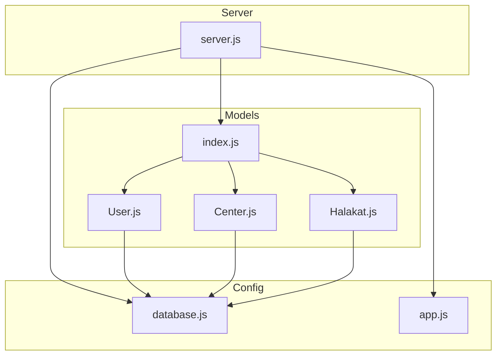
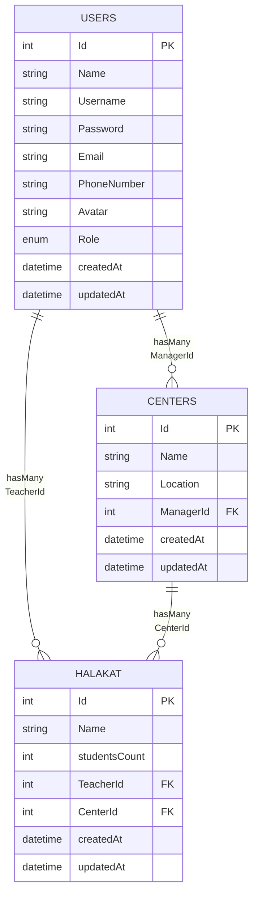
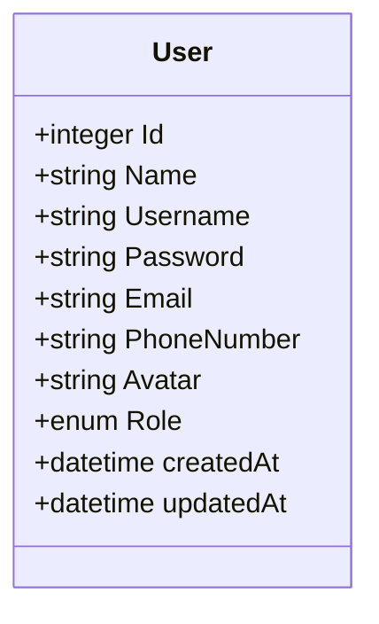
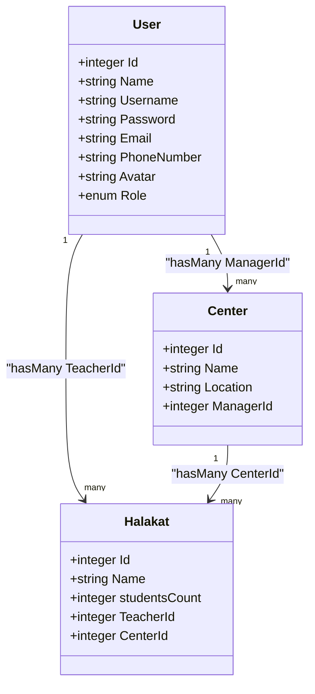
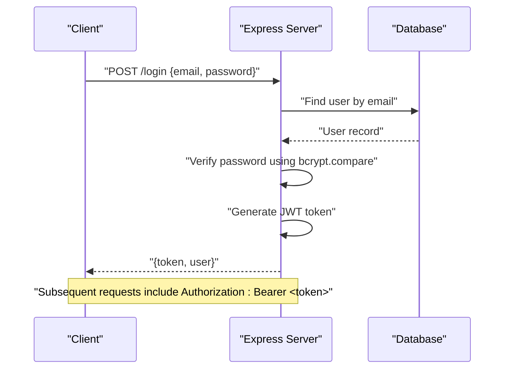
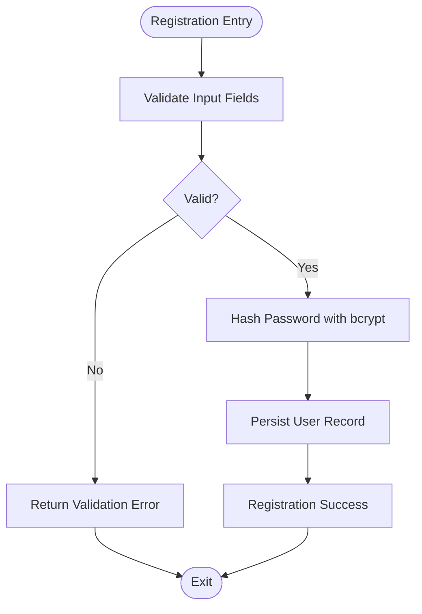
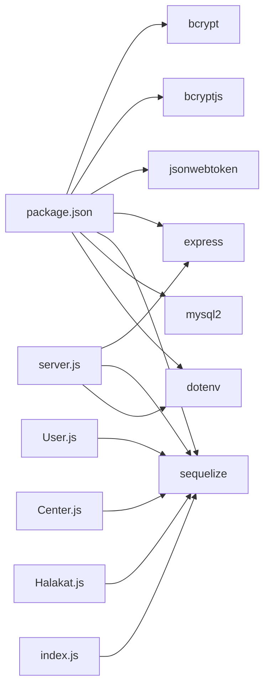

# User Model

<cite>
**Referenced Files in This Document**
- [User.js](file://backend/src/models/User.js)
- [index.js](file://backend/src/models/index.js)
- [Center.js](file://backend/src/models/Center.js)
- [Halakat.js](file://backend/src/models/Halakat.js)
- [database.js](file://backend/src/config/database.js)
- [app.js](file://backend/src/config/app.js)
- [server.js](file://backend/server.js)
- [package.json](file://backend/package.json)
</cite>

## Table of Contents
1. [Introduction](#introduction)
2. [Project Structure](#project-structure)
3. [Core Components](#core-components)
4. [Architecture Overview](#architecture-overview)
5. [Detailed Component Analysis](#detailed-component-analysis)
6. [Dependency Analysis](#dependency-analysis)
7. [Performance Considerations](#performance-considerations)
8. [Troubleshooting Guide](#troubleshooting-guide)
9. [Conclusion](#conclusion)

## Introduction
This document provides comprehensive documentation for the User model and its surrounding ecosystem. It covers the data structure, validation rules, role-based access control, and the relationships with Center and Halakat models. It also outlines the authentication stack using bcrypt for password hashing and JWT for token-based authentication, along with practical examples of user creation and role-based access patterns.

## Project Structure
The backend follows a modular structure with models, configuration, and server bootstrap. The User model is defined alongside other domain models and relationships are declared centrally.

**Diagram sources**
- [server.js:1-25](file://backend/server.js#L1-L25)
- [app.js:1-12](file://backend/src/config/app.js#L1-L12)
- [database.js:1-15](file://backend/src/config/database.js#L1-L15)
- [index.js:1-52](file://backend/src/models/index.js#L1-L52)
- [User.js:1-59](file://backend/src/models/User.js#L1-L59)
- [Center.js:1-39](file://backend/src/models/Center.js#L1-L39)
- [Halakat.js:1-47](file://backend/src/models/Halakat.js#L1-L47)

**Section sources**
- [server.js:1-25](file://backend/server.js#L1-L25)
- [app.js:1-12](file://backend/src/config/app.js#L1-L12)
- [database.js:1-15](file://backend/src/config/database.js#L1-L15)
- [index.js:1-52](file://backend/src/models/index.js#L1-L52)

## Core Components
This section documents the User model fields, data types, validation rules, and defaults. It also explains the role-based access control system and the relationships with Center and Halakat.

- Field: Id
  - Type: Integer
  - Constraints: Primary key, auto-increment
  - Notes: Unique identifier for the user record

- Field: Name
  - Type: String
  - Constraints: Required (not null)
  - Notes: Full name of the user

- Field: Username
  - Type: String
  - Constraints: Required (not null)
  - Notes: Unique identifier used for login; consider adding uniqueness constraint at the database level

- Field: Password
  - Type: String (length up to 255)
  - Constraints: Required (not null)
  - Notes: Should be hashed using bcrypt before persisting; never store plaintext passwords

- Field: Email
  - Type: String
  - Constraints: Required (not null)
  - Notes: Should be validated as an email address; consider adding uniqueness constraint at the database level

- Field: PhoneNumber
  - Type: String
  - Constraints: Required (not null)
  - Notes: Store phone number in a normalized format

- Field: Avatar
  - Type: String
  - Constraints: Optional (nullable)
  - Notes: URL or path to user's avatar image

- Field: Role
  - Type: Enum
  - Values: admin, teacher, supervisor, manager
  - Default: teacher
  - Constraints: Required (not null)
  - Notes: Governs access control and permissions across the system

- Timestamps
  - Fields: createdAt, updatedAt
  - Behavior: Managed automatically by Sequelize when timestamps are enabled

Validation and Business Rules
- Required fields: Name, Username, Password, Email, PhoneNumber
- Role must be one of the enumerated values
- Prefer enforcing uniqueness for Username and Email at the database level
- Password must be hashed before saving; never store plaintext
- Consider input sanitization and normalization for Phone Number and Email

Role-Based Access Control (RBAC)
- admin: Highest privileges; can manage all resources
- teacher: Can manage Halakat and Students under their supervision
- supervisor: Can oversee multiple centers and teachers
- manager: Can manage Centers and associated Halakats

These roles define who can create, update, or delete records and access protected endpoints.

**Section sources**
- [User.js:6-57](file://backend/src/models/User.js#L6-L57)
- [index.js:14-20](file://backend/src/models/index.js#L14-L20)

## Architecture Overview
The User model participates in three primary relationships:
- One-to-Many with Center via ManagerId
- One-to-Many with Halakat via TeacherId
- Indirect Many-to-One relationships through Center and Halakat

**Diagram sources**
- [User.js:6-57](file://backend/src/models/User.js#L6-L57)
- [Center.js:6-36](file://backend/src/models/Center.js#L6-L36)
- [Halakat.js:6-44](file://backend/src/models/Halakat.js#L6-L44)
- [index.js:14-24](file://backend/src/models/index.js#L14-L24)

## Detailed Component Analysis

### User Model Definition
The User model is defined using Sequelize with explicit field types and constraints. It enables timestamps to track creation and updates.

**Diagram sources**
- [User.js:6-57](file://backend/src/models/User.js#L6-L57)

**Section sources**
- [User.js:6-57](file://backend/src/models/User.js#L6-L57)

### Relationship Mappings
The User model participates in two hasMany relationships:
- User.hasMany(Center, { foreignKey: "ManagerId", as: "Centers" })
- User.hasMany(Halakat, { foreignKey: "TeacherId", as: "TeacherHalakat" })

These relationships are mirrored with belongsTo on the related models.

**Diagram sources**
- [index.js:14-24](file://backend/src/models/index.js#L14-L24)
- [Center.js:21-28](file://backend/src/models/Center.js#L21-L28)
- [Halakat.js:21-36](file://backend/src/models/Halakat.js#L21-L36)

**Section sources**
- [index.js:14-24](file://backend/src/models/index.js#L14-L24)
- [Center.js:21-28](file://backend/src/models/Center.js#L21-L28)
- [Halakat.js:21-36](file://backend/src/models/Halakat.js#L21-L36)

### Authentication Stack
The project includes bcrypt and jsonwebtoken, enabling:
- Password hashing with bcrypt
- Token-based authentication with JWT

Implementation details:
- bcrypt: Used to hash passwords before storing them in the database
- jsonwebtoken: Used to issue and verify JWT tokens for authenticated sessions

**Diagram sources**
- [package.json:4-8](file://backend/package.json#L4-L8)

**Section sources**
- [package.json:4-8](file://backend/package.json#L4-L8)

### Registration and Profile Management Workflow
- Registration
  - Validate input (Name, Username, Email, PhoneNumber, Password)
  - Hash password using bcrypt
  - Persist user with Role set to default or requested role
  - Optionally return a JWT token upon successful registration

- Profile Management
  - Retrieve user by ID
  - Update fields (Avatar, PhoneNumber) with appropriate validations
  - Re-hash password only when changed

[No sources needed since this diagram shows conceptual workflow, not actual code structure]

## Dependency Analysis
External libraries and their roles:
- bcrypt: Password hashing
- bcryptjs: Alternative bcrypt implementation
- jsonwebtoken: JWT token generation and verification
- express: Web framework for API endpoints
- sequelize: ORM for database modeling and relationships
- mysql2: MySQL driver for Sequelize
- dotenv: Environment variable loading

**Diagram sources**
- [package.json:2-12](file://backend/package.json#L2-L12)
- [User.js:1-2](file://backend/src/models/User.js#L1-L2)
- [Center.js:1-2](file://backend/src/models/Center.js#L1-L2)
- [Halakat.js:1-2](file://backend/src/models/Halakat.js#L1-L2)
- [index.js:1-1](file://backend/src/models/index.js#L1-L1)
- [server.js:1-4](file://backend/server.js#L1-L4)

**Section sources**
- [package.json:2-12](file://backend/package.json#L2-L12)
- [server.js:1-4](file://backend/server.js#L1-L4)

## Performance Considerations
- Indexing
  - Add database indexes on Username and Email for fast lookups during authentication
- Password Hashing Cost
  - Configure bcrypt cost appropriately to balance security and performance
- Token Expiration
  - Set reasonable expiration times for JWT tokens and refresh mechanisms
- Query Optimization
  - Use eager loading for associations (e.g., include Centers and TeacherHalakat) to avoid N+1 queries

[No sources needed since this section provides general guidance]

## Troubleshooting Guide
Common issues and resolutions:
- Authentication Failures
  - Ensure bcrypt is used consistently for hashing and comparison
  - Verify JWT secret and expiration settings
- Database Sync Issues
  - Confirm database credentials and connectivity
  - Check that models are registered before synchronization
- Relationship Errors
  - Validate foreign keys and referential constraints
  - Ensure association aliases match across models

**Section sources**
- [server.js:8-23](file://backend/server.js#L8-L23)
- [database.js:4-14](file://backend/src/config/database.js#L4-L14)

## Conclusion
The User model defines a robust foundation for identity and access management. With bcrypt and JWT, the system supports secure authentication and authorization. The defined relationships enable scalable management of Centers and Halakat under various roles. Enforcing uniqueness constraints, input validation, and secure password handling will further strengthen the system.