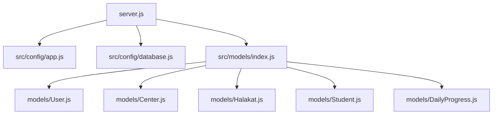
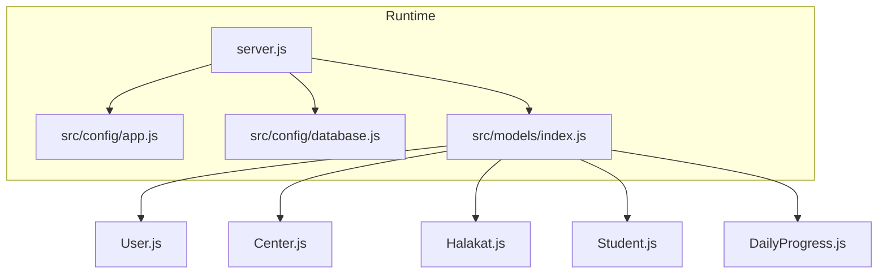
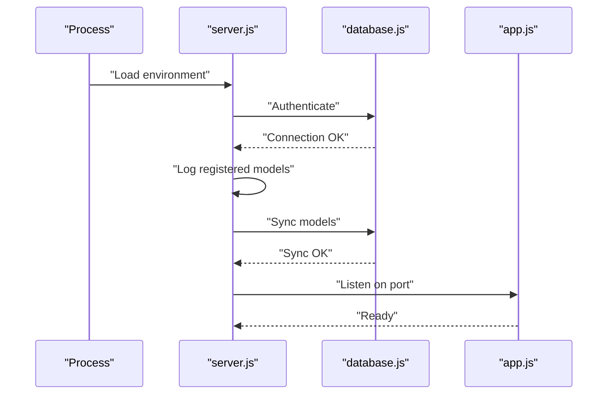
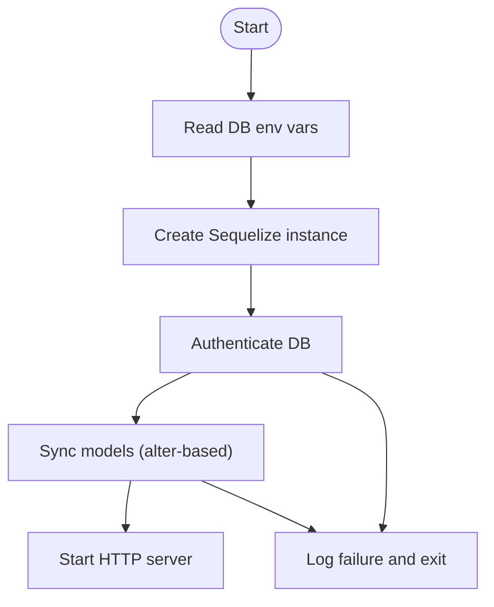
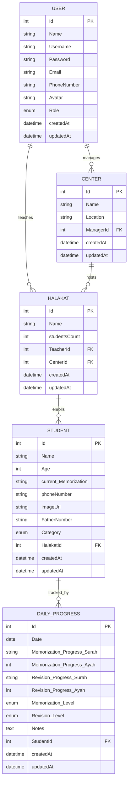

# Deployment & Production

<cite>
**Referenced Files in This Document**
- [README.md](file://README.md)
- [backend/package.json](file://backend/package.json)
- [backend/server.js](file://backend/server.js)
- [backend/src/config/app.js](file://backend/src/config/app.js)
- [backend/src/config/database.js](file://backend/src/config/database.js)
- [backend/src/models/index.js](file://backend/src/models/index.js)
- [backend/src/models/User.js](file://backend/src/models/User.js)
- [backend/src/models/Center.js](file://backend/src/models/Center.js)
- [backend/src/models/Halakat.js](file://backend/src/models/Halakat.js)
- [backend/src/models/Student.js](file://backend/src/models/Student.js)
- [backend/src/models/DailyProgress.js](file://backend/src/models/DailyProgress.js)
</cite>

## Table of Contents
1. [Introduction](#introduction)
2. [Project Structure](#project-structure)
3. [Core Components](#core-components)
4. [Architecture Overview](#architecture-overview)
5. [Detailed Component Analysis](#detailed-component-analysis)
6. [Environment Configuration](#environment-configuration)
7. [Deployment Process](#deployment-process)
8. [Database Deployment and Management](#database-deployment-and-management)
9. [Monitoring, Logging, and Observability](#monitoring-logging-and-observability)
10. [Security Considerations](#security-considerations)
11. [Scaling, Load Balancing, and High Availability](#scaling-load-balancing-and-high-availability)
12. [Performance Tuning](#performance-tuning)
13. [Troubleshooting Guide](#troubleshooting-guide)
14. [Backup, Disaster Recovery, and Operational Checklists](#backup-disaster-recovery-and-operational-checklists)
15. [Conclusion](#conclusion)

## Introduction
This document provides comprehensive deployment and production guidance for the Khirocom project. It covers environment configuration, deployment pipeline, database setup and migration, monitoring and logging, security hardening, scalability, performance tuning, troubleshooting, backups, and operational checklists tailored for production environments.

## Project Structure
Khirocom is a Node.js/Express application backed by MySQL via Sequelize ORM. The backend is organized into:
- Application bootstrap and server orchestration
- Express configuration
- Database configuration and Sequelize initialization
- Data models and associations
- Environment variables via dotenv

**Diagram sources**
- [backend/server.js:1-25](file://backend/server.js#L1-L25)
- [backend/src/config/app.js:1-12](file://backend/src/config/app.js#L1-L12)
- [backend/src/config/database.js:1-15](file://backend/src/config/database.js#L1-L15)
- [backend/src/models/index.js:1-52](file://backend/src/models/index.js#L1-L52)
- [backend/src/models/User.js:1-59](file://backend/src/models/User.js#L1-L59)
- [backend/src/models/Center.js:1-39](file://backend/src/models/Center.js#L1-L39)
- [backend/src/models/Halakat.js:1-47](file://backend/src/models/Halakat.js#L1-L47)
- [backend/src/models/Student.js:1-67](file://backend/src/models/Student.js#L1-L67)
- [backend/src/models/DailyProgress.js:1-64](file://backend/src/models/DailyProgress.js#L1-L64)

**Section sources**
- [backend/server.js:1-25](file://backend/server.js#L1-L25)
- [backend/src/config/app.js:1-12](file://backend/src/config/app.js#L1-L12)
- [backend/src/config/database.js:1-15](file://backend/src/config/database.js#L1-L15)
- [backend/src/models/index.js:1-52](file://backend/src/models/index.js#L1-L52)

## Core Components
- Server bootstrap initializes environment, authenticates database, synchronizes models, and starts the Express app.
- Express app defines basic JSON handling and a root endpoint.
- Database configuration reads credentials and connection parameters from environment variables and configures Sequelize for MySQL.
- Models define entities and relationships; associations are declared centrally.

**Section sources**
- [backend/server.js:1-25](file://backend/server.js#L1-L25)
- [backend/src/config/app.js:1-12](file://backend/src/config/app.js#L1-L12)
- [backend/src/config/database.js:1-15](file://backend/src/config/database.js#L1-L15)
- [backend/src/models/index.js:1-52](file://backend/src/models/index.js#L1-L52)

## Architecture Overview
The runtime architecture ties together the server, Express app, database connector, and ORM models.

**Diagram sources**
- [backend/server.js:1-25](file://backend/server.js#L1-L25)
- [backend/src/config/app.js:1-12](file://backend/src/config/app.js#L1-L12)
- [backend/src/config/database.js:1-15](file://backend/src/config/database.js#L1-L15)
- [backend/src/models/index.js:1-52](file://backend/src/models/index.js#L1-L52)
- [backend/src/models/User.js:1-59](file://backend/src/models/User.js#L1-L59)
- [backend/src/models/Center.js:1-39](file://backend/src/models/Center.js#L1-L39)
- [backend/src/models/Halakat.js:1-47](file://backend/src/models/Halakat.js#L1-L47)
- [backend/src/models/Student.js:1-67](file://backend/src/models/Student.js#L1-L67)
- [backend/src/models/DailyProgress.js:1-64](file://backend/src/models/DailyProgress.js#L1-L64)

## Detailed Component Analysis

### Server Startup Flow
The server performs authentication against the database, logs registered models, attempts synchronization, and listens on the configured port.

**Diagram sources**
- [backend/server.js:8-23](file://backend/server.js#L8-L23)
- [backend/src/config/database.js:4-14](file://backend/src/config/database.js#L4-L14)
- [backend/src/config/app.js:1-12](file://backend/src/config/app.js#L1-L12)

**Section sources**
- [backend/server.js:8-23](file://backend/server.js#L8-L23)

### Database Initialization and Synchronization
Sequelize is initialized from environment variables and used to authenticate and synchronize models. The synchronization strategy currently uses an alter-based sync.

**Diagram sources**
- [backend/src/config/database.js:4-14](file://backend/src/config/database.js#L4-L14)
- [backend/server.js:10-15](file://backend/server.js#L10-L15)

**Section sources**
- [backend/src/config/database.js:1-15](file://backend/src/config/database.js#L1-L15)
- [backend/server.js:10-15](file://backend/server.js#L10-L15)

### Data Models Overview
The model layer defines core entities and relationships among Users, Centers, Halakat, Students, and Daily Progress. Associations are defined centrally to maintain referential integrity.

**Diagram sources**
- [backend/src/models/User.js:6-56](file://backend/src/models/User.js#L6-L56)
- [backend/src/models/Center.js:6-35](file://backend/src/models/Center.js#L6-L35)
- [backend/src/models/Halakat.js:6-43](file://backend/src/models/Halakat.js#L6-L43)
- [backend/src/models/Student.js:6-64](file://backend/src/models/Student.js#L6-L64)
- [backend/src/models/DailyProgress.js:6-61](file://backend/src/models/DailyProgress.js#L6-L61)
- [backend/src/models/index.js:14-40](file://backend/src/models/index.js#L14-L40)

**Section sources**
- [backend/src/models/index.js:1-52](file://backend/src/models/index.js#L1-L52)
- [backend/src/models/User.js:1-59](file://backend/src/models/User.js#L1-L59)
- [backend/src/models/Center.js:1-39](file://backend/src/models/Center.js#L1-L39)
- [backend/src/models/Halakat.js:1-47](file://backend/src/models/Halakat.js#L1-L47)
- [backend/src/models/Student.js:1-67](file://backend/src/models/Student.js#L1-L67)
- [backend/src/models/DailyProgress.js:1-64](file://backend/src/models/DailyProgress.js#L1-L64)

## Environment Configuration
Production-grade environment variables must be set for secure and reliable operation. The application reads these via dotenv.

Critical environment variables:
- Database connectivity
  - DB_NAME
  - DB_USER
  - DB_PASSWORD
  - DB_HOST
  - DB_PORT
- Application runtime
  - PORT
- Optional logging toggle
  - NODE_ENV (recommended to set to production)
  - LOG_LEVEL (application-specific logging level if used)

Notes:
- The database configuration disables Sequelize logging globally. Consider enabling structured logging in production for observability while keeping verbose SQL off by default.
- The server startup performs an alter-based sync. In production, prefer explicit migrations and avoid alter-based sync to prevent unintended schema changes.

**Section sources**
- [backend/src/config/database.js:1-15](file://backend/src/config/database.js#L1-L15)
- [backend/server.js:6-15](file://backend/server.js#L6-L15)

## Deployment Process
High-level steps to deploy from development to production:

1. Prepare environment
   - Set production environment variables (database, port, logging).
   - Install dependencies using the lock file.
   - Build artifacts if applicable (no build step observed in current repository).

2. Provision infrastructure
   - Provision a MySQL-compatible database instance.
   - Configure network access and firewall rules to allow inbound traffic only on the application port.

3. Run migrations and seed (if applicable)
   - The current code uses alter-based sync during startup. For production, replace with formal migrations and controlled seeding.

4. Start the application
   - Launch the server process and confirm successful database authentication and model registration.

5. Health checks and monitoring
   - Configure health endpoints and integrate with monitoring systems.

6. Reverse proxy and TLS termination
   - Place a reverse proxy/load balancer in front of the application and terminate TLS at the proxy.

7. CI/CD automation
   - Automate testing, building, and deployment with immutable container images or artifact promotion.

Operational checklist:
- Confirm environment variables are present and correct.
- Verify database connectivity and permissions.
- Validate reverse proxy routing and TLS certificates.
- Confirm log aggregation and alerting.
- Perform smoke tests and health checks.

**Section sources**
- [backend/package.json:1-14](file://backend/package.json#L1-L14)
- [backend/server.js:8-23](file://backend/server.js#L8-L23)
- [backend/src/config/database.js:4-14](file://backend/src/config/database.js#L4-L14)

## Database Deployment and Management
Current state:
- The application authenticates and synchronizes models at startup using alter-based sync.
- No explicit migrations or seeders are present in the repository.

Recommended production practices:
- Use Sequelize migrations for schema changes and version control.
- Maintain a separate production migration script and apply it before starting the service.
- Separate concerns: keep alter-based sync for local development only.
- Use read replicas for reporting workloads and master for writes.
- Enable binary logging and point-in-time recovery on the database.

Migration strategy outline:
- Create a migration directory and scripts for schema changes.
- Apply migrations on deploy using a migration runner.
- Keep rollback scripts for safety.

Data seeding:
- Use seed scripts for static reference data.
- Avoid seeding in production startup; run seeds as part of deployment pipeline.

Backup and restore:
- Schedule regular logical backups (e.g., mysqldump or vendor-native tools).
- Test restore procedures periodically.
- Store backups securely and encrypt at rest.

**Section sources**
- [backend/server.js:14-14](file://backend/server.js#L14-L14)
- [backend/src/config/database.js:12-12](file://backend/src/config/database.js#L12-L12)

## Monitoring, Logging, and Observability
Observability pillars for production:

- Logs
  - Standardize application logs to stdout/stderr.
  - Use structured logging (JSON) for easier parsing.
  - Control verbosity; disable ORM SQL logs in production unless needed for diagnostics.

- Metrics
  - Expose Prometheus-style metrics endpoint for latency, throughput, and error rates.
  - Track database connection pool utilization and query durations.

- Tracing
  - Add distributed tracing for request spans across services.
  - Correlate traces with logs and metrics.

- Health checks
  - Implement readiness and liveness probes.
  - Include database connectivity check in readiness.

- Alerting
  - Alert on high error rates, latency spikes, and resource exhaustion.

Note: The current code disables Sequelize logging. Integrate a production logging library and configure log levels accordingly.

**Section sources**
- [backend/src/config/database.js:12-12](file://backend/src/config/database.js#L12-L12)

## Security Considerations
- Secrets management
  - Store secrets in a secure secret manager or environment provider; never commit secrets to source control.
  - Restrict access to environment variable files and deployment keys.

- Transport security
  - Terminate TLS at the reverse proxy/load balancer.
  - Enforce HTTPS-only communication and strong cipher suites.
  - Configure HSTS and security headers at the proxy.

- Network security
  - Limit inbound ports to necessary ones only (e.g., application port).
  - Use firewalls and security groups to restrict access to database and application servers.
  - Segment networks and use private subnets for internal services.

- Access control
  - Enforce least privilege for database users.
  - Use application-level authentication and authorization for protected endpoints.
  - Rotate credentials regularly.

- Dependencies
  - Audit dependencies and keep them updated.
  - Scan for vulnerabilities and remediate promptly.

**Section sources**
- [backend/package.json:1-14](file://backend/package.json#L1-L14)

## Scaling, Load Balancing, and High Availability
- Horizontal scaling
  - Run multiple instances behind a load balancer.
  - Ensure stateless application instances; persist session data externally if needed.

- Load balancing
  - Use layer 7 load balancing for sticky sessions if required, otherwise layer 4 for stateless scaling.
  - Configure health checks and auto-healing.

- High availability
  - Deploy across multiple availability zones.
  - Use managed database with multi-AZ support and automated failover.
  - Implement circuit breakers and graceful degradation.

- Database scaling
  - Use read replicas for read-heavy workloads.
  - Consider sharding or partitioning for very large datasets.

- Caching
  - Introduce caching layers (e.g., Redis) for frequently accessed data.
  - Cache invalidation strategies and cache warming.

[No sources needed since this section provides general guidance]

## Performance Tuning
- Database
  - Optimize queries and add appropriate indexes.
  - Monitor slow queries and query plans.
  - Tune database connection pool size and timeouts.

- Application
  - Use connection pooling for database connections.
  - Minimize synchronous operations and optimize I/O.
  - Profile memory usage and CPU utilization.

- Infrastructure
  - Right-size compute and storage.
  - Use SSD-backed storage for databases.
  - Enable compression and efficient serialization.

- Observability-driven tuning
  - Use metrics to identify bottlenecks.
  - Correlate metrics with logs and traces.

**Section sources**
- [backend/src/config/database.js:8-12](file://backend/src/config/database.js#L8-L12)

## Troubleshooting Guide
Common production issues and resolutions:

- Database connection failures
  - Verify host, port, credentials, and network connectivity.
  - Check database availability and firewall rules.
  - Confirm user privileges and database existence.

- Model synchronization errors
  - Prefer explicit migrations over alter-based sync.
  - Review schema differences and reconcile manually if needed.

- Port binding conflicts
  - Ensure the configured port is free and allowed by the platform.
  - Check reverse proxy configuration for port forwarding.

- Health check failures
  - Confirm readiness probe includes database connectivity.
  - Validate that the application responds to health endpoints.

- Memory and CPU spikes
  - Inspect logs for error bursts.
  - Profile the application and optimize hot paths.

- Slow response times
  - Capture latency metrics and inspect database query performance.
  - Review caching effectiveness and connection pool saturation.

**Section sources**
- [backend/server.js:20-22](file://backend/server.js#L20-L22)
- [backend/src/config/database.js:4-14](file://backend/src/config/database.js#L4-L14)

## Backup, Disaster Recovery, and Operational Checklists
Backup strategy:
- Schedule regular automated backups (logical dumps).
- Encrypt backups at rest and in transit.
- Store backups in geographically separated locations.

Disaster recovery:
- Define RPO/RTO targets.
- Practice restoration drills and document recovery playbooks.
- Automate failover procedures where possible.

Operational checklists:
- Pre-deploy
  - Validate environment variables and secrets rotation.
  - Run pre-flight database migrations.
  - Smoke test endpoints and health checks.

- Post-deploy
  - Confirm application and database connectivity.
  - Verify metrics and alerts are firing as expected.
  - Monitor logs for anomalies.

- Incident response
  - Define escalation paths and runbooks.
  - Isolate issues using logs, metrics, and traces.
  - Rollback to previous known-good version if necessary.

**Section sources**
- [backend/server.js:10-15](file://backend/server.js#L10-L15)
- [backend/src/config/database.js:12-12](file://backend/src/config/database.js#L12-L12)

## Conclusion
This guide outlines a production-ready approach for Khirocom, focusing on environment configuration, secure deployment, robust database management, observability, security, scalability, and operational excellence. Adopt the recommended practices to ensure reliability, performance, and resilience in production.