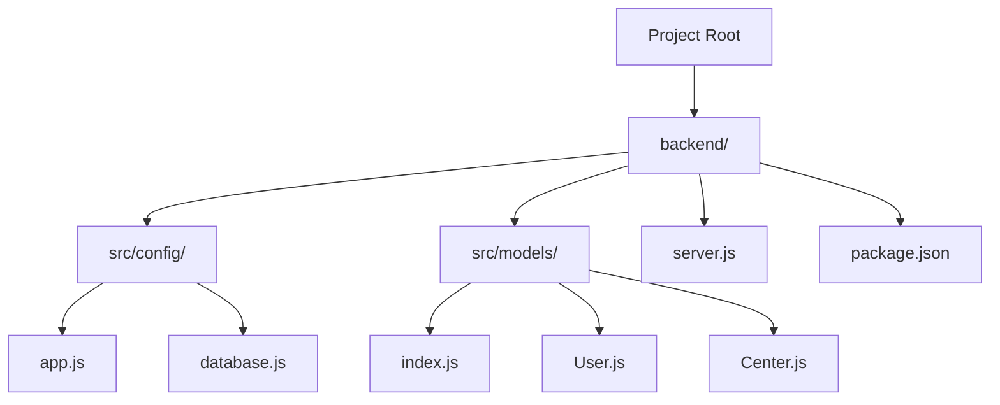
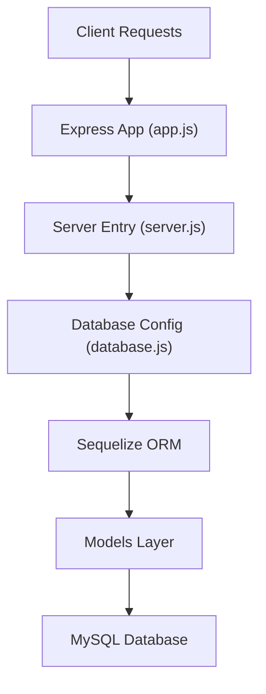

# Development Guidelines

<cite>
**Referenced Files in This Document**
- [README.md](file://README.md)
- [backend/package.json](file://backend/package.json)
- [backend/server.js](file://backend/server.js)
- [backend/src/config/app.js](file://backend/src/config/app.js)
- [backend/src/config/database.js](file://backend/src/config/database.js)
- [backend/src/models/index.js](file://backend/src/models/index.js)
- [backend/src/models/User.js](file://backend/src/models/User.js)
- [backend/src/models/Center.js](file://backend/src/models/Center.js)
</cite>

## Table of Contents
1. [Introduction](#introduction)
2. [Project Structure](#project-structure)
3. [Core Components](#core-components)
4. [Architecture Overview](#architecture-overview)
5. [Development Workflow](#development-workflow)
6. [Coding Standards](#coding-standards)
7. [Database Management](#database-management)
8. [Testing Strategy](#testing-strategy)
9. [Debugging and Performance](#debugging-and-performance)
10. [Code Review and Contribution](#code-review-and-contribution)
11. [Extending the Application](#extending-the-application)
12. [Environment Configuration](#environment-configuration)
13. [Troubleshooting Guide](#troubleshooting-guide)
14. [Conclusion](#conclusion)

## Introduction
This document provides comprehensive development guidelines for the Khirocom project. It covers coding standards, development workflow, best practices, and operational procedures for building and maintaining the backend service. The project follows a modular architecture with Express.js, Sequelize ORM, and MySQL, emphasizing clean separation of concerns, standardized file organization, and robust development practices.

## Project Structure
The project is organized into a backend module containing configuration, models, and foundational components. The current structure supports a layered architecture with clear boundaries between configuration, data modeling, and application entry points.

**Diagram sources**
- [backend/server.js:1-25](file://backend/server.js#L1-L25)
- [backend/src/config/app.js:1-12](file://backend/src/config/app.js#L1-L12)
- [backend/src/config/database.js:1-15](file://backend/src/config/database.js#L1-L15)
- [backend/src/models/index.js:1-52](file://backend/src/models/index.js#L1-L52)
- [backend/src/models/User.js:1-59](file://backend/src/models/User.js#L1-L59)
- [backend/src/models/Center.js:1-39](file://backend/src/models/Center.js#L1-L39)

**Section sources**
- [backend/server.js:1-25](file://backend/server.js#L1-L25)
- [backend/src/config/app.js:1-12](file://backend/src/config/app.js#L1-L12)
- [backend/src/config/database.js:1-15](file://backend/src/config/database.js#L1-L15)
- [backend/src/models/index.js:1-52](file://backend/src/models/index.js#L1-L52)

## Core Components
The application initializes through a central server entry point that loads environment configuration, establishes database connectivity, synchronizes models, and starts the Express server. Configuration modules define the Express app and database connection using environment variables.

Key responsibilities:
- Environment loading via dotenv
- Database authentication and synchronization
- Express app initialization and port binding
- Model registration and relationship definition

**Section sources**
- [backend/server.js:1-25](file://backend/server.js#L1-L25)
- [backend/src/config/app.js:1-12](file://backend/src/config/app.js#L1-L12)
- [backend/src/config/database.js:1-15](file://backend/src/config/database.js#L1-L15)

## Architecture Overview
The system follows a layered architecture pattern with explicit separation between configuration, data access, and application logic. The server orchestrates startup procedures, while models encapsulate data definitions and relationships.

**Diagram sources**
- [backend/server.js:1-25](file://backend/server.js#L1-L25)
- [backend/src/config/app.js:1-12](file://backend/src/config/app.js#L1-L12)
- [backend/src/config/database.js:1-15](file://backend/src/config/database.js#L1-L15)
- [backend/src/models/index.js:1-52](file://backend/src/models/index.js#L1-L52)

## Development Workflow
Local development setup:
1. Install dependencies using the package manager defined in the project configuration.
2. Configure environment variables for database connectivity and application settings.
3. Start the development server with hot reload support.
4. Verify database connectivity and model synchronization during startup.

Database migration procedures:
- The current implementation uses model synchronization for development. For production-ready migrations, establish a dedicated migrations directory and use Sequelize CLI commands to manage schema changes.

Testing strategies:
- Implement unit and integration tests for models, controllers, and routes. Use a testing framework aligned with the project's JavaScript/ES6+ standards.

**Section sources**
- [backend/package.json:1-14](file://backend/package.json#L1-L14)
- [backend/server.js:1-25](file://backend/server.js#L1-L25)

## Coding Standards
JavaScript/ES6+ patterns:
- Use strict mode and modern syntax for improved maintainability.
- Prefer const/let over var for variable declarations.
- Utilize arrow functions for concise callbacks and async/await for asynchronous operations.

Express.js patterns:
- Centralize route registration in a dedicated routes directory.
- Implement middleware for cross-cutting concerns (authentication, validation).
- Use consistent HTTP status codes and standardized response formats.

Sequelize ORM usage:
- Define models with explicit primary keys and constraints.
- Establish relationships using belongsTo/hasMany with descriptive aliases.
- Use enums for fixed sets of values and timestamps for audit trails.

File naming conventions:
- Use kebab-case for configuration files and lowercase with underscores for model files.
- Keep filenames descriptive and consistent with their responsibilities.

**Section sources**
- [backend/src/models/User.js:1-59](file://backend/src/models/User.js#L1-L59)
- [backend/src/models/Center.js:1-39](file://backend/src/models/Center.js#L1-L39)
- [backend/src/models/index.js:1-52](file://backend/src/models/index.js#L1-L52)

## Database Management
Connection configuration:
- Database credentials and connection parameters are loaded from environment variables.
- Logging is disabled by default to reduce noise in development logs.

Model relationships:
- The models layer defines relationships between entities using foreign keys and association aliases.
- Relationships support cascading operations and referential integrity.

Synchronization strategy:
- Development uses model synchronization to align the database schema with models.
- Production environments should use migrations for controlled schema evolution.

**Section sources**
- [backend/src/config/database.js:1-15](file://backend/src/config/database.js#L1-L15)
- [backend/src/models/index.js:1-52](file://backend/src/models/index.js#L1-L52)

## Testing Strategy
Recommended testing approach:
- Unit tests for individual model methods and validations.
- Integration tests for route handlers and controller logic.
- Mock external dependencies (database, authentication) during testing.
- Use assertion libraries compatible with ES6+ syntax.

Test organization:
- Place tests alongside source files or in a dedicated tests directory.
- Use descriptive test names that reflect the expected behavior.

Coverage metrics:
- Aim for high coverage across models, controllers, and critical business logic.
- Exclude generated or third-party code from coverage calculations.

## Debugging and Performance
Debugging techniques:
- Enable detailed logging during development for request/response tracing.
- Use conditional breakpoints in IDEs to inspect model queries and middleware execution.
- Leverage database query logging selectively to diagnose performance issues.

Performance optimization:
- Optimize Sequelize queries with appropriate includes and selective field selection.
- Implement pagination for large result sets.
- Use connection pooling and limit concurrent requests during development.

Error handling best practices:
- Centralize error handling in middleware to ensure consistent responses.
- Log errors with context but avoid exposing sensitive information to clients.
- Validate inputs early and return meaningful error messages.

## Code Review and Contribution
Review process:
- Submit pull requests with clear descriptions of changes and their impact.
- Ensure all tests pass and code adheres to established standards.
- Conduct peer reviews focusing on correctness, maintainability, and performance.

Version control practices:
- Use feature branches for development and rebase/squash commits before merging.
- Write clear commit messages describing the "why" behind changes.
- Keep PRs focused and avoid mixing unrelated changes.

## Extending the Application
Adding new models:
- Create model files with explicit attributes and relationships.
- Register models in the central models index and define associations.
- Add corresponding migrations for production deployments.

Integrating new features:
- Add routes and controllers following existing patterns.
- Implement middleware for shared functionality.
- Update environment configurations as needed.

Maintaining code quality:
- Enforce consistent formatting with linters and formatters.
- Refactor frequently to improve readability and reduce technical debt.
- Document complex logic and business rules.

## Environment Configuration
Development environment:
- Set environment variables for database connectivity and application settings.
- Use dotenv for local configuration management.
- Enable verbose logging during development.

Production environment:
- Hard-code environment variables in deployment targets.
- Disable logging and enable production-ready error reporting.
- Configure database connections with appropriate credentials and timeouts.

Hot reload setup:
- Use nodemon for automatic server restarts during development.
- Configure watch patterns to exclude node_modules and build artifacts.

Development server management:
- Start the server with environment-specific configurations.
- Monitor logs for startup errors and database connectivity issues.

**Section sources**
- [backend/package.json:1-14](file://backend/package.json#L1-L14)
- [backend/server.js:1-25](file://backend/server.js#L1-L25)
- [backend/src/config/app.js:1-12](file://backend/src/config/app.js#L1-L12)
- [backend/src/config/database.js:1-15](file://backend/src/config/database.js#L1-L15)

## Troubleshooting Guide
Common development issues:
- Database connection failures: Verify environment variables and network connectivity.
- Model synchronization errors: Check for constraint violations and missing migrations.
- Port conflicts: Change the PORT environment variable or stop conflicting processes.

Performance bottlenecks:
- Slow queries: Analyze query execution plans and add appropriate indexes.
- Memory leaks: Monitor memory usage and dispose of resources properly.
- High latency: Profile network requests and optimize database queries.

Error handling:
- Centralized error handling: Implement middleware to catch unhandled exceptions.
- Validation errors: Return structured error responses with clear messages.
- CORS issues: Configure CORS middleware for cross-origin requests.

## Conclusion
These guidelines provide a foundation for developing and maintaining the Khirocom project effectively. By following standardized practices for code organization, database management, testing, and deployment, contributors can ensure a reliable and scalable backend service. Regular adherence to these guidelines will improve code quality, simplify maintenance, and accelerate feature development.