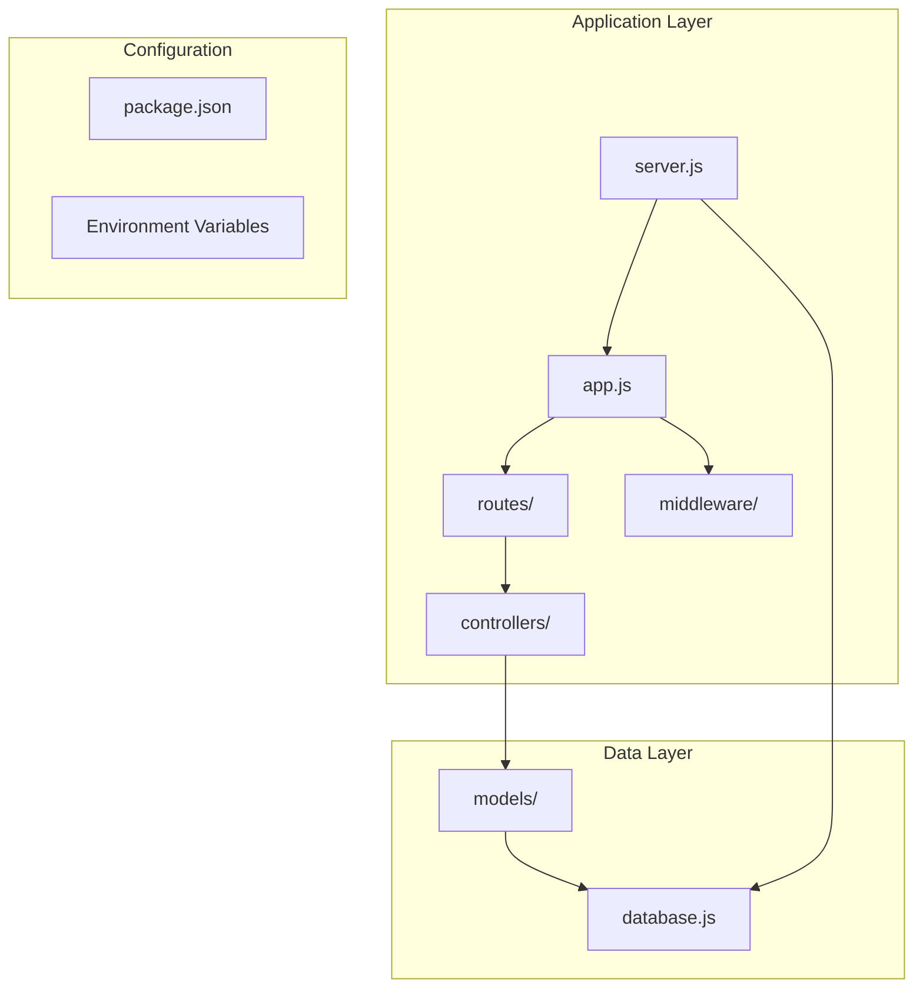
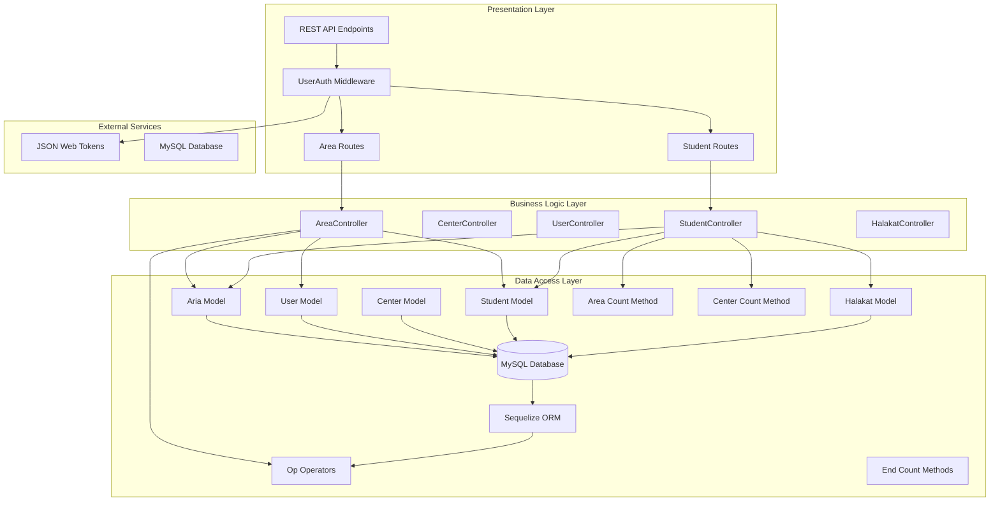
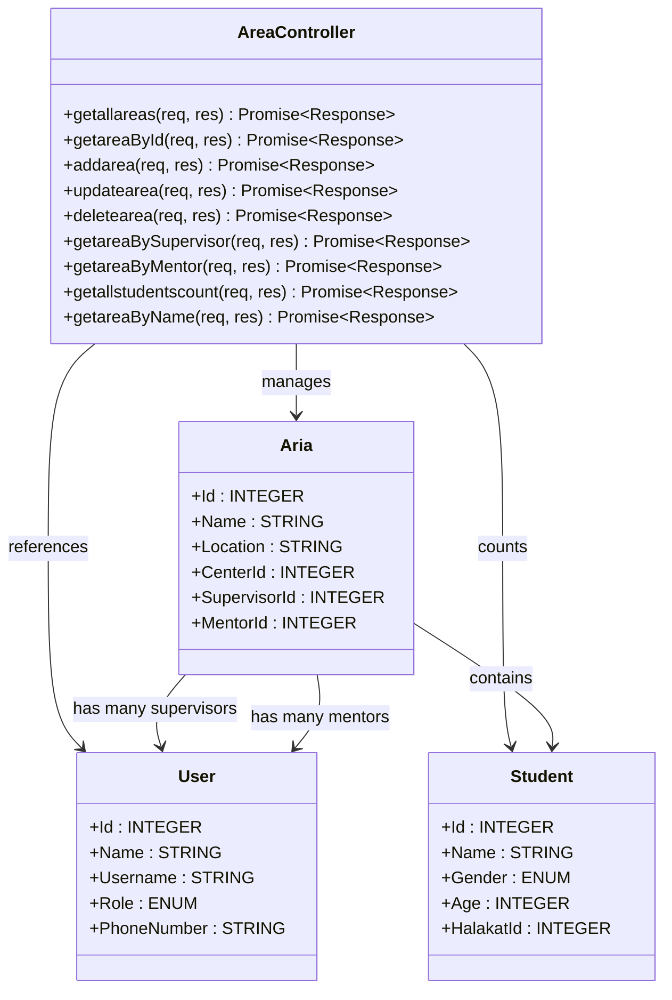
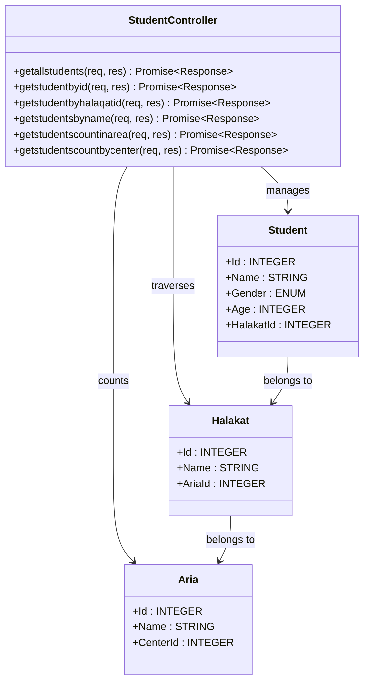
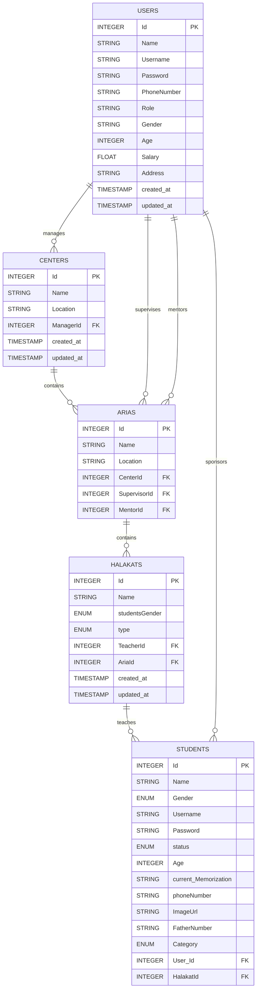
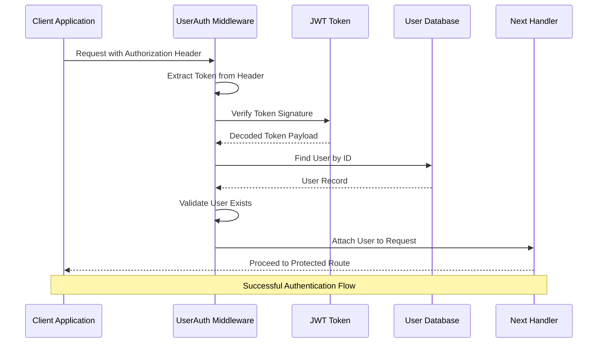
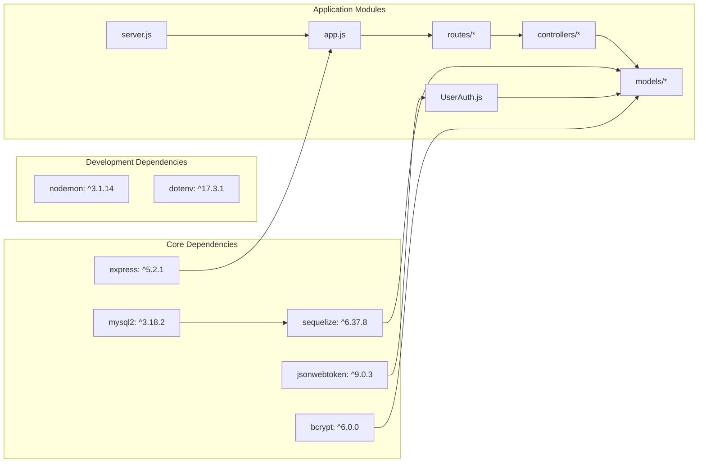

# Area Management System

<cite>
**Referenced Files in This Document**
- [server.js](file://backend/server.js)
- [app.js](file://backend/src/config/app.js)
- [database.js](file://backend/src/config/database.js)
- [UserAuth.js](file://backend/src/middleware/UserAuth.js)
- [areaRouts.js](file://backend/src/routes/areaRouts.js)
- [AreaController.js](file://backend/src/controllers/AreaController.js)
- [studentRouts.js](file://backend/src/routes/studentRouts.js)
- [StudentController.js](file://backend/src/controllers/StudentController.js)
- [Aria.js](file://backend/src/models/Aria.js)
- [User.js](file://backend/src/models/User.js)
- [Center.js](file://backend/src/models/Center.js)
- [Halakat.js](file://backend/src/models/Halakat.js)
- [Student.js](file://backend/src/models/Student.js)
- [index.js](file://backend/src/models/index.js)
- [package.json](file://backend/package.json)
- [README.md](file://README.md)
</cite>

## Update Summary
**Changes Made**
- Updated AreaController documentation to include new getareaByName endpoint with Sequelize Op operators
- Added new student counting methods documentation: getstudentscountinarea and getstudentscountbycenter
- Enhanced route configuration documentation to show consistent middleware usage
- Added documentation for advanced querying capabilities using Sequelize operators
- Updated StudentController documentation to include new counting endpoints
- Enhanced area search functionality documentation with pattern matching capabilities

## Table of Contents
1. [Introduction](#introduction)
2. [Project Structure](#project-structure)
3. [Core Components](#core-components)
4. [Architecture Overview](#architecture-overview)
5. [Detailed Component Analysis](#detailed-component-analysis)
6. [Dependency Analysis](#dependency-analysis)
7. [Performance Considerations](#performance-considerations)
8. [Troubleshooting Guide](#troubleshooting-guide)
9. [Conclusion](#conclusion)

## Introduction
The Area Management System is a comprehensive backend solution designed to manage educational areas within a larger institutional framework. The system provides functionality for managing areas, supervisors, mentors, centers, and their associated entities. Built with Node.js and Express, it utilizes Sequelize ORM for database operations and JWT-based authentication for secure access control.

The system serves as a centralized platform for educational administration, enabling efficient management of area-based learning environments, staff assignments, and student enrollment tracking. It supports multiple roles including administrators, supervisors, mentors, teachers, and students, each with specific permissions and responsibilities within the educational hierarchy.

**Updated** Enhanced with advanced search capabilities using Sequelize Op operators, new student counting methods for area and center-level analytics, and improved authentication middleware consistency.

## Project Structure
The backend follows a modular architecture organized into distinct layers:



**Diagram sources**
- [server.js:1-26](file://backend/server.js#L1-L26)
- [app.js:1-25](file://backend/src/config/app.js#L1-L25)
- [database.js:1-16](file://backend/src/config/database.js#L1-L16)

The project structure demonstrates a clean separation of concerns with clear boundaries between presentation, business logic, and data access layers. Each module serves a specific purpose in the overall system architecture.

**Section sources**
- [server.js:1-26](file://backend/server.js#L1-L26)
- [app.js:1-25](file://backend/src/config/app.js#L1-L25)
- [package.json:1-14](file://backend/package.json#L1-L14)

## Core Components

### Authentication System
The authentication middleware provides JWT-based security across all protected routes. The system now uses the dedicated `UserAuth.js` middleware which validates tokens from Authorization headers, verifies JWT signatures using environment secrets, and attaches user context to request objects. This middleware is consistently applied to all area management routes for enhanced security.

### Area Management Controller
The AreaController handles all area-related operations including CRUD operations, staff assignments, student count calculations, and advanced search functionality. The controller now includes a sophisticated `getareaByName` method that utilizes Sequelize's Op operators for pattern matching and flexible querying capabilities.

### Student Analytics Controller
The StudentController provides comprehensive student management and analytics functionality. The controller includes new student counting methods: `getstudentscountinarea` for counting students within a specific area, and `getstudentscountbycenter` for counting students across all areas within a center. These methods utilize nested includes to traverse the relationship chain from students through halakats to areas and centers.

### Database Models
The system includes six primary models representing different aspects of the educational hierarchy: Areas, Centers, Users, Students, Halakats (classes), and their relationships. These models define the data structure and business rules for the entire system, with the Aria model specifically supporting the new name-based search functionality.

**Updated** Enhanced with advanced querying capabilities through Sequelize Op operators integration and new student counting analytics.

**Section sources**
- [UserAuth.js:1-25](file://backend/src/middleware/UserAuth.js#L1-L25)
- [AreaController.js:1-205](file://backend/src/controllers/AreaController.js#L1-L205)
- [StudentController.js:299-345](file://backend/src/controllers/StudentController.js#L299-L345)
- [Aria.js:1-59](file://backend/src/models/Aria.js#L1-L59)

## Architecture Overview



**Diagram sources**
- [areaRouts.js:1-20](file://backend/src/routes/areaRouts.js#L1-L20)
- [studentRouts.js:1-24](file://backend/src/routes/studentRouts.js#L1-L24)
- [AreaController.js:1-205](file://backend/src/controllers/AreaController.js#L1-L205)
- [StudentController.js:299-345](file://backend/src/controllers/StudentController.js#L299-L345)
- [index.js:1-91](file://backend/src/models/index.js#L1-L91)

The architecture follows a layered pattern with clear separation between presentation, business logic, and data access layers. The system utilizes asynchronous operations throughout to maintain responsiveness and scalability, with enhanced querying capabilities through Sequelize's Op operators and sophisticated student counting analytics.

## Detailed Component Analysis

### Area Management Controller Implementation



**Diagram sources**
- [AreaController.js:1-205](file://backend/src/controllers/AreaController.js#L1-L205)
- [Aria.js:1-59](file://backend/src/models/Aria.js#L1-L59)
- [User.js:1-83](file://backend/src/models/User.js#L1-L83)
- [Student.js:1-105](file://backend/src/models/Student.js#L1-L105)

The AreaController implements comprehensive CRUD operations with additional business logic for staff assignments and student tracking. The new `getareaByName` method demonstrates advanced querying capabilities using Sequelize's Op operators for pattern matching. Each method includes proper error handling and response formatting.

### Student Analytics Controller Implementation



**Diagram sources**
- [StudentController.js:299-345](file://backend/src/controllers/StudentController.js#L299-L345)
- [Student.js:1-118](file://backend/src/models/Student.js#L1-L118)
- [Halakat.js:1-43](file://backend/src/models/Halakat.js#L1-L43)
- [Aria.js:1-59](file://backend/src/models/Aria.js#L1-L59)

The StudentController provides comprehensive student management with new analytics capabilities. The `getstudentscountinarea` method performs a count operation with nested includes to traverse from students through halakats to areas, while `getstudentscountbycenter` extends this traversal to include the center level. Both methods use Sequelize's count() function for efficient database-level counting operations.

### Advanced Querying with Sequelize Op Operators

The system now leverages Sequelize's Op operators for sophisticated database querying. The `getareaByName` method utilizes the `[Op.like]` operator to enable partial string matching, allowing users to search for areas by name fragments. This enhancement provides flexible search capabilities beyond exact matches.

```javascript
// Example of Op operators usage in getareaByName
const area = await Area.findAll({
  where: {
    Name: {
      [Op.like]: `%${name}%`
    }
  }
});
```

**Updated** Added documentation for advanced querying capabilities using Sequelize Op operators.

### Sophisticated Student Counting Operations

The StudentController implements two new counting methods that demonstrate advanced Sequelize querying capabilities:

#### Area-Level Student Counting
The `getstudentscountinarea` method performs a count operation that traverses the relationship chain: Students → Halakats → Areas. It uses nested includes with required constraints to ensure only students enrolled in specific areas are counted.

#### Center-Level Student Counting  
The `getstudentscountbycenter` method extends this capability to count students across all areas within a specific center. It uses a nested include structure: Students → Halakats → Areas → Centers, with the center ID as the filtering criteria.

```javascript
// Example of area-level counting
const count = await Student.count({
  include: [{
    model: Halakat,
    as: 'StudentHalakat',
    where: { AriaId: areaid },
    required: true
  }]
});

// Example of center-level counting
const count = await Student.count({
  include: [{
    model: Halakat,
    as: 'StudentHalakat',
    required: true,
    include: [{
      model: Aria,
      as: 'Aria',
      where: { CenterId: centerid },
      required: true
    }]
  }]
});
```

**Updated** Added comprehensive documentation for new student counting methods with detailed examples.

### Database Schema Relationships



**Diagram sources**
- [index.js:16-72](file://backend/src/models/index.js#L16-L72)
- [Aria.js:20-48](file://backend/src/models/Aria.js#L20-L48)
- [User.js:8-64](file://backend/src/models/User.js#L8-L64)
- [Center.js:8-28](file://backend/src/models/Center.js#L8-L28)
- [Halakat.js:28-43](file://backend/src/models/Halakat.js#L28-L43)
- [Student.js:72-88](file://backend/src/models/Student.js#L72-L88)

The database schema establishes clear relationships between entities, supporting the hierarchical structure of the educational institution. Foreign key constraints ensure referential integrity across the system, with the Aria model supporting the new name-based search functionality.

### Authentication Flow



**Diagram sources**
- [UserAuth.js:4-24](file://backend/src/middleware/UserAuth.js#L4-L24)

The authentication system provides robust security through JWT verification and user validation, ensuring only authorized users can access protected endpoints. The middleware is consistently applied across all area management routes for uniform security enforcement.

**Section sources**
- [AreaController.js:7-29](file://backend/src/controllers/AreaController.js#L7-L29)
- [AreaController.js:111-134](file://backend/src/controllers/AreaController.js#L111-L134)
- [AreaController.js:162-190](file://backend/src/controllers/AreaController.js#L162-L190)
- [StudentController.js:299-345](file://backend/src/controllers/StudentController.js#L299-L345)
- [UserAuth.js:1-25](file://backend/src/middleware/UserAuth.js#L1-L25)

## Dependency Analysis



**Diagram sources**
- [package.json:2-12](file://backend/package.json#L2-L12)
- [server.js:1-26](file://backend/server.js#L1-L26)
- [app.js:1-25](file://backend/src/config/app.js#L1-L25)

The dependency graph reveals a well-structured application with clear external dependencies and internal module relationships. The system leverages modern Node.js development practices with appropriate version constraints, including the new Sequelize Op operators for advanced querying capabilities and sophisticated student counting operations.

**Section sources**
- [package.json:1-14](file://backend/package.json#L1-L14)
- [index.js:78-91](file://backend/src/models/index.js#L78-L91)

## Performance Considerations

### Database Optimization Strategies
- **Connection Pooling**: Sequelize automatically manages connection pools for optimal database performance
- **Lazy Loading**: Associations are loaded only when explicitly requested via include statements
- **Indexing**: Foreign key relationships benefit from automatic indexing by Sequelize
- **Query Optimization**: Bulk operations and batch processing reduce database overhead
- **Advanced Querying**: Sequelize Op operators enable efficient pattern matching and complex queries
- **Count Operations**: Using count() with includes provides efficient database-level counting without loading full result sets
- **Nested Includes**: Optimized traversal through relationships minimizes query complexity

### Caching Opportunities
- **User Sessions**: JWT tokens eliminate database lookups for authenticated users
- **Static Content**: Express static file serving reduces server load
- **Query Results**: Consider implementing application-level caching for frequently accessed data
- **Search Results**: Cache common search patterns for improved response times
- **Analytics Data**: Cache student count results for frequently accessed areas and centers

### Scalability Factors
- **Horizontal Scaling**: Stateless design allows for easy horizontal scaling
- **Database Scaling**: MySQL2 driver supports various database optimization techniques
- **Load Distribution**: Modular architecture enables microservice-style deployment
- **Query Performance**: Op operators support efficient filtering and pattern matching
- **Analytics Scalability**: Separate student counting endpoints reduce query complexity

## Troubleshooting Guide

### Common Issues and Solutions

**Authentication Problems**
- Verify JWT_SECRET environment variable is properly configured
- Check token format: "Bearer <token>"
- Ensure user records exist in database with valid IDs
- Confirm UserAuth middleware is properly applied to all routes

**Database Connection Issues**
- Confirm database credentials in environment variables
- Verify MySQL server is accessible and running
- Check network connectivity and firewall settings

**Route Access Issues**
- Ensure UserAuth middleware is properly applied to all area routes
- Verify route endpoints match controller method names
- Check for proper error handling in controller methods

**Advanced Query Issues**
- Verify Sequelize Op operators are properly imported
- Check pattern matching syntax for name searches
- Ensure database indexes support LIKE operations

**Student Counting Issues**
- Verify area IDs and center IDs are valid integers
- Check that relationships exist between students, halakats, and areas
- Ensure required constraints are properly set in nested includes
- Verify database connections support complex join operations

**Data Validation Errors**
- Validate request payload structure matches model definitions
- Check for required fields and data type constraints
- Ensure foreign key relationships are maintained

**Section sources**
- [UserAuth.js:5-24](file://backend/src/middleware/UserAuth.js#L5-L24)
- [server.js:10-22](file://backend/server.js#L10-L22)
- [AreaController.js:26-28](file://backend/src/controllers/AreaController.js#L26-L28)
- [StudentController.js:300-345](file://backend/src/controllers/StudentController.js#L300-L345)

## Conclusion

The Area Management System represents a well-architected backend solution for educational institution management. The system demonstrates strong architectural principles with clear separation of concerns, comprehensive authentication, and robust data modeling.

Key enhancements include:
- **Advanced Search Capabilities**: New getareaByName endpoint with Sequelize Op operators enables flexible pattern matching
- **Enhanced Security**: Consistent UserAuth middleware application ensures uniform authentication across all routes
- **Sophisticated Analytics**: New student counting methods provide area and center-level student analytics
- **Modular Design**: Clean separation between layers enables maintainability and scalability
- **Security Focus**: JWT-based authentication provides strong access control
- **Data Integrity**: Comprehensive foreign key relationships ensure referential consistency
- **Extensibility**: Well-defined interfaces support future feature additions

The system provides a solid foundation for educational management with room for enhancement in areas such as advanced caching, monitoring, and distributed deployment capabilities. The comprehensive API coverage, sophisticated querying capabilities, and thoughtful error handling make it suitable for production deployment in educational environments.

**Updated** Recent enhancements significantly improve search functionality, security consistency, and analytical capabilities, making the system more robust and user-friendly for educational institution management. The addition of student counting methods provides valuable insights for administrative decision-making and resource allocation.