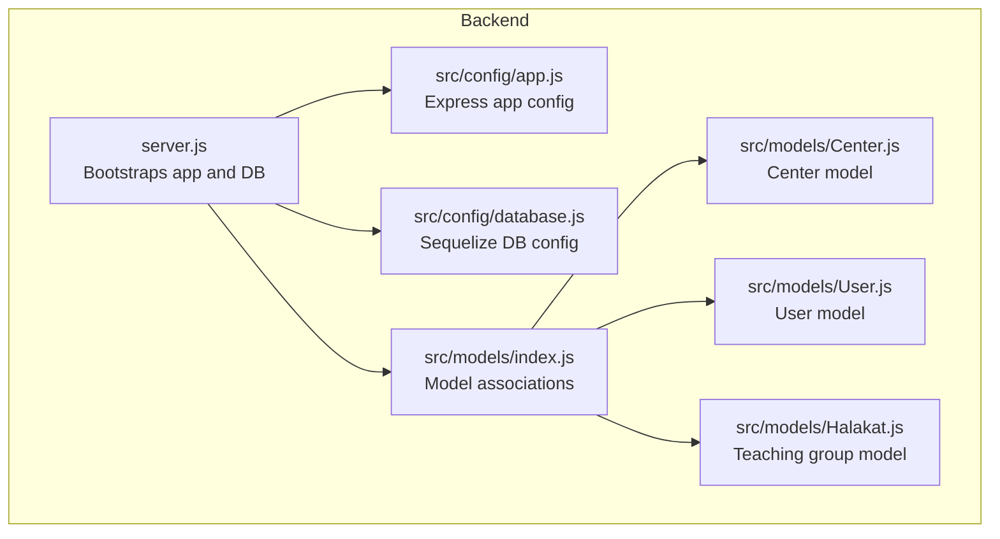
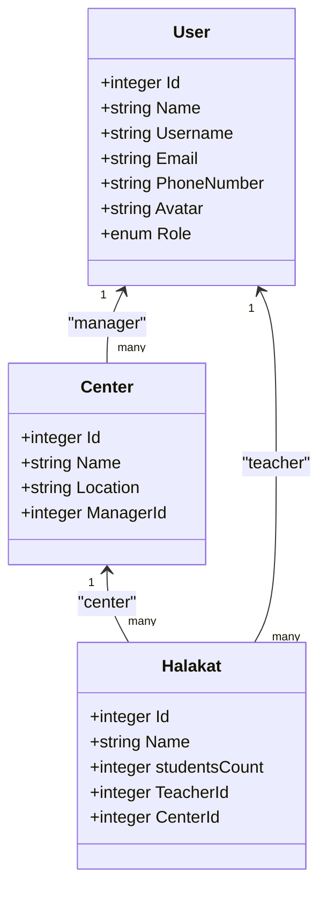
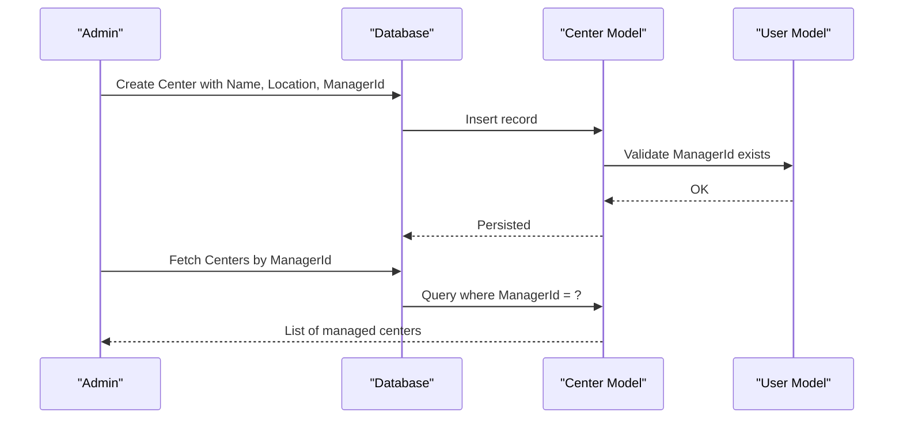
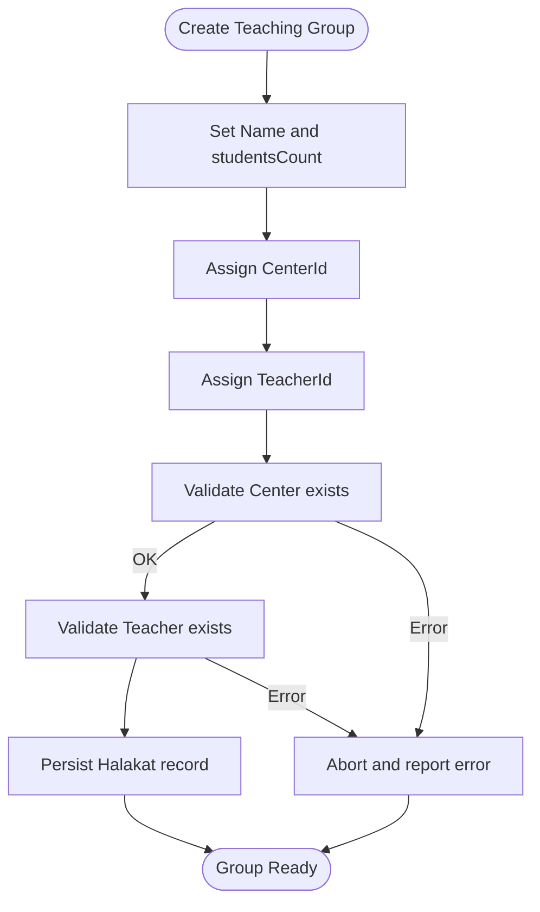
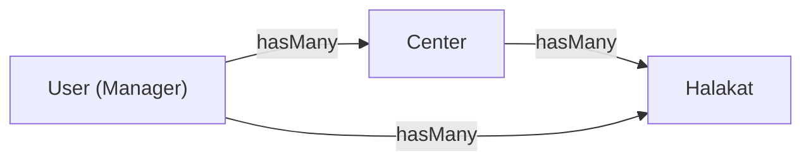
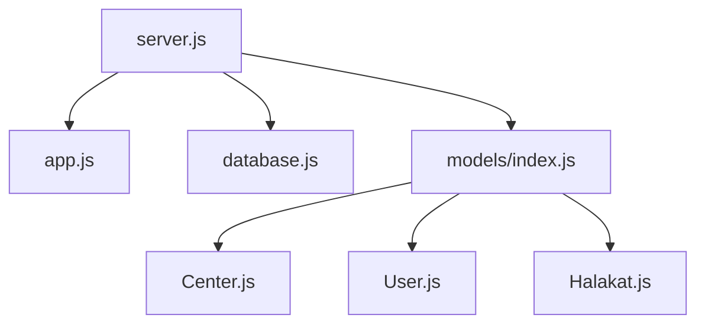

# Center Administration

<cite>
**Referenced Files in This Document**
- [Center.js](file://backend/src/models/Center.js)
- [User.js](file://backend/src/models/User.js)
- [index.js](file://backend/src/models/index.js)
- [Halakat.js](file://backend/src/models/Halakat.js)
- [server.js](file://backend/server.js)
- [app.js](file://backend/src/config/app.js)
- [database.js](file://backend/src/config/database.js)
</cite>

## Table of Contents
1. [Introduction](#introduction)
2. [Project Structure](#project-structure)
3. [Core Components](#core-components)
4. [Architecture Overview](#architecture-overview)
5. [Detailed Component Analysis](#detailed-component-analysis)
6. [Dependency Analysis](#dependency-analysis)
7. [Performance Considerations](#performance-considerations)
8. [Troubleshooting Guide](#troubleshooting-guide)
9. [Conclusion](#conclusion)
10. [Appendices](#appendices)

## Introduction
This document explains the center administration subsystem for the Khirocom system, focusing on educational institution management. It covers the Center model, manager assignments, location-based organization, center hierarchy, and relationships with users and teaching groups. It also outlines CRUD operations, capacity management, resource allocation, reporting, dashboards, configuration options, and integrations with teaching groups and student enrollment.

## Project Structure
The center administration is implemented using a Node.js/Express backend with Sequelize ORM and MySQL persistence. The relevant components are:
- Models: Center, User, Halakat (teaching group), and model associations
- Configuration: Express app and database connection
- Bootstrapping: Server startup and model synchronization

**Diagram sources**
- [server.js:1-25](file://backend/server.js#L1-L25)
- [app.js:1-12](file://backend/src/config/app.js#L1-L12)
- [database.js:1-15](file://backend/src/config/database.js#L1-L15)
- [index.js:1-52](file://backend/src/models/index.js#L1-L52)
- [Center.js:1-39](file://backend/src/models/Center.js#L1-L39)
- [User.js:1-59](file://backend/src/models/User.js#L1-L59)
- [Halakat.js:1-46](file://backend/src/models/Halakat.js#L1-L46)

**Section sources**
- [server.js:1-25](file://backend/server.js#L1-L25)
- [app.js:1-12](file://backend/src/config/app.js#L1-L12)
- [database.js:1-15](file://backend/src/config/database.js#L1-L15)
- [index.js:1-52](file://backend/src/models/index.js#L1-L52)

## Core Components
- Center model
  - Fields: identifier, name, location, manager reference
  - Relationship: one-to-many with User (manager), one-to-many with Halakat (teaching groups)
- User model
  - Fields: personal info, credentials, contact, avatar, role enumeration
  - Relationship: one-to-many with Center (managed centers)
- Halakat model
  - Fields: identifier, name, student count, teacher reference, center reference
  - Relationship: belongs-to Center and User (teacher)

These models define the administrative boundaries and data isolation for centers, managers, and teaching groups.

**Section sources**
- [Center.js:1-39](file://backend/src/models/Center.js#L1-L39)
- [User.js:1-59](file://backend/src/models/User.js#L1-L59)
- [Halakat.js:1-46](file://backend/src/models/Halakat.js#L1-L46)
- [index.js:12-41](file://backend/src/models/index.js#L12-L41)

## Architecture Overview
The center administration relies on explicit model associations to enforce center-manager relationships and center-teaching-group hierarchies. The server initializes the Express app, authenticates and syncs the database, and exposes the model registry for downstream use.

**Diagram sources**
- [User.js:1-59](file://backend/src/models/User.js#L1-L59)
- [Center.js:1-39](file://backend/src/models/Center.js#L1-L39)
- [Halakat.js:1-46](file://backend/src/models/Halakat.js#L1-L46)
- [index.js:12-41](file://backend/src/models/index.js#L12-L41)

## Detailed Component Analysis

### Center Model and Manager Assignment
- Center definition
  - Identifier, name, location, and manager reference
  - ManagerId references User.Id
- Manager assignment workflow
  - Assign a User with appropriate role as Center.ManagerId
  - Managers own centers and can manage related teaching groups
- Data isolation
  - Center.Location enables geographic or administrative grouping
  - Center.ManagerId ensures per-center administrative ownership

**Diagram sources**
- [Center.js:6-36](file://backend/src/models/Center.js#L6-L36)
- [User.js:1-59](file://backend/src/models/User.js#L1-L59)
- [index.js:14-16](file://backend/src/models/index.js#L14-L16)

**Section sources**
- [Center.js:1-39](file://backend/src/models/Center.js#L1-L39)
- [index.js:14-16](file://backend/src/models/index.js#L14-L16)

### Teaching Groups (Halakat) Under Centers
- Halakat belongs to a Center via CenterId
- Halakat belongs to a User as Teacher via TeacherId
- Capacity management
  - studentsCount field indicates current headcount
  - Used to enforce capacity limits and allocate resources
- Resource allocation
  - Teachers assigned per Halakat
  - Students enrolled into Halakats, enabling progress tracking

**Diagram sources**
- [Halakat.js:6-44](file://backend/src/models/Halakat.js#L6-L44)
- [index.js:22-28](file://backend/src/models/index.js#L22-L28)

**Section sources**
- [Halakat.js:1-46](file://backend/src/models/Halakat.js#L1-L46)
- [index.js:22-28](file://backend/src/models/index.js#L22-L28)

### Center Hierarchy and Administrative Boundaries
- One center can contain multiple teaching groups
- Managers are responsible for centers and associated Halakat records
- Administrative boundaries
  - Center.Location supports geographic or institutional grouping
  - Center.ManagerId enforces ownership and access control

**Diagram sources**
- [index.js:14-24](file://backend/src/models/index.js#L14-L24)

**Section sources**
- [index.js:14-24](file://backend/src/models/index.js#L14-L24)

### Center CRUD Operations
- Create
  - POST endpoint to create a Center with Name, Location, ManagerId
- Read
  - GET endpoints to fetch centers by manager or by center id
- Update
  - PATCH/PUT to update Name, Location, or ManagerId
- Delete
  - DELETE to remove a Center (consider cascade rules for dependent Halakat)

Note: The current repository does not include route/controller files. The above describes the intended operations based on the model definitions.

**Section sources**
- [Center.js:6-36](file://backend/src/models/Center.js#L6-L36)
- [index.js:14-16](file://backend/src/models/index.js#L14-L16)

### Capacity Management and Resource Allocation
- Capacity management
  - Use studentsCount in Halakat to track current enrollment
  - Enforce limits during student enrollment
- Resource allocation
  - Assign teachers to Halakats via TeacherId
  - Allocate classrooms or facilities per Center

**Section sources**
- [Halakat.js:17-28](file://backend/src/models/Halakat.js#L17-L28)

### Center Reporting and Administrative Dashboards
- Reporting
  - Aggregate counts by Center (e.g., total Halakat, total students)
  - Filter by Location for geographic reporting
- Dashboards
  - Manager dashboard: list of managed centers, associated Halakat counts, and recent activity
  - Admin dashboard: cross-center utilization, capacity trends, and performance metrics

Note: These features require endpoints and queries not present in the current repository.

**Section sources**
- [index.js:22-28](file://backend/src/models/index.js#L22-L28)

### Center Configuration Options and Operational Settings
- Configuration
  - Center.Name: display and administrative label
  - Center.Location: geographic or administrative grouping
  - Center.ManagerId: administrative ownership
- Operational settings
  - Use User.Role to distinguish administrators, supervisors, and managers
  - Operational policies can be enforced at the application level (not shown in current code)

**Section sources**
- [Center.js:13-28](file://backend/src/models/Center.js#L13-L28)
- [User.js:44-48](file://backend/src/models/User.js#L44-L48)

### Integration with Teaching Groups and Student Enrollment
- Teaching groups
  - Halakat.CenterId links groups to centers
  - Halakat.TeacherId links groups to teachers
- Student enrollment
  - Students belong to Halakats (via foreign keys in Student model)
  - Enables progress tracking, ratings, and planes per group

Note: The Student model is defined in the models index; integration details depend on route/controller implementations not included here.

**Section sources**
- [index.js:26-40](file://backend/src/models/index.js#L26-L40)

## Dependency Analysis
The center administration depends on:
- Express app for routing and middleware
- Sequelize ORM for model definitions and associations
- MySQL database for persistence
- Environment variables for database configuration

**Diagram sources**
- [server.js:1-25](file://backend/server.js#L1-L25)
- [app.js:1-12](file://backend/src/config/app.js#L1-L12)
- [database.js:1-15](file://backend/src/config/database.js#L1-L15)
- [index.js:1-52](file://backend/src/models/index.js#L1-L52)
- [Center.js:1-39](file://backend/src/models/Center.js#L1-L39)
- [User.js:1-59](file://backend/src/models/User.js#L1-L59)
- [Halakat.js:1-46](file://backend/src/models/Halakat.js#L1-L46)

**Section sources**
- [server.js:1-25](file://backend/server.js#L1-L25)
- [app.js:1-12](file://backend/src/config/app.js#L1-L12)
- [database.js:1-15](file://backend/src/config/database.js#L1-L15)
- [index.js:1-52](file://backend/src/models/index.js#L1-L52)

## Performance Considerations
- Indexing
  - Add indexes on Center.ManagerId, Halakat.CenterId, and Halakat.TeacherId for efficient joins
- Queries
  - Use eager loading for Center.Centers and Center.CenterHalakat to minimize round-trips
- Synchronization
  - The server uses alter-based sync; production environments should prefer migrations for controlled schema changes

[No sources needed since this section provides general guidance]

## Troubleshooting Guide
- Database connectivity
  - Verify environment variables for DB_NAME, DB_USER, DB_PASSWORD, DB_HOST, DB_PORT
- Model synchronization
  - Confirm that models are registered and associations are defined
- Authentication errors
  - Ensure database credentials are correct and the service account has privileges

**Section sources**
- [database.js:1-15](file://backend/src/config/database.js#L1-L15)
- [server.js:8-23](file://backend/server.js#L8-L23)
- [index.js:1-52](file://backend/src/models/index.js#L1-L52)

## Conclusion
The Khirocom center administration leverages a clean model layer with explicit associations between centers, users (managers), and teaching groups. While the current repository defines the models and associations, implementing routes, controllers, and endpoints is required to support full CRUD, reporting, and dashboards. Administrators can manage centers, assign managers, organize teaching groups, and integrate with student enrollment through the defined relationships.

[No sources needed since this section summarizes without analyzing specific files]

## Appendices

### Practical Examples (Conceptual)
- Center setup
  - Create a Center with a unique Name, Location, and assign a ManagerId
- Manager assignment
  - Assign a User with Role as manager to a Center
- Center-specific data isolation
  - Query centers by ManagerId and filter Halakat by CenterId
- Capacity management
  - Enforce studentsCount thresholds when enrolling students into Halakat
- Reporting
  - Aggregate counts by Center and export to dashboards

[No sources needed since this section provides general guidance]