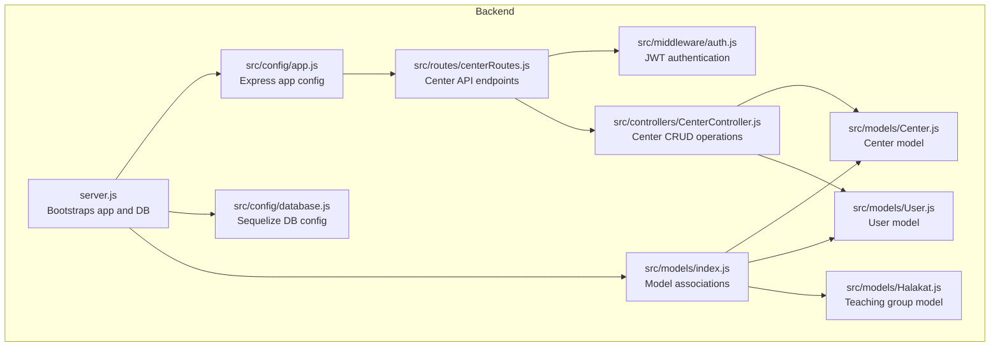
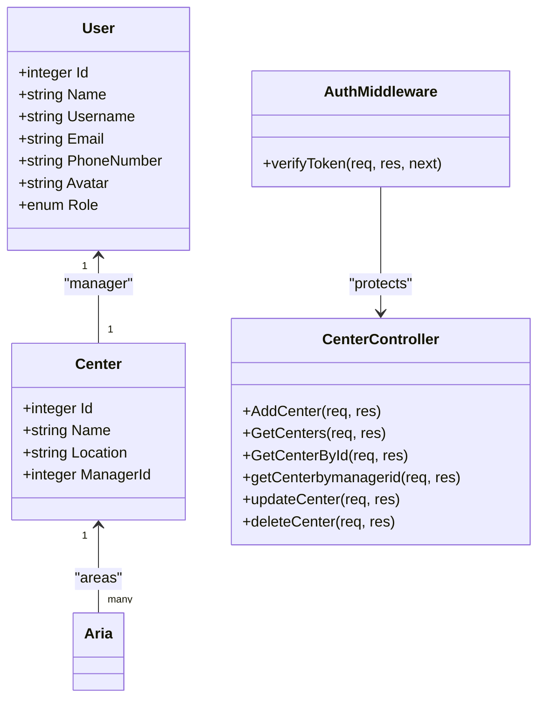
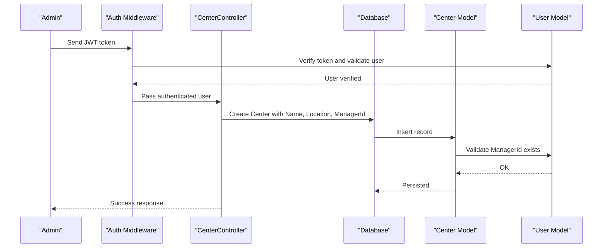
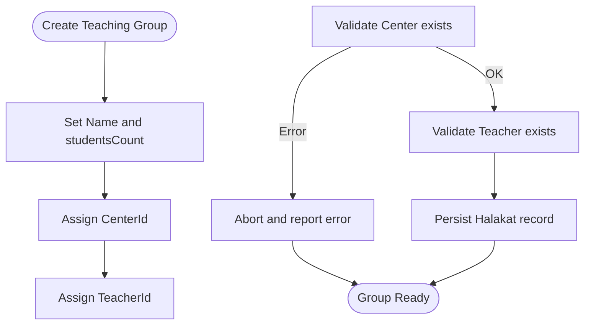
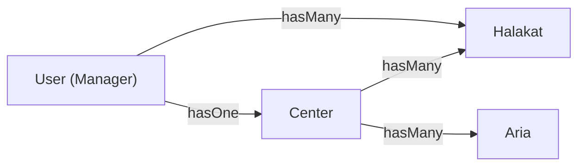
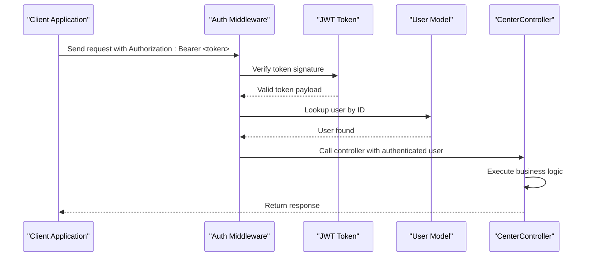
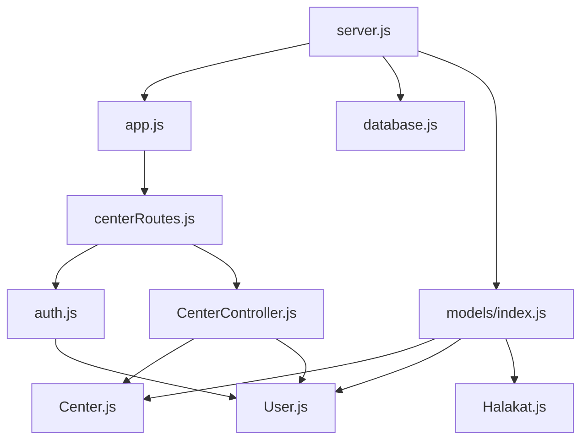

# Center Administration

<cite>
**Referenced Files in This Document**
- [Center.js](file://backend/src/models/Center.js)
- [User.js](file://backend/src/models/User.js)
- [index.js](file://backend/src/models/index.js)
- [CenterController.js](file://backend/src/controllers/CenterController.js)
- [centerRoutes.js](file://backend/src/routes/centerRoutes.js)
- [auth.js](file://backend/src/middleware/auth.js)
- [server.js](file://backend/server.js)
- [app.js](file://backend/src/config/app.js)
- [database.js](file://backend/src/config/database.js)
</cite>

## Update Summary
**Changes Made**
- Added comprehensive CenterController with full CRUD operations (AddCenter, GetCenters, GetCenterById, getCenterbymanagerid, updateCenter, deleteCenter)
- Integrated centerRoutes.js with authentication middleware for secure API access
- Enhanced database relationships supporting center management functionality
- Implemented JWT authentication middleware for secure center operations
- Added proper API endpoints for center management with comprehensive error handling

## Table of Contents
1. [Introduction](#introduction)
2. [Project Structure](#project-structure)
3. [Core Components](#core-components)
4. [Architecture Overview](#architecture-overview)
5. [Detailed Component Analysis](#detailed-component-analysis)
6. [API Endpoints and Authentication](#api-endpoints-and-authentication)
7. [Dependency Analysis](#dependency-analysis)
8. [Performance Considerations](#performance-considerations)
9. [Troubleshooting Guide](#troubleshooting-guide)
10. [Conclusion](#conclusion)
11. [Appendices](#appendices)

## Introduction
This document explains the center administration subsystem for the Khirocom system, focusing on educational institution management. The system now includes a comprehensive CenterController with full CRUD operations, proper authentication middleware integration, and enhanced database relationships supporting center management functionality. It covers the Center model, manager assignments, location-based organization, center hierarchy, and relationships with users and teaching groups. It also outlines CRUD operations, capacity management, resource allocation, reporting, dashboards, configuration options, and integrations with teaching groups and student enrollment.

## Project Structure
The center administration is implemented using a Node.js/Express backend with Sequelize ORM and MySQL persistence. The system now includes comprehensive controller and routing infrastructure with authentication middleware. The relevant components are:
- Models: Center, User, Halakat (teaching group), and model associations
- Controllers: CenterController with full CRUD operations
- Routes: centerRoutes.js with authentication middleware
- Middleware: JWT authentication for secure API access
- Configuration: Express app and database connection
- Bootstrapping: Server startup and model synchronization



**Diagram sources**
- [server.js:1-26](file://backend/server.js#L1-L26)
- [app.js:1-18](file://backend/src/config/app.js#L1-L18)
- [database.js:1-16](file://backend/src/config/database.js#L1-L16)
- [index.js:1-91](file://backend/src/models/index.js#L1-L91)
- [Center.js:1-40](file://backend/src/models/Center.js#L1-L40)
- [User.js:1-83](file://backend/src/models/User.js#L1-L83)
- [CenterController.js:1-77](file://backend/src/controllers/CenterController.js#L1-L77)
- [centerRoutes.js:1-14](file://backend/src/routes/centerRoutes.js#L1-L14)
- [auth.js:1-25](file://backend/src/middleware/auth.js#L1-L25)

**Section sources**
- [server.js:1-26](file://backend/server.js#L1-L26)
- [app.js:1-18](file://backend/src/config/app.js#L1-L18)
- [database.js:1-16](file://backend/src/config/database.js#L1-L16)
- [index.js:1-91](file://backend/src/models/index.js#L1-L91)

## Core Components
- Center model
  - Fields: Id, Name, Location, ManagerId (foreign key to User)
  - Relationship: one-to-one with User (manager), one-to-many with Aria (areas)
- User model
  - Fields: personal info, credentials, contact, avatar, role enumeration
  - Relationship: one-to-one with Center (managed center)
- CenterController
  - Full CRUD operations: create, read, update, delete centers
  - Manager-specific operations: get centers by manager ID
  - Response handling with proper HTTP status codes and error management
- centerRoutes.js
  - RESTful API endpoints: POST /centers/addCenter, GET /centers/getCenters, GET /centers/getCenterById, GET /centers/getCenterbymanagerid, PUT /centers/updateCenter, DELETE /centers/deleteCenter
  - Authentication middleware integration for all endpoints
- Authentication middleware
  - JWT token verification for secure API access
  - User validation and session management with comprehensive error handling

These components define the administrative boundaries and data isolation for centers, managers, and teaching groups with full CRUD functionality and robust security measures.

**Section sources**
- [Center.js:1-40](file://backend/src/models/Center.js#L1-L40)
- [User.js:1-83](file://backend/src/models/User.js#L1-L83)
- [CenterController.js:1-77](file://backend/src/controllers/CenterController.js#L1-L77)
- [centerRoutes.js:1-14](file://backend/src/routes/centerRoutes.js#L1-L14)
- [auth.js:1-25](file://backend/src/middleware/auth.js#L1-L25)
- [index.js:21-23](file://backend/src/models/index.js#L21-L23)

## Architecture Overview
The center administration now includes a complete MVC architecture with authentication middleware. The system relies on explicit model associations to enforce center-manager relationships and center-teaching-group hierarchies. The server initializes the Express app, authenticates and syncs the database, and exposes the model registry for downstream use. The new architecture includes comprehensive API endpoints with proper authentication for secure center management operations.



**Diagram sources**
- [User.js:1-83](file://backend/src/models/User.js#L1-L83)
- [Center.js:1-40](file://backend/src/models/Center.js#L1-L40)
- [CenterController.js:1-77](file://backend/src/controllers/CenterController.js#L1-L77)
- [auth.js:1-25](file://backend/src/middleware/auth.js#L1-L25)
- [index.js:17-18](file://backend/src/models/index.js#L17-L18)

## Detailed Component Analysis

### Center Model and Manager Assignment
- Center definition
  - Identifier (auto-increment), name, location, and manager reference
  - ManagerId references User.Id with foreign key constraint
- Manager assignment workflow
  - Assign a User with appropriate role as Center.ManagerId
  - Managers own centers and can manage related teaching groups
- Data isolation
  - Center.Location enables geographic or administrative grouping
  - Center.ManagerId ensures per-center administrative ownership



**Diagram sources**
- [CenterController.js:4-11](file://backend/src/controllers/CenterController.js#L4-L11)
- [auth.js:4-25](file://backend/src/middleware/auth.js#L4-L25)
- [Center.js:21-28](file://backend/src/models/Center.js#L21-L28)
- [User.js:1-83](file://backend/src/models/User.js#L1-L83)

**Section sources**
- [Center.js:1-40](file://backend/src/models/Center.js#L1-L40)
- [index.js:21-23](file://backend/src/models/index.js#L21-L23)
- [CenterController.js:4-11](file://backend/src/controllers/CenterController.js#L4-L11)

### CenterController CRUD Operations
The CenterController provides comprehensive CRUD functionality with proper error handling and response formatting:

- **Create Center (POST /centers/addCenter)**
  - Creates new centers with validation
  - Returns success message and center data with 201 status
  - Handles database errors gracefully with 500 status

- **Get All Centers (GET /centers/getCenters)**
  - Retrieves all centers with manager information
  - Uses eager loading to include manager details via association
  - Returns paginated results with proper formatting and 200 status

- **Get Center by ID (GET /centers/getCenterById)**
  - Fetches specific center by ID
  - Includes manager association data
  - Handles not found scenarios with appropriate error responses

- **Get Centers by Manager (GET /centers/getCenterbymanagerid)**
  - Retrieves centers managed by authenticated user
  - Uses JWT-parsed user ID for filtering
  - Includes manager information in response with 200 status

- **Update Center (PUT /centers/updateCenter)**
  - Updates existing center information
  - Uses authenticated user context for validation
  - Returns success confirmation with 200 status

- **Delete Center (DELETE /centers/deleteCenter)**
  - Removes center records
  - Uses proper cascade handling
  - Returns deletion confirmation with 200 status

**Section sources**
- [CenterController.js:1-77](file://backend/src/controllers/CenterController.js#L1-L77)

### Authentication Middleware Integration
The system implements JWT-based authentication for secure API access:

- **Token Verification**
  - Extracts Authorization header from requests
  - Validates JWT token signature using JWT_SECRET environment variable
  - Decodes user information from token payload

- **User Validation**
  - Verifies user existence in database using decoded ID
  - Sets user object in request context for downstream use
  - Provides error responses for invalid tokens (401 status)

- **Route Protection**
  - All center endpoints require authentication middleware
  - Middleware executes before controller logic
  - Maintains user context throughout request lifecycle

**Section sources**
- [auth.js:1-25](file://backend/src/middleware/auth.js#L1-L25)
- [centerRoutes.js:7-12](file://backend/src/routes/centerRoutes.js#L7-L12)

### Teaching Groups (Halakat) Under Centers
- Halakat belongs to a Center via CenterId
- Halakat belongs to a User as Teacher via TeacherId
- Capacity management
  - studentsCount field indicates current headcount
  - Used to enforce capacity limits and allocate resources
- Resource allocation
  - Teachers assigned per Halakat
  - Students enrolled into Halakats, enabling progress tracking



**Diagram sources**
- [index.js:41-43](file://backend/src/models/index.js#L41-L43)

**Section sources**
- [index.js:41-43](file://backend/src/models/index.js#L41-L43)

### Center Hierarchy and Administrative Boundaries
- One center can contain multiple teaching groups
- Managers are responsible for centers and associated Halakat records
- Administrative boundaries
  - Center.Location supports geographic or institutional grouping
  - Center.ManagerId enforces ownership and access control



**Diagram sources**
- [index.js:17-23](file://backend/src/models/index.js#L17-L23)

**Section sources**
- [index.js:17-23](file://backend/src/models/index.js#L17-L23)

### Center Reporting and Administrative Dashboards
- Reporting
  - Aggregate counts by Center (e.g., total Halakat, total students)
  - Filter by Location for geographic reporting
- Dashboards
  - Manager dashboard: list of managed centers, associated Halakat counts, and recent activity
  - Admin dashboard: cross-center utilization, capacity trends, and performance metrics

Note: These features require endpoints and queries not present in the current repository.

**Section sources**
- [index.js:17-18](file://backend/src/models/index.js#L17-L18)

### Center Configuration Options and Operational Settings
- Configuration
  - Center.Name: display and administrative label
  - Center.Location: geographic or administrative grouping
  - Center.ManagerId: administrative ownership
- Operational settings
  - Use User.Role to distinguish administrators, supervisors, and managers
  - Operational policies can be enforced at the application level (not shown in current code)

**Section sources**
- [Center.js:13-28](file://backend/src/models/Center.js#L13-L28)
- [User.js:39-43](file://backend/src/models/User.js#L39-L43)

### Integration with Teaching Groups and Student Enrollment
- Teaching groups
  - Halakat.CenterId links groups to centers
  - Halakat.TeacherId links groups to teachers
- Student enrollment
  - Students belong to Halakats (via foreign keys in Student model)
  - Enables progress tracking, ratings, and planes per group

Note: The Student model is defined in the models index; integration details depend on route/controller implementations not included here.

**Section sources**
- [index.js:41-43](file://backend/src/models/index.js#L41-L43)

## API Endpoints and Authentication

### RESTful API Endpoints
The center management system provides comprehensive RESTful API endpoints:

- **POST /centers/addCenter**
  - Purpose: Create a new center
  - Authentication: Required (JWT)
  - Request Body: { Name, Location, ManagerId }
  - Response: Center creation confirmation with 201 status

- **GET /centers/getCenters**
  - Purpose: Retrieve all centers with manager information
  - Authentication: Required (JWT)
  - Response: Array of centers with manager details and 200 status

- **GET /centers/getCenterById**
  - Purpose: Get specific center by ID
  - Authentication: Required (JWT)
  - Parameters: Center ID
  - Response: Center details with manager information and 200 status

- **GET /centers/getCenterbymanagerid**
  - Purpose: Get centers managed by authenticated user
  - Authentication: Required (JWT)
  - Response: Array of centers managed by current user with 200 status

- **PUT /centers/updateCenter**
  - Purpose: Update center information
  - Authentication: Required (JWT)
  - Request Body: Partial center data
  - Response: Update confirmation with 200 status

- **DELETE /centers/deleteCenter**
  - Purpose: Remove center
  - Authentication: Required (JWT)
  - Response: Deletion confirmation with 200 status

### Authentication Flow
The system uses JWT-based authentication for all center operations:



**Diagram sources**
- [auth.js:4-25](file://backend/src/middleware/auth.js#L4-L25)
- [centerRoutes.js:7-12](file://backend/src/routes/centerRoutes.js#L7-L12)

**Section sources**
- [centerRoutes.js:1-14](file://backend/src/routes/centerRoutes.js#L1-L14)
- [auth.js:1-25](file://backend/src/middleware/auth.js#L1-L25)

## Dependency Analysis
The center administration now includes comprehensive dependencies for full CRUD functionality:

- Express app for routing and middleware
- Sequelize ORM for model definitions and associations
- JWT authentication for secure API access
- MySQL database for persistence
- Environment variables for database and JWT configuration



**Diagram sources**
- [server.js:1-26](file://backend/server.js#L1-L26)
- [app.js:1-18](file://backend/src/config/app.js#L1-L18)
- [database.js:1-16](file://backend/src/config/database.js#L1-L16)
- [index.js:1-91](file://backend/src/models/index.js#L1-L91)
- [centerRoutes.js:1-14](file://backend/src/routes/centerRoutes.js#L1-L14)
- [CenterController.js:1-77](file://backend/src/controllers/CenterController.js#L1-L77)
- [auth.js:1-25](file://backend/src/middleware/auth.js#L1-L25)

**Section sources**
- [server.js:1-26](file://backend/server.js#L1-L26)
- [app.js:1-18](file://backend/src/config/app.js#L1-L18)
- [database.js:1-16](file://backend/src/config/database.js#L1-L16)
- [index.js:1-91](file://backend/src/models/index.js#L1-L91)

## Performance Considerations
- Indexing
  - Add indexes on Center.ManagerId, Halakat.CenterId, and Halakat.TeacherId for efficient joins
  - Consider adding indexes on Center.Name and Center.Location for filtering
- Queries
  - Use eager loading for Center.Centers and Center.CenterHalakat to minimize round-trips
  - Implement pagination for large datasets in GetCenters endpoint
- Authentication
  - Cache user validation results for frequently accessed endpoints
  - Implement token expiration and refresh mechanisms
- Synchronization
  - The server uses alter-based sync; production environments should prefer migrations for controlled schema changes

## Troubleshooting Guide
- Database connectivity
  - Verify environment variables for DB_NAME, DB_USER, DB_PASSWORD, DB_HOST, DB_PORT
- Model synchronization
  - Confirm that models are registered and associations are defined
- Authentication errors
  - Ensure JWT_SECRET environment variable is set correctly
  - Verify token format: "Bearer <token>"
  - Check user exists in database with provided ID
- API endpoint issues
  - Verify routes are properly mounted in app.js under /centers path
  - Check controller method signatures match route definitions
  - Ensure proper HTTP status codes are returned
- CORS issues
  - Configure CORS headers if client applications are on different origins

**Section sources**
- [database.js:1-16](file://backend/src/config/database.js#L1-L16)
- [server.js:8-26](file://backend/server.js#L8-L26)
- [index.js:1-91](file://backend/src/models/index.js#L1-L91)
- [auth.js:4-25](file://backend/src/middleware/auth.js#L4-L25)

## Conclusion
The Khirocom center administration now provides a comprehensive, secure, and scalable solution for educational institution management. The system leverages a clean model layer with explicit associations between centers, users (managers), and teaching groups, combined with full CRUD operations through the CenterController and proper authentication middleware. The implementation includes JWT-based security, comprehensive API endpoints, and proper error handling. Administrators can manage centers, assign managers, organize teaching groups, and integrate with student enrollment through the defined relationships. The system is ready for production deployment with proper authentication, authorization, and comprehensive center management capabilities.

## Appendices

### Practical Examples

#### API Usage Examples
- **Create Center**
  ```
  POST /centers/addCenter
  Authorization: Bearer <jwt-token>
  {
    "Name": "Main Branch",
    "Location": "Downtown",
    "ManagerId": 1
  }
  ```

- **Get All Centers**
  ```
  GET /centers/getCenters
  Authorization: Bearer <jwt-token>
  ```

- **Get Centers by Manager**
  ```
  GET /centers/getCenterbymanagerid
  Authorization: Bearer <jwt-token>
  ```

#### Center setup
- Create a Center with a unique Name, Location, and assign a ManagerId
- Ensure manager has appropriate role permissions
- Verify center creation through API endpoints

#### Manager assignment
- Assign a User with Role as manager to a Center
- Use JWT authentication to verify manager permissions
- Test center access through manager-specific endpoints

#### Center-specific data isolation
- Query centers by ManagerId and filter Halakat by CenterId
- Use authentication middleware to ensure proper access control
- Implement proper error handling for unauthorized access attempts

#### Capacity management
- Enforce studentsCount thresholds when enrolling students into Halakat
- Monitor center utilization through API endpoints
- Implement capacity alerts and notifications

#### Reporting
- Aggregate counts by Center and export to dashboards
- Generate utilization reports using center data
- Monitor center performance through API analytics