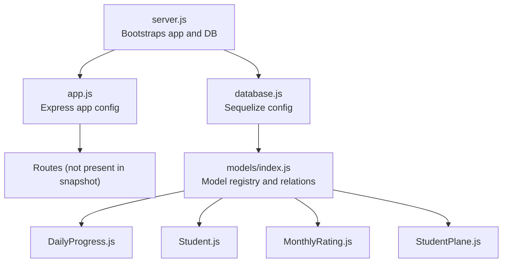
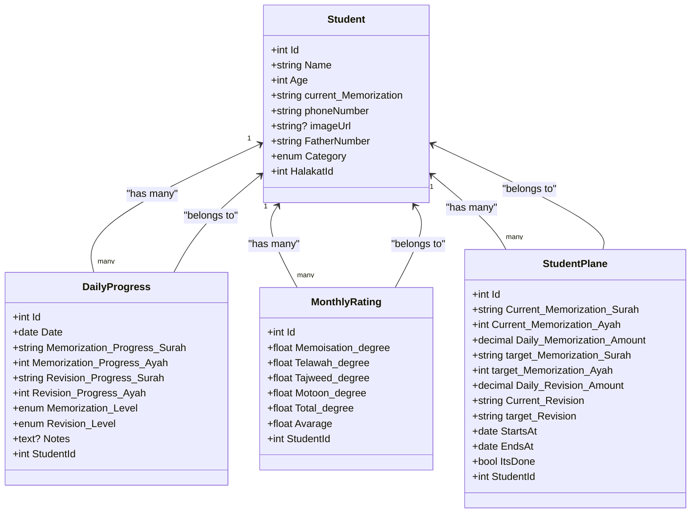
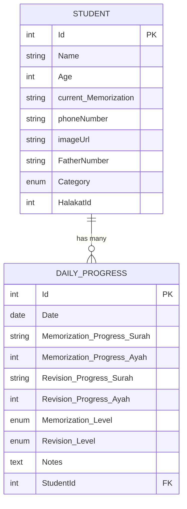
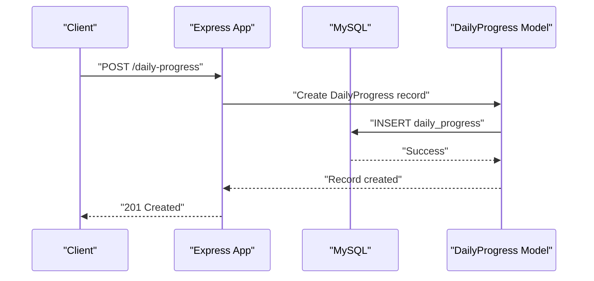
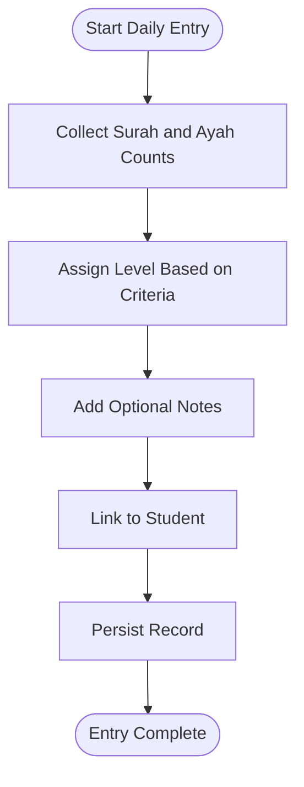
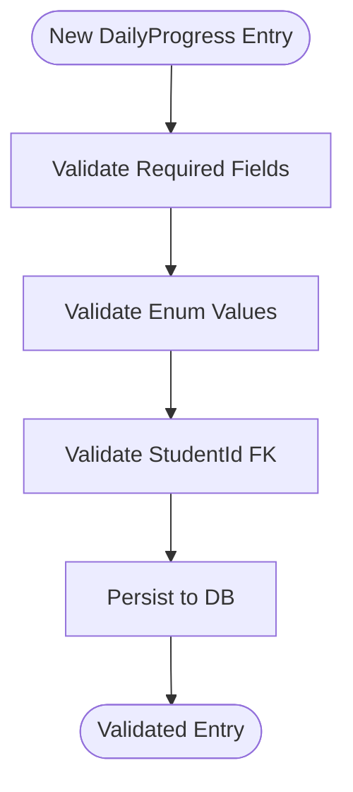
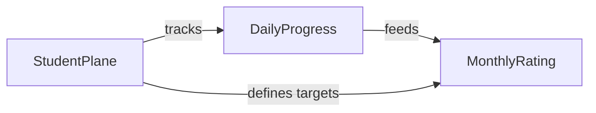
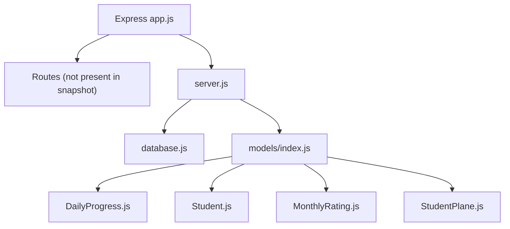

# Daily Progress Tracking

<cite>
**Referenced Files in This Document**
- [DailyProgress.js](file://backend/src/models/DailyProgress.js)
- [Student.js](file://backend/src/models/Student.js)
- [MonthlyRating.js](file://backend/src/models/MonthlyRating.js)
- [StudentPlane.js](file://backend/src/models/StudentPlane.js)
- [index.js](file://backend/src/models/index.js)
- [database.js](file://backend/src/config/database.js)
- [app.js](file://backend/src/config/app.js)
- [server.js](file://backend/server.js)
</cite>

## Table of Contents
1. [Introduction](#introduction)
2. [Project Structure](#project-structure)
3. [Core Components](#core-components)
4. [Architecture Overview](#architecture-overview)
5. [Detailed Component Analysis](#detailed-component-analysis)
6. [Dependency Analysis](#dependency-analysis)
7. [Performance Considerations](#performance-considerations)
8. [Troubleshooting Guide](#troubleshooting-guide)
9. [Conclusion](#conclusion)
10. [Appendices](#appendices)

## Introduction
This document explains the daily progress tracking system for the Khirocom platform, focusing on surah and ayah memorization monitoring. It covers the DailyProgress model schema, workflows for daily tracking, revision logging, and progress recording mechanisms. It also details how daily progress connects to student academic milestones, including surah completion tracking and ayah memorization verification, along with CRUD operations, batch recording, validation processes, reporting, milestone achievements, and integration with monthly ratings and learning plans.

## Project Structure
The backend is a Node.js/Express application using Sequelize ORM with MySQL. The daily progress tracking relies on the DailyProgress model and its relationships with Student, MonthlyRating, and StudentPlane. The application bootstraps via server.js, loads configuration from app.js and database.js, and registers models and associations in models/index.js.

**Diagram sources**
- [server.js:1-25](file://backend/server.js#L1-L25)
- [app.js:1-12](file://backend/src/config/app.js#L1-L12)
- [database.js:1-15](file://backend/src/config/database.js#L1-L15)
- [index.js:1-52](file://backend/src/models/index.js#L1-L52)
- [DailyProgress.js:1-64](file://backend/src/models/DailyProgress.js#L1-L64)
- [Student.js:1-67](file://backend/src/models/Student.js#L1-L67)
- [MonthlyRating.js:1-70](file://backend/src/models/MonthlyRating.js#L1-L70)
- [StudentPlane.js:1-76](file://backend/src/models/StudentPlane.js#L1-L76)

**Section sources**
- [server.js:1-25](file://backend/server.js#L1-L25)
- [app.js:1-12](file://backend/src/config/app.js#L1-L12)
- [database.js:1-15](file://backend/src/config/database.js#L1-L15)
- [index.js:1-52](file://backend/src/models/index.js#L1-L52)

## Core Components
- DailyProgress: Stores daily surah and ayah memorization and revision progress, along with levels and notes, linked to a single student.
- Student: Contains student profile and current memorization state, linked to halakat and planes/ratings.
- StudentPlane: Defines learning plan targets and progress tracking boundaries per student.
- MonthlyRating: Aggregates monthly performance metrics for memorization, recitation, Tajweed, and Motoon, linked to a student.

Key relationships:
- Student has many DailyProgress entries (one-to-many).
- Student has many MonthlyRating entries (one-to-many).
- Student has many StudentPlane entries (one-to-many).
- MonthlyRating belongs to Student.
- StudentPlane belongs to Student.
- DailyProgress belongs to Student.

**Section sources**
- [DailyProgress.js:1-64](file://backend/src/models/DailyProgress.js#L1-L64)
- [Student.js:1-67](file://backend/src/models/Student.js#L1-L67)
- [MonthlyRating.js:1-70](file://backend/src/models/MonthlyRating.js#L1-L70)
- [StudentPlane.js:1-76](file://backend/src/models/StudentPlane.js#L1-L76)
- [index.js:38-40](file://backend/src/models/index.js#L38-L40)

## Architecture Overview
The daily progress tracking architecture centers on the DailyProgress model and its association with Student. Students record daily progress, which informs milestones tracked via StudentPlane and monthly evaluations via MonthlyRating. The system uses Sequelize associations to maintain referential integrity and enable queries across related entities.

**Diagram sources**
- [DailyProgress.js:1-64](file://backend/src/models/DailyProgress.js#L1-L64)
- [Student.js:1-67](file://backend/src/models/Student.js#L1-L67)
- [MonthlyRating.js:1-70](file://backend/src/models/MonthlyRating.js#L1-L70)
- [StudentPlane.js:1-76](file://backend/src/models/StudentPlane.js#L1-L76)
- [index.js:38-40](file://backend/src/models/index.js#L38-L40)

## Detailed Component Analysis

### DailyProgress Model Schema
DailyProgress captures:
- Date: The date of the record.
- Memorization_Progress_Surah and Memorization_Progress_Ayah: Surah identifier and ayah count for new memorization.
- Revision_Progress_Surah and Revision_Progress_Ayah: Surah identifier and ayah count for revision.
- Memorization_Level and Revision_Level: Arabic proficiency levels with predefined values.
- Notes: Optional free-text comments.
- StudentId: Foreign key linking to Student.

Constraints and defaults:
- Date, Memorization_Progress_Surah, Memorization_Progress_Ayah, Revision_Progress_Surah, Revision_Progress_Ayah, Memorization_Level, and Revision_Level are required.
- Memorization_Level and Revision_Level default to a minimum level.
- Notes can be null.
- StudentId references students.Id.

**Diagram sources**
- [DailyProgress.js:6-62](file://backend/src/models/DailyProgress.js#L6-L62)
- [Student.js:6-65](file://backend/src/models/Student.js#L6-L65)

**Section sources**
- [DailyProgress.js:6-62](file://backend/src/models/DailyProgress.js#L6-L62)

### Daily Tracking Workflows
Daily tracking involves:
- Recording daily memorization and revision progress with surah identifiers and ayah counts.
- Assigning levels based on performance thresholds.
- Logging optional notes for context.
- Linking each record to a specific student.

[No sources needed since this diagram shows conceptual workflow, not actual code structure]

### Revision Logging and Progress Recording
- Revision logging tracks previously memorized material to ensure retention.
- Progress recording maintains separate counters for new memorization and revision.
- Levels (Memorization_Level, Revision_Level) capture qualitative performance.

[No sources needed since this diagram shows conceptual workflow, not actual code structure]

### Progress Validation and Data Integrity
- Required fields: Date, Memorization_Progress_Surah, Memorization_Progress_Ayah, Revision_Progress_Surah, Revision_Progress_Ayah, Memorization_Level, Revision_Level.
- Enumerations restrict values to predefined proficiency levels.
- Foreign key constraint ensures StudentId references a valid student.

[No sources needed since this diagram shows conceptual workflow, not actual code structure]

### Relationship to Academic Milestones
- StudentPlane defines current and target memorization and revision amounts, and plan duration.
- DailyProgress complements StudentPlane by recording daily increments toward targets.
- MonthlyRating aggregates performance metrics for reporting and evaluation.

[No sources needed since this diagram shows conceptual workflow, not actual code structure]

### CRUD Operations and Batch Recording
- Create: Submit daily progress with surah and ayah counts, levels, and notes.
- Read: Retrieve daily progress by student or date range.
- Update: Modify existing records (surah/ayah counts, levels, notes).
- Delete: Remove records when corrections are needed.
- Batch: Submit multiple daily entries for consecutive days or weeks.

[No sources needed since this section provides general guidance]

### Practical Examples
- Creating a daily entry: Provide Date, Memorization_Progress_Surah/Ayah, Revision_Progress_Surah/Ayah, and optionally Notes. The system assigns default levels and persists the record linked to a StudentId.
- Verifying progress: Compare recorded ayah counts against StudentPlane targets to assess milestone advancement.
- Revision tracking: Use Revision_Progress_Surah/Ayah to log retained material and adjust Current_Revision accordingly.

[No sources needed since this section provides general guidance]

### Progress Reporting and Learning Curve Analysis
- Aggregate daily progress to compute weekly/monthly totals for memorization and revision.
- Correlate totals with StudentPlane targets to visualize learning curve trends.
- MonthlyRating consolidates degrees for reporting and grading.

[No sources needed since this section provides general guidance]

## Dependency Analysis
The application depends on Express for routing and Sequelize for ORM. Models are registered centrally and associated via models/index.js. The database connection is configured in database.js.

**Diagram sources**
- [app.js:1-12](file://backend/src/config/app.js#L1-L12)
- [server.js:1-25](file://backend/server.js#L1-L25)
- [database.js:1-15](file://backend/src/config/database.js#L1-L15)
- [index.js:1-52](file://backend/src/models/index.js#L1-L52)
- [DailyProgress.js:1-64](file://backend/src/models/DailyProgress.js#L1-L64)
- [Student.js:1-67](file://backend/src/models/Student.js#L1-L67)
- [MonthlyRating.js:1-70](file://backend/src/models/MonthlyRating.js#L1-L70)
- [StudentPlane.js:1-76](file://backend/src/models/StudentPlane.js#L1-L76)

**Section sources**
- [server.js:1-25](file://backend/server.js#L1-L25)
- [app.js:1-12](file://backend/src/config/app.js#L1-L12)
- [database.js:1-15](file://backend/src/config/database.js#L1-L15)
- [index.js:1-52](file://backend/src/models/index.js#L1-L52)

## Performance Considerations
- Index daily progress by Date and StudentId for efficient querying.
- Use pagination for large date ranges to avoid heavy result sets.
- Batch inserts for multiple daily entries to reduce round trips.
- Denormalize aggregated monthly metrics if real-time computation becomes costly.

[No sources needed since this section provides general guidance]

## Troubleshooting Guide
- Connection issues: Verify database credentials and availability in database.js.
- Model synchronization: Ensure models/index.js is loaded and sequelize.sync runs after startup.
- Association errors: Confirm foreign keys and relationship definitions in models/index.js.
- Validation failures: Check required fields and enum values in DailyProgress.

**Section sources**
- [database.js:1-15](file://backend/src/config/database.js#L1-L15)
- [server.js:8-23](file://backend/server.js#L8-L23)
- [index.js:38-40](file://backend/src/models/index.js#L38-L40)
- [DailyProgress.js:6-62](file://backend/src/models/DailyProgress.js#L6-L62)

## Conclusion
The daily progress tracking system integrates DailyProgress with Student, StudentPlane, and MonthlyRating to monitor surah and ayah memorization, support milestone achievement, and enable monthly evaluations. By validating inputs, maintaining referential integrity, and leveraging associations, the system supports robust CRUD operations, batch recording, and reporting capabilities essential for effective learning oversight.

## Appendices
- Integration with Monthly Rating: Consolidate daily totals into MonthlyRating for comprehensive performance assessment.
- Learning Plan Management: Align daily progress with StudentPlane targets to track advancement and plan adjustments.

[No sources needed since this section provides general guidance]