# Feature Modules

<cite>
**Referenced Files in This Document**
- [server.js](file://backend/server.js)
- [app.js](file://backend/src/config/app.js)
- [database.js](file://backend/src/config/database.js)
- [models/index.js](file://backend/src/models/index.js)
- [Graduate.js](file://backend/src/models/Graduate.js)
- [User.js](file://backend/src/models/User.js)
- [Center.js](file://backend/src/models/Center.js)
- [Halakat.js](file://backend/src/models/Halakat.js)
- [Student.js](file://backend/src/models/Student.js)
- [MonthlyRating.js](file://backend/src/models/MonthlyRating.js)
- [DailyProgress.js](file://backend/src/models/DailyProgress.js)
- [userRoutes.js](file://backend/src/route/userRoutes.js)
- [centerRoutes.js](file://backend/src/route/centerRoutes.js)
- [halaqatRouts.js](file://backend/src/route/halaqatRouts.js)
- [areaRouts.js](file://backend/src/route/areaRouts.js)
- [auth.js](file://backend/src/middleware/auth.js)
- [package.json](file://backend/package.json)
</cite>

## Update Summary
**Changes Made**
- Added new Graduate Tracking System feature module with one-to-one relationship to students
- Updated model associations to include Graduate-Studen relationship
- Enhanced documentation to cover the new graduation records and completion status tracking functionality
- Updated architecture diagrams to reflect the new graduate tracking capability

## Table of Contents
1. [Introduction](#introduction)
2. [Project Structure](#project-structure)
3. [Core Components](#core-components)
4. [Architecture Overview](#architecture-overview)
5. [Detailed Component Analysis](#detailed-component-analysis)
6. [Dependency Analysis](#dependency-analysis)
7. [Performance Considerations](#performance-considerations)
8. [Troubleshooting Guide](#troubleshooting-guide)
9. [Conclusion](#conclusion)
10. [Appendices](#appendices)

## Introduction
This document describes the feature modules and implementation architecture for the Khirocom system. It focuses on the complete feature set and how the system is structured around an MVC-like pattern, with models representing the data layer, routes and controllers handling API endpoints and business logic, and middleware processing requests. The documented features include User Management, Center Administration, Teaching Group Management, Student Tracking, Daily Progress Monitoring, Monthly Rating System, Graduate Tracking System, and Learning Plan Management. The document also explains feature interdependencies, data flows, practical usage scenarios, and guidelines for extending and integrating new features.

## Project Structure
The backend follows a layered structure:
- Configuration: Express application and database initialization
- Models: Sequelize ORM models with associations
- Routes: API endpoint definitions
- Controllers: Business logic handlers
- Middleware: Request processing
- Tests: Test suite

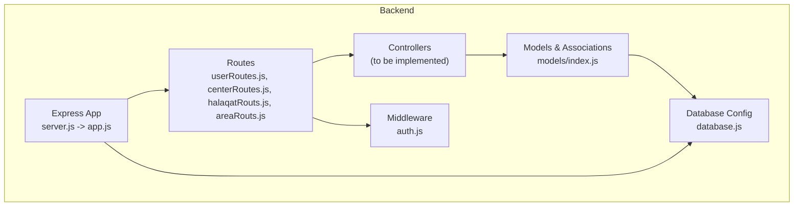

**Diagram sources**
- [server.js:1-26](file://backend/server.js#L1-L26)
- [app.js](file://backend/src/config/app.js)
- [database.js](file://backend/src/config/database.js)
- [models/index.js:1-91](file://backend/src/models/index.js#L1-L91)
- [userRoutes.js:1-17](file://backend/src/route/userRoutes.js#L1-L17)
- [centerRoutes.js:1-14](file://backend/src/route/centerRoutes.js#L1-L14)
- [halaqatRouts.js:1-18](file://backend/src/route/halaqatRouts.js#L1-L18)
- [areaRouts.js:1-14](file://backend/src/route/areaRouts.js#L1-L14)

**Section sources**
- [server.js:1-26](file://backend/server.js#L1-L26)
- [package.json:1-14](file://backend/package.json#L1-L14)

## Core Components
This section outlines the core components and their responsibilities within the system.

- Express Application
  - Initializes the web server and loads environment variables
  - Starts the server on the configured port
  - Synchronizes models with the database

- Database Configuration
  - Provides connection configuration for Sequelize
  - Centralizes database credentials and options

- Models and Associations
  - Define entities and relationships among Users, Centers, Teaching Groups (Halakat), Students, Monthly Ratings, Daily Progress, and Graduates
  - Enforce referential integrity via foreign keys
  - Include validation rules for numeric fields and enumerations
  - **New**: Graduate model provides one-to-one relationship with Students for graduation tracking

- Routing and Controllers
  - API endpoint definitions for user management, center administration, teaching group management, and area management
  - Will depend on models for data access and middleware for request processing

- Middleware
  - Authentication middleware for securing API endpoints
  - Request processing and validation

**Section sources**
- [server.js:1-26](file://backend/server.js#L1-L26)
- [database.js](file://backend/src/config/database.js)
- [models/index.js:1-91](file://backend/src/models/index.js#L1-L91)
- [auth.js](file://backend/src/middleware/auth.js)

## Architecture Overview
The system architecture centers on an MVC-like separation of concerns:
- Models: Represent domain entities and relationships
- Controllers: Encapsulate business logic and coordinate model operations
- Routes: Expose endpoints for client consumption
- Middleware: Pre-process requests and post-process responses
- Database: Persist and retrieve data using Sequelize

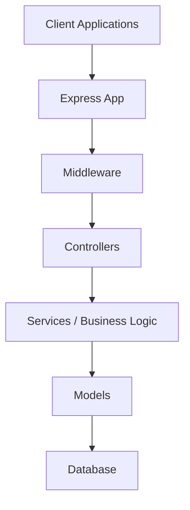

## Detailed Component Analysis

### User Management
- Purpose: Manage users with roles (admin, teacher, supervisor, manager)
- Responsibilities:
  - Create, update, delete, and list users
  - Authenticate and authorize actions based on role
  - Link users to centers and teaching groups
- Data Model: User entity with identity, credentials, contact info, avatar, and role
- Interactions:
  - Users manage Centers (one-to-many)
  - Users teach Halakat (one-to-many)
  - Users are linked to Centers and Halakat via foreign keys

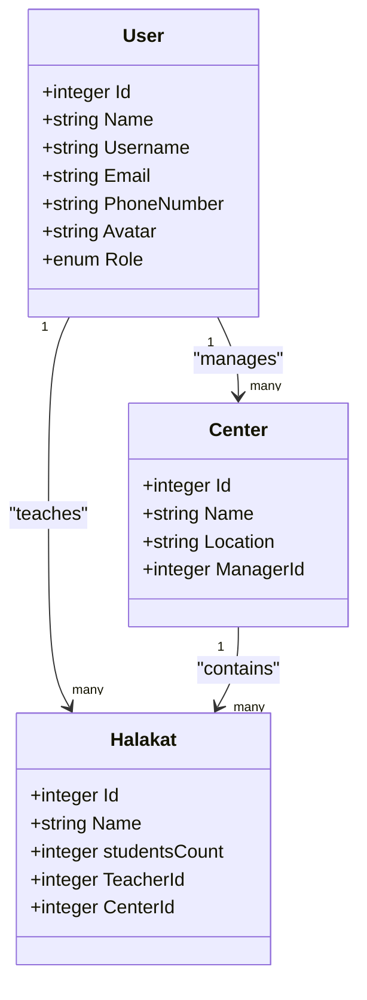

**Diagram sources**
- [User.js:1-59](file://backend/src/models/User.js#L1-L59)
- [Center.js:1-39](file://backend/src/models/Center.js#L1-L39)
- [Halakat.js:1-47](file://backend/src/models/Halakat.js#L1-L47)

**Section sources**
- [User.js:1-59](file://backend/src/models/User.js#L1-L59)
- [Center.js:1-39](file://backend/src/models/Center.js#L1-L39)
- [Halakat.js:1-47](file://backend/src/models/Halakat.js#L1-L47)

### Center Administration
- Purpose: Manage educational centers and their administrators
- Responsibilities:
  - Create, update, delete, and list centers
  - Assign managers (users) to centers
  - Track center location and associated halakat
- Data Model: Center entity with name, location, and manager reference
- Interactions:
  - Center belongs to a User (manager)
  - Center contains many Halakat instances

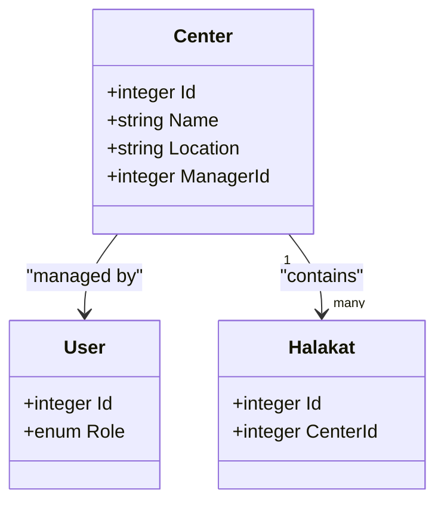

**Diagram sources**
- [Center.js:1-39](file://backend/src/models/Center.js#L1-L39)
- [User.js:1-59](file://backend/src/models/User.js#L1-L59)
- [Halakat.js:1-47](file://backend/src/models/Halakat.js#L1-L47)

**Section sources**
- [Center.js:1-39](file://backend/src/models/Center.js#L1-L39)
- [models/index.js:21-27](file://backend/src/models/index.js#L21-L27)

### Teaching Group Management
- Purpose: Manage teaching groups (classes) within centers
- Responsibilities:
  - Create, update, delete, and list halakat
  - Assign teachers (users) and centers
  - Track student counts per group
- Data Model: Halakat entity with name, student count, teacher, and center references
- Interactions:
  - Halakat belongs to a User (teacher)
  - Halakat belongs to a Center
  - Halakat contains many Students

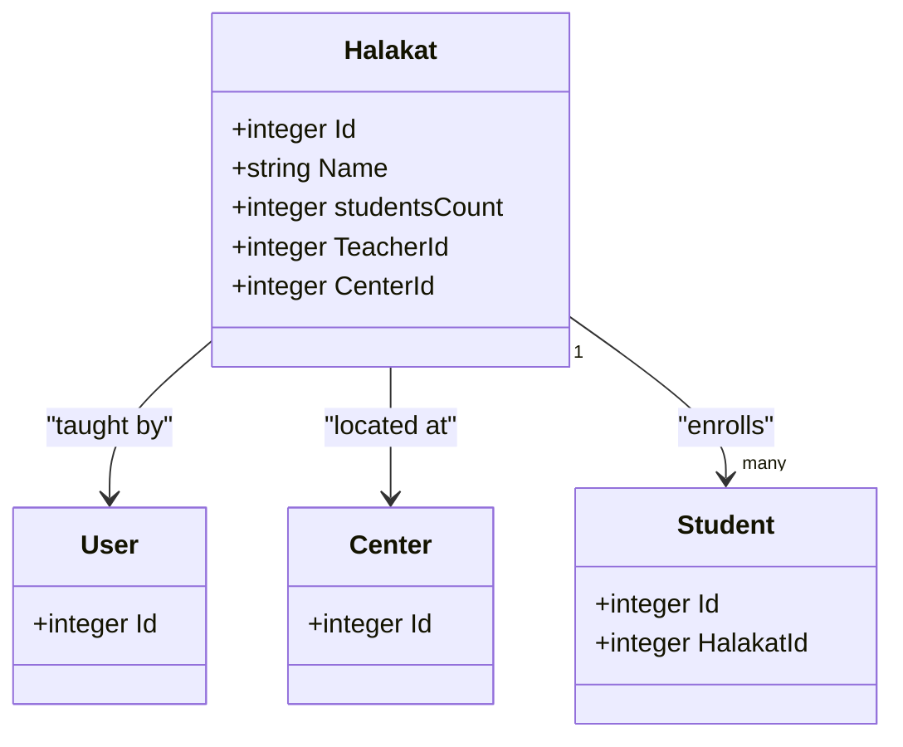

**Diagram sources**
- [Halakat.js:1-47](file://backend/src/models/Halakat.js#L1-L47)
- [User.js:1-59](file://backend/src/models/User.js#L1-L59)
- [Center.js:1-39](file://backend/src/models/Center.js#L1-L39)
- [Student.js:1-105](file://backend/src/models/Student.js#L1-L105)

**Section sources**
- [Halakat.js:1-47](file://backend/src/models/Halakat.js#L1-L47)
- [models/index.js:29-31](file://backend/src/models/index.js#L29-L31)

### Student Tracking
- Purpose: Track student profiles and enrollment in halakat
- Responsibilities:
  - Create, update, delete, and list students
  - Capture personal details, category, and parent/guardian contact
  - Enroll students in halakat groups
- Data Model: Student entity with personal info, category enumeration, and halakat reference
- Interactions:
  - Student belongs to a Halakat
  - Student has many Monthly Ratings and Daily Progress entries
  - **New**: Student has one Graduate record for completion tracking

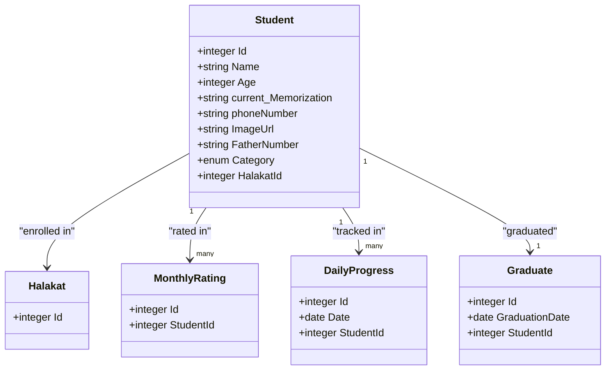

**Diagram sources**
- [Student.js:1-105](file://backend/src/models/Student.js#L1-L105)
- [Halakat.js:1-47](file://backend/src/models/Halakat.js#L1-L47)
- [MonthlyRating.js:1-70](file://backend/src/models/MonthlyRating.js#L1-L70)
- [DailyProgress.js:1-64](file://backend/src/models/DailyProgress.js#L1-L64)
- [Graduate.js:1-37](file://backend/src/models/Graduate.js#L1-L37)

**Section sources**
- [Student.js:1-105](file://backend/src/models/Student.js#L1-L105)
- [models/index.js:41-55](file://backend/src/models/index.js#L41-L55)
- [models/index.js:70-72](file://backend/src/models/index.js#L70-L72)

### Daily Progress Monitoring
- Purpose: Record daily memorization and revision progress
- Responsibilities:
  - Log daily progress with surah, ayah, and level indicators
  - Store notes and associate with a student
- Data Model: DailyProgress entity with date, progress metrics, levels, and notes
- Interactions:
  - DailyProgress belongs to a Student

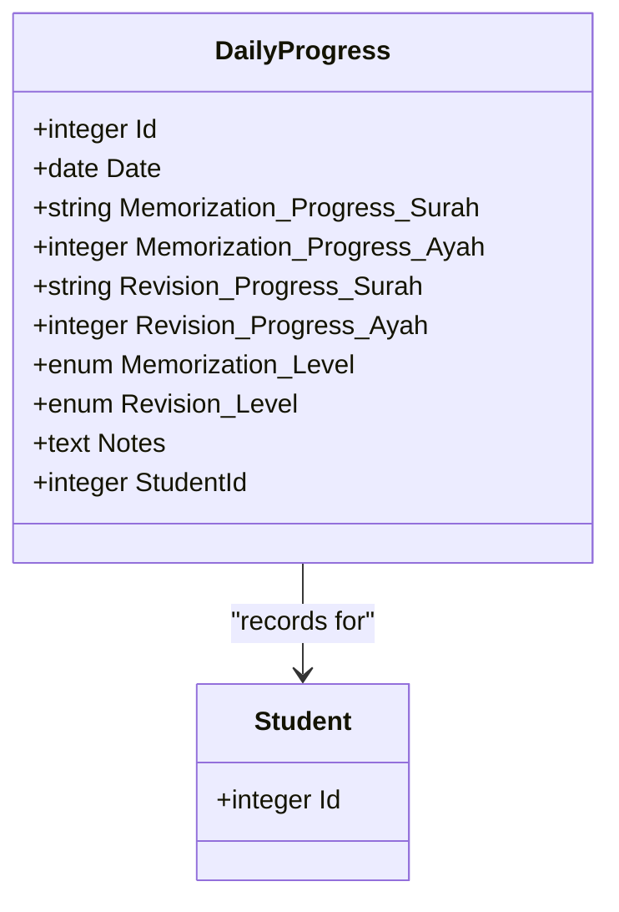

**Diagram sources**
- [DailyProgress.js:1-64](file://backend/src/models/DailyProgress.js#L1-L64)
- [Student.js:1-105](file://backend/src/models/Student.js#L1-L105)

**Section sources**
- [DailyProgress.js:1-64](file://backend/src/models/DailyProgress.js#L1-L64)
- [models/index.js:53-55](file://backend/src/models/index.js#L53-L55)

### Monthly Rating System
- Purpose: Compute and store monthly ratings for memorization, recitation, Tajweed, Motoon, totals, averages
- Responsibilities:
  - Validate degree ranges per category
  - Calculate total and average scores
  - Associate ratings with a student
- Data Model: MonthlyRating entity with validated degree fields, totals, averages, and student reference
- Interactions:
  - MonthlyRating belongs to a Student

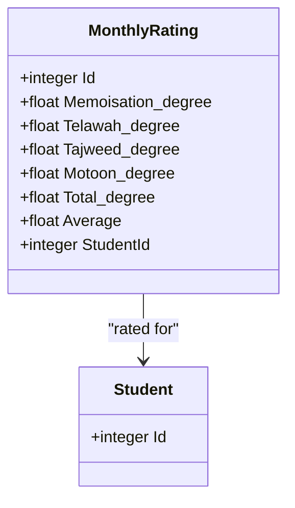

**Diagram sources**
- [MonthlyRating.js:1-70](file://backend/src/models/MonthlyRating.js#L1-L70)
- [Student.js:1-105](file://backend/src/models/Student.js#L1-L105)

**Section sources**
- [MonthlyRating.js:1-70](file://backend/src/models/MonthlyRating.js#L1-L70)
- [models/index.js:45-47](file://backend/src/models/index.js#L45-L47)

### Graduate Tracking System
- Purpose: Track student graduation records and completion status
- Responsibilities:
  - Record graduation dates for completed students
  - Maintain one-to-one relationship with student records
  - Track completion status for academic progression
- Data Model: Graduate entity with graduation date and student reference
- Interactions:
  - Graduate belongs to a Student (one-to-one relationship)
  - Provides completion tracking for student lifecycle

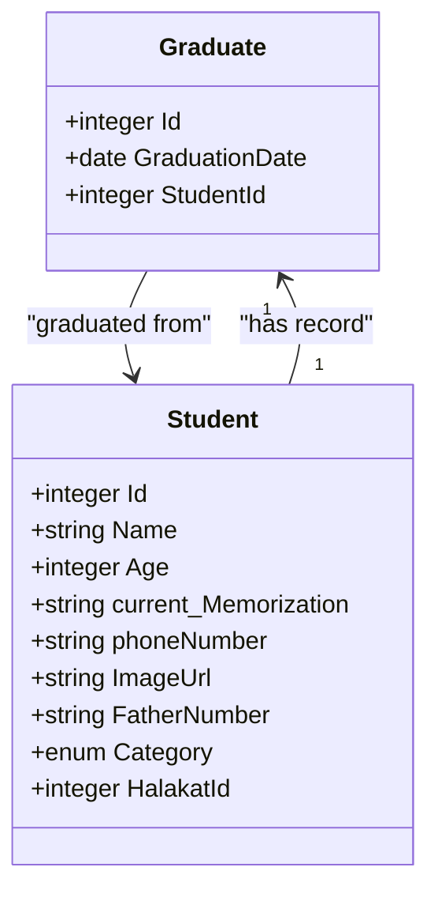

**Diagram sources**
- [Graduate.js:1-37](file://backend/src/models/Graduate.js#L1-L37)
- [Student.js:1-105](file://backend/src/models/Student.js#L1-L105)

**Section sources**
- [Graduate.js:1-37](file://backend/src/models/Graduate.js#L1-L37)
- [models/index.js:70-72](file://backend/src/models/index.js#L70-L72)

### Learning Plan Management
- Purpose: Manage learning plans associated with students
- Responsibilities:
  - Create, update, delete, and list learning plans
  - Link plans to individual students
- Data Model: StudentPlane entity (learning plan) with student reference
- Interactions:
  - StudentPlane belongs to a Student

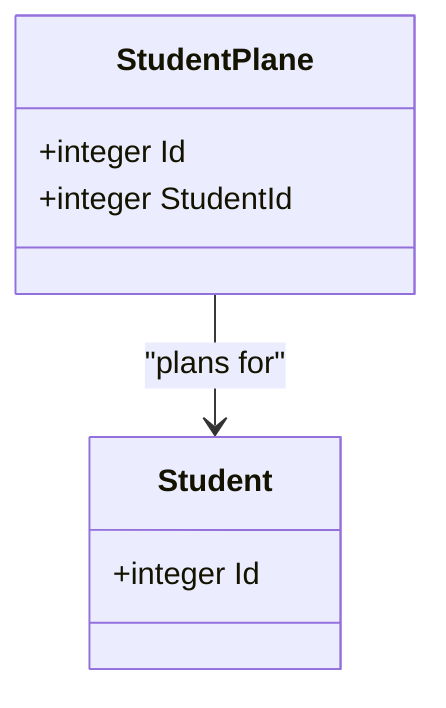

**Diagram sources**
- [Student.js:1-105](file://backend/src/models/Student.js#L1-L105)
- [StudentPlane.js](file://backend/src/models/StudentPlane.js)

**Section sources**
- [Student.js:1-105](file://backend/src/models/Student.js#L1-L105)
- [models/index.js:49-51](file://backend/src/models/index.js#L49-L51)

## Dependency Analysis
The system exhibits clear dependency relationships:
- Models depend on the database configuration
- The application depends on models for data access
- Routes depend on controllers for business logic
- Controllers depend on models for persistence
- Middleware depends on routes for request processing
- **New**: Graduate model depends on Student model for one-to-one relationship

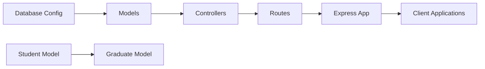

**Diagram sources**
- [database.js](file://backend/src/config/database.js)
- [models/index.js:1-91](file://backend/src/models/index.js#L1-L91)
- [server.js:1-26](file://backend/server.js#L1-L26)
- [Graduate.js:1-37](file://backend/src/models/Graduate.js#L1-L37)
- [Student.js:1-105](file://backend/src/models/Student.js#L1-L105)

**Section sources**
- [models/index.js:1-91](file://backend/src/models/index.js#L1-L91)
- [server.js:1-26](file://backend/server.js#L1-L26)

## Performance Considerations
- Database synchronization: The server synchronizes models on startup; consider production-safe alternatives to avoid data loss
- Validation: Model-level validations reduce invalid data but can increase write-time overhead; ensure appropriate indexing on foreign keys
- Associations: Use eager loading where necessary to prevent N+1 queries in list endpoints
- Caching: Introduce caching for frequently accessed master data (e.g., categories, levels)
- Pagination: Implement pagination for list endpoints to limit payload sizes
- **New**: Graduate records should be indexed for efficient graduation reporting and completion tracking queries

## Troubleshooting Guide
- Server startup failures:
  - Verify database connectivity and credentials
  - Confirm model registration and associations
- Authentication and authorization:
  - Implement middleware to validate tokens and enforce role-based access
- Data inconsistencies:
  - Use transactions for multi-step updates
  - Validate inputs at the controller level before delegating to models
- Logging:
  - Add structured logging for requests, errors, and audit trails
- **New**: Graduate tracking issues:
  - Ensure one-to-one relationship constraints are maintained
  - Verify graduation date validation and student completion status
  - Check for orphaned graduate records during student deletion

**Section sources**
- [server.js:1-26](file://backend/server.js#L1-L26)
- [auth.js](file://backend/src/middleware/auth.js)

## Conclusion
Khirocom's backend establishes a solid foundation for educational administration through well-defined models and associations. The MVC pattern is evident in the separation between models, controllers, routes, and middleware. The documented features—User Management, Center Administration, Teaching Group Management, Student Tracking, Daily Progress Monitoring, Monthly Rating System, Graduate Tracking System, and Learning Plan Management—are interconnected via foreign keys and associations. The addition of the Graduate Tracking System enhances the platform's ability to manage student lifecycle completion. To complete the system, implement controllers for the new graduate tracking endpoints and integrate with frontend applications for comprehensive educational administration.

## Appendices

### Practical Usage Scenarios
- User Management
  - Create a teacher account and assign as center manager
  - List centers managed by a user
- Center Administration
  - Create a center and assign a manager
  - Retrieve all halakat under a center
- Teaching Group Management
  - Create a halakat and assign a teacher and center
  - Enroll students into a halakat
- Student Tracking
  - Register a new student and enroll in a halakat
  - Update student profile and contact info
- Daily Progress Monitoring
  - Log daily memorization and revision progress for a student
  - Add notes for guidance
- Monthly Rating System
  - Submit monthly ratings for a student and compute totals/averages
- Graduate Tracking System
  - Record graduation date for completed student
  - Track completion status and generate graduation reports
- Learning Plan Management
  - Create a learning plan for a student and track progress

### Integration Patterns
- Frontend-backend communication:
  - RESTful endpoints for CRUD operations on each feature
  - JWT-based authentication middleware
  - Shared DTOs between frontend and backend for consistent payloads
- Modular development:
  - Keep routes, controllers, and middleware per feature module
  - Reuse shared middleware for cross-cutting concerns (auth, validation)
- Testing:
  - Unit tests for controllers and models
  - Integration tests for route flows and middleware behavior
- **New**: Graduate tracking integration:
  - One-to-one relationship ensures data integrity for graduation records
  - Separate endpoints for graduate creation, updates, and retrieval
  - Cascade operations for student graduation status management