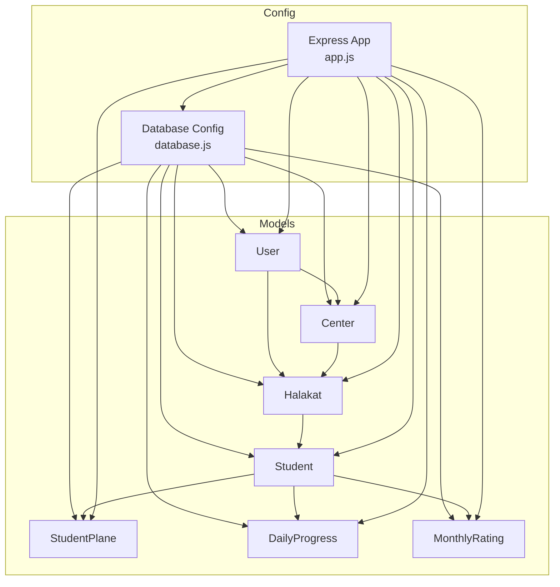
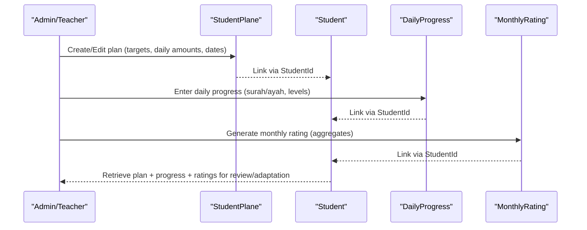
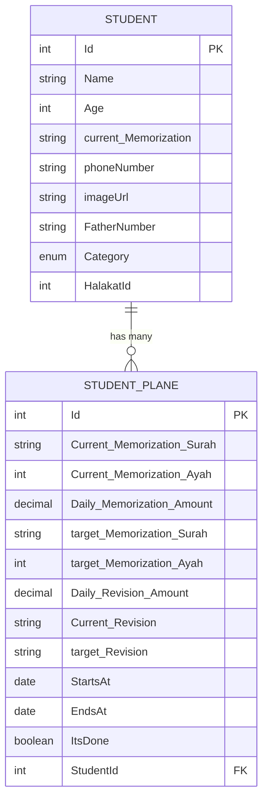
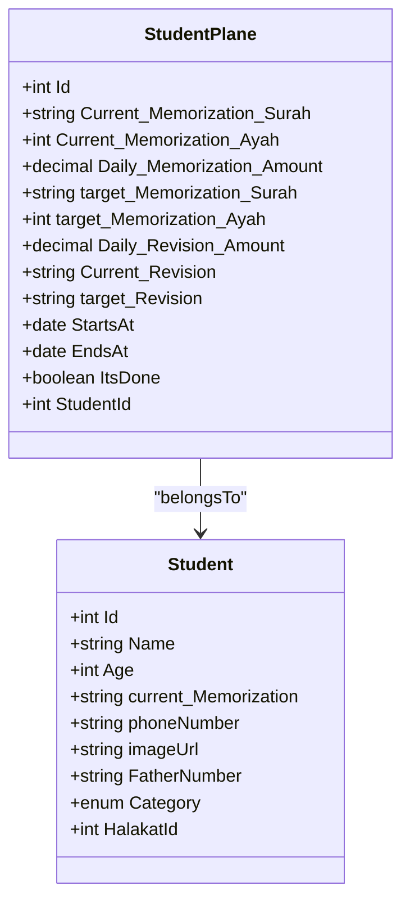
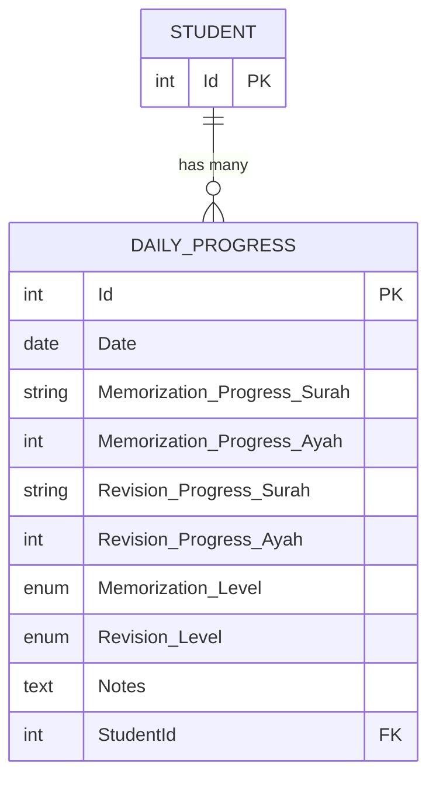
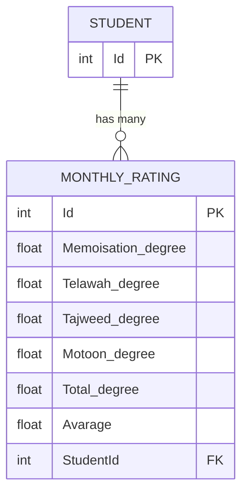
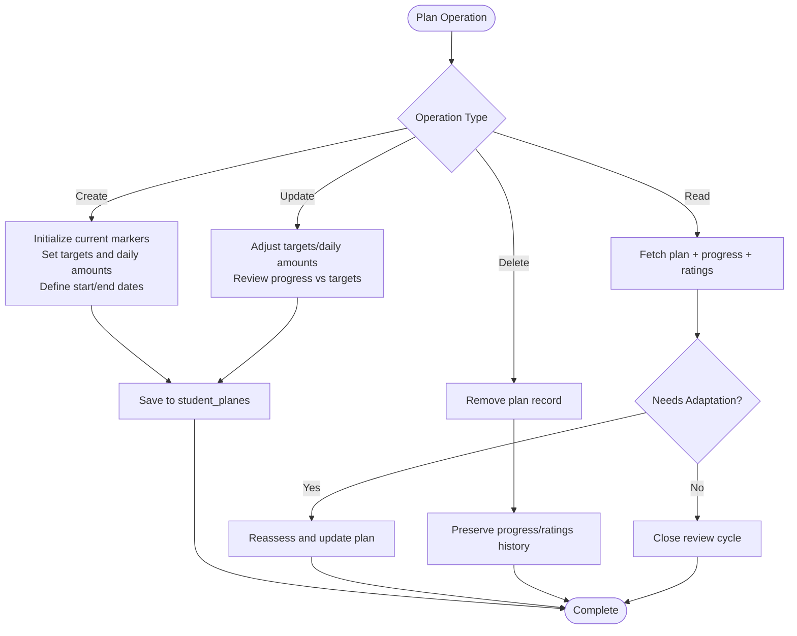
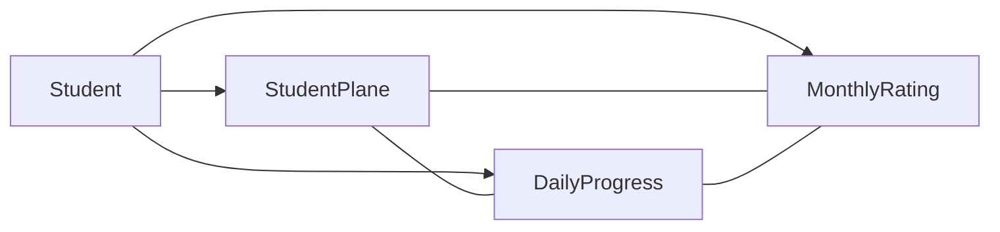

# Learning Plan Management

<cite>
**Referenced Files in This Document**
- [StudentPlane.js](file://backend/src/models/StudentPlane.js)
- [index.js](file://backend/src/models/index.js)
- [Student.js](file://backend/src/models/Student.js)
- [DailyProgress.js](file://backend/src/models/DailyProgress.js)
- [MonthlyRating.js](file://backend/src/models/MonthlyRating.js)
- [server.js](file://backend/server.js)
- [app.js](file://backend/src/config/app.js)
- [database.js](file://backend/src/config/database.js)
</cite>

## Table of Contents
1. [Introduction](#introduction)
2. [Project Structure](#project-structure)
3. [Core Components](#core-components)
4. [Architecture Overview](#architecture-overview)
5. [Detailed Component Analysis](#detailed-component-analysis)
6. [Dependency Analysis](#dependency-analysis)
7. [Performance Considerations](#performance-considerations)
8. [Troubleshooting Guide](#troubleshooting-guide)
9. [Conclusion](#conclusion)

## Introduction
This document explains the learning plan management system for the Khirocom platform, focusing on how individual student learning objectives and target setting are modeled and integrated with progress monitoring. It documents the StudentPlane model schema, relationships with students and academic records, and how daily progress and monthly ratings support continuous assessment and plan adaptation. Practical workflows for plan creation, target establishment, and progress tracking are outlined, along with guidance for customization and optimization of personalized learning paths.

## Project Structure
The backend is organized around a modular structure with models, configuration, and a minimal Express application bootstrap. The learning plan domain centers on the StudentPlane model and its associations with Student, DailyProgress, and MonthlyRating.

**Diagram sources**
- [app.js:1-12](file://backend/src/config/app.js#L1-L12)
- [database.js:1-15](file://backend/src/config/database.js#L1-L15)
- [index.js:1-51](file://backend/src/models/index.js#L1-L51)

**Section sources**
- [server.js:1-25](file://backend/server.js#L1-L25)
- [app.js:1-12](file://backend/src/config/app.js#L1-L12)
- [database.js:1-15](file://backend/src/config/database.js#L1-L15)

## Core Components
This section documents the core models involved in learning plan management and their roles in supporting personalized learning objectives.

- StudentPlane: Stores a student’s memorization and revision targets, daily amounts, current progress markers, plan dates, completion flag, and links to a student.
- Student: Holds student profile and academic category; linked to Halakat and associated with StudentPlane, DailyProgress, and MonthlyRating.
- DailyProgress: Captures daily memorization and revision progress per day, levels, and optional notes, linked to a student.
- MonthlyRating: Aggregates monthly performance metrics for memorization, recitation, Tajweed, Motoon, totals, averages, and links to a student.

Key relationships:
- One-to-many: Student → StudentPlane, Student → DailyProgress, Student → MonthlyRating
- Many-to-one: StudentPlane → Student, DailyProgress → Student, MonthlyRating → Student

These relationships enable:
- Personalized learning plans per student
- Daily progress capture feeding into monthly assessments
- Continuous monitoring and plan adaptation

**Section sources**
- [StudentPlane.js:1-76](file://backend/src/models/StudentPlane.js#L1-L76)
- [Student.js:1-67](file://backend/src/models/Student.js#L1-L67)
- [DailyProgress.js:1-64](file://backend/src/models/DailyProgress.js#L1-L64)
- [MonthlyRating.js:1-70](file://backend/src/models/MonthlyRating.js#L1-L70)
- [index.js:34-40](file://backend/src/models/index.js#L34-L40)

## Architecture Overview
The learning plan architecture integrates plan creation and management with daily progress and monthly rating systems. The flow below illustrates how a student’s plan informs daily activities and monthly evaluations.

**Diagram sources**
- [StudentPlane.js:58-65](file://backend/src/models/StudentPlane.js#L58-L65)
- [DailyProgress.js:47-54](file://backend/src/models/DailyProgress.js#L47-L54)
- [MonthlyRating.js:55-58](file://backend/src/models/MonthlyRating.js#L55-L58)
- [index.js:34-40](file://backend/src/models/index.js#L34-L40)

## Detailed Component Analysis

### StudentPlane Model Schema
The StudentPlane model defines the learning plan record for a student, including current and target memorization/revision indicators, daily amounts, plan duration, completion status, and the associated student.

**Diagram sources**
- [StudentPlane.js:6-73](file://backend/src/models/StudentPlane.js#L6-L73)
- [Student.js:8-57](file://backend/src/models/Student.js#L8-L57)

Key fields and their roles:
- Current and target memorization/revision identifiers and counts define the learning objectives and milestones.
- Daily amounts set the pace for progress accumulation.
- StartsAt/EndsAt define the plan timeframe.
- ItsDone indicates plan completion for reporting and closure.
- StudentId establishes the student-to-plan relationship.

Practical usage patterns:
- Plan creation: Initialize current markers, set targets, define daily amounts, and schedule plan dates.
- Target establishment: Align surah and ayah targets with student category and teacher recommendations.
- Progress tracking: Compare daily progress against plan targets to assess completion rate and adjust daily amounts.

**Section sources**
- [StudentPlane.js:6-73](file://backend/src/models/StudentPlane.js#L6-L73)

### Student-Academic Goals Relationship
StudentPlane supports personalized learning paths by aligning targets with student categories and halakat progression. The Student model includes a categorical classification that can guide plan customization and milestone planning.

**Diagram sources**
- [Student.js:8-57](file://backend/src/models/Student.js#L8-L57)
- [StudentPlane.js:58-65](file://backend/src/models/StudentPlane.js#L58-L65)

Plan customization and goal setting methodologies:
- Use student category to select appropriate surah/aya targets and pacing.
- Align plan milestones with halakat progression and teacher recommendations.
- Periodically reassess and adjust targets based on progress trends.

**Section sources**
- [Student.js:37-46](file://backend/src/models/Student.js#L37-L46)
- [StudentPlane.js:21-44](file://backend/src/models/StudentPlane.js#L21-L44)

### Daily Progress Integration
DailyProgress captures daily progress toward memorization and revision targets, enabling real-time feedback and plan adjustments.

**Diagram sources**
- [DailyProgress.js:6-62](file://backend/src/models/DailyProgress.js#L6-L62)
- [Student.js:8-57](file://backend/src/models/Student.js#L8-L57)

Daily progress workflow:
- Record daily surah/aya progress and level indicators.
- Use Notes to capture qualitative observations.
- Aggregate daily entries to inform monthly ratings and plan adaptations.

**Section sources**
- [DailyProgress.js:13-46](file://backend/src/models/DailyProgress.js#L13-L46)

### Monthly Rating System
MonthlyRating consolidates performance across multiple domains and computes averages and totals, providing a comprehensive assessment for plan evaluation.

**Diagram sources**
- [MonthlyRating.js:8-66](file://backend/src/models/MonthlyRating.js#L8-L66)
- [Student.js:8-57](file://backend/src/models/Student.js#L8-L57)

Monthly rating workflow:
- Compute domain-specific degrees and totals.
- Derive average for holistic performance view.
- Use ratings to validate plan effectiveness and decide next steps.

**Section sources**
- [MonthlyRating.js:15-54](file://backend/src/models/MonthlyRating.js#L15-L54)

### Plan CRUD Operations and Workflows
While the repository does not include explicit controller/route files for StudentPlane, the model relationships and schema enable the following workflows:

- Create a plan:
  - Set current and target memorization/revision markers.
  - Define daily amounts and plan dates.
  - Associate with a student via StudentId.
- Read a plan:
  - Retrieve plan details and associated progress/ratings for review.
- Update a plan:
  - Adjust targets, daily amounts, or dates based on progress.
  - Mark completion when milestones are achieved.
- Delete a plan:
  - Remove plan records while preserving progress and ratings for historical analysis.

[No sources needed since this diagram shows conceptual workflow, not actual code structure]

## Dependency Analysis
The model relationships define how learning plan data flows through the system and connects to progress and rating subsystems.

**Diagram sources**
- [index.js:34-40](file://backend/src/models/index.js#L34-L40)

Observations:
- Cohesion: StudentPlane encapsulates plan data; DailyProgress and MonthlyRating handle progress and ratings respectively.
- Coupling: All three components depend on Student, ensuring unified student-centric views.
- Scalability: Adding new assessment dimensions can extend MonthlyRating without disrupting plan logic.

**Section sources**
- [index.js:34-40](file://backend/src/models/index.js#L34-L40)

## Performance Considerations
- Indexing: Add database indexes on StudentId in StudentPlane, DailyProgress, and MonthlyRating to optimize joins and queries.
- Aggregation: Precompute monthly aggregates in MonthlyRating to reduce runtime computation.
- Batch updates: When adjusting plan targets, batch update daily progress entries to maintain consistency.
- Logging: Enable structured logging for plan creation/update events to track changes and support audits.

[No sources needed since this section provides general guidance]

## Troubleshooting Guide
Common issues and resolutions:
- Plan not linking to student:
  - Verify StudentId foreign key constraint and existence of the referenced student.
- Progress not reflecting in ratings:
  - Confirm monthly aggregation logic and ensure all monthly records are present.
- Unexpected completion flag:
  - Review completion criteria and ensure targets are met before marking as done.
- Data inconsistencies:
  - Validate daily progress entries against plan targets and correct discrepancies promptly.

[No sources needed since this section provides general guidance]

## Conclusion
Khirocom’s learning plan management leverages a clear model schema and strong relationships among Student, StudentPlane, DailyProgress, and MonthlyRating. This foundation enables personalized learning paths, robust target setting, continuous progress monitoring, and adaptive plan management. By integrating daily progress with monthly ratings, educators can effectively evaluate and refine student learning objectives, ensuring comprehensive development tracking and optimized learning outcomes.