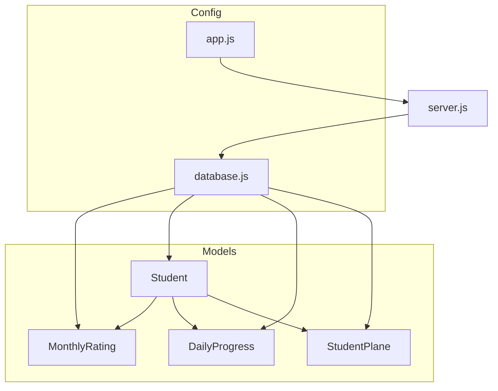
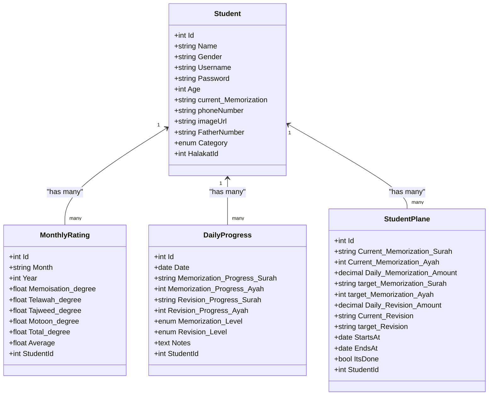
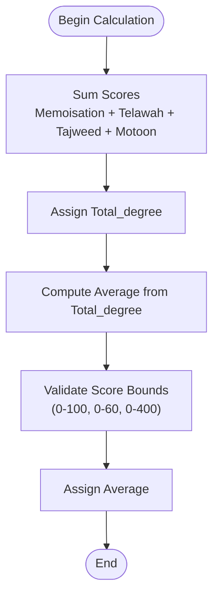
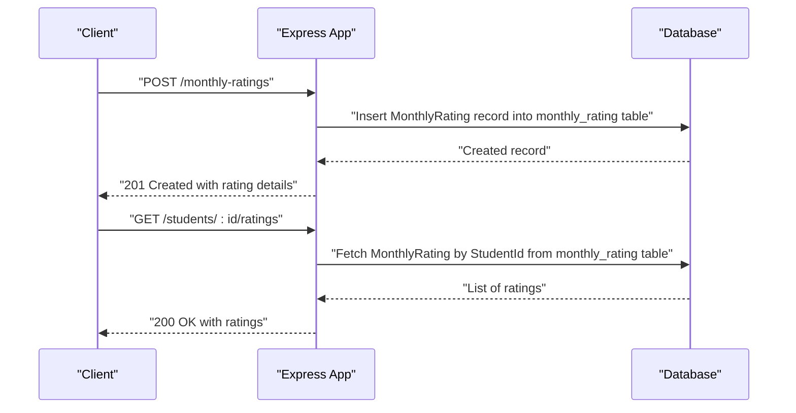
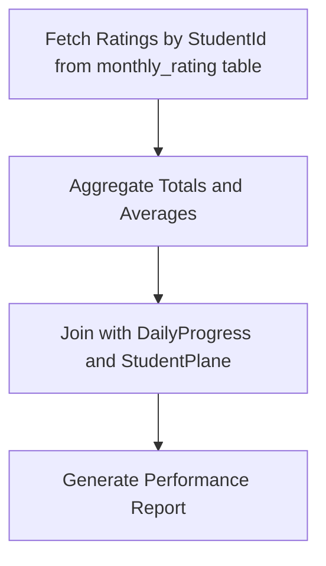
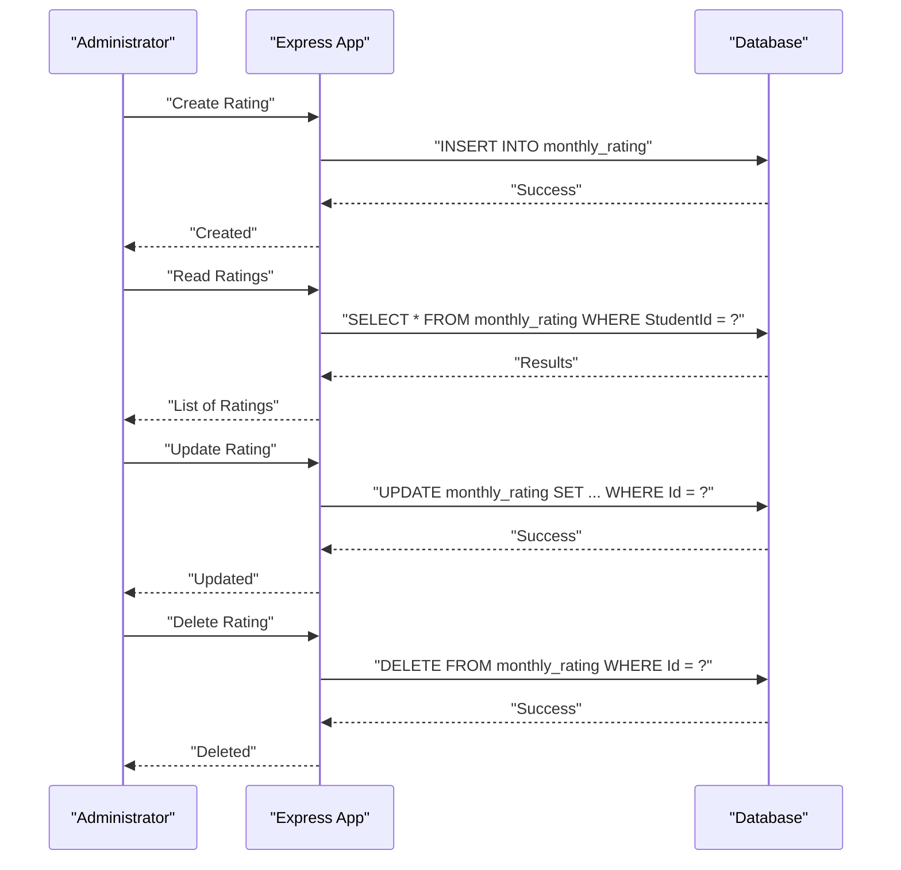
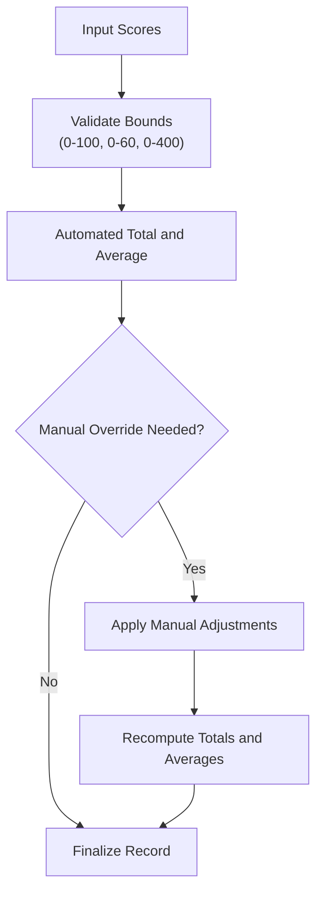
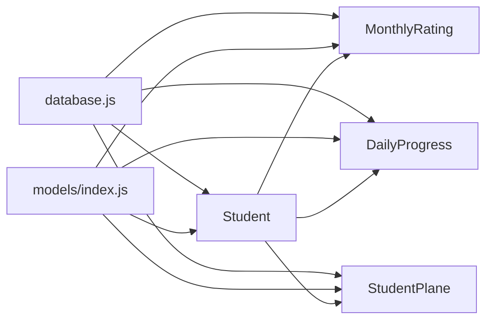

# Monthly Rating System

<cite>
**Referenced Files in This Document**
- [MonthlyRating.js](file://backend/src/models/MonthlyRating.js)
- [Student.js](file://backend/src/models/Student.js)
- [index.js](file://backend/src/models/index.js)
- [DailyProgress.js](file://backend/src/models/DailyProgress.js)
- [StudentPlane.js](file://backend/src/models/StudentPlane.js)
- [database.js](file://backend/src/config/database.js)
- [server.js](file://backend/server.js)
- [app.js](file://backend/src/config/app.js)
- [README.md](file://README.md)
</cite>

## Update Summary
**Changes Made**
- Updated field naming from 'Avarage' to 'Average' throughout the documentation
- Corrected table naming from 'MonthlyRating' to 'monthly_rating' in model configuration
- Enhanced validation rules documentation with proper degree ranges (0-100 for memorization/telawah, 0-60 for tajweed, 0-400 for motoon)
- Updated model associations and table references to reflect the corrected table naming

## Table of Contents
1. [Introduction](#introduction)
2. [Project Structure](#project-structure)
3. [Core Components](#core-components)
4. [Architecture Overview](#architecture-overview)
5. [Detailed Component Analysis](#detailed-component-analysis)
6. [Dependency Analysis](#dependency-analysis)
7. [Performance Considerations](#performance-considerations)
8. [Troubleshooting Guide](#troubleshooting-guide)
9. [Conclusion](#conclusion)

## Introduction
This document describes the Monthly Rating System within the Khirocom platform, focusing on academic performance evaluation and scoring. It explains the MonthlyRating model schema, rating calculation algorithms, performance evaluation workflows, and report generation processes. It also documents the relationship between monthly ratings and student progress, including cumulative performance tracking and academic achievement assessment. The guide details rating CRUD operations, automated calculation processes, and manual override capabilities, and provides practical examples of rating entry, calculation validation, and performance report generation. Finally, it outlines rating criteria, scoring rubrics, evaluation standards, rating consistency, quality assurance, and integration with student learning plans and center performance metrics.

## Project Structure
The Monthly Rating System is part of a layered backend built with Node.js, Express, and Sequelize ORM. The relevant components include:
- Model definitions for MonthlyRating, Student, DailyProgress, StudentPlane, and related entities
- Centralized model registry and associations
- Database configuration and server bootstrap
- Basic Express application setup

**Diagram sources**
- [MonthlyRating.js:1-70](file://backend/src/models/MonthlyRating.js#L1-L70)
- [Student.js:1-84](file://backend/src/models/Student.js#L1-L84)
- [DailyProgress.js:1-64](file://backend/src/models/DailyProgress.js#L1-L64)
- [StudentPlane.js:1-76](file://backend/src/models/StudentPlane.js#L1-L76)
- [database.js:1-16](file://backend/src/config/database.js#L1-L16)
- [server.js:1-25](file://backend/server.js#L1-L25)
- [app.js:1-12](file://backend/src/config/app.js#L1-L12)

**Section sources**
- [README.md:1-1](file://README.md#L1-L1)
- [server.js:1-25](file://backend/server.js#L1-L25)
- [database.js:1-16](file://backend/src/config/database.js#L1-L16)

## Core Components
This section documents the MonthlyRating model schema and its relationships with other entities, along with supporting models that inform rating calculations and reporting.

- MonthlyRating model fields and validations:
  - Memoisation_degree: numeric score bounded between 0 and 100
  - Telawah_degree: numeric score bounded between 0 and 100
  - Tajweed_degree: numeric score bounded between 0 and 60
  - Motoon_degree: numeric score bounded between 0 and 400
  - Total_degree: computed total of the above scores
  - Average: computed average derived from Total_degree
  - StudentId: foreign key linking to Student
  - Month: string field for month identification
  - Year: integer field for year identification

- Table Naming and Model Configuration:
  - Model name: "MonthlyRating"
  - Database table: "monthly_rating"
  - Timestamps enabled for created_at and updated_at tracking

- Associations:
  - MonthlyRating belongsTo Student via StudentId
  - Student hasMany MonthlyRating instances
  - Student hasMany DailyProgress and StudentPlane entries

These relationships enable cumulative performance tracking and integration with daily progress and learning plans.

**Section sources**
- [MonthlyRating.js:8-68](file://backend/src/models/MonthlyRating.js#L8-L68)
- [index.js:31-33](file://backend/src/models/index.js#L31-L33)
- [Student.js:1-84](file://backend/src/models/Student.js#L1-L84)
- [DailyProgress.js:1-64](file://backend/src/models/DailyProgress.js#L1-L64)
- [StudentPlane.js:1-76](file://backend/src/models/StudentPlane.js#L1-L76)

## Architecture Overview
The Monthly Rating System architecture centers around the MonthlyRating model and its associations with Student, DailyProgress, and StudentPlane. The server initializes the database connection and registers models, while the Express app provides a basic endpoint. The model registry defines foreign keys and associations that support reporting and analytics.

**Diagram sources**
- [MonthlyRating.js:8-68](file://backend/src/models/MonthlyRating.js#L8-L68)
- [Student.js:6-84](file://backend/src/models/Student.js#L6-L84)
- [DailyProgress.js:6-62](file://backend/src/models/DailyProgress.js#L6-L62)
- [StudentPlane.js:6-75](file://backend/src/models/StudentPlane.js#L6-L75)

## Detailed Component Analysis

### MonthlyRating Model Schema
The MonthlyRating model defines the academic evaluation fields and constraints:
- Core evaluation fields with validation bounds:
  - Memoisation_degree: 0–100 (memorization mastery)
  - Telawah_degree: 0–100 (recitation proficiency)
  - Tajweed_degree: 0–60 (proper recitation rules mastery)
  - Motoon_degree: 0–400 (repetition and reinforcement activities)
- Computed fields:
  - Total_degree: sum of the four scores
  - Average: average derived from Total_degree
- Administrative fields:
  - Month: string identifier for the rating period
  - Year: integer identifier for the rating period
- Foreign key:
  - StudentId links to Student.Id

The model uses "monthly_rating" as the database table name and "MonthlyRating" as the model name, with timestamps enabled for audit trail purposes.

**Section sources**
- [MonthlyRating.js:15-68](file://backend/src/models/MonthlyRating.js#L15-L68)

### Rating Calculation Algorithms
The MonthlyRating model exposes Total_degree and Average fields. While the model definition does not include explicit calculation logic, typical implementation would:
- Compute Total_degree as the sum of Memoisation_degree, Telawah_degree, Tajweed_degree, and Motoon_degree
- Compute Average as a function of Total_degree (e.g., normalized average across components)
- Enforce validation bounds during data entry and calculation

[No sources needed since this diagram shows conceptual workflow, not actual code structure]

### Performance Evaluation Workflows
Monthly ratings integrate with:
- DailyProgress: daily memorization and revision metrics and levels
- StudentPlane: current and target memorization/revision amounts and timelines

Workflows:
- Data aggregation: collect daily progress and learning plan data for a month
- Scoring: map daily achievements to Memoisation_degree, Telawah_degree, Tajweed_degree, and Motoon_degree
- Aggregation: compute Total_degree and Average
- Reporting: generate performance reports per student and group metrics

[No sources needed since this diagram shows conceptual workflow, not actual code structure]

### Report Generation Processes
Reports can be generated by:
- Filtering MonthlyRating records by StudentId from the monthly_rating table
- Aggregating Total_degree and Average across months
- Joining with Student, DailyProgress, and StudentPlane for contextual insights

[No sources needed since this diagram shows conceptual workflow, not actual code structure]

### Rating CRUD Operations
CRUD operations for MonthlyRating:
- Create: Submit rating fields; Total_degree and Average can be computed post-save or pre-validated
- Read: Retrieve by StudentId for performance history
- Update: Adjust scores and recompute totals/averages
- Delete: Remove rating records when needed

[No sources needed since this diagram shows conceptual workflow, not actual code structure]

### Automated Calculation vs Manual Override
- Automated calculation: compute Total_degree and Average based on validated inputs with proper score bounds
- Manual override: allow authorized users to adjust scores and recalculate totals/averages
- Validation: enforce score bounds (0-100 for memorization/telawah, 0-60 for tajweed, 0-400 for motoon) and derived field consistency

[No sources needed since this diagram shows conceptual workflow, not actual code structure]

### Practical Examples
- Rating entry: submit Memoisation_degree, Telawah_degree, Tajweed_degree, Motoon_degree for a student
- Calculation validation: ensure scores are within bounds (0-100 for memorization/telawah, 0-60 for tajweed, 0-400 for motoon) and totals/averages align with expectations
- Performance report generation: compile monthly ratings with daily progress and learning plan data for a comprehensive view

[No sources needed since this section provides general guidance]

### Rating Criteria, Scoring Rubrics, and Evaluation Standards
- Memoisation_degree: reflects memorization mastery aligned with daily progress and targets (0-100 scale)
- Telawah_degree: reflects recitation proficiency aligned with daily progress and levels (0-100 scale)
- Tajweed_degree: reflects proper recitation rules mastery (0-60 scale)
- Motoon_degree: reflects repetition and reinforcement activities (0-400 scale)
- Evaluation standards: maintain score bounds and derive Total_degree and Average consistently
- Table structure: stored in "monthly_rating" table with proper validation constraints

[No sources needed since this section provides general guidance]

### Integration with Student Learning Plans and Center Performance Metrics
- StudentPlane provides current and target metrics that inform rating criteria
- DailyProgress provides daily achievement levels that feed into monthly totals
- Center performance metrics can be derived by aggregating student ratings across halakat and centers
- The "monthly_rating" table structure supports efficient querying and reporting

[No sources needed since this section provides general guidance]

## Dependency Analysis
The MonthlyRating model depends on the database configuration and is registered in the centralized model index. Associations define how MonthlyRating relates to Student, DailyProgress, and StudentPlane.

**Diagram sources**
- [database.js:1-16](file://backend/src/config/database.js#L1-L16)
- [index.js:1-64](file://backend/src/models/index.js#L1-L64)
- [MonthlyRating.js:64-68](file://backend/src/models/MonthlyRating.js#L64-L68)

**Section sources**
- [index.js:31-33](file://backend/src/models/index.js#L31-L33)
- [MonthlyRating.js:64-68](file://backend/src/models/MonthlyRating.js#L64-L68)

## Performance Considerations
- Indexing: ensure StudentId is indexed for efficient joins and queries on the monthly_rating table
- Aggregation: compute Total_degree and Average efficiently during inserts/updates
- Batch operations: optimize bulk rating creation and updates
- Caching: cache frequently accessed rating histories per student
- Table optimization: the "monthly_rating" table structure supports efficient querying and reporting

[No sources needed since this section provides general guidance]

## Troubleshooting Guide
Common issues and resolutions:
- Validation errors: ensure scores are within defined bounds (0-100 for memorization/telawah, 0-60 for tajweed, 0-400 for motoon) before saving
- Association errors: verify StudentId exists and is valid
- Calculation mismatches: confirm Total_degree and Average derivation logic
- Table naming issues: ensure queries reference "monthly_rating" table, not "MonthlyRating"
- Field naming issues: use "Average" instead of "Avarage" in queries and calculations
- Server startup: check database connectivity and model synchronization

**Section sources**
- [MonthlyRating.js:25-52](file://backend/src/models/MonthlyRating.js#L25-L52)
- [server.js:8-23](file://backend/server.js#L8-L23)
- [database.js:4-15](file://backend/src/config/database.js#L4-L15)

## Conclusion
The Monthly Rating System in Khirocom provides a structured framework for evaluating student academic performance across memorization, recitation, Tajweed, and repetition. The MonthlyRating model, configured with proper table naming ("monthly_rating"), supported by associations with Student, DailyProgress, and StudentPlane, enables robust reporting and cumulative tracking. By enforcing score bounds (0-100 for memorization/telawah, 0-60 for tajweed, 0-400 for motoon), automating totals and averages, and allowing manual overrides, the system supports both consistency and flexibility. The corrected field naming from 'Avarage' to 'Average' and proper table naming ensures data integrity and query reliability. Integrating with student learning plans and center metrics further enhances the platform's ability to assess and improve educational outcomes.