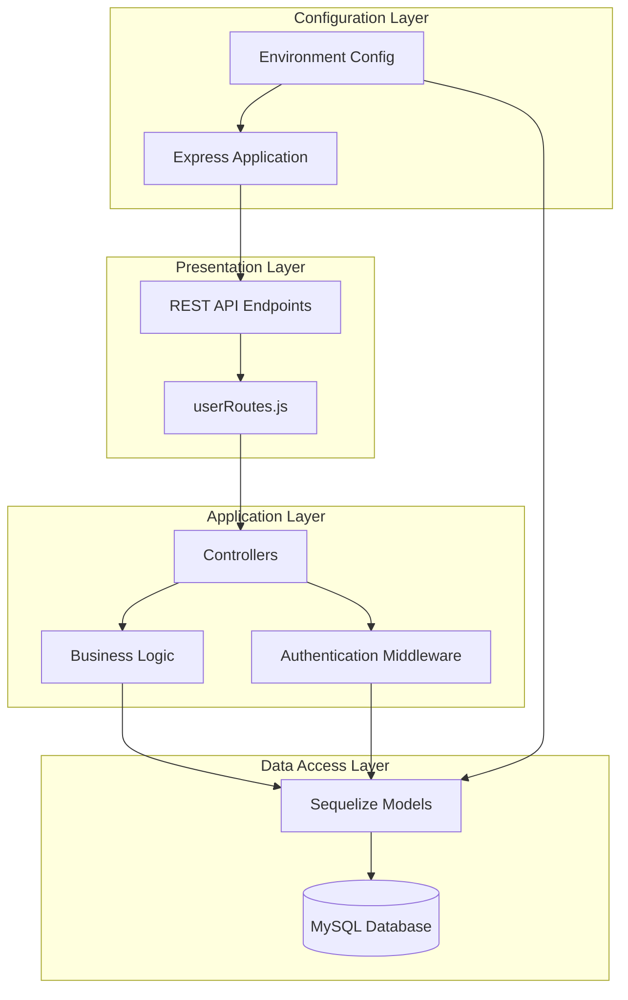
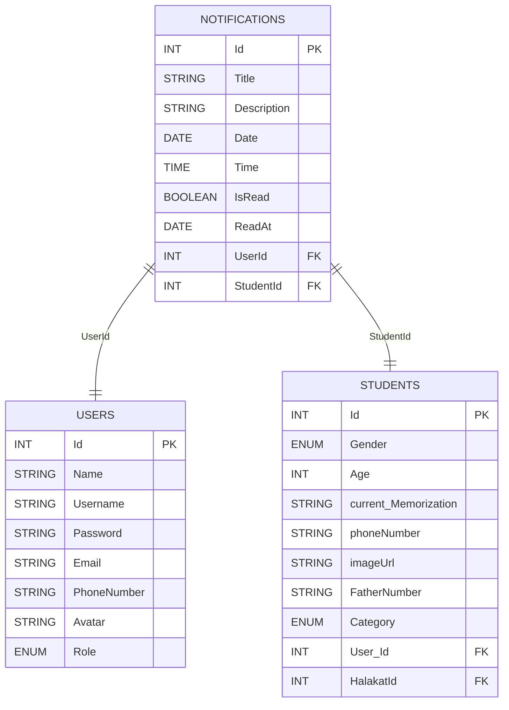
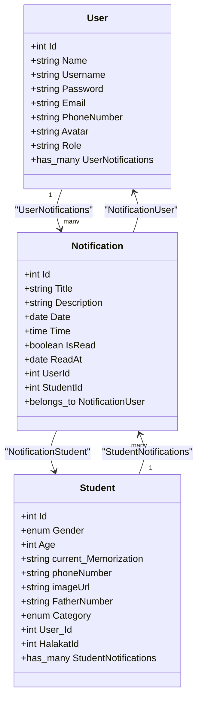
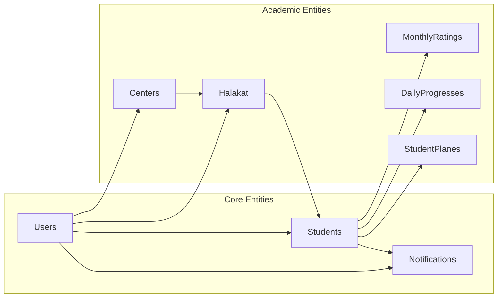
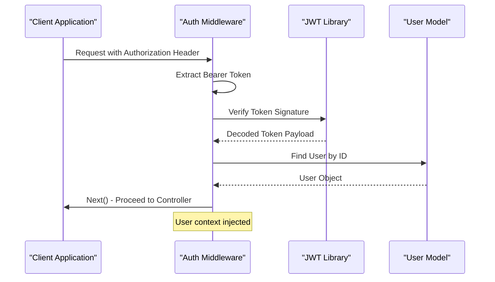
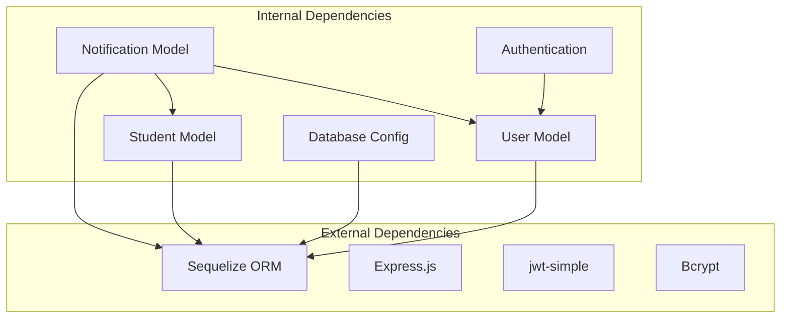

# Notification Management System

<cite>
**Referenced Files in This Document**
- [Notification.js](file://backend/src/models/Notification.js)
- [UserController.js](file://backend/src/controllers/UserController.js)
- [userRoutes.js](file://backend/src/routes/userRoutes.js)
- [server.js](file://backend/server.js)
- [database.js](file://backend/src/config/database.js)
- [app.js](file://backend/src/config/app.js)
- [index.js](file://backend/src/models/index.js)
- [auth.js](file://backend/src/middleware/auth.js)
- [User.js](file://backend/src/models/User.js)
- [student.js](file://backend/src/models/student.js)
- [package.json](file://backend/package.json)
</cite>

## Table of Contents
1. [Introduction](#introduction)
2. [System Architecture](#system-architecture)
3. [Core Components](#core-components)
4. [Notification Model Analysis](#notification-model-analysis)
5. [User Management Integration](#user-management-integration)
6. [Database Schema Design](#database-schema-design)
7. [API Endpoints](#api-endpoints)
8. [Authentication System](#authentication-system)
9. [Relationships and Dependencies](#relationships-and-dependencies)
10. [Implementation Details](#implementation-details)
11. [Performance Considerations](#performance-considerations)
12. [Troubleshooting Guide](#troubleshooting-guide)
13. [Conclusion](#conclusion)

## Introduction

The Notification Management System is a comprehensive backend solution built with Node.js and Express.js that provides notification functionality integrated with a user management system. This system enables the creation, retrieval, and management of notifications for users and students within an educational institution context. The system leverages Sequelize ORM for database operations and implements JWT-based authentication for secure access control.

The platform supports multiple notification types with flexible targeting mechanisms, allowing administrators to send notifications to individual users, specific student groups, or broadcast messages to entire user bases. The system is designed with scalability in mind, supporting future enhancements for real-time notifications and advanced filtering capabilities.

## System Architecture

The Notification Management System follows a modular architecture pattern with clear separation of concerns across different layers:

**Diagram sources**
- [server.js:1-25](file://backend/server.js#L1-L25)
- [app.js:1-16](file://backend/src/config/app.js#L1-L16)
- [userRoutes.js:1-8](file://backend/src/routes/userRoutes.js#L1-L8)

The architecture consists of four primary layers:

1. **Presentation Layer**: Handles HTTP requests and responses through RESTful endpoints
2. **Application Layer**: Contains business logic and controller implementations
3. **Data Access Layer**: Manages database operations through Sequelize ORM
4. **Configuration Layer**: Provides environment-specific settings and application initialization

**Section sources**
- [server.js:1-25](file://backend/server.js#L1-L25)
- [app.js:1-16](file://backend/src/config/app.js#L1-L16)

## Core Components

### Database Configuration

The system uses MySQL as the primary database with Sequelize ORM for object-relational mapping. The database configuration supports environment-based connection management and includes comprehensive logging controls.

### Authentication System

The authentication middleware implements JWT-based token verification with automatic user context injection. The system supports multiple user roles including admin, teacher, supervisor, wave, and student, enabling role-based access control.

### Notification Management

The core notification system provides comprehensive CRUD operations with support for user-specific and student-specific notifications. The system maintains read/unread status tracking and timestamp management.

**Section sources**
- [database.js:1-16](file://backend/src/config/database.js#L1-L16)
- [auth.js:1-25](file://backend/src/middleware/auth.js#L1-L25)
- [Notification.js:1-74](file://backend/src/models/Notification.js#L1-L74)

## Notification Model Analysis

The Notification model serves as the central component for managing all notification-related data within the system. It implements a comprehensive schema designed to support various notification types and delivery mechanisms.

### Model Schema

**Diagram sources**
- [Notification.js:7-64](file://backend/src/models/Notification.js#L7-L64)
- [User.js:6-56](file://backend/src/models/User.js#L6-L56)
- [student.js:6-86](file://backend/src/models/student.js#L6-L86)

### Key Features

1. **Flexible Targeting**: Notifications can be associated with either users or students, or both
2. **Status Tracking**: Built-in read/unread status with automatic timestamp updates
3. **Temporal Organization**: Separate date and time fields for precise scheduling
4. **Audit Trail**: Automatic timestamp creation and modification tracking

### Implementation Details

The model utilizes Sequelize's built-in timestamp functionality and includes comprehensive foreign key constraints ensuring referential integrity. The design supports cascading operations and maintains data consistency across related entities.

**Section sources**
- [Notification.js:1-74](file://backend/src/models/Notification.js#L1-L74)

## User Management Integration

The notification system integrates seamlessly with the user management subsystem, enabling targeted notifications based on user roles and relationships.

### User-Notification Relationship

**Diagram sources**
- [User.js:1-61](file://backend/src/models/User.js#L1-L61)
- [Notification.js:43-50](file://backend/src/models/Notification.js#L43-L50)
- [student.js:1-89](file://backend/src/models/student.js#L1-L89)

### Role-Based Access Control

The system implements role-based access control through the User model's Role enumeration, supporting administrative oversight and user-specific notification delivery. The authentication middleware ensures secure access to notification operations.

**Section sources**
- [User.js:1-61](file://backend/src/models/User.js#L1-L61)
- [auth.js:1-25](file://backend/src/middleware/auth.js#L1-L25)

## Database Schema Design

The database schema reflects a normalized design optimized for educational institution management with notification capabilities.

### Entity Relationships

**Diagram sources**
- [index.js:13-54](file://backend/src/models/index.js#L13-L54)

### Foreign Key Constraints

The schema establishes comprehensive foreign key relationships ensuring data integrity across the notification ecosystem. Each relationship is carefully designed to support the educational institution's hierarchical structure while maintaining flexibility for notification targeting.

**Section sources**
- [index.js:1-67](file://backend/src/models/index.js#L1-L67)

## API Endpoints

The system provides a focused set of RESTful endpoints for user management and basic authentication operations. While the notification-specific endpoints are not implemented in the current codebase, the framework is established for future expansion.

### Current Endpoints

| Endpoint | Method | Description | Authentication |
|----------|--------|-------------|----------------|
| `/users/adduser` | POST | Create new user account | No |
| `/users/login` | POST | Authenticate user credentials | No |

### Request/Response Patterns

The API follows consistent patterns for request handling and response formatting, utilizing appropriate HTTP status codes and standardized error messaging.

**Section sources**
- [userRoutes.js:1-8](file://backend/src/routes/userRoutes.js#L1-L8)
- [UserController.js:8-66](file://backend/src/controllers/UserController.js#L8-L66)

## Authentication System

The authentication system implements JWT-based token verification with comprehensive error handling and user context management.

### Token Verification Flow

**Diagram sources**
- [auth.js:4-24](file://backend/src/middleware/auth.js#L4-L24)

### Security Implementation

The authentication middleware validates token presence, verifies signature authenticity, and ensures user existence. The system uses environment-specific secret keys and implements proper error handling for invalid tokens and missing user records.

**Section sources**
- [auth.js:1-25](file://backend/src/middleware/auth.js#L1-L25)

## Relationships and Dependencies

The notification system maintains comprehensive relationships with other system components through carefully designed foreign key constraints and association patterns.

### Association Patterns

The system implements multiple association patterns:

1. **One-to-Many Relationships**: Users to Notifications, Students to Notifications
2. **Belongs-To Associations**: Reverse navigation for parent-child relationships
3. **Optional Associations**: Support for notifications targeting either users or students

### Dependency Management

**Diagram sources**
- [package.json:1-14](file://backend/package.json#L1-L14)
- [index.js:43-50](file://backend/src/models/index.js#L43-L50)

**Section sources**
- [package.json:1-14](file://backend/package.json#L1-L14)
- [index.js:1-67](file://backend/src/models/index.js#L1-L67)

## Implementation Details

### Server Initialization

The server initialization process coordinates database connectivity, model registration, and HTTP server startup with comprehensive error handling and logging.

### Environment Configuration

The system utilizes environment variables for database connection details, JWT secrets, and application settings, enabling deployment flexibility across different environments.

### Error Handling Strategy

The implementation includes comprehensive error handling at multiple levels:
- Database connection errors
- Authentication failures
- Validation errors
- Operational exceptions

**Section sources**
- [server.js:8-23](file://backend/server.js#L8-L23)
- [database.js:1-16](file://backend/src/config/database.js#L1-L16)

## Performance Considerations

### Database Optimization

The system is designed with several performance optimization strategies:

1. **Connection Pooling**: Sequelize manages database connections efficiently
2. **Indexing Strategy**: Foreign key relationships support efficient joins
3. **Query Optimization**: Eager loading through associations reduces N+1 query problems
4. **Caching Opportunities**: Potential for Redis caching of frequently accessed notifications

### Scalability Factors

1. **Horizontal Scaling**: Stateless design supports load balancing
2. **Database Scaling**: MySQL clustering support for high availability
3. **API Rate Limiting**: Can be implemented for protection against abuse
4. **Background Processing**: Queue systems could handle notification delivery

## Troubleshooting Guide

### Common Issues and Solutions

#### Database Connection Problems
- **Symptoms**: Server fails to start with database errors
- **Causes**: Incorrect database credentials, network issues, service downtime
- **Solutions**: Verify environment variables, check database service status, validate network connectivity

#### Authentication Failures
- **Symptoms**: 401 Unauthorized responses for protected routes
- **Causes**: Invalid JWT tokens, expired tokens, malformed authorization headers
- **Solutions**: Regenerate tokens, verify token format, check JWT secret configuration

#### Model Synchronization Issues
- **Symptoms**: Migration errors or schema inconsistencies
- **Causes**: Version mismatches, concurrent schema changes
- **Solutions**: Review migration logs, ensure single point of schema management, validate foreign key constraints

#### Performance Degradation
- **Symptoms**: Slow response times, increased database query times
- **Causes**: Missing indexes, inefficient queries, insufficient hardware resources
- **Solutions**: Analyze query performance, add appropriate indexes, optimize database configuration

**Section sources**
- [server.js:20-22](file://backend/server.js#L20-L22)
- [auth.js:21-24](file://backend/src/middleware/auth.js#L21-L24)

## Conclusion

The Notification Management System represents a robust foundation for educational institution communication needs. The system's modular architecture, comprehensive database design, and secure authentication framework provide a solid base for future enhancements including real-time notifications, advanced filtering capabilities, and integration with external communication channels.

Key strengths of the implementation include:

- **Scalable Architecture**: Clean separation of concerns enabling easy maintenance and extension
- **Data Integrity**: Comprehensive foreign key relationships and validation
- **Security Focus**: JWT-based authentication with proper error handling
- **Flexibility**: Support for multiple notification targets and future extensibility

Future development opportunities include implementing the notification CRUD endpoints, adding real-time notification delivery, integrating with external messaging systems, and implementing notification analytics and reporting capabilities.

The system's design principles and implementation patterns provide a strong foundation for building comprehensive educational management solutions while maintaining code quality and architectural integrity.