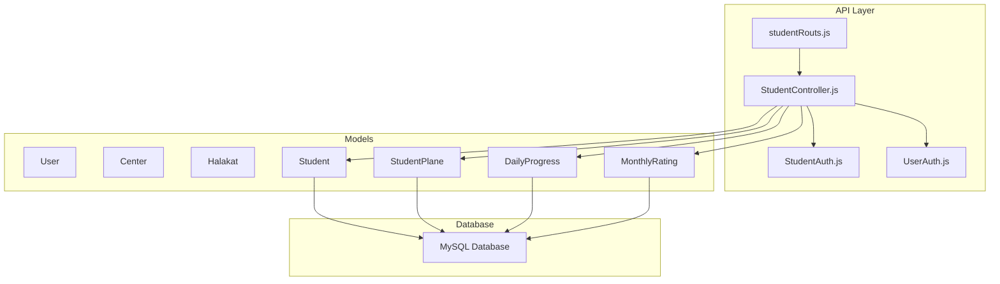
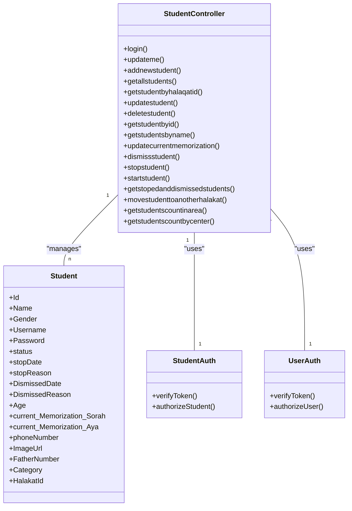
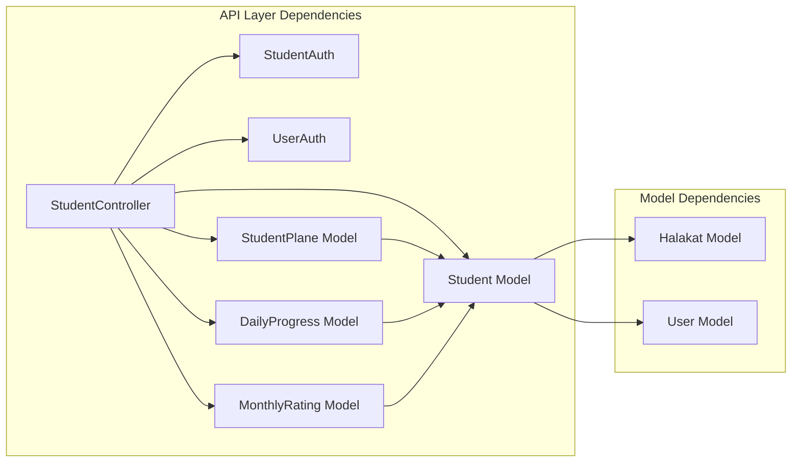
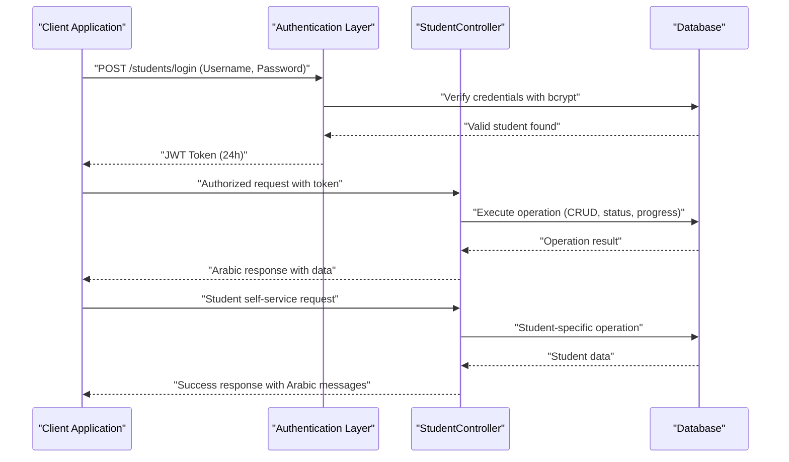

# Student Management

<cite>
**Referenced Files in This Document**
- [Student.js](file://backend/src/models/Student.js)
- [StudentPlane.js](file://backend/src/models/StudentPlane.js)
- [DailyProgress.js](file://backend/src/models/DailyProgress.js)
- [MonthlyRating.js](file://backend/src/models/MonthlyRating.js)
- [StudentController.js](file://backend/src/controllers/StudentController.js)
- [StudentAuth.js](file://backend/src/middleware/StudentAuth.js)
- [UserAuth.js](file://backend/src/middleware/UserAuth.js)
- [studentRouts.js](file://backend/src/routes/studentRouts.js)
- [index.js](file://backend/src/models/index.js)
- [server.js](file://backend/server.js)
- [User.js](file://backend/src/models/User.js)
- [Center.js](file://backend/src/models/Center.js)
- [Halakat.js](file://backend/src/models/Halakat.js)
- [database.js](file://backend/src/config/database.js)
- [UserController.js](file://backend/src/controllers/UserController.js)
</cite>

## Update Summary
**Changes Made**
- Added comprehensive StudentController.js with 18 endpoints covering full CRUD operations, authentication, status management, and academic tracking
- Implemented StudentAuth middleware for student token-based authentication and authorization
- Created student routing system with dedicated endpoints for student management
- Enhanced Student model with additional fields for student status tracking (stopDate, stopReason, DismissedDate, DismissedReason)
- Integrated JWT-based authentication system with automatic username generation from phone numbers
- Added administrative operations for student enrollment management, status tracking, and academic progress monitoring
- Implemented comprehensive Arabic language support throughout the student management API with localized responses

## Table of Contents
1. [Introduction](#introduction)
2. [Project Structure](#project-structure)
3. [Core Components](#core-components)
4. [Architecture Overview](#architecture-overview)
5. [Detailed Component Analysis](#detailed-component-analysis)
6. [API Endpoints and Authentication](#api-endpoints-and-authentication)
7. [Dependency Analysis](#dependency-analysis)
8. [Performance Considerations](#performance-considerations)
9. [Troubleshooting Guide](#troubleshooting-guide)
10. [Conclusion](#conclusion)
11. [Appendices](#appendices)

## Introduction
This document describes the comprehensive student management subsystem of the Khirocom system with a focus on student enrollment, personal information management, academic tracking, and administrative operations. The system now features a complete RESTful API with 18 endpoints, JWT-based authentication, Arabic language support, and integrated academic progress monitoring. It documents the enhanced Student model schema, student authentication system, administrative workflows, and relationships with learning plans and progress tracking systems.

## Project Structure
The backend is organized around Sequelize models with a comprehensive controller-layer architecture and dedicated routing system. The student domain now includes a full-featured API with authentication middleware, administrative endpoints, and integration with learning management systems. The system maintains comprehensive Arabic language support throughout all components with proper UTF-8 encoding configuration.

**Diagram sources**
- [studentRouts.js:1-24](file://backend/src/routes/studentRouts.js#L1-L24)
- [StudentController.js:1-346](file://backend/src/controllers/StudentController.js#L1-L346)
- [StudentAuth.js:1-27](file://backend/src/middleware/StudentAuth.js#L1-L27)
- [UserAuth.js:1-25](file://backend/src/middleware/UserAuth.js#L1-L25)

**Section sources**
- [studentRouts.js:1-24](file://backend/src/routes/studentRouts.js#L1-L24)
- [StudentController.js:1-346](file://backend/src/controllers/StudentController.js#L1-L346)
- [StudentAuth.js:1-27](file://backend/src/middleware/StudentAuth.js#L1-L27)
- [UserAuth.js:1-25](file://backend/src/middleware/UserAuth.js#L1-L25)

## Core Components
This section documents the enhanced core entities and their roles in comprehensive student management, now featuring full API coverage and Arabic language support.

- **StudentController**: Comprehensive controller managing 18 endpoints for student operations including authentication, CRUD operations, status management, and academic tracking
- **StudentAuth Middleware**: JWT-based authentication middleware for student token verification and authorization
- **Student Model**: Enhanced with Arabic status tracking fields (stopDate, stopReason, DismissedDate, DismissedReason) and improved authentication capabilities
- **StudentPlane**: Individualized learning targets and progress tracking with academic monitoring
- **DailyProgress**: Daily memorization and revision progress with Arabic qualitative assessments
- **MonthlyRating**: Consolidated academic performance ratings across multiple competencies

**Section sources**
- [StudentController.js:1-346](file://backend/src/controllers/StudentController.js#L1-L346)
- [StudentAuth.js:1-27](file://backend/src/middleware/StudentAuth.js#L1-L27)
- [Student.js:1-118](file://backend/src/models/Student.js#L1-L118)
- [StudentPlane.js:1-76](file://backend/src/models/StudentPlane.js#L1-L76)
- [DailyProgress.js:1-76](file://backend/src/models/DailyProgress.js#L1-L76)
- [MonthlyRating.js:1-70](file://backend/src/models/MonthlyRating.js#L1-L70)

## Architecture Overview
The student management architecture now centers on a comprehensive RESTful API with JWT authentication, administrative controls, and integrated academic tracking. The system includes Arabic language support throughout all components with dedicated authentication flows for both users and students.

**Diagram sources**
- [StudentController.js:1-346](file://backend/src/controllers/StudentController.js#L1-L346)
- [StudentAuth.js:1-27](file://backend/src/middleware/StudentAuth.js#L1-L27)
- [Student.js:1-118](file://backend/src/models/Student.js#L1-L118)
- [UserAuth.js:1-25](file://backend/src/middleware/UserAuth.js#L1-L25)

## Detailed Component Analysis

### Enhanced Student Model Schema
The Student model has been significantly enhanced with comprehensive Arabic language support, authentication capabilities, and status tracking fields. The model now includes additional fields for administrative tracking and improved user experience.

**Updated** Enhanced with Arabic status tracking, improved authentication, and comprehensive administrative fields

Key fields:
- **Identity**: Id
- **Personal**: Name, Age, current_Memorization_Sorah, current_Memorization_Aya
- **Authentication**: Username, Password (256 characters with bcrypt hashing)
- **Gender**: Gender (Arabic ENUM: ذكر, أنثى)
- **Status**: status (Arabic ENUM: مستمر, منقطع, مفصول)
- **Administrative Tracking**: stopDate, stopReason, DismissedDate, DismissedReason
- **Contact**: phoneNumber, ImageUrl, FatherNumber
- **Classification**: Category (Arabic ENUM with comprehensive educational categories)
- **Enrollment**: HalakatId (foreign key)

Enhanced Arabic Status Classifications:
- **مستمر** (Continuing) - Default active status
- **منقطع** (Interrupted) - Temporary suspension with reason and date
- **مفصول** (Expelled) - Permanent dismissal with reason and date

Status Tracking Fields:
- **stopDate**: Date when student was suspended
- **stopReason**: Reason for suspension
- **DismissedDate**: Date when student was expelled
- **DismissedReason**: Reason for expulsion

Automatic Username Generation:
- Username automatically generated from phoneNumber if not provided
- Hook ensures unique login credentials for each student

**Section sources**
- [Student.js:1-118](file://backend/src/models/Student.js#L1-L118)

### Student Controller Endpoints
The StudentController.js provides comprehensive 18 endpoints covering all aspects of student management with Arabic language support and proper error handling.

**Updated** Complete API coverage with 18 endpoints for full student management operations

#### Authentication Endpoints
- **POST /students/login**: Student login with JWT token generation
- **PUT /students/updateme**: Student self-update with password hashing

#### CRUD Operations
- **POST /students/addnewstudent**: Create new student with automatic username generation
- **GET /students/getallstudents**: Retrieve all students with halakat information
- **GET /students/getstudentbyid**: Get specific student with halakat details
- **GET /students/getstudentbyhalaqatid**: Filter students by halakat/class
- **GET /students/getstudentsbyname**: Search students by name
- **PUT /students/updatestudent**: Update student information
- **DELETE /students/deletestudent**: Remove student from system

#### Academic Progress Management
- **PUT /students/updatecurrentmemorization**: Update current memorization progress
- **GET /students/getstopedanddismissedstudents**: Retrieve suspended/expelled students
- **GET /students/getstudentscountinarea**: Count students by area
- **GET /students/getstudentscountbycenter**: Count students by center

#### Administrative Operations
- **PUT /students/stopstudent**: Suspend student with reason and date
- **PUT /students/dismissstudent**: Expel student with reason and date
- **PUT /students/startstudent**: Reactivate suspended student
- **PUT /students/movestudenttoanotherhalakat**: Transfer student between classes

**Section sources**
- [StudentController.js:1-346](file://backend/src/controllers/StudentController.js#L1-L346)

### Student Authentication Middleware
The StudentAuth middleware provides JWT-based authentication specifically for student accounts, ensuring secure access to student-only endpoints.

**Updated** Dedicated student authentication with token verification and student validation

Key Features:
- **Token Extraction**: Extracts JWT token from Authorization header
- **JWT Verification**: Validates token signature using JWT_SECRET
- **Student Lookup**: Retrieves student by ID from verified token
- **Authorization**: Ensures student account exists and is active
- **Request Enhancement**: Attaches student object to request for downstream use

Authentication Flow:
1. Client sends Authorization: Bearer <token> header
2. Middleware extracts and verifies JWT token
3. Looks up student by decoded ID
4. Attaches student object to request
5. Proceeds to next middleware/controller

**Section sources**
- [StudentAuth.js:1-27](file://backend/src/middleware/StudentAuth.js#L1-L27)

### Student Routing System
The student routing system provides organized endpoint grouping with appropriate authentication middleware for different operation types.

**Updated** Complete routing system with 18 endpoints and proper middleware application

Routing Structure:
- **Public Routes**: /students/login (no authentication required)
- **Protected Routes**: All other student endpoints (require UserAuth)
- **Student-Only Routes**: /students/updateme (require StudentAuth)

Middleware Application:
- **UserAuth**: Applied to administrative endpoints requiring user authentication
- **StudentAuth**: Applied to student self-service endpoints
- **Route-Specific**: Different middleware combinations based on endpoint requirements

**Section sources**
- [studentRouts.js:1-24](file://backend/src/routes/studentRouts.js#L1-L24)

### Learning Plans (StudentPlane)
The StudentPlane model captures personalized learning targets and progress windows with comprehensive academic tracking capabilities.

**Updated** Enhanced with improved decimal precision and academic monitoring

Key Features:
- **Current Progress**: Current_Memorization_Surah, Current_Memorization_Ayah
- **Daily Targets**: Daily_Memorization_Amount, Daily_Revision_Amount
- **Target Goals**: target_Memorization_Surah, target_Memorization_Ayah, target_Revision
- **Time Management**: StartsAt, EndsAt for progress tracking windows
- **Completion Tracking**: ItsDone boolean flag for goal achievement
- **Foreign Key**: StudentId linking to student record

Usage:
- Defines individualized learning objectives for each student
- Tracks daily progress against established targets
- Supports academic monitoring and reporting

**Section sources**
- [StudentPlane.js:1-76](file://backend/src/models/StudentPlane.js#L1-L76)

### Daily Progress Tracking (DailyProgress)
DailyProgress captures comprehensive daily progress entries with Arabic qualitative assessments and detailed academic tracking.

**Updated** Enhanced with Arabic qualitative levels and improved academic monitoring

Key Features:
- **Date Tracking**: month, DayName, Date for temporal organization
- **Academic Progress**: Memorization_Progress_Surah/Ayah, Revision_Progress_Surah/Ayah
- **Quality Assessment**: Memorization_Level, Revision_Level (Arabic ENUM)
- **Notes**: Optional textual notes for progress commentary
- **Student Association**: StudentId foreign key for academic tracking

Arabic Qualitative Levels:
- **ضعيف** (Weak): Basic understanding
- **مقبول** (Acceptable): Satisfactory progress
- **جيد** (Good): Solid comprehension
- **جيد جدا** (Very Good): Excellent performance
- **ممتاز** (Excellent): Outstanding achievement

**Section sources**
- [DailyProgress.js:1-76](file://backend/src/models/DailyProgress.js#L1-L76)

### Monthly Rating System (MonthlyRating)
MonthlyRating provides consolidated academic performance assessment across multiple competencies with comprehensive validation and reporting capabilities.

**Updated** Enhanced with improved validation and academic monitoring

Key Features:
- **Temporal Organization**: Month, Year for academic period tracking
- **Competency Assessment**: Memoisation_degree, Telawah_degree, Tajweed_degree, Motoon_degree
- **Performance Metrics**: Total_degree, Average for overall assessment
- **Validation**: Min/max constraints for academic scores
- **Student Association**: StudentId foreign key for academic tracking

Validation Rules:
- **Memoisation_degree**: 0-100 scale
- **Telawah_degree**: 0-100 scale  
- **Tajweed_degree**: 0-60 scale
- **Motoon_degree**: 0-400 scale

**Section sources**
- [MonthlyRating.js:1-70](file://backend/src/models/MonthlyRating.js#L1-L70)

### Enhanced Enrollment and Profile Management Workflows
The system now provides comprehensive enrollment management with Arabic language support and administrative controls.

**Updated** Complete enrollment workflow with Arabic status tracking and administrative operations

#### Student Registration Workflow
1. **Data Collection**: Personal details, contact information, Arabic gender, category
2. **Automatic Username**: Generated from phoneNumber if not provided
3. **Password Hashing**: Secure password storage using bcrypt
4. **Enrollment Assignment**: HalakatId and User_Id assignment
5. **Status Initialization**: Default status set to "مستمر"

#### Profile Management Operations
- **Self-Service Updates**: updateme endpoint for student profile modifications
- **Administrative Updates**: updatestudent endpoint for staff-managed changes
- **Contact Information**: phoneNumber, ImageUrl, FatherNumber management
- **Academic Progress**: current_Memorization tracking and updates

#### Status Management Operations
- **Suspension**: stopstudent endpoint with reason and date logging
- **Expulsion**: dismissstudent endpoint with permanent status change
- **Reactivation**: startstudent endpoint for suspended student restoration
- **Transfer**: movestudenttoanotherhalakat for class changes

**Section sources**
- [StudentController.js:59-141](file://backend/src/controllers/StudentController.js#L59-L141)
- [Student.js:108-116](file://backend/src/models/Student.js#L108-L116)

### Academic Record Maintenance
The system provides comprehensive academic record maintenance across three integrated domains with Arabic language support and validation.

**Updated** Enhanced academic tracking with Arabic assessments and comprehensive monitoring

#### Learning Plan Management
- **Target Setting**: Define memorization and revision targets
- **Progress Tracking**: Monitor daily progress against targets
- **Deadline Management**: Track start and end dates for learning plans
- **Completion Monitoring**: Mark plans as completed (ItsDone)

#### Daily Progress Documentation
- **Progress Recording**: Daily Surah/Ayah progress tracking
- **Quality Assessment**: Arabic qualitative levels (ضعيف, مقبول, جيد, جيد جدا, ممتاز)
- **Commentary**: Optional notes for progress explanation
- **Temporal Organization**: Date-based progress documentation

#### Monthly Performance Assessment
- **Competency Evaluation**: Multi-subject academic assessment
- **Grade Calculation**: Automated total and average calculations
- **Performance Reporting**: Consolidated monthly performance insights
- **Historical Tracking**: Year-over-year academic progression

**Section sources**
- [StudentPlane.js:1-76](file://backend/src/models/StudentPlane.js#L1-L76)
- [DailyProgress.js:1-76](file://backend/src/models/DailyProgress.js#L1-L76)
- [MonthlyRating.js:1-70](file://backend/src/models/MonthlyRating.js#L1-L70)

### Practical Examples

#### Example 1: Student Registration Process
**Steps:**
1. Prepare student data with personal details, Arabic gender, category, contact information
2. Submit POST request to /students/addnewstudent with user authentication
3. System automatically generates Username from phoneNumber if not provided
4. Password is hashed using bcrypt before storage
5. Student enrolled with default status "مستمر" and assigned to specified Halakat

**Outcome:**
- New student record created with Arabic language support
- Automatic username generation ensures unique login credentials
- Student appears in halakat's student list with full enrollment details

#### Example 2: Student Login and Authentication
**Steps:**
1. Student submits POST request to /students/login with Username and Password
2. System validates credentials using bcrypt comparison
3. Successful authentication generates JWT token with 24-hour expiration
4. Token returned for subsequent authenticated requests

**Outcome:**
- Secure student authentication with token-based session management
- Arabic error messages for authentication failures
- Token required for accessing student-only endpoints

#### Example 3: Academic Progress Monitoring
**Steps:**
1. Create StudentPlane entry with targets and timeline
2. Daily progress entries with Arabic quality assessments
3. Monthly rating generation with competency-based evaluation
4. Status management for student enrollment tracking

**Outcome:**
- Comprehensive academic tracking with Arabic qualitative assessments
- Automated progress monitoring against learning targets
- Historical academic performance documentation

## API Endpoints and Authentication

### Authentication System
The system implements a dual-layer authentication approach with separate authentication for users and students.

**Student Authentication Flow:**
1. **Login Request**: POST /students/login with Username and Password
2. **Credential Verification**: bcrypt compares hashed passwords
3. **Token Generation**: JWT token with student ID and 24-hour expiration
4. **Response**: Authentication token for subsequent requests

**Student Self-Service Authentication:**
1. **Token Header**: Authorization: Bearer <token>
2. **Token Verification**: StudentAuth middleware validates JWT
3. **Student Lookup**: Retrieves student by decoded ID
4. **Request Enhancement**: Attaches student object to request

**Administrative Authentication:**
- All administrative endpoints require UserAuth middleware
- User authentication handled by UserAuth middleware
- JWT tokens for staff members with role-based access control

### Endpoint Categories

#### Public Endpoints
- **POST /students/login**: Student authentication (no prior authentication required)

#### Protected Endpoints (User Authentication Required)
- **GET /students/getallstudents**: Retrieve all students with halakat information
- **GET /students/getstudentbyhalaqatid**: Filter students by halakat/class
- **GET /students/getstudentbyid**: Get specific student details
- **GET /students/getstudentsbyname**: Search students by name
- **POST /students/addnewstudent**: Create new student record
- **PUT /students/updatestudent**: Update student information
- **DELETE /students/deletestudent**: Remove student from system
- **PUT /students/stopstudent**: Suspend student with reason and date
- **PUT /students/dismissstudent**: Expel student with reason and date
- **PUT /students/startstudent**: Reactivate suspended student
- **PUT /students/movestudenttoanotherhalakat**: Transfer student between classes
- **GET /students/getstopedanddismissedstudents**: Retrieve suspended/expelled students
- **GET /students/getstudentscountinarea**: Count students by area
- **GET /students/getstudentscountbycenter**: Count students by center

#### Student-Only Endpoints
- **PUT /students/updateme**: Student self-service profile updates

### Request/Response Patterns
All endpoints follow consistent Arabic language response patterns with appropriate HTTP status codes and error handling.

**Success Responses:**
- **200 OK**: Successful operations with success message and data
- **201 Created**: Successful resource creation
- **204 No Content**: Successful deletion operations

**Error Responses:**
- **400 Bad Request**: Invalid request data or missing parameters
- **401 Unauthorized**: Authentication failure or invalid tokens
- **404 Not Found**: Resource not found
- **500 Internal Server Error**: Server-side errors

**Section sources**
- [StudentController.js:1-346](file://backend/src/controllers/StudentController.js#L1-L346)
- [StudentAuth.js:1-27](file://backend/src/middleware/StudentAuth.js#L1-L27)
- [UserAuth.js:1-25](file://backend/src/middleware/UserAuth.js#L1-L25)
- [studentRouts.js:1-24](file://backend/src/routes/studentRouts.js#L1-L24)

## Dependency Analysis
The enhanced system maintains referential integrity across all components with comprehensive Arabic language support and proper foreign key constraints.

**Diagram sources**
- [StudentController.js:1-346](file://backend/src/controllers/StudentController.js#L1-L346)
- [StudentAuth.js:1-27](file://backend/src/middleware/StudentAuth.js#L1-L27)
- [UserAuth.js:1-25](file://backend/src/middleware/UserAuth.js#L1-L25)
- [index.js:1-91](file://backend/src/models/index.js#L1-L91)

**Section sources**
- [index.js:1-91](file://backend/src/models/index.js#L1-L91)
- [StudentController.js:1-346](file://backend/src/controllers/StudentController.js#L1-L346)

## Performance Considerations
- **Indexing Strategy**: Consider adding database indexes on frequently queried fields (Username, HalakatId, status) to optimize authentication and filtering operations
- **JWT Token Management**: Implement token expiration and refresh mechanisms for enhanced security
- **Password Hashing**: Use appropriate bcrypt cost factors for optimal security/performance balance
- **Query Optimization**: Leverage Sequelize associations and eager loading to minimize N+1 query problems
- **Caching Strategy**: Implement caching for frequently accessed student data and halakat information
- **Arabic Character Processing**: Ensure proper UTF-8mb4 encoding support for Arabic characters throughout the system
- **Authentication Security**: Implement rate limiting and failed attempt tracking for login endpoints
- **Database Connection Pooling**: Optimize connection pooling for concurrent API requests

## Troubleshooting Guide
Common issues and resolutions for the enhanced student management system:

**Authentication Issues:**
- **Login Failures**: Verify Username exists and Password matches bcrypt hash
- **Token Validation Errors**: Check JWT_SECRET environment variable and token expiration
- **Student Not Found**: Ensure student ID exists in database and account is not suspended/expelled

**Endpoint Access Problems:**
- **401 Unauthorized**: Verify proper authentication headers and token validity
- **403 Forbidden**: Check user permissions for administrative endpoints
- **404 Not Found**: Verify resource IDs and relationships exist

**Data Integrity Issues:**
- **Duplicate Username**: Ensure unique Username values or rely on automatic phoneNumber generation
- **Invalid Status Values**: Verify Arabic ENUM values match exactly (مستمر, منقطع, مفصول)
- **Missing Required Fields**: Check all required fields for student creation and updates

**Database Synchronization:**
- **Model Sync Errors**: Verify database connection and migration status
- **Foreign Key Constraints**: Ensure related records exist before creating dependent records
- **Arabic Character Encoding**: Confirm UTF-8mb4 support for Arabic characters

**Section sources**
- [StudentController.js:8-26](file://backend/src/controllers/StudentController.js#L8-L26)
- [StudentAuth.js:5-26](file://backend/src/middleware/StudentAuth.js#L5-L26)
- [Student.js:108-116](file://backend/src/models/Student.js#L108-L116)

## Conclusion
The enhanced Khirocom student management system provides a comprehensive foundation for student enrollment, personal information management, academic tracking, and administrative operations with full Arabic language support. The addition of 18 API endpoints, JWT-based authentication, Arabic status tracking, and integrated academic monitoring creates a robust platform for educational institution management.

The system's architecture supports scalable growth with proper middleware layers, comprehensive error handling, and Arabic localization throughout. The enhanced Student model with administrative tracking fields, combined with the StudentController's extensive functionality, enables efficient management of student lifecycle events from enrollment through completion.

Clear authentication flows, consistent API patterns, and comprehensive Arabic language support ensure cultural appropriateness and operational effectiveness. The system's modular design facilitates future enhancements while maintaining backward compatibility and operational reliability.

## Appendices

### Enhanced Data Flow: Student Management Operations

### Arabic Language Support Matrix
| Field Category | Arabic Options | Default Value | Usage Context |
|----------------|----------------|---------------|---------------|
| **Gender** | ذكر, أنثى | ذكر | Student personal information |
| **Status** | مستمر, منقطع, مفصول | مستمر | Enrollment status tracking |
| **Daily Level** | ضعيف, مقبول, جيد, جيد جدا, ممتاز | ضعيف | Academic progress assessment |
| **Monthly Rating** | Competency-based grades (0-100/60/400) | Calculated | Performance evaluation |
| **Halakat Type** | قراءة وكتاية, حفظ ومراجعة, إجازة, قراءات | حفظ ومراجعة | Class categorization |
| **Halakat Gender** | ذكور, إناث | ذكور | Class gender segregation |

### Enhanced API Endpoint Reference
| Endpoint | Method | Authentication | Description |
|----------|--------|----------------|-------------|
| `/students/login` | POST | None | Student authentication |
| `/students/updateme` | PUT | StudentAuth | Student self-service updates |
| `/students/addnewstudent` | POST | UserAuth | Create new student record |
| `/students/getallstudents` | GET | UserAuth | Retrieve all students |
| `/students/getstudentbyhalaqatid` | GET | UserAuth | Filter by halakat |
| `/students/getstudentbyid` | GET | UserAuth | Get specific student |
| `/students/getstudentsbyname` | GET | UserAuth | Search by name |
| `/students/updatestudent` | PUT | UserAuth | Update student info |
| `/students/deletestudent` | DELETE | UserAuth | Remove student |
| `/students/stopstudent` | PUT | UserAuth | Suspend student |
| `/students/dismissstudent` | PUT | UserAuth | Expel student |
| `/students/startstudent` | PUT | UserAuth | Reactivate student |
| `/students/movestudenttoanotherhalakat` | PUT | UserAuth | Transfer student |
| `/students/getstopedanddismissedstudents` | GET | UserAuth | Retrieve suspended/expelled |
| `/students/getstudentscountinarea` | GET | UserAuth | Count by area |
| `/students/getstudentscountbycenter` | GET | UserAuth | Count by center |

### Database Configuration for Enhanced Arabic Support
The system uses MySQL with UTF-8mb4 encoding to properly support Arabic characters and enhanced authentication:

**Section sources**
- [database.js:1-16](file://backend/src/config/database.js#L1-L16)
- [Student.js:17-19](file://backend/src/models/Student.js#L17-L19)
- [Student.js:32-37](file://backend/src/models/Student.js#L32-L37)
- [Student.js:80-93](file://backend/src/models/Student.js#L80-L93)
- [DailyProgress.js:45-54](file://backend/src/models/DailyProgress.js#L45-L54)
- [StudentController.js:1-346](file://backend/src/controllers/StudentController.js#L1-L346)
- [StudentAuth.js:1-27](file://backend/src/middleware/StudentAuth.js#L1-L27)
- [UserAuth.js:1-25](file://backend/src/middleware/UserAuth.js#L1-L25)
- [studentRouts.js:1-24](file://backend/src/routes/studentRouts.js#L1-L24)