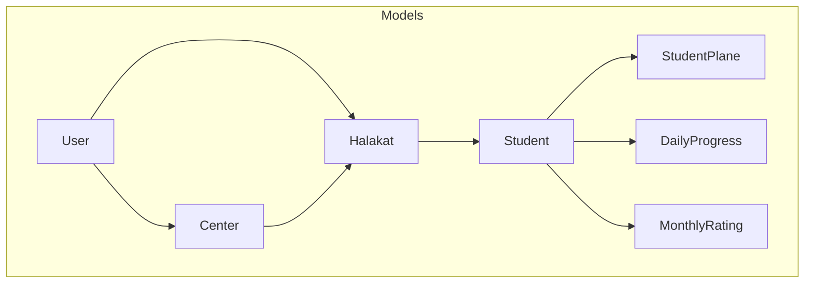
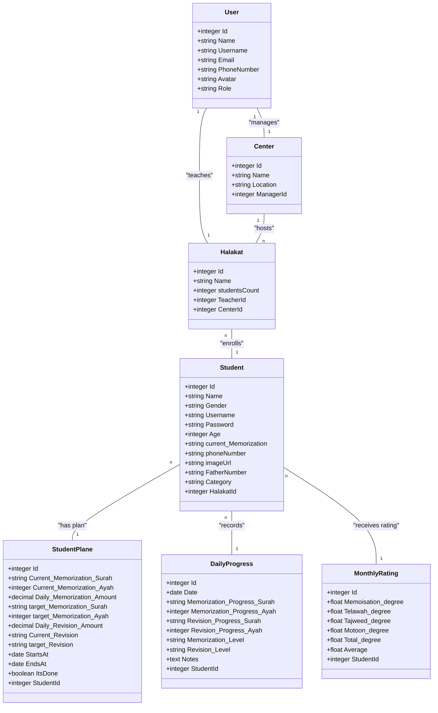
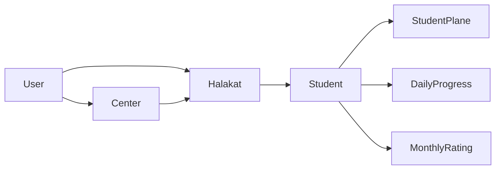
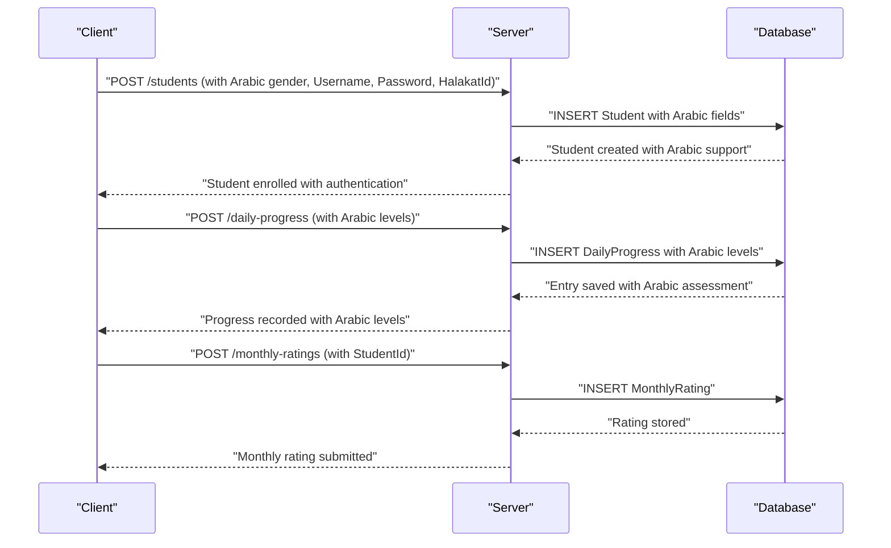

# Student Management

<cite>
**Referenced Files in This Document**
- [Student.js](file://backend/src/models/Student.js)
- [StudentPlane.js](file://backend/src/models/StudentPlane.js)
- [DailyProgress.js](file://backend/src/models/DailyProgress.js)
- [MonthlyRating.js](file://backend/src/models/MonthlyRating.js)
- [index.js](file://backend/src/models/index.js)
- [server.js](file://backend/server.js)
- [User.js](file://backend/src/models/User.js)
- [Center.js](file://backend/src/models/Center.js)
- [Halakat.js](file://backend/src/models/Halakat.js)
</cite>

## Update Summary
**Changes Made**
- Updated Student model schema to include Arabic gender options (ذكر, أنثى)
- Replaced English category classifications with Arabic terms
- Added authentication fields (Username, Password) for student login capabilities
- Updated DailyProgress model to use Arabic qualitative levels (ضعيف, مقبول, جيد, جيد جدا, ممتاز)
- Enhanced Arabic language support throughout the student management system

## Table of Contents
1. [Introduction](#introduction)
2. [Project Structure](#project-structure)
3. [Core Components](#core-components)
4. [Architecture Overview](#architecture-overview)
5. [Detailed Component Analysis](#detailed-component-analysis)
6. [Dependency Analysis](#dependency-analysis)
7. [Performance Considerations](#performance-considerations)
8. [Troubleshooting Guide](#troubleshooting-guide)
9. [Conclusion](#conclusion)
10. [Appendices](#appendices)

## Introduction
This document describes the student management subsystem of the Khirocom system with a focus on student enrollment, personal information management, and academic tracking. The system now features comprehensive Arabic language support with Arabic gender options, Arabic category classifications, and integrated authentication capabilities for student login. It documents the Student model schema, enrollment-related fields, and relationships with learning plans and progress tracking. It also outlines how student data integrates with daily progress monitoring and monthly rating systems, and provides practical examples of registration, profile updates, and progress monitoring.

## Project Structure
The backend is organized around Sequelize models, with the central server orchestrating database initialization and model registration. The student domain spans the Student entity and its associations with learning plans, daily progress, and monthly ratings. The system now includes enhanced Arabic language support throughout all components.

**Diagram sources**
- [index.js:1-64](file://backend/src/models/index.js#L1-L64)
- [server.js:1-25](file://backend/server.js#L1-L25)

**Section sources**
- [server.js:1-25](file://backend/server.js#L1-L25)
- [index.js:1-64](file://backend/src/models/index.js#L1-L64)

## Core Components
This section documents the core entities and their roles in student management, now featuring Arabic language support.

- **Student**: Represents enrolled learners with personal details, enrollment metadata, Arabic gender options, authentication credentials, and Arabic category classification.
- **StudentPlane**: Encapsulates individualized learning targets and progress tracking windows.
- **DailyProgress**: Captures daily memorization and revision progress with Arabic qualitative levels and optional notes.
- **MonthlyRating**: Aggregates monthly academic ratings across multiple competencies.

**Section sources**
- [Student.js:1-80](file://backend/src/models/Student.js#L1-L80)
- [StudentPlane.js:1-76](file://backend/src/models/StudentPlane.js#L1-L76)
- [DailyProgress.js:1-64](file://backend/src/models/DailyProgress.js#L1-L64)
- [MonthlyRating.js:1-70](file://backend/src/models/MonthlyRating.js#L1-L70)

## Architecture Overview
The student management architecture centers on the Student model and its associations with Halakat (class), learning plans (StudentPlane), daily progress entries (DailyProgress), and monthly ratings (MonthlyRating). The system now includes Arabic language support throughout all components and enhanced authentication capabilities.

**Diagram sources**
- [index.js:1-64](file://backend/src/models/index.js#L1-L64)
- [Student.js:1-80](file://backend/src/models/Student.js#L1-L80)
- [StudentPlane.js:1-76](file://backend/src/models/StudentPlane.js#L1-L76)
- [DailyProgress.js:1-64](file://backend/src/models/DailyProgress.js#L1-L64)
- [MonthlyRating.js:1-70](file://backend/src/models/MonthlyRating.js#L1-L70)
- [User.js:1-61](file://backend/src/models/User.js#L1-L61)
- [Center.js:1-39](file://backend/src/models/Center.js#L1-L39)
- [Halakat.js:1-47](file://backend/src/models/Halakat.js#L1-L47)

## Detailed Component Analysis

### Student Model Schema
The Student model defines the core attributes for enrolled learners, including personal identifiers, enrollment metadata, Arabic gender options, authentication credentials, and Arabic category classification. It also includes a foreign key linking to the Halakat (class) to which the student is enrolled.

**Updated** Enhanced with Arabic language support and authentication fields

Key fields:
- **Identity**: Id
- **Personal**: Name, Age, current_Memorization
- **Authentication**: Username, Password (256 characters)
- **Gender**: Gender (Arabic ENUM: ذكر, أنثى)
- **Contact**: phoneNumber, imageUrl, FatherNumber
- **Classification**: Category (Arabic ENUM with comprehensive categories)
- **Enrollment**: HalakatId (foreign key)

Arabic Category Classifications:
- **اطفال** (Children)
- **أقل من 5 أجزاء** (Less than 5 parts)
- **5 أجزاء** (5 parts)
- **10 أجزاء** (10 parts)
- **15 جزء** (15 parts)
- **20 جزء** (20 parts)
- **25 جزء** (25 parts)
- **المصجف كامل** (Complete reciter)

Constraints and relationships:
- Gender is an Arabic ENUM with predefined values (ذكر, أنثى) and defaults to a base category.
- Category is an Arabic ENUM with comprehensive educational classification values.
- Username and Password fields enable student authentication capabilities.
- HalakatId references the Halakat table, establishing the enrollment relationship.
- Timestamps are enabled for creation/update tracking.

Practical implications:
- Enrollment requires a valid HalakatId.
- Arabic gender options support cultural localization.
- Authentication fields enable secure student login and access control.
- Arabic category classifications support educational tracking and reporting.
- Contact fields enable communication and optional image storage.

**Section sources**
- [Student.js:1-80](file://backend/src/models/Student.js#L1-L80)

### Learning Plans (StudentPlane)
The StudentPlane model captures personalized learning targets and progress windows. It includes:
- Current memorization and revision status
- Daily targets for memorization and revision
- Target memorization and revision goals
- Start and end dates for the plan
- Completion flag
- Foreign key to Student

Usage:
- Used to define and track individualized learning objectives.
- Supports progress monitoring against targets.

**Section sources**
- [StudentPlane.js:1-76](file://backend/src/models/StudentPlane.js#L1-L76)

### Daily Progress Tracking (DailyProgress)
DailyProgress captures daily progress entries for each student, including:
- Date of entry
- Surah and Ayah progress for memorization and revision
- Arabic qualitative levels for memorization and revision
- Optional notes
- Foreign key to Student

**Updated** Enhanced with Arabic qualitative levels

Arabic Qualitative Levels:
- **ضعيف** (Weak)
- **مقبول** (Acceptable)
- **جيد** (Good)
- **جيد جدا** (Very Good)
- **ممتاز** (Excellent)

Usage:
- Enables daily recording of progress.
- Arabic levels support local grading scales and cultural understanding.

**Section sources**
- [DailyProgress.js:1-64](file://backend/src/models/DailyProgress.js#L1-L64)

### Monthly Rating System (MonthlyRating)
MonthlyRating aggregates monthly academic ratings across multiple competencies:
- Memoisation_degree, Telawah_degree, Tajweed_degree, Motoon_degree
- Computed Total_degree and Average
- Foreign key to Student

Validation:
- Degree fields include minimum and maximum constraints to ensure valid ranges.

Usage:
- Provides a consolidated monthly assessment for reporting and review.

**Section sources**
- [MonthlyRating.js:1-70](file://backend/src/models/MonthlyRating.js#L1-L70)

### Enrollment and Profile Management Workflows
Enrollment workflow:
- A student is enrolled by assigning a valid HalakatId during creation or update.
- The Halakat association links the student to a teacher and center via relationships defined in the model index.

**Updated** Enhanced with Arabic language support and authentication

Profile management:
- Students can be updated to change personal details, contact information, Arabic gender, and Arabic category.
- Authentication credentials (Username, Password) can be managed for student login capabilities.
- Enrollment changes require updating HalakatId to reflect the new class assignment.

Relationships:
- Student belongs to Halakat (many students per class).
- StudentPlane, DailyProgress, and MonthlyRating belong to Student (one student can have many entries across these domains).

**Section sources**
- [index.js:27-50](file://backend/src/models/index.js#L27-L50)
- [Student.js:63-70](file://backend/src/models/Student.js#L63-L70)

### Academic Record Maintenance
Academic records are maintained across three domains:
- Learning plans: Define targets and windows for progress.
- Daily progress: Record daily milestones and Arabic qualitative levels.
- Monthly ratings: Aggregate performance metrics for reporting.

**Updated** Enhanced with Arabic language support

Maintenance tasks:
- Create/update/delete learning plans to align with student progress.
- Add daily progress entries regularly with Arabic level assessments.
- Generate and update monthly ratings based on accumulated data.
- Manage student authentication credentials for secure access.

**Section sources**
- [StudentPlane.js:1-76](file://backend/src/models/StudentPlane.js#L1-L76)
- [DailyProgress.js:1-64](file://backend/src/models/DailyProgress.js#L1-L64)
- [MonthlyRating.js:1-70](file://backend/src/models/MonthlyRating.js#L1-L70)

### Practical Examples

Example 1: Student Registration
- Steps:
  - Prepare student data including personal details, Arabic gender, authentication credentials, contact information, Arabic category, and HalakatId.
  - Persist the record using the Student model.
- Outcome:
  - A new enrolled student with Arabic gender options appears in the Halakat's student list with authentication capabilities.

Example 2: Profile Update
- Steps:
  - Modify fields such as Name, Age, current_Memorization, phoneNumber, imageUrl, or FatherNumber.
  - Update Arabic gender option (ذكر, أنثى) and Arabic category classification.
  - Manage authentication credentials (Username, Password) for security.
  - Optionally update Category or reassign HalakatId for enrollment changes.
- Outcome:
  - Updated profile reflects in all related views and reports with Arabic language support.

Example 3: Academic Progress Monitoring
- Steps:
  - Create a StudentPlane entry with targets and date range.
  - Add DailyProgress entries for each day with Surah/Ayah progress, Arabic levels (ضعيف, مقبول, جيد, جيد جدا, ممتاز), and optional notes.
  - Generate MonthlyRating entries with validated degree fields.
- Outcome:
  - Comprehensive progress tracking with Arabic qualitative assessments and monthly performance insights.

## Dependency Analysis
The model index defines associations among entities, ensuring referential integrity and enabling navigational queries. The system now includes enhanced Arabic language support throughout all model relationships.

**Diagram sources**
- [index.js:13-50](file://backend/src/models/index.js#L13-L50)

**Section sources**
- [index.js:1-64](file://backend/src/models/index.js#L1-L64)

## Performance Considerations
- **Indexing**: Consider adding database indexes on foreign keys (e.g., HalakatId, StudentId) to optimize joins in enrollment and progress queries.
- **Validation**: Leverage Sequelize validations to prevent invalid data entry at the model level, including Arabic ENUM validation.
- **Authentication Security**: Implement password hashing and validation for authentication fields (Username, Password).
- **Reporting**: Aggregate monthly ratings efficiently using database-level computations to reduce application-side overhead.
- **Scalability**: Partition daily progress and monthly ratings by time periods for large datasets.
- **Localization**: Ensure proper UTF-8 encoding support for Arabic characters throughout the system.

## Troubleshooting Guide
Common issues and resolutions:
- **Enrollment failures**: Verify that HalakatId references an existing Halakat record.
- **Invalid ratings**: Ensure degree fields fall within configured min/max bounds before persisting MonthlyRating.
- **Orphaned records**: Confirm that associated StudentPlane, DailyProgress, and MonthlyRating entries are managed consistently with Student lifecycle.
- **Database sync**: On startup, the server authenticates and synchronizes models; check logs for synchronization errors.
- **Arabic character encoding**: Ensure proper UTF-8 encoding support for Arabic characters in all database operations.
- **Authentication issues**: Verify Username uniqueness and Password length constraints for student login capabilities.

**Section sources**
- [MonthlyRating.js:25-44](file://backend/src/models/MonthlyRating.js#L25-L44)
- [server.js:8-23](file://backend/server.js#L8-L23)

## Conclusion
The Khirocom student management system provides a structured foundation for enrollment, personal information management, and academic tracking with comprehensive Arabic language support. The enhanced Student model, combined with Arabic gender options, Arabic category classifications, authentication capabilities, and Arabic qualitative levels, enables comprehensive oversight of each learner's journey in their native language. Clear relationships and validations support reliable operations, while practical workflows facilitate registration, updates, progress monitoring, and secure authentication.

## Appendices

### Data Flow: Student Enrollment and Progress Recording

### Arabic Language Support Matrix
| Field | Arabic Options | Default Value |
|-------|----------------|---------------|
| **Gender** | ذكر, أنثى | ذكر |
| **Category** | اطفال, أقل من 5 أجزاء, 5 أجزاء, 10 أجزاء, 15 جزء, 20 جزء, 25 جزء, المصجف كامل | أقل من 5 أجزاء |
| **Daily Level** | ضعيف, مقبول, جيد, جيد جدا, ممتاز | ضعيف |
| **Monthly Rating** | Memoisation_degree (0-100), Telawah_degree (0-100), Tajweed_degree (0-60), Motoon_degree (0-400) | Calculated |

[No sources needed since this diagram shows conceptual workflow, not actual code structure]