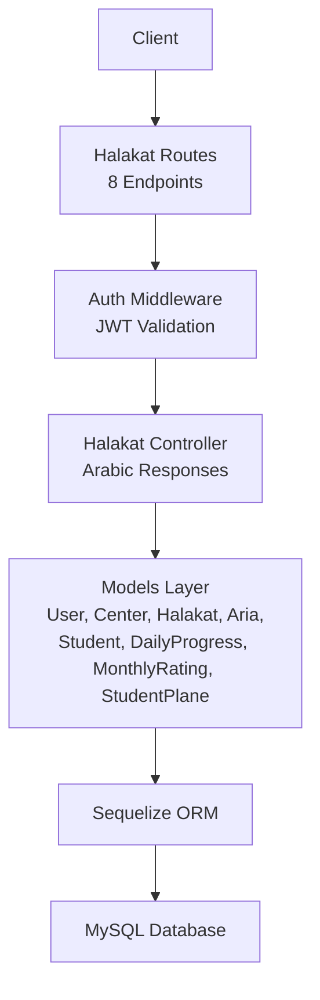
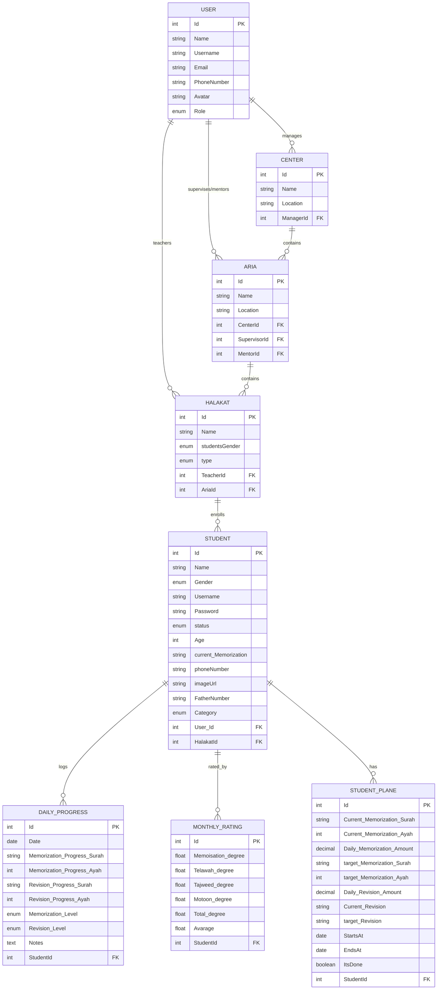
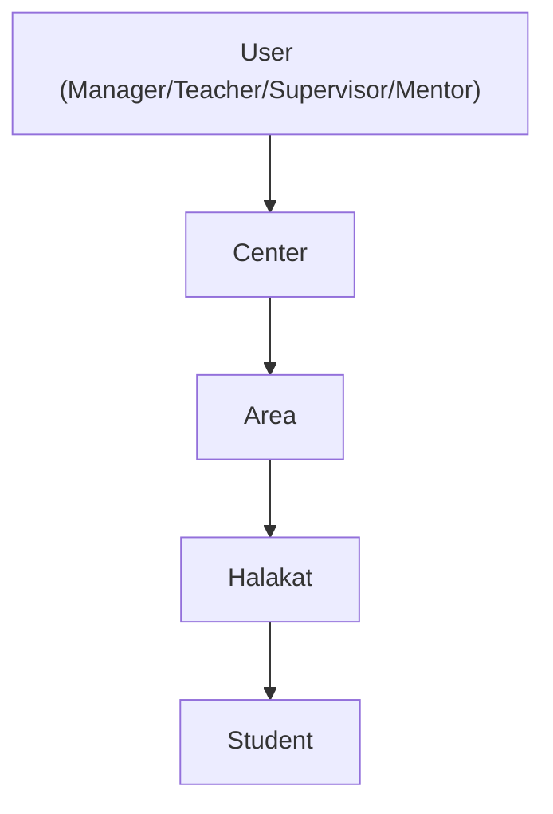
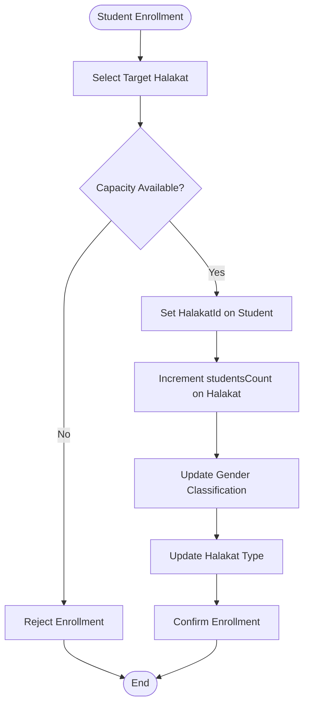
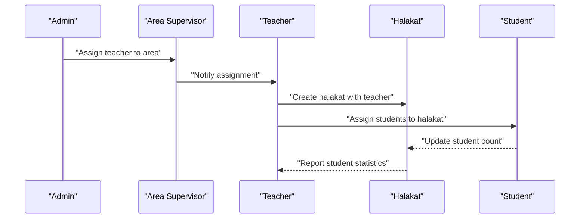
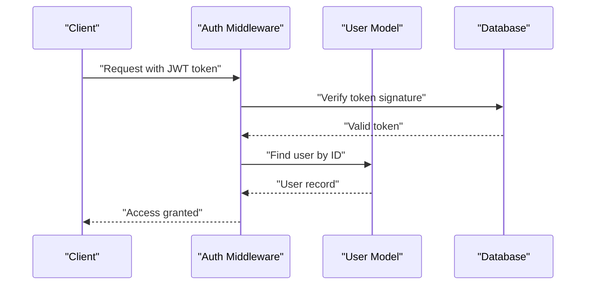
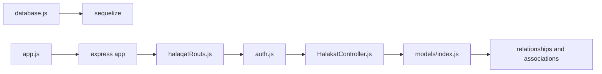

# Teaching Group Management

<cite>
**Referenced Files in This Document**
- [server.js](file://backend/server.js)
- [app.js](file://backend/src/config/app.js)
- [database.js](file://backend/src/config/database.js)
- [index.js](file://backend/src/models/index.js)
- [User.js](file://backend/src/models/User.js)
- [Center.js](file://backend/src/models/Center.js)
- [Halakat.js](file://backend/src/models/Halakat.js)
- [Student.js](file://backend/src/models/Student.js)
- [Aria.js](file://backend/src/models/Aria.js)
- [DailyProgress.js](file://backend/src/models/DailyProgress.js)
- [MonthlyRating.js](file://backend/src/models/MonthlyRating.js)
- [StudentPlane.js](file://backend/src/models/StudentPlane.js)
- [HalakatController.js](file://backend/src/controllers/HalakatController.js)
- [halaqatRouts.js](file://backend/src/routes/halaqatRouts.js)
- [auth.js](file://backend/src/middleware/auth.js)
- [API_Endpoints_Guide.txt](file://backend/API_Endpoints_Guide.txt)
</cite>

## Update Summary
**Changes Made**
- Added comprehensive halakat management system with 8 Arabic-language endpoints
- Integrated area (Aria) management alongside halakat operations
- Implemented teacher assignment and student counting functionality
- Added Arabic language support with localized response messages
- Enhanced authentication middleware for secure halakat operations
- Updated data model relationships to include area assignments

## Table of Contents
1. [Introduction](#introduction)
2. [Project Structure](#project-structure)
3. [Core Components](#core-components)
4. [Architecture Overview](#architecture-overview)
5. [Detailed Component Analysis](#detailed-component-analysis)
6. [Halakat Management System](#halakat-management-system)
7. [Area Management Integration](#area-management-integration)
8. [Arabic Language Support](#arabic-language-support)
9. [Authentication and Security](#authentication-and-security)
10. [Dependency Analysis](#dependency-analysis)
11. [Performance Considerations](#performance-considerations)
12. [Troubleshooting Guide](#troubleshooting-guide)
13. [Conclusion](#conclusion)
14. [Appendices](#appendices)

## Introduction
This document explains the comprehensive teaching group management capabilities for the Khirocom system with a focus on Halakat (teaching groups/classes). The system now includes a fully functional halakat management system with 8 Arabic-language endpoints, area (Aria) management, teacher assignments, student counting functionality, and internationalization support. It covers the data model, relationships, and operational workflows for managing centers, halakats, teachers, areas, and students. The system integrates with daily progress tracking and monthly rating systems for comprehensive educational management.

## Project Structure
The backend is a Node.js/Express application using Sequelize ORM to manage relational data. The application entry point initializes the database connection, registers models, and starts the server. The halakat management system is fully integrated with routes, controllers, and middleware for comprehensive educational group administration.

```mermaid
graph TB
subgraph "Application Layer"
APP["Express App<br/>app.js"]
AUTH["Auth Middleware<br/>auth.js"]
end
subgraph "Routing Layer"
HALAQAT_ROUTES["Halakat Routes<br/>halaqatRouts.js"]
AREA_ROUTES["Area Routes<br/>areaRouts.js"]
end
subgraph "Controller Layer"
HALAQAT_CTRL["Halakat Controller<br/>HalakatController.js"]
end
subgraph "ORM & DB"
CFG["Database Config<br/>database.js"]
SEQ["Sequelize Instance"]
end
subgraph "Models"
U["User"]
C["Center"]
H["Halakat"]
A["Aria"]
S["Student"]
DP["DailyProgress"]
MR["MonthlyRating"]
SP["StudentPlane"]
end
APP --> AUTH
APP --> HALAQ_ROUTES
APP --> AREA_ROUTES
HALAQAT_ROUTES --> HALAQAT_CTRL
AUTH --> U
CFG --> SEQ
APP --> SEQ
U < --> C
U < --> H
C < --> A
A < --> H
H < --> S
S < --> DP
S < --> MR
S < --> SP
```

**Diagram sources**
- [server.js:1-26](file://backend/server.js#L1-L26)
- [app.js:1-22](file://backend/src/config/app.js#L1-L22)
- [auth.js:1-25](file://backend/src/middleware/auth.js#L1-L25)
- [halaqatRouts.js:1-18](file://backend/src/routes/halaqatRouts.js#L1-L18)
- [HalakatController.js:1-253](file://backend/src/controllers/HalakatController.js#L1-L253)
- [database.js:1-15](file://backend/src/config/database.js#L1-L15)
- [index.js:1-91](file://backend/src/models/index.js#L1-L91)

**Section sources**
- [server.js:1-26](file://backend/server.js#L1-L26)
- [app.js:1-22](file://backend/src/config/app.js#L1-L22)
- [database.js:1-15](file://backend/src/config/database.js#L1-L15)

## Core Components
This section describes the primary entities involved in comprehensive teaching group management and their roles.

- **User**: Represents system users (admin, teacher, supervisor, manager, mentor). Teachers are linked to halakats; managers are linked to centers; supervisors and mentors are linked to areas.
- **Center**: Represents physical locations where halakats operate; managed by a manager user.
- **Aria**: Represents geographical areas or neighborhoods within centers; supervised by supervisors and mentored by mentors; contains multiple halakats.
- **Halakat**: Represents a teaching group/class with teacher and area assignments; tracks student enrollment count with gender and type classifications.
- **Student**: Represents learners enrolled in a halakat; includes category, gender, and contact details; links to daily progress, monthly ratings, and study plans.

Key attributes and constraints:
- Users have role-based permissions impacting who can create/manage centers, areas, and halakats.
- Centers have a manager user; areas have supervisor and mentor users; halakats belong to areas and are supervised by teachers.
- Students are assigned to a single halakat; halakats track total enrolled students with gender and type classifications.
- Monthly ratings and daily progress provide performance monitoring; student planes define memorization targets and schedules.
- Halakat types include "قراءة وكتاية" (Reading and Writing), "حفظ ومراجعة" (Memorization and Review), "إجازة" (Vacation), and "قراءات" (Readings).

**Section sources**
- [User.js:1-59](file://backend/src/models/User.js#L1-L59)
- [Center.js:1-39](file://backend/src/models/Center.js#L1-L39)
- [Aria.js:1-59](file://backend/src/models/Aria.js#L1-L59)
- [Halakat.js:1-54](file://backend/src/models/Halakat.js#L1-L54)
- [Student.js:1-105](file://backend/src/models/Student.js#L1-L105)

## Architecture Overview
The system follows a layered architecture with comprehensive halakat management:
- **Presentation**: Express routes expose 8 Arabic-language endpoints for halakat CRUD operations.
- **Application**: Controllers orchestrate requests and coordinate model operations with Arabic response messages.
- **Domain/Model**: Sequelize models encapsulate business entities and relationships with area integration.
- **Persistence**: MySQL via Sequelize with environment-driven configuration.



[No sources needed since this diagram shows conceptual workflow, not actual code structure]

## Detailed Component Analysis

### Data Model Relationships
The models define a comprehensive hierarchy and associations with area integration:
- User ↔ Center: One-to-Many (manager manages multiple centers).
- User ↔ Aria: One-to-One (supervisor and mentor roles).
- User ↔ Halakat: One-to-One (teacher role).
- Center ↔ Aria: One-to-Many (center contains multiple areas).
- Aria ↔ Halakat: One-to-Many (area contains multiple halakats).
- Halakat ↔ Student: One-to-Many (halakat enrolls multiple students).
- Student ↔ MonthlyRating: One-to-Many (student accumulates monthly ratings).
- Student ↔ DailyProgress: One-to-Many (student logs daily progress).
- Student ↔ StudentPlane: One-to-Many (student has a study plan).



**Diagram sources**
- [index.js:16-72](file://backend/src/models/index.js#L16-L72)
- [User.js:8-48](file://backend/src/models/User.js#L8-L48)
- [Center.js:8-28](file://backend/src/models/Center.js#L8-L28)
- [Aria.js:5-48](file://backend/src/models/Aria.js#L5-L48)
- [Halakat.js:6-43](file://backend/src/models/Halakat.js#L6-L43)
- [Student.js:6-88](file://backend/src/models/Student.js#L6-L88)
- [DailyProgress.js:8-54](file://backend/src/models/DailyProgress.js#L8-L54)
- [MonthlyRating.js:10-58](file://backend/src/models/MonthlyRating.js#L10-L58)
- [StudentPlane.js:8-65](file://backend/src/models/StudentPlane.js#L8-L65)

### Halakat Schema and Enhanced Constraints
- **Identity**: Auto-incremented integer identifier.
- **Name**: Required string; serves as the group/class label.
- **studentsGender**: Required ENUM ("ذكور","إناث"); represents gender classification for the halakat.
- **type**: Required ENUM ("قراءة وكتاية","حفظ ومراجعة","إجازة","قراءات"); represents halakat type classification.
- **TeacherId**: Required foreign key to User.Id; ties a teacher to the halakat.
- **AriaId**: Required foreign key to Aria.Id; ties a halakat to an area.
- **Timestamps**: CreatedAt/UpdatedAt automatically maintained.

Operational implications:
- Gender classification enables separate management of male and female groups.
- Type classification supports different educational approaches and schedules.
- Area assignment provides geographical organization and supervision structure.
- Teacher assignment is mandatory and enforced by foreign key constraints.
- Area assignment is mandatory and enforced by foreign key constraints.

**Section sources**
- [Halakat.js:17-27](file://backend/src/models/Halakat.js#L17-L27)
- [Halakat.js:28-43](file://backend/src/models/Halakat.js#L28-L43)

### Center-Area-Halakat-Student Hierarchy
- Centers are managed by users with appropriate roles.
- Areas are nested under centers and supervised by users with supervisor/mentor roles.
- Halakats are nested under areas and supervised by teachers.
- Students are nested under halakats and tracked via progress and ratings.



**Diagram sources**
- [index.js:16-31](file://backend/src/models/index.js#L16-L31)

## Halakat Management System

### Comprehensive CRUD Operations
The halakat management system provides 8 Arabic-language endpoints for complete educational group administration:

#### Core CRUD Endpoints
- **GET /halaqat/getallhalaqat** - Retrieve all halakats with student counts and teacher/area information
- **POST /halaqat/addhalaqah** - Create new halakat with teacher and area assignments
- **PUT /halaqat/updatehalaqah** - Update existing halakat information
- **DELETE /halaqat/deletehalaqah** - Delete halakat with cascade handling

#### Query and Search Endpoints
- **GET /halaqat/gethalaqahbyteacherid** - Get halakat by teacher ID with student count
- **GET /halaqat/gethalaqahbyid** - Get halakat by ID with detailed information
- **GET /halaqat/gethalaqahbysarch** - Search halakats by name with student counts
- **GET /halaqat/gethalaqahbyareaid** - Get halakats by area ID

#### Response Localization
All endpoints return Arabic responses for seamless Arabic-speaking environments:
- Success messages: "تم تعديل بيانات الحلقة", "تم حذف الحلقة", "تم الحصول على جميع الحلقات"
- Error messages: "خطأ أثناء تعديل بيانات الحلقة", "لم يتم العثور على حلقة"
- Status codes: Standard HTTP status codes with localized messages

**Section sources**
- [halaqatRouts.js:7-14](file://backend/src/routes/halaqatRouts.js#L7-L14)
- [HalakatController.js:8-253](file://backend/src/controllers/HalakatController.js#L8-L253)

### Advanced Student Counting and Grouping
The halakat system implements sophisticated student counting mechanisms:

#### Automatic Student Counting
- **Database-level counting**: Uses Sequelize aggregation functions to count students per halakat
- **Real-time updates**: Student enrollment automatically updates halakat counts
- **Gender-based tracking**: Separate counting for male and female students
- **Type-based classification**: Different counting for different halakat types

#### Grouping Mechanisms
- **Teacher-based grouping**: Students grouped under their assigned teacher's halakat
- **Area-based organization**: Halakats organized geographically within areas
- **Category-based tracking**: Students categorized by learning progression levels
- **Status-based filtering**: Active, discontinued, and expelled student tracking



**Diagram sources**
- [Student.js:81-88](file://backend/src/models/Student.js#L81-L88)
- [Halakat.js:17-27](file://backend/src/models/Halakat.js#L17-L27)

**Section sources**
- [HalakatController.js:50-87](file://backend/src/controllers/HalakatController.js#L50-L87)
- [HalakatController.js:134-172](file://backend/src/controllers/HalakatController.js#L134-L172)

### Teacher Assignment Workflow
Enhanced teacher assignment with comprehensive validation and reporting:

#### Assignment Process
- **Teacher validation**: Ensures teacher exists and has appropriate role
- **Halakat creation**: Links teacher to halakat via TeacherId foreign key
- **Area assignment**: Associates halakat with geographical area
- **Student transfer**: Moves students between halakats with proper tracking

#### Supervision Structure
- **Single teacher per halakat**: Enforces one-to-one teacher-halakat relationship
- **Area supervision**: Teachers supervised by area supervisors and mentors
- **Performance tracking**: Teacher performance measured through halakat success metrics



**Diagram sources**
- [index.js:25-27](file://backend/src/models/index.js#L25-L27)
- [HalakatController.js:8-21](file://backend/src/controllers/HalakatController.js#L8-L21)

**Section sources**
- [Halakat.js:28-35](file://backend/src/models/Halakat.js#L28-L35)
- [Aria.js:28-48](file://backend/src/models/Aria.js#L28-L48)

## Area Management Integration

### Geographic Organization
Areas (Arias) provide geographical organization for halakat management:

#### Area Schema
- **Name**: Required string for area identification
- **Location**: Required string with detailed location information
- **CenterId**: Required foreign key linking area to center
- **SupervisorId**: Required foreign key for area supervisor
- **MentorId**: Required foreign key for area mentor

#### Area-Halakat Relationship
- **One-to-Many**: Each area can contain multiple halakats
- **Geographic clustering**: Related halakats organized by proximity
- **Supervisory chain**: Areas supervised by designated supervisors and mentors

**Section sources**
- [Aria.js:12-48](file://backend/src/models/Aria.js#L12-L48)
- [index.js:29-31](file://backend/src/models/index.js#L29-L31)

### Area-Based Halakat Management
Areas enable sophisticated halakat organization and management:

#### Area Queries
- **Area-based filtering**: Retrieve halakats by area ID
- **Area statistics**: Track halakat distribution across areas
- **Area performance**: Monitor educational outcomes by geographic regions

#### Supervisor Responsibilities
- **Area oversight**: Supervisors monitor multiple halakats within their area
- **Resource allocation**: Mentors coordinate resources and support staff
- **Quality assurance**: Supervisors ensure educational standards across halakats

**Section sources**
- [HalakatController.js:212-241](file://backend/src/controllers/HalakatController.js#L212-L241)
- [Aria.js:28-48](file://backend/src/models/Aria.js#L28-L48)

## Arabic Language Support

### Comprehensive Localization
The system provides complete Arabic language support for seamless Arabic-speaking environments:

#### Response Localization
- **Success messages**: All successful operations return Arabic messages
- **Error handling**: Error responses are localized in Arabic
- **Validation feedback**: Form validation messages in Arabic
- **UI text**: All user-facing text in Arabic script

#### Arabic-Specific Features
- **Gender classification**: ENUM values "ذكور" and "إناث" for gender-based grouping
- **Educational types**: Halakat types in Arabic: "قراءة وكتاية", "حفظ ومراجعة", "إجازة", "قراءات"
- **Status indicators**: Student statuses in Arabic: "مستمر", "منقطع", "مفصول"
- **Category system**: Learning categories in Arabic for different skill levels

#### Cultural Adaptation
- **Arabic numerals**: All numeric displays use Arabic numerals
- **Right-to-left support**: UI elements adapted for RTL languages
- **Cultural terminology**: Educational terms adapted to Arabic educational context
- **Local conventions**: Date formats and time representations follow Arabic conventions

**Section sources**
- [Halakat.js:17-27](file://backend/src/models/Halakat.js#L17-L27)
- [Student.js:17-37](file://backend/src/models/Student.js#L17-L37)
- [HalakatController.js:28](file://backend/src/controllers/HalakatController.js#L28)

## Authentication and Security

### JWT-Based Authentication
The halakat management system uses robust authentication:

#### Token Validation
- **JWT verification**: All halakat endpoints require valid JWT tokens
- **User authorization**: Validates user existence and role permissions
- **Token extraction**: Handles Authorization header parsing
- **Error handling**: Comprehensive error responses for invalid tokens

#### Access Control
- **Endpoint protection**: All halakat routes protected by authentication middleware
- **Role-based access**: Different permissions for various user roles
- **Session management**: Secure token-based session handling
- **Security logging**: Authentication attempts and failures logged



**Diagram sources**
- [auth.js:4-24](file://backend/src/middleware/auth.js#L4-L24)

**Section sources**
- [auth.js:1-25](file://backend/src/middleware/auth.js#L1-L25)
- [halaqatRouts.js:4](file://backend/src/routes/halaqatRouts.js#L4)

## Dependency Analysis
The halakat management system integrates seamlessly with the existing model relationships and routing structure.



**Diagram sources**
- [server.js:1-26](file://backend/server.js#L1-L26)
- [app.js:1-22](file://backend/src/config/app.js#L1-L22)
- [halaqatRouts.js:1-18](file://backend/src/routes/halaqatRouts.js#L1-L18)
- [auth.js:1-25](file://backend/src/middleware/auth.js#L1-L25)
- [HalakatController.js:1-5](file://backend/src/controllers/HalakatController.js#L1-L5)
- [index.js:1-91](file://backend/src/models/index.js#L1-L91)

**Section sources**
- [server.js:1-26](file://backend/server.js#L1-L26)
- [index.js:1-91](file://backend/src/models/index.js#L1-L91)

## Performance Considerations
- **Indexing**: Ensure foreign keys (TeacherId, AriaId, HalakatId, StudentId) are indexed for efficient joins.
- **Query optimization**: Use eager loading for associations (e.g., include students, teacher, area when fetching halakats).
- **Aggregation efficiency**: Leverage database-level COUNT functions for student counting rather than client-side calculations.
- **Caching strategy**: Implement caching for frequently accessed halakat lists and teacher assignments.
- **Pagination**: For large datasets, implement pagination in halakat queries.
- **Connection pooling**: Configure appropriate connection pool settings for concurrent halakat operations.

## Troubleshooting Guide
Common issues and resolutions:
- **Database connection failures**: Verify environment variables for DB_NAME, DB_USER, DB_PASSWORD, DB_HOST, DB_PORT; confirm MySQL service availability.
- **Model synchronization errors**: Review foreign key constraints and ensure referenced records exist before creating dependent records.
- **Authentication failures**: Verify JWT_SECRET environment variable and token validity; check user existence in database.
- **Halakat endpoint errors**: Ensure proper JSON payload format with required fields (Name, TeacherId, AriaId).
- **Student counting issues**: Verify halakat-student relationships and foreign key integrity.
- **Area assignment problems**: Check area existence and supervisor/mentor assignments.

**Section sources**
- [database.js:4-14](file://backend/src/config/database.js#L4-L14)
- [server.js:8-22](file://backend/server.js#L8-L22)
- [auth.js:21-24](file://backend/src/middleware/auth.js#L21-L24)

## Conclusion
The Khirocom system now provides a comprehensive halakat management solution with 8 Arabic-language endpoints, area integration, teacher assignments, and student counting functionality. The system models a sophisticated hierarchy: centers managed by users, areas organized within centers, halakats supervised by teachers within areas, and students grouped within halakats. The data model supports capacity tracking, teacher assignments, area-based organization, and integrates with daily progress and monthly ratings for comprehensive performance monitoring. The Arabic language support and internationalization features ensure seamless operation in Arabic-speaking educational environments. The authentication system provides robust security for all halakat operations.

## Appendices

### Appendix A: Environment Configuration
- Configure database credentials via environment variables consumed by the database configuration module.
- Set JWT_SECRET for authentication token signing.
- Configure PORT for server deployment.

**Section sources**
- [database.js:1-15](file://backend/src/config/database.js#L1-L15)
- [server.js:6](file://backend/server.js#L6)

### Appendix B: Relationship Summary
- User → Center: One-to-Many (manager).
- User → Aria: One-to-One (supervisor/mentor).
- User → Halakat: One-to-One (teacher).
- Center → Aria: One-to-Many (host).
- Aria → Halakat: One-to-Many (contains).
- Halakat → Student: One-to-Many (enrollment).
- Student → DailyProgress: One-to-Many (daily logs).
- Student → MonthlyRating: One-to-Many (monthly assessments).
- Student → StudentPlane: One-to-Many (study plan).

**Section sources**
- [index.js:16-72](file://backend/src/models/index.js#L16-L72)

### Appendix C: Halakat Management Endpoints
- **GET /halaqat/getallhalaqat** - Retrieve all halakats with student counts
- **POST /halaqat/addhalaqah** - Create new halakat
- **PUT /halaqat/updatehalaqah** - Update existing halakat
- **DELETE /halaqat/deletehalaqah** - Delete halakat
- **GET /halaqat/gethalaqahbyteacherid** - Get halakat by teacher ID
- **GET /halaqat/gethalaqahbyid** - Get halakat by ID
- **GET /halaqat/gethalaqahbysarch** - Search halakats by name
- **GET /halaqat/gethalaqahbyareaid** - Get halakats by area ID

**Section sources**
- [halaqatRouts.js:7-14](file://backend/src/routes/halaqatRouts.js#L7-L14)

### Appendix D: Arabic Language Features
- **Gender classification**: ENUM values "ذكور" and "إناث"
- **Halakat types**: "قراءة وكتاية", "حفظ ومراجعة", "إجازة", "قراءات"
- **Student statuses**: "مستمر", "منقطع", "مفصول"
- **Category system**: "اطفال", "أقل من 5 أجزاء", "5 أجزاء", "10 أجزاء", "15 جزء", "20 جزء", "25 جزء", "المصجف كامل"

**Section sources**
- [Halakat.js:17-27](file://backend/src/models/Halakat.js#L17-L27)
- [Student.js:58-71](file://backend/src/models/Student.js#L58-L71)