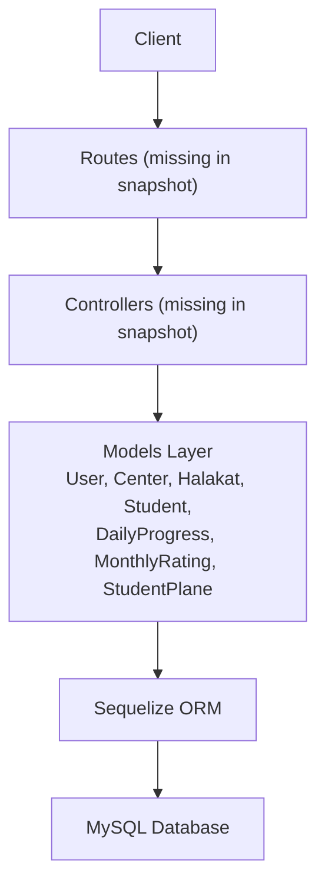
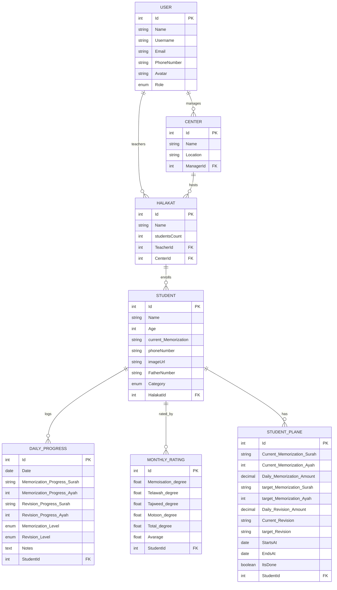
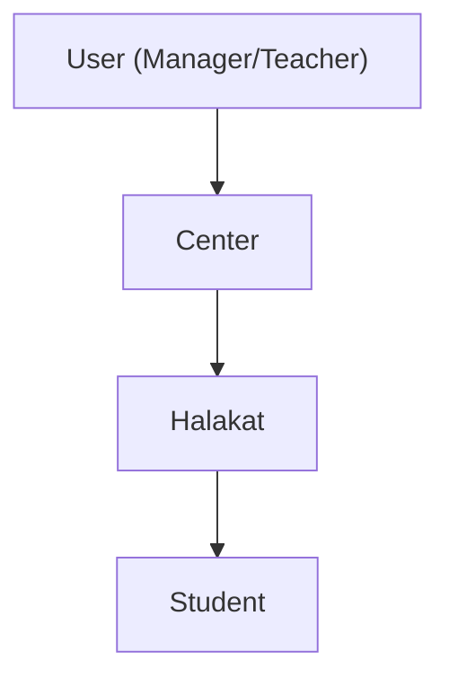
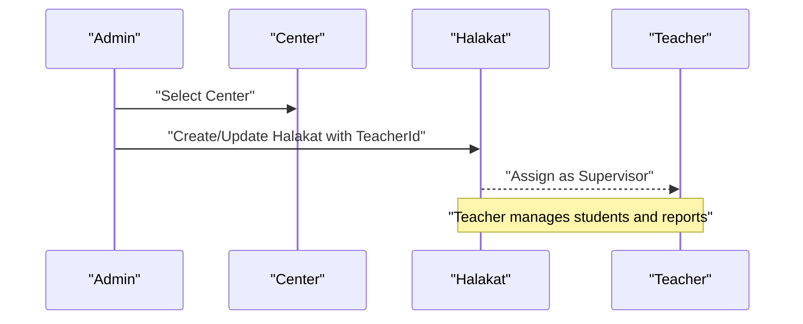
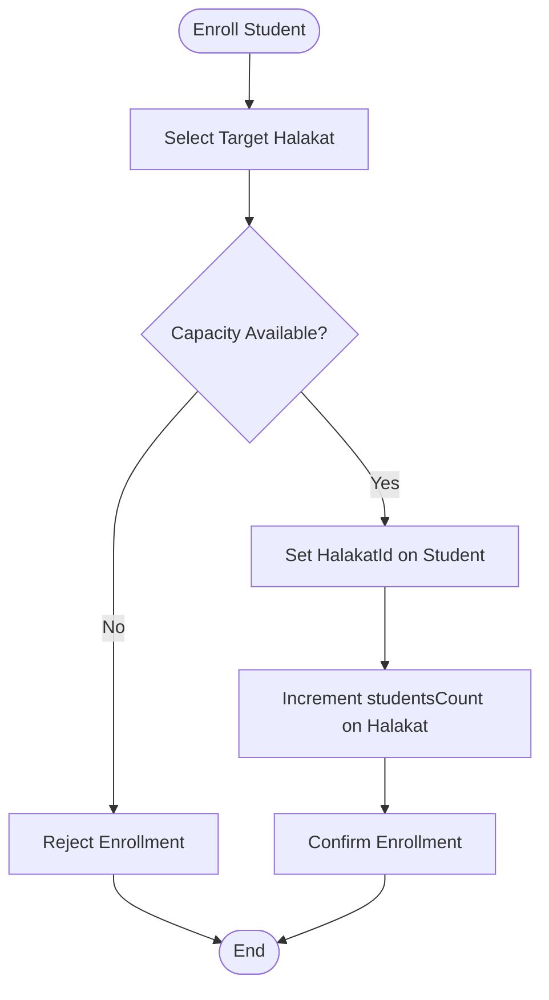
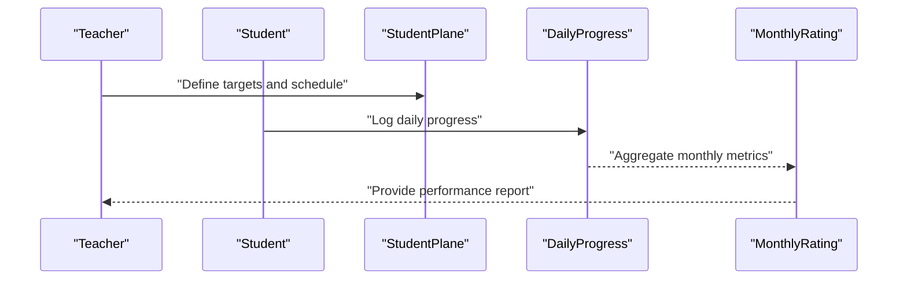
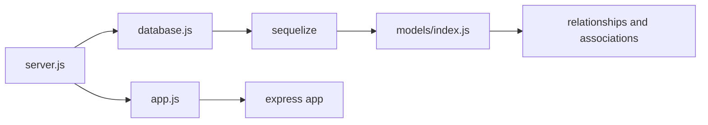

# Teaching Group Management

<cite>
**Referenced Files in This Document**
- [server.js](file://backend/server.js)
- [app.js](file://backend/src/config/app.js)
- [database.js](file://backend/src/config/database.js)
- [index.js](file://backend/src/models/index.js)
- [User.js](file://backend/src/models/User.js)
- [Center.js](file://backend/src/models/Center.js)
- [Halakat.js](file://backend/src/models/Halakat.js)
- [Student.js](file://backend/src/models/Student.js)
- [DailyProgress.js](file://backend/src/models/DailyProgress.js)
- [MonthlyRating.js](file://backend/src/models/MonthlyRating.js)
- [StudentPlane.js](file://backend/src/models/StudentPlane.js)
</cite>

## Table of Contents
1. [Introduction](#introduction)
2. [Project Structure](#project-structure)
3. [Core Components](#core-components)
4. [Architecture Overview](#architecture-overview)
5. [Detailed Component Analysis](#detailed-component-analysis)
6. [Dependency Analysis](#dependency-analysis)
7. [Performance Considerations](#performance-considerations)
8. [Troubleshooting Guide](#troubleshooting-guide)
9. [Conclusion](#conclusion)
10. [Appendices](#appendices)

## Introduction
This document explains the teaching group management capabilities for the Khirocom system with a focus on Halakat (teaching groups/classes). It covers the data model, relationships, and operational workflows for managing centers, halakats, teachers, and students. It also documents integration points with daily progress tracking and monthly rating systems, along with practical guidance for group setup, assignments, scheduling, capacity management, and reporting.

## Project Structure
The backend is a Node.js/Express application using Sequelize ORM to manage relational data. The application entry point initializes the database connection, registers models, and starts the server. Models define entities and their relationships, while configuration files set up the database connection and basic Express app behavior.

```mermaid
graph TB
subgraph "Application"
APP["Express App<br/>app.js"]
SRV["Server Boot<br/>server.js"]
end
subgraph "ORM & DB"
CFG["Database Config<br/>database.js"]
SEQ["Sequelize Instance"]
end
subgraph "Models"
U["User"]
C["Center"]
H["Halakat"]
S["Student"]
DP["DailyProgress"]
MR["MonthlyRating"]
SP["StudentPlane"]
end
SRV --> APP
SRV --> CFG
CFG --> SEQ
APP --> SEQ
U < --> C
U < --> H
C < --> H
H < --> S
S < --> DP
S < --> MR
S < --> SP
```

**Diagram sources**
- [server.js:1-25](file://backend/server.js#L1-L25)
- [app.js:1-12](file://backend/src/config/app.js#L1-L12)
- [database.js:1-15](file://backend/src/config/database.js#L1-L15)
- [index.js:1-52](file://backend/src/models/index.js#L1-L52)

**Section sources**
- [server.js:1-25](file://backend/server.js#L1-L25)
- [app.js:1-12](file://backend/src/config/app.js#L1-L12)
- [database.js:1-15](file://backend/src/config/database.js#L1-L15)

## Core Components
This section describes the primary entities involved in teaching group management and their roles.

- User: Represents system users (admin, teacher, supervisor, manager). Teachers are linked to halakats; managers are linked to centers.
- Center: Represents physical locations where halakats operate; managed by a manager user.
- Halakat: Represents a teaching group/class with a teacher and center association; tracks student enrollment count.
- Student: Represents learners enrolled in a halakat; includes category and contact details; links to daily progress, monthly ratings, and study plans.

Key attributes and constraints:
- Users have role-based permissions impacting who can create/manage centers and halakats.
- Centers have a manager user; halakats belong to a center and are supervised by a teacher.
- Students are assigned to a single halakat; halakats track total enrolled students.
- Monthly ratings and daily progress provide performance monitoring; student planes define memorization targets and schedules.

**Section sources**
- [User.js:1-59](file://backend/src/models/User.js#L1-L59)
- [Center.js:1-39](file://backend/src/models/Center.js#L1-L39)
- [Halakat.js:1-47](file://backend/src/models/Halakat.js#L1-L47)
- [Student.js:1-67](file://backend/src/models/Student.js#L1-L67)

## Architecture Overview
The system follows a layered architecture:
- Presentation: Express routes (not present in this workspace snapshot) would expose endpoints for CRUD operations.
- Application: Controllers (not present in this workspace snapshot) would orchestrate requests and coordinate model operations.
- Domain/Model: Sequelize models encapsulate business entities and relationships.
- Persistence: MySQL via Sequelize with environment-driven configuration.



[No sources needed since this diagram shows conceptual workflow, not actual code structure]

## Detailed Component Analysis

### Data Model Relationships
The models define a clear hierarchy and associations:
- User ↔ Center: One-to-Many (manager manages multiple centers).
- User ↔ Halakat: One-to-Many (teacher supervises multiple halakats).
- Center ↔ Halakat: One-to-Many (center hosts multiple halakats).
- Halakat ↔ Student: One-to-Many (halakat enrolls multiple students).
- Student ↔ MonthlyRating: One-to-Many (student accumulates monthly ratings).
- Student ↔ DailyProgress: One-to-Many (student logs daily progress).
- Student ↔ StudentPlane: One-to-Many (student has a study plan).



**Diagram sources**
- [index.js:12-41](file://backend/src/models/index.js#L12-L41)
- [User.js:8-48](file://backend/src/models/User.js#L8-L48)
- [Center.js:8-28](file://backend/src/models/Center.js#L8-L28)
- [Halakat.js:8-36](file://backend/src/models/Halakat.js#L8-L36)
- [Student.js:8-57](file://backend/src/models/Student.js#L8-L57)
- [DailyProgress.js:8-54](file://backend/src/models/DailyProgress.js#L8-L54)
- [MonthlyRating.js:10-58](file://backend/src/models/MonthlyRating.js#L10-L58)
- [StudentPlane.js:8-65](file://backend/src/models/StudentPlane.js#L8-L65)

### Halakat Schema and Constraints
- Identity: Auto-incremented integer identifier.
- Name: Required string; serves as the group/class label.
- studentsCount: Required integer; represents enrolled student count.
- TeacherId: Required foreign key to User.Id; ties a teacher to the halakat.
- CenterId: Required foreign key to Center.Id; ties a halakat to a center.
- Timestamps: CreatedAt/UpdatedAt automatically maintained.

Operational implications:
- Capacity limits are represented by the studentsCount field; enforce manual checks during enrollment.
- Teacher assignment is mandatory and enforced by foreign key constraints.
- Center assignment is mandatory and enforced by foreign key constraints.

**Section sources**
- [Halakat.js:8-36](file://backend/src/models/Halakat.js#L8-L36)

### Center-Halakat-Student Hierarchy
- Centers are managed by users with appropriate roles.
- Halakats are nested under centers and supervised by teachers.
- Students are nested under halakats and tracked via progress and ratings.



**Diagram sources**
- [index.js:14-28](file://backend/src/models/index.js#L14-L28)

### CRUD Operations for Halakat
While routes/controllers are not included in this workspace snapshot, the data model supports the following typical operations:
- Create: Provide Name, TeacherId, CenterId, and initial studentsCount.
- Read: Retrieve by Id, filter by CenterId or TeacherId, include associated Students.
- Update: Modify Name, TeacherId, CenterId, or studentsCount.
- Delete: Remove a halakat; ensure cascading rules for dependent records (e.g., students) are considered.

Constraints and validations:
- Name must be non-empty.
- studentsCount must be non-negative.
- TeacherId must reference an existing User.Id.
- CenterId must reference an existing Center.Id.

**Section sources**
- [Halakat.js:8-36](file://backend/src/models/Halakat.js#L8-L36)
- [index.js:18-24](file://backend/src/models/index.js#L18-L24)

### Teacher Assignment Workflow
- Assign a User with the teacher role to a halakat via TeacherId.
- Ensure the teacher has the appropriate permissions to manage the halakat.
- Optionally, use the manager role to oversee multiple centers and halakats.



**Diagram sources**
- [index.js:18-20](file://backend/src/models/index.js#L18-L20)
- [Halakat.js:21-28](file://backend/src/models/Halakat.js#L21-L28)

### Student Grouping Mechanism
- Students are assigned to a single halakat via HalakatId.
- Enrollment is tracked by the halakat’s studentsCount.
- Categories support different learning tracks (e.g., child, incremental parts).



**Diagram sources**
- [Student.js:50-57](file://backend/src/models/Student.js#L50-L57)
- [Halakat.js:17-20](file://backend/src/models/Halakat.js#L17-L20)

### Scheduling and Resource Allocation
- StudentPlane defines study schedules with start/end dates and completion flags.
- DailyProgress captures daily memorization and revision metrics with levels.
- MonthlyRating aggregates performance across multiple criteria.



**Diagram sources**
- [StudentPlane.js:45-57](file://backend/src/models/StudentPlane.js#L45-L57)
- [DailyProgress.js:13-42](file://backend/src/models/DailyProgress.js#L13-L42)
- [MonthlyRating.js:15-50](file://backend/src/models/MonthlyRating.js#L15-L50)

### Practical Examples

- Group Setup
  - Create a Center with a ManagerId.
  - Create a Halakat with Name, TeacherId, CenterId, and initial studentsCount.
  - Enroll Students by setting HalakatId and updating studentsCount.

- Teacher-Student Assignments
  - Assign a teacher to a halakat via TeacherId.
  - Enroll students into the halakat; ensure capacity is respected.

- Class Management Workflows
  - Monitor daily progress entries per student.
  - Generate monthly ratings to assess performance trends.
  - Review study plans to align targets with progress.

[No sources needed since this section provides general guidance]

## Dependency Analysis
The models layer defines all relationships and foreign keys. The server bootstraps the ORM and synchronizes models with the database.



**Diagram sources**
- [server.js:1-25](file://backend/server.js#L1-L25)
- [app.js:1-12](file://backend/src/config/app.js#L1-L12)
- [database.js:1-15](file://backend/src/config/database.js#L1-L15)
- [index.js:12-41](file://backend/src/models/index.js#L12-L41)

**Section sources**
- [server.js:1-25](file://backend/server.js#L1-L25)
- [index.js:12-41](file://backend/src/models/index.js#L12-L41)

## Performance Considerations
- Indexing: Ensure foreign keys (TeacherId, CenterId, HalakatId, StudentId) are indexed in the database for efficient joins.
- Queries: Use eager loading for associations (e.g., include students when fetching halakats) to minimize N+1 queries.
- Capacity checks: Implement application-level validation before incrementing studentsCount to prevent oversubscription.
- Reporting: Aggregate monthly ratings and daily progress efficiently using database-level aggregations.

[No sources needed since this section provides general guidance]

## Troubleshooting Guide
Common issues and resolutions:
- Database connection failures: Verify environment variables for DB_NAME, DB_USER, DB_PASSWORD, DB_HOST, DB_PORT; confirm MySQL service availability.
- Model synchronization errors: Review foreign key constraints and ensure referenced records exist before creating dependent records.
- Missing routes/controllers: Implement Express routes and controllers to expose CRUD endpoints for halakats and integrate with the models layer.

**Section sources**
- [database.js:4-14](file://backend/src/config/database.js#L4-L14)
- [server.js:8-22](file://backend/server.js#L8-L22)

## Conclusion
The Khirocom system models a clear hierarchy for teaching group management: centers managed by users, halakats supervised by teachers, and students grouped within halakats. The data model supports capacity tracking, teacher assignments, and integrates with daily progress and monthly ratings for performance monitoring. While routes and controllers are not included in this workspace snapshot, the established model relationships provide a solid foundation for implementing CRUD operations, scheduling, and reporting features.

## Appendices

### Appendix A: Environment Configuration
- Configure database credentials via environment variables consumed by the database configuration module.

**Section sources**
- [database.js:1-15](file://backend/src/config/database.js#L1-L15)

### Appendix B: Relationship Summary
- User → Center: One-to-Many (manager).
- User → Halakat: One-to-Many (teacher).
- Center → Halakat: One-to-Many (host).
- Halakat → Student: One-to-Many (enrollment).
- Student → DailyProgress: One-to-Many (daily logs).
- Student → MonthlyRating: One-to-Many (monthly assessments).
- Student → StudentPlane: One-to-Many (study plan).

**Section sources**
- [index.js:14-41](file://backend/src/models/index.js#L14-L41)