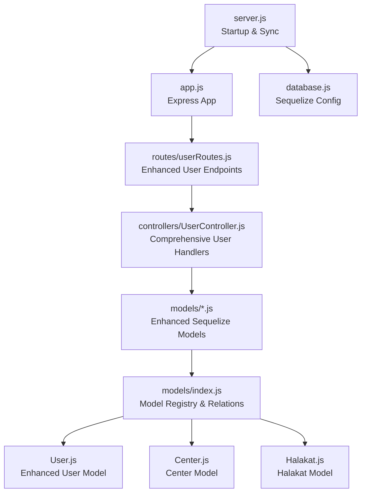
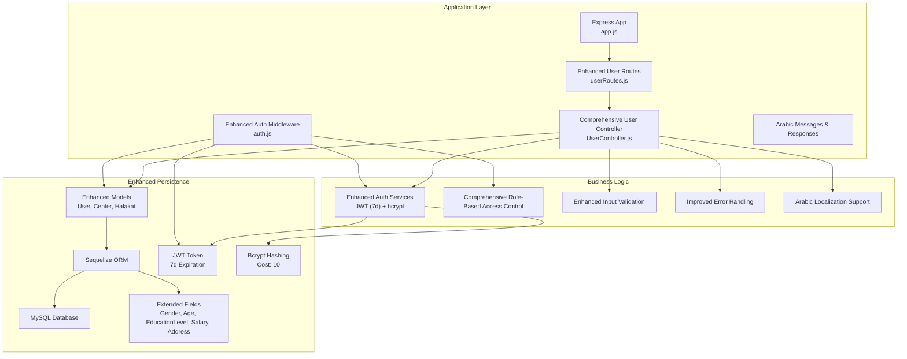
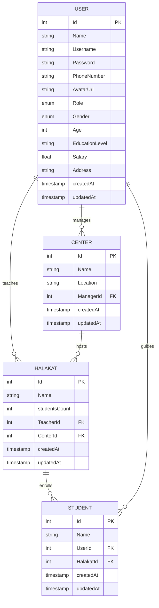
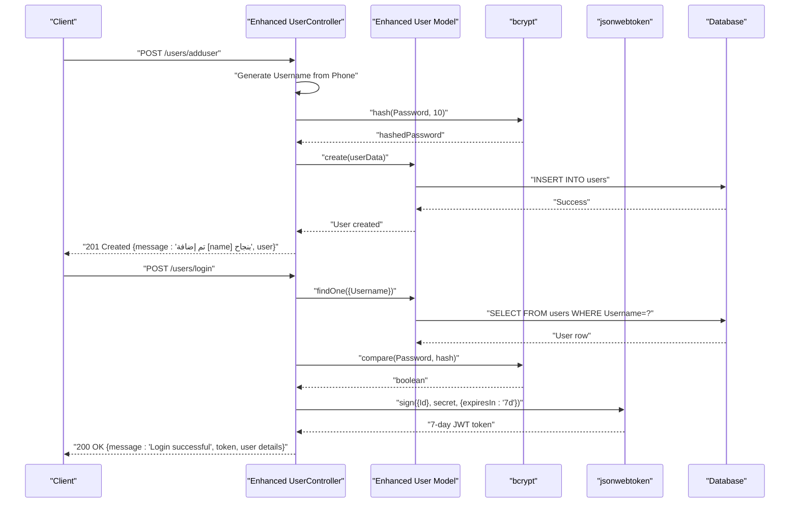
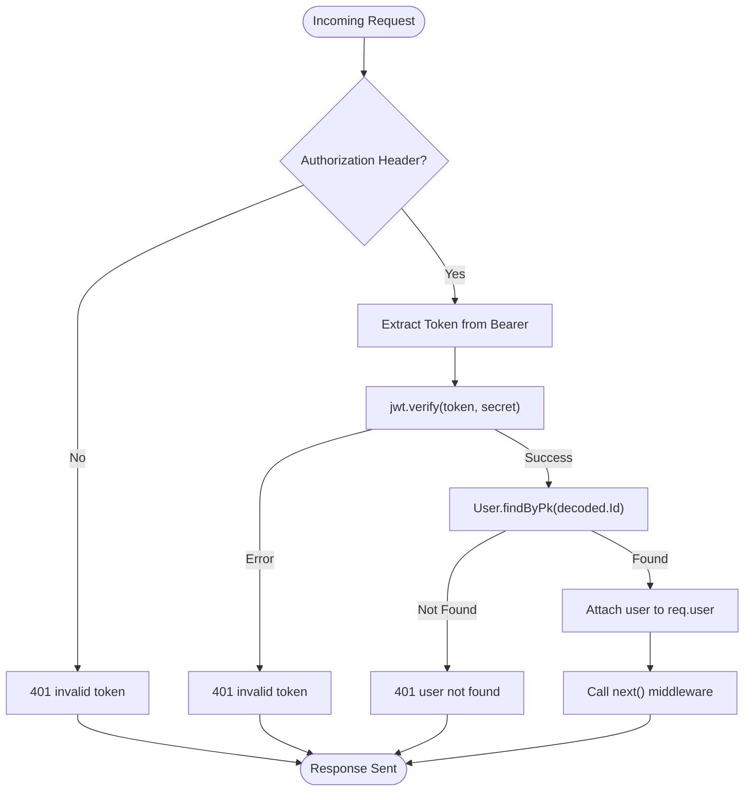
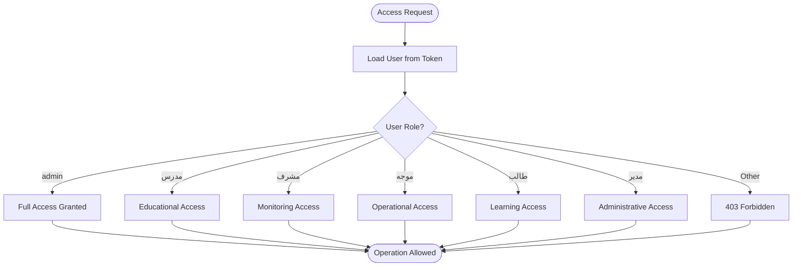
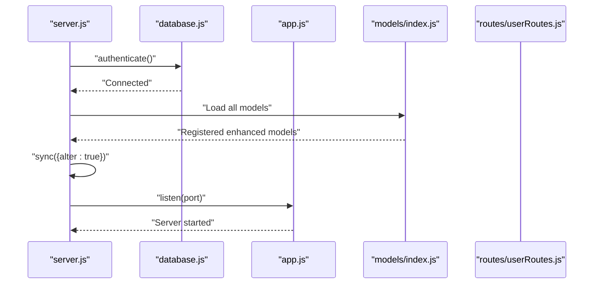
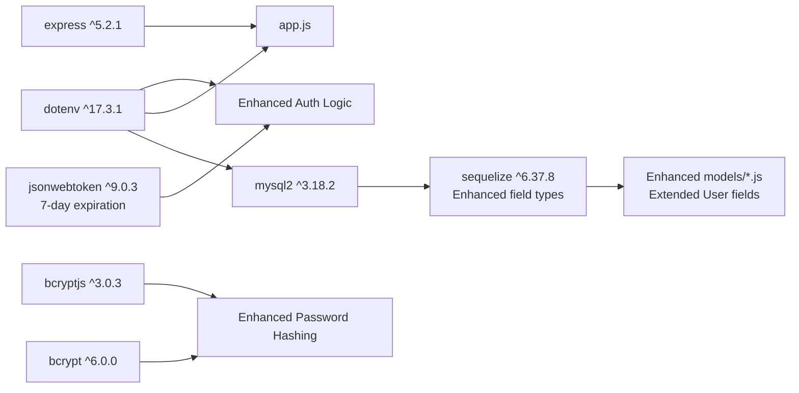

# User Management System

<cite>
**Referenced Files in This Document**
- [server.js](file://backend/server.js)
- [app.js](file://backend/src/config/app.js)
- [database.js](file://backend/src/config/database.js)
- [UserController.js](file://backend/src/controllers/UserController.js)
- [userRoutes.js](file://backend/src/routes/userRoutes.js)
- [auth.js](file://backend/src/middleware/auth.js)
- [User.js](file://backend/src/models/User.js)
- [index.js](file://backend/src/models/index.js)
- [Center.js](file://backend/src/models/Center.js)
- [Halakat.js](file://backend/src/models/Halakat.js)
- [package.json](file://backend/package.json)
</cite>

## Update Summary
**Changes Made**
- Enhanced UserController.js with comprehensive data validation and sanitization
- Added Arabic localization support throughout user management operations
- Implemented new user management operations: GetUsers, GetUserByName, UpdateUser, DeleteUser
- Improved login system with enhanced error handling and 7-day token expiration configuration
- Expanded User model with additional fields (Gender, Age, EducationLevel, Salary, Address)
- Added comprehensive role validation with Arabic terminology (admin, مدرس, مشرف, موجه, طالب, مدير)
- Enhanced authentication middleware with improved token validation and user loading

## Table of Contents
1. [Introduction](#introduction)
2. [Project Structure](#project-structure)
3. [Core Components](#core-components)
4. [Architecture Overview](#architecture-overview)
5. [Detailed Component Analysis](#detailed-component-analysis)
6. [Dependency Analysis](#dependency-analysis)
7. [Performance Considerations](#performance-considerations)
8. [Troubleshooting Guide](#troubleshooting-guide)
9. [Conclusion](#conclusion)

## Introduction
This document describes the enhanced user management system for the Khirocom platform with comprehensive User model and authentication infrastructure. The system now includes a fully functional UserController with extensive user management capabilities, integrated bcrypt for secure password hashing, JWT-based authentication with extended token expiration, and comprehensive Arabic localization support. The system supports five distinct user roles with Arabic terminology (admin, مدرس, مشرف, موجه, طالب, مدير) and provides complete CRUD operations for user management.

## Project Structure
The backend follows a modern layered architecture with clear separation of concerns and comprehensive user management capabilities:
- Configuration: Express app initialization and database connection
- Models: Sequelize ORM models for User, Center, Halakat, and related entities with enhanced field support
- Routes: Dedicated user routes for comprehensive user operations
- Controllers: Business logic implementation for user registration, authentication, and management
- Middleware: Authentication middleware for JWT token validation with enhanced error handling
- Server bootstrap: Application startup and database synchronization

**Diagram sources**
- [server.js:1-25](file://backend/server.js#L1-L25)
- [app.js:1-16](file://backend/src/config/app.js#L1-L16)
- [database.js:1-16](file://backend/src/config/database.js#L1-L16)
- [userRoutes.js:1-17](file://backend/src/routes/userRoutes.js#L1-L17)
- [UserController.js:1-117](file://backend/src/controllers/UserController.js#L1-L117)
- [index.js:1-91](file://backend/src/models/index.js#L1-L91)
- [User.js:1-83](file://backend/src/models/User.js#L1-L83)
- [Center.js:1-39](file://backend/src/models/Center.js#L1-L39)
- [Halakat.js:1-46](file://backend/src/models/Halakat.js#L1-L46)

**Section sources**
- [server.js:1-25](file://backend/server.js#L1-L25)
- [app.js:1-16](file://backend/src/config/app.js#L1-L16)
- [database.js:1-16](file://backend/src/config/database.js#L1-L16)
- [userRoutes.js:1-17](file://backend/src/routes/userRoutes.js#L1-L17)
- [UserController.js:1-117](file://backend/src/controllers/UserController.js#L1-L117)
- [index.js:1-91](file://backend/src/models/index.js#L1-L91)

## Core Components
- **Enhanced User Model**: Defines comprehensive user identity, credentials, profile attributes, and Arabic roles with additional fields (Gender, Age, EducationLevel, Salary, Address)
- **Comprehensive UserController**: Implements extensive user management operations including registration, login, retrieval, updates, and deletion with Arabic localization
- **Enhanced Authentication Stack**: JWT library with 7-day expiration and bcrypt for secure tokenization and password hashing
- **Expanded Routing Structure**: Comprehensive user routes supporting all CRUD operations with Arabic endpoint naming
- **Robust Database Layer**: MySQL via Sequelize with environment-driven configuration and enhanced field types
- **Improved Express App**: JSON body parsing and organized route structure with middleware integration

Key capabilities:
- Complete user registration with validated fields and hashed passwords using bcrypt
- Enhanced login flow generating JWT tokens with 7-day expiration and comprehensive user data
- Comprehensive user retrieval operations (all users, by name, by ID)
- Advanced user management with selective field updates and bulk operations
- Complete user deletion with cascade handling
- Arabic localization throughout the system (Arabic role names, success messages, error responses)
- Enhanced RBAC enforcement via user roles with comprehensive validation
- Expanded relationships with Center and Halakat entities
- Comprehensive error handling, validation, and security measures

**Section sources**
- [User.js:1-83](file://backend/src/models/User.js#L1-L83)
- [UserController.js:1-117](file://backend/src/controllers/UserController.js#L1-L117)
- [userRoutes.js:1-17](file://backend/src/routes/userRoutes.js#L1-L17)
- [auth.js:1-25](file://backend/src/middleware/auth.js#L1-L25)
- [package.json:1-14](file://backend/package.json#L1-L14)
- [database.js:1-16](file://backend/src/config/database.js#L1-L16)
- [app.js:1-16](file://backend/src/config/app.js#L1-L16)

## Architecture Overview
The system initializes the Express app, authenticates to the database, registers models, and synchronizes the enhanced schema. The UserController handles all user-related operations with comprehensive error handling, validation, and Arabic localization. The authentication middleware validates JWT tokens for protected routes with enhanced security measures.

**Diagram sources**
- [server.js:1-25](file://backend/server.js#L1-L25)
- [app.js:1-16](file://backend/src/config/app.js#L1-L16)
- [userRoutes.js:1-17](file://backend/src/routes/userRoutes.js#L1-L17)
- [UserController.js:1-117](file://backend/src/controllers/UserController.js#L1-L117)
- [auth.js:1-25](file://backend/src/middleware/auth.js#L1-L25)
- [User.js:1-83](file://backend/src/models/User.js#L1-L83)
- [Center.js:1-39](file://backend/src/models/Center.js#L1-L39)
- [Halakat.js:1-46](file://backend/src/models/Halakat.js#L1-L46)

## Detailed Component Analysis

### Enhanced User Model Schema and Validation
The User model defines comprehensive identity and credential fields with extensive validation rules, Arabic role enumeration, and additional profile attributes for enhanced user management.

**Enhanced Fields and Constraints:**
- **Id**: Integer, primary key, auto-increment
- **Name**: String, required, for Arabic user display names
- **Username**: String, required, auto-generated from phone number if not provided
- **Password**: String up to 255 characters, required, with default fallback
- **PhoneNumber**: String, required, serves as username fallback
- **AvatarUrl**: String, optional, stores user avatar URLs
- **Role**: Enumerated value among admin, مدرس, مشرف, موجه, طالب, مدير; defaults to مدرس; required
- **Gender**: Enumerated value among ذكر, أنثى; defaults to ذكر; required
- **Age**: Integer, defaults to 0; required
- **EducationLevel**: String up to 256 characters, defaults to empty string; required
- **Salary**: Float, defaults to 0; required for staff members
- **Address**: String up to 256 characters, defaults to empty string; required

**Timestamps**: CreatedAt and UpdatedAt are automatically managed by Sequelize.

**Enhanced Validation Rules:**
- All non-optional fields must be present during creation
- Role must match one of the allowed Arabic values
- Password length is capped at 255 characters
- Email format validation through Sequelize constraints
- Gender must be one of the allowed Arabic values
- Age must be a non-negative integer
- Salary must be a non-negative float

**Enhanced Relationships:**
- One-to-one with Center via ManagerId (for admin/director roles)
- One-to-one with Halakat via TeacherId (for مدرس roles)
- One-to-many with Students through StudentUser relationship
- Enhanced hooks for automatic username generation from phone number

**Diagram sources**
- [User.js:1-83](file://backend/src/models/User.js#L1-L83)
- [Center.js:1-39](file://backend/src/models/Center.js#L1-L39)
- [Halakat.js:1-46](file://backend/src/models/Halakat.js#L1-L46)
- [index.js:21-27](file://backend/src/models/index.js#L21-L27)

**Section sources**
- [User.js:1-83](file://backend/src/models/User.js#L1-L83)
- [index.js:21-27](file://backend/src/models/index.js#L21-L27)

### Comprehensive User Registration and Authentication Flow
The UserController implements extensive user registration and login functionality with comprehensive security measures, Arabic localization, and enhanced error handling.

**Enhanced Registration Process:**
1. Client sends user details (Name, Username, Password, PhoneNumber, Gender, Age, EducationLevel, Role, Salary, Address)
2. Server automatically generates username from phone number if not provided
3. Server hashes the password using bcrypt with cost factor 10
4. Creates user record with hashed password and enhanced profile data
5. Returns success response with Arabic success message and user data

**Enhanced Login Process:**
1. Client submits Username and Password
2. Server finds user by Username
3. Compares provided password with stored hash using bcrypt
4. Generates JWT token with user ID and role with 7-day expiration
5. Returns comprehensive user information including all profile details and token

**Arabic Localization Features:**
- Success messages in Arabic ("تم إضافة [name] بنجاح")
- Error messages in Arabic ("User not found", "Invalid credentials")
- Role names in Arabic throughout the system
- Endpoint responses localized for Arabic-speaking users

**Diagram sources**
- [UserController.js:8-69](file://backend/src/controllers/UserController.js#L8-L69)
- [User.js:1-83](file://backend/src/models/User.js#L1-L83)
- [package.json:4-11](file://backend/package.json#L4-L11)

**Section sources**
- [UserController.js:8-69](file://backend/src/controllers/UserController.js#L8-L69)
- [userRoutes.js:8-9](file://backend/src/routes/userRoutes.js#L8-L9)
- [package.json:4-11](file://backend/package.json#L4-L11)

### Enhanced Authentication Middleware and Security
The authentication middleware provides robust JWT token validation for protecting routes with comprehensive error handling and Arabic localization support.

**Enhanced Security Features:**
- Validates presence of Authorization header with Arabic error messages
- Extracts token from "Bearer <token>" format
- Verifies JWT signature using shared secret
- Loads user from database and attaches to request
- Handles various error scenarios with appropriate HTTP status codes and Arabic messages
- Comprehensive logging for debugging and monitoring

**Enhanced Error Handling:**
- Missing Authorization header: "invalid token" (Arabic)
- Invalid token format: "invalid token" (Arabic)
- Expired token: "invalid token" (Arabic)
- User not found: "user not found" (Arabic)
- Database errors: Proper error propagation with Arabic context

**Diagram sources**
- [auth.js:4-24](file://backend/src/middleware/auth.js#L4-L24)

**Section sources**
- [auth.js:1-25](file://backend/src/middleware/auth.js#L1-L25)

### Comprehensive Role-Based Access Control (RBAC)
The system supports six distinct roles with comprehensive Arabic terminology, each with specific permissions and responsibilities for enhanced educational management.

**Enhanced Supported Roles:**
- **admin**: Full system administration privileges
- **مدرس (teacher)**: Educational content management and student supervision
- **مشرف (supervisor)**: Monitoring and oversight functions
- **موجه (director)**: Operational management and reporting
- **طالب (student)**: Learning and progress tracking
- **مدير (manager)**: Administrative management functions

**Enhanced Default role**: مدرس

**Enhanced RBAC Enforcement:**
- Controllers should check the authenticated user's role before granting access
- Different roles have different permissions for CRUD operations
- Role validation occurs at the middleware level for protected routes
- Role-based authorization determines access to sensitive operations
- Enhanced role validation with comprehensive Arabic role names
- Support for expanded role hierarchy in educational institutions

**Section sources**
- [User.js:39-42](file://backend/src/models/User.js#L39-L42)
- [UserController.js:35-69](file://backend/src/controllers/UserController.js#L35-L69)

### Enhanced Database Initialization and Synchronization
The server bootstraps the application with comprehensive error handling, logging, and enhanced model synchronization for the expanded user management system.

**Enhanced Boot Process:**
- Authenticates to the database with comprehensive error handling
- Loads all models including enhanced User model with additional fields
- Synchronizes schema changes with alter:true for development
- Starts the Express server with proper logging
- Registers all routes including new user management endpoints

**Diagram sources**
- [server.js:8-23](file://backend/server.js#L8-L23)
- [database.js:4-15](file://backend/src/config/database.js#L4-L15)
- [index.js:1-91](file://backend/src/models/index.js#L1-L91)

**Section sources**
- [server.js:1-25](file://backend/server.js#L1-L25)
- [database.js:1-16](file://backend/src/config/database.js#L1-L16)

### Comprehensive User Management Operations
The enhanced UserController.js implements extensive user management operations with Arabic localization, comprehensive validation, and robust error handling.

**Available Operations:**
1. **AddUser**: Complete user registration with enhanced validation
2. **Login**: Secure authentication with 7-day token expiration
3. **GetUsers**: Retrieve all users with comprehensive filtering
4. **GetUserByName**: Search users by Arabic name
5. **UpdateUser**: Selective field updates with validation
6. **DeleteUser**: Complete user removal with cascade handling
7. **getme**: Retrieve currently authenticated user
8. **getteachers**: Filter users by teacher role

**Enhanced Features:**
- Arabic success and error messages throughout all operations
- Comprehensive input validation and sanitization
- Selective field updates with allowedUpdates array
- Enhanced error handling with appropriate HTTP status codes
- Arabic endpoint naming and response localization
- Extended user profile fields for comprehensive management

**Section sources**
- [UserController.js:8-117](file://backend/src/controllers/UserController.js#L8-L117)
- [userRoutes.js:8-13](file://backend/src/routes/userRoutes.js#L8-L13)

## Dependency Analysis
External libraries and their enhanced roles in the comprehensive user management system:
- **express ^5.2.1**: Web framework for routing and middleware with enhanced user operations
- **jsonwebtoken ^9.0.3**: JWT signing and verification for authentication with 7-day expiration
- **bcrypt ^6.0.0**: Password hashing with configurable cost factor for enhanced security
- **bcryptjs ^3.0.3**: Alternative bcrypt implementation for compatibility
- **mysql2 ^3.18.2**: MySQL driver for database connectivity with enhanced field support
- **sequelize ^6.37.8**: ORM for database modeling, relations, and enhanced field types
- **dotenv ^17.3.1**: Environment variable loading for configuration and JWT secrets

**Diagram sources**
- [package.json:2-12](file://backend/package.json#L2-L12)
- [database.js:1-16](file://backend/src/config/database.js#L1-L16)
- [app.js:1-16](file://backend/src/config/app.js#L1-L16)

**Section sources**
- [package.json:1-14](file://backend/package.json#L1-L14)

## Performance Considerations
- **Enhanced Hashing Cost**: Configured to 10 for balanced security and performance with improved password security
- **Indexing Strategy**: Consider adding indexes on Username, PhoneNumber, and Name fields for faster lookups
- **Extended Token Lifetime**: JWT expires in 7 days instead of 24 hours for better user experience
- **Connection Pooling**: Configure Sequelize pool settings for production workloads with enhanced concurrent connections
- **Enhanced Input Validation**: Early validation reduces database round trips and improves security
- **Comprehensive Error Handling**: Robust error handling prevents cascading failures and provides Arabic error messages
- **Logging Enhancement**: Strategic logging helps with debugging without exposing sensitive information
- **Arabic Localization**: Optimized response handling for Arabic language support
- **Database Field Optimization**: Efficient storage of enhanced user profile fields

## Troubleshooting Guide
Common issues and resolutions for the enhanced user management system:

**Database Connectivity:**
- Verify environment variables (DB_NAME, DB_USER, DB_PASSWORD, DB_HOST, DB_PORT)
- Check network connectivity and MySQL service status
- Review database credentials and permissions
- Ensure enhanced User table schema matches model definitions

**Enhanced Authentication Failures:**
- Confirm JWT_SECRET environment variable is set
- Verify token format (Bearer <token>) with 7-day expiration
- Check token expiration and signature validity
- Ensure bcrypt cost factor compatibility
- Verify Arabic role names in database match model definitions

**Route Access Issues:**
- Verify routes are properly mounted (/users prefix)
- Check authentication middleware is correctly applied to protected routes
- Confirm Authorization header format
- Verify Arabic endpoint names match route definitions

**Enhanced Model Synchronization:**
- Review schema differences and resolve conflicts for new fields
- Check foreign key constraints and references
- Verify enum values match User model definitions (including new roles)
- Ensure hooks for username generation are functioning

**Missing Controller Methods:**
- Verify all referenced methods (GetUsers, getteachers) exist in UserController.js
- Check for proper export statements for all controller methods
- Ensure method names match route definitions

**Operational Checks:**
- Confirm server startup logs show successful database connection
- Validate that all models are registered in the model registry
- Test endpoints with proper JSON payloads and headers
- Verify Arabic localization works correctly across all responses
- Check that enhanced user fields are properly handled

**Section sources**
- [server.js:8-22](file://backend/server.js#L8-L22)
- [database.js:4-15](file://backend/src/config/database.js#L4-L15)
- [auth.js:6-23](file://backend/src/middleware/auth.js#L6-L23)
- [UserController.js:1-117](file://backend/src/controllers/UserController.js#L1-L117)

## Conclusion
The enhanced Khirocom user management system now provides a comprehensive foundation for identity and access control using Sequelize, JWT, and bcrypt with extensive Arabic localization support. The enhanced UserController implementation supports secure user registration, authentication, and complete user management workflows with comprehensive CRUD operations. The enhanced User model encapsulates essential identity fields with Arabic role terminology, comprehensive profile attributes, and robust validation. The system now supports six distinct roles (admin, مدرس, مشرف, موجه, طالب, مدير) with Arabic names and provides complete user lifecycle management including registration, authentication, profile management, role-aware access, and comprehensive administrative operations. With enhanced RBAC enforcement, comprehensive error handling, secure JWT token management with 7-day expiration, and Arabic localization throughout the system, the enhanced architecture can reliably support complex educational institution workflows with robust security and user-friendly Arabic interface.