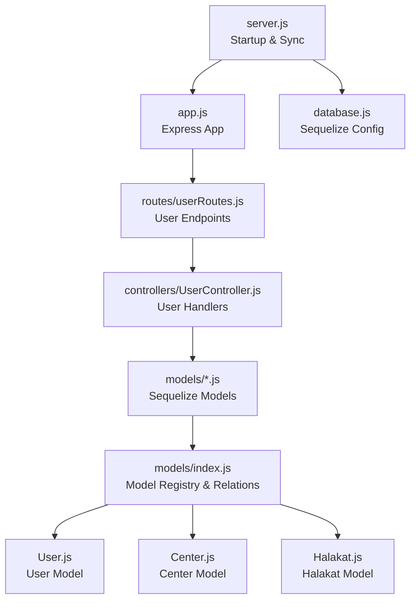
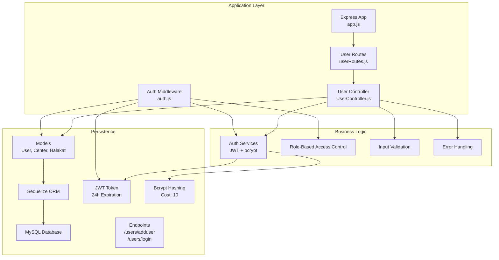
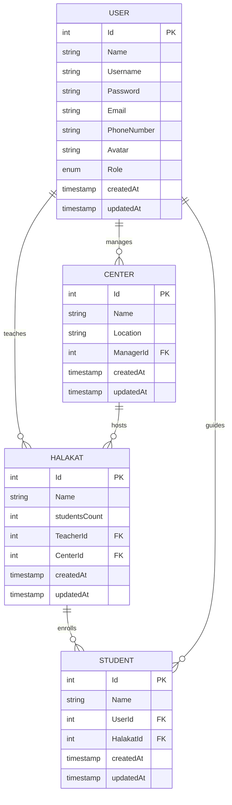
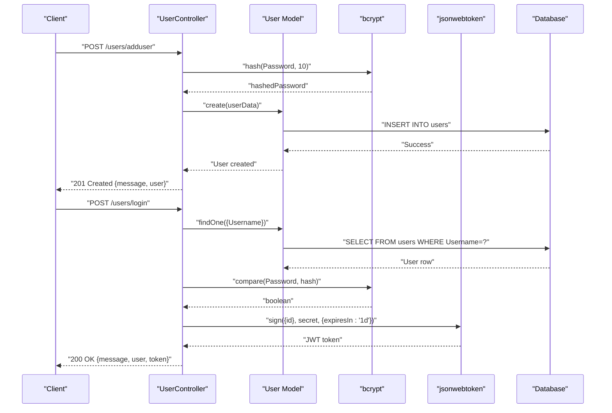
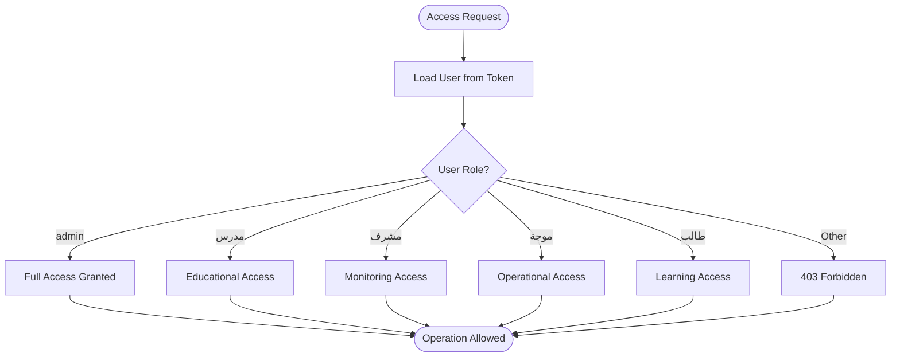
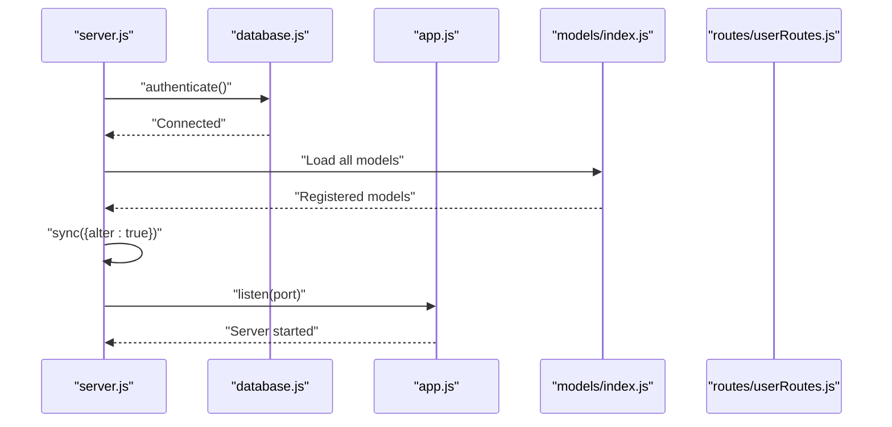
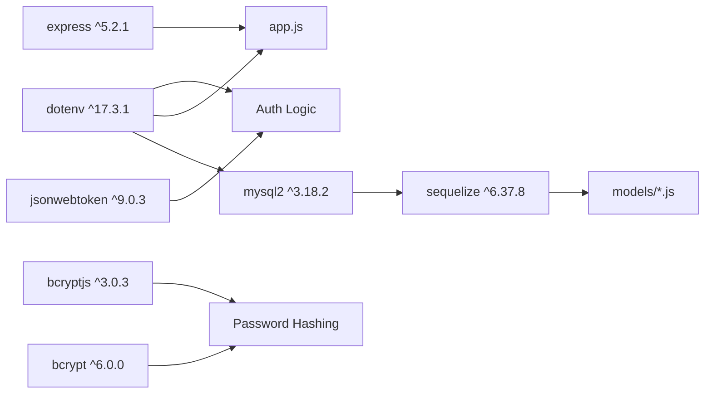

# User Management System

<cite>
**Referenced Files in This Document**
- [server.js](file://backend/server.js)
- [app.js](file://backend/src/config/app.js)
- [database.js](file://backend/src/config/database.js)
- [UserController.js](file://backend/src/controllers/UserController.js)
- [userRoutes.js](file://backend/src/routes/userRoutes.js)
- [auth.js](file://backend/src/middleware/auth.js)
- [User.js](file://backend/src/models/User.js)
- [index.js](file://backend/src/models/index.js)
- [Center.js](file://backend/src/models/Center.js)
- [Halakat.js](file://backend/src/models/Halakat.js)
- [package.json](file://backend/package.json)
</cite>

## Update Summary
**Changes Made**
- Updated User Model to reflect Arabic role values (admin, مدرس, مشرف, موجة, طالب)
- Added comprehensive UserController with registration and login functionality
- Integrated bcrypt for password hashing with proper error handling
- Established proper routing structure with dedicated user routes
- Enhanced authentication middleware with JWT token validation
- Updated database initialization and synchronization process

## Table of Contents
1. [Introduction](#introduction)
2. [Project Structure](#project-structure)
3. [Core Components](#core-components)
4. [Architecture Overview](#architecture-overview)
5. [Detailed Component Analysis](#detailed-component-analysis)
6. [Dependency Analysis](#dependency-analysis)
7. [Performance Considerations](#performance-considerations)
8. [Troubleshooting Guide](#troubleshooting-guide)
9. [Conclusion](#conclusion)

## Introduction
This document describes the user management system for the Khirocom platform with a focus on the User model and comprehensive authentication infrastructure. The system now includes a fully functional UserController with user registration and login capabilities, integrated bcrypt for secure password hashing, JWT-based authentication, and proper role-based access control (RBAC) mechanisms. It explains user roles, registration and profile management, authentication flow, and relationships with other entities such as Centers and Halakat.

## Project Structure
The backend follows a modern layered architecture with clear separation of concerns:
- Configuration: Express app initialization and database connection
- Models: Sequelize ORM models for User, Center, Halakat, and related entities
- Routes: Dedicated user routes for registration and authentication
- Controllers: Business logic implementation for user operations
- Middleware: Authentication middleware for JWT token validation
- Server bootstrap: Application startup and database synchronization

**Diagram sources**
- [server.js:1-25](file://backend/server.js#L1-L25)
- [app.js:1-16](file://backend/src/config/app.js#L1-L16)
- [database.js:1-16](file://backend/src/config/database.js#L1-L16)
- [userRoutes.js:1-8](file://backend/src/routes/userRoutes.js#L1-L8)
- [UserController.js:1-66](file://backend/src/controllers/UserController.js#L1-L66)
- [index.js:1-67](file://backend/src/models/index.js#L1-L67)
- [User.js:1-61](file://backend/src/models/User.js#L1-L61)
- [Center.js:1-39](file://backend/src/models/Center.js#L1-L39)
- [Halakat.js:1-47](file://backend/src/models/Halakat.js#L1-L47)

**Section sources**
- [server.js:1-25](file://backend/server.js#L1-L25)
- [app.js:1-16](file://backend/src/config/app.js#L1-L16)
- [database.js:1-16](file://backend/src/config/database.js#L1-L16)
- [userRoutes.js:1-8](file://backend/src/routes/userRoutes.js#L1-L8)
- [UserController.js:1-66](file://backend/src/controllers/UserController.js#L1-L66)
- [index.js:1-67](file://backend/src/models/index.js#L1-L67)

## Core Components
- **User Model**: Defines user identity, credentials, profile attributes, and Arabic roles (admin, مدرس, مشرف, موجة, طالب)
- **UserController**: Implements comprehensive user registration and login functionality with bcrypt integration
- **Authentication Stack**: JWT library and bcrypt for secure tokenization and password hashing
- **Routing Structure**: Dedicated user routes for adduser and login endpoints
- **Database Layer**: MySQL via Sequelize with environment-driven configuration
- **Express App**: JSON body parsing and organized route structure

Key capabilities:
- User registration with validated fields and hashed passwords using bcrypt
- Login flow generating JWT tokens with 24-hour expiration
- Profile management (updates to non-credential fields)
- RBAC enforcement via user roles with Arabic terminology
- Relationships with Center and Halakat entities
- Comprehensive error handling and validation

**Section sources**
- [User.js:1-61](file://backend/src/models/User.js#L1-L61)
- [UserController.js:1-66](file://backend/src/controllers/UserController.js#L1-L66)
- [userRoutes.js:1-8](file://backend/src/routes/userRoutes.js#L1-L8)
- [auth.js:1-25](file://backend/src/middleware/auth.js#L1-L25)
- [package.json:1-14](file://backend/package.json#L1-L14)
- [database.js:1-16](file://backend/src/config/database.js#L1-L16)
- [app.js:1-16](file://backend/src/config/app.js#L1-L16)

## Architecture Overview
The system initializes the Express app, authenticates to the database, registers models, and synchronizes the schema. The UserController handles all user-related operations with proper error handling and validation. The authentication middleware validates JWT tokens for protected routes.

**Diagram sources**
- [server.js:1-25](file://backend/server.js#L1-L25)
- [app.js:1-16](file://backend/src/config/app.js#L1-L16)
- [userRoutes.js:1-8](file://backend/src/routes/userRoutes.js#L1-L8)
- [UserController.js:1-66](file://backend/src/controllers/UserController.js#L1-L66)
- [auth.js:1-25](file://backend/src/middleware/auth.js#L1-L25)
- [User.js:1-61](file://backend/src/models/User.js#L1-L61)
- [Center.js:1-39](file://backend/src/models/Center.js#L1-L39)
- [Halakat.js:1-47](file://backend/src/models/Halakat.js#L1-L47)

## Detailed Component Analysis

### User Model Schema and Validation
The User model defines the core identity and credential fields with comprehensive validation rules and Arabic role enumeration for RBAC.

Fields and constraints:
- **Id**: Integer, primary key, auto-increment
- **Name**: String, required
- **Username**: String, required  
- **Password**: String up to 255 characters, required
- **Email**: String, required
- **PhoneNumber**: String, required
- **Avatar**: String, optional
- **Role**: Enumerated value among admin, مدرس, مشرف, موجة, طالب; defaults to مدرس; required

Timestamps: CreatedAt and UpdatedAt are automatically managed by Sequelize.

Validation rules:
- All non-optional fields must be present during creation
- Role must match one of the allowed Arabic values
- Password length is capped at 255 characters
- Email format validation through Sequelize constraints

Relationships:
- One-to-one with Center via ManagerId (for admin/manager roles)
- One-to-one with Halakat via TeacherId (for مدرس roles)
- One-to-many with Students through StudentUser relationship

**Diagram sources**
- [User.js:1-61](file://backend/src/models/User.js#L1-L61)
- [Center.js:1-39](file://backend/src/models/Center.js#L1-L39)
- [Halakat.js:1-47](file://backend/src/models/Halakat.js#L1-L47)
- [index.js:13-54](file://backend/src/models/index.js#L13-L54)

**Section sources**
- [User.js:1-61](file://backend/src/models/User.js#L1-L61)
- [index.js:13-54](file://backend/src/models/index.js#L13-L54)

### User Registration and Authentication Flow
The UserController implements comprehensive user registration and login functionality with proper security measures.

**Registration Process:**
1. Client sends user details (Name, Username, Password, Email, PhoneNumber)
2. Server hashes the password using bcrypt with cost factor 10
3. Creates user record with hashed password
4. Returns success response with user data

**Login Process:**
1. Client submits Username and Password
2. Server finds user by Username
3. Compares provided password with stored hash using bcrypt
4. Generates JWT token with user ID and role
5. Returns token and user information

**Diagram sources**
- [UserController.js:8-63](file://backend/src/controllers/UserController.js#L8-L63)
- [User.js:1-61](file://backend/src/models/User.js#L1-L61)
- [package.json:4-11](file://backend/package.json#L4-L11)

**Section sources**
- [UserController.js:8-63](file://backend/src/controllers/UserController.js#L8-L63)
- [userRoutes.js:5-6](file://backend/src/routes/userRoutes.js#L5-L6)
- [package.json:4-11](file://backend/package.json#L4-L11)

### Authentication Middleware and Security
The authentication middleware provides JWT token validation for protecting routes. It extracts the Authorization header, verifies the token signature, and loads the associated user.

Security features:
- Validates presence of Authorization header
- Extracts token from "Bearer <token>" format
- Verifies JWT signature using shared secret
- Loads user from database and attaches to request
- Handles various error scenarios with appropriate HTTP status codes

**Diagram sources**
- [auth.js:4-24](file://backend/src/middleware/auth.js#L4-L24)

**Section sources**
- [auth.js:1-25](file://backend/src/middleware/auth.js#L1-L25)

### Role-Based Access Control (RBAC)
The system supports five distinct roles with Arabic terminology, each with specific permissions and responsibilities:

**Supported Roles:**
- **admin**: Full system administration privileges
- **مدرس (teacher)**: Educational content management and student supervision
- **مشرف (supervisor)**: Monitoring and oversight functions
- **موجة (manager)**: Operational management and reporting
- **طالب (student)**: Learning and progress tracking

**Default role**: مدرس

RBAC enforcement:
- Controllers should check the authenticated user's role before granting access
- Different roles have different permissions for CRUD operations
- Role validation occurs at the middleware level for protected routes
- Role-based authorization determines access to sensitive operations

**Section sources**
- [User.js:44-48](file://backend/src/models/User.js#L44-L48)
- [UserController.js:42-46](file://backend/src/controllers/UserController.js#L42-L46)

### Database Initialization and Synchronization
The server bootstraps the application with comprehensive error handling and logging. It authenticates to the database, loads all models, synchronizes schema changes, and starts the Express server.

**Diagram sources**
- [server.js:8-23](file://backend/server.js#L8-L23)
- [database.js:4-15](file://backend/src/config/database.js#L4-L15)
- [index.js:1-67](file://backend/src/models/index.js#L1-L67)

**Section sources**
- [server.js:1-25](file://backend/server.js#L1-L25)
- [database.js:1-16](file://backend/src/config/database.js#L1-L16)

## Dependency Analysis
External libraries and their roles:
- **express**: Web framework for routing and middleware
- **jsonwebtoken**: JWT signing and verification for authentication
- **bcrypt**: Password hashing with configurable cost factor
- **bcryptjs**: Alternative bcrypt implementation
- **mysql2**: MySQL driver for database connectivity
- **sequelize**: ORM for database modeling and relations
- **dotenv**: Environment variable loading for configuration

**Diagram sources**
- [package.json:2-12](file://backend/package.json#L2-L12)
- [database.js:1-16](file://backend/src/config/database.js#L1-L16)
- [app.js:1-16](file://backend/src/config/app.js#L1-L16)

**Section sources**
- [package.json:1-14](file://backend/package.json#L1-L14)

## Performance Considerations
- **Hashing Cost**: Configured to 10 for balanced security and performance
- **Indexing**: Consider adding indexes on Username and Email fields for faster lookups
- **Token Lifetime**: JWT expires in 24 hours; consider refresh token strategy for production
- **Connection Pooling**: Configure Sequelize pool settings for production workloads
- **Input Validation**: Early validation reduces database round trips and improves security
- **Error Handling**: Comprehensive error handling prevents cascading failures
- **Logging**: Strategic logging helps with debugging without exposing sensitive information

## Troubleshooting Guide
Common issues and resolutions:

**Database Connectivity:**
- Verify environment variables (DB_NAME, DB_USER, DB_PASSWORD, DB_HOST, DB_PORT)
- Check network connectivity and MySQL service status
- Review database credentials and permissions

**Authentication Failures:**
- Confirm JWT_SECRET environment variable is set
- Verify token format (Bearer <token>)
- Check token expiration and signature validity
- Ensure bcrypt cost factor compatibility

**Route Access Issues:**
- Verify routes are properly mounted (/users prefix)
- Check authentication middleware is correctly applied
- Confirm Authorization header format

**Model Synchronization:**
- Review schema differences and resolve conflicts
- Check foreign key constraints and references
- Verify enum values match User model definitions

**Operational Checks:**
- Confirm server startup logs show successful database connection
- Validate that all models are registered in the model registry
- Test endpoints with proper JSON payloads and headers

**Section sources**
- [server.js:8-22](file://backend/server.js#L8-L22)
- [database.js:4-15](file://backend/src/config/database.js#L4-L15)
- [auth.js:6-23](file://backend/src/middleware/auth.js#L6-L23)

## Conclusion
The Khirocom user management system now provides a robust foundation for identity and access control using Sequelize, JWT, and bcrypt. The comprehensive UserController implementation supports secure user registration and authentication workflows. The User model encapsulates essential identity fields with Arabic role terminology, enforces validation, and integrates with Center and Halakat entities to support hierarchical educational workflows. With proper RBAC enforcement, comprehensive error handling, and secure JWT token management, the system can reliably support registration, authentication, profile management, and role-aware access to educational resources. The modular architecture ensures maintainability and extensibility for future enhancements.