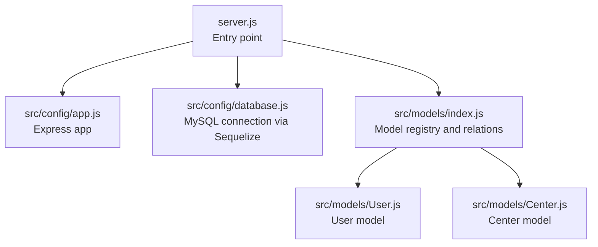
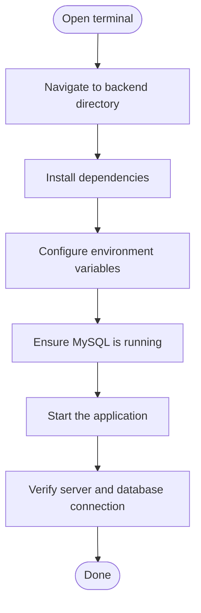
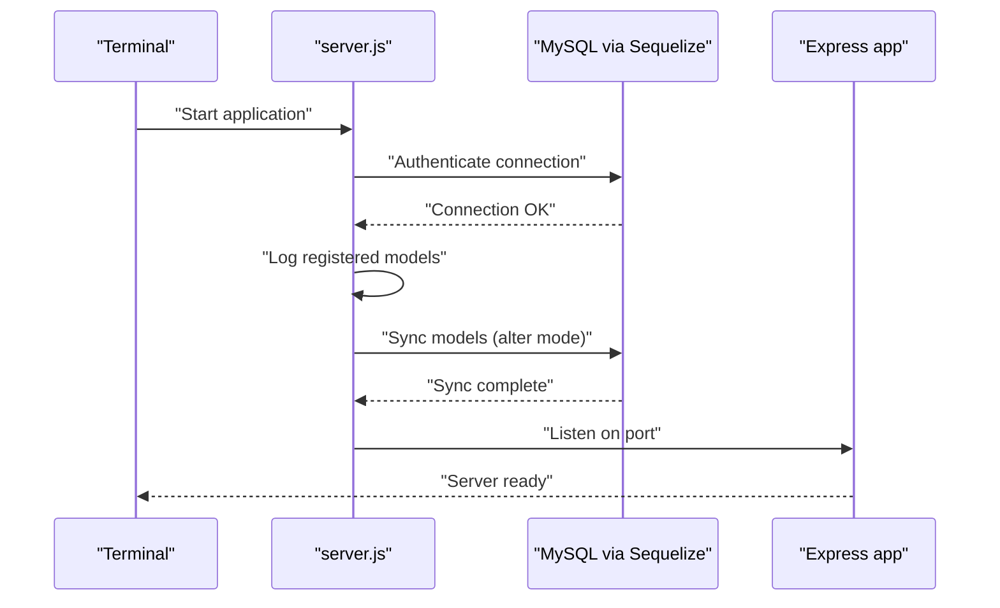
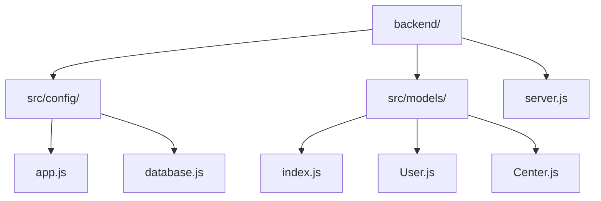

# Getting Started

<cite>
**Referenced Files in This Document**
- [README.md](file://README.md)
- [backend/package.json](file://backend/package.json)
- [backend/server.js](file://backend/server.js)
- [backend/src/config/app.js](file://backend/src/config/app.js)
- [backend/src/config/database.js](file://backend/src/config/database.js)
- [backend/src/models/index.js](file://backend/src/models/index.js)
- [backend/src/models/User.js](file://backend/src/models/User.js)
- [backend/src/models/Center.js](file://backend/src/models/Center.js)
</cite>

## Table of Contents
1. [Introduction](#introduction)
2. [Project Structure](#project-structure)
3. [Prerequisites](#prerequisites)
4. [Installation](#installation)
5. [Environment Configuration](#environment-configuration)
6. [Application Bootstrapping](#application-bootstrapping)
7. [Basic Project Structure and File Organization](#basic-project-structure-and-file-organization)
8. [Verification Steps](#verification-steps)
9. [Common Setup Issues and Solutions](#common-setup-issues-and-solutions)
10. [Conclusion](#conclusion)

## Introduction
This guide helps you set up and run the Khirocom project for the first time. It covers prerequisites, environment configuration, installation, and initial startup. You will learn how to connect to a MySQL database, configure environment variables, and verify that everything works as expected.

## Project Structure
The project follows a backend-focused structure with a clear separation of concerns:
- Application entry point initializes environment variables, loads the Express app, connects to the database, synchronizes models, and starts the server.
- Configuration files define the Express app and the database connection using Sequelize.
- Models define the database schema and relationships.

**Diagram sources**
- [backend/server.js:1-25](file://backend/server.js#L1-L25)
- [backend/src/config/app.js:1-12](file://backend/src/config/app.js#L1-L12)
- [backend/src/config/database.js:1-15](file://backend/src/config/database.js#L1-L15)
- [backend/src/models/index.js:1-52](file://backend/src/models/index.js#L1-L52)
- [backend/src/models/User.js:1-59](file://backend/src/models/User.js#L1-L59)
- [backend/src/models/Center.js:1-39](file://backend/src/models/Center.js#L1-L39)

**Section sources**
- [README.md:1-1](file://README.md#L1-L1)
- [backend/server.js:1-25](file://backend/server.js#L1-L25)
- [backend/src/config/app.js:1-12](file://backend/src/config/app.js#L1-L12)
- [backend/src/config/database.js:1-15](file://backend/src/config/database.js#L1-L15)
- [backend/src/models/index.js:1-52](file://backend/src/models/index.js#L1-L52)

## Prerequisites
- Node.js runtime: Install a stable LTS version compatible with the project dependencies.
- MySQL database: Ensure a MySQL server is installed and accessible. The application expects a MySQL database configured via environment variables.
- Git: Recommended for cloning the repository and managing local changes.

**Section sources**
- [backend/package.json:1-14](file://backend/package.json#L1-L14)

## Installation
Follow these steps to install and prepare the project locally:

1. Clone the repository to your machine.
2. Navigate to the backend directory.
3. Install dependencies using your preferred package manager.

[No sources needed since this diagram shows conceptual workflow, not actual code structure]

**Section sources**
- [backend/package.json:1-14](file://backend/package.json#L1-L14)

## Environment Configuration
The application reads configuration from environment variables. Define the following variables in your environment or a .env file located at the backend root:

- PORT: Port number for the Express server (default fallback is used if unset).
- DB_NAME: Name of the target MySQL database.
- DB_USER: MySQL username.
- DB_PASSWORD: MySQL password.
- DB_HOST: MySQL host address.
- DB_PORT: MySQL port number.

These variables are consumed by the database configuration module to establish a connection using Sequelize.

**Section sources**
- [backend/src/config/database.js:1-15](file://backend/src/config/database.js#L1-L15)
- [backend/server.js:6-6](file://backend/server.js#L6-L6)

## Application Bootstrapping
To start the application:

1. Ensure environment variables are configured.
2. From the backend directory, run the application using your package manager.
3. The server attempts to authenticate with the database, logs model registration, synchronizes models, and listens on the configured port.

**Diagram sources**
- [backend/server.js:8-25](file://backend/server.js#L8-L25)
- [backend/src/config/app.js:1-12](file://backend/src/config/app.js#L1-L12)
- [backend/src/config/database.js:1-15](file://backend/src/config/database.js#L1-L15)

**Section sources**
- [backend/server.js:1-25](file://backend/server.js#L1-L25)
- [backend/src/config/app.js:1-12](file://backend/src/config/app.js#L1-L12)
- [backend/src/config/database.js:1-15](file://backend/src/config/database.js#L1-L15)

## Basic Project Structure and File Organization
The backend directory organizes code by responsibility:

- src/config: Application and database configuration.
- src/models: Sequelize models and their relationships.
- server.js: Application entry point that orchestrates startup.

**Diagram sources**
- [backend/server.js:1-25](file://backend/server.js#L1-L25)
- [backend/src/config/app.js:1-12](file://backend/src/config/app.js#L1-L12)
- [backend/src/config/database.js:1-15](file://backend/src/config/database.js#L1-L15)
- [backend/src/models/index.js:1-52](file://backend/src/models/index.js#L1-L52)
- [backend/src/models/User.js:1-59](file://backend/src/models/User.js#L1-L59)
- [backend/src/models/Center.js:1-39](file://backend/src/models/Center.js#L1-L39)

**Section sources**
- [backend/server.js:1-25](file://backend/server.js#L1-L25)
- [backend/src/config/app.js:1-12](file://backend/src/config/app.js#L1-L12)
- [backend/src/config/database.js:1-15](file://backend/src/config/database.js#L1-L15)
- [backend/src/models/index.js:1-52](file://backend/src/models/index.js#L1-L52)

## Verification Steps
After starting the server, confirm the following:

- Database connection: The server logs a successful database authentication message during startup.
- Model registration: The server logs the list of registered models.
- Model synchronization: The server logs a successful model sync completion.
- Server listening: The server logs that it is listening on the configured port.

If any of these steps fail, review the environment variables and database connectivity.

**Section sources**
- [backend/server.js:8-25](file://backend/server.js#L8-L25)

## Common Setup Issues and Solutions
- Missing environment variables:
  - Symptom: Startup fails with errors related to undefined database credentials.
  - Solution: Set DB_NAME, DB_USER, DB_PASSWORD, DB_HOST, and DB_PORT in your environment or .env file.
- MySQL service not running:
  - Symptom: Authentication errors when connecting to the database.
  - Solution: Start the MySQL service and ensure the database exists and is reachable.
- Port already in use:
  - Symptom: Server fails to listen on the configured port.
  - Solution: Change the PORT environment variable to an available port.
- Sequelize model sync issues:
  - Symptom: Errors during model synchronization.
  - Solution: Review model definitions and relationships; ensure the database user has sufficient privileges.

**Section sources**
- [backend/src/config/database.js:1-15](file://backend/src/config/database.js#L1-L15)
- [backend/server.js:8-25](file://backend/server.js#L8-L25)

## Conclusion
You have installed dependencies, configured environment variables, and started the application. The server connects to MySQL, registers models, synchronizes them, and begins listening for requests. Use the verification steps to confirm a successful setup, and consult the troubleshooting section if you encounter issues.