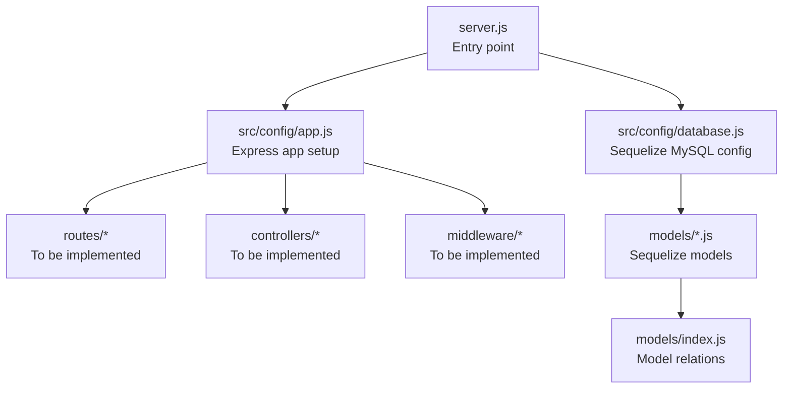
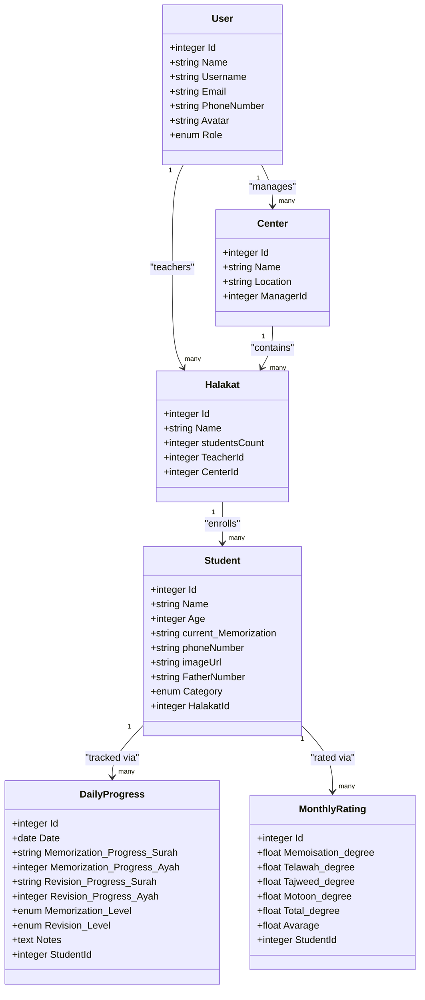
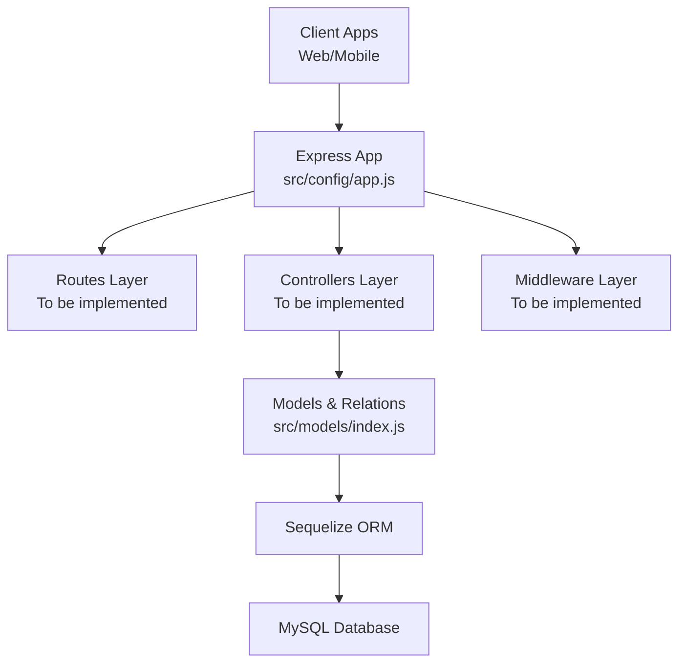
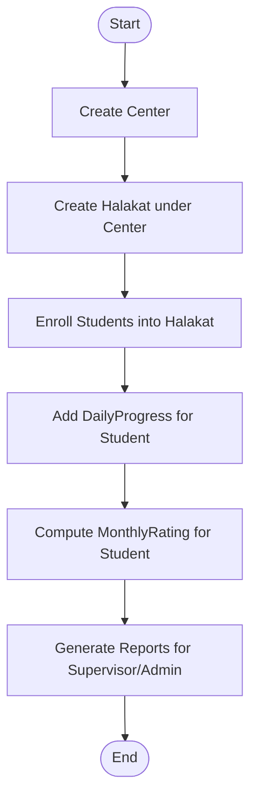
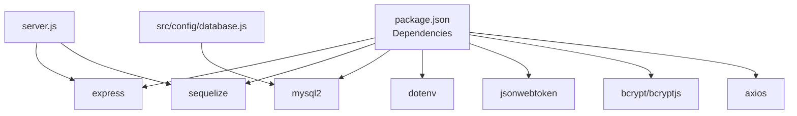

# Project Overview

<cite>
**Referenced Files in This Document**
- [README.md](file://README.md)
- [backend/server.js](file://backend/server.js)
- [backend/package.json](file://backend/package.json)
- [backend/src/config/app.js](file://backend/src/config/app.js)
- [backend/src/config/database.js](file://backend/src/config/database.js)
- [backend/src/models/index.js](file://backend/src/models/index.js)
- [backend/src/models/User.js](file://backend/src/models/User.js)
- [backend/src/models/Center.js](file://backend/src/models/Center.js)
- [backend/src/models/Halakat.js](file://backend/src/models/Halakat.js)
- [backend/src/models/Student.js](file://backend/src/models/Student.js)
- [backend/src/models/DailyProgress.js](file://backend/src/models/DailyProgress.js)
- [backend/src/models/MonthlyRating.js](file://backend/src/models/MonthlyRating.js)
</cite>

## Table of Contents
1. [Introduction](#introduction)
2. [Project Structure](#project-structure)
3. [Core Components](#core-components)
4. [Architecture Overview](#architecture-overview)
5. [Detailed Component Analysis](#detailed-component-analysis)
6. [Dependency Analysis](#dependency-analysis)
7. [Performance Considerations](#performance-considerations)
8. [Troubleshooting Guide](#troubleshooting-guide)
9. [Conclusion](#conclusion)

## Introduction
Khirocom is a backend-only application designed to support Quran memorization tracking in Islamic educational institutions. Built with Node.js, Express, and Sequelize ORM, it provides a structured platform for managing administrative, teaching, and progress-tracking workflows. The system targets administrators, teachers, supervisors, and managers who oversee student memorization programs. It organizes learning into “Halakat” (teaching groups), tracks daily progress via DailyProgress, and evaluates monthly performance through MonthlyRating, enabling scalable monitoring across centers and students.

Educational Context and Applications:
- Centers: Physical or virtual institutions that host Quran memorization programs.
- Halakat: Teaching groups led by a teacher under a center’s supervision.
- Students: Learners progressing through stages of memorization, tracked daily and rated monthly.
- Practical Hierarchy: Center → Halakat → Student, with Users managing centers and teaching groups.

Real-world Use Cases:
- Administrators manage center staff and monitor institution-wide metrics.
- Teachers track daily memorization and revision progress per student.
- Supervisors and managers review monthly ratings and overall averages to assess program effectiveness.
- Schools and memorization centers use the system to maintain records, generate reports, and support continuous improvement.

## Project Structure
The backend follows a conventional MVC-like structure with clear separation:
- Entry point initializes the Express app and connects to the database.
- Models define the data schema and relationships using Sequelize.
- Routes and controllers would handle HTTP requests and responses (currently minimal routing exists in the provided files).
- Middleware would enforce authentication and request preprocessing (not present in the provided files).
- Configuration files set up the Express app and Sequelize connection to MySQL.

**Diagram sources**
- [backend/server.js:1-25](file://backend/server.js#L1-L25)
- [backend/src/config/app.js:1-12](file://backend/src/config/app.js#L1-L12)
- [backend/src/config/database.js:1-15](file://backend/src/config/database.js#L1-L15)
- [backend/src/models/index.js:1-52](file://backend/src/models/index.js#L1-L52)

**Section sources**
- [backend/server.js:1-25](file://backend/server.js#L1-L25)
- [backend/src/config/app.js:1-12](file://backend/src/config/app.js#L1-L12)
- [backend/src/config/database.js:1-15](file://backend/src/config/database.js#L1-L15)
- [backend/src/models/index.js:1-52](file://backend/src/models/index.js#L1-L52)

## Core Components
This section introduces the primary entities and their roles in the Quran memorization tracking system.

- User
  - Represents administrators, teachers, supervisors, and managers.
  - Roles include admin, teacher, supervisor, and manager.
  - Links to Center (as manager) and Halakat (as teacher).

- Center
  - Institutions hosting memorization programs.
  - Managed by a User (manager).
  - Contains multiple Halakat groups.

- Halakat
  - Teaching groups (classes) within a Center.
  - Led by a User (teacher).
  - Enrolls multiple Students.

- Student
  - Learners enrolled in a Halakat.
  - Tracks personal details, category, and current memorization stage.
  - Associated with DailyProgress and MonthlyRating.

- DailyProgress
  - Records daily memorization and revision activities.
  - Captures Surah and Ayah progress, levels, and notes.
  - Tied to a single Student.

- MonthlyRating
  - Aggregates monthly performance across memorization, recitation, Tajweed, and Motoon.
  - Computes total and average scores per month.
  - Tied to a single Student.

**Diagram sources**
- [backend/src/models/User.js:1-59](file://backend/src/models/User.js#L1-L59)
- [backend/src/models/Center.js:1-39](file://backend/src/models/Center.js#L1-L39)
- [backend/src/models/Halakat.js:1-47](file://backend/src/models/Halakat.js#L1-L47)
- [backend/src/models/Student.js:1-67](file://backend/src/models/Student.js#L1-L67)
- [backend/src/models/DailyProgress.js:1-64](file://backend/src/models/DailyProgress.js#L1-L64)
- [backend/src/models/MonthlyRating.js:1-70](file://backend/src/models/MonthlyRating.js#L1-L70)

**Section sources**
- [backend/src/models/User.js:1-59](file://backend/src/models/User.js#L1-L59)
- [backend/src/models/Center.js:1-39](file://backend/src/models/Center.js#L1-L39)
- [backend/src/models/Halakat.js:1-47](file://backend/src/models/Halakat.js#L1-L47)
- [backend/src/models/Student.js:1-67](file://backend/src/models/Student.js#L1-L67)
- [backend/src/models/DailyProgress.js:1-64](file://backend/src/models/DailyProgress.js#L1-L64)
- [backend/src/models/MonthlyRating.js:1-70](file://backend/src/models/MonthlyRating.js#L1-L70)

## Architecture Overview
Khirocom uses a backend-focused architecture leveraging Node.js and Express for HTTP handling, Sequelize ORM for database modeling, and MySQL as the persistence layer. The server bootstraps the application, authenticates the database connection, synchronizes models, and starts the HTTP listener. The model layer defines entities and their relationships, forming the foundation for CRUD operations and reporting.

**Diagram sources**
- [backend/server.js:1-25](file://backend/server.js#L1-L25)
- [backend/src/config/app.js:1-12](file://backend/src/config/app.js#L1-L12)
- [backend/src/models/index.js:1-52](file://backend/src/models/index.js#L1-L52)

**Section sources**
- [backend/server.js:1-25](file://backend/server.js#L1-L25)
- [backend/src/config/app.js:1-12](file://backend/src/config/app.js#L1-L12)
- [backend/src/models/index.js:1-52](file://backend/src/models/index.js#L1-L52)

## Detailed Component Analysis

### Educational Hierarchy and Data Flow
The system enforces a clear hierarchy from centers down to students, enabling role-based access and targeted reporting:
- Center manages multiple Halakat.
- Halakat enrolls multiple Students.
- Students accumulate DailyProgress entries and MonthlyRating records.

[No sources needed since this diagram shows conceptual workflow, not actual code structure]

### Practical Example: Hierarchical Management
- Administrator creates a Center and assigns a Manager (User).
- Manager creates Halakat within the Center and assigns a Teacher (User).
- Teacher enrolls Students into the Halakat.
- Teacher records DailyProgress for each Student.
- Monthly, MonthlyRating aggregates performance for reporting.

[No sources needed since this section doesn't analyze specific files]

### Conceptual Overview for Beginners
- Halakat: Think of a teaching group where a teacher instructs a small set of students.
- DailyProgress: Each day, a teacher logs how much the student memorized and revised, along with a level indicator.
- MonthlyRating: At the end of the month, numerical scores are computed and averaged to reflect overall performance.

[No sources needed since this section provides general guidance]

## Dependency Analysis
External dependencies include Express for the web framework, Sequelize for ORM, and MySQL for storage. Environment variables configure database credentials and host settings.

**Diagram sources**
- [backend/package.json:1-14](file://backend/package.json#L1-L14)
- [backend/src/config/database.js:1-15](file://backend/src/config/database.js#L1-L15)
- [backend/server.js:1-25](file://backend/server.js#L1-L25)

**Section sources**
- [backend/package.json:1-14](file://backend/package.json#L1-L14)
- [backend/src/config/database.js:1-15](file://backend/src/config/database.js#L1-L15)
- [backend/server.js:1-25](file://backend/server.js#L1-L25)

## Performance Considerations
- Database Synchronization: The server attempts to synchronize models on startup. In production, prefer explicit migrations and controlled schema updates.
- Logging: Sequelize logging is disabled by default; enable only during development to avoid overhead.
- Indexing: Add database indexes on frequently queried foreign keys (e.g., StudentId, HalakatId) to improve join performance.
- Pagination: Implement pagination for listing large collections (e.g., Students per Halakat, DailyProgress per Student).
- Caching: Consider caching aggregated MonthlyRating summaries for dashboard views.

[No sources needed since this section provides general guidance]

## Troubleshooting Guide
Common startup and runtime issues:
- Database Authentication Failure: Verify environment variables for host, port, user, password, and database name.
- Port Conflicts: Change the port if 8000 is in use.
- Model Synchronization Errors: Review foreign key constraints and ensure referential integrity before syncing.
- CORS and Body Parsing: Ensure the Express app parses JSON and handles cross-origin requests if integrating frontend clients.

Operational checks:
- Confirm the server logs indicate successful database connection and model registration.
- Validate that the root endpoint responds appropriately.

**Section sources**
- [backend/server.js:1-25](file://backend/server.js#L1-L25)
- [backend/src/config/app.js:1-12](file://backend/src/config/app.js#L1-L12)
- [backend/src/config/database.js:1-15](file://backend/src/config/database.js#L1-L15)

## Conclusion
Khirocom provides a robust backend foundation for Quran memorization tracking in Islamic institutions. Its model-driven design supports a clear hierarchy from centers to students, while DailyProgress and MonthlyRating enable granular progress monitoring. With Express and Sequelize, the system offers a scalable and maintainable architecture suitable for educational environments requiring reliable data management and reporting.