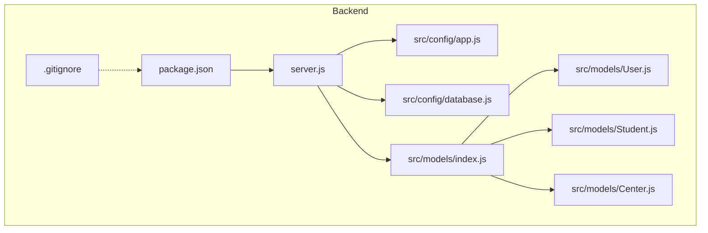
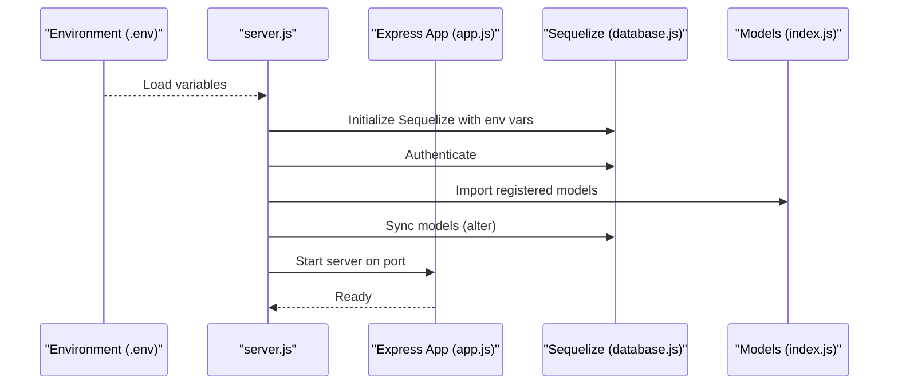
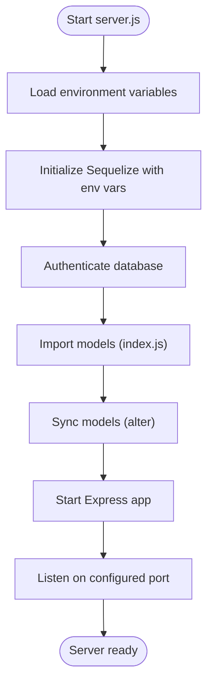
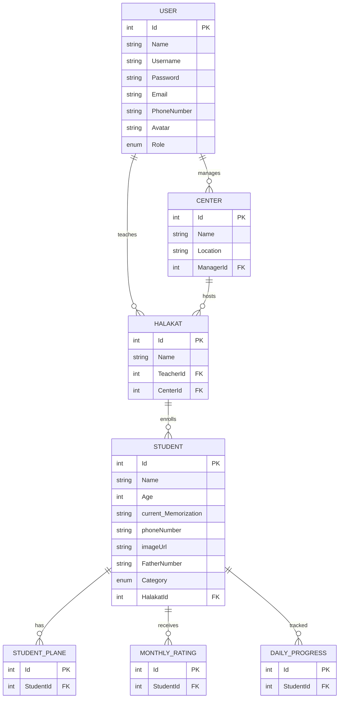
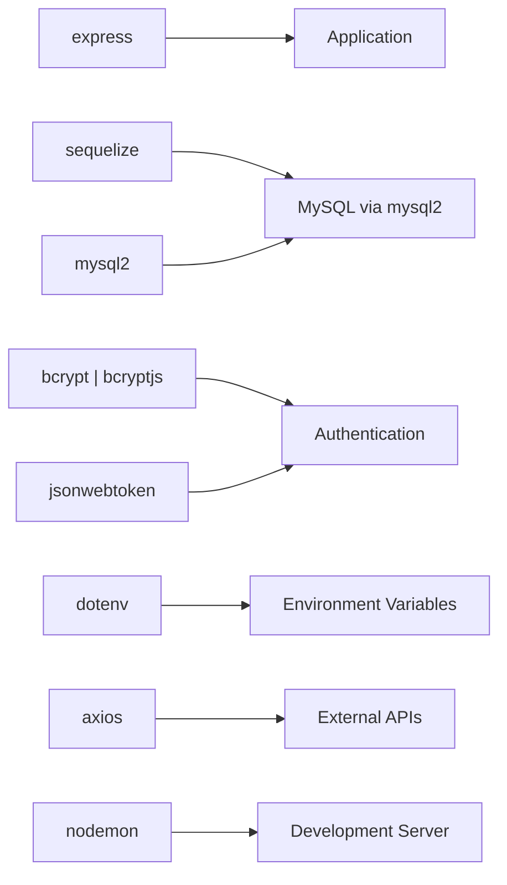

# Technology Stack & Dependencies

<cite>
**Referenced Files in This Document**
- [package.json](file://backend/package.json)
- [server.js](file://backend/server.js)
- [database.js](file://backend/src/config/database.js)
- [app.js](file://backend/src/config/app.js)
- [models/index.js](file://backend/src/models/index.js)
- [User.js](file://backend/src/models/User.js)
- [Student.js](file://backend/src/models/Student.js)
- [Center.js](file://backend/src/models/Center.js)
- [.gitignore](file://backend/.gitignore)
- [README.md](file://README.md)
</cite>

## Table of Contents
1. [Introduction](#introduction)
2. [Project Structure](#project-structure)
3. [Core Technologies](#core-technologies)
4. [Architecture Overview](#architecture-overview)
5. [Detailed Component Analysis](#detailed-component-analysis)
6. [Dependency Analysis](#dependency-analysis)
7. [Version Compatibility & Recommended Versions](#version-compatibility--recommended-versions)
8. [Build Process & Script Commands](#build-process--script-commands)
9. [Development Workflow](#development-workflow)
10. [Why These Technologies](#why-these-technologies)
11. [Security Considerations](#security-considerations)
12. [Maintenance & Updates](#maintenance--updates)
13. [Troubleshooting Guide](#troubleshooting-guide)
14. [Conclusion](#conclusion)

## Introduction
This document provides a comprehensive overview of the Khirocom project’s technology stack and dependency management. It focuses on the Node.js runtime, Express web framework, and Sequelize ORM for database operations. It also documents key dependencies such as MySQL2, Bcrypt, JWT, and Dotenv, along with development dependencies and operational scripts. The goal is to help developers evaluate and maintain the stack effectively for an educational management system.

## Project Structure
The backend is organized around a modular Node.js application with a clear separation of concerns:
- Configuration: Environment variables and database connection setup
- Application: Express server bootstrap and basic route handling
- Models: Sequelize ORM models and associations
- Tests: Test suite location placeholder
- Migrations and Seeders: Migration and seeding scaffolding present but empty in this snapshot

**Diagram sources**
- [server.js:1-25](file://backend/server.js#L1-L25)
- [app.js:1-12](file://backend/src/config/app.js#L1-L12)
- [database.js:1-15](file://backend/src/config/database.js#L1-L15)
- [models/index.js:1-52](file://backend/src/models/index.js#L1-L52)
- [User.js:1-59](file://backend/src/models/User.js#L1-L59)
- [Student.js:1-67](file://backend/src/models/Student.js#L1-L67)
- [Center.js:1-39](file://backend/src/models/Center.js#L1-L39)
- [package.json:1-14](file://backend/package.json#L1-L14)
- [.gitignore:1-5](file://backend/.gitignore#L1-L5)

**Section sources**
- [README.md:1-1](file://README.md#L1-L1)
- [package.json:1-14](file://backend/package.json#L1-L14)
- [server.js:1-25](file://backend/server.js#L1-L25)
- [database.js:1-15](file://backend/src/config/database.js#L1-L15)
- [app.js:1-12](file://backend/src/config/app.js#L1-L12)
- [models/index.js:1-52](file://backend/src/models/index.js#L1-L52)

## Core Technologies
- Node.js runtime: Provides the JavaScript execution environment for the backend.
- Express: Minimalist web framework for routing and middleware support.
- Sequelize: ORM for database modeling, relationships, and migrations.
- MySQL2: MySQL driver for Node.js used by Sequelize.
- Bcrypt: Password hashing library for secure credential storage.
- JWT: JSON Web Token library for authentication and sessionless state.
- Dotenv: Loads environment variables from a .env file into process.env.

These technologies collectively enable a modern, scalable, and maintainable backend for an educational management system with clear separation of concerns and robust data modeling.

**Section sources**
- [package.json:1-14](file://backend/package.json#L1-L14)
- [server.js:1-25](file://backend/server.js#L1-L25)
- [database.js:1-15](file://backend/src/config/database.js#L1-L15)
- [app.js:1-12](file://backend/src/config/app.js#L1-L12)

## Architecture Overview
The application initializes environment variables, connects to the database via Sequelize, synchronizes models, and starts the Express server. Models define entities and relationships, while the central index file registers models and sets up associations.

**Diagram sources**
- [server.js:1-25](file://backend/server.js#L1-L25)
- [database.js:1-15](file://backend/src/config/database.js#L1-L15)
- [models/index.js:1-52](file://backend/src/models/index.js#L1-L52)
- [app.js:1-12](file://backend/src/config/app.js#L1-L12)

## Detailed Component Analysis

### Express Application Bootstrap
- Initializes Express and enables JSON parsing.
- Serves a basic root endpoint.
- Exported for use by the server entry point.

**Section sources**
- [app.js:1-12](file://backend/src/config/app.js#L1-L12)

### Database Connection with Sequelize
- Uses environment variables for database credentials and host/port.
- Configures Sequelize with MySQL dialect and disables logging.
- Exports the Sequelize instance for model registration and server initialization.

**Section sources**
- [database.js:1-15](file://backend/src/config/database.js#L1-L15)

### Server Initialization and Lifecycle
- Loads environment variables at startup.
- Authenticates the database connection and logs success.
- Registers models and performs model synchronization with alter.
- Starts the Express server on a configurable port.

**Diagram sources**
- [server.js:1-25](file://backend/server.js#L1-L25)
- [database.js:1-15](file://backend/src/config/database.js#L1-L15)
- [models/index.js:1-52](file://backend/src/models/index.js#L1-L52)
- [app.js:1-12](file://backend/src/config/app.js#L1-L12)

**Section sources**
- [server.js:1-25](file://backend/server.js#L1-L25)

### Model Relationships Overview
The central models index registers core entities and defines relationships among them. This establishes foreign keys and association aliases used across the application.

**Diagram sources**
- [models/index.js:1-52](file://backend/src/models/index.js#L1-L52)
- [User.js:1-59](file://backend/src/models/User.js#L1-L59)
- [Student.js:1-67](file://backend/src/models/Student.js#L1-L67)
- [Center.js:1-39](file://backend/src/models/Center.js#L1-L39)

**Section sources**
- [models/index.js:1-52](file://backend/src/models/index.js#L1-L52)
- [User.js:1-59](file://backend/src/models/User.js#L1-L59)
- [Student.js:1-67](file://backend/src/models/Student.js#L1-L67)
- [Center.js:1-39](file://backend/src/models/Center.js#L1-L39)

## Dependency Analysis
The backend declares the following primary dependencies:
- axios: HTTP client for external requests
- bcrypt/bcryptjs: Password hashing libraries
- dotenv: Environment variable loader
- express: Web framework
- jsonwebtoken: JWT library for authentication
- mysql2: MySQL driver for Node.js
- nodemon: Development-time auto-reload
- sequelize: ORM for database modeling

**Diagram sources**
- [package.json:1-14](file://backend/package.json#L1-L14)

**Section sources**
- [package.json:1-14](file://backend/package.json#L1-L14)

## Version Compatibility & Recommended Versions
- Node.js: Use LTS versions (e.g., 18.x or 20.x) for stability and long-term support.
- Express: Align with current major releases; ensure compatibility with latest Node LTS.
- Sequelize: Keep aligned with the latest stable release to benefit from bug fixes and MySQL dialect improvements.
- MySQL2: Match to the target MySQL server version; ensure TLS and charset compatibility.
- Bcrypt/Bcryptjs: Choose one consistently across the project; bcryptjs is lightweight and pure JavaScript; bcrypt offers native performance.
- JWT: Use the latest stable version for security patches and standardized claims support.
- Dotenv: Use a recent version to support extended environment variable loading features.
- Nodemon: Development tool; latest version recommended for improved file watching and platform support.

Recommended alignment:
- Node.js: 18.x or 20.x
- Express: Latest v5.x
- Sequelize: Latest v6.x
- MySQL2: Latest v3.x
- Bcrypt: Latest v6.x (prefer bcrypt over bcryptjs for production)
- JWT: Latest v9.x
- Dotenv: Latest v17.x
- Axios: Latest stable
- Nodemon: Latest v3.x

[No sources needed since this section provides general guidance]

## Build Process & Script Commands
- The repository snapshot does not include a build step or explicit script commands in package.json. The application runs directly with Node.js and relies on development-time hot reloading via Nodemon.
- Typical commands you might expect in a Node.js project include:
  - dev: Start the development server with hot reload
  - start: Run the production server
  - test: Execute the test suite
  - migrate: Run database migrations
  - seed: Populate initial data
- Current state: No scripts are defined in the provided package.json. Development likely involves running server.js directly or using nodemon for local iteration.

**Section sources**
- [package.json:1-14](file://backend/package.json#L1-L14)
- [server.js:1-25](file://backend/server.js#L1-L25)

## Development Workflow
- Environment Management: Dotenv loads variables from a .env file. Ensure sensitive variables are excluded from version control via .gitignore.
- Local Development: Start the server with nodemon for automatic restarts during development.
- Database Sync: The server attempts to synchronize models with alter. Use migrations for production deployments.
- Testing: Tests are located under the tests directory; integrate a testing framework as needed.
- CI/CD: Add automated linting, testing, and deployment steps to your pipeline.

**Section sources**
- [server.js:1-25](file://backend/server.js#L1-L25)
- [.gitignore:1-5](file://backend/.gitignore#L1-L5)

## Why These Technologies
- Node.js + Express: Lightweight, fast, and ideal for REST APIs and educational systems requiring rapid iteration.
- Sequelize + MySQL2: Mature ORM with strong MySQL support, clear model definitions, and association mapping suitable for relational schemas.
- Bcrypt: Industry-standard password hashing with configurable cost for security.
- JWT: Stateless authentication tokens for scalability and ease of use across microservices or single-page applications.
- Dotenv: Centralized environment configuration management for local, staging, and production environments.

[No sources needed since this section provides general guidance]

## Security Considerations
- Environment Variables: Store secrets in .env and exclude it from version control. Rotate secrets periodically.
- Password Hashing: Use Bcrypt with appropriate cost settings to resist brute-force attacks.
- Authentication Tokens: Sign JWTs with a strong secret; set short expiration times and refresh token strategies.
- Input Validation: Sanitize and validate all inputs; apply rate limiting and CORS policies.
- Database Access: Limit database privileges; avoid exposing admin credentials; use encrypted connections.
- Dependencies: Regularly audit dependencies for vulnerabilities and keep them updated.

[No sources needed since this section provides general guidance]

## Maintenance & Updates
- Dependency Updates: Use a dependency management tool to track and update packages; test after each update.
- Security Audits: Periodically run security audits on dependencies and address reported vulnerabilities.
- Database Migrations: Prefer migrations over alter for production-safe schema changes.
- Logging and Monitoring: Add structured logging and monitoring to detect issues early.
- Documentation: Keep configuration and environment documentation up to date.

[No sources needed since this section provides general guidance]

## Troubleshooting Guide
- Database Connection Failures: Verify environment variables for host, port, username, password, and database name. Confirm the database service is reachable.
- Model Synchronization Errors: Review model definitions and associations for correctness. Use migrations for production-safe changes.
- Port Conflicts: Change the PORT environment variable if the default port is in use.
- Environment Loading Issues: Ensure .env exists and is properly formatted; confirm dotenv is loaded before accessing environment variables.
- Development Server Not Restarting: Verify nodemon installation and watch patterns; ensure file changes trigger reloads.

**Section sources**
- [server.js:1-25](file://backend/server.js#L1-L25)
- [database.js:1-15](file://backend/src/config/database.js#L1-L15)
- [.gitignore:1-5](file://backend/.gitignore#L1-L5)

## Conclusion
Khirocom’s backend leverages a solid, modern stack built on Node.js, Express, and Sequelize with MySQL2 for persistence. Supporting libraries like Bcrypt, JWT, and Dotenv provide robust authentication, secure token handling, and environment management. While the current snapshot lacks explicit build scripts and migrations, the architecture supports straightforward development and future enhancements. Adopting recommended versions, maintaining strict security practices, and following a disciplined update and maintenance routine will ensure a reliable and scalable system for educational management.